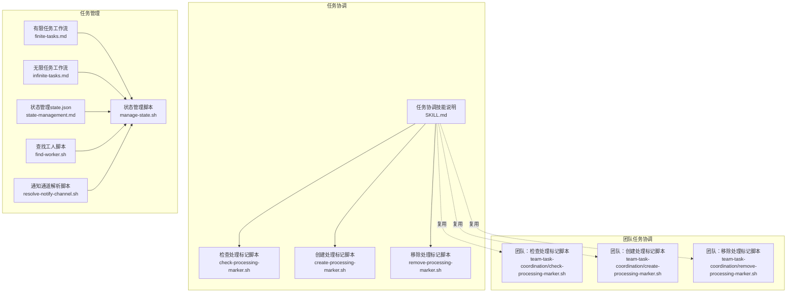
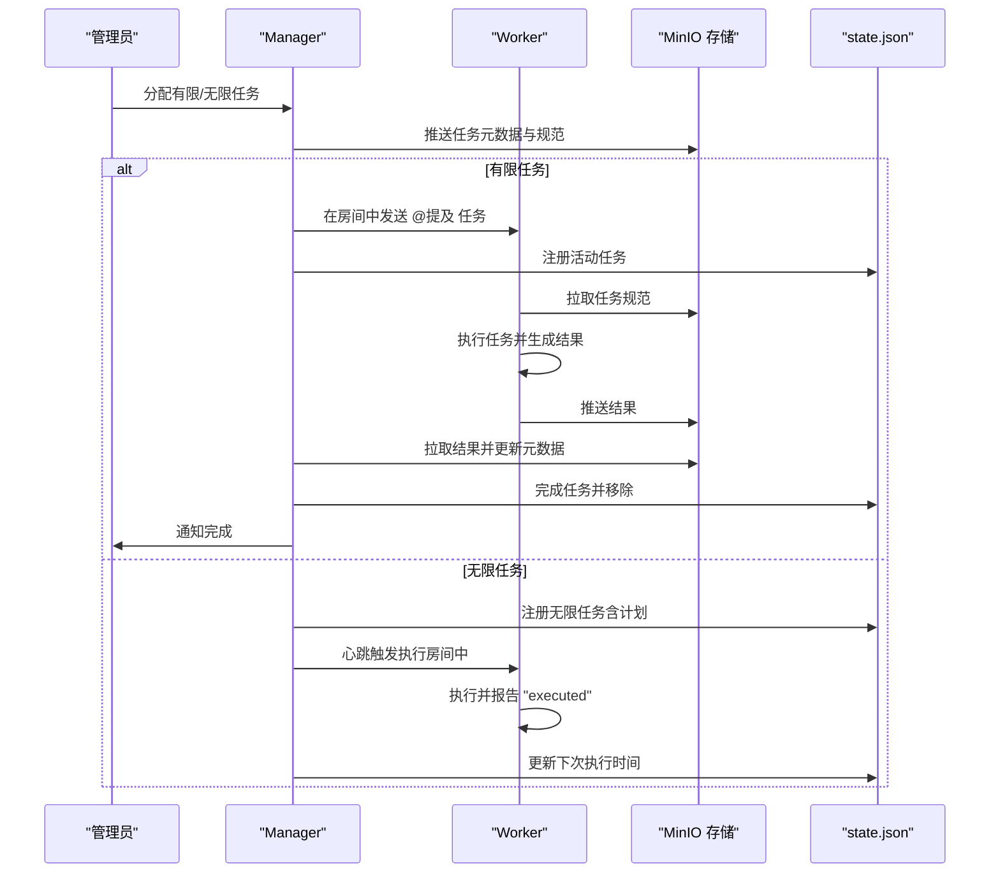
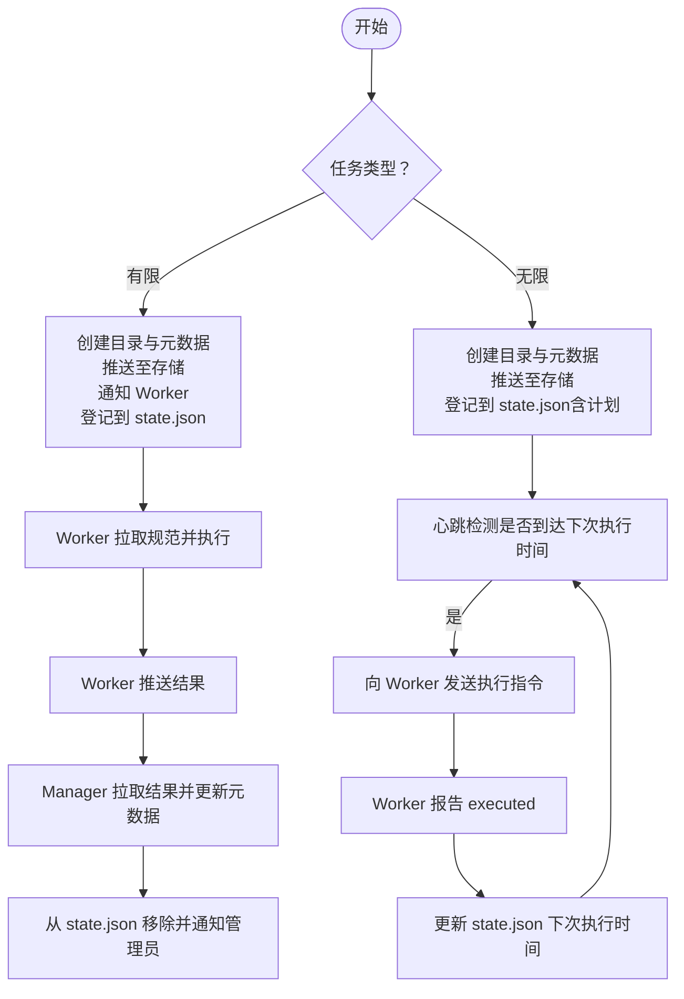
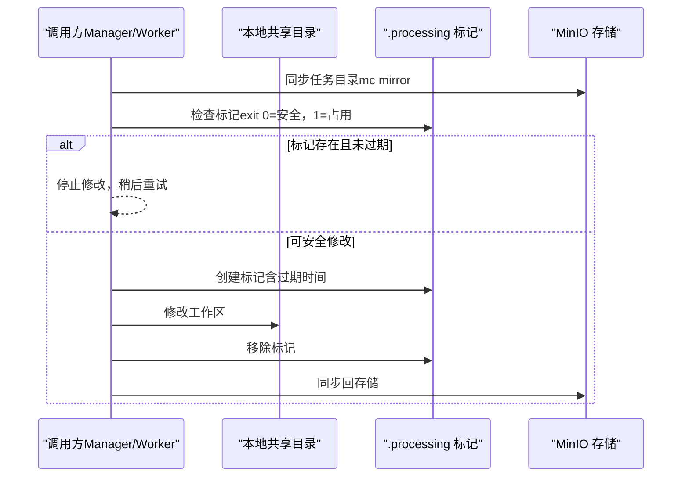
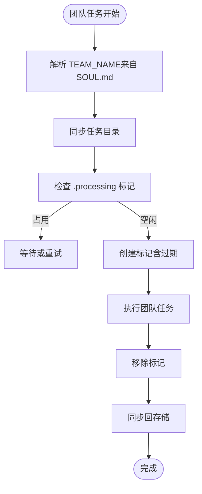
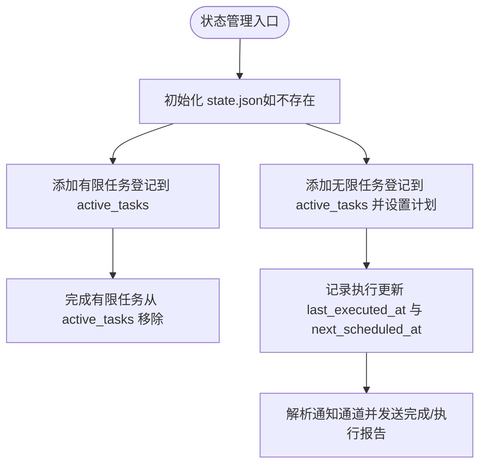
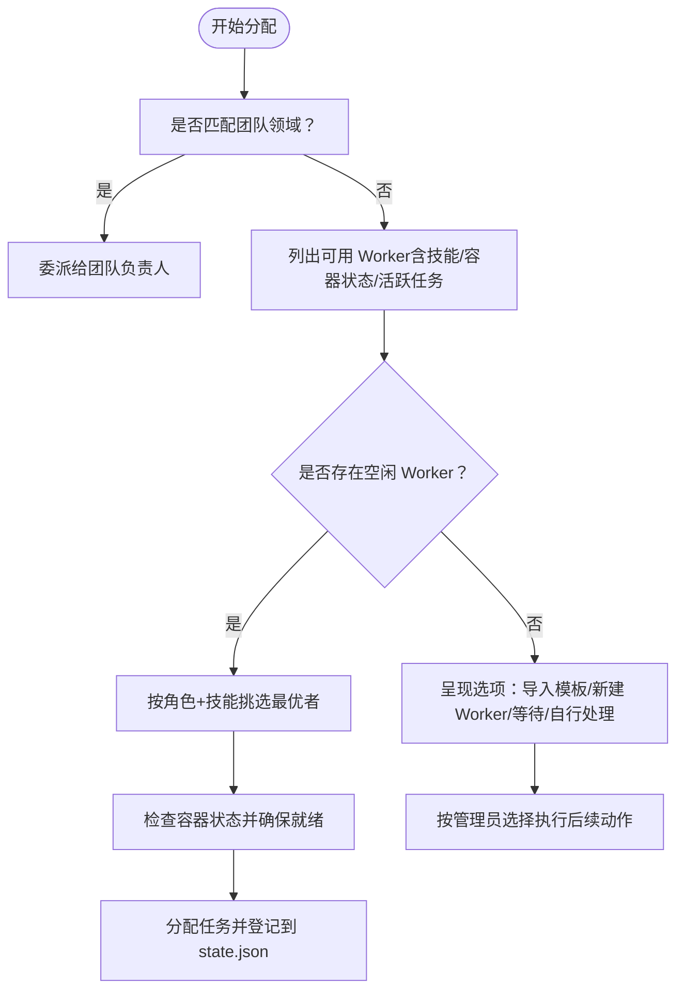
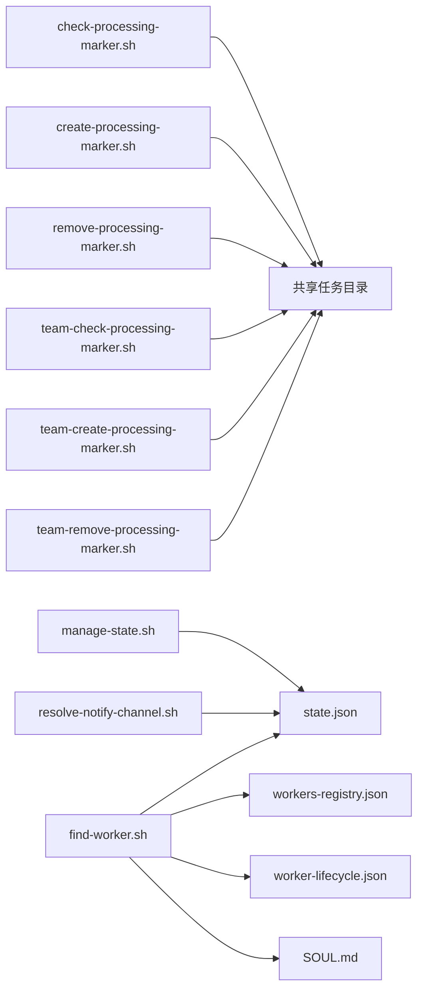

# 任务协调管理

<cite>
**本文引用的文件**
- [任务协调技能说明](file://manager/agent/skills/task-coordination/SKILL.md)
- [有限任务工作流](file://manager/agent/skills/task-management/references/finite-tasks.md)
- [无限任务工作流](file://manager/agent/skills/task-management/references/infinite-tasks.md)
- [状态管理（state.json）](file://manager/agent/skills/task-management/references/state-management.md)
- [工人选择（步骤0）](file://manager/agent/skills/task-management/references/worker-selection.md)
- [检查处理标记脚本](file://manager/agent/skills/task-coordination/scripts/check-processing-marker.sh)
- [创建处理标记脚本](file://manager/agent/skills/task-coordination/scripts/create-processing-marker.sh)
- [移除处理标记脚本](file://manager/agent/skills/task-coordination/scripts/remove-processing-marker.sh)
- [状态管理脚本](file://manager/agent/skills/task-management/scripts/manage-state.sh)
- [查找工人脚本](file://manager/agent/skills/task-management/scripts/find-worker.sh)
- [通知通道解析脚本](file://manager/agent/skills/task-management/scripts/resolve-notify-channel.sh)
- [团队任务协调：检查处理标记脚本](file://manager/agent/team-leader-agent/skills/team-task-coordination/scripts/check-processing-marker.sh)
- [团队任务协调：创建处理标记脚本](file://manager/agent/team-leader-agent/skills/team-task-coordination/scripts/create-processing-marker.sh)
- [团队任务协调：移除处理标记脚本](file://manager/agent/team-leader-agent/skills/team-task-coordination/scripts/remove-processing-marker.sh)
</cite>

## 目录
1. [简介](#简介)
2. [项目结构](#项目结构)
3. [核心组件](#核心组件)
4. [架构总览](#架构总览)
5. [详细组件分析](#详细组件分析)
6. [依赖关系分析](#依赖关系分析)
7. [性能考量](#性能考量)
8. [故障排查指南](#故障排查指南)
9. [结论](#结论)
10. [附录](#附录)

## 简介
本文件系统性阐述 HiClaw 的“任务协调管理”能力，重点覆盖以下方面：
- 有限任务与无限任务的定义、差异与管理策略
- 任务状态管理与处理标记机制（.processing）
- 任务协调的工作流程与执行策略
- 处理标记的创建、检查与移除操作
- 脚本使用指南与最佳实践
- 任务分配策略与多 Worker 协作模式
- 如何高效协调复杂团队任务执行

## 项目结构
围绕任务协调管理的核心目录与文件如下：
- 任务协调技能：提供通用的共享工作区协调机制，通过 .processing 标记避免 Manager 与 Worker 同时修改导致冲突
- 任务管理参考：定义有限/无限任务的生命周期、分配与完成流程、状态持久化与通知通道解析
- 团队任务协调：团队领导者代理下的任务协调脚本，复用相同协议但具备团队上下文解析

**图表来源**
- [任务协调技能说明:1-153](file://manager/agent/skills/task-coordination/SKILL.md#L1-L153)
- [有限任务工作流:1-110](file://manager/agent/skills/task-management/references/finite-tasks.md#L1-L110)
- [无限任务工作流:1-44](file://manager/agent/skills/task-management/references/infinite-tasks.md#L1-L44)
- [状态管理（state.json）:1-36](file://manager/agent/skills/task-management/references/state-management.md#L1-L36)
- [团队任务协调：检查处理标记脚本:1-73](file://manager/agent/team-leader-agent/skills/team-task-coordination/scripts/check-processing-marker.sh#L1-L73)

**章节来源**
- [任务协调技能说明:1-153](file://manager/agent/skills/task-coordination/SKILL.md#L1-L153)
- [有限任务工作流:1-110](file://manager/agent/skills/task-management/references/finite-tasks.md#L1-L110)
- [无限任务工作流:1-44](file://manager/agent/skills/task-management/references/infinite-tasks.md#L1-L44)
- [状态管理（state.json）:1-36](file://manager/agent/skills/task-management/references/state-management.md#L1-L36)

## 核心组件
- 处理标记（.processing）：用于声明“正在处理”的轻量级 JSON 文件，包含处理器、开始时间、过期时间等字段，防止并发写入
- 任务目录布局：包含共享工作区、笔记与元数据、处理标记等
- 状态持久化：state.json 作为活动任务的单一真相源，由脚本原子更新
- 工人选择与容器就绪：在分配前评估可用性与容器状态，确保可执行性
- 通知通道解析：优先主通道，其次管理员 DM，最后回退提示

**章节来源**
- [任务协调技能说明:20-96](file://manager/agent/skills/task-coordination/SKILL.md#L20-L96)
- [状态管理（state.json）:1-36](file://manager/agent/skills/task-management/references/state-management.md#L1-L36)
- [工人选择（步骤0）:1-71](file://manager/agent/skills/task-management/references/worker-selection.md#L1-L71)

## 架构总览
下图展示了有限任务与无限任务在分配、执行与完成过程中的关键交互，以及处理标记在 Manager 与 Worker 之间的协调作用。

**图表来源**
- [有限任务工作流:10-98](file://manager/agent/skills/task-management/references/finite-tasks.md#L10-L98)
- [无限任务工作流:13-43](file://manager/agent/skills/task-management/references/infinite-tasks.md#L13-L43)
- [状态管理（state.json）:1-36](file://manager/agent/skills/task-management/references/state-management.md#L1-L36)

## 详细组件分析

### 有限任务与无限任务
- 有限任务：有明确结束状态，Worker 完成交付后即结束；流程包括创建任务目录、推送元数据、通知 Worker、登记到 state.json、完成后拉取结果并更新状态
- 无限任务：按计划周期重复执行，无自然终点；通过心跳触发执行，Worker 报告完成后仅更新状态，不重复 @mention

**图表来源**
- [有限任务工作流:10-98](file://manager/agent/skills/task-management/references/finite-tasks.md#L10-L98)
- [无限任务工作流:13-43](file://manager/agent/skills/task-management/references/infinite-tasks.md#L13-L43)

**章节来源**
- [有限任务工作流:1-110](file://manager/agent/skills/task-management/references/finite-tasks.md#L1-L110)
- [无限任务工作流:1-44](file://manager/agent/skills/task-management/references/infinite-tasks.md#L1-L44)

### 处理标记机制与工作流程
- 目标：避免 Manager 与 Worker 同时修改共享工作区导致冲突
- 协调协议（通用）：先同步存储、再检查标记、安全则创建标记、完成后移除标记、最后同步回存储
- 标记格式：包含处理器、开始时间、过期时间等字段，支持自动过期以避免死锁

**图表来源**
- [任务协调技能说明:62-96](file://manager/agent/skills/task-coordination/SKILL.md#L62-L96)
- [检查处理标记脚本:1-67](file://manager/agent/skills/task-coordination/scripts/check-processing-marker.sh#L1-L67)
- [创建处理标记脚本:1-46](file://manager/agent/skills/task-coordination/scripts/create-processing-marker.sh#L1-L46)
- [移除处理标记脚本:1-22](file://manager/agent/skills/task-coordination/scripts/remove-processing-marker.sh#L1-L22)

**章节来源**
- [任务协调技能说明:10-96](file://manager/agent/skills/task-coordination/SKILL.md#L10-L96)
- [检查处理标记脚本:1-67](file://manager/agent/skills/task-coordination/scripts/check-processing-marker.sh#L1-L67)
- [创建处理标记脚本:1-46](file://manager/agent/skills/task-coordination/scripts/create-processing-marker.sh#L1-L46)
- [移除处理标记脚本:1-22](file://manager/agent/skills/task-coordination/scripts/remove-processing-marker.sh#L1-L22)

### 团队任务协调（Team Leader 场景）
- 在团队任务中，处理标记脚本会尝试从团队领导的 SOUL.md 解析团队名称，其余逻辑与通用脚本一致
- 适用于团队负责人代理执行或跨 Worker 的协调

**图表来源**
- [团队任务协调：检查处理标记脚本:1-73](file://manager/agent/team-leader-agent/skills/team-task-coordination/scripts/check-processing-marker.sh#L1-L73)
- [团队任务协调：创建处理标记脚本:1-54](file://manager/agent/team-leader-agent/skills/team-task-coordination/scripts/create-processing-marker.sh#L1-L54)
- [团队任务协调：移除处理标记脚本:1-33](file://manager/agent/team-leader-agent/skills/team-task-coordination/scripts/remove-processing-marker.sh#L1-L33)

**章节来源**
- [团队任务协调：检查处理标记脚本:1-73](file://manager/agent/team-leader-agent/skills/team-task-coordination/scripts/check-processing-marker.sh#L1-L73)
- [团队任务协调：创建处理标记脚本:1-54](file://manager/agent/team-leader-agent/skills/team-task-coordination/scripts/create-processing-marker.sh#L1-L54)
- [团队任务协调：移除处理标记脚本:1-33](file://manager/agent/team-leader-agent/skills/team-task-coordination/scripts/remove-processing-marker.sh#L1-L33)

### 任务状态管理与通知通道
- state.json 是活动任务的单一真相源，所有变更通过脚本原子写入，避免竞态
- 管理员通知通道优先解析主通道，其次管理员 DM，最后提示未配置
- 有限任务完成后需从 state.json 移除；无限任务执行后仅更新下次执行时间

**图表来源**
- [状态管理（state.json）:1-36](file://manager/agent/skills/task-management/references/state-management.md#L1-L36)
- [状态管理脚本:1-294](file://manager/agent/skills/task-management/scripts/manage-state.sh#L1-L294)
- [通知通道解析脚本:1-49](file://manager/agent/skills/task-management/scripts/resolve-notify-channel.sh#L1-L49)

**章节来源**
- [状态管理（state.json）:1-36](file://manager/agent/skills/task-management/references/state-management.md#L1-L36)
- [状态管理脚本:1-294](file://manager/agent/skills/task-management/scripts/manage-state.sh#L1-L294)
- [通知通道解析脚本:1-49](file://manager/agent/skills/task-management/scripts/resolve-notify-channel.sh#L1-L49)

### 任务分配策略与多 Worker 协作
- 首先判断是否匹配团队领域，若匹配优先委派给团队负责人
- 若无合适团队，查询可用 Worker，按技能与角色匹配，优先选择空闲者
- 对于仅有忙碌 Worker 的情况，建议导入模板或新建 Worker，或等待
- 分配前检查容器状态：空闲/忙碌可直接分配；停止需唤醒；不可用需重建
- 无限任务的触发严格依赖心跳与计划，避免循环触发

**图表来源**
- [工人选择（步骤0）:1-71](file://manager/agent/skills/task-management/references/worker-selection.md#L1-L71)
- [查找工人脚本:1-238](file://manager/agent/skills/task-management/scripts/find-worker.sh#L1-L238)

**章节来源**
- [工人选择（步骤0）:1-71](file://manager/agent/skills/task-management/references/worker-selection.md#L1-L71)
- [查找工人脚本:1-238](file://manager/agent/skills/task-management/scripts/find-worker.sh#L1-L238)

## 依赖关系分析
- 任务协调脚本被多个技能复用：git-delegation-management、git-delegation 等
- 任务管理脚本依赖 state.json 作为单一真相源，同时依赖 MinIO 存储进行文件同步
- 团队任务协调脚本在通用脚本基础上增加团队上下文解析
- 通知通道解析脚本依赖主通道配置与 state.json 中的管理员 DM 房间缓存

**图表来源**
- [状态管理脚本:1-294](file://manager/agent/skills/task-management/scripts/manage-state.sh#L1-L294)
- [通知通道解析脚本:1-49](file://manager/agent/skills/task-management/scripts/resolve-notify-channel.sh#L1-L49)
- [查找工人脚本:1-238](file://manager/agent/skills/task-management/scripts/find-worker.sh#L1-L238)
- [团队任务协调：检查处理标记脚本:1-73](file://manager/agent/team-leader-agent/skills/team-task-coordination/scripts/check-processing-marker.sh#L1-L73)

**章节来源**
- [状态管理脚本:1-294](file://manager/agent/skills/task-management/scripts/manage-state.sh#L1-L294)
- [通知通道解析脚本:1-49](file://manager/agent/skills/task-management/scripts/resolve-notify-channel.sh#L1-L49)
- [查找工人脚本:1-238](file://manager/agent/skills/task-management/scripts/find-worker.sh#L1-L238)
- [团队任务协调：检查处理标记脚本:1-73](file://manager/agent/team-leader-agent/skills/team-task-coordination/scripts/check-processing-marker.sh#L1-L73)

## 性能考量
- 使用 .processing 标记避免频繁的文件锁竞争，降低冲突概率
- 通过 state.json 维护活动任务列表，减少扫描全量任务目录的成本
- 无限任务的触发严格基于计划与心跳，避免不必要的轮询与重复执行
- MinIO 同步采用镜像方式，建议在批量操作前后进行增量同步以提升吞吐

## 故障排查指南
- 处理标记异常
  - 现象：脚本返回占用状态或标记格式错误
  - 排查：确认标记文件存在且格式正确；检查过期时间；必要时手动移除过期标记
  - 参考：检查/创建/移除处理标记脚本
- 状态文件异常
  - 现象：state.json 缺失或结构不完整
  - 排查：使用初始化动作重建；核对必需字段；确保原子写入
  - 参考：状态管理脚本与参考文档
- 通知通道未配置
  - 现象：无法向管理员发送完成通知
  - 排查：确认主通道已确认且非 Matrix；否则缓存管理员 DM 房间并重试
  - 参考：通知通道解析脚本
- Worker 不可用
  - 现象：容器停止或不可用
  - 排查：先尝试确保就绪；若失败，按指引重建 Worker
  - 参考：工人选择与容器状态

**章节来源**
- [检查处理标记脚本:1-67](file://manager/agent/skills/task-coordination/scripts/check-processing-marker.sh#L1-L67)
- [创建处理标记脚本:1-46](file://manager/agent/skills/task-coordination/scripts/create-processing-marker.sh#L1-L46)
- [移除处理标记脚本:1-22](file://manager/agent/skills/task-coordination/scripts/remove-processing-marker.sh#L1-L22)
- [状态管理（state.json）:1-36](file://manager/agent/skills/task-management/references/state-management.md#L1-L36)
- [状态管理脚本:1-294](file://manager/agent/skills/task-management/scripts/manage-state.sh#L1-L294)
- [通知通道解析脚本:1-49](file://manager/agent/skills/task-management/scripts/resolve-notify-channel.sh#L1-L49)
- [工人选择（步骤0）:1-71](file://manager/agent/skills/task-management/references/worker-selection.md#L1-L71)

## 结论
HiClaw 的任务协调管理通过“处理标记 + 状态持久化 + 通知通道解析 + 工人选择与容器就绪”形成闭环，既能保障有限任务的清晰交付，又能稳定运行无限任务的周期执行。团队场景下，通过团队上下文解析实现更精细的协调。遵循脚本化的原子操作与严格的流程约束，可显著降低并发冲突与误触发风险，提升整体协作效率与可靠性。

## 附录
- 脚本使用要点
  - 有限任务：分配后立即推送元数据与规范；登记到 state.json；完成后从 state.json 移除
  - 无限任务：登记时包含计划与时区；心跳触发执行；Worker 报告后仅更新状态
  - 处理标记：先同步存储、再检查标记、安全才创建、完成后移除、最后同步回存储
- 最佳实践
  - 始终先同步再修改，避免本地状态落后
  - 严格遵守标记协议，尊重占用状态
  - 使用脚本原子更新 state.json，避免手动编辑
  - 无限任务不要在记录执行时再次 @mention Worker，防止循环触发
  - 在分配前检查容器状态，确保 Worker 就绪