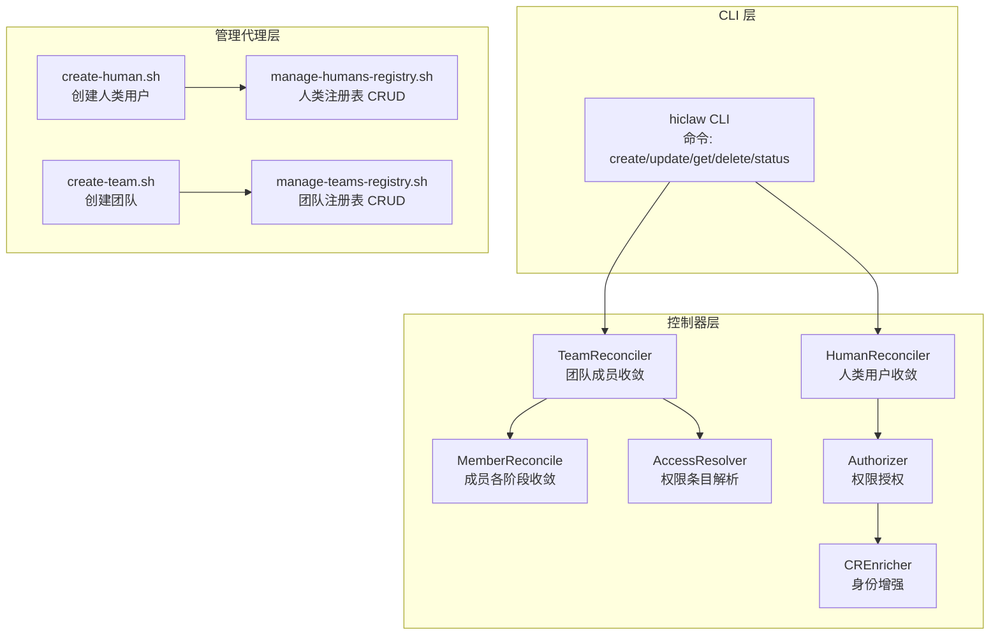
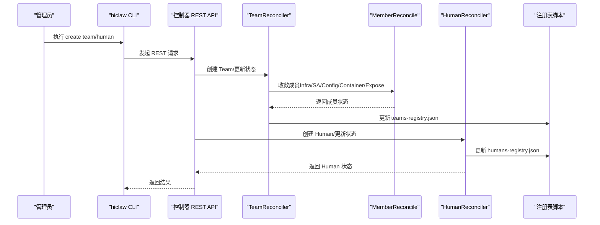
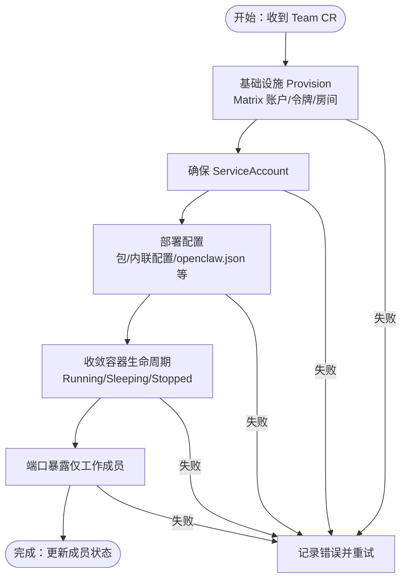
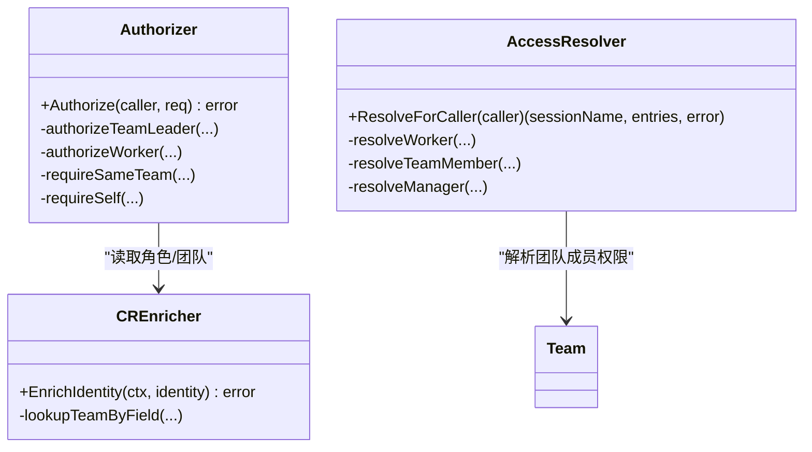
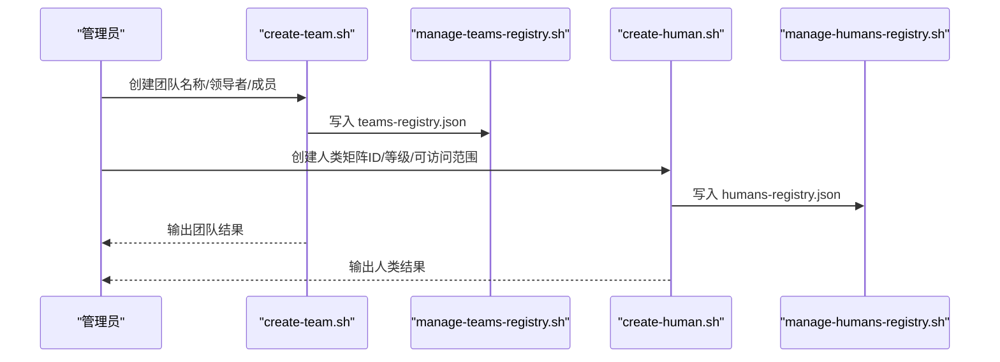
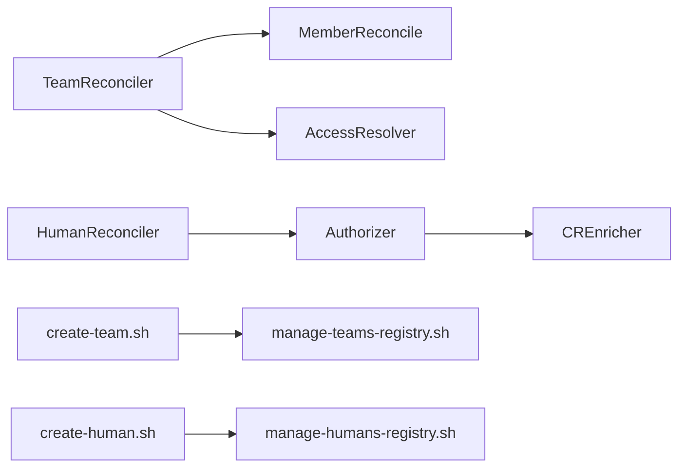

# 团队成员管理

<cite>
**本文档引用的文件**
- [hiclaw-controller/cmd/hiclaw/main.go](file://hiclaw-controller/cmd/hiclaw/main.go)
- [hiclaw-controller/cmd/hiclaw/create.go](file://hiclaw-controller/cmd/hiclaw/create.go)
- [hiclaw-controller/cmd/hiclaw/delete.go](file://hiclaw-controller/cmd/hiclaw/delete.go)
- [hiclaw-controller/cmd/hiclaw/update.go](file://hiclaw-controller/cmd/hiclaw/update.go)
- [hiclaw-controller/internal/controller/team_controller.go](file://hiclaw-controller/internal/controller/team_controller.go)
- [hiclaw-controller/internal/controller/member_reconcile.go](file://hiclaw-controller/internal/controller/member_reconcile.go)
- [hiclaw-controller/internal/controller/human_controller.go](file://hiclaw-controller/internal/controller/human_controller.go)
- [hiclaw-controller/api/v1beta1/types.go](file://hiclaw-controller/api/v1beta1/types.go)
- [hiclaw-controller/internal/accessresolver/resolver.go](file://hiclaw-controller/internal/accessresolver/resolver.go)
- [hiclaw-controller/internal/auth/authorizer.go](file://hiclaw-controller/internal/auth/authorizer.go)
- [hiclaw-controller/internal/auth/enricher.go](file://hiclaw-controller/internal/auth/enricher.go)
- [manager/agent/skills/human-management/scripts/manage-humans-registry.sh](file://manager/agent/skills/human-management/scripts/manage-humans-registry.sh)
- [manager/agent/skills/team-management/scripts/manage-teams-registry.sh](file://manager/agent/skills/team-management/scripts/manage-teams-registry.sh)
- [manager/agent/skills/human-management/scripts/create-human.sh](file://manager/agent/skills/human-management/scripts/create-human.sh)
- [manager/agent/skills/team-management/scripts/create-team.sh](file://manager/agent/skills/team-management/scripts/create-team.sh)
</cite>

## 目录
1. [简介](#简介)
2. [项目结构](#项目结构)
3. [核心组件](#核心组件)
4. [架构总览](#架构总览)
5. [详细组件分析](#详细组件分析)
6. [依赖关系分析](#依赖关系分析)
7. [性能考量](#性能考量)
8. [故障排查指南](#故障排查指南)
9. [结论](#结论)
10. [附录](#附录)

## 简介
本文件系统性阐述 HiClaw 的团队成员管理能力，覆盖以下主题：
- 团队成员的添加、移除与角色分配机制
- 成员权限控制与访问管理策略
- 团队注册表（teams-registry.json）与人类注册表（humans-registry.json）的管理与维护
- 成员状态跟踪与生命周期管理
- CLI 命令与脚本使用指南
- 权限配置最佳实践与安全考虑
- 多成员团队协作与权限分配的实战建议

## 项目结构
HiClaw 将“团队成员管理”划分为三层：
- 控制器层：通过 CRD（Team/Human/Worker/Manager）声明式管理资源，控制器负责基础设施、容器与权限的收敛
- 管理代理层：提供技能脚本，完成矩阵房间邀请、权限白名单（groupAllowFrom）注入、注册表更新等
- CLI 层：hiclaw CLI 提供 create/update/get/delete/status 等命令，驱动控制器 REST API

图表来源
- [hiclaw-controller/cmd/hiclaw/main.go:1-35](file://hiclaw-controller/cmd/hiclaw/main.go#L1-L35)
- [hiclaw-controller/internal/controller/team_controller.go:1-100](file://hiclaw-controller/internal/controller/team_controller.go#L1-L100)
- [hiclaw-controller/internal/controller/human_controller.go:1-103](file://hiclaw-controller/internal/controller/human_controller.go#L1-L103)
- [hiclaw-controller/internal/auth/authorizer.go:1-155](file://hiclaw-controller/internal/auth/authorizer.go#L1-L155)
- [hiclaw-controller/internal/auth/enricher.go:1-104](file://hiclaw-controller/internal/auth/enricher.go#L1-L104)
- [hiclaw-controller/internal/accessresolver/resolver.go:1-345](file://hiclaw-controller/internal/accessresolver/resolver.go#L1-L345)
- [manager/agent/skills/human-management/scripts/create-human.sh:1-379](file://manager/agent/skills/human-management/scripts/create-human.sh#L1-L379)
- [manager/agent/skills/team-management/scripts/create-team.sh:1-651](file://manager/agent/skills/team-management/scripts/create-team.sh#L1-L651)

章节来源
- [hiclaw-controller/cmd/hiclaw/main.go:1-35](file://hiclaw-controller/cmd/hiclaw/main.go#L1-L35)
- [hiclaw-controller/internal/controller/team_controller.go:1-100](file://hiclaw-controller/internal/controller/team_controller.go#L1-L100)
- [hiclaw-controller/internal/controller/human_controller.go:1-103](file://hiclaw-controller/internal/controller/human_controller.go#L1-L103)

## 核心组件
- TeamReconciler：负责团队级基础设施（房间、共享存储）、成员清理、逐成员收敛、领导协调上下文注入与注册表同步
- MemberReconcile：统一的成员收敛流程，包括基础设施（Matrix 账号/令牌/房间）、服务账号、配置部署、容器生命周期、端口暴露
- HumanReconciler：人类用户的矩阵账户与房间权限收敛，同时维护 humans-registry.json
- AccessResolver：将 CR 中的 AccessEntry 解析为凭证提供方可接受的条目，支持模板变量与默认策略
- Authorizer/CREnricher：基于角色与团队的授权矩阵，解析调用者身份（角色、所属团队）
- 注册表脚本：manage-humans-registry.sh 与 manage-teams-registry.sh 提供注册表的 CRUD 操作
- 创建脚本：create-human.sh 与 create-team.sh 完成人与团队的初始化流程（房间、白名单、注册表、存储）

章节来源
- [hiclaw-controller/internal/controller/team_controller.go:1-100](file://hiclaw-controller/internal/controller/team_controller.go#L1-L100)
- [hiclaw-controller/internal/controller/member_reconcile.go:1-140](file://hiclaw-controller/internal/controller/member_reconcile.go#L1-L140)
- [hiclaw-controller/internal/controller/human_controller.go:1-103](file://hiclaw-controller/internal/controller/human_controller.go#L1-L103)
- [hiclaw-controller/internal/accessresolver/resolver.go:1-174](file://hiclaw-controller/internal/accessresolver/resolver.go#L1-L174)
- [hiclaw-controller/internal/auth/authorizer.go:1-155](file://hiclaw-controller/internal/auth/authorizer.go#L1-L155)
- [hiclaw-controller/internal/auth/enricher.go:1-104](file://hiclaw-controller/internal/auth/enricher.go#L1-L104)
- [manager/agent/skills/human-management/scripts/manage-humans-registry.sh:1-184](file://manager/agent/skills/human-management/scripts/manage-humans-registry.sh#L1-L184)
- [manager/agent/skills/team-management/scripts/manage-teams-registry.sh:1-174](file://manager/agent/skills/team-management/scripts/manage-teams-registry.sh#L1-L174)

## 架构总览
下图展示了从 CLI 到控制器再到管理代理的完整调用链路，以及权限与注册表的交互。

图表来源
- [hiclaw-controller/cmd/hiclaw/create.go:218-292](file://hiclaw-controller/cmd/hiclaw/create.go#L218-L292)
- [hiclaw-controller/internal/controller/team_controller.go:108-305](file://hiclaw-controller/internal/controller/team_controller.go#L108-L305)
- [hiclaw-controller/internal/controller/member_reconcile.go:142-192](file://hiclaw-controller/internal/controller/member_reconcile.go#L142-L192)
- [hiclaw-controller/internal/controller/human_controller.go:83-96](file://hiclaw-controller/internal/controller/human_controller.go#L83-L96)
- [manager/agent/skills/team-management/scripts/manage-teams-registry.sh:1-174](file://manager/agent/skills/team-management/scripts/manage-teams-registry.sh#L1-L174)
- [manager/agent/skills/human-management/scripts/manage-humans-registry.sh:1-184](file://manager/agent/skills/human-management/scripts/manage-humans-registry.sh#L1-L184)

## 详细组件分析

### 组件一：团队成员生命周期与角色分配
- 角色类型：团队领导者（team_leader）、普通成员（worker），以及独立 Worker/Manager
- 生命周期阶段：基础设施（Matrix 用户/令牌/房间）、服务账号、配置部署、容器生命周期（Running/Sleeping/Stopped）、端口暴露
- 成员收敛流程：由 TeamReconciler 驱动，对每个成员执行 ReconcileMemberInfra、EnsureMemberServiceAccount、ReconcileMemberConfig、ReconcileMemberContainer、ReconcileMemberExpose；失败时记录错误但不中断整体收敛
- 角色与团队解析：通过 CREnricher 从 Worker/Team CR 反查调用者角色与团队，Authorizer 实施授权矩阵

图表来源
- [hiclaw-controller/internal/controller/team_controller.go:108-305](file://hiclaw-controller/internal/controller/team_controller.go#L108-L305)
- [hiclaw-controller/internal/controller/member_reconcile.go:142-417](file://hiclaw-controller/internal/controller/member_reconcile.go#L142-L417)
- [hiclaw-controller/internal/auth/enricher.go:40-89](file://hiclaw-controller/internal/auth/enricher.go#L40-L89)
- [hiclaw-controller/internal/auth/authorizer.go:38-154](file://hiclaw-controller/internal/auth/authorizer.go#L38-L154)

章节来源
- [hiclaw-controller/internal/controller/team_controller.go:108-305](file://hiclaw-controller/internal/controller/team_controller.go#L108-L305)
- [hiclaw-controller/internal/controller/member_reconcile.go:142-417](file://hiclaw-controller/internal/controller/member_reconcile.go#L142-L417)
- [hiclaw-controller/internal/auth/enricher.go:40-89](file://hiclaw-controller/internal/auth/enricher.go#L40-L89)
- [hiclaw-controller/internal/auth/authorizer.go:38-154](file://hiclaw-controller/internal/auth/authorizer.go#L38-L154)

### 组件二：权限控制与访问管理策略
- 授权矩阵：
  - 管理员（Admin）与管理代理（Manager）拥有完全权限
  - 团队领导者（TeamLeader）仅能对其所在团队内的资源进行有限操作（如 get/list、创建/更新自身团队成员、唤醒/睡眠等）
  - 普通工作者（Worker）仅能访问自身资源（自审、状态查询、凭据刷新）
- 身份增强：通过字段索引反查 Team CR，确定调用者角色与团队归属
- 访问条目解析：将 CR 中的 AccessEntry（对象存储/网关）解析为凭证提供方可用的条目，支持模板变量（${self.*}）与默认策略

图表来源
- [hiclaw-controller/internal/auth/authorizer.go:38-154](file://hiclaw-controller/internal/auth/authorizer.go#L38-L154)
- [hiclaw-controller/internal/auth/enricher.go:40-103](file://hiclaw-controller/internal/auth/enricher.go#L40-L103)
- [hiclaw-controller/internal/accessresolver/resolver.go:48-174](file://hiclaw-controller/internal/accessresolver/resolver.go#L48-L174)

章节来源
- [hiclaw-controller/internal/auth/authorizer.go:38-154](file://hiclaw-controller/internal/auth/authorizer.go#L38-L154)
- [hiclaw-controller/internal/auth/enricher.go:40-103](file://hiclaw-controller/internal/auth/enricher.go#L40-L103)
- [hiclaw-controller/internal/accessresolver/resolver.go:48-174](file://hiclaw-controller/internal/accessresolver/resolver.go#L48-L174)

### 组件三：团队注册表与人类注册表管理
- teams-registry.json：记录团队名称、领导者、成员列表、团队房间与 DM 房间、团队管理员等信息
- humans-registry.json：记录人类用户的显示名、权限等级、可访问团队/工作者、房间列表、备注等
- 管理脚本：
  - manage-teams-registry.sh：初始化、增删改查团队注册表
  - manage-humans-registry.sh：初始化、增删改查人类注册表
- 创建流程：
  - create-team.sh：创建团队房间、领导者 DM、领导者与成员容器、权限回填、注册表更新、存储初始化
  - create-human.sh：注册矩阵账户、按权限等级注入 groupAllowFrom、邀请到房间、更新注册表、发送欢迎邮件

图表来源
- [manager/agent/skills/team-management/scripts/create-team.sh:1-651](file://manager/agent/skills/team-management/scripts/create-team.sh#L1-L651)
- [manager/agent/skills/human-management/scripts/create-human.sh:1-379](file://manager/agent/skills/human-management/scripts/create-human.sh#L1-L379)
- [manager/agent/skills/team-management/scripts/manage-teams-registry.sh:1-174](file://manager/agent/skills/team-management/scripts/manage-teams-registry.sh#L1-L174)
- [manager/agent/skills/human-management/scripts/manage-humans-registry.sh:1-184](file://manager/agent/skills/human-management/scripts/manage-humans-registry.sh#L1-L184)

章节来源
- [manager/agent/skills/team-management/scripts/manage-teams-registry.sh:1-174](file://manager/agent/skills/team-management/scripts/manage-teams-registry.sh#L1-L174)
- [manager/agent/skills/human-management/scripts/manage-humans-registry.sh:1-184](file://manager/agent/skills/human-management/scripts/manage-humans-registry.sh#L1-L184)
- [manager/agent/skills/team-management/scripts/create-team.sh:1-651](file://manager/agent/skills/team-management/scripts/create-team.sh#L1-L651)
- [manager/agent/skills/human-management/scripts/create-human.sh:1-379](file://manager/agent/skills/human-management/scripts/create-human.sh#L1-L379)

### 组件四：CLI 命令与脚本使用指南
- CLI 命令：
  - create team：创建团队（领导者、成员、描述、心跳、空闲超时等）
  - create human：创建人类用户（显示名、邮箱、权限等级、可访问团队/工作者）
  - update team：更新团队描述、领导者模型/心跳/空闲超时
  - delete team/human：删除资源
  - 其他命令：worker/manager 的 create/update/delete/status 等
- 使用要点：
  - CLI 通过环境变量 HICLAW_CONTROLLER_URL、HICLAW_AUTH_TOKEN 或 HICLAW_AUTH_TOKEN_FILE 进行认证
  - create 命令支持等待容器 Ready，或 no-wait 快速返回
  - update 命令仅更新指定字段，避免全量覆盖

章节来源
- [hiclaw-controller/cmd/hiclaw/main.go:10-35](file://hiclaw-controller/cmd/hiclaw/main.go#L10-L35)
- [hiclaw-controller/cmd/hiclaw/create.go:218-292](file://hiclaw-controller/cmd/hiclaw/create.go#L218-L292)
- [hiclaw-controller/cmd/hiclaw/update.go:104-161](file://hiclaw-controller/cmd/hiclaw/update.go#L104-L161)
- [hiclaw-controller/cmd/hiclaw/delete.go:9-73](file://hiclaw-controller/cmd/hiclaw/delete.go#L9-L73)

## 依赖关系分析
- 控制器内部依赖：
  - TeamReconciler 依赖 MemberReconcile 完成员工各阶段收敛
  - AccessResolver 为 Worker/Manager/TeamMember 提供权限条目解析
  - Authorizer 与 CREnricher 协作实施授权矩阵
- 管理代理依赖：
  - create-team.sh 与 create-human.sh 依赖注册表脚本进行持久化
  - 注册表脚本依赖 jq 与 mc（MinIO 客户端）进行 JSON 操作与对象存储同步

图表来源
- [hiclaw-controller/internal/controller/team_controller.go:1-100](file://hiclaw-controller/internal/controller/team_controller.go#L1-L100)
- [hiclaw-controller/internal/controller/member_reconcile.go:1-140](file://hiclaw-controller/internal/controller/member_reconcile.go#L1-L140)
- [hiclaw-controller/internal/accessresolver/resolver.go:1-174](file://hiclaw-controller/internal/accessresolver/resolver.go#L1-L174)
- [hiclaw-controller/internal/auth/authorizer.go:1-155](file://hiclaw-controller/internal/auth/authorizer.go#L1-L155)
- [hiclaw-controller/internal/auth/enricher.go:1-104](file://hiclaw-controller/internal/auth/enricher.go#L1-L104)
- [manager/agent/skills/team-management/scripts/create-team.sh:1-651](file://manager/agent/skills/team-management/scripts/create-team.sh#L1-L651)
- [manager/agent/skills/human-management/scripts/create-human.sh:1-379](file://manager/agent/skills/human-management/scripts/create-human.sh#L1-L379)

章节来源
- [hiclaw-controller/internal/controller/team_controller.go:1-100](file://hiclaw-controller/internal/controller/team_controller.go#L1-L100)
- [hiclaw-controller/internal/controller/member_reconcile.go:1-140](file://hiclaw-controller/internal/controller/member_reconcile.go#L1-L140)
- [hiclaw-controller/internal/accessresolver/resolver.go:1-174](file://hiclaw-controller/internal/accessresolver/resolver.go#L1-L174)
- [hiclaw-controller/internal/auth/authorizer.go:1-155](file://hiclaw-controller/internal/auth/authorizer.go#L1-L155)
- [hiclaw-controller/internal/auth/enricher.go:1-104](file://hiclaw-controller/internal/auth/enricher.go#L1-L104)
- [manager/agent/skills/team-management/scripts/create-team.sh:1-651](file://manager/agent/skills/team-management/scripts/create-team.sh#L1-L651)
- [manager/agent/skills/human-management/scripts/create-human.sh:1-379](file://manager/agent/skills/human-management/scripts/create-human.sh#L1-L379)

## 性能考量
- 成员收敛采用分阶段、幂等设计，失败时记录错误并重试，避免单点阻塞
- 容器状态查询与重建遵循“规格变更才重建”的策略，减少不必要的重启
- 注册表与房间邀请作为非致命步骤，即使临时失败也不会阻断主流程
- 建议：
  - 合理设置心跳与空闲超时，平衡资源占用与响应速度
  - 对大规模团队，优先使用团队级通信策略（如组允许列表合并）降低重复配置成本

## 故障排查指南
- 常见问题定位：
  - 成员未就绪：检查容器状态与日志，确认后端可用性与规格变更导致的重建
  - 权限不足：核对调用者角色与团队，确认 Authorizer 报错原因
  - 注册表不同步：检查 manage-teams-registry.sh/manage-humans-registry.sh 是否成功写入
  - 矩阵房间邀请失败：确认 Manager 令牌与房间权限设置
- 建议操作：
  - 使用 hiclaw get 查看资源状态与消息
  - 在控制器日志中查找 reconcileInterval/reconcileRetryDelay 相关输出
  - 对于团队成员，检查 Team.Status.Members 的 Ready/Observed 字段

章节来源
- [hiclaw-controller/internal/controller/team_controller.go:271-305](file://hiclaw-controller/internal/controller/team_controller.go#L271-L305)
- [hiclaw-controller/internal/controller/member_reconcile.go:242-320](file://hiclaw-controller/internal/controller/member_reconcile.go#L242-L320)
- [hiclaw-controller/internal/auth/authorizer.go:132-154](file://hiclaw-controller/internal/auth/authorizer.go#L132-L154)

## 结论
HiClaw 的团队成员管理以声明式 CRD 为核心，结合控制器的多阶段收敛与管理代理的脚本工具，实现了从成员生命周期、权限控制到注册表维护的完整闭环。通过清晰的角色与授权矩阵、稳定的注册表与房间邀请流程，能够高效支撑多成员团队的协作与权限分配。

## 附录

### 最佳实践与安全考虑
- 权限最小化：按需授予权限等级与可访问范围，避免 L1 权限滥用
- 团队边界：明确团队管理员与领导者职责，利用 DM 房间与团队房间实现清晰的沟通边界
- 凭证安全：通过 AccessResolver 生成受控的访问条目，避免硬编码敏感信息
- 自动化与审计：使用 CLI 与脚本自动化创建流程，保留日志与注册表变更记录

### 多成员团队协作建议
- 使用团队级通信策略（如组允许列表合并）统一成员可见性
- 为团队成员提供一致的容器状态与端口暴露策略
- 通过注册表回填机制，确保在团队创建前已授权的人类用户获得正确权限