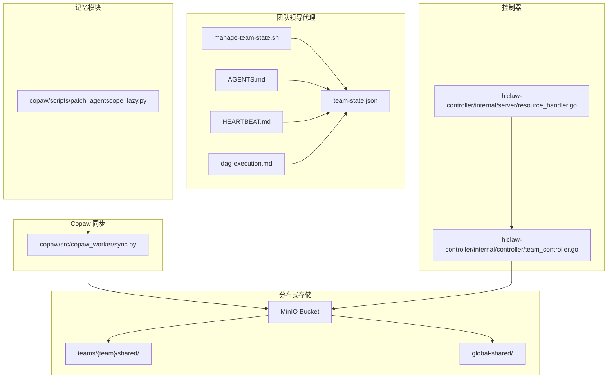
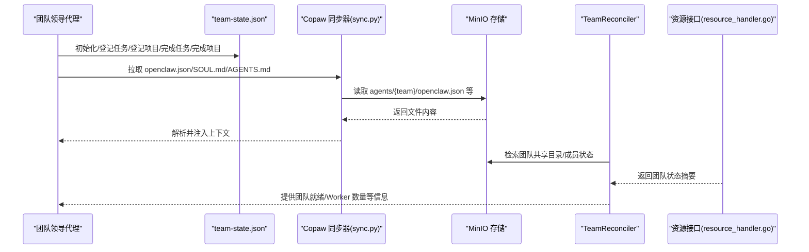
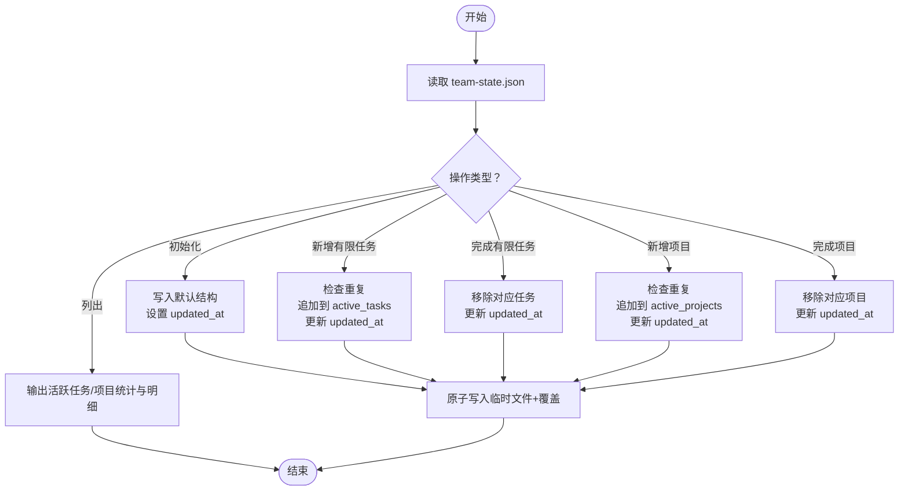
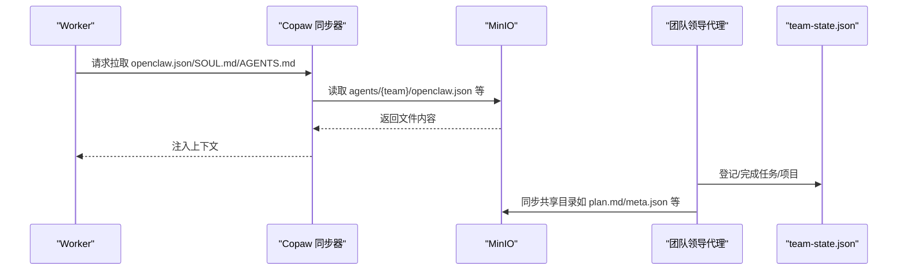
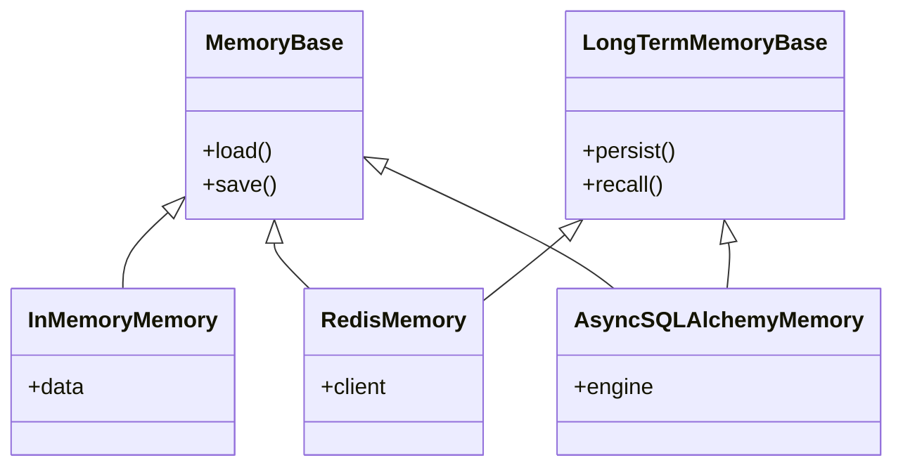
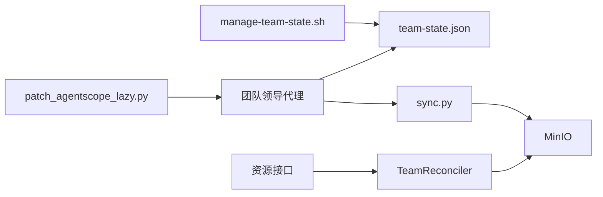

# 团队状态管理

<cite>
**本文引用的文件**
- [manage-team-state.sh](file://manager/agent/team-leader-agent/skills/team-task-management/scripts/manage-team-state.sh)
- [state-management.md](file://manager/agent/team-leader-agent/skills/team-task-management/references/state-management.md)
- [AGENTS.md](file://manager/agent/team-leader-agent/AGENTS.md)
- [HEARTBEAT.md](file://manager/agent/team-leader-agent/HEARTBEAT.md)
- [dag-execution.md](file://manager/agent/team-leader-agent/skills/team-project-management/references/dag-execution.md)
- [sync.py](file://copaw/src/copaw_worker/sync.py)
- [team_controller.go](file://hiclaw-controller/internal/controller/team_controller.go)
- [resource_handler.go](file://hiclaw-controller/internal/server/resource_handler.go)
- [patch_agentscope_lazy.py](file://copaw/scripts/patch_agentscope_lazy.py)
- [test-19-human-and-team-admin.sh](file://tests/test-19-human-and-team-admin.sh)
</cite>

## 目录
1. [简介](#简介)
2. [项目结构](#项目结构)
3. [核心组件](#核心组件)
4. [架构总览](#架构总览)
5. [详细组件分析](#详细组件分析)
6. [依赖关系分析](#依赖关系分析)
7. [性能考量](#性能考量)
8. [故障排查指南](#故障排查指南)
9. [结论](#结论)
10. [附录](#附录)

## 简介
本文件围绕 HiClaw 项目中的“团队状态管理”能力进行系统化说明，重点解释 team-state.json 的结构与作用机制，梳理团队状态的读取、更新与同步流程，介绍记忆模块与上下文保存机制，阐述状态在不同组件之间的传递与一致性保障，并提供状态管理脚本的使用方法与配置要点，最后给出监控与故障排查建议，帮助团队维护准确的执行状态信息。

## 项目结构
团队状态管理涉及以下关键位置与文件：
- 团队状态文件：team-state.json（由团队领导代理维护）
- 状态操作脚本：manage-team-state.sh（原子化写入，支持任务与项目的增删查）
- 团队工作区说明：AGENTS.md（列出工作区布局与每日流程）
- 心跳检查清单：HEARTBEAT.md（基于 team-state.json 判定空闲与唤醒策略）
- DAG 执行参考：dag-execution.md（项目计划与任务登记/完成的闭环）
- 分布式共享存储：Copaw 同步器从 MinIO 读取 openclaw.json、SOUL.md、AGENTS.md 等
- 控制器集成：TeamReconciler 在控制器中负责团队基础设施与成员生命周期管理
- 记忆模块：Agentscope 内存懒加载补丁，支撑工作记忆与长期记忆

**图示来源**
- [manage-team-state.sh:1-294](file://manager/agent/team-leader-agent/skills/team-task-management/scripts/manage-team-state.sh#L1-L294)
- [AGENTS.md:1-42](file://manager/agent/team-leader-agent/AGENTS.md#L1-L42)
- [HEARTBEAT.md:1-25](file://manager/agent/team-leader-agent/HEARTBEAT.md#L1-L25)
- [dag-execution.md:1-131](file://manager/agent/team-leader-agent/skills/team-project-management/references/dag-execution.md#L1-L131)
- [sync.py:301-324](file://copaw/src/copaw_worker/sync.py#L301-L324)
- [team_controller.go:108-151](file://hiclaw-controller/internal/controller/team_controller.go#L108-L151)
- [resource_handler.go:827-877](file://hiclaw-controller/internal/server/resource_handler.go#L827-L877)
- [patch_agentscope_lazy.py:118-177](file://copaw/scripts/patch_agentscope_lazy.py#L118-L177)

**章节来源**
- [manage-team-state.sh:1-294](file://manager/agent/team-leader-agent/skills/team-task-management/scripts/manage-team-state.sh#L1-L294)
- [AGENTS.md:1-42](file://manager/agent/team-leader-agent/AGENTS.md#L1-L42)
- [HEARTBEAT.md:1-25](file://manager/agent/team-leader-agent/HEARTBEAT.md#L1-L25)
- [dag-execution.md:1-131](file://manager/agent/team-leader-agent/skills/team-project-management/references/dag-execution.md#L1-L131)
- [sync.py:301-324](file://copaw/src/copaw_worker/sync.py#L301-L324)
- [team_controller.go:108-151](file://hiclaw-controller/internal/controller/team_controller.go#L108-L151)
- [resource_handler.go:827-877](file://hiclaw-controller/internal/server/resource_handler.go#L827-L877)
- [patch_agentscope_lazy.py:118-177](file://copaw/scripts/patch_agentscope_lazy.py#L118-L177)

## 核心组件
- team-state.json：团队级任务与项目跟踪的状态文件，格式与管理端 state.json 一致，包含团队标识、活跃任务列表、活跃项目列表与更新时间戳。
- manage-team-state.sh：提供原子化写入的命令行工具，支持初始化、新增有限任务、完成任务、列出任务、新增项目、完成项目、列出项目等操作；内部采用临时文件+覆盖写入模式确保原子性。
- AGENTS.md：定义团队领导代理的工作区布局与每日流程，明确读取 team-state.json 的步骤。
- HEARTBEAT.md：心跳周期内依据 team-state.json 进行空闲判定与工作协调，决定是否唤醒或休眠 Worker。
- DAG 执行参考：描述项目计划与任务登记/完成的闭环，强调在登记与完成时对 team-state.json 的更新。
- Copaw 同步器：从 MinIO 拉取 openclaw.json、SOUL.md、AGENTS.md 等文件，使团队领导代理与 Worker 的上下文保持一致。
- 控制器：TeamReconciler 负责团队基础设施与成员生命周期管理，结合资源接口返回团队状态信息。
- 记忆模块：通过 Agentscope 内存懒加载补丁，按需加载 Redis/SQLAlchemy/长期记忆实现，支撑工作记忆与上下文持久化。

**章节来源**
- [state-management.md:1-47](file://manager/agent/team-leader-agent/skills/team-task-management/references/state-management.md#L1-L47)
- [manage-team-state.sh:1-294](file://manager/agent/team-leader-agent/skills/team-task-management/scripts/manage-team-state.sh#L1-L294)
- [AGENTS.md:1-42](file://manager/agent/team-leader-agent/AGENTS.md#L1-L42)
- [HEARTBEAT.md:1-25](file://manager/agent/team-leader-agent/HEARTBEAT.md#L1-L25)
- [dag-execution.md:1-131](file://manager/agent/team-leader-agent/skills/team-project-management/references/dag-execution.md#L1-L131)
- [sync.py:301-324](file://copaw/src/copaw_worker/sync.py#L301-L324)
- [team_controller.go:108-151](file://hiclaw-controller/internal/controller/team_controller.go#L108-L151)
- [resource_handler.go:827-877](file://hiclaw-controller/internal/server/resource_handler.go#L827-L877)
- [patch_agentscope_lazy.py:118-177](file://copaw/scripts/patch_agentscope_lazy.py#L118-L177)

## 架构总览
团队状态管理以 team-state.json 为核心，贯穿“状态登记—任务派发—进度同步—状态核验”的闭环。分布式共享存储（MinIO）承载团队共享目录与全局共享目录，Copaw 同步器负责从 MinIO 拉取配置与上下文文件；控制器负责团队基础设施与成员生命周期管理，资源接口对外暴露团队状态；记忆模块为代理提供上下文与工作记忆能力。

**图示来源**
- [manage-team-state.sh:1-294](file://manager/agent/team-leader-agent/skills/team-task-management/scripts/manage-team-state.sh#L1-L294)
- [sync.py:301-324](file://copaw/src/copaw_worker/sync.py#L301-L324)
- [team_controller.go:108-151](file://hiclaw-controller/internal/controller/team_controller.go#L108-L151)
- [resource_handler.go:827-877](file://hiclaw-controller/internal/server/resource_handler.go#L827-L877)

## 详细组件分析

### team-state.json 结构与规则
- 结构要点
  - team_id：团队唯一标识
  - active_tasks：活跃有限任务数组，每项包含任务标识、标题、类型、被指派人、房间标识及可选字段（来源、父任务、请求者）
  - active_projects：活跃项目数组，每项包含项目标识、标题、状态及可选字段（来源、父任务、请求者）
  - updated_at：状态更新的时间戳（UTC ISO 8601）
- 规则与约束
  - 使用 manage-team-state.sh 进行所有变更，禁止手动编辑 JSON
  - 脚本通过临时文件+覆盖写入实现原子性
  - 重复添加会被静默跳过（幂等）

**章节来源**
- [state-management.md:1-47](file://manager/agent/team-leader-agent/skills/team-task-management/references/state-management.md#L1-L47)

### 状态读取与更新流程
- 读取
  - 团队领导代理每日会读取 team-state.json，了解当前活跃任务与项目
  - 心跳周期中再次读取，用于判断 Worker 是否空闲以及是否需要唤醒/休眠
- 更新
  - 新增有限任务：登记到 active_tasks 并更新 updated_at
  - 完成有限任务：从 active_tasks 移除并更新 updated_at
  - 新增项目：登记到 active_projects 并更新 updated_at
  - 完成项目：从 active_projects 移除并更新 updated_at
  - 列表查询：支持列出活跃任务与活跃项目，便于巡检与汇报

**图示来源**
- [manage-team-state.sh:39-219](file://manager/agent/team-leader-agent/skills/team-task-management/scripts/manage-team-state.sh#L39-L219)

**章节来源**
- [manage-team-state.sh:1-294](file://manager/agent/team-leader-agent/skills/team-task-management/scripts/manage-team-state.sh#L1-L294)
- [AGENTS.md:9-14](file://manager/agent/team-leader-agent/AGENTS.md#L9-L14)
- [HEARTBEAT.md:7-15](file://manager/agent/team-leader-agent/HEARTBEAT.md#L7-L15)

### 同步与一致性保障
- 分布式共享存储
  - Copaw 同步器根据是否处于团队环境选择不同的远程路径：团队成员从 teams/{team}/shared/ 拉取，非团队成员从 global-shared/ 拉取
  - 同步器还负责拉取 openclaw.json、SOUL.md、AGENTS.md 等关键文件，确保上下文一致
- 控制器与资源接口
  - TeamReconciler 负责团队基础设施与成员生命周期管理，资源接口对外暴露团队状态摘要（包括就绪 Worker 数、总 Worker 数、Leader 就绪状态等）
- 一致性策略
  - team-state.json 作为“事实来源”，心跳与运行时状态对比以此为准
  - 通过原子写入与统一脚本接口，避免竞态与不一致

**图示来源**
- [sync.py:301-324](file://copaw/src/copaw_worker/sync.py#L301-L324)
- [dag-execution.md:15-26](file://manager/agent/team-leader-agent/skills/team-project-management/references/dag-execution.md#L15-L26)

**章节来源**
- [sync.py:301-324](file://copaw/src/copaw_worker/sync.py#L301-L324)
- [team_controller.go:108-151](file://hiclaw-controller/internal/controller/team_controller.go#L108-L151)
- [resource_handler.go:827-877](file://hiclaw-controller/internal/server/resource_handler.go#L827-L877)

### 记忆模块与上下文保存机制
- 记忆模块
  - 通过 Agentscope 内存懒加载补丁，按需导入 RedisMemory、AsyncSQLAlchemyMemory、LongTermMemoryBase 及其具体实现，减少启动开销
- 上下文保存
  - 团队领导代理工作区包含 memory/ 目录，用于回放与复用历史上下文
  - Copaw 同步器从 MinIO 拉取 openclaw.json、SOUL.md、AGENTS.md 等，确保代理与 Worker 的身份与技能上下文一致

**图示来源**
- [patch_agentscope_lazy.py:118-177](file://copaw/scripts/patch_agentscope_lazy.py#L118-L177)

**章节来源**
- [patch_agentscope_lazy.py:118-177](file://copaw/scripts/patch_agentscope_lazy.py#L118-L177)
- [AGENTS.md:4-6](file://manager/agent/team-leader-agent/AGENTS.md#L4-L6)

### 团队状态在组件间的传递与一致性
- 组件边界
  - 团队领导代理：维护 team-state.json，执行登记/完成等动作
  - Copaw 同步器：从 MinIO 拉取上下文文件，注入代理与 Worker 的运行时环境
  - 控制器：负责团队基础设施与成员生命周期，资源接口对外暴露团队状态
- 一致性保障
  - team-state.json 作为“事实来源”，心跳与运行时状态对比以此为准
  - 统一脚本接口与原子写入，避免并发写导致的数据竞争
  - 分布式共享目录与控制器状态摘要共同构成跨组件的一致视图

**章节来源**
- [HEARTBEAT.md:12-23](file://manager/agent/team-leader-agent/HEARTBEAT.md#L12-L23)
- [resource_handler.go:827-877](file://hiclaw-controller/internal/server/resource_handler.go#L827-L877)

### 状态管理脚本使用方法与配置选项
- 命令与参数
  - 初始化：--action init
  - 新增有限任务：--action add-finite --task-id --title --assigned-to --room-id [--source] [--parent-task-id] [--requester]
  - 完成有限任务：--action complete --task-id
  - 列出活跃：--action list
  - 新增项目：--action add-project --project-id --title [--source] [--parent-task-id] [--requester]
  - 完成项目：--action complete-project --project-id
  - 列出项目：--action list-projects
- 行为特性
  - 自动解析 team-state.json 路径（优先当前目录/父目录，其次 HOME），若不存在则自动初始化
  - 支持向后兼容：自动迁移旧版本结构（如新增 active_projects 字段）
  - 幂等性：重复添加任务会被跳过
  - 原子性：临时文件+覆盖写入，避免部分写入

**章节来源**
- [manage-team-state.sh:6-13](file://manager/agent/team-leader-agent/skills/team-task-management/scripts/manage-team-state.sh#L6-L13)
- [manage-team-state.sh:17-37](file://manager/agent/team-leader-agent/skills/team-task-management/scripts/manage-team-state.sh#L17-L37)
- [manage-team-state.sh:39-57](file://manager/agent/team-leader-agent/skills/team-task-management/scripts/manage-team-state.sh#L39-L57)
- [manage-team-state.sh:270-294](file://manager/agent/team-leader-agent/skills/team-task-management/scripts/manage-team-state.sh#L270-L294)

### 团队状态监控与故障排查
- 监控要点
  - 通过资源接口查看团队状态摘要（就绪 Worker 数、总 Worker 数、Leader 就绪状态、消息等）
  - 心跳周期内比对 team-state.json 与运行时状态，识别长时间无进展的任务
- 故障排查
  - team-state.json 未更新：确认 manage-team-state.sh 是否正确执行，检查原子写入是否成功
  - 上下文缺失：确认 Copaw 同步器能否从 MinIO 正确拉取 openclaw.json、SOUL.md、AGENTS.md
  - 成员注册异常：参考测试用例验证 teams-registry.json 中团队管理员与房间信息是否正确
  - 分布式存储权限：确认 MinIO 策略与 bucket 权限配置，确保 teams/{team}/shared/ 与 global-shared/ 可访问

**章节来源**
- [resource_handler.go:827-877](file://hiclaw-controller/internal/server/resource_handler.go#L827-L877)
- [HEARTBEAT.md:7-15](file://manager/agent/team-leader-agent/HEARTBEAT.md#L7-L15)
- [sync.py:301-324](file://copaw/src/copaw_worker/sync.py#L301-L324)
- [test-19-human-and-team-admin.sh:206-225](file://tests/test-19-human-and-team-admin.sh#L206-L225)

## 依赖关系分析
- 组件耦合
  - manage-team-state.sh 与 team-state.json 强耦合，是状态变更的唯一入口
  - Copaw 同步器依赖 MinIO 存储，负责上下文文件的拉取与注入
  - 控制器与资源接口依赖团队状态摘要，用于对外呈现团队健康度
- 外部依赖
  - MinIO：团队共享目录与全局共享目录
  - Agentscope：内存懒加载补丁，按需加载工作/长期记忆实现
- 循环依赖
  - 未发现直接循环依赖；状态变更通过脚本单向写入，读取侧仅消费

**图示来源**
- [manage-team-state.sh:1-294](file://manager/agent/team-leader-agent/skills/team-task-management/scripts/manage-team-state.sh#L1-L294)
- [sync.py:301-324](file://copaw/src/copaw_worker/sync.py#L301-L324)
- [team_controller.go:108-151](file://hiclaw-controller/internal/controller/team_controller.go#L108-L151)
- [resource_handler.go:827-877](file://hiclaw-controller/internal/server/resource_handler.go#L827-L877)
- [patch_agentscope_lazy.py:118-177](file://copaw/scripts/patch_agentscope_lazy.py#L118-L177)

**章节来源**
- [manage-team-state.sh:1-294](file://manager/agent/team-leader-agent/skills/team-task-management/scripts/manage-team-state.sh#L1-L294)
- [sync.py:301-324](file://copaw/src/copaw_worker/sync.py#L301-L324)
- [team_controller.go:108-151](file://hiclaw-controller/internal/controller/team_controller.go#L108-L151)
- [resource_handler.go:827-877](file://hiclaw-controller/internal/server/resource_handler.go#L827-L877)
- [patch_agentscope_lazy.py:118-177](file://copaw/scripts/patch_agentscope_lazy.py#L118-L177)

## 性能考量
- 原子写入：临时文件+覆盖写入，避免频繁 fsync，降低写放大
- 懒加载内存：按需导入内存实现，减少启动与运行时开销
- 分布式同步：通过 MinIO 拉取上下文，避免本地磁盘抖动
- 列表查询：批量输出活跃任务/项目，便于快速巡检

[本节为通用建议，无需特定文件引用]

## 故障排查指南
- team-state.json 无法写入
  - 检查脚本是否以正确参数调用，确认原子写入流程未被中断
  - 核对文件权限与磁盘空间
- 上下文文件缺失
  - 确认 MinIO bucket 与路径配置正确，检查 Copaw 同步器日志
- 心跳空闲误判
  - 对照 team-state.json 与实际运行状态，必要时手动唤醒/休眠 Worker
- 成员注册异常
  - 参考测试用例校验 teams-registry.json 中团队管理员与房间信息

**章节来源**
- [manage-team-state.sh:256-294](file://manager/agent/team-leader-agent/skills/team-task-management/scripts/manage-team-state.sh#L256-L294)
- [sync.py:301-324](file://copaw/src/copaw_worker/sync.py#L301-L324)
- [HEARTBEAT.md:12-23](file://manager/agent/team-leader-agent/HEARTBEAT.md#L12-L23)
- [test-19-human-and-team-admin.sh:206-225](file://tests/test-19-human-and-team-admin.sh#L206-L225)

## 结论
team-state.json 是团队状态管理的核心载体，配合 manage-team-state.sh 的原子化写入与 Copaw 同步器的分布式上下文拉取，形成从“状态登记—任务派发—进度同步—状态核验”的完整闭环。通过控制器与资源接口对外呈现团队状态，结合记忆模块的上下文持久化能力，团队能够在多组件协作中保持一致、可观测且可追溯的执行状态。

[本节为总结性内容，无需特定文件引用]

## 附录
- DAG 执行与状态联动
  - 登记任务：resolve-dag.sh 输出就绪任务后，使用 manage-team-state.sh 将任务登记到 team-state.json
  - 完成任务：收到结果后，使用 manage-team-state.sh 完成任务登记，推进下一波任务
- 项目完成与状态联动
  - 项目完成后，使用 manage-team-state.sh 完成项目登记，确保团队状态与项目元数据一致

**章节来源**
- [dag-execution.md:15-26](file://manager/agent/team-leader-agent/skills/team-project-management/references/dag-execution.md#L15-L26)
- [dag-execution.md:119-121](file://manager/agent/team-leader-agent/skills/team-project-management/references/dag-execution.md#L119-L121)