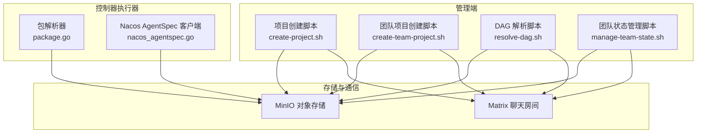
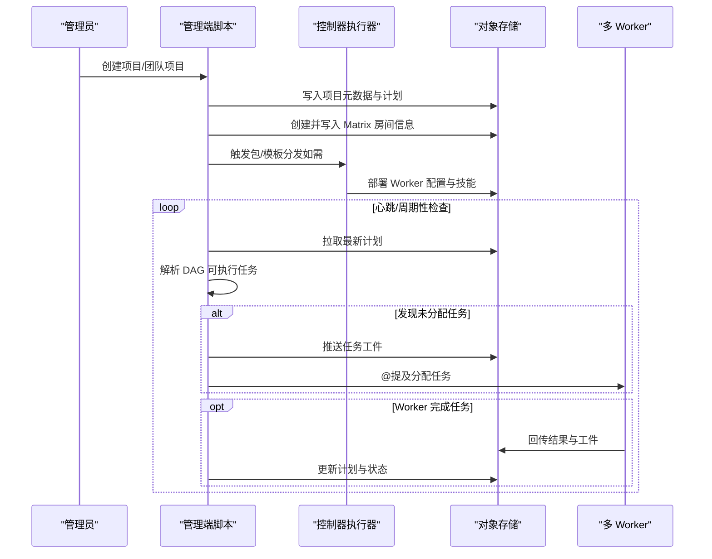
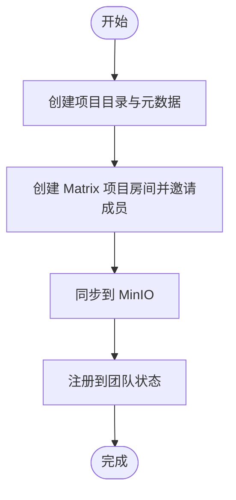
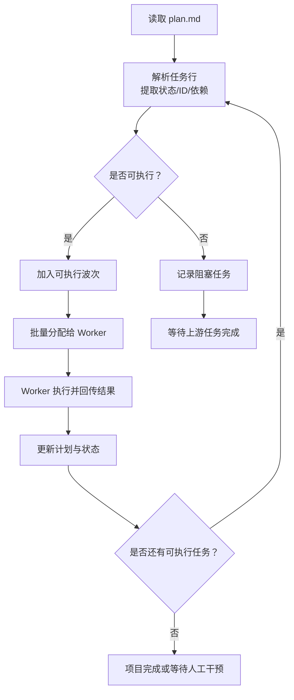
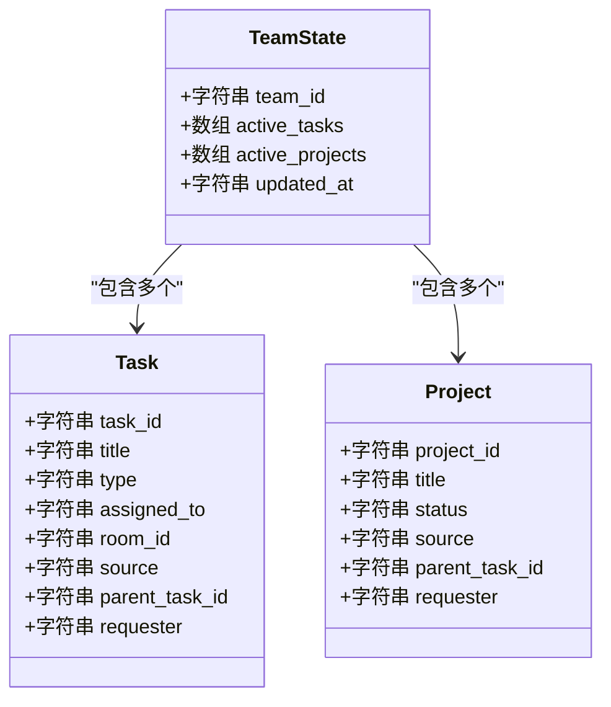
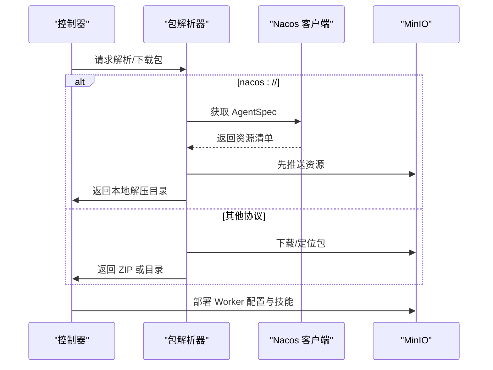
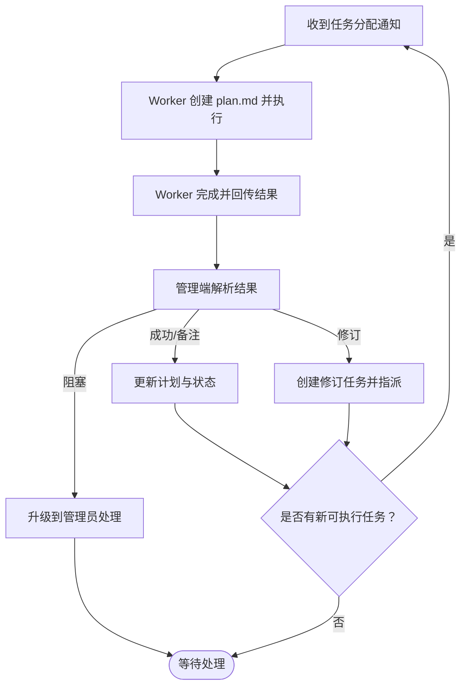
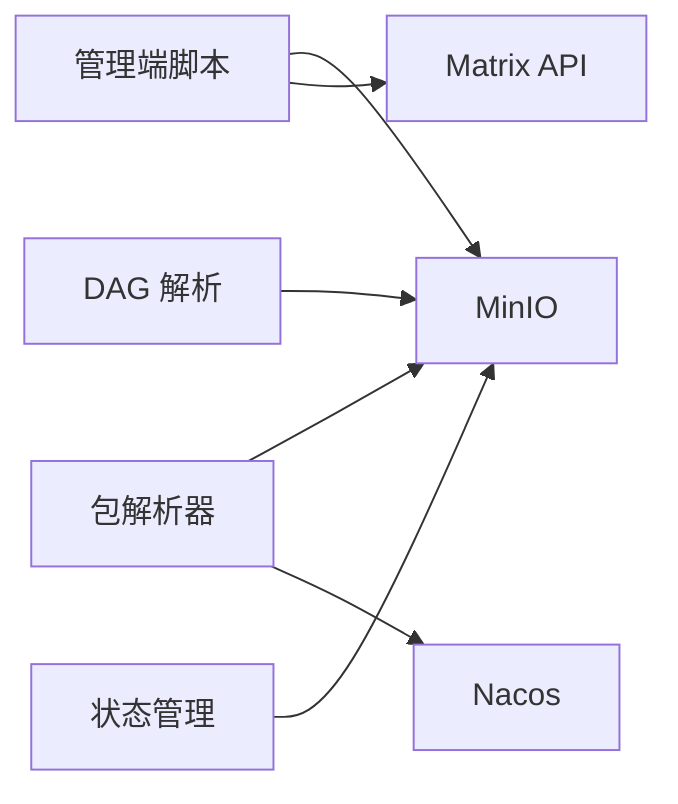

# 项目管理

<cite>
**本文引用的文件**
- [manager/agent/team-leader-agent/skills/team-project-management/references/dag-execution.md](file://manager/agent/team-leader-agent/skills/team-project-management/references/dag-execution.md)
- [manager/agent/team-leader-agent/skills/team-project-management/scripts/create-team-project.sh](file://manager/agent/team-leader-agent/skills/team-project-management/scripts/create-team-project.sh)
- [manager/agent/team-leader-agent/skills/team-project-management/scripts/resolve-dag.sh](file://manager/agent/team-leader-agent/skills/team-project-management/scripts/resolve-dag.sh)
- [manager/agent/team-leader-agent/skills/team-task-management/scripts/manage-team-state.sh](file://manager/agent/team-leader-agent/skills/team-task-management/scripts/manage-team-state.sh)
- [manager/agent/skills/project-management/scripts/create-project.sh](file://manager/agent/skills/project-management/scripts/create-project.sh)
- [manager/agent/skills/project-management/references/task-lifecycle.md](file://manager/agent/skills/project-management/references/task-lifecycle.md)
- [manager/agent/skills/project-management/references/plan-format.md](file://manager/agent/skills/project-management/references/plan-format.md)
- [manager/agent/skills/project-management/references/plan-changes.md](file://manager/agent/skills/project-management/references/plan-changes.md)
- [hiclaw-controller/internal/executor/package.go](file://hiclaw-controller/internal/executor/package.go)
- [hiclaw-controller/internal/executor/nacos_agentspec.go](file://hiclaw-controller/internal/executor/nacos_agentspec.go)
- [tests/test-21-team-project-dag.sh](file://tests/test-21-team-project-dag.sh)
</cite>

## 目录
1. [简介](#简介)
2. [项目结构](#项目结构)
3. [核心组件](#核心组件)
4. [架构总览](#架构总览)
5. [详细组件分析](#详细组件分析)
6. [依赖分析](#依赖分析)
7. [性能考虑](#性能考虑)
8. [故障排查指南](#故障排查指南)
9. [结论](#结论)
10. [附录](#附录)

## 简介
本文件面向团队项目管理场景，系统化阐述基于 DAG（有向无环图）的多 Worker 并行执行流程与生命周期管理。内容覆盖从项目创建、计划制定与依赖解析，到任务分配、并行执行、结果聚合与项目收尾的全链路操作；同时提供状态跟踪、进度监控、最佳实践与常见问题处理建议，并给出项目管理脚本的使用指南与配置要点。

## 项目结构
HiClaw 的项目管理能力由“管理端技能脚本 + 控制器执行器 + 存储与通信”三部分协同实现：
- 管理端技能：负责项目创建、DAG 计划维护、任务状态登记、心跳巡检等
- 控制器执行器：负责包分发、模板拉取、资源部署与运行时准备
- 存储与通信：通过 MinIO 提供统一对象存储，通过 Matrix 房间进行消息协作

**图表来源**
- [manager/agent/skills/project-management/scripts/create-project.sh:1-229](file://manager/agent/skills/project-management/scripts/create-project.sh#L1-L229)
- [manager/agent/team-leader-agent/skills/team-project-management/scripts/create-team-project.sh:1-148](file://manager/agent/team-leader-agent/skills/team-project-management/scripts/create-team-project.sh#L1-L148)
- [manager/agent/team-leader-agent/skills/team-project-management/scripts/resolve-dag.sh:1-239](file://manager/agent/team-leader-agent/skills/team-project-management/scripts/resolve-dag.sh#L1-L239)
- [manager/agent/team-leader-agent/skills/team-task-management/scripts/manage-team-state.sh:1-294](file://manager/agent/team-leader-agent/skills/team-task-management/scripts/manage-team-state.sh#L1-L294)
- [hiclaw-controller/internal/executor/package.go:1-596](file://hiclaw-controller/internal/executor/package.go#L1-L596)
- [hiclaw-controller/internal/executor/nacos_agentspec.go:1-531](file://hiclaw-controller/internal/executor/nacos_agentspec.go#L1-L531)

**章节来源**
- [manager/agent/skills/project-management/scripts/create-project.sh:1-229](file://manager/agent/skills/project-management/scripts/create-project.sh#L1-L229)
- [manager/agent/team-leader-agent/skills/team-project-management/scripts/create-team-project.sh:1-148](file://manager/agent/team-leader-agent/skills/team-project-management/scripts/create-team-project.sh#L1-L148)
- [hiclaw-controller/internal/executor/package.go:1-596](file://hiclaw-controller/internal/executor/package.go#L1-L596)
- [hiclaw-controller/internal/executor/nacos_agentspec.go:1-531](file://hiclaw-controller/internal/executor/nacos_agentspec.go#L1-L531)

## 核心组件
- 项目创建与初始化
  - 管理端项目创建：创建项目目录、生成元数据与计划模板、创建 Matrix 房间、同步至 MinIO、更新管理端配置
  - 团队项目创建：在团队空间内创建项目目录与计划，写入团队状态，同步至 MinIO
- DAG 计划与依赖解析
  - 解析 plan.md 中的任务行，识别状态标记、依赖关系，支持验证无环、计算可执行波次
- 任务状态与项目状态跟踪
  - 基于 JSON 文件记录活动任务与项目，提供原子化的增删查改与列表输出
- 多 Worker 并行执行与协作
  - 通过 MinIO 同步任务工件，Worker 在各自房间中按计划推进，完成后回传结果并更新计划
- 包与模板分发
  - 支持 file/http/https/nacos/oss 等多种来源的包解析与部署，确保 Worker 运行前具备所需配置与技能

**章节来源**
- [manager/agent/skills/project-management/scripts/create-project.sh:1-229](file://manager/agent/skills/project-management/scripts/create-project.sh#L1-L229)
- [manager/agent/team-leader-agent/skills/team-project-management/scripts/create-team-project.sh:1-148](file://manager/agent/team-leader-agent/skills/team-project-management/scripts/create-team-project.sh#L1-L148)
- [manager/agent/team-leader-agent/skills/team-project-management/scripts/resolve-dag.sh:1-239](file://manager/agent/team-leader-agent/skills/team-project-management/scripts/resolve-dag.sh#L1-L239)
- [manager/agent/team-leader-agent/skills/team-task-management/scripts/manage-team-state.sh:1-294](file://manager/agent/team-leader-agent/skills/team-task-management/scripts/manage-team-state.sh#L1-L294)
- [hiclaw-controller/internal/executor/package.go:1-596](file://hiclaw-controller/internal/executor/package.go#L1-L596)

## 架构总览
下图展示了从项目创建到任务执行与结果回传的关键交互路径，以及状态与存储的联动：

**图表来源**
- [manager/agent/skills/project-management/scripts/create-project.sh:1-229](file://manager/agent/skills/project-management/scripts/create-project.sh#L1-L229)
- [manager/agent/team-leader-agent/skills/team-project-management/scripts/create-team-project.sh:1-148](file://manager/agent/team-leader-agent/skills/team-project-management/scripts/create-team-project.sh#L1-L148)
- [manager/agent/team-leader-agent/skills/team-project-management/scripts/resolve-dag.sh:1-239](file://manager/agent/team-leader-agent/skills/team-project-management/scripts/resolve-dag.sh#L1-L239)
- [hiclaw-controller/internal/executor/package.go:1-596](file://hiclaw-controller/internal/executor/package.go#L1-L596)

## 详细组件分析

### 组件一：项目创建与生命周期
- 管理端项目创建
  - 功能：生成项目目录与元数据、创建 Matrix 房间、邀请参与者、同步到 MinIO、更新管理端配置
  - 关键点：房间权限与自动加入、管理员令牌获取、最小化计划占位符
- 团队项目创建
  - 功能：在团队空间创建项目，写入团队状态，同步到 MinIO
  - 关键点：团队名称解析、来源标注（发起人/父任务）、注册到团队状态

**图表来源**
- [manager/agent/skills/project-management/scripts/create-project.sh:1-229](file://manager/agent/skills/project-management/scripts/create-project.sh#L1-L229)
- [manager/agent/team-leader-agent/skills/team-project-management/scripts/create-team-project.sh:1-148](file://manager/agent/team-leader-agent/skills/team-project-management/scripts/create-team-project.sh#L1-L148)

**章节来源**
- [manager/agent/skills/project-management/scripts/create-project.sh:1-229](file://manager/agent/skills/project-management/scripts/create-project.sh#L1-L229)
- [manager/agent/team-leader-agent/skills/team-project-management/scripts/create-team-project.sh:1-148](file://manager/agent/team-leader-agent/skills/team-project-management/scripts/create-team-project.sh#L1-L148)

### 组件二：DAG 依赖解析与并行执行
- 解析与校验
  - 解析 plan.md 中的任务行，提取状态、ID、标题、负责人、依赖列表
  - 校验无环：基于拓扑排序迭代检测未知依赖与可达数量
- 可执行波次
  - 识别所有已完成的依赖集合，筛选出依赖均满足的待执行任务
  - 支持多任务并行下发，后续循环继续解析新可执行任务
- 结果与回传
  - Worker 完成后回传结果，管理端据此更新计划与状态，继续推进下一波

**图表来源**
- [manager/agent/team-leader-agent/skills/team-project-management/scripts/resolve-dag.sh:1-239](file://manager/agent/team-leader-agent/skills/team-project-management/scripts/resolve-dag.sh#L1-L239)
- [manager/agent/team-leader-agent/skills/team-project-management/references/dag-execution.md:1-131](file://manager/agent/team-leader-agent/skills/team-project-management/references/dag-execution.md#L1-L131)

**章节来源**
- [manager/agent/team-leader-agent/skills/team-project-management/scripts/resolve-dag.sh:1-239](file://manager/agent/team-leader-agent/skills/team-project-management/scripts/resolve-dag.sh#L1-L239)
- [manager/agent/team-leader-agent/skills/team-project-management/references/dag-execution.md:1-131](file://manager/agent/team-leader-agent/skills/team-project-management/references/dag-execution.md#L1-L131)

### 组件三：任务与项目状态跟踪
- 团队状态管理
  - 初始化状态文件、添加/移除活动任务、添加/移除活动项目、列出统计
  - 字段包含任务 ID、类型、负责人、来源、父任务、请求者、更新时间等
- 管理端状态管理（对比参考）
  - 管理端同样提供状态文件的原子化操作，支持无限任务调度字段

**图表来源**
- [manager/agent/team-leader-agent/skills/team-task-management/scripts/manage-team-state.sh:1-294](file://manager/agent/team-leader-agent/skills/team-task-management/scripts/manage-team-state.sh#L1-L294)

**章节来源**
- [manager/agent/team-leader-agent/skills/team-task-management/scripts/manage-team-state.sh:1-294](file://manager/agent/team-leader-agent/skills/team-task-management/scripts/manage-team-state.sh#L1-L294)

### 组件四：包与模板分发（多 Worker 准备）
- 多源支持
  - file://、http(s)://、nacos://、oss:// 与 MinIO 相对路径
- Nacos AgentSpec
  - 通过客户端拉取 AgentSpec，解码资源，写入本地与 MinIO
- MinIO 缓存与一致性
  - 基于 ETag（MD5）缓存，避免重复下载；先推送到 MinIO 再写本地，规避后台同步覆盖

**图表来源**
- [hiclaw-controller/internal/executor/package.go:1-596](file://hiclaw-controller/internal/executor/package.go#L1-L596)
- [hiclaw-controller/internal/executor/nacos_agentspec.go:1-531](file://hiclaw-controller/internal/executor/nacos_agentspec.go#L1-L531)

**章节来源**
- [hiclaw-controller/internal/executor/package.go:1-596](file://hiclaw-controller/internal/executor/package.go#L1-L596)
- [hiclaw-controller/internal/executor/nacos_agentspec.go:1-531](file://hiclaw-controller/internal/executor/nacos_agentspec.go#L1-L531)

### 组件五：任务生命周期与变更管理
- 生命周期步骤
  - 分配任务：创建任务目录、写入元数据与规范、同步到 MinIO、更新计划、@提及 Worker
  - 完成处理：拉取结果、解析 Outcome、根据状态更新计划与状态、触发下一阶段或修订
- 计划变更与阻塞处理
  - 小变更无需审批，重大变更需与管理员确认后再更新
  - 阻塞任务需评估可解决性，必要时升级到管理员

**图表来源**
- [manager/agent/skills/project-management/references/task-lifecycle.md:1-126](file://manager/agent/skills/project-management/references/task-lifecycle.md#L1-L126)
- [manager/agent/skills/project-management/references/plan-changes.md:1-64](file://manager/agent/skills/project-management/references/plan-changes.md#L1-L64)

**章节来源**
- [manager/agent/skills/project-management/references/task-lifecycle.md:1-126](file://manager/agent/skills/project-management/references/task-lifecycle.md#L1-L126)
- [manager/agent/skills/project-management/references/plan-changes.md:1-64](file://manager/agent/skills/project-management/references/plan-changes.md#L1-L64)

## 依赖分析
- 组件耦合
  - 管理端脚本强依赖 MinIO 与 Matrix；DAG 解析与状态管理相互独立但共同驱动执行循环
  - 控制器执行器与存储解耦，通过统一接口适配多源包与模板
- 外部依赖
  - Nacos 登录与鉴权、MinIO 命令行工具、Matrix API
- 循环依赖
  - 无直接循环；DAG 解析仅用于决策，不直接调用状态管理脚本

**图表来源**
- [manager/agent/team-leader-agent/skills/team-project-management/scripts/resolve-dag.sh:1-239](file://manager/agent/team-leader-agent/skills/team-project-management/scripts/resolve-dag.sh#L1-L239)
- [hiclaw-controller/internal/executor/package.go:1-596](file://hiclaw-controller/internal/executor/package.go#L1-L596)
- [hiclaw-controller/internal/executor/nacos_agentspec.go:1-531](file://hiclaw-controller/internal/executor/nacos_agentspec.go#L1-L531)

**章节来源**
- [manager/agent/team-leader-agent/skills/team-project-management/scripts/resolve-dag.sh:1-239](file://manager/agent/team-leader-agent/skills/team-project-management/scripts/resolve-dag.sh#L1-L239)
- [hiclaw-controller/internal/executor/package.go:1-596](file://hiclaw-controller/internal/executor/package.go#L1-L596)

## 性能考虑
- 并行度控制
  - resolve-dag.sh 会一次性返回所有可执行任务，建议根据 Worker 资源与负载动态调整下发节奏，避免瞬时拥塞
- 存储与网络
  - 使用 MinIO ETag 缓存减少重复下载；Nacos 调用设置超时与重试，避免阻塞主流程
- 状态更新原子性
  - 状态管理脚本采用临时文件+原子替换，降低并发写冲突风险

[本节为通用指导，无需特定文件引用]

## 故障排查指南
- DAG 校验失败
  - 使用 validate 动作检查是否存在未知依赖或环路；修正 plan.md 后重新解析
- 任务长时间无进展
  - 心跳巡检中检查最近 @mention 时间，必要时再次提醒或升级阻塞
- 包/模板拉取失败
  - 核对 Nacos 地址、凭据与命名空间；使用预检函数先行验证
- 状态不同步
  - 确认 MinIO 同步成功后再进行下一步；必要时手动比对本地与远端状态

**章节来源**
- [manager/agent/team-leader-agent/skills/team-project-management/scripts/resolve-dag.sh:156-226](file://manager/agent/team-leader-agent/skills/team-project-management/scripts/resolve-dag.sh#L156-L226)
- [hiclaw-controller/internal/executor/nacos_agentspec.go:548-595](file://hiclaw-controller/internal/executor/nacos_agentspec.go#L548-L595)
- [manager/agent/team-leader-agent/skills/team-project-management/references/dag-execution.md:123-131](file://manager/agent/team-leader-agent/skills/team-project-management/references/dag-execution.md#L123-L131)

## 结论
HiClaw 的项目管理以 DAG 为核心，结合 MinIO 与 Matrix 实现任务工件与协作的标准化流转。通过清晰的生命周期、严格的依赖解析与状态跟踪，能够在多 Worker 场景下实现高并发、低耦合的项目执行。配合包与模板分发能力，可快速为 Worker 准备一致的运行环境，保障复杂多阶段项目的稳定交付。

[本节为总结，无需特定文件引用]

## 附录

### 项目管理脚本使用指南
- 项目创建（管理端）
  - 输入：项目 ID、标题、Worker 列表
  - 输出：项目目录、Matrix 房间、MinIO 同步、管理端配置更新
  - 参考：[create-project.sh:1-229](file://manager/agent/skills/project-management/scripts/create-project.sh#L1-L229)
- 团队项目创建（团队领导）
  - 输入：项目 ID、标题、Worker 列表、来源、父任务、请求者
  - 输出：团队空间项目、计划模板、团队状态登记、MinIO 同步
  - 参考：[create-team-project.sh:1-148](file://manager/agent/team-leader-agent/skills/team-project-management/scripts/create-team-project.sh#L1-L148)
- DAG 解析
  - 动作：ready/status/validate
  - 输出：可执行任务、阻塞任务、状态统计、无环校验结果
  - 参考：[resolve-dag.sh:1-239](file://manager/agent/team-leader-agent/skills/team-project-management/scripts/resolve-dag.sh#L1-L239)
- 团队状态管理
  - 动作：init/add-finite/complete/list/add-project/complete-project/list-projects
  - 输出：原子化状态更新、统计列表
  - 参考：[manage-team-state.sh:1-294](file://manager/agent/team-leader-agent/skills/team-task-management/scripts/manage-team-state.sh#L1-L294)

**章节来源**
- [manager/agent/skills/project-management/scripts/create-project.sh:1-229](file://manager/agent/skills/project-management/scripts/create-project.sh#L1-L229)
- [manager/agent/team-leader-agent/skills/team-project-management/scripts/create-team-project.sh:1-148](file://manager/agent/team-leader-agent/skills/team-project-management/scripts/create-team-project.sh#L1-L148)
- [manager/agent/team-leader-agent/skills/team-project-management/scripts/resolve-dag.sh:1-239](file://manager/agent/team-leader-agent/skills/team-project-management/scripts/resolve-dag.sh#L1-L239)
- [manager/agent/team-leader-agent/skills/team-task-management/scripts/manage-team-state.sh:1-294](file://manager/agent/team-leader-agent/skills/team-task-management/scripts/manage-team-state.sh#L1-L294)

### 配置与约定
- 计划格式
  - 任务行格式、状态标记、依赖规则、task-id 规范
  - 参考：[plan-format.md（团队）:1-95](file://manager/agent/team-leader-agent/skills/team-project-management/references/plan-format.md#L1-L95)、[plan-format.md（管理端）:1-89](file://manager/agent/skills/project-management/references/plan-format.md#L1-L89)
- 任务生命周期
  - 分配、完成、修订、阻塞处理、下一阶段推进
  - 参考：[task-lifecycle.md:1-126](file://manager/agent/skills/project-management/references/task-lifecycle.md#L1-L126)
- 计划变更与阻塞处理
  - 小变更与重大变更的门控、阻塞评估与升级
  - 参考：[plan-changes.md:1-64](file://manager/agent/skills/project-management/references/plan-changes.md#L1-L64)

**章节来源**
- [manager/agent/team-leader-agent/skills/team-project-management/references/plan-format.md:1-95](file://manager/agent/team-leader-agent/skills/team-project-management/references/plan-format.md#L1-L95)
- [manager/agent/skills/project-management/references/plan-format.md:1-89](file://manager/agent/skills/project-management/references/plan-format.md#L1-L89)
- [manager/agent/skills/project-management/references/task-lifecycle.md:1-126](file://manager/agent/skills/project-management/references/task-lifecycle.md#L1-L126)
- [manager/agent/skills/project-management/references/plan-changes.md:1-64](file://manager/agent/skills/project-management/references/plan-changes.md#L1-L64)

### 最佳实践
- 明确依赖与阶段边界，避免跨阶段隐式耦合
- 使用统一的 task-id 前缀与编号规范，便于检索与可视化
- 对可能需要修订的任务明确“修订目标”与“回退/重指派”策略
- 保持计划与状态实时同步，定期进行心跳巡检
- 大型项目拆分为多团队协作，明确各团队职责与交接点

[本节为通用指导，无需特定文件引用]

### 测试与验证
- 端到端测试覆盖团队基础设施、房间拓扑、DAG 解析与状态跟踪、LLM 协作委托
- 参考：[test-21-team-project-dag.sh:1-510](file://tests/test-21-team-project-dag.sh#L1-L510)

**章节来源**
- [tests/test-21-team-project-dag.sh:1-510](file://tests/test-21-team-project-dag.sh#L1-L510)