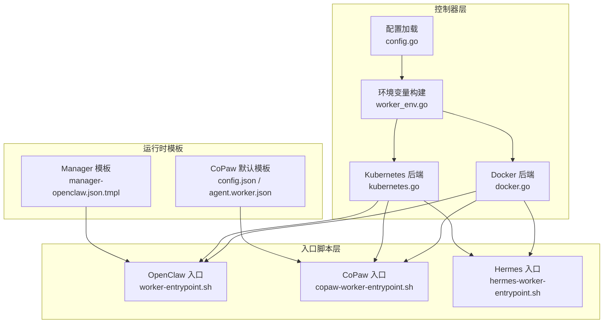
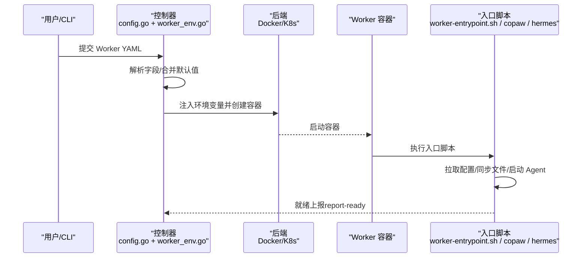
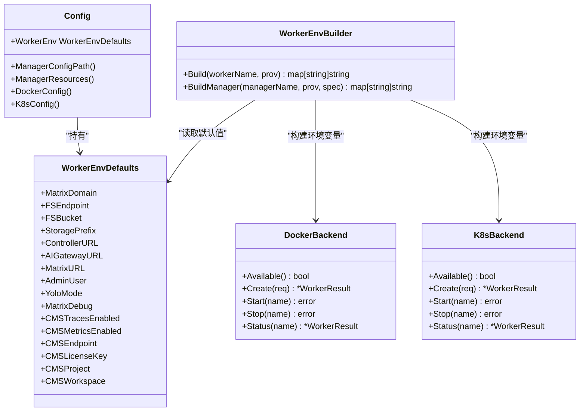

# Worker 创建与配置

<cite>
**本文引用的文件**
- [README.md](file://README.md)
- [docs/worker-guide.md](file://docs/worker-guide.md)
- [docs/declarative-resource-management.md](file://docs/declarative-resource-management.md)
- [worker/scripts/worker-entrypoint.sh](file://worker/scripts/worker-entrypoint.sh)
- [copaw/scripts/copaw-worker-entrypoint.sh](file://copaw/scripts/copaw-worker-entrypoint.sh)
- [hermes/scripts/hermes-worker-entrypoint.sh](file://hermes/scripts/hermes-worker-entrypoint.sh)
- [hiclaw-controller/internal/service/worker_env.go](file://hiclaw-controller/internal/service/worker_env.go)
- [hiclaw-controller/internal/backend/docker.go](file://hiclaw-controller/internal/backend/docker.go)
- [hiclaw-controller/internal/backend/kubernetes.go](file://hiclaw-controller/internal/backend/kubernetes.go)
- [hiclaw-controller/cmd/hiclaw/worker_cmd.go](file://hiclaw-controller/cmd/hiclaw/worker_cmd.go)
- [hiclaw-controller/internal/config/config.go](file://hiclaw-controller/internal/config/config.go)
- [copaw/src/copaw_worker/config.py](file://copaw/src/copaw_worker/config.py)
- [hermes/src/hermes_worker/config.py](file://hermes/src/hermes_worker/config.py)
- [copaw/src/copaw_worker/templates/config.json](file://copaw/src/copaw_worker/templates/config.json)
- [copaw/src/copaw_worker/templates/agent.worker.json](file://copaw/src/copaw_worker/templates/agent.worker.json)
- [manager/configs/manager-openclaw.json.tmpl](file://manager/configs/manager-openclaw.json.tmpl)
</cite>

## 目录
1. [简介](#简介)
2. [项目结构](#项目结构)
3. [核心组件](#核心组件)
4. [架构总览](#架构总览)
5. [详细组件分析](#详细组件分析)
6. [依赖关系分析](#依赖关系分析)
7. [性能考虑](#性能考虑)
8. [故障排除指南](#故障排除指南)
9. [结论](#结论)
10. [附录](#附录)

## 简介
本文件面向 HiClaw 平台的 Worker 创建与配置，系统性阐述以下主题：
- Worker 的创建流程：直接创建与 Docker 命令两种方式的差异与适用场景
- 声明式资源配置：YAML 字段语义、校验与最佳实践
- 不同运行时（OpenClaw、CoPaw、Hermes）的配置差异与特定设置
- Worker 环境变量配置：MinIO、Matrix、AI 网关等关键参数
- 完整配置示例、安全与性能优化建议、故障排除清单
- 实际使用场景的配置模板与部署脚本思路

## 项目结构
围绕 Worker 的创建与配置，HiClaw 在控制器、入口脚本、后端实现与运行时模板之间形成清晰分层：
- 控制器层：负责解析 YAML、生成环境变量、选择后端（Docker/Kubernetes）、下发到 Worker 容器
- 入口脚本层：各运行时的容器启动脚本负责拉取配置、同步文件、启动 Agent
- 后端层：封装 Docker/K8s 的容器生命周期管理
- 配置模板层：运行时默认配置与 Manager 模板

图表来源
- [hiclaw-controller/internal/config/config.go:207-356](file://hiclaw-controller/internal/config/config.go#L207-L356)
- [hiclaw-controller/internal/service/worker_env.go:19-36](file://hiclaw-controller/internal/service/worker_env.go#L19-L36)
- [hiclaw-controller/internal/backend/docker.go:87-209](file://hiclaw-controller/internal/backend/docker.go#L87-L209)
- [hiclaw-controller/internal/backend/kubernetes.go:151-313](file://hiclaw-controller/internal/backend/kubernetes.go#L151-L313)
- [worker/scripts/worker-entrypoint.sh:1-359](file://worker/scripts/worker-entrypoint.sh#L1-L359)
- [copaw/scripts/copaw-worker-entrypoint.sh:1-144](file://copaw/scripts/copaw-worker-entrypoint.sh#L1-L144)
- [hermes/scripts/hermes-worker-entrypoint.sh:1-157](file://hermes/scripts/hermes-worker-entrypoint.sh#L1-L157)
- [copaw/src/copaw_worker/templates/config.json:1-21](file://copaw/src/copaw_worker/templates/config.json#L1-L21)
- [copaw/src/copaw_worker/templates/agent.worker.json:1-25](file://copaw/src/copaw_worker/templates/agent.worker.json#L1-L25)
- [manager/configs/manager-openclaw.json.tmpl:1-145](file://manager/configs/manager-openclaw.json.tmpl#L1-L145)

章节来源
- [README.md: 110-238:110-238](file://README.md#L110-L238)
- [docs/declarative-resource-management.md: 41-153:41-153](file://docs/declarative-resource-management.md#L41-L153)
- [docs/worker-guide.md: 30-185:30-185](file://docs/worker-guide.md#L30-L185)

## 核心组件
- 声明式资源：Worker、Team、Human、Manager 的 YAML 资源定义与状态机
- 环境变量注入：控制器根据集群默认值与资源规范生成 Worker 环境变量
- 后端选择：Docker 后端用于本地嵌入模式；Kubernetes 后端用于云原生模式
- 入口脚本：各运行时容器启动时的初始化流程，包括配置拉取、文件同步、网关健康检查与就绪上报
- 运行时模板：CoPaw 的默认安全策略与通道配置模板，Manager 的 openclaw.json 模板

章节来源
- [docs/declarative-resource-management.md: 41-153:41-153](file://docs/declarative-resource-management.md#L41-L153)
- [hiclaw-controller/internal/service/worker_env.go: 19-36:19-36](file://hiclaw-controller/internal/service/worker_env.go#L19-L36)
- [hiclaw-controller/internal/backend/docker.go: 87-209:87-209](file://hiclaw-controller/internal/backend/docker.go#L87-L209)
- [hiclaw-controller/internal/backend/kubernetes.go: 151-313:151-313](file://hiclaw-controller/internal/backend/kubernetes.go#L151-L313)
- [worker/scripts/worker-entrypoint.sh: 1-L359:1-359](file://worker/scripts/worker-entrypoint.sh#L1-L359)
- [copaw/scripts/copaw-worker-entrypoint.sh: 1-L144:1-144](file://copaw/scripts/copaw-worker-entrypoint.sh#L1-L144)
- [hermes/scripts/hermes-worker-entrypoint.sh: 1-L157:1-157](file://hermes/scripts/hermes-worker-entrypoint.sh#L1-L157)
- [copaw/src/copaw_worker/templates/config.json: 1-L21:1-21](file://copaw/src/copaw_worker/templates/config.json#L1-L21)
- [copaw/src/copaw_worker/templates/agent.worker.json: 1-L25:1-25](file://copaw/src/copaw_worker/templates/agent.worker.json#L1-L25)
- [manager/configs/manager-openclaw.json.tmpl: 1-L145:1-145](file://manager/configs/manager-openclaw.json.tmpl#L1-L145)

## 架构总览
下图展示从 YAML 到 Worker 容器启动的关键路径，以及各运行时入口脚本的职责分工。

图表来源
- [docs/declarative-resource-management.md: 129-139:129-139](file://docs/declarative-resource-management.md#L129-L139)
- [hiclaw-controller/internal/service/worker_env.go: 19-L36:19-36](file://hiclaw-controller/internal/service/worker_env.go#L19-L36)
- [hiclaw-controller/internal/backend/docker.go: 87-L209:87-209](file://hiclaw-controller/internal/backend/docker.go#L87-L209)
- [hiclaw-controller/internal/backend/kubernetes.go: 151-L313:151-313](file://hiclaw-controller/internal/backend/kubernetes.go#L151-L313)
- [worker/scripts/worker-entrypoint.sh: 1-L359:1-359](file://worker/scripts/worker-entrypoint.sh#L1-L359)
- [copaw/scripts/copaw-worker-entrypoint.sh: 1-L144:1-144](file://copaw/scripts/copaw-worker-entrypoint.sh#L1-L144)
- [hermes/scripts/hermes-worker-entrypoint.sh: 1-L157:1-157](file://hermes/scripts/hermes-worker-entrypoint.sh#L1-L157)

## 详细组件分析

### Worker 创建流程：直接创建 vs Docker 命令
- 直接创建（推荐本地开发）
  - 当控制器具备主机容器运行时 Socket 访问权限时，可直接在宿主机上创建 Worker 容器，无需手动执行命令
  - 适合本地快速体验与调试
- Docker 命令（远程部署）
  - 当不具备 Socket 权限时，控制器会返回一个 docker run 命令，需在目标主机复制执行
  - 适合跨主机或受限环境的 Worker 部署

章节来源
- [docs/worker-guide.md: 34-58:34-58](file://docs/worker-guide.md#L34-L58)
- [hiclaw-controller/internal/backend/docker.go: 67-L85:67-85](file://hiclaw-controller/internal/backend/docker.go#L67-L85)

### 声明式资源配置：YAML 字段与校验
- Worker 基本字段
  - metadata.name：全局唯一
  - spec.model：LLM 模型标识
  - spec.runtime：运行时类型（openclaw/copaw/hermes）
  - spec.image：自定义镜像覆盖
  - spec.identity/soul/agents：内联身份/个性/行为规则
  - spec.skills：平台内置技能集合
  - spec.mcpServers：MCP 服务器列表（name/url/transport）
  - spec.package：自定义包（ZIP），支持 file://、http(s)://、nacos://
  - spec.expose：通过网关暴露端口
  - spec.channelPolicy：通信白名单/黑名单覆盖
  - spec.state：期望生命周期（Running/Sleeping/Stopped）

- 字段参考与优先级
  - 内联字段与 package 中文件互斥时，内联覆盖 package
  - package 支持 manifest.json 指定 runtime/base_image/apt/pip/npm 等

- 创建流程
  - 解析 package → 注册 Matrix 账号与房间 → 创建 MinIO 用户与授权 → 生成 openclaw.json → 推送配置 → 更新注册表 → 启动容器

章节来源
- [docs/declarative-resource-management.md: 41-96:41-96](file://docs/declarative-resource-management.md#L41-L96)
- [docs/declarative-resource-management.md: 112-139:112-139](file://docs/declarative-resource-management.md#L112-L139)
- [docs/declarative-resource-management.md: 541-595:541-595](file://docs/declarative-resource-management.md#L541-L595)

### 运行时差异与特定设置
- OpenClaw（默认）
  - 工作区：/root/hiclaw-fs/agents/<name>，HOME 指向该目录
  - 入口脚本负责：配置 mc、拉取配置与共享数据、启动双向镜像同步、配置 mcporter、启动 openclaw 网关
  - 支持矩阵重登录以修复 E2EE 密钥不匹配问题
- CoPaw
  - 工作区：/root/.hiclaw-worker/<name>，并通过符号链接对齐 /root/hiclaw-fs 以兼容脚本
  - 入口脚本负责：云模式下的 RRSA/STS 凭据注入、CMS 插件配置、控制台端口、CoPaw 配置目录
- Hermes
  - 工作区：/root/hiclaw-fs/agents/<name>，HERMES_HOME 位于工作区内
  - 入口脚本负责：云模式凭据注入、Hermes 自动确认与禁用 Home Channel 提示、OTel 导出配置

章节来源
- [docs/worker-guide.md: 22-29:22-29](file://docs/worker-guide.md#L22-L29)
- [docs/worker-guide.md: 139-185:139-185](file://docs/worker-guide.md#L139-L185)
- [worker/scripts/worker-entrypoint.sh: 1-L359:1-359](file://worker/scripts/worker-entrypoint.sh#L1-L359)
- [copaw/scripts/copaw-worker-entrypoint.sh: 1-L144:1-144](file://copaw/scripts/copaw-worker-entrypoint.sh#L1-L144)
- [hermes/scripts/hermes-worker-entrypoint.sh: 1-L157:1-157](file://hermes/scripts/hermes-worker-entrypoint.sh#L1-L157)

### 环境变量配置：MinIO、Matrix、AI 网关
- 控制器侧默认值
  - HICLAW_MATRIX_URL、HICLAW_AI_GATEWAY_URL、HICLAW_FS_ENDPOINT、HICLAW_FS_BUCKET、HICLAW_STORAGE_PREFIX、HICLAW_CONTROLLER_URL
  - HICLAW_MATRIX_DOMAIN、HICLAW_ADMIN_USER、HICLAW_YOLO、HICLAW_MATRIX_DEBUG、CMS 相关
- Worker 侧注入
  - HICLAW_WORKER_NAME、HICLAW_WORKER_GATEWAY_KEY、HICLAW_WORKER_MATRIX_TOKEN、HICLAW_FS_ACCESS_KEY、HICLAW_FS_SECRET_KEY
  - HOME、OPENCLAW_DISABLE_BONJOUR、OPENCLAW_MDNS_HOSTNAME、HICLAW_CONSOLE_PORT（CoPaw）
- 运行时差异
  - OpenClaw：通过入口脚本配置 mc、拉取 openclaw.json、启动网关
  - CoPaw：支持 HICLAW_RUNTIME=aliyun 使用 RRSA/STS，配置 CMS 插件
  - Hermes：设置 HERMES_HOME、自动确认与禁用 Home Channel 提示、OTel 导出

章节来源
- [hiclaw-controller/internal/config/config.go: 314-L334:314-334](file://hiclaw-controller/internal/config/config.go#L314-L334)
- [hiclaw-controller/internal/service/worker_env.go: 19-L36:19-36](file://hiclaw-controller/internal/service/worker_env.go#L19-L36)
- [worker/scripts/worker-entrypoint.sh: 1-L359:1-359](file://worker/scripts/worker-entrypoint.sh#L1-L359)
- [copaw/scripts/copaw-worker-entrypoint.sh: 1-L144:1-144](file://copaw/scripts/copaw-worker-entrypoint.sh#L1-L144)
- [hermes/scripts/hermes-worker-entrypoint.sh: 1-L157:1-157](file://hermes/scripts/hermes-worker-entrypoint.sh#L1-L157)

### 生命周期管理与就绪上报
- 控制器提供 Worker 子命令：wake/sleep/ensure-ready/status/report-ready
- 入口脚本在检测到网关健康或配置可用后，调用 hiclaw worker report-ready 上报就绪
- 支持心跳循环（可选间隔）

章节来源
- [hiclaw-controller/cmd/hiclaw/worker_cmd.go: 28-L289:28-289](file://hiclaw-controller/cmd/hiclaw/worker_cmd.go#L28-L289)
- [worker/scripts/worker-entrypoint.sh: 328-L352:328-352](file://worker/scripts/worker-entrypoint.sh#L328-L352)
- [copaw/scripts/copaw-worker-entrypoint.sh: 64-L88:64-88](file://copaw/scripts/copaw-worker-entrypoint.sh#L64-L88)
- [hermes/scripts/hermes-worker-entrypoint.sh: 66-L89:66-89](file://hermes/scripts/hermes-worker-entrypoint.sh#L66-L89)

### 文件同步与热重载
- 本地变更触发推送（change-triggered），避免推送刚拉取的文件
- 远程变更周期性回拉（每 5 分钟），并刷新拉取标记
- openclaw.json 使用本地优先合并策略，确保本地自改不被覆盖

章节来源
- [worker/scripts/worker-entrypoint.sh: 142-L225:142-225](file://worker/scripts/worker-entrypoint.sh#L142-L225)

### 运行时模板与安全策略
- CoPaw 默认模板
  - 安全策略（security.tool_guard、file_guard、skill_scanner）
  - 通道配置（channels.matrix.allow_from/group_allow_from/groups）
- Manager 模板
  - 网关、Matrix、模型、工具、会话、插件、命令等配置项

章节来源
- [copaw/src/copaw_worker/templates/config.json: 1-L21:1-21](file://copaw/src/copaw_worker/templates/config.json#L1-L21)
- [copaw/src/copaw_worker/templates/agent.worker.json: 1-L25:1-25](file://copaw/src/copaw_worker/templates/agent.worker.json#L1-L25)
- [manager/configs/manager-openclaw.json.tmpl: 1-L145:1-145](file://manager/configs/manager-openclaw.json.tmpl#L1-L145)

## 依赖关系分析
- 控制器配置与环境变量
  - config.go 加载集群/服务端口/存储/网关/Matrix 等默认值，并修正 MinIO S3 端点
  - worker_env.go 将这些默认值注入到 Worker 环境变量中
- 后端选择
  - Docker 后端：直接基于 Unix Socket 与 Docker API 交互，支持端口冲突重试与清理
  - Kubernetes 后端：通过 Pod 模板叠加资源限制、SA 令牌挂载、HostAliases 等
- 入口脚本与运行时
  - OpenClaw：拉取配置、镜像同步、启动网关、就绪上报
  - CoPaw：云模式凭据注入、CMS 插件、控制台端口
  - Hermes：HERMES_HOME、自动确认、OTel 导出

图表来源
- [hiclaw-controller/internal/config/config.go: 19-L162:19-162](file://hiclaw-controller/internal/config/config.go#L19-L162)
- [hiclaw-controller/internal/service/worker_env.go: 8-L36:8-36](file://hiclaw-controller/internal/service/worker_env.go#L8-L36)
- [hiclaw-controller/internal/backend/docker.go: 20-L51:20-51](file://hiclaw-controller/internal/backend/docker.go#L20-L51)
- [hiclaw-controller/internal/backend/kubernetes.go: 23-L59:23-59](file://hiclaw-controller/internal/backend/kubernetes.go#L23-L59)

章节来源
- [hiclaw-controller/internal/config/config.go: 207-L356:207-356](file://hiclaw-controller/internal/config/config.go#L207-L356)
- [hiclaw-controller/internal/service/worker_env.go: 19-L36:19-36](file://hiclaw-controller/internal/service/worker_env.go#L19-L36)
- [hiclaw-controller/internal/backend/docker.go: 67-L209:67-209](file://hiclaw-controller/internal/backend/docker.go#L67-L209)
- [hiclaw-controller/internal/backend/kubernetes.go: 147-L313:147-313](file://hiclaw-controller/internal/backend/kubernetes.go#L147-L313)

## 性能考虑
- 资源配额：Kubernetes 后端默认 Worker CPU/内存请求与限制可按需调整
- 同步策略：本地变更触发推送，减少不必要的镜像同步；远端回拉周期性刷新，平衡实时性与带宽
- 端口冲突：Docker 后端在控制台端口占用时自动重试并清理容器
- 热重载：openclaw.json 采用本地优先合并，避免覆盖用户自定义

章节来源
- [hiclaw-controller/internal/backend/kubernetes.go: 386-L429:386-429](file://hiclaw-controller/internal/backend/kubernetes.go#L386-L429)
- [hiclaw-controller/internal/backend/docker.go: 162-L209:162-209](file://hiclaw-controller/internal/backend/docker.go#L162-L209)
- [worker/scripts/worker-entrypoint.sh: 142-L225:142-225](file://worker/scripts/worker-entrypoint.sh#L142-L225)

## 故障排除指南
- Worker 无法启动
  - 检查容器日志
  - 常见原因：openclaw.json 未生成、mc 命令缺失、Manager 未运行或端口未暴露
- 无法连接 Matrix
  - 从 Worker 内部访问 Matrix 版本接口验证可达性
  - 校验 openclaw.json 中 channels.matrix 配置
- 无法访问 AI 网关
  - 使用 Worker 的消费者密钥测试 /v1/models
  - 401：核对消费者密钥与网关一致；403：确认已授权路由
- 无法访问 MCP（GitHub）
  - 使用 mcporter 测试服务器连通性与授权
- 重置 Worker
  - 停止并删除容器后，要求 Manager 重新创建

章节来源
- [docs/worker-guide.md: 61-L123:61-123](file://docs/worker-guide.md#L61-L123)

## 结论
HiClaw 的 Worker 创建与配置体系以声明式资源为核心，结合控制器的环境变量注入与后端抽象，实现了在本地与云原生环境的一致体验。通过运行时模板与入口脚本，Worker 能够在启动阶段完成配置拉取、文件同步与就绪上报，确保与 Manager 和基础设施的无缝协作。遵循本文的安全与性能建议，可获得稳定、可观测且易于维护的多运行时协同环境。

## 附录

### 配置示例与最佳实践
- 声明式 Worker 示例（YAML）
  - 参考：[docs/declarative-resource-management.md: 47-77:47-77](file://docs/declarative-resource-management.md#L47-L77)
  - 自定义包示例：[docs/declarative-resource-management.md: 114-127:114-127](file://docs/declarative-resource-management.md#L114-L127)
- 运行时特定设置
  - OpenClaw：参考入口脚本中的配置拉取与同步逻辑
    - [worker/scripts/worker-entrypoint.sh: 35-L98:35-98](file://worker/scripts/worker-entrypoint.sh#L35-L98)
    - [worker/scripts/worker-entrypoint.sh: 142-L225:142-225](file://worker/scripts/worker-entrypoint.sh#L142-L225)
  - CoPaw：云模式凭据注入与 CMS 插件
    - [copaw/scripts/copaw-worker-entrypoint.sh: 36-L56:36-56](file://copaw/scripts/copaw-worker-entrypoint.sh#L36-L56)
    - [copaw/scripts/copaw-worker-entrypoint.sh: 104-L123:104-123](file://copaw/scripts/copaw-worker-entrypoint.sh#L104-L123)
  - Hermes：HERMES_HOME、自动确认与 OTel 导出
    - [hermes/scripts/hermes-worker-entrypoint.sh: 97-L124:97-124](file://hermes/scripts/hermes-worker-entrypoint.sh#L97-L124)
    - [hermes/scripts/hermes-worker-entrypoint.sh: 132-L143:132-143](file://hermes/scripts/hermes-worker-entrypoint.sh#L132-L143)
- 环境变量清单（关键）
  - 控制器默认：[hiclaw-controller/internal/config/config.go: 314-L334:314-334](file://hiclaw-controller/internal/config/config.go#L314-L334)
  - Worker 注入：[hiclaw-controller/internal/service/worker_env.go: 19-L36:19-36](file://hiclaw-controller/internal/service/worker_env.go#L19-L36)
- 运行时模板
  - CoPaw 安全策略与通道：[copaw/src/copaw_worker/templates/config.json: 1-L21:1-21](file://copaw/src/copaw_worker/templates/config.json#L1-L21)、[copaw/src/copaw_worker/templates/agent.worker.json: 1-L25:1-25](file://copaw/src/copaw_worker/templates/agent.worker.json#L1-L25)
  - Manager 模板：[manager/configs/manager-openclaw.json.tmpl: 1-L145:1-145](file://manager/configs/manager-openclaw.json.tmpl#L1-L145)

### 实际使用场景的配置模板与部署脚本思路
- 场景一：本地开发（直接创建）
  - 在具备 Docker Socket 的环境中，由控制器直接创建 Worker 容器，无需手动 docker run
  - 参考：[docs/worker-guide.md: 34-L41:34-41](file://docs/worker-guide.md#L34-L41)
- 场景二：远程部署（Docker 命令）
  - 通过控制器提供的 docker run 命令在目标主机执行
  - 参考：[docs/worker-guide.md: 42-L58:42-58](file://docs/worker-guide.md#L42-L58)
- 场景三：批量部署（多资源 YAML）
  - 使用多文档 YAML，先定义 Team，再定义 Human，最后定义 Worker
  - 参考：[docs/declarative-resource-management.md: 689-L781:689-781](file://docs/declarative-resource-management.md#L689-L781)
- 场景四：Kubernetes 生产部署
  - 使用 Helm Chart，默认包含 Higress、Tuwunel、MinIO 与控制器，按需设置凭据与公开地址
  - 参考：[README.md: 110-L238:110-238](file://README.md#L110-L238)