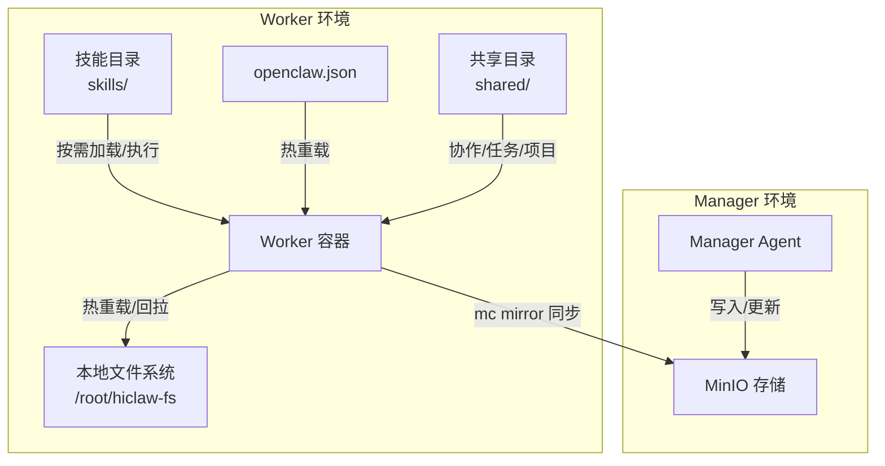
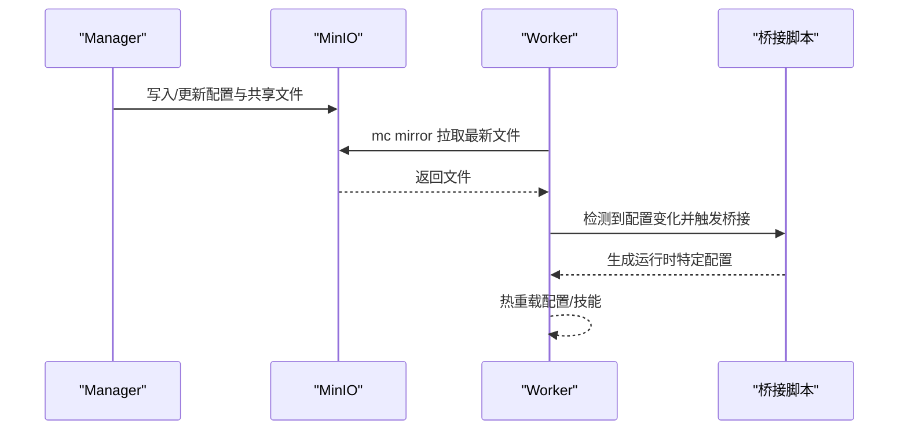
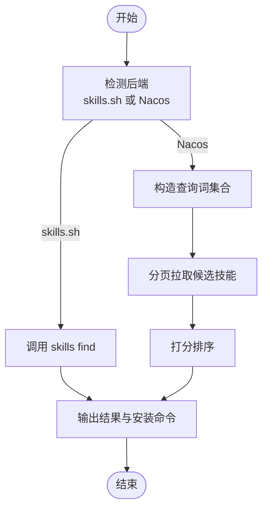
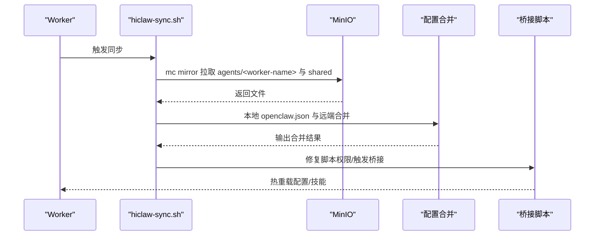
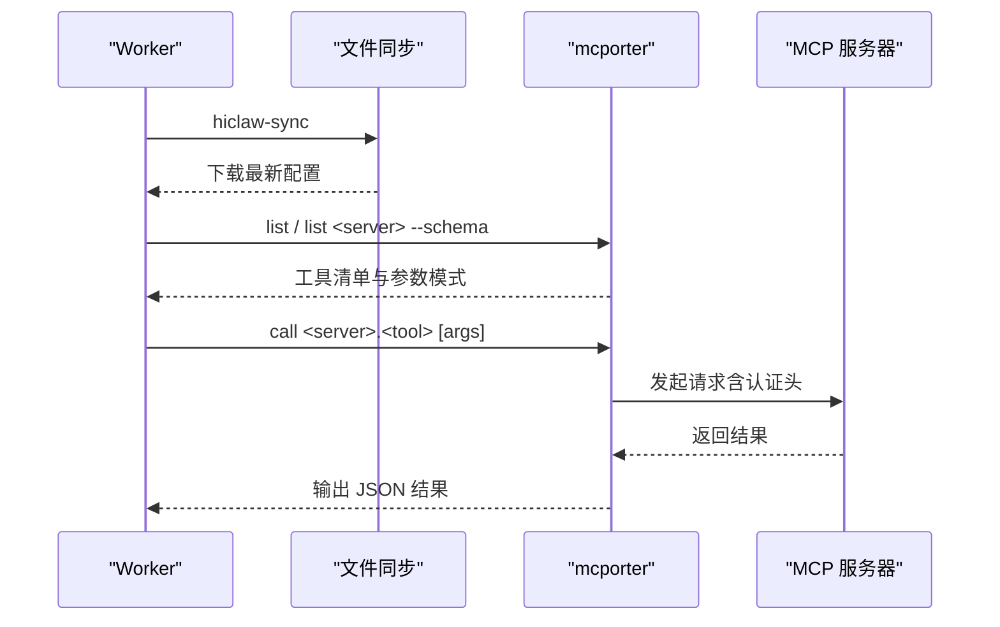
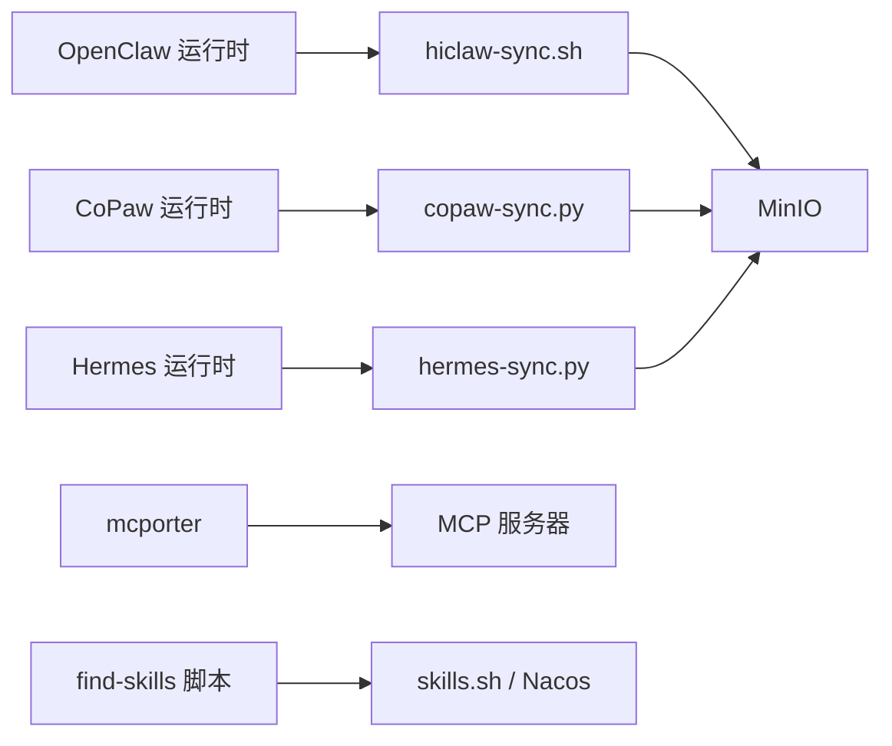

# Worker 技能系统

<cite>
**本文引用的文件**
- [README.md](file://README.md)
- [docs/worker-guide.md](file://docs/worker-guide.md)
- [docs/zh-cn/worker-guide.md](file://docs/zh-cn/worker-guide.md)
- [manager/agent/worker-agent/skills/file-sync/SKILL.md](file://manager/agent/worker-agent/skills/file-sync/SKILL.md)
- [manager/agent/worker-agent/skills/find-skills/SKILL.md](file://manager/agent/worker-agent/skills/find-skills/SKILL.md)
- [manager/agent/worker-agent/skills/mcporter/SKILL.md](file://manager/agent/worker-agent/skills/mcporter/SKILL.md)
- [manager/agent/worker-agent/skills/project-participation/SKILL.md](file://manager/agent/worker-agent/skills/project-participation/SKILL.md)
- [manager/agent/worker-agent/skills/task-progress/SKILL.md](file://manager/agent/worker-agent/skills/task-progress/SKILL.md)
- [manager/agent/worker-agent/skills/file-sync/scripts/hiclaw-sync.sh](file://manager/agent/worker-agent/skills/file-sync/scripts/hiclaw-sync.sh)
- [manager/agent/worker-agent/skills/find-skills/scripts/hiclaw-find-skill.sh](file://manager/agent/worker-agent/skills/find-skills/scripts/hiclaw-find-skill.sh)
- [manager/agent/copaw-worker-agent/skills/file-sync/scripts/copaw-sync.py](file://manager/agent/copaw-worker-agent/skills/file-sync/scripts/copaw-sync.py)
- [manager/agent/hermes-worker-agent/skills/file-sync/scripts/hermes-sync.py](file://manager/agent/hermes-worker-agent/skills/file-sync/scripts/hermes-sync.py)
</cite>

## 目录
1. [简介](#简介)
2. [项目结构](#项目结构)
3. [核心组件](#核心组件)
4. [架构总览](#架构总览)
5. [详细组件分析](#详细组件分析)
6. [依赖关系分析](#依赖关系分析)
7. [性能考量](#性能考量)
8. [故障排查指南](#故障排查指南)
9. [结论](#结论)
10. [附录](#附录)

## 简介
本文件面向 HiClaw 的 Worker 技能系统，系统性阐述技能的发现、加载、执行与管理机制，覆盖内置技能的分类与功能（文件同步、技能查找、项目参与、任务进度跟踪、MCP 工具调用等），并提供开发规范、部署流程、最佳实践与调试方法，帮助开发者快速构建与维护高质量的 Worker 技能。

## 项目结构
HiClaw 的 Worker 技能体系围绕“集中式配置与共享文件 + 多运行时兼容”的设计展开：
- Worker 通过 MinIO 进行配置与共享文件的双向同步，支持热重载与定时回拉。
- 不同运行时（OpenClaw/QwenPaw/Hermes）提供统一的技能接口与脚本路径，确保跨运行时一致性。
- 内置技能位于各运行时的 worker-agent/skills 目录下，每个技能包含 SKILL.md 文档与必要的脚本。

图示来源
- [docs/worker-guide.md:137-174](file://docs/worker-guide.md#L137-L174)
- [docs/zh-cn/worker-guide.md:137-174](file://docs/zh-cn/worker-guide.md#L137-L174)

章节来源
- [docs/worker-guide.md:1-185](file://docs/worker-guide.md#L1-L185)
- [docs/zh-cn/worker-guide.md:1-185](file://docs/zh-cn/worker-guide.md#L1-L185)

## 核心组件
- 技能发现与安装（find-skills）
  - 支持 skills.sh 与企业私有 Nacos 注册表，提供搜索、安装与更新能力。
  - 统一脚本路径，避免相对路径依赖。
- 文件同步（file-sync）
  - 三类运行时分别提供同步入口：hiclaw-sync（OpenClaw）、copaw-sync（CoPaw）、hermes-sync（Hermes）。
  - 支持即时拉取与自动回拉，保留本地优先配置并通过合并策略应用远端覆盖。
- MCP 工具调用（mcporter）
  - 通过 mcporter CLI 调用 MCP 服务器工具，自动注入认证头，支持列出工具与参数模式。
- 项目参与（project-participation）
  - 提供项目计划读取、任务协调与 Git 作者信息配置规范。
- 任务进度（task-progress）
  - 规范化进度日志格式、任务历史记录与恢复流程，确保会话中断后的可恢复性。

章节来源
- [manager/agent/worker-agent/skills/find-skills/SKILL.md:1-173](file://manager/agent/worker-agent/skills/find-skills/SKILL.md#L1-L173)
- [manager/agent/worker-agent/skills/file-sync/SKILL.md:1-20](file://manager/agent/worker-agent/skills/file-sync/SKILL.md#L1-L20)
- [manager/agent/worker-agent/skills/mcporter/SKILL.md:1-110](file://manager/agent/worker-agent/skills/mcporter/SKILL.md#L1-L110)
- [manager/agent/worker-agent/skills/project-participation/SKILL.md:1-46](file://manager/agent/worker-agent/skills/project-participation/SKILL.md#L1-L46)
- [manager/agent/worker-agent/skills/task-progress/SKILL.md:1-71](file://manager/agent/worker-agent/skills/task-progress/SKILL.md#L1-L71)

## 架构总览
Worker 技能系统采用“集中式配置 + 双向文件同步 + 运行时桥接”的架构：
- 配置与共享文件统一存放于 MinIO，Worker 通过 mc mirror 实时/定时同步。
- 运行时通过桥接脚本将 openclaw.json 等配置转换为各自运行时所需的配置文件，实现热重载。
- 技能以模块化方式组织，按需加载与执行，支持外部 MCP 工具与公共技能生态。

图示来源
- [docs/worker-guide.md:137-174](file://docs/worker-guide.md#L137-L174)
- [docs/zh-cn/worker-guide.md:137-174](file://docs/zh-cn/worker-guide.md#L137-L174)

## 详细组件分析

### 技能发现与安装（find-skills）
- 功能要点
  - 支持 skills.sh 与 Nacos 私有注册表，自动识别后端并渲染一致输出。
  - 提供搜索、安装、检查更新与批量更新命令。
  - 强制使用固定脚本路径，避免相对路径导致的执行失败。
- 关键流程
  - 解析环境变量确定注册表地址与认证参数。
  - 构造查询词集合，分页拉取候选技能并打分排序。
  - 输出前 MAX_RESULTS 条结果与安装命令提示。

图示来源
- [manager/agent/worker-agent/skills/find-skills/scripts/hiclaw-find-skill.sh:451-487](file://manager/agent/worker-agent/skills/find-skills/scripts/hiclaw-find-skill.sh#L451-L487)
- [manager/agent/worker-agent/skills/find-skills/SKILL.md:26-51](file://manager/agent/worker-agent/skills/find-skills/SKILL.md#L26-L51)

章节来源
- [manager/agent/worker-agent/skills/find-skills/SKILL.md:1-173](file://manager/agent/worker-agent/skills/find-skills/SKILL.md#L1-L173)
- [manager/agent/worker-agent/skills/find-skills/scripts/hiclaw-find-skill.sh:1-488](file://manager/agent/worker-agent/skills/find-skills/scripts/hiclaw-find-skill.sh#L1-L488)

### 文件同步（file-sync）
- OpenClaw（hiclaw-sync）
  - 通过 mc mirror 拉取 agents/<worker-name>/ 与 shared/，并保留本地 openclaw.json，随后进行合并，确保本地优先配置不被覆盖。
  - 自动修复脚本可执行位，保证技能脚本可用。
- CoPaw（copaw-sync）
  - 通过 Python 同步器拉取配置与技能，完成后桥接 openclaw.json 至 CoPaw 配置，实现热重载。
- Hermes（hermes-sync）
  - 同步配置并桥接至 ~/.hermes，部分配置变更需要重启进程，SOUL.md 与技能变更在下次消息到达时生效。

图示来源
- [manager/agent/worker-agent/skills/file-sync/scripts/hiclaw-sync.sh:1-49](file://manager/agent/worker-agent/skills/file-sync/scripts/hiclaw-sync.sh#L1-L49)
- [manager/agent/worker-agent/skills/file-sync/SKILL.md:1-20](file://manager/agent/worker-agent/skills/file-sync/SKILL.md#L1-L20)

章节来源
- [manager/agent/worker-agent/skills/file-sync/SKILL.md:1-20](file://manager/agent/worker-agent/skills/file-sync/SKILL.md#L1-L20)
- [manager/agent/worker-agent/skills/file-sync/scripts/hiclaw-sync.sh:1-49](file://manager/agent/worker-agent/skills/file-sync/scripts/hiclaw-sync.sh#L1-L49)
- [manager/agent/copaw-worker-agent/skills/file-sync/scripts/copaw-sync.py:1-136](file://manager/agent/copaw-worker-agent/skills/file-sync/scripts/copaw-sync.py#L1-L136)
- [manager/agent/hermes-worker-agent/skills/file-sync/scripts/hermes-sync.py:1-132](file://manager/agent/hermes-worker-agent/skills/file-sync/scripts/hermes-sync.py#L1-L132)

### MCP 工具调用（mcporter）
- 功能要点
  - 通过 mcporter 列出/调用 MCP 服务器工具，自动注入 Bearer Token。
  - 当收到新 MCP 服务器通知时，先同步配置，再生成技能文档以便长期复用。
- 使用建议
  - 新增 MCP 服务器后，先执行文件同步，再列出工具并生成技能文档，最后向协调者确认。

图示来源
- [manager/agent/worker-agent/skills/mcporter/SKILL.md:1-110](file://manager/agent/worker-agent/skills/mcporter/SKILL.md#L1-L110)

章节来源
- [manager/agent/worker-agent/skills/mcporter/SKILL.md:1-110](file://manager/agent/worker-agent/skills/mcporter/SKILL.md#L1-L110)

### 项目参与（project-participation）
- 关键规范
  - 项目计划位于 shared/projects/{project-id}/plan.md，务必先同步再阅读。
  - Git 作者必须使用 worker 名称，确保贡献可追溯。
  - 任务完成后通过 @mention 协调者推进项目进展。

章节来源
- [manager/agent/worker-agent/skills/project-participation/SKILL.md:1-46](file://manager/agent/worker-agent/skills/project-participation/SKILL.md#L1-L46)

### 任务进度（task-progress）
- 关键规范
  - 每次有意义动作后追加进度日志，避免批量更新导致会话中断丢失。
  - task-history.json 为最近 10 条任务的 LRU 列表，溢出项保存至历史文件。
  - 恢复流程按日期顺序读取进度文件，继续执行。

章节来源
- [manager/agent/worker-agent/skills/task-progress/SKILL.md:1-71](file://manager/agent/worker-agent/skills/task-progress/SKILL.md#L1-L71)

## 依赖关系分析
- 运行时与脚本
  - OpenClaw：使用 hiclaw-sync.sh 与 SKILL.md。
  - CoPaw：使用 copaw-sync.py 与桥接逻辑。
  - Hermes：使用 hermes-sync.py 与桥接逻辑。
- 外部依赖
  - MinIO：作为集中式存储与同步源。
  - mcporter：用于 MCP 工具调用。
  - skills CLI：用于技能发现与安装。

图示来源
- [manager/agent/worker-agent/skills/file-sync/scripts/hiclaw-sync.sh:1-49](file://manager/agent/worker-agent/skills/file-sync/scripts/hiclaw-sync.sh#L1-L49)
- [manager/agent/copaw-worker-agent/skills/file-sync/scripts/copaw-sync.py:1-136](file://manager/agent/copaw-worker-agent/skills/file-sync/scripts/copaw-sync.py#L1-L136)
- [manager/agent/hermes-worker-agent/skills/file-sync/scripts/hermes-sync.py:1-132](file://manager/agent/hermes-worker-agent/skills/file-sync/scripts/hermes-sync.py#L1-L132)
- [manager/agent/worker-agent/skills/find-skills/scripts/hiclaw-find-skill.sh:1-488](file://manager/agent/worker-agent/skills/find-skills/scripts/hiclaw-find-skill.sh#L1-L488)
- [manager/agent/worker-agent/skills/mcporter/SKILL.md:1-110](file://manager/agent/worker-agent/skills/mcporter/SKILL.md#L1-L110)

## 性能考量
- 同步策略
  - 本地→远端：实时 watch 同步，降低延迟。
  - 远端→本地：每 5 分钟回拉一次，平衡新鲜度与带宽。
- 热重载
  - OpenClaw：配置变更约 300ms 内热重载。
  - CoPaw：配置变更约 2 秒内热重载。
  - Hermes：SOUL.md 与技能变更在下次消息到达时生效；涉及模型/矩阵等需重启。
- 资源占用
  - Worker 为无状态容器，配置与数据均存于 MinIO，容器删除不影响工作成果。

章节来源
- [docs/worker-guide.md:148-158](file://docs/worker-guide.md#L148-L158)
- [docs/zh-cn/worker-guide.md:148-158](file://docs/zh-cn/worker-guide.md#L148-L158)

## 故障排查指南
- Worker 启动失败
  - 检查 openclaw.json 是否存在、mc 命令是否可用、Manager 容器是否运行且端口可达。
- 无法连接 Matrix
  - 从 Worker 容器内访问 Matrix 版本接口验证连通性，核对 openclaw.json 中的 Matrix 配置。
- 无法访问 LLM
  - 使用 Worker 的消费者密钥测试 AI 网关，若返回 401/403，检查密钥匹配与路由授权。
- 无法访问 MCP（GitHub）
  - 使用 mcporter 测试工具调用，若返回 403，联系协调者重新授权。
- 重置 Worker
  - 停止并删除容器后，要求 Manager 重新创建，配置与任务数据仍保留在 MinIO。

章节来源
- [docs/worker-guide.md:61-123](file://docs/worker-guide.md#L61-L123)
- [docs/zh-cn/worker-guide.md:61-123](file://docs/zh-cn/worker-guide.md#L61-L123)

## 结论
HiClaw 的 Worker 技能系统通过集中式存储与多运行时桥接，实现了高可扩展、低耦合的技能生态。内置技能覆盖了从配置同步、技能发现、MCP 工具调用到项目协作与任务进度管理的关键场景。遵循本文的开发规范与最佳实践，可高效构建与维护高质量的 Worker 技能，并安全地接入公共或私有技能生态。

## 附录

### 开发规范与标准
- 目录结构
  - 每个技能以目录形式组织，包含 SKILL.md 与 scripts/。
  - SKILL.md 必须包含 name、description 等元信息与使用说明。
- 配置文件格式
  - 使用 openclaw.json 作为统一配置入口，运行时通过桥接脚本转换为自身配置。
- 脚本编写规范
  - 固定脚本路径，避免相对路径依赖。
  - 明确环境变量与错误处理，确保幂等与可重复执行。
  - 对外 MCP 工具调用统一通过 mcporter，自动注入认证头。

章节来源
- [manager/agent/worker-agent/skills/find-skills/SKILL.md:30-51](file://manager/agent/worker-agent/skills/find-skills/SKILL.md#L30-L51)
- [manager/agent/worker-agent/skills/mcporter/SKILL.md:8-26](file://manager/agent/worker-agent/skills/mcporter/SKILL.md#L8-L26)

### 部署流程
- 技能打包与上传
  - 将技能目录打包为 zip 并上传至 MinIO，或通过 skills CLI 安装至本地。
- 安装与激活
  - Worker 通过文件同步获取最新技能，自动修复脚本权限并热重载。
  - 对于需要重启的配置变更，协调者协助重启进程。

章节来源
- [manager/agent/worker-agent/skills/find-skills/SKILL.md:130-131](file://manager/agent/worker-agent/skills/find-skills/SKILL.md#L130-L131)
- [manager/agent/worker-agent/skills/file-sync/SKILL.md:14-18](file://manager/agent/worker-agent/skills/file-sync/SKILL.md#L14-L18)

### 最佳实践与调试
- 最佳实践
  - 保持技能职责单一，文档清晰，参数与示例完整。
  - 使用固定脚本路径，避免相对路径导致的执行失败。
  - 对外工具调用前先同步配置，确保认证与路由正确。
- 调试方法
  - 使用 hiclaw-sync 手动回拉最新配置与技能。
  - 通过 mcporter list/schema/call 验证 MCP 工具可用性。
  - 查看 Worker 日志定位异常，必要时导出调试日志辅助分析。

章节来源
- [docs/worker-guide.md:176-184](file://docs/worker-guide.md#L176-L184)
- [docs/zh-cn/worker-guide.md:176-184](file://docs/zh-cn/worker-guide.md#L176-L184)
- [README.md:367-378](file://README.md#L367-L378)