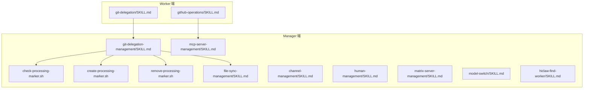
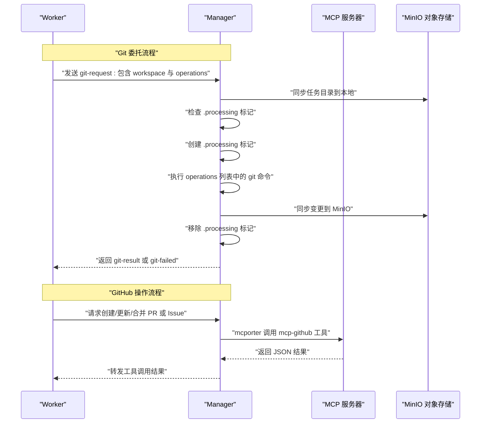
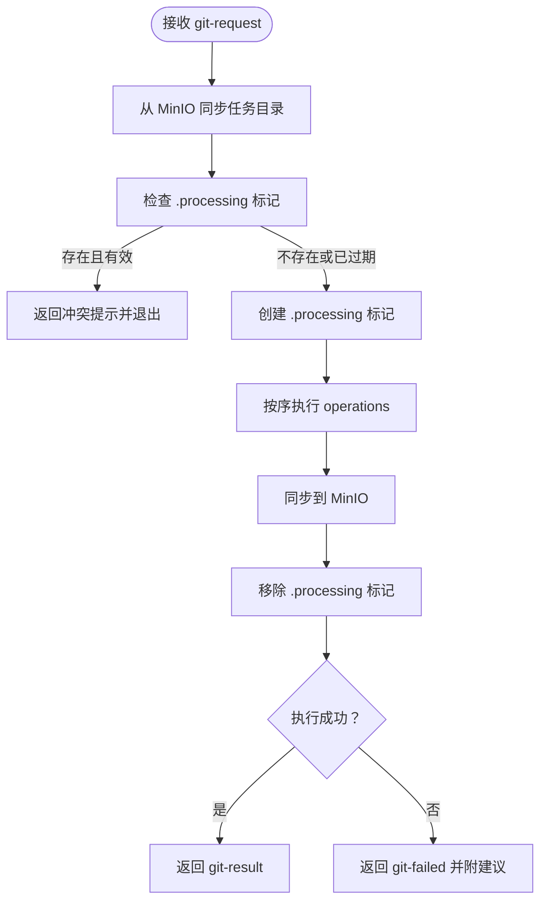
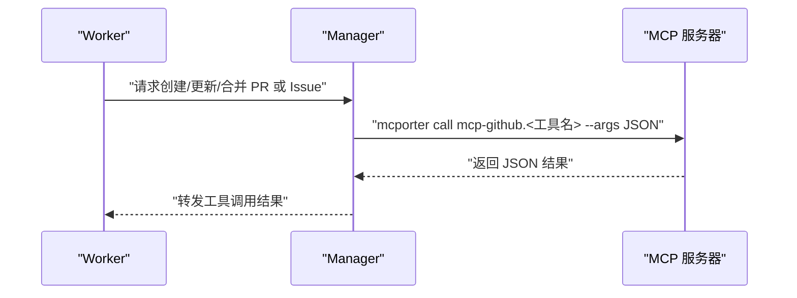
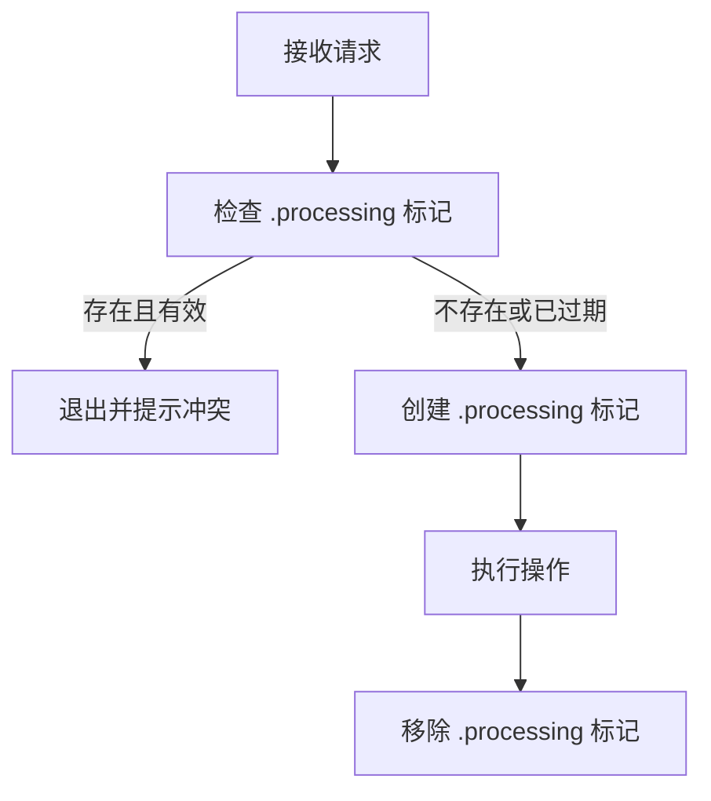
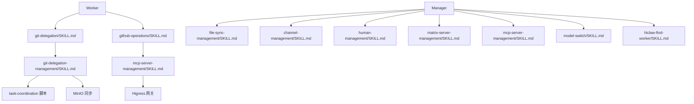

# 内置技能

<cite>
**本文引用的文件**
- [git-delegation/SKILL.md](file://manager/agent/worker-skills/git-delegation/SKILL.md)
- [github-operations/SKILL.md](file://manager/agent/worker-skills/github-operations/SKILL.md)
- [git-delegation-management/SKILL.md](file://manager/agent/skills/git-delegation-management/SKILL.md)
- [check-processing-marker.sh](file://manager/agent/skills/task-coordination/scripts/check-processing-marker.sh)
- [create-processing-marker.sh](file://manager/agent/skills/task-coordination/scripts/create-processing-marker.sh)
- [remove-processing-marker.sh](file://manager/agent/skills/task-coordination/scripts/remove-processing-marker.sh)
- [hiclaw-find-worker/SKILL.md](file://manager/agent/skills/hiclaw-find-worker/SKILL.md)
- [channel-management/SKILL.md](file://manager/agent/skills/channel-management/SKILL.md)
- [file-sync-management/SKILL.md](file://manager/agent/skills/file-sync-management/SKILL.md)
- [human-management/SKILL.md](file://manager/agent/skills/human-management/SKILL.md)
- [matrix-server-management/SKILL.md](file://manager/agent/skills/matrix-server-management/SKILL.md)
- [mcp-server-management/SKILL.md](file://manager/agent/skills/mcp-server-management/SKILL.md)
- [model-switch/SKILL.md](file://manager/agent/skills/model-switch/SKILL.md)
</cite>

## 目录
1. [简介](#简介)
2. [项目结构](#项目结构)
3. [核心组件](#核心组件)
4. [架构总览](#架构总览)
5. [详细组件分析](#详细组件分析)
6. [依赖关系分析](#依赖关系分析)
7. [性能考量](#性能考量)
8. [故障排查指南](#故障排查指南)
9. [结论](#结论)
10. [附录](#附录)

## 简介
本文件系统性梳理 HiClaw 中 Worker 的“内置技能”，重点覆盖两类核心能力：
- Git 委托：Worker 无 Git 凭据，所有需要认证的 Git 操作（克隆、推送、拉取、分支、提交、变基、合并、标签、子模块等）均通过“git-delegation”委托给 Manager 执行；Manager 在收到请求后以自身凭据执行并回传结果。
- GitHub 操作：通过 MCP 工具链集中化地管理 Pull Request 与 Issue（创建、更新、合并、评论、评审、搜索等），文件读写、分支与提交等仍由 Git 委托完成。

同时，文档还涵盖任务协调标记、文件同步、通道与联系人管理、人类用户管理、Matrix 服务器管理、MCP 服务器管理、模型切换等管理类技能，帮助读者理解 Worker 与 Manager 的协作边界与流程。

## 项目结构
内置技能主要分布在以下位置：
- Worker 端技能：位于 manager/agent/worker-skills 下，面向 Worker 的使用说明与调用方式
- Manager 端技能：位于 manager/agent/skills 下，面向 Manager 的执行逻辑与脚本
- 任务协调脚本：位于 manager/agent/skills/task-coordination/scripts 下，用于并发控制与一致性保障
- 其他管理技能：如 channel-management、file-sync-management、human-management、matrix-server-management、mcp-server-management、model-switch 等

图示来源
- [git-delegation/SKILL.md](file://manager/agent/worker-skills/git-delegation/SKILL.md)
- [github-operations/SKILL.md](file://manager/agent/worker-skills/github-operations/SKILL.md)
- [git-delegation-management/SKILL.md](file://manager/agent/skills/git-delegation-management/SKILL.md)
- [check-processing-marker.sh](file://manager/agent/skills/task-coordination/scripts/check-processing-marker.sh)
- [create-processing-marker.sh](file://manager/agent/skills/task-coordination/scripts/create-processing-marker.sh)
- [remove-processing-marker.sh](file://manager/agent/skills/task-coordination/scripts/remove-processing-marker.sh)
- [file-sync-management/SKILL.md](file://manager/agent/skills/file-sync-management/SKILL.md)
- [channel-management/SKILL.md](file://manager/agent/skills/channel-management/SKILL.md)
- [human-management/SKILL.md](file://manager/agent/skills/human-management/SKILL.md)
- [matrix-server-management/SKILL.md](file://manager/agent/skills/matrix-server-management/SKILL.md)
- [mcp-server-management/SKILL.md](file://manager/agent/skills/mcp-server-management/SKILL.md)
- [model-switch/SKILL.md](file://manager/agent/skills/model-switch/SKILL.md)
- [hiclaw-find-worker/SKILL.md](file://manager/agent/skills/hiclaw-find-worker/SKILL.md)

章节来源
- [git-delegation/SKILL.md](file://manager/agent/worker-skills/git-delegation/SKILL.md)
- [github-operations/SKILL.md](file://manager/agent/worker-skills/github-operations/SKILL.md)
- [git-delegation-management/SKILL.md](file://manager/agent/skills/git-delegation-management/SKILL.md)
- [check-processing-marker.sh](file://manager/agent/skills/task-coordination/scripts/check-processing-marker.sh)
- [create-processing-marker.sh](file://manager/agent/skills/task-coordination/scripts/create-processing-marker.sh)
- [remove-processing-marker.sh](file://manager/agent/skills/task-coordination/scripts/remove-processing-marker.sh)
- [file-sync-management/SKILL.md](file://manager/agent/skills/file-sync-management/SKILL.md)
- [channel-management/SKILL.md](file://manager/agent/skills/channel-management/SKILL.md)
- [human-management/SKILL.md](file://manager/agent/skills/human-management/SKILL.md)
- [matrix-server-management/SKILL.md](file://manager/agent/skills/matrix-server-management/SKILL.md)
- [mcp-server-management/SKILL.md](file://manager/agent/skills/mcp-server-management/SKILL.md)
- [model-switch/SKILL.md](file://manager/agent/skills/model-switch/SKILL.md)
- [hiclaw-find-worker/SKILL.md](file://manager/agent/skills/hiclaw-find-worker/SKILL.md)

## 核心组件
- Git 委托（Worker → Manager）
  - Worker 通过特定消息格式向 Manager 发送 git-request，包含工作区路径与命令列表
  - Manager 校验任务标记、执行命令、同步到对象存储、回传 git-result 或 git-failed
- GitHub 操作（Manager ↔ MCP）
  - 使用 mcporter 调用 MCP 工具，集中化管理 PR/Issue 的创建、更新、合并、评论、搜索等
  - 文件读写、分支与提交等仍由 Git 委托完成
- 任务协调标记（Manager）
  - 通过 .processing 标记避免 Worker 与 Manager 并发修改同一任务目录
- 文件同步（Manager/Worker）
  - 本地 /root/hiclaw-fs 非实时同步，需显式从 MinIO 拉取/推送并通知对方同步
- 管理类技能（Manager）
  - 通道与联系人管理、人类用户管理、Matrix 服务器管理、MCP 服务器管理、模型切换、Worker 寻找与导入

章节来源
- [git-delegation/SKILL.md](file://manager/agent/worker-skills/git-delegation/SKILL.md)
- [github-operations/SKILL.md](file://manager/agent/worker-skills/github-operations/SKILL.md)
- [git-delegation-management/SKILL.md](file://manager/agent/skills/git-delegation-management/SKILL.md)
- [check-processing-marker.sh](file://manager/agent/skills/task-coordination/scripts/check-processing-marker.sh)
- [create-processing-marker.sh](file://manager/agent/skills/task-coordination/scripts/create-processing-marker.sh)
- [remove-processing-marker.sh](file://manager/agent/skills/task-coordination/scripts/remove-processing-marker.sh)
- [file-sync-management/SKILL.md](file://manager/agent/skills/file-sync-management/SKILL.md)
- [channel-management/SKILL.md](file://manager/agent/skills/channel-management/SKILL.md)
- [human-management/SKILL.md](file://manager/agent/skills/human-management/SKILL.md)
- [matrix-server-management/SKILL.md](file://manager/agent/skills/matrix-server-management/SKILL.md)
- [mcp-server-management/SKILL.md](file://manager/agent/skills/mcp-server-management/SKILL.md)
- [model-switch/SKILL.md](file://manager/agent/skills/model-switch/SKILL.md)
- [hiclaw-find-worker/SKILL.md](file://manager/agent/skills/hiclaw-find-worker/SKILL.md)

## 架构总览
下图展示 Worker 与 Manager 在 Git 与 GitHub 场景下的交互路径与职责划分：

图示来源
- [git-delegation/SKILL.md](file://manager/agent/worker-skills/git-delegation/SKILL.md)
- [github-operations/SKILL.md](file://manager/agent/worker-skills/github-operations/SKILL.md)
- [git-delegation-management/SKILL.md](file://manager/agent/skills/git-delegation-management/SKILL.md)
- [check-processing-marker.sh](file://manager/agent/skills/task-coordination/scripts/check-processing-marker.sh)
- [create-processing-marker.sh](file://manager/agent/skills/task-coordination/scripts/create-processing-marker.sh)
- [remove-processing-marker.sh](file://manager/agent/skills/task-coordination/scripts/remove-processing-marker.sh)

## 详细组件分析

### 组件一：Git 委托（Worker → Manager）
- 功能特性
  - Worker 无法直接访问 Git 凭据，所有需要认证的操作（克隆、推送、拉取、分支、提交、变基、合并、标签、子模块等）必须委托给 Manager
  - 支持在 operations 中混用 shell 命令（如 mkdir、cat > file），一次请求完成完整工作流
- 配置参数与消息格式
  - workspace：工作目录（克隆时为父目录，其他操作时为仓库目录）
  - operations：要执行的命令列表（严格按顺序执行）
  - context：可选，描述任务目标，便于 Manager 理解意图
- 使用场景
  - 克隆仓库并创建/切换分支
  - 提交与推送代码
  - 交互式变基、挑选提交、合并策略
- 实现原理与内部机制
  - Manager 接收 git-request 后，先检查任务目录是否存在 .processing 标记，避免并发冲突
  - 创建标记后执行命令，完成后同步到 MinIO 并移除标记
  - 成功返回 git-result，失败返回 git-failed 并附带修复建议
- 外部系统交互与数据流转
  - 与 MinIO 的 mc mirror 同步
  - 与宿主机共享的 .gitconfig/凭证配合进行认证
- 最佳实践与注意事项
  - 计划先行，一次性发送完整 operations
  - 不要重复发送或追问进度，静默等待结果
  - 严格遵循 workspace 路径约定，避免使用临时目录
  - 同步前后务必与 MinIO 对齐
  - 优先使用 github-operations 进行 PR/Issue 管理

图示来源
- [git-delegation/SKILL.md](file://manager/agent/worker-skills/git-delegation/SKILL.md)
- [git-delegation-management/SKILL.md](file://manager/agent/skills/git-delegation-management/SKILL.md)
- [check-processing-marker.sh](file://manager/agent/skills/task-coordination/scripts/check-processing-marker.sh)
- [create-processing-marker.sh](file://manager/agent/skills/task-coordination/scripts/create-processing-marker.sh)
- [remove-processing-marker.sh](file://manager/agent/skills/task-coordination/scripts/remove-processing-marker.sh)

章节来源
- [git-delegation/SKILL.md](file://manager/agent/worker-skills/git-delegation/SKILL.md)
- [git-delegation-management/SKILL.md](file://manager/agent/skills/git-delegation-management/SKILL.md)
- [check-processing-marker.sh](file://manager/agent/skills/task-coordination/scripts/check-processing-marker.sh)
- [create-processing-marker.sh](file://manager/agent/skills/task-coordination/scripts/create-processing-marker.sh)
- [remove-processing-marker.sh](file://manager/agent/skills/task-coordination/scripts/remove-processing-marker.sh)

### 组件二：GitHub 操作（Manager ↔ MCP）
- 功能特性
  - 通过 mcporter 调用 MCP 工具，统一管理 PR 与 Issue 的生命周期
  - 支持创建、查询、更新、合并、评论、评审、搜索等
- 配置参数与调用方式
  - mcporter call mcp-github.<工具名> [键值对或 --args JSON]
  - 输出为 JSON，可用 jq 解析
- 使用场景
  - 创建 PR/Issue 并设置标题、正文、状态、标签
  - 请求评审、添加评论、列出文件与状态
  - 搜索 Issue/PR/代码/仓库/用户
- 实现原理与内部机制
  - MCP 服务器通过 Higress 网关暴露 REST 工具接口，Manager 以 HTTP + Bearer Token 调用
  - 权限由 Manager 控制，若 403，需重新授权
- 最佳实践与注意事项
  - 先使用 git-delegation 完成克隆/推送，再使用 github-operations 创建/管理 PR/Issue
  - 注意 GitHub API 速率限制，遇到 403 需等待重试
  - 不要在聊天中明文输出凭据，凭据仅保存于网关配置

图示来源
- [github-operations/SKILL.md](file://manager/agent/worker-skills/github-operations/SKILL.md)
- [mcp-server-management/SKILL.md](file://manager/agent/skills/mcp-server-management/SKILL.md)

章节来源
- [github-operations/SKILL.md](file://manager/agent/worker-skills/github-operations/SKILL.md)
- [mcp-server-management/SKILL.md](file://manager/agent/skills/mcp-server-management/SKILL.md)

### 组件三：任务协调标记（Manager）
- 功能特性
  - 通过 .processing 标记防止 Worker 与 Manager 并发修改同一任务目录
  - 支持超时时间、处理器标识、开始/到期时间记录
- 关键脚本
  - check-processing-marker.sh：检查标记是否有效（含过期判断）
  - create-processing-marker.sh：创建标记（支持超时分钟数）
  - remove-processing-marker.sh：移除标记
- 使用流程
  - 接收 git-request 后先检查，再创建标记，执行完毕后移除标记
  - 若标记存在且未过期，拒绝执行并提示冲突

图示来源
- [check-processing-marker.sh](file://manager/agent/skills/task-coordination/scripts/check-processing-marker.sh)
- [create-processing-marker.sh](file://manager/agent/skills/task-coordination/scripts/create-processing-marker.sh)
- [remove-processing-marker.sh](file://manager/agent/skills/task-coordination/scripts/remove-processing-marker.sh)

章节来源
- [check-processing-marker.sh](file://manager/agent/skills/task-coordination/scripts/check-processing-marker.sh)
- [create-processing-marker.sh](file://manager/agent/skills/task-coordination/scripts/create-processing-marker.sh)
- [remove-processing-marker.sh](file://manager/agent/skills/task-coordination/scripts/remove-processing-marker.sh)

### 组件四：文件同步（Manager/Worker）
- 功能特性
  - 本地 /root/hiclaw-fs 非实时同步，需显式从 MinIO 拉取/推送
  - Worker 写入后应立即推送到 MinIO，并通知 Worker 侧同步
- 最佳实践
  - 写入后立即 mc mirror 推送，并提醒 Worker 使用 hiclaw-sync
  - Worker 报告上传后，Manager 拉取前先确认最新

章节来源
- [file-sync-management/SKILL.md](file://manager/agent/skills/file-sync-management/SKILL.md)

### 组件五：通道与联系人管理（Manager）
- 功能特性
  - 管理通信通道、识别发送者身份、维护受信任联系人、配置主通知渠道
- 关键要点
  - 主通道不可设为 "matrix"，需明确管理员语言与首次接触协议
  - 受信任联系人不得泄露敏感信息，跨通道升级需遵循规范

章节来源
- [channel-management/SKILL.md](file://manager/agent/skills/channel-management/SKILL.md)

### 组件六：人类用户管理（Manager）
- 功能特性
  - 导入真实人类账户，配置权限等级，分配团队与 Worker
- 权限等级
  - 1：管理员级权限（覆盖一切）
  - 2：指定团队/Worker 子集
  - 3：仅指定 Worker
- 最佳实践
  - 更改权限等级需重新计算 groupAllowFrom
  - 级别 3 忽略团队参数，仅看 Worker 列表

章节来源
- [human-management/SKILL.md](file://manager/agent/skills/human-management/SKILL.md)

### 组件七：Matrix 服务器管理（Manager）
- 功能特性
  - 注册用户、创建房间、管理成员、文件上传等
- 关键要点
  - Worker 消息需包含 m.mentions.user_ids，否则被忽略
  - 用户名不可通过 API 删除，重置时复用同一用户名

章节来源
- [matrix-server-management/SKILL.md](file://manager/agent/skills/matrix-server-management/SKILL.md)

### 组件八：MCP 服务器管理（Manager）
- 功能特性
  - 创建/更新 MCP 服务器、轮换凭据、授权/撤销 Worker 访问、通过 YAML 添加自定义集成
- 关键要点
  - 云模式不支持脚本管理，需前往云控制台
  - 授权插件激活约 10 秒，需验证连通性后再通知 Worker
  - YAML 配置使用 accessToken 作为占位符

章节来源
- [mcp-server-management/SKILL.md](file://manager/agent/skills/mcp-server-management/SKILL.md)

### 组件九：模型切换（Manager）
- 功能特性
  - 切换 Manager 自身的 LLM 模型，支持上下文窗口与推理开关
- 流程
  - 测试网关可达性 → 更新 openclaw.json → 输出 RESTART_REQUIRED
- 最佳实践
  - 如模型不可达，需在网关控制台新增 Provider 与 Route
  - 切换后需重启网关生效

章节来源
- [model-switch/SKILL.md](file://manager/agent/skills/model-switch/SKILL.md)

### 组件十：Worker 寻找与导入（Manager）
- 功能特性
  - 通过 Nacos 搜索合适的 Worker，推荐候选并导入
  - 支持直接导入 nacos:// 包 URI
- 关键要点
  - 仅处理 Nacos 包导入，不支持 zip 等其他格式
  - 安装失败需直接报告错误，不要回退手写创建

章节来源
- [hiclaw-find-worker/SKILL.md](file://manager/agent/skills/hiclaw-find-worker/SKILL.md)

## 依赖关系分析
- Worker 与 Manager 的耦合点
  - Git 委托：消息格式、workspace 规范、MinIO 同步、.processing 标记
  - GitHub 操作：MCP 工具链、mcporter 调用、Higress 网关、Bearer Token
- Manager 内部依赖
  - 任务协调脚本：check/create/remove-processing-marker
  - 文件同步：MinIO mc 命令
  - 人类与通道：矩阵与权限配置
  - MCP：服务器配置与消费者授权

图示来源
- [git-delegation/SKILL.md](file://manager/agent/worker-skills/git-delegation/SKILL.md)
- [git-delegation-management/SKILL.md](file://manager/agent/skills/git-delegation-management/SKILL.md)
- [check-processing-marker.sh](file://manager/agent/skills/task-coordination/scripts/check-processing-marker.sh)
- [create-processing-marker.sh](file://manager/agent/skills/task-coordination/scripts/create-processing-marker.sh)
- [remove-processing-marker.sh](file://manager/agent/skills/task-coordination/scripts/remove-processing-marker.sh)
- [github-operations/SKILL.md](file://manager/agent/worker-skills/github-operations/SKILL.md)
- [mcp-server-management/SKILL.md](file://manager/agent/skills/mcp-server-management/SKILL.md)
- [file-sync-management/SKILL.md](file://manager/agent/skills/file-sync-management/SKILL.md)
- [channel-management/SKILL.md](file://manager/agent/skills/channel-management/SKILL.md)
- [human-management/SKILL.md](file://manager/agent/skills/human-management/SKILL.md)
- [matrix-server-management/SKILL.md](file://manager/agent/skills/matrix-server-management/SKILL.md)
- [model-switch/SKILL.md](file://manager/agent/skills/model-switch/SKILL.md)
- [hiclaw-find-worker/SKILL.md](file://manager/agent/skills/hiclaw-find-worker/SKILL.md)

章节来源
- [git-delegation/SKILL.md](file://manager/agent/worker-skills/git-delegation/SKILL.md)
- [github-operations/SKILL.md](file://manager/agent/worker-skills/github-operations/SKILL.md)
- [git-delegation-management/SKILL.md](file://manager/agent/skills/git-delegation-management/SKILL.md)
- [check-processing-marker.sh](file://manager/agent/skills/task-coordination/scripts/check-processing-marker.sh)
- [create-processing-marker.sh](file://manager/agent/skills/task-coordination/scripts/create-processing-marker.sh)
- [remove-processing-marker.sh](file://manager/agent/skills/task-coordination/scripts/remove-processing-marker.sh)
- [file-sync-management/SKILL.md](file://manager/agent/skills/file-sync-management/SKILL.md)
- [channel-management/SKILL.md](file://manager/agent/skills/channel-management/SKILL.md)
- [human-management/SKILL.md](file://manager/agent/skills/human-management/SKILL.md)
- [matrix-server-management/SKILL.md](file://manager/agent/skills/matrix-server-management/SKILL.md)
- [mcp-server-management/SKILL.md](file://manager/agent/skills/mcp-server-management/SKILL.md)
- [model-switch/SKILL.md](file://manager/agent/skills/model-switch/SKILL.md)
- [hiclaw-find-worker/SKILL.md](file://manager/agent/skills/hiclaw-find-worker/SKILL.md)

## 性能考量
- Git 委托
  - 单次请求包含完整操作序列，减少往返次数
  - MinIO 同步采用镜像方式，注意网络带宽与延迟
- GitHub 操作
  - 遵循速率限制，必要时退避重试
  - mcporter 工具调用为短连接，尽量批量操作
- 任务协调
  - .processing 标记超时合理设置，避免长时间阻塞
- 文件同步
  - 写入后立即推送，避免多次往返
  - 大文件分批传输，减少锁持有时间

## 故障排查指南
- Git 委托
  - git-failed：根据错误提示修正（如上游配置、用户信息、冲突解决），必要时重新发送一次修正后的请求
  - 并发冲突：等待 .processing 标记过期或主动移除后重试
- GitHub 操作
  - 403：检查 MCP 授权与令牌配置，必要时重新授权
  - 工具不可用：验证端到端连通性，确认服务器与路由配置
- 文件同步
  - 本地不实时：确保每次写入后推送并通知 Worker 同步
  - 数据不一致：先拉取再读取，避免使用过期本地缓存
- 通道与联系人
  - 未知发送者：保持静默，直至管理员批准为可信联系人
  - 主通道设置：不可设为 "matrix"，使用重置动作恢复默认
- 人类与模型
  - 权限变更：重新计算 groupAllowFrom
  - 模型不可达：在网关控制台新增 Provider 与 Route 后重试

章节来源
- [git-delegation/SKILL.md](file://manager/agent/worker-skills/git-delegation/SKILL.md)
- [git-delegation-management/SKILL.md](file://manager/agent/skills/git-delegation-management/SKILL.md)
- [github-operations/SKILL.md](file://manager/agent/worker-skills/github-operations/SKILL.md)
- [file-sync-management/SKILL.md](file://manager/agent/skills/file-sync-management/SKILL.md)
- [channel-management/SKILL.md](file://manager/agent/skills/channel-management/SKILL.md)
- [human-management/SKILL.md](file://manager/agent/skills/human-management/SKILL.md)
- [model-switch/SKILL.md](file://manager/agent/skills/model-switch/SKILL.md)

## 结论
HiClaw 的 Worker 内置技能围绕“Git 委托 + GitHub 操作”的双轨设计展开：Worker 专注于业务编排与任务推进，Manager 以自身凭据与工具链完成认证与外部系统交互。通过任务协调标记、文件同步与管理类技能，系统在保证安全性与一致性的同时，提供了清晰的协作边界与可扩展的运维能力。建议在实际使用中遵循“计划一次请求、静默等待结果、严格同步”的原则，并结合各技能的最佳实践与注意事项，提升整体稳定性与效率。

## 附录
- 常用参考
  - Git 委托：消息格式、workspace 规范、operations 列表
  - GitHub 操作：mcporter 调用、工具清单、速率限制
  - 任务协调：.processing 标记生命周期
  - 文件同步：MinIO 同步命令与通知流程
  - 管理技能：通道、人类、Matrix、MCP、模型、Worker 导入