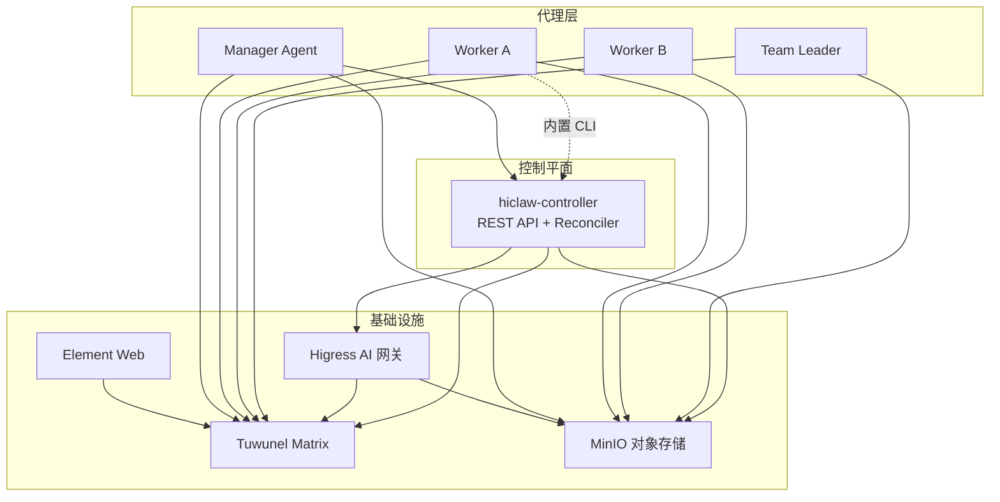
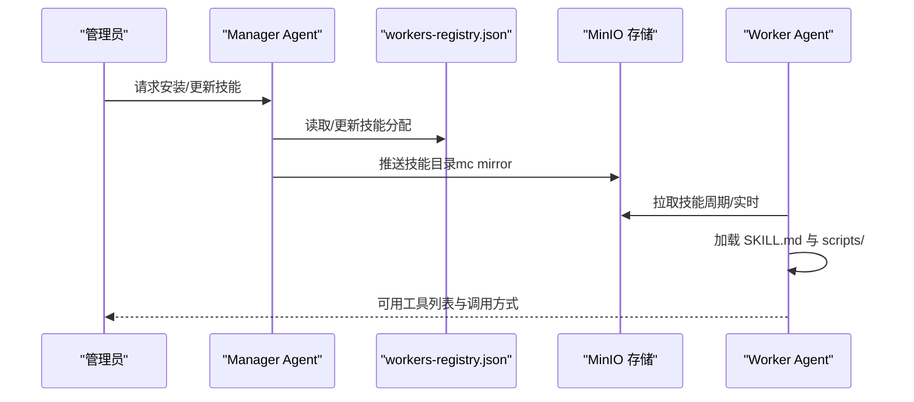
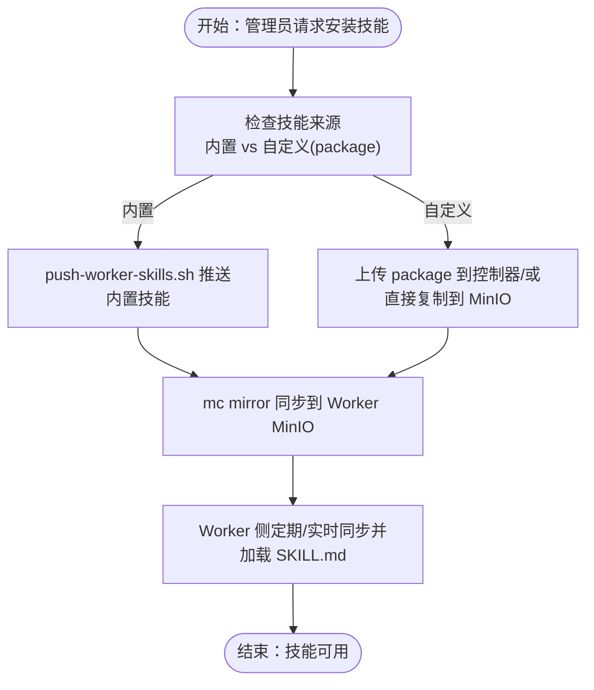

# 技能生态系统

<cite>
**本文引用的文件**
- [README.md](file://README.md)
- [docs/architecture.md](file://docs/architecture.md)
- [docs/quickstart.md](file://docs/quickstart.md)
- [docs/worker-guide.md](file://docs/worker-guide.md)
- [docs/manager-guide.md](file://docs/manager-guide.md)
- [docs/declarative-resource-management.md](file://docs/declarative-resource-management.md)
- [manager/agent/skills/worker-management/SKILL.md](file://manager/agent/skills/worker-management/SKILL.md)
- [manager/agent/skills/task-management/SKILL.md](file://manager/agent/skills/task-management/SKILL.md)
- [manager/agent/skills/project-management/SKILL.md](file://manager/agent/skills/project-management/SKILL.md)
- [manager/agent/skills/team-management/SKILL.md](file://manager/agent/skills/team-management/SKILL.md)
- [manager/agent/skills/worker-management/scripts/push-worker-skills.sh](file://manager/agent/skills/worker-management/scripts/push-worker-skills.sh)
- [manager/agent/skills/worker-management/scripts/lifecycle-worker.sh](file://manager/agent/skills/worker-management/scripts/lifecycle-worker.sh)
- [manager/agent/skills/worker-management/scripts/update-worker-config.sh](file://manager/agent/skills/worker-management/scripts/update-worker-config.sh)
- [manager/agent/skills/worker-management/scripts/get-worker-install-cmd.sh](file://manager/agent/skills/worker-management/scripts/get-worker-install-cmd.sh)
- [manager/agent/skills/worker-management/scripts/enable-peer-mentions.sh](file://manager/agent/skills/worker-management/scripts/enable-peer-mentions.sh)
- [manager/agent/worker-agent/skills/find-skills/SKILL.md](file://manager/agent/worker-agent/skills/find-skills/SKILL.md)
- [manager/agent/copaw-worker-agent/skills/find-skills/SKILL.md](file://manager/agent/copaw-worker-agent/skills/find-skills/SKILL.md)
- [manager/agent/hermes-worker-agent/skills/find-skills/SKILL.md](file://manager/agent/hermes-worker-agent/skills/find-skills/SKILL.md)
- [manager/scripts/init/upgrade-builtins.sh](file://manager/scripts/init/upgrade-builtins.sh)
- [manager/agent/copaw-worker-agent/skills/mcporter/SKILL.md](file://manager/agent/copaw-worker-agent/skills/mcporter/SKILL.md)
- [manager/agent/hermes-worker-agent/skills/mcporter/SKILL.md](file://manager/agent/hermes-worker-agent/skills/mcporter/SKILL.md)
</cite>

## 目录
1. [简介](#简介)
2. [项目结构](#项目结构)
3. [核心组件](#核心组件)
4. [架构总览](#架构总览)
5. [详细组件分析](#详细组件分析)
6. [依赖关系分析](#依赖关系分析)
7. [性能考虑](#性能考虑)
8. [故障排查指南](#故障排查指南)
9. [结论](#结论)
10. [附录](#附录)

## 简介
本文件系统化阐述 HiClaw 的 Worker 技能生态系统，覆盖整体架构与设计理念、技能分类与版本管理、兼容性控制、技能发现与注册流程、管理工具与接口、扩展机制与插件化设计、使用指南与最佳实践，以及社区贡献与治理机制。目标是帮助读者从零到一掌握如何在 HiClaw 中构建、分发、组合与优化 Worker 技能，并安全可控地进行企业级协作。

## 项目结构
HiClaw 采用“Manager-Workers 架构”，通过控制器（hiclaw-controller）与基础设施（Higress 网关、Tuwunel Matrix、MinIO、Element Web）协同，实现多 Worker 的可审计、可编排、可扩展的智能体团队协作平台。技能生态以“技能包（SKILL.md + scripts/ + references/）”为核心单元，按运行时（OpenClaw/Copaw/Hermes）与角色（Manager/Worker/Team Leader）分层组织，统一通过 MinIO 进行分发与同步。

图示来源
- [docs/architecture.md:23-82](file://docs/architecture.md#L23-L82)

章节来源
- [README.md:13-18](file://README.md#L13-L18)
- [docs/architecture.md:1-16](file://docs/architecture.md#L1-L16)
- [docs/architecture.md:19-82](file://docs/architecture.md#L19-L82)

## 核心组件
- 控制器与资源模型：基于 CRD 的声明式资源（Worker、Team、Human、Manager），由 hiclaw-controller 统一编排，提供 REST API 与 CLI 操作入口。
- Manager Agent：负责任务编排、权限与房间管理、Worker 生命周期与技能分发、MCP 授权与路由管理。
- Worker Agent：轻量容器，连接 Matrix、拉取 MinIO 配置、执行任务、通过 mcporter 调用 MCP 工具。
- 技能系统：以 SKILL.md 为入口，配合 scripts/ 与 references/，支持内置技能与自定义技能的统一管理与分发。
- 基础设施：Higress 提供网关与消费者鉴权；Tuwunel 提供 Matrix 协议通信；MinIO 提供共享文件系统与持久化存储；Element Web 提供浏览器端 IM 客户端。

章节来源
- [docs/architecture.md:165-221](file://docs/architecture.md#L165-L221)
- [docs/declarative-resource-management.md:1-36](file://docs/declarative-resource-management.md#L1-L36)
- [docs/manager-guide.md:41-56](file://docs/manager-guide.md#L41-L56)

## 架构总览
技能生态贯穿“发现—注册—分发—执行—反馈”的闭环。Manager 侧维护技能仓库与注册表，Worker 侧通过 MinIO 同步技能包，运行时自动加载并暴露工具调用能力。MCP 服务器集中托管真实凭证，Worker 仅持有消费者密钥，确保安全隔离。

图示来源
- [manager/agent/skills/worker-management/scripts/push-worker-skills.sh:103-144](file://manager/agent/skills/worker-management/scripts/push-worker-skills.sh#L103-L144)
- [manager/agent/skills/worker-management/scripts/push-worker-skills.sh:255-295](file://manager/agent/skills/worker-management/scripts/push-worker-skills.sh#L255-L295)
- [manager/scripts/init/upgrade-builtins.sh:205-220](file://manager/scripts/init/upgrade-builtins.sh#L205-L220)

章节来源
- [docs/architecture.md:180-221](file://docs/architecture.md#L180-L221)
- [docs/declarative-resource-management.md:106-111](file://docs/declarative-resource-management.md#L106-L111)

## 详细组件分析

### 技能分类与版本管理
- 分类维度
  - 运行时：OpenClaw、Copaw、Hermes 三套运行时模板分别提供内置技能集合。
  - 角色：Manager 技能（如 worker-management、task-management、project-management、team-management）、Worker 技能（如 find-skills、mcporter、file-sync 等）。
  - 来源：内置（runtime-agent/skills/）与自定义（worker-skills/ 或通过 package 引入）。
- 版本与兼容
  - 技能以目录形式存在，版本通过目录名或引用的 package 版本号管理；升级内置技能通过控制器初始化脚本批量推送。
  - 兼容性：不同运行时的内置技能差异通过 runtime-specific 目录区分；跨运行时迁移通过“切换运行时”流程完成，保留矩阵账号、房间、MinIO 数据与凭证，丢失容器本地状态。

章节来源
- [docs/architecture.md:180-221](file://docs/architecture.md#L180-L221)
- [manager/scripts/init/upgrade-builtins.sh:198-220](file://manager/scripts/init/upgrade-builtins.sh#L198-L220)
- [manager/agent/skills/worker-management/SKILL.md:61-83](file://manager/agent/skills/worker-management/SKILL.md#L61-L83)

### 技能发现机制与注册流程
- 发现
  - Manager 内置 find-skills 技能支持按领域/任务关键词检索市场或私有注册表，返回可安装的技能名称与安装命令。
  - Worker 端通过 MinIO 同步技能目录，自动加载 SKILL.md 并解析可用工具。
- 注册与索引
  - Manager 侧通过 workers-registry.json 记录每个 Worker 的技能清单与房间 ID；push-worker-skills.sh 将技能推送到对应 Worker 的 MinIO 路径下。
  - 初始化阶段（upgrade-builtins.sh）会将 runtime-specific 的内置技能批量推送到所有 Worker，保证最小可用集。
- 安装与更新
  - 通过 push-worker-skills.sh 支持按 Worker 或按技能粒度推送；支持添加/移除技能，并可选择是否发送 Matrix 通知。
  - 自定义技能可通过 package（ZIP）上传，其中包含 manifest.json、config（SOUL/AGENTS/MEMORY）、skills/、crons/ 等目录结构。

图示来源
- [manager/agent/skills/worker-management/scripts/push-worker-skills.sh:103-144](file://manager/agent/skills/worker-management/scripts/push-worker-skills.sh#L103-L144)
- [manager/agent/skills/worker-management/scripts/push-worker-skills.sh:255-295](file://manager/agent/skills/worker-management/scripts/push-worker-skills.sh#L255-L295)
- [manager/scripts/init/upgrade-builtins.sh:205-220](file://manager/scripts/init/upgrade-builtins.sh#L205-L220)

章节来源
- [manager/agent/worker-agent/skills/find-skills/SKILL.md:51-144](file://manager/agent/worker-agent/skills/find-skills/SKILL.md#L51-L144)
- [manager/agent/copaw-worker-agent/skills/find-skills/SKILL.md:47-132](file://manager/agent/copaw-worker-agent/skills/find-skills/SKILL.md#L47-L132)
- [manager/agent/hermes-worker-agent/skills/find-skills/SKILL.md:47-132](file://manager/agent/hermes-worker-agent/skills/find-skills/SKILL.md#L47-L132)
- [docs/declarative-resource-management.md:541-595](file://docs/declarative-resource-management.md#L541-L595)

### 管理工具与接口
- 技能搜索
  - Manager 端 find-skills 技能提供搜索与安装命令输出，支持企业私有注册表环境变量配置。
- 技能安装/更新/卸载
  - push-worker-skills.sh：按 Worker 或技能推送；支持添加/移除技能；自动更新 skills_updated_at 并可选通知 Worker。
  - update-worker-config.sh：在不重建容器的前提下更新配置（模型、技能合并、MCP 重授权、同步 MinIO），或切换运行时（重建容器）。
  - lifecycle-worker.sh：Worker 容器生命周期管理（启动/停止/删除/确保就绪），结合空闲超时策略自动停机。
  - enable-peer-mentions.sh：启用 Worker 间直接 @mention，需确保彼此在 groupAllowFrom 中。
  - get-worker-install-cmd.sh：生成远程 Worker 的安装/启动命令，便于跨主机部署。
- MCP 工具调用
  - mcporter 技能（各运行时均有）：通过 Higress 网关消费 MCP 服务器工具，避免 Worker 直接接触真实凭证。

章节来源
- [manager/agent/skills/worker-management/SKILL.md:45-83](file://manager/agent/skills/worker-management/SKILL.md#L45-L83)
- [manager/agent/skills/worker-management/scripts/push-worker-skills.sh:1-320](file://manager/agent/skills/worker-management/scripts/push-worker-skills.sh#L1-L320)
- [manager/agent/skills/worker-management/scripts/update-worker-config.sh:1-434](file://manager/agent/skills/worker-management/scripts/update-worker-config.sh#L1-L434)
- [manager/agent/skills/worker-management/scripts/lifecycle-worker.sh:1-574](file://manager/agent/skills/worker-management/scripts/lifecycle-worker.sh#L1-L574)
- [manager/agent/skills/worker-management/scripts/enable-peer-mentions.sh:1-163](file://manager/agent/skills/worker-management/scripts/enable-peer-mentions.sh#L1-L163)
- [manager/agent/skills/worker-management/scripts/get-worker-install-cmd.sh:1-77](file://manager/agent/skills/worker-management/scripts/get-worker-install-cmd.sh#L1-L77)
- [manager/agent/copaw-worker-agent/skills/mcporter/SKILL.md:65-102](file://manager/agent/copaw-worker-agent/skills/mcporter/SKILL.md#L65-L102)
- [manager/agent/hermes-worker-agent/skills/mcporter/SKILL.md:65-102](file://manager/agent/hermes-worker-agent/skills/mcporter/SKILL.md#L65-L102)

### 扩展机制与插件化设计
- 第三方技能集成
  - 通过 package（ZIP）引入自定义技能，manifest.json 指定运行时与依赖；skills/ 目录下放置 SKILL.md 与工具脚本。
  - MCP 服务器可由企业自建并通过 Higress 网关统一接入，Manager 侧进行消费者授权与路由配置。
- 自定义扩展
  - Manager/Worker 的 AGENTS.md 可叠加内置段落，实现行为规则的增量扩展。
  - Team Leader 专用模板与技能，隔离 Manager 与 Worker 的沟通边界，提升团队自治能力。

章节来源
- [docs/declarative-resource-management.md:541-595](file://docs/declarative-resource-management.md#L541-L595)
- [docs/architecture.md:212-221](file://docs/architecture.md#L212-L221)
- [manager/agent/skills/team-management/SKILL.md:25-48](file://manager/agent/skills/team-management/SKILL.md#L25-L48)

### 使用指南与最佳实践
- 技能选择
  - 优先使用 Manager 的 find-skills 技能进行搜索与安装，避免凭记忆拼装命令。
  - 对于复杂场景，使用 package 导入完整配置与技能树，减少重复配置。
- 组合使用
  - 多 Worker 协作时启用 peer-mentions，明确“阻塞信息才 @peers”，避免无限循环触发。
  - 使用 MCP 工具链（mcporter）统一调用外部服务，避免在 Worker 中硬编码凭证。
- 性能优化
  - 合理设置 Worker 空闲超时，利用自动停机节省资源；对需要持续运行的任务启用 cron 或保持常驻。
  - 使用 MinIO 的实时镜像同步（mc mirror --watch）降低延迟，同时注意排除大体积内存目录。

章节来源
- [manager/agent/skills/task-management/SKILL.md:8-19](file://manager/agent/skills/task-management/SKILL.md#L8-L19)
- [manager/agent/skills/worker-management/scripts/enable-peer-mentions.sh:86-136](file://manager/agent/skills/worker-management/scripts/enable-peer-mentions.sh#L86-L136)
- [docs/worker-guide.md:148-159](file://docs/worker-guide.md#L148-L159)

### 社区贡献与治理
- 资源治理
  - 通过 CRD（Worker/Team/Human/Manager）与声明式 YAML 管理资源，支持批量部署与变更追踪。
  - 通过 hiclaw CLI 与 HTTP API 实现跨环境一致的运维操作。
- 社区市场
  - Manager 的 find-skills 技能默认对接公共市场（可配置企业私有注册表），鼓励社区贡献高质量技能包。
- 文档与规范
  - SKILL.md 作为技能契约，要求描述用途、工具参数与调用示例；references/ 提供参考文档与最佳实践。

章节来源
- [docs/declarative-resource-management.md:600-686](file://docs/declarative-resource-management.md#L600-L686)
- [manager/agent/worker-agent/skills/find-skills/SKILL.md:51-144](file://manager/agent/worker-agent/skills/find-skills/SKILL.md#L51-L144)
- [manager/agent/copaw-worker-agent/skills/find-skills/SKILL.md:47-132](file://manager/agent/copaw-worker-agent/skills/find-skills/SKILL.md#L47-L132)
- [manager/agent/hermes-worker-agent/skills/find-skills/SKILL.md:47-132](file://manager/agent/hermes-worker-agent/skills/find-skills/SKILL.md#L47-L132)

## 依赖关系分析
技能生态的关键依赖链如下：
- Manager 通过 workers-registry.json 管理 Worker 技能清单，push-worker-skills.sh 负责将技能写入 MinIO。
- Worker 通过 MinIO 的 mc mirror 同步技能目录，运行时加载 SKILL.md 并暴露工具。
- MCP 工具通过 Higress 网关与消费者鉴权，实现凭证隔离与访问控制。
- 控制器负责资源编排与基础设施一致性，保障技能分发与 Worker 生命周期的正确性。

图示来源
- [manager/agent/skills/worker-management/scripts/push-worker-skills.sh:103-144](file://manager/agent/skills/worker-management/scripts/push-worker-skills.sh#L103-L144)
- [manager/agent/skills/worker-management/scripts/push-worker-skills.sh:297-320](file://manager/agent/skills/worker-management/scripts/push-worker-skills.sh#L297-L320)
- [docs/architecture.md:132-137](file://docs/architecture.md#L132-L137)

章节来源
- [manager/agent/skills/worker-management/scripts/push-worker-skills.sh:1-320](file://manager/agent/skills/worker-management/scripts/push-worker-skills.sh#L1-L320)
- [docs/architecture.md:132-137](file://docs/architecture.md#L132-L137)

## 性能考虑
- 技能分发
  - 使用 mc mirror 的增量同步与周期拉取相结合，平衡实时性与带宽占用。
  - 对大体积技能或临时缓存目录进行排除，避免无谓传输。
- Worker 生命周期
  - 合理设置空闲超时，避免长时间运行的空闲 Worker 占用资源。
  - 对需要持续运行的任务启用 cron 或保持常驻，减少反复启动/停止带来的抖动。
- MCP 调用
  - 通过 Higress 统一路由与限流，避免单点过载；按需授权消费者，降低无效调用成本。

章节来源
- [docs/worker-guide.md:148-159](file://docs/worker-guide.md#L148-L159)
- [manager/agent/skills/worker-management/scripts/lifecycle-worker.sh:199-304](file://manager/agent/skills/worker-management/scripts/lifecycle-worker.sh#L199-L304)

## 故障排查指南
- Worker 无法启动/连接
  - 检查 Manager 是否成功生成 Worker 配置与消费者密钥；确认 MinIO 可达与 mc 命令可用。
  - 使用 hiclaw-sync 主动拉取最新配置，验证 openclaw.json 与 MCP 配置。
- Worker 无法访问 MCP
  - 确认 Higress 消费者密钥与 MCP 服务器授权一致；使用 mcporter 命令测试连通性。
- 技能未生效
  - 检查 push-worker-skills.sh 是否成功推送至 MinIO；确认 Worker 已同步最新技能目录。
- 远程 Worker 安装
  - 使用 get-worker-install-cmd.sh 获取安装命令，在目标主机执行；确保 MinIO 端点可达。

章节来源
- [docs/worker-guide.md:61-123](file://docs/worker-guide.md#L61-L123)
- [manager/agent/skills/worker-management/scripts/get-worker-install-cmd.sh:1-77](file://manager/agent/skills/worker-management/scripts/get-worker-install-cmd.sh#L1-L77)
- [manager/agent/skills/worker-management/scripts/push-worker-skills.sh:149-186](file://manager/agent/skills/worker-management/scripts/push-worker-skills.sh#L149-L186)

## 结论
HiClaw 的技能生态系统以“声明式资源 + 运行时模板 + MinIO 同步 + Higress 鉴权”为核心，实现了安全、可观测、可扩展的 Worker 技能管理闭环。通过 Manager 的统一编排与 Worker 的轻量化执行，既能满足个人开发者快速试错，也能支撑企业级多团队协作与合规要求。建议在实践中遵循“先搜索再安装、按需启用 peer-mentions、统一走 MCP 工具链、合理设置空闲超时”的最佳实践，持续完善技能库与团队工作流。

## 附录
- 快速开始与端到端体验可参考快速入门指南，涵盖安装、创建 Worker、委派任务与 GitHub 操作等典型场景。
- 管理员指南提供了环境变量、多通道通信、会话管理、备份恢复等高级主题。

章节来源
- [docs/quickstart.md:1-356](file://docs/quickstart.md#L1-L356)
- [docs/manager-guide.md:1-298](file://docs/manager-guide.md#L1-L298)