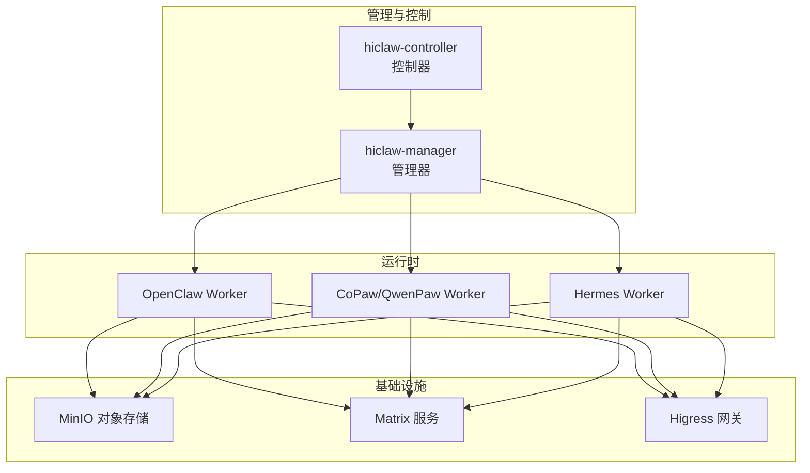
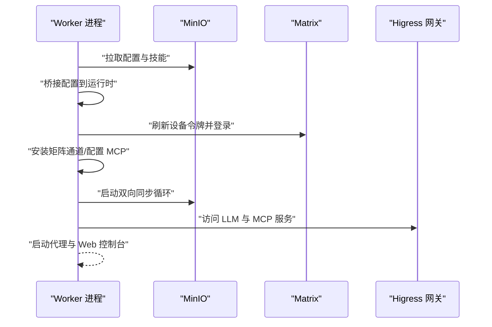
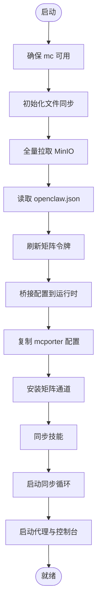
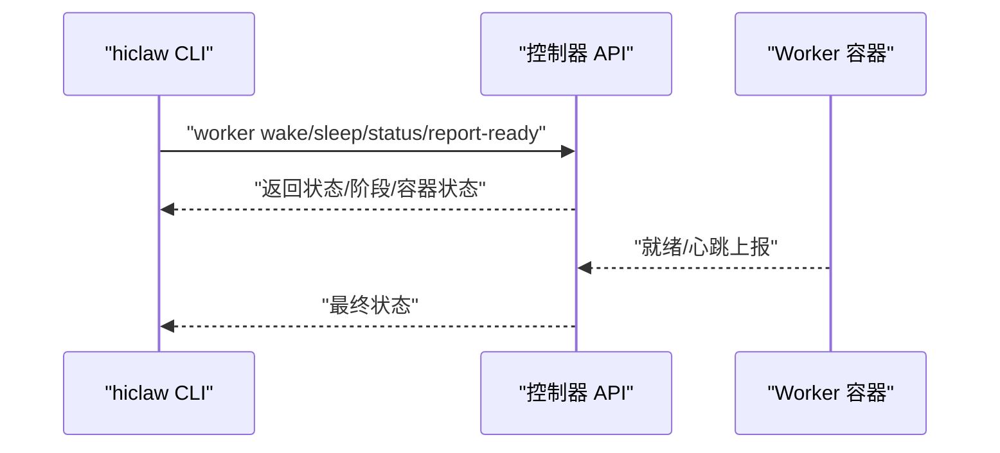
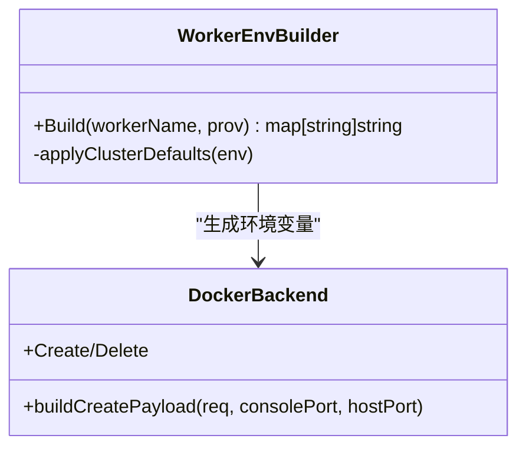
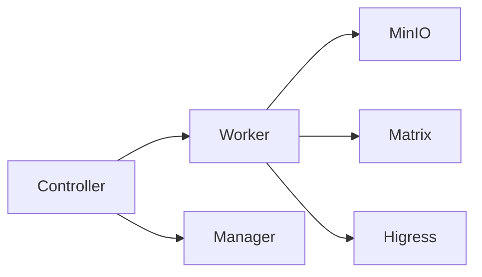

# Worker 故障排除

<cite>
**本文引用的文件**
- [docs/worker-guide.md](file://docs/worker-guide.md)
- [docs/zh-cn/worker-guide.md](file://docs/zh-cn/worker-guide.md)
- [docs/faq.md](file://docs/faq.md)
- [tests/skills/hiclaw-test/references/troubleshooting.md](file://tests/skills/hiclaw-test/references/troubleshooting.md)
- [scripts/export-debug-log.py](file://scripts/export-debug-log.py)
- [tests/skills/hiclaw-test/scripts/hiclaw-debug.sh](file://tests/skills/hiclaw-test/scripts/hiclaw-debug.sh)
- [copaw/src/copaw_worker/worker.py](file://copaw/src/copaw_worker/worker.py)
- [copaw/src/copaw_worker/config.py](file://copaw/src/copaw_worker/config.py)
- [hermes/src/hermes_worker/worker.py](file://hermes/src/hermes_worker/worker.py)
- [hermes/src/hermes_worker/config.py](file://hermes/src/hermes_worker/config.py)
- [hiclaw-controller/cmd/hiclaw/worker_cmd.go](file://hiclaw-controller/cmd/hiclaw/worker_cmd.go)
- [hiclaw-controller/internal/service/worker_env.go](file://hiclaw-controller/internal/service/worker_env.go)
- [hiclaw-controller/internal/backend/docker.go](file://hiclaw-controller/internal/backend/docker.go)
- [manager/scripts/init/start-manager-agent.sh](file://manager/scripts/init/start-manager-agent.sh)
- [tests/lib/agent-metrics.sh](file://tests/lib/agent-metrics.sh)
</cite>

## 目录
1. [简介](#简介)
2. [项目结构](#项目结构)
3. [核心组件](#核心组件)
4. [架构总览](#架构总览)
5. [详细组件分析](#详细组件分析)
6. [依赖分析](#依赖分析)
7. [性能考虑](#性能考虑)
8. [故障排除指南](#故障排除指南)
9. [结论](#结论)
10. [附录](#附录)

## 简介
本文件面向 HiClaw 的 Worker 故障排除场景，提供系统化的问题诊断方法与解决步骤，覆盖启动失败、连接问题、网络故障、性能问题等常见情形。文档同时介绍日志导出、状态检查、网络连通性测试、配置验证等工具与命令，以及调试模式、性能分析与资源监控方法。最后给出最佳实践与预防措施，帮助团队建立稳定可靠的 Worker 运维体系。

## 项目结构
HiClaw 的 Worker 由多运行时支持（OpenClaw、CoPaw/QwenPaw、Hermes），并通过控制器与管理器进行生命周期与配置管理。Worker 启动流程围绕 MinIO 配置同步、矩阵通道登录、MCP 端点配置与代理启动展开。

图示来源
- [docs/worker-guide.md:137-147](file://docs/worker-guide.md#L137-L147)
- [docs/zh-cn/worker-guide.md:137-147](file://docs/zh-cn/worker-guide.md#L137-L147)

章节来源
- [docs/worker-guide.md:1-185](file://docs/worker-guide.md#L1-L185)
- [docs/zh-cn/worker-guide.md:1-185](file://docs/zh-cn/worker-guide.md#L1-L185)

## 核心组件
- Worker 启动与同步：从 MinIO 拉取配置、桥接到运行时、安装矩阵通道、启动代理与后台同步循环。
- 控制器 CLI：提供 Worker 生命周期操作（唤醒、休眠、就绪上报、状态查询）。
- 环境变量注入：控制器按集群默认值与 Worker 凭据生成环境变量，确保 Worker 正常连接基础设施。
- 调试与日志：提供矩阵消息与会话日志导出工具，支持 PII 脱敏与时间范围筛选。

章节来源
- [copaw/src/copaw_worker/worker.py:45-177](file://copaw/src/copaw_worker/worker.py#L45-L177)
- [hermes/src/hermes_worker/worker.py:59-165](file://hermes/src/hermes_worker/worker.py#L59-L165)
- [hiclaw-controller/cmd/hiclaw/worker_cmd.go:11-289](file://hiclaw-controller/cmd/hiclaw/worker_cmd.go#L11-L289)
- [hiclaw-controller/internal/service/worker_env.go:19-114](file://hiclaw-controller/internal/service/worker_env.go#L19-L114)

## 架构总览
Worker 的启动序列与关键交互如下：

图示来源
- [docs/worker-guide.md:139-147](file://docs/worker-guide.md#L139-L147)
- [copaw/src/copaw_worker/worker.py:88-177](file://copaw/src/copaw_worker/worker.py#L88-L177)
- [hermes/src/hermes_worker/worker.py:108-165](file://hermes/src/hermes_worker/worker.py#L108-L165)

## 详细组件分析

### 组件 A：Worker 启动与配置桥接
- 启动阶段：校验 mc 命令可用性、初始化文件同步、全量拉取 MinIO 内容、读取 openclaw.json 并刷新矩阵令牌、桥接配置到运行时工作区、复制 mcporter 配置、安装矩阵通道、同步技能、启动后台同步循环。
- 配置热重载：监听 MinIO 变更，必要时重新桥接配置并热更新矩阵通道白名单。

图示来源
- [copaw/src/copaw_worker/worker.py:65-177](file://copaw/src/copaw_worker/worker.py#L65-L177)
- [hermes/src/hermes_worker/worker.py:86-165](file://hermes/src/hermes_worker/worker.py#L86-L165)

章节来源
- [copaw/src/copaw_worker/worker.py:45-177](file://copaw/src/copaw_worker/worker.py#L45-L177)
- [hermes/src/hermes_worker/worker.py:59-165](file://hermes/src/hermes_worker/worker.py#L59-L165)

### 组件 B：控制器 CLI 与 Worker 生命周期
- 提供 Worker 唤醒、休眠、确保就绪、状态查询、就绪上报等命令。
- 支持心跳机制，就绪后可周期上报。

图示来源
- [hiclaw-controller/cmd/hiclaw/worker_cmd.go:28-289](file://hiclaw-controller/cmd/hiclaw/worker_cmd.go#L28-L289)

章节来源
- [hiclaw-controller/cmd/hiclaw/worker_cmd.go:11-289](file://hiclaw-controller/cmd/hiclaw/worker_cmd.go#L11-L289)

### 组件 C：环境变量注入与网络映射
- 控制器根据集群默认值与 Worker 凭据生成环境变量，包括 MinIO、矩阵、AI 网关、控制台端口等。
- Docker 后端负责容器创建、端口绑定与重启策略。

图示来源
- [hiclaw-controller/internal/service/worker_env.go:19-114](file://hiclaw-controller/internal/service/worker_env.go#L19-L114)
- [hiclaw-controller/internal/backend/docker.go:481-526](file://hiclaw-controller/internal/backend/docker.go#L481-L526)

章节来源
- [hiclaw-controller/internal/service/worker_env.go:19-114](file://hiclaw-controller/internal/service/worker_env.go#L19-L114)
- [hiclaw-controller/internal/backend/docker.go:476-526](file://hiclaw-controller/internal/backend/docker.go#L476-L526)

## 依赖分析
- Worker 与 MinIO：通过 mc 命令与镜像同步实现配置与技能的双向同步。
- Worker 与 Matrix：启动时刷新设备令牌，确保 E2EE 场景下跨重启保持一致。
- Worker 与 Higress：通过网关访问 LLM 与 MCP 服务，需确保路由与鉴权正确。
- 控制器与 Worker：通过 REST API 管理生命周期与状态，支持就绪上报与心跳。

图示来源
- [docs/worker-guide.md:61-123](file://docs/worker-guide.md#L61-L123)
- [docs/zh-cn/worker-guide.md:61-123](file://docs/zh-cn/worker-guide.md#L61-L123)

章节来源
- [docs/worker-guide.md:61-123](file://docs/worker-guide.md#L61-L123)
- [docs/zh-cn/worker-guide.md:61-123](file://docs/zh-cn/worker-guide.md#L61-L123)

## 性能考虑
- 同步策略：本地到远端实时同步，远端到本地周期拉取，减少延迟并降低带宽占用。
- 会话指标：通过会话日志统计输入输出 token，辅助评估性能与成本。
- 资源限制：容器内存不足会导致 OOMKilled，需提升 Docker VM 内存上限。

章节来源
- [docs/worker-guide.md:148-158](file://docs/worker-guide.md#L148-L158)
- [tests/skills/hiclaw-test/references/troubleshooting.md:48-56](file://tests/skills/hiclaw-test/references/troubleshooting.md#L48-L56)
- [tests/lib/agent-metrics.sh:752-784](file://tests/lib/agent-metrics.sh#L752-L784)

## 故障排除指南

### 通用诊断流程
- 快速确认容器状态与日志
  - 使用控制器 CLI 查询 Worker 状态与阶段
  - 查看管理器与控制器日志定位异常
- 导出调试日志
  - 使用导出脚本抓取矩阵消息与会话日志，支持时间范围与 PII 脱敏
  - 使用分析脚本快速识别挂起问题（如缺少 @manager 的 PHASE_DONE）
- 验证网络连通性
  - 从 Worker 容器访问 Matrix、AI 网关与 MCP 服务端点
  - 检查端口映射与防火墙规则

章节来源
- [hiclaw-controller/cmd/hiclaw/worker_cmd.go:139-209](file://hiclaw-controller/cmd/hiclaw/worker_cmd.go#L139-L209)
- [docs/faq.md:602-621](file://docs/faq.md#L602-L621)
- [scripts/export-debug-log.py:101-140](file://scripts/export-debug-log.py#L101-L140)
- [tests/skills/hiclaw-test/scripts/hiclaw-debug.sh:46-63](file://tests/skills/hiclaw-test/scripts/hiclaw-debug.sh#L46-L63)

### 启动失败
- 症状
  - Worker 容器无法启动或启动后立即退出
- 诊断步骤
  - 查看 Worker 容器日志与状态
  - 检查 MinIO 配置是否成功拉取
  - 校验 mc 命令可用性与网络连通性
  - 确认环境变量（MinIO、矩阵、AI 网关）是否正确注入
- 解决方案
  - 重新创建 Worker 容器（删除后由管理器重建）
  - 检查控制器日志中的创建失败原因
  - 如存在端口冲突，调整端口映射或释放端口

章节来源
- [docs/worker-guide.md:63-73](file://docs/worker-guide.md#L63-L73)
- [docs/zh-cn/worker-guide.md:63-73](file://docs/zh-cn/worker-guide.md#L63-L73)
- [tests/skills/hiclaw-test/references/troubleshooting.md:57-87](file://tests/skills/hiclaw-test/references/troubleshooting.md#L57-L87)
- [hiclaw-controller/internal/backend/docker.go:229-256](file://hiclaw-controller/internal/backend/docker.go#L229-L256)

### 连接问题（Matrix）
- 症状
  - Worker 无法加入房间或接收/发送消息
- 诊断步骤
  - 从 Worker 容器访问 Matrix 服务端点，验证可达性
  - 检查 openclaw.json 中的矩阵配置与设备令牌
  - 使用就绪上报命令触发心跳，观察控制器侧日志
- 解决方案
  - 刷新矩阵令牌（Worker 启动时会自动登录并写回新令牌）
  - 确保矩阵域名解析与代理设置正确
  - 如为 E2EE 场景，确保设备 ID 一致性

章节来源
- [docs/worker-guide.md:75-83](file://docs/worker-guide.md#L75-L83)
- [docs/zh-cn/worker-guide.md:75-83](file://docs/zh-cn/worker-guide.md#L75-L83)
- [copaw/src/copaw_worker/worker.py:210-287](file://copaw/src/copaw_worker/worker.py#L210-L287)
- [hermes/src/hermes_worker/worker.py:197-277](file://hermes/src/hermes_worker/worker.py#L197-L277)

### 网络故障（LLM 与 MCP）
- 症状
  - 访问 LLM 返回 401/403，或 MCP 请求失败
- 诊断步骤
  - 使用 Worker 容器内命令测试 AI 网关与 MCP 端点
  - 校验消费者密钥与路由权限是否匹配
- 解决方案
  - 在管理器侧添加对应路由权限
  - 更新消费者密钥并重新部署

章节来源
- [docs/worker-guide.md:85-108](file://docs/worker-guide.md#L85-L108)
- [docs/zh-cn/worker-guide.md:85-108](file://docs/zh-cn/worker-guide.md#L85-L108)
- [docs/faq.md:567-581](file://docs/faq.md#L567-L581)

### 性能问题
- 症状
  - 任务处理缓慢、超时或频繁重启
- 诊断步骤
  - 导出会话日志与矩阵消息，定位瓶颈环节
  - 检查容器资源配额与内存使用
  - 分析 token 消耗与上下文窗口设置
- 解决方案
  - 提升容器内存上限
  - 优化模型与上下文窗口配置
  - 调整同步策略与任务批处理

章节来源
- [tests/skills/hiclaw-test/references/troubleshooting.md:106-125](file://tests/skills/hiclaw-test/references/troubleshooting.md#L106-L125)
- [tests/lib/agent-metrics.sh:1197-1224](file://tests/lib/agent-metrics.sh#L1197-L1224)

### 调试模式与诊断工具
- 调试日志导出
  - 支持时间范围选择、房间过滤、PII 脱敏
  - 输出矩阵消息与各运行时会话日志
- 分析脚本
  - 自动检测挂起问题（如缺少 @manager 的 PHASE_DONE）
- 控制器调试开关
  - 通过环境变量启用矩阵插件追踪日志，便于定位“未加入/未回复”类问题

章节来源
- [scripts/export-debug-log.py:1-756](file://scripts/export-debug-log.py#L1-L756)
- [tests/skills/hiclaw-test/scripts/hiclaw-debug.sh:65-159](file://tests/skills/hiclaw-test/scripts/hiclaw-debug.sh#L65-L159)
- [hiclaw-controller/internal/service/worker_env.go:105-114](file://hiclaw-controller/internal/service/worker_env.go#L105-L114)

### 常见错误根因与修复
- 配置错误
  - openclaw.json 缺失或字段不正确：通过 MinIO 全量拉取恢复
  - 环境变量未注入：检查控制器环境变量构建逻辑
- 权限问题
  - LLM/AI 路由 401/403：核对消费者密钥与路由权限
- 网络连接
  - 代理导致本地域名不可达：禁用代理或添加绕过规则
- 资源不足
  - OOMKilled：提高 Docker VM 内存配额

章节来源
- [docs/worker-guide.md:63-73](file://docs/worker-guide.md#L63-L73)
- [docs/faq.md:294-299](file://docs/faq.md#L294-L299)
- [tests/skills/hiclaw-test/references/troubleshooting.md:48-56](file://tests/skills/hiclaw-test/references/troubleshooting.md#L48-L56)

### 最佳实践与预防措施
- 监控设置
  - 使用会话指标与日志导出持续监控性能与稳定性
- 告警配置
  - 基于控制器日志与 AI 网关日志设置告警规则
- 定期维护
  - 定期清理过期会话与缓存，避免上下文膨胀
  - 按需调整同步周期与资源配额

章节来源
- [tests/lib/agent-metrics.sh:752-784](file://tests/lib/agent-metrics.sh#L752-L784)
- [docs/faq.md:567-581](file://docs/faq.md#L567-L581)

## 结论
通过系统化的诊断流程、完善的日志导出与分析工具、以及严格的环境变量与网络配置管理，HiClaw 的 Worker 故障排除可以高效定位并解决问题。建议团队建立标准化的监控与告警体系，并结合定期维护与版本升级策略，持续提升系统的稳定性与可运维性。

## 附录

### 常用命令与工具清单
- Worker 状态与生命周期
  - 使用控制器 CLI 查询 Worker 状态与阶段
  - 就绪上报与心跳机制
- 日志导出
  - 导出矩阵消息与会话日志，支持时间范围与脱敏
  - 分析脚本快速识别挂起问题
- 网络连通性测试
  - 从 Worker 容器访问 Matrix、AI 网关与 MCP 服务端点
- 配置验证
  - 检查 openclaw.json 与运行时配置桥接结果
  - 校验环境变量注入与端口映射

章节来源
- [hiclaw-controller/cmd/hiclaw/worker_cmd.go:139-289](file://hiclaw-controller/cmd/hiclaw/worker_cmd.go#L139-L289)
- [scripts/export-debug-log.py:677-756](file://scripts/export-debug-log.py#L677-L756)
- [tests/skills/hiclaw-test/scripts/hiclaw-debug.sh:161-176](file://tests/skills/hiclaw-test/scripts/hiclaw-debug.sh#L161-L176)
- [docs/worker-guide.md:75-108](file://docs/worker-guide.md#L75-L108)