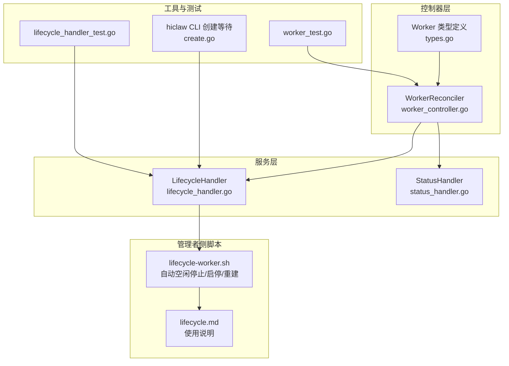
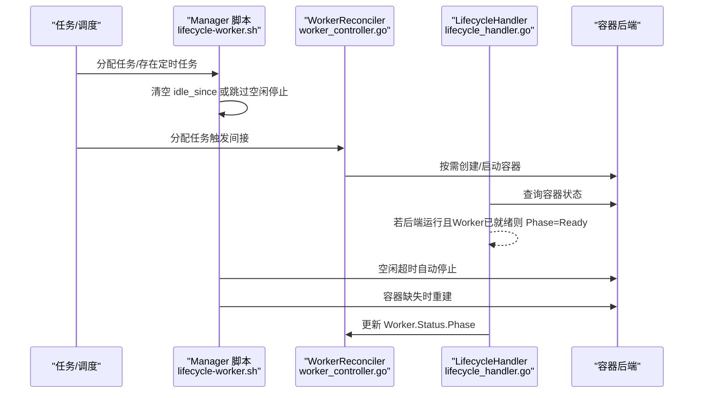
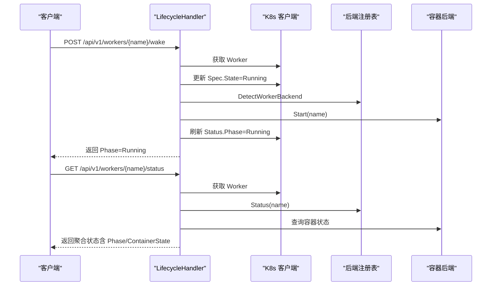
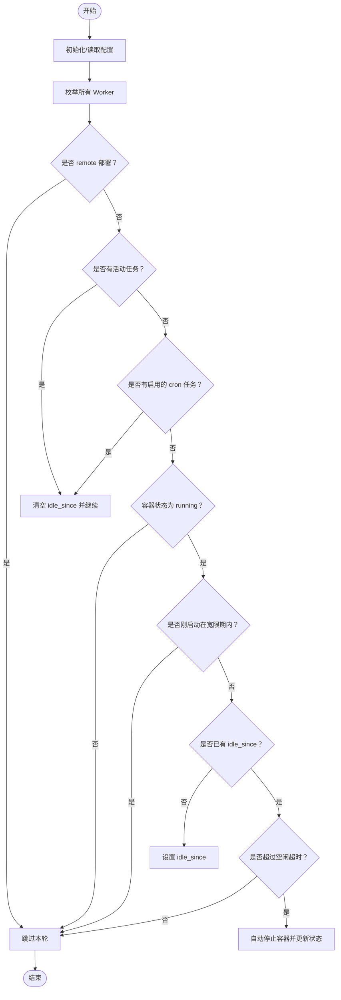
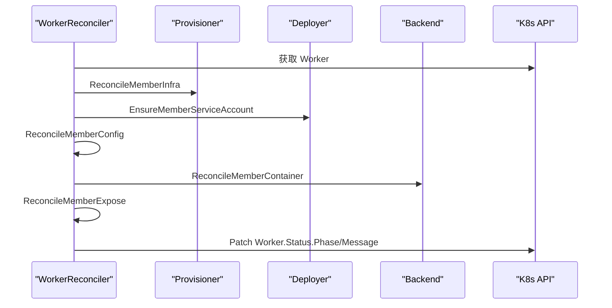
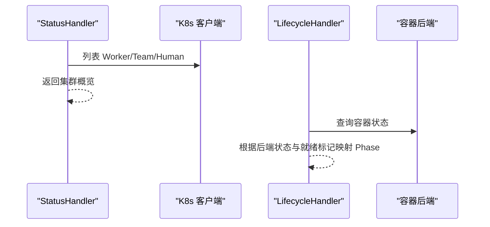
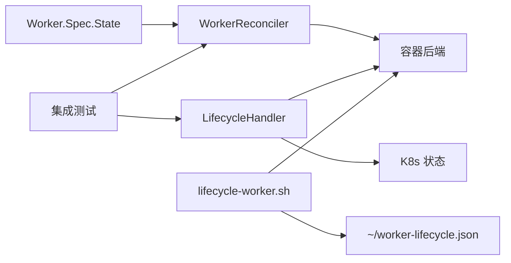

# Worker 生命周期管理

<cite>
**本文引用的文件**   
- [lifecycle-worker.sh](file://manager/agent/skills/worker-management/scripts/lifecycle-worker.sh)
- [lifecycle.md](file://manager/agent/skills/worker-management/references/lifecycle.md)
- [lifecycle_handler.go](file://hiclaw-controller/internal/server/lifecycle_handler.go)
- [worker_controller.go](file://hiclaw-controller/internal/controller/worker_controller.go)
- [types.go](file://hiclaw-controller/api/v1beta1/types.go)
- [status_handler.go](file://hiclaw-controller/internal/server/status_handler.go)
- [find-worker.sh](file://manager/agent/skills/task-management/scripts/find-worker.sh)
- [lifecycle_handler_test.go](file://hiclaw-controller/test/integration/controller/lifecycle_handler_test.go)
- [worker_test.go](file://hiclaw-controller/test/integration/controller/worker_test.go)
- [create.go](file://hiclaw-controller/cmd/hiclaw/create.go)
</cite>

## 目录
1. [简介](#简介)
2. [项目结构](#项目结构)
3. [核心组件](#核心组件)
4. [架构总览](#架构总览)
5. [详细组件分析](#详细组件分析)
6. [依赖分析](#依赖分析)
7. [性能考虑](#性能考虑)
8. [故障排查指南](#故障排查指南)
9. [结论](#结论)
10. [附录](#附录)

## 简介
本文件系统性阐述 HiClaw 中 Worker 的生命周期管理机制，覆盖从创建、启动、运行、停止、重启到删除的全链路状态转换；解释自动生命周期管理（空闲超时自动停止、任务触发自动启动、Manager 重启后的自动重建）；给出手动生命周期控制命令；并说明状态监控、健康检查与最佳实践及故障处理策略。

## 项目结构
围绕 Worker 生命周期管理的关键模块分布如下：
- 控制器层：负责声明式状态与后端容器的实际对齐，以及 Worker 资源的编排与回收。
- 服务层：提供生命周期 API，支持唤醒、睡眠、就绪上报与运行时状态聚合。
- 管理者侧脚本：实现本地容器后端的自动空闲停止、手动启停与重建逻辑，并持久化状态。
- 工具与测试：提供 CLI 等工具与集成测试，验证生命周期行为。

**图表来源**
- [worker_controller.go:110-151](file://hiclaw-controller/internal/controller/worker_controller.go#L110-L151)
- [lifecycle_handler.go:34-110](file://hiclaw-controller/internal/server/lifecycle_handler.go#L34-L110)
- [lifecycle-worker.sh:162-304](file://manager/agent/skills/worker-management/scripts/lifecycle-worker.sh#L162-L304)
- [lifecycle.md:1-56](file://manager/agent/skills/worker-management/references/lifecycle.md#L1-L56)
- [create.go:149-196](file://hiclaw-controller/cmd/hiclaw/create.go#L149-L196)
- [lifecycle_handler_test.go:45-83](file://hiclaw-controller/test/integration/controller/lifecycle_handler_test.go#L45-L83)
- [worker_test.go:295-349](file://hiclaw-controller/test/integration/controller/worker_test.go#L295-L349)

**章节来源**
- [worker_controller.go:110-151](file://hiclaw-controller/internal/controller/worker_controller.go#L110-L151)
- [lifecycle_handler.go:34-110](file://hiclaw-controller/internal/server/lifecycle_handler.go#L34-L110)
- [lifecycle-worker.sh:162-304](file://manager/agent/skills/worker-management/scripts/lifecycle-worker.sh#L162-L304)
- [lifecycle.md:1-56](file://manager/agent/skills/worker-management/references/lifecycle.md#L1-L56)
- [create.go:149-196](file://hiclaw-controller/cmd/hiclaw/create.go#L149-L196)
- [lifecycle_handler_test.go:45-83](file://hiclaw-controller/test/integration/controller/lifecycle_handler_test.go#L45-L83)
- [worker_test.go:295-349](file://hiclaw-controller/test/integration/controller/worker_test.go#L295-L349)

## 核心组件
- Worker 资源模型与状态机
  - WorkerSpec.DesiredState 决定期望生命周期状态（Running/Sleeping/Stopped），控制器据此对齐后端容器。
  - WorkerStatus 包含 phase、containerState、lastHeartbeat、message 等字段，用于对外呈现运行态与健康度。
- 生命周期 API
  - 唤醒/睡眠：通过更新 Worker.Spec.State 并直接调用后端 Start/Stop，同时刷新 Status.Phase。
  - 就绪上报：Worker 自报 Ready，服务端记录并影响最终 Phase=Ready。
  - 运行时状态聚合：结合 CR 状态与后端容器状态，返回统一响应。
- 自动生命周期管理（管理者侧）
  - 空闲超时自动停止：基于本地状态文件与任务/定时任务判断，超过阈值自动停止。
  - 任务触发自动启动：分配任务或存在启用的定时任务时，清空空闲计时并保持运行。
  - Manager 重启后的自动重建：当容器不存在时，按注册信息重建。
- 手动控制命令
  - 同步状态、检查空闲、确保就绪、手动启停、删除 Worker 容器并清理状态。

**章节来源**
- [types.go:84-112](file://hiclaw-controller/api/v1beta1/types.go#L84-L112)
- [types.go:130-139](file://hiclaw-controller/api/v1beta1/types.go#L130-L139)
- [lifecycle_handler.go:34-110](file://hiclaw-controller/internal/server/lifecycle_handler.go#L34-L110)
- [lifecycle_handler.go:176-205](file://hiclaw-controller/internal/server/lifecycle_handler.go#L176-L205)
- [lifecycle-worker.sh:162-304](file://manager/agent/skills/worker-management/scripts/lifecycle-worker.sh#L162-L304)
- [lifecycle-worker.sh:365-445](file://manager/agent/skills/worker-management/scripts/lifecycle-worker.sh#L365-L445)
- [lifecycle-worker.sh:507-574](file://manager/agent/skills/worker-management/scripts/lifecycle-worker.sh#L507-L574)
- [lifecycle.md:1-56](file://manager/agent/skills/worker-management/references/lifecycle.md#L1-L56)

## 架构总览
下图展示从“任务分配/心跳”到“自动空闲停止/手动启停/重建”的整体流程，以及控制器与服务端 API 的交互。

**图表来源**
- [lifecycle-worker.sh:233-304](file://manager/agent/skills/worker-management/scripts/lifecycle-worker.sh#L233-L304)
- [worker_controller.go:110-151](file://hiclaw-controller/internal/controller/worker_controller.go#L110-L151)
- [lifecycle_handler.go:176-205](file://hiclaw-controller/internal/server/lifecycle_handler.go#L176-L205)

## 详细组件分析

### 组件一：生命周期 API（服务端）
- 唤醒（POST /api/v1/workers/{name}/wake）
  - 设置 Worker.Spec.State=Running，直接调用后端 Start，刷新 Status.Phase=Running。
- 睡眠（POST /api/v1/workers/{name}/sleep）
  - 设置 Worker.Spec.State=Sleeping，直接调用后端 Stop，刷新 Status.Phase=Sleeping。
- 确保就绪（POST /api/v1/workers/{name}/ensure-ready）
  - 若当前为 Stopped/Sleeping，则设置 DesiredState=Running 并尝试 Start；若 Start 失败由控制器异步重建。
- 就绪上报（POST /api/v1/workers/{name}/ready）
  - Worker 自报 Ready，服务端记录并在后端运行时将 Phase 提升为 Ready。
- 运行时状态（GET /api/v1/workers/{name}/status）
  - 聚合 CR 状态与后端容器状态，若后端运行且已就绪则 Phase=Ready。

**图表来源**
- [lifecycle_handler.go:34-110](file://hiclaw-controller/internal/server/lifecycle_handler.go#L34-L110)
- [lifecycle_handler.go:176-205](file://hiclaw-controller/internal/server/lifecycle_handler.go#L176-L205)

**章节来源**
- [lifecycle_handler.go:34-110](file://hiclaw-controller/internal/server/lifecycle_handler.go#L34-L110)
- [lifecycle_handler.go:176-205](file://hiclaw-controller/internal/server/lifecycle_handler.go#L176-L205)

### 组件二：自动生命周期管理（管理者侧脚本）
- 状态持久化
  - 使用 ~/worker-lifecycle.json 记录每个 Worker 的 container_status、idle_since、auto_stopped_at、last_started_at 等字段。
  - 使用 ~/state.json 记录 active_tasks，用于判断是否处于活动任务中。
- 空闲超时自动停止
  - 遍历所有 Worker，若无活动任务且非 cron 任务，开始累计 idle_since；超过 idle_timeout_minutes 后自动停止。
  - 对于刚启动的 Worker 设有宽限期，避免竞态导致误判。
- 任务触发自动启动
  - 存在活动任务或启用的 cron 任务时，清空 idle_since，保持运行。
- 容器重建与删除
  - 当容器不存在时，按注册信息重建；删除时先停止再删除容器并清理生命周期状态。
- 远程 Worker 支持
  - 对 remote 部署的 Worker 不进行容器层面操作，仅标记为 remote。

**图表来源**
- [lifecycle-worker.sh:201-304](file://manager/agent/skills/worker-management/scripts/lifecycle-worker.sh#L201-L304)

**章节来源**
- [lifecycle-worker.sh:51-88](file://manager/agent/skills/worker-management/scripts/lifecycle-worker.sh#L51-L88)
- [lifecycle-worker.sh:201-304](file://manager/agent/skills/worker-management/scripts/lifecycle-worker.sh#L201-L304)
- [lifecycle-worker.sh:365-445](file://manager/agent/skills/worker-management/scripts/lifecycle-worker.sh#L365-L445)
- [lifecycle-worker.sh:333-363](file://manager/agent/skills/worker-management/scripts/lifecycle-worker.sh#L333-L363)
- [lifecycle.md:1-56](file://manager/agent/skills/worker-management/references/lifecycle.md#L1-L56)

### 组件三：控制器与资源编排
- Reconcile 流程
  - 基于 Worker CR 的 DesiredState，调用 Provisioner/Deployer/Backend 执行基础设施与容器的创建/更新/暴露。
  - 根据后端状态与就绪情况计算 Worker.Status.Phase。
- 删除流程
  - 清理基础设施并移除 Finalizer；在兼容模式下回滚旧版权限与注册表项。
- Pod 事件过滤
  - 仅对与控制器实例匹配的 Pod 生命周期事件进行响应，避免跨实例干扰。

**图表来源**
- [worker_controller.go:110-151](file://hiclaw-controller/internal/controller/worker_controller.go#L110-L151)

**章节来源**
- [worker_controller.go:110-151](file://hiclaw-controller/internal/controller/worker_controller.go#L110-L151)
- [worker_controller.go:153-192](file://hiclaw-controller/internal/controller/worker_controller.go#L153-L192)
- [worker_controller.go:294-309](file://hiclaw-controller/internal/controller/worker_controller.go#L294-L309)

### 组件四：状态监控与健康检查
- 运行时状态聚合
  - 服务端根据后端容器状态与 Worker 就绪标记，将 Phase 映射为 Ready/Pending/Running/Stopped。
- 心跳与容量评估
  - Manager 侧定期扫描任务元数据，向 Worker 房间询问状态，完成的任务更新为 completed 并统计可用容量。
- 集群状态接口
  - 提供 /healthz、/api/v1/status、/api/v1/version 接口，便于外部探活与概览。

**图表来源**
- [status_handler.go:35-74](file://hiclaw-controller/internal/server/status_handler.go#L35-L74)
- [lifecycle_handler.go:176-205](file://hiclaw-controller/internal/server/lifecycle_handler.go#L176-L205)

**章节来源**
- [status_handler.go:23-74](file://hiclaw-controller/internal/server/status_handler.go#L23-L74)
- [lifecycle_handler.go:176-205](file://hiclaw-controller/internal/server/lifecycle_handler.go#L176-L205)
- [find-worker.sh:122-154](file://manager/agent/skills/task-management/scripts/find-worker.sh#L122-L154)

## 依赖分析
- 声明式状态与控制器对齐
  - Worker.Spec.State 作为单一事实来源，控制器通过 Reconcile 将实际状态收敛到期望状态。
- 服务端 API 与后端容器的耦合
  - LifecycleHandler 在执行唤醒/睡眠时直接调用后端 Start/Stop，以获得即时反馈；同时通过 Status 接口聚合后端状态。
- 管理者侧脚本与后端容器的耦合
  - lifecycle-worker.sh 通过容器 API 与后端交互，维护本地状态文件并执行自动停止/重建。
- 测试与回归保障
  - 集成测试覆盖从 Running→Sleeping→Running 的状态转换与后端调用，以及 Pod 删除后的重建行为。

**图表来源**
- [types.go:84-112](file://hiclaw-controller/api/v1beta1/types.go#L84-L112)
- [worker_controller.go:110-151](file://hiclaw-controller/internal/controller/worker_controller.go#L110-L151)
- [lifecycle_handler.go:34-110](file://hiclaw-controller/internal/server/lifecycle_handler.go#L34-L110)
- [lifecycle-worker.sh:162-304](file://manager/agent/skills/worker-management/scripts/lifecycle-worker.sh#L162-L304)
- [lifecycle_handler_test.go:45-83](file://hiclaw-controller/test/integration/controller/lifecycle_handler_test.go#L45-L83)
- [worker_test.go:295-349](file://hiclaw-controller/test/integration/controller/worker_test.go#L295-L349)

**章节来源**
- [types.go:84-112](file://hiclaw-controller/api/v1beta1/types.go#L84-L112)
- [worker_controller.go:110-151](file://hiclaw-controller/internal/controller/worker_controller.go#L110-L151)
- [lifecycle_handler.go:34-110](file://hiclaw-controller/internal/server/lifecycle_handler.go#L34-L110)
- [lifecycle-worker.sh:162-304](file://manager/agent/skills/worker-management/scripts/lifecycle-worker.sh#L162-L304)
- [lifecycle_handler_test.go:45-83](file://hiclaw-controller/test/integration/controller/lifecycle_handler_test.go#L45-L83)
- [worker_test.go:295-349](file://hiclaw-controller/test/integration/controller/worker_test.go#L295-L349)

## 性能考虑
- 空闲检测频率
  - 建议在 Manager 侧以分钟级周期运行空闲检查，避免过于频繁的后端查询造成压力。
- 就绪标记优化
  - 服务端仅在后端容器运行且 Worker 自报 Ready 时才将 Phase 提升为 Ready，减少误判。
- 宽限期设计
  - 对新启动的 Worker 设置宽限期，避免任务尚未写入状态文件时的误判，提升稳定性。
- 资源清理
  - 删除 Worker 时先停止再删除容器并清理本地状态文件，确保资源回收彻底。

[本节为通用建议，无需特定文件来源]

## 故障排查指南
- 常见问题定位
  - Worker 无法就绪：检查后端容器状态与就绪上报路径；确认服务端是否正确记录 Ready 标记。
  - 状态不一致：核对 Worker.Spec.State 与 Status.Phase 是否一致，关注控制器的观察代际与消息字段。
  - 自动停止异常：检查 ~/worker-lifecycle.json 中 idle_since 与 idle_timeout_minutes 设置，确认是否存在活动任务或 cron 任务。
- 命令与诊断
  - 使用生命周期脚本的同步/检查/确保就绪命令进行快速修复。
  - 通过 /api/v1/workers/{name}/status 查看聚合状态，结合后端返回的容器状态定位问题。
- 回归测试参考
  - 参考集成测试中的 Running→Sleeping→Running 转换与后端调用断言，复现并验证问题场景。

**章节来源**
- [lifecycle_handler.go:176-205](file://hiclaw-controller/internal/server/lifecycle_handler.go#L176-L205)
- [lifecycle-worker.sh:162-304](file://manager/agent/skills/worker-management/scripts/lifecycle-worker.sh#L162-L304)
- [lifecycle_handler_test.go:45-83](file://hiclaw-controller/test/integration/controller/lifecycle_handler_test.go#L45-L83)
- [worker_test.go:295-349](file://hiclaw-controller/test/integration/controller/worker_test.go#L295-L349)

## 结论
HiClaw 的 Worker 生命周期管理采用“声明式状态 + 服务端即时操作 + 管理者侧自动运维”的组合模式：控制器负责资源与容器的最终一致性，服务端提供直观的生命周期 API 与运行时状态聚合，管理者侧脚本实现空闲停止、任务触发启动与重建等自动化能力。配合心跳与容量评估，形成完整的可观测与可治理闭环。

[本节为总结，无需特定文件来源]

## 附录

### 手动生命周期控制命令
- 同步状态：同步所有 Worker 的容器状态至本地状态文件。
- 检查空闲：扫描空闲 Worker 并在超时后自动停止。
- 确保就绪：若容器停止或缺失，尝试启动或重建。
- 手动启停：对指定 Worker 执行启动或停止。
- 删除 Worker：停止容器、删除容器并清理生命周期状态。

**章节来源**
- [lifecycle.md:7-23](file://manager/agent/skills/worker-management/references/lifecycle.md#L7-L23)
- [lifecycle-worker.sh:507-574](file://manager/agent/skills/worker-management/scripts/lifecycle-worker.sh#L507-L574)

### 状态转换与健康检查要点
- Phase 映射
  - Running：后端运行或 Ready（自报就绪且后端运行）。
  - Sleeping：后端停止或 Spec.State=Slepping。
  - Pending：后端启动中。
  - Failed：控制器错误且无 Matrix 用户 ID。
- 健康检查
  - 通过 /healthz 与 /api/v1/status 快速探活与概览。
  - 通过 /api/v1/workers/{name}/status 聚合 CR 与后端状态。

**章节来源**
- [status_handler.go:23-74](file://hiclaw-controller/internal/server/status_handler.go#L23-L74)
- [lifecycle_handler.go:176-205](file://hiclaw-controller/internal/server/lifecycle_handler.go#L176-L205)
- [find-worker.sh:210-237](file://manager/agent/skills/task-management/scripts/find-worker.sh#L210-L237)