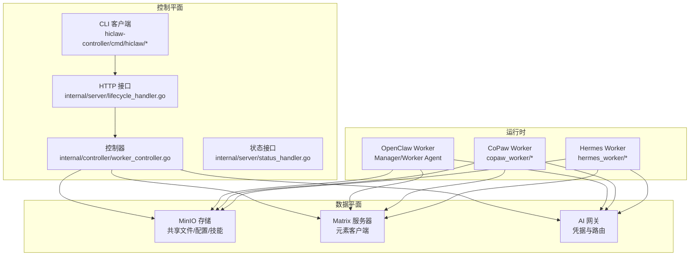
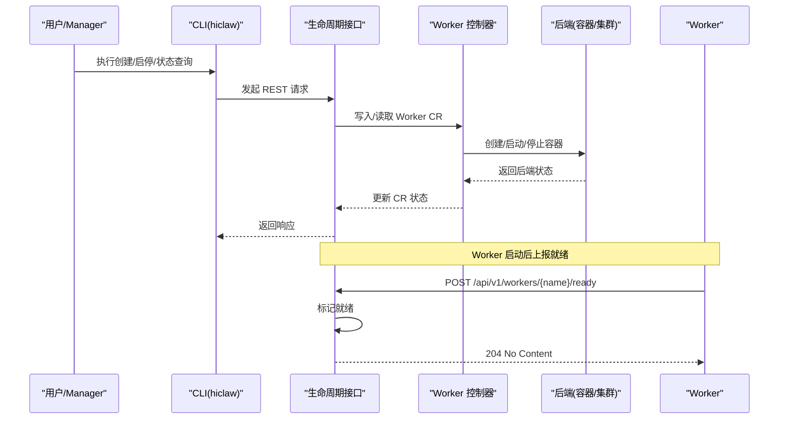
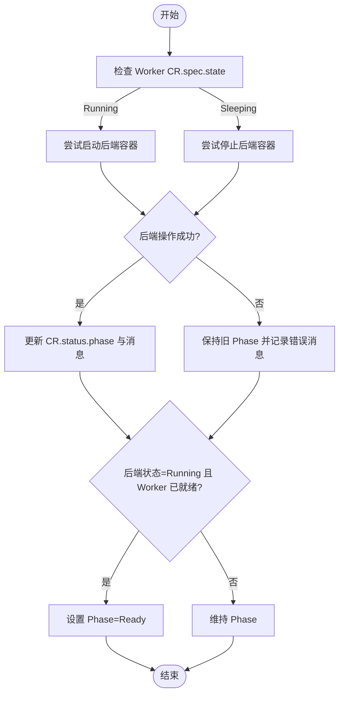
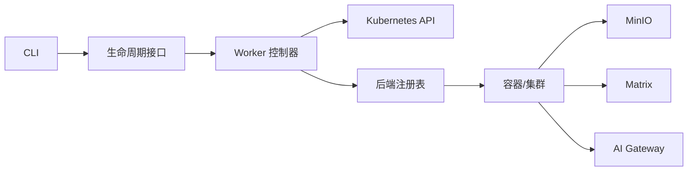

# Worker 管理

<cite>
**本文引用的文件**
- [README.md](file://README.md)
- [docs/worker-guide.md](file://docs/worker-guide.md)
- [hiclaw-controller/cmd/hiclaw/worker_cmd.go](file://hiclaw-controller/cmd/hiclaw/worker_cmd.go)
- [hiclaw-controller/cmd/hiclaw/create.go](file://hiclaw-controller/cmd/hiclaw/create.go)
- [hiclaw-controller/internal/controller/worker_controller.go](file://hiclaw-controller/internal/controller/worker_controller.go)
- [hiclaw-controller/internal/server/lifecycle_handler.go](file://hiclaw-controller/internal/server/lifecycle_handler.go)
- [hiclaw-controller/internal/server/status_handler.go](file://hiclaw-controller/internal/server/status_handler.go)
- [copaw/src/copaw_worker/cli.py](file://copaw/src/copaw_worker/cli.py)
- [copaw/src/copaw_worker/config.py](file://copaw/src/copaw_worker/config.py)
- [copaw/src/copaw_worker/templates/config.json](file://copaw/src/copaw_worker/templates/config.json)
- [copaw/src/copaw_worker/templates/agent.worker.json](file://copaw/src/copaw_worker/templates/agent.worker.json)
- [hermes/src/hermes_worker/cli.py](file://hermes/src/hermes_worker/cli.py)
- [hermes/src/hermes_worker/config.py](file://hermes/src/hermes_worker/config.py)
- [manager/agent/worker-agent/AGENTS.md](file://manager/agent/worker-agent/AGENTS.md)
- [manager/agent/copaw-manager-agent/AGENTS.md](file://manager/agent/copaw-manager-agent/AGENTS.md)
- [manager/agent/hermes-worker-agent/AGENTS.md](file://manager/agent/hermes-worker-agent/AGENTS.md)
</cite>

## 目录
1. [简介](#简介)
2. [项目结构](#项目结构)
3. [核心组件](#核心组件)
4. [架构总览](#架构总览)
5. [详细组件分析](#详细组件分析)
6. [依赖关系分析](#依赖关系分析)
7. [性能考量](#性能考量)
8. [故障排查指南](#故障排查指南)
9. [结论](#结论)
10. [附录：CLI 命令参考](#附录cli-命令参考)

## 简介
本章节面向 HiClaw 的 Worker 管理系统，系统性阐述 Worker 的创建、配置、生命周期管理与状态监控机制；对比 OpenClaw、CoPaw、Hermes 三种运行时的 Worker 差异与适用场景；解释 Worker 技能系统（内置与自定义）的开发与部署；说明 Worker 的状态管理、健康检查与故障恢复策略；并提供完整的 CLI 命令参考与实际使用示例。

## 项目结构
HiClaw 采用“Manager-Workers 架构”，控制器通过 Kubernetes CRD 资源（Worker/Team/Human/Manager）进行声明式编排，Worker 作为轻量无状态容器连接到 Matrix，从 MinIO 同步配置与技能，并通过 AI Gateway 访问大模型服务。CLI 提供创建、查询、启停等运维能力，控制器内部提供生命周期与状态接口。

图表来源
- [hiclaw-controller/cmd/hiclaw/worker_cmd.go:11-22](file://hiclaw-controller/cmd/hiclaw/worker_cmd.go#L11-L22)
- [hiclaw-controller/internal/controller/worker_controller.go:30-55](file://hiclaw-controller/internal/controller/worker_controller.go#L30-L55)
- [hiclaw-controller/internal/server/lifecycle_handler.go:15-32](file://hiclaw-controller/internal/server/lifecycle_handler.go#L15-L32)
- [docs/worker-guide.md:13-21](file://docs/worker-guide.md#L13-L21)

章节来源
- [README.md:290-324](file://README.md#L290-L324)
- [docs/worker-guide.md:13-21](file://docs/worker-guide.md#L13-L21)

## 核心组件
- 控制器与资源编排：基于 Worker CRD 的声明式资源，控制器负责基础设施准备、配置注入、容器编排与暴露端口。
- 生命周期接口：提供唤醒、睡眠、就绪上报、状态查询等 REST 接口。
- CLI 工具：提供创建 Worker、查询状态、启停、就绪心跳等命令行能力。
- 运行时 Worker：OpenClaw、CoPaw、Hermes 三类 Worker，分别对应不同的工作空间布局、配置桥接与技能生态。
- 状态与健康：控制器聚合 CR 状态与后端容器状态，结合 Worker 自报就绪实现健康检查与故障恢复。

章节来源
- [hiclaw-controller/internal/controller/worker_controller.go:57-151](file://hiclaw-controller/internal/controller/worker_controller.go#L57-L151)
- [hiclaw-controller/internal/server/lifecycle_handler.go:34-205](file://hiclaw-controller/internal/server/lifecycle_handler.go#L34-L205)
- [hiclaw-controller/cmd/hiclaw/worker_cmd.go:28-289](file://hiclaw-controller/cmd/hiclaw/worker_cmd.go#L28-L289)

## 架构总览
下图展示 Worker 生命周期的关键交互流程：CLI 触发控制器，控制器更新 Worker CR 并调用后端执行容器启停；Worker 启动后向控制器上报就绪，控制器将 Phase 更新为 Ready；状态接口汇总 CR 与后端状态返回给查询方。

图表来源
- [hiclaw-controller/cmd/hiclaw/worker_cmd.go:28-289](file://hiclaw-controller/cmd/hiclaw/worker_cmd.go#L28-L289)
- [hiclaw-controller/internal/server/lifecycle_handler.go:34-205](file://hiclaw-controller/internal/server/lifecycle_handler.go#L34-L205)
- [hiclaw-controller/internal/controller/worker_controller.go:110-151](file://hiclaw-controller/internal/controller/worker_controller.go#L110-L151)

## 详细组件分析

### Worker 创建与配置
- CLI 创建 Worker：支持指定名称、模型、运行时、镜像、身份描述、SOUL 内容或文件、内置技能、包源、暴露端口、团队与角色等参数。创建后可选择等待 Worker 就绪或立即返回。
- 控制器处理：解析请求，生成 Worker CR，设置默认模型与运行时，触发基础设施与容器编排，最终在状态中反映 Phase 与消息。
- 运行时差异：
  - OpenClaw：以 Manager/Worker Agent 为主，工作空间位于 /root/hiclaw-fs/agents/<worker-name>/，HOME 指向该目录，便于脚本兼容。
  - CoPaw：工作空间位于 ~/.hiclaw-worker/<worker-name>/，并通过符号链接 /root/hiclaw-fs 兼容 OpenClaw 路径约定。
  - Hermes：工作空间与 OpenClaw 一致（/root/hiclaw-fs/agents/<worker-name>/），但配置与技能位于 .hermes/ 下，使用 hermes-agent 的适配层。
- 配置模板与安全：
  - CoPaw 提供默认配置模板（安全策略、文件保护、技能扫描等）。
  - OpenClaw Worker Agent 使用 openclaw.json 与 AGENTS.md/SOUL.md 等文件组织行为规则与通道配置。

章节来源
- [hiclaw-controller/cmd/hiclaw/create.go:29-147](file://hiclaw-controller/cmd/hiclaw/create.go#L29-L147)
- [docs/worker-guide.md:22-29](file://docs/worker-guide.md#L22-L29)
- [copaw/src/copaw_worker/templates/config.json:1-21](file://copaw/src/copaw_worker/templates/config.json#L1-L21)
- [copaw/src/copaw_worker/templates/agent.worker.json:1-25](file://copaw/src/copaw_worker/templates/agent.worker.json#L1-L25)
- [manager/agent/worker-agent/AGENTS.md:1-10](file://manager/agent/worker-agent/AGENTS.md#L1-L10)
- [manager/agent/hermes-worker-agent/AGENTS.md:5-22](file://manager/agent/hermes-worker-agent/AGENTS.md#L5-L22)

### 生命周期管理与状态监控
- CLI 生命周期命令：
  - 唤醒：启动已停止/休眠的 Worker。
  - 睡眠：停止运行中的 Worker（保留状态）。
  - 确保就绪：若休眠则先启动，再报告当前阶段。
  - 状态：查询单个 Worker 或按团队列出汇总表。
  - 就绪上报：Worker 自报就绪，支持周期心跳。
- 控制器状态计算：根据 CR 的 DesiredState 与后端容器状态，决定 Phase（Pending/Running/Sleeping/Ready/Failed），并在失败时保留旧 Phase 以避免误判健康 Worker。
- 健康检查与恢复：
  - Worker 启动后需上报就绪，控制器将其标记为 Ready。
  - 若后端状态异常，控制器在状态消息中体现后端信息，便于定位问题。
  - 失败时保持原 Phase，仅写入错误消息，避免瞬时错误导致健康 Worker 被标记为失败。

图表来源
- [hiclaw-controller/internal/server/lifecycle_handler.go:34-205](file://hiclaw-controller/internal/server/lifecycle_handler.go#L34-L205)
- [hiclaw-controller/internal/controller/worker_controller.go:294-309](file://hiclaw-controller/internal/controller/worker_controller.go#L294-L309)

章节来源
- [hiclaw-controller/cmd/hiclaw/worker_cmd.go:28-289](file://hiclaw-controller/cmd/hiclaw/worker_cmd.go#L28-L289)
- [hiclaw-controller/internal/server/lifecycle_handler.go:34-205](file://hiclaw-controller/internal/server/lifecycle_handler.go#L34-L205)
- [hiclaw-controller/internal/controller/worker_controller.go:294-309](file://hiclaw-controller/internal/controller/worker_controller.go#L294-L309)

### 不同运行时的 Worker 配置与差异
- OpenClaw Worker
  - 工作空间：/root/hiclaw-fs/agents/<worker-name>/，HOME 指向该目录。
  - 配置桥接：通过 openclaw.json 与 AGENTS.md/SOUL.md 等文件组织行为与通道。
  - 技能：skills/ 目录用于内置与自定义技能，遵循 Manager/Worker Agent 的协作规范。
- CoPaw Worker
  - 工作空间：~/.hiclaw-worker/<worker-name>/，并通过 /root/hiclaw-fs 兼容路径。
  - CLI 参数：支持 MinIO 端点、密钥、桶、同步间隔、安装目录与控制台端口等。
  - 安全模板：提供默认安全策略与技能扫描配置。
- Hermes Worker
  - 工作空间：/root/hiclaw-fs/agents/<worker-name>/，配置位于 .hermes/。
  - CLI 参数：MinIO 端点、密钥、桶、同步间隔、安装目录等。
  - 适配层：通过桥接将 openclaw.json 映射到 hermes-agent 的 config.yaml 与 .env。

章节来源
- [docs/worker-guide.md:22-29](file://docs/worker-guide.md#L22-L29)
- [copaw/src/copaw_worker/cli.py:24-68](file://copaw/src/copaw_worker/cli.py#L24-L68)
- [copaw/src/copaw_worker/config.py:7-29](file://copaw/src/copaw_worker/config.py#L7-L29)
- [copaw/src/copaw_worker/templates/config.json:1-21](file://copaw/src/copaw_worker/templates/config.json#L1-L21)
- [copaw/src/copaw_worker/templates/agent.worker.json:1-25](file://copaw/src/copaw_worker/templates/agent.worker.json#L1-L25)
- [hermes/src/hermes_worker/cli.py:24-70](file://hermes/src/hermes_worker/cli.py#L24-L70)
- [hermes/src/hermes_worker/config.py:7-40](file://hermes/src/hermes_worker/config.py#L7-L40)
- [manager/agent/worker-agent/AGENTS.md:1-10](file://manager/agent/worker-agent/AGENTS.md#L1-L10)
- [manager/agent/hermes-worker-agent/AGENTS.md:5-22](file://manager/agent/hermes-worker-agent/AGENTS.md#L5-L22)

### Worker 技能系统：内置与自定义
- 内置技能：由 Coordinator 分配，不可修改；例如 file-sync、task-progress、find-skills、mcporter 等。
- 自定义技能：位于 skills/ 目录，可自由增删改；变更会同步至集中存储并持久化。
- 技能生态：
  - OpenClaw：skills/ 目录与 Manager/Worker Agent 协作，遵循统一的 SKILL.md 文档规范。
  - CoPaw：技能模板与安全策略由模板文件提供，支持工具守卫与文件保护。
  - Hermes：技能位于 ~/.hermes/skills/，通过 file-sync 技能拉取最新版本。

章节来源
- [manager/agent/worker-agent/AGENTS.md:48-60](file://manager/agent/worker-agent/AGENTS.md#L48-L60)
- [copaw/src/copaw_worker/templates/config.json:1-21](file://copaw/src/copaw_worker/templates/config.json#L1-L21)
- [manager/agent/hermes-worker-agent/AGENTS.md:82-87](file://manager/agent/hermes-worker-agent/AGENTS.md#L82-L87)

### 状态管理、健康检查与故障恢复
- 状态聚合：控制器将 CR 状态与后端容器状态合并，后端状态为 Running 且 Worker 已就绪时，Phase=Ready。
- 健康检查：Worker 启动后必须上报就绪；控制器维护就绪映射，失败时仅写入错误消息而不改变健康 Worker 的 Phase。
- 故障恢复：当后端操作失败（如容器被删除）时，控制器记录警告并交由 reconciler 重试重建；CLI 的 ensure-ready 可自动尝试启动并刷新状态。

章节来源
- [hiclaw-controller/internal/server/lifecycle_handler.go:162-205](file://hiclaw-controller/internal/server/lifecycle_handler.go#L162-L205)
- [hiclaw-controller/internal/controller/worker_controller.go:294-309](file://hiclaw-controller/internal/controller/worker_controller.go#L294-L309)

## 依赖关系分析
- 组件耦合：
  - CLI 依赖生命周期接口；接口依赖控制器；控制器依赖后端注册表与 Kubernetes 客户端。
  - Worker 依赖 MinIO（配置/技能）、Matrix（通信）、AI Gateway（模型访问）。
- 外部依赖：
  - Kubernetes（Pod/Service/SA/Secret 等资源管理）
  - MinIO（对象存储）
  - Matrix（即时通讯）
  - Higress AI Gateway（模型与 MCP 代理）

图表来源
- [hiclaw-controller/cmd/hiclaw/worker_cmd.go:11-22](file://hiclaw-controller/cmd/hiclaw/worker_cmd.go#L11-L22)
- [hiclaw-controller/internal/server/lifecycle_handler.go:15-32](file://hiclaw-controller/internal/server/lifecycle_handler.go#L15-L32)
- [hiclaw-controller/internal/controller/worker_controller.go:33-55](file://hiclaw-controller/internal/controller/worker_controller.go#L33-L55)

章节来源
- [hiclaw-controller/internal/controller/worker_controller.go:33-55](file://hiclaw-controller/internal/controller/worker_controller.go#L33-L55)
- [hiclaw-controller/internal/server/lifecycle_handler.go:15-32](file://hiclaw-controller/internal/server/lifecycle_handler.go#L15-L32)

## 性能考量
- 文件同步：本地到远端实时镜像同步，远端到本地每 5 分钟周期拉取，减少网络与令牌消耗。
- 资源调度：空闲 Worker 在可配置超时后自动停止，任务分配前自动唤醒，降低资源占用。
- 热重载：MinIO 配置推送后，Worker 通过 mc mirror 在下一个周期或即时拉取，OpenClaw 检测文件变更约 300ms 后热重载。
- 网络与安全：凭据不暴露给 Worker，统一由网关管理，降低风险并提升稳定性。

章节来源
- [docs/worker-guide.md:148-185](file://docs/worker-guide.md#L148-L185)

## 故障排查指南
- Worker 启动失败：检查容器日志；确认 openclaw.json 是否生成、mc 命令是否可用、Manager 容器是否运行。
- 无法连接 Matrix：验证服务器可达性；核对 openclaw.json 中的 Matrix 配置。
- 无法访问 LLM：测试 AI Gateway 访问；核对 Worker 的消费者密钥与路由授权。
- 无法访问 MCP（GitHub）：使用 mcporter 测试连通性；确认 Worker 已授权相应 MCP Server。
- 重置 Worker：停止并删除容器后，要求 Manager 重新创建；配置与任务数据保存在 MinIO，不会丢失。

章节来源
- [docs/worker-guide.md:61-123](file://docs/worker-guide.md#L61-L123)

## 结论
HiClaw 的 Worker 管理体系通过声明式资源与控制器实现自动化编排，结合 CLI 提供直观的生命周期操作；多运行时 Worker 在统一的工作空间与配置桥接下协同工作；通过健康检查与故障恢复机制保障稳定性；内置与自定义技能体系支持灵活扩展。建议在生产环境中配合团队与权限策略，合理配置 Worker 的模型、技能与暴露端口，并利用状态接口与日志进行持续监控。

## 附录：CLI 命令参考
以下命令均来自 hiclaw-controller 的 CLI 实现，覆盖 Worker 的创建、状态查询、启停与就绪上报。

- 创建 Worker
  - 语法：hiclaw create worker [--name] [--model] [--runtime] [--image] [--identity] [--soul|--soul-file] [--skills] [--package] [--expose] [--team] [--role] [--output|-o] [--wait-timeout] [--no-wait]
  - 示例：创建 OpenClaw Worker 并指定模型；创建 CoPaw Worker 并暴露端口；创建 Hermes Worker 并指定包源。
  - 行为：校验名称格式；解析包源；提交请求；可选择等待就绪或立即返回。

- 查询 Worker 状态
  - 语法：hiclaw worker status [--name|--team] [-o json]
  - 行为：查询单个 Worker 或团队内所有 Worker 的运行时摘要表；支持 JSON 输出。

- 唤醒 Worker
  - 语法：hiclaw worker wake --name [--team]
  - 行为：启动已停止/休眠的 Worker。

- 睡眠 Worker
  - 语法：hiclaw worker sleep --name [--team]
  - 行为：停止运行中的 Worker（保留状态）。

- 确保就绪
  - 语法：hiclaw worker ensure-ready --name [--team]
  - 行为：若休眠则先启动，再报告当前阶段。

- 上报就绪与心跳
  - 语法：hiclaw worker report-ready [--name] [--heartbeat] [--interval]
  - 行为：一次性上报就绪；可开启周期心跳（默认 60s）；支持从环境变量读取 Worker 名称。

章节来源
- [hiclaw-controller/cmd/hiclaw/create.go:29-147](file://hiclaw-controller/cmd/hiclaw/create.go#L29-L147)
- [hiclaw-controller/cmd/hiclaw/worker_cmd.go:28-289](file://hiclaw-controller/cmd/hiclaw/worker_cmd.go#L28-L289)