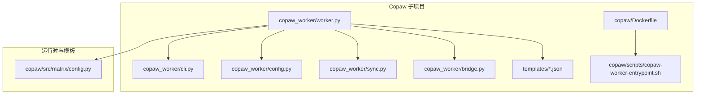
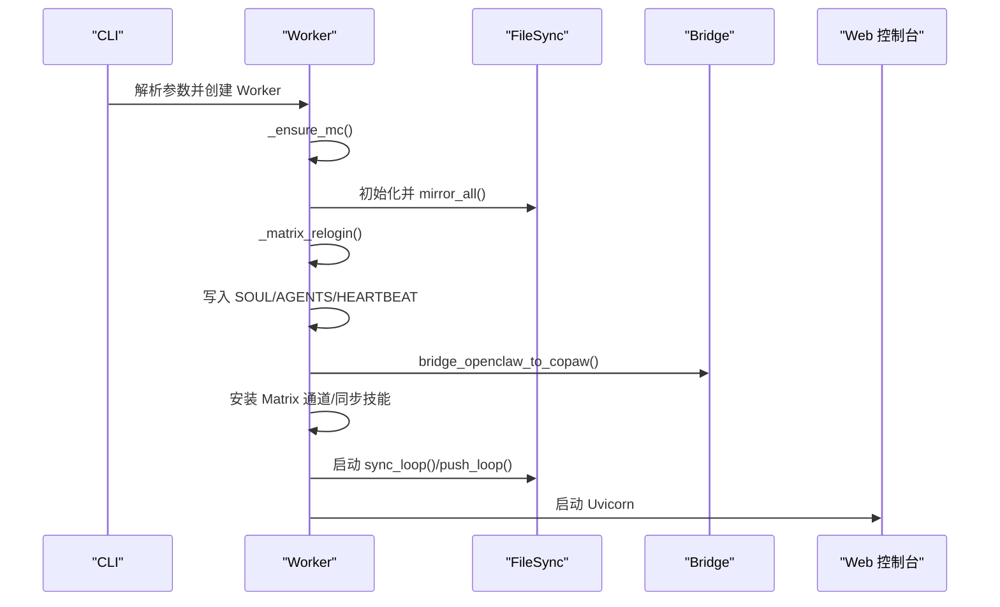
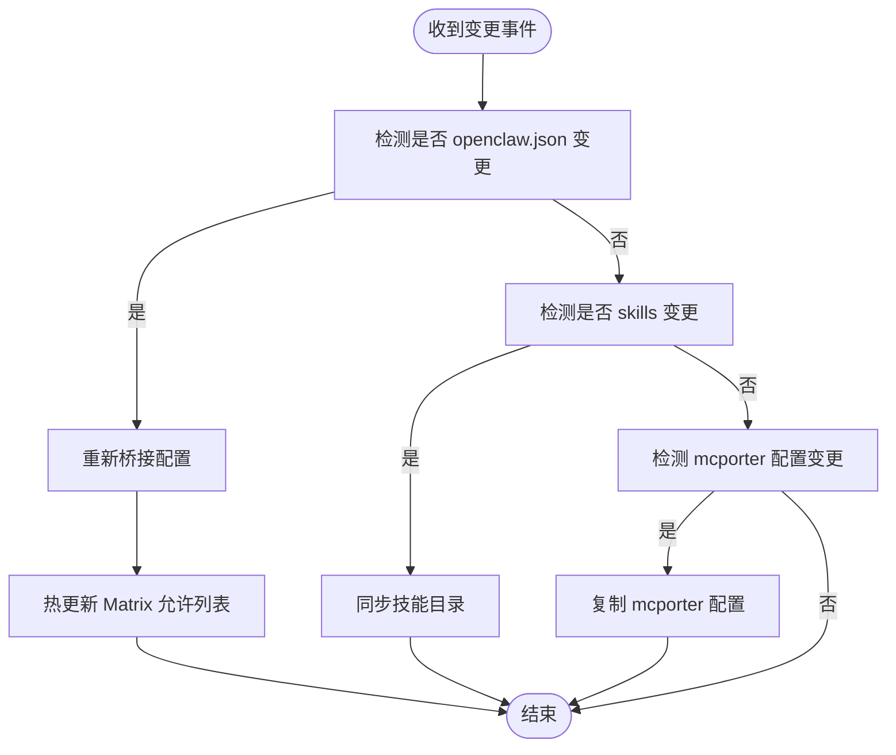
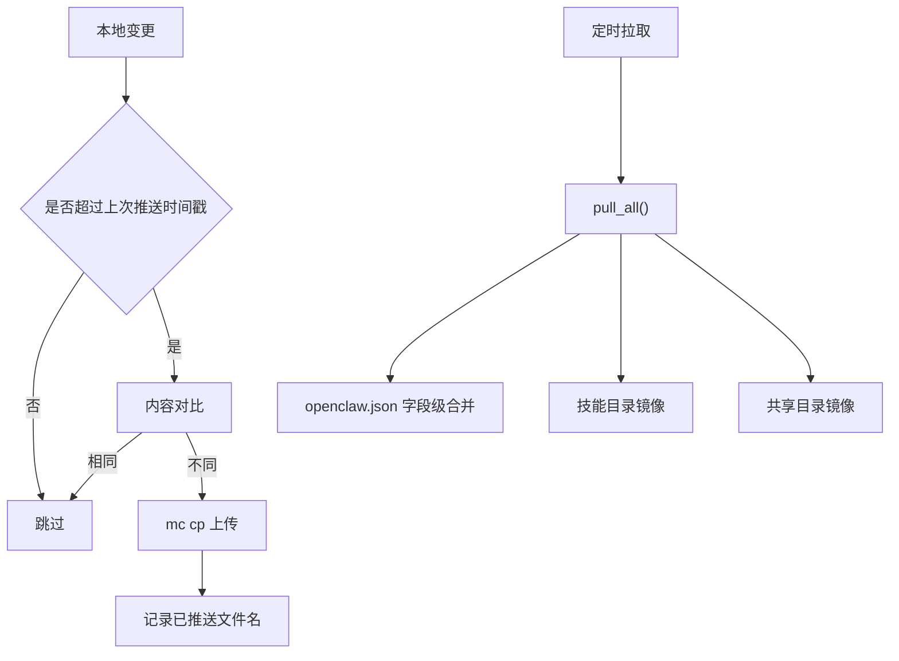
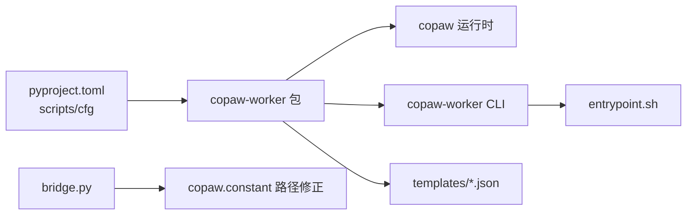

# CoPaw 运行时

<cite>
**本文引用的文件**
- [README.md](file://README.md)
- [quickstart.md](file://docs/quickstart.md)
- [worker-guide.md](file://docs/worker-guide.md)
- [copaw/README.md](file://copaw/README.md)
- [copaw/pyproject.toml](file://copaw/pyproject.toml)
- [copaw/Dockerfile](file://copaw/Dockerfile)
- [copaw/scripts/copaw-worker-entrypoint.sh](file://copaw/scripts/copaw-worker-entrypoint.sh)
- [copaw/src/copaw_worker/__init__.py](file://copaw/src/copaw_worker/__init__.py)
- [copaw/src/copaw_worker/cli.py](file://copaw/src/copaw_worker/cli.py)
- [copaw/src/copaw_worker/config.py](file://copaw/src/copaw_worker/config.py)
- [copaw/src/copaw_worker/worker.py](file://copaw/src/copaw_worker/worker.py)
- [copaw/src/copaw_worker/sync.py](file://copaw/src/copaw_worker/sync.py)
- [copaw/src/copaw_worker/bridge.py](file://copaw/src/copaw_worker/bridge.py)
- [copaw/src/copaw_worker/templates/config.json](file://copaw/src/copaw_worker/templates/config.json)
- [copaw/src/copaw_worker/templates/agent.worker.json](file://copaw/src/copaw_worker/templates/agent.worker.json)
- [copaw/src/copaw_worker/templates/agent.manager.json](file://copaw/src/copaw_worker/templates/agent.manager.json)
- [copaw/src/matrix/config.py](file://copaw/src/matrix/config.py)
</cite>

## 目录
1. [简介](#简介)
2. [项目结构](#项目结构)
3. [核心组件](#核心组件)
4. [架构总览](#架构总览)
5. [详细组件分析](#详细组件分析)
6. [依赖关系分析](#依赖关系分析)
7. [性能考量](#性能考量)
8. [故障排除指南](#故障排除指南)
9. [结论](#结论)
10. [附录](#附录)

## 简介
CoPaw 是 HiClaw Worker 运行时的一个实现，基于 CoPaw 框架，面向企业级协作场景，强调“人类在回路”（Human-in-the-Loop）、可审计、最小权限与零信任安全模型。其核心目标是：
- 将 Worker 设计为无状态容器，通过 MinIO 共享文件系统进行配置与状态同步；
- 以 Matrix 协议作为统一通信通道，确保任务可见、可干预；
- 将真实凭证集中于网关侧，Worker 仅持有消费者令牌，降低泄露风险；
- 支持多运行时共存（OpenClaw/QwenPaw/Hermes），在同一 IM 房间内协同。

## 项目结构
本仓库包含：
- copaw 子项目：CoPaw Worker 的 Python 实现与容器化打包；
- hiclaw-controller 及配套 CRD：控制器与声明式资源；
- manager/worker：Manager 与 Worker 的脚手架与技能生态；
- docs：快速入门、架构、运维与故障排除文档；
- helm：官方 Helm 图表，支持 Kubernetes 原生部署。



**图表来源**
- [copaw/src/copaw_worker/worker.py:45-177](file://copaw/src/copaw_worker/worker.py#L45-L177)
- [copaw/src/copaw_worker/sync.py:114-138](file://copaw/src/copaw_worker/sync.py#L114-L138)
- [copaw/src/copaw_worker/bridge.py:155-211](file://copaw/src/copaw_worker/bridge.py#L155-L211)
- [copaw/src/copaw_worker/cli.py:21-69](file://copaw/src/copaw_worker/cli.py#L21-L69)
- [copaw/src/copaw_worker/config.py:7-29](file://copaw/src/copaw_worker/config.py#L7-L29)
- [copaw/src/copaw_worker/templates/config.json:1-21](file://copaw/src/copaw_worker/templates/config.json#L1-L21)
- [copaw/src/matrix/config.py:160-184](file://copaw/src/matrix/config.py#L160-L184)
- [copaw/Dockerfile:1-132](file://copaw/Dockerfile#L1-L132)
- [copaw/scripts/copaw-worker-entrypoint.sh:1-144](file://copaw/scripts/copaw-worker-entrypoint.sh#L1-L144)

**章节来源**
- [README.md:1-404](file://README.md#L1-L404)
- [copaw/README.md:1-18](file://copaw/README.md#L1-L18)
- [copaw/pyproject.toml:1-31](file://copaw/pyproject.toml#L1-L31)
- [copaw/Dockerfile:1-132](file://copaw/Dockerfile#L1-L132)

## 核心组件
- CLI 与入口
  - copaw-worker CLI 提供命令行入口，解析参数并启动 Worker。
  - 容器入口脚本负责环境准备、云模式凭证注入、符号链接兼容层与就绪上报。
- Worker 主体
  - 启动阶段完成 mc 安装、全量镜像拉取、配置桥接、技能同步、通道安装与后台同步循环。
  - 运行阶段通过 Uvicorn 启动 Web 控制台与 CoPaw 应用。
- 文件同步
  - 基于 mc（MinIO Client）的双向镜像同步，支持本地变更推送与远端变更拉取。
  - 支持云模式（阿里云 RRSA/STS）与本地模式两种凭据路径。
- 配置桥接
  - 将 Controller 侧 openclaw.json 映射到 CoPaw 的 config.json、agent.json、providers.json，并处理热更新。
- 模板与默认值
  - 通过模板提供安全默认（工具守卫、文件守卫关闭），首次生成后由用户/代理自行维护。

**章节来源**
- [copaw/src/copaw_worker/cli.py:21-69](file://copaw/src/copaw_worker/cli.py#L21-L69)
- [copaw/scripts/copaw-worker-entrypoint.sh:1-144](file://copaw/scripts/copaw-worker-entrypoint.sh#L1-L144)
- [copaw/src/copaw_worker/worker.py:45-177](file://copaw/src/copaw_worker/worker.py#L45-L177)
- [copaw/src/copaw_worker/sync.py:114-138](file://copaw/src/copaw_worker/sync.py#L114-L138)
- [copaw/src/copaw_worker/bridge.py:155-211](file://copaw/src/copaw_worker/bridge.py#L155-L211)
- [copaw/src/copaw_worker/templates/config.json:1-21](file://copaw/src/copaw_worker/templates/config.json#L1-L21)

## 架构总览
CoPaw Worker 在容器中以“无状态 + 共享文件系统”的方式运行，通过 MinIO 维护配置与状态；通过 Matrix 通道与 Manager/人类交互；通过网关访问外部服务，实现最小权限与零信任。

```mermaid
graph TB
subgraph "容器内"
WRK["Worker 实例"]
SYNC["FileSync<br/>mc 镜像同步"]
BRG["Bridge<br/>openclaw.json → CoPaw 配置"]
CON["Web 控制台<br/>Uvicorn"]
end
subgraph "外部系统"
MINIO["MinIO 对象存储"]
MATRIX["Matrix 服务器"]
GATEWAY["AI 网关"]
end
WRK --> SYNC
WRK --> BRG
WRK --> CON
SYNC <- --> MINIO
CON <- --> MATRIX
CON <- --> GATEWAY
```

**图表来源**
- [copaw/src/copaw_worker/worker.py:183-205](file://copaw/src/copaw_worker/worker.py#L183-L205)
- [copaw/src/copaw_worker/sync.py:225-263](file://copaw/src/copaw_worker/sync.py#L225-L263)
- [copaw/src/copaw_worker/bridge.py:155-211](file://copaw/src/copaw_worker/bridge.py#L155-L211)

## 详细组件分析

### 启动流程与初始化
- 步骤概览
  1) 确保 mc 可用（自动下载或使用系统二进制）
  2) 初始化 FileSync 并执行全量镜像拉取（恢复所有状态）
  3) 读取 openclaw.json，必要时对 Matrix 执行重新登录以刷新设备 ID
  4) 创建 .copaw 工作目录，写入 SOUL/AGENTS/HEARTBEAT 到 workspaces/default
  5) 桥接 openclaw.json → config.json/agent.json/providers.json
  6) 复制 mcporter 配置，安装 Matrix 通道，同步技能
  7) 启动后台同步循环与 Web 控制台
- 关键点
  - 采用“先拉取再增量”的策略，保证重启后状态一致。
  - E2EE 场景下强制重新登录，避免密钥分发失败。
  - 通过环境变量推断网关端口，适配容器网络映射。



**图表来源**
- [copaw/src/copaw_worker/worker.py:65-177](file://copaw/src/copaw_worker/worker.py#L65-L177)
- [copaw/src/copaw_worker/sync.py:225-263](file://copaw/src/copaw_worker/sync.py#L225-L263)
- [copaw/src/copaw_worker/bridge.py:204-211](file://copaw/src/copaw_worker/bridge.py#L204-L211)

**章节来源**
- [copaw/src/copaw_worker/worker.py:65-177](file://copaw/src/copaw_worker/worker.py#L65-L177)
- [copaw/src/copaw_worker/sync.py:225-263](file://copaw/src/copaw_worker/sync.py#L225-L263)

### 配置桥接与热更新
- 桥接策略
  - 首次启动：从模板安装 config.json/agent.json/providers.json
  - 后续重启：仅覆盖 Controller 真正拥有的字段，保留用户侧自定义项
  - Matrix 相关字段采用“远程优先/联合/深合并”策略
- 热更新
  - 当 openclaw.json 或 mcporter 配置变化时，触发重桥接与允许列表热更新
  - SOUL/AGENTS/HEARTBEAT 由 Worker 端管理，不被远端覆盖



**图表来源**
- [copaw/src/copaw_worker/worker.py:494-545](file://copaw/src/copaw_worker/worker.py#L494-L545)
- [copaw/src/copaw_worker/bridge.py:469-512](file://copaw/src/copaw_worker/bridge.py#L469-L512)

**章节来源**
- [copaw/src/copaw_worker/bridge.py:155-211](file://copaw/src/copaw_worker/bridge.py#L155-L211)
- [copaw/src/copaw_worker/worker.py:494-545](file://copaw/src/copaw_worker/worker.py#L494-L545)

### 文件同步与兼容性设计
- 同步模型
  - 本地变更推送：按时间戳扫描并去重上传
  - 远端变更拉取：周期性拉取（默认 300 秒），并针对 openclaw.json 执行字段级合并
  - 技能与共享目录：整目录镜像，保持脚本可执行位
- 兼容性
  - 通过符号链接 /root/hiclaw-fs → /root/.hiclaw-worker/<name>，使依赖绝对路径的脚本兼容 CoPaw 的工作目录布局
  - 云模式下通过 RRSA/STS 自动刷新凭据，无需手动维护



**图表来源**
- [copaw/src/copaw_worker/sync.py:487-634](file://copaw/src/copaw_worker/sync.py#L487-L634)
- [copaw/src/copaw_worker/sync.py:346-463](file://copaw/src/copaw_worker/sync.py#L346-L463)

**章节来源**
- [copaw/src/copaw_worker/sync.py:114-138](file://copaw/src/copaw_worker/sync.py#L114-L138)
- [copaw/src/copaw_worker/sync.py:225-263](file://copaw/src/copaw_worker/sync.py#L225-L263)
- [copaw/scripts/copaw-worker-entrypoint.sh:60-62](file://copaw/scripts/copaw-worker-entrypoint.sh#L60-L62)

### 配置文件结构与工作目录布局
- 工作目录
  - /root/.hiclaw-worker/<worker-name>：Worker 同步根目录
  - /root/.hiclaw-worker/<worker-name>/.copaw：CoPaw 工作目录（含 config.json、agent.json、providers.json、workspaces/default 等）
- 关键文件
  - config.json：全局安全与运行时默认（首次生成，后续不覆盖）
  - agent.json：每代理配置（首次从模板生成，后续仅覆盖 Controller 拥有字段）
  - providers.json：LLM 提供商与密钥（始终远程优先）
  - SOUL.md/AGENTS.md/HEARTBEAT.md：系统提示与心跳脚本，位于 workspaces/default
- 模板
  - templates/config.json：安全默认（工具守卫/文件守卫关闭）
  - templates/agent.worker.json：Worker 默认通道与语言设置
  - templates/agent.manager.json：Manager 默认通道与语言设置

**章节来源**
- [copaw/src/copaw_worker/templates/config.json:1-21](file://copaw/src/copaw_worker/templates/config.json#L1-L21)
- [copaw/src/copaw_worker/templates/agent.worker.json:1-25](file://copaw/src/copaw_worker/templates/agent.worker.json#L1-L25)
- [copaw/src/copaw_worker/templates/agent.manager.json:1-26](file://copaw/src/copaw_worker/templates/agent.manager.json#L1-L26)
- [copaw/src/copaw_worker/worker.py:112-135](file://copaw/src/copaw_worker/worker.py#L112-L135)

### 安全与可观测性
- 凭据管理
  - 云模式：通过 RRSA/STS 自动刷新 MC_HOST_hiclaw，无需在 CLI 中显式传入密钥
  - 本地模式：通过 CLI 参数传入 MinIO 凭据
- 访问控制
  - Matrix 通道支持允许/拒绝列表、提及策略、群组白名单等
  - 心跳与活动窗口可配置，便于审计与合规
- 观测性
  - 可选启用 LoongSuite CMS 插件，导出 OTLP 指标与链路追踪
  - 控制台端口可通过环境变量调整，默认 8088

**章节来源**
- [copaw/scripts/copaw-worker-entrypoint.sh:36-50](file://copaw/scripts/copaw-worker-entrypoint.sh#L36-L50)
- [copaw/src/matrix/config.py:160-184](file://copaw/src/matrix/config.py#L160-L184)
- [copaw/scripts/copaw-worker-entrypoint.sh:104-123](file://copaw/scripts/copaw-worker-entrypoint.sh#L104-L123)

## 依赖关系分析
- 包与脚手架
  - copaw-worker 依赖 copaw 运行时、matrix-nio、markdown-it-py 等
  - CLI 注册 copaw-worker，容器入口脚本负责环境与就绪上报
- 运行时路径与模块常量
  - bridge 会动态修改 copaw.constant 中的工作目录与密钥目录，确保配置落盘到 .copaw



**图表来源**
- [copaw/pyproject.toml:12-24](file://copaw/pyproject.toml#L12-L24)
- [copaw/Dockerfile:100-107](file://copaw/Dockerfile#L100-L107)
- [copaw/src/copaw_worker/bridge.py:84-124](file://copaw/src/copaw_worker/bridge.py#L84-L124)

**章节来源**
- [copaw/pyproject.toml:1-31](file://copaw/pyproject.toml#L1-L31)
- [copaw/Dockerfile:1-132](file://copaw/Dockerfile#L1-L132)
- [copaw/src/copaw_worker/bridge.py:84-124](file://copaw/src/copaw_worker/bridge.py#L84-L124)

## 性能考量
- 内存与并发
  - 使用 jemalloc 降低内存碎片，典型 RSS 降低约 10%-20%
  - LLM 请求并发与限流参数可调，避免突发流量导致 429
- 同步策略
  - 本地推送采用“仅变更且内容对比”，减少无效上传
  - 远端拉取采用字段级合并，避免全量覆盖带来的抖动
- 容器镜像
  - 分层构建：依赖元数据先行安装，源码层高频变更不影响重下载

**章节来源**
- [copaw/Dockerfile:44-48](file://copaw/Dockerfile#L44-L48)
- [copaw/src/copaw_worker/sync.py:487-634](file://copaw/src/copaw_worker/sync.py#L487-L634)

## 故障排除指南
- Worker 启动失败
  - 检查容器日志；确认 openclaw.json 是否存在、mc 是否可用、端口是否可达
- 无法连接 Matrix
  - 通过容器内 curl 测试 homeserver 可达性；核对 openclaw.json 中的 Matrix 配置
- 无法访问 LLM
  - 使用 Worker 的消费者密钥测试 AI 网关；若 401/403，检查 Higress 消费者与授权
- 无法访问 MCP（如 GitHub）
  - 使用 mcporter 直连测试；若 403，确认 Manager 已授权该 Worker 访问对应 MCP 服务器
- 重置 Worker
  - 删除容器后让 Manager 重建；配置与任务数据在 MinIO，不会丢失

**章节来源**
- [docs/worker-guide.md:61-123](file://docs/worker-guide.md#L61-L123)
- [docs/quickstart.md:355-379](file://docs/quickstart.md#L355-L379)

## 结论
CoPaw 运行时通过“无状态容器 + MinIO 共享文件系统 + Matrix 通道 + 零信任网关”的组合，为企业提供了可控、可观测、可审计的多代理协作平台。其桥接机制与热更新能力确保了配置一致性与灵活性；云/本地双模式凭据管理降低了运维复杂度；模板化的安全默认与可观测性插件进一步提升了企业级落地能力。

## 附录

### 配置示例与最佳实践
- 安全配置
  - 使用云模式（HICLAW_RUNTIME=aliyun）结合 RRSA/STS，避免在 CLI 中暴露密钥
  - 通过 config.json 的工具守卫/文件守卫默认关闭，配合 Manager 的权限策略
- 性能调优
  - 调整 LLM 并发与限流参数，避免突发流量
  - 合理设置同步间隔与推送检查周期，平衡实时性与带宽
- 监控设置
  - 启用 LoongSuite CMS 插件，配置 OTLP 导出端点与头信息
  - 开启 COPAW_LOG_LEVEL 调试日志，定位桥接与通道问题

**章节来源**
- [copaw/scripts/copaw-worker-entrypoint.sh:104-123](file://copaw/scripts/copaw-worker-entrypoint.sh#L104-L123)
- [copaw/src/matrix/config.py:556-567](file://copaw/src/matrix/config.py#L556-L567)