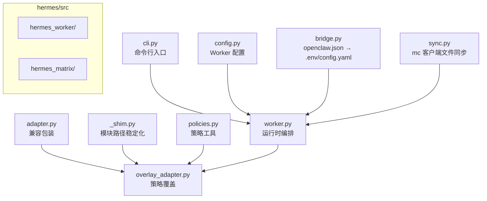
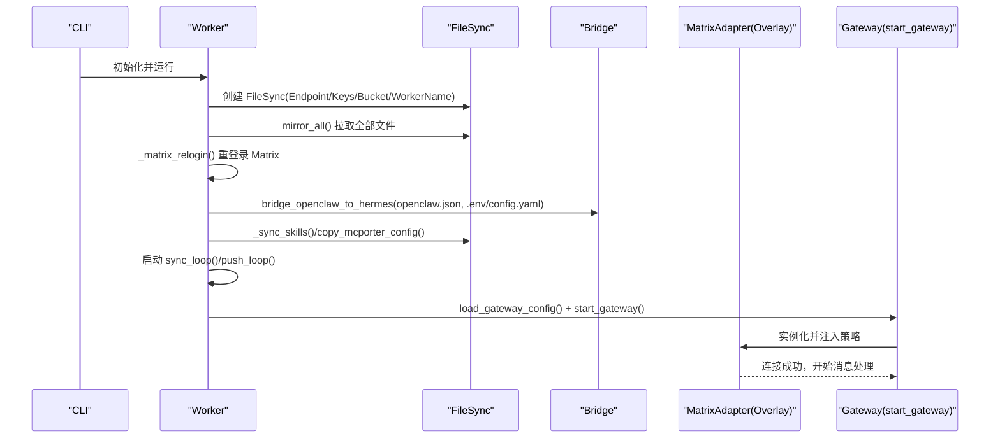
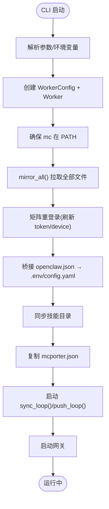
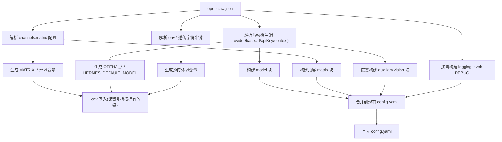
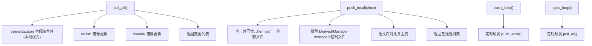
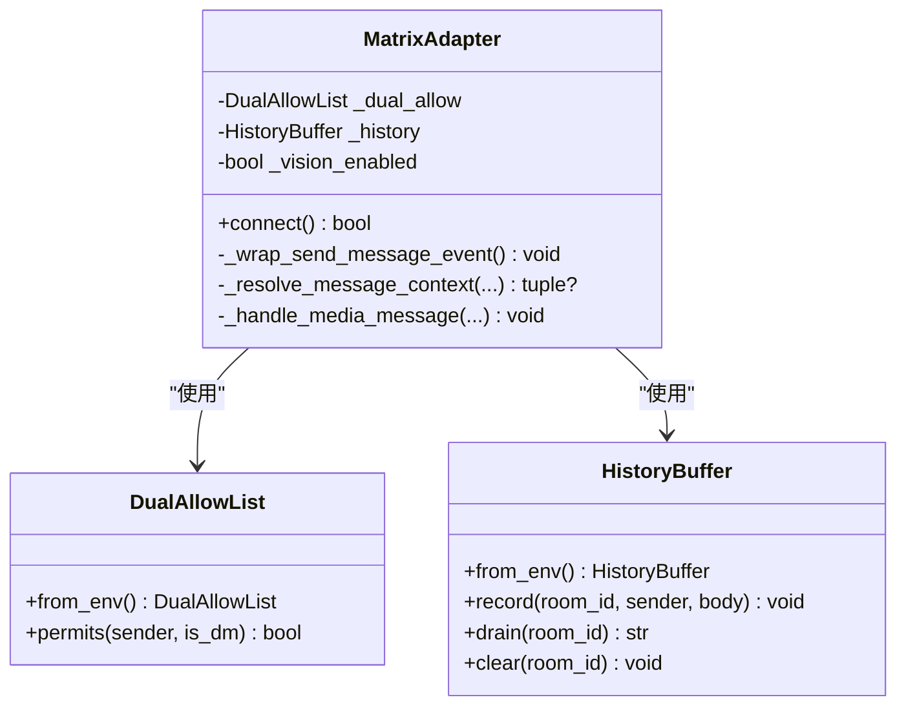
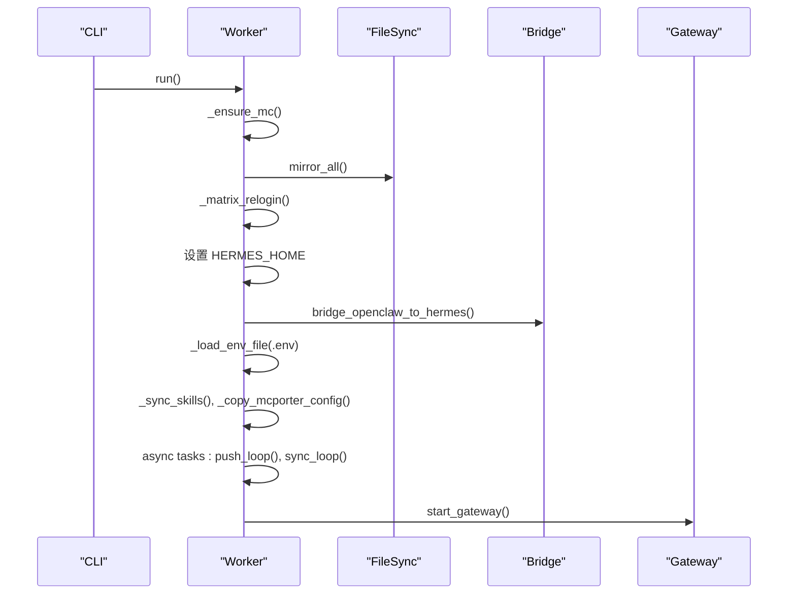
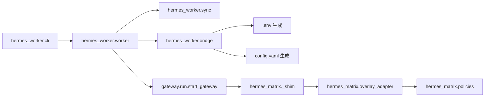

# Hermes 运行时

<cite>
**本文引用的文件**
- [hermes/README.md](file://hermes/README.md)
- [hermes/pyproject.toml](file://hermes/pyproject.toml)
- [hermes/src/hermes_worker/cli.py](file://hermes/src/hermes_worker/cli.py)
- [hermes/src/hermes_worker/config.py](file://hermes/src/hermes_worker/config.py)
- [hermes/src/hermes_worker/bridge.py](file://hermes/src/hermes_worker/bridge.py)
- [hermes/src/hermes_worker/worker.py](file://hermes/src/hermes_worker/worker.py)
- [hermes/src/hermes_worker/sync.py](file://hermes/src/hermes_worker/sync.py)
- [hermes/src/hermes_matrix/adapter.py](file://hermes/src/hermes_matrix/adapter.py)
- [hermes/src/hermes_matrix/overlay_adapter.py](file://hermes/src/hermes_matrix/overlay_adapter.py)
- [hermes/src/hermes_matrix/policies.py](file://hermes/src/hermes_matrix/policies.py)
- [hermes/src/hermes_matrix/_shim.py](file://hermes/src/hermes_matrix/_shim.py)
- [hermes/tests/test_bridge.py](file://hermes/tests/test_bridge.py)
- [hermes/tests/test_policies.py](file://hermes/tests/test_policies.py)
</cite>

## 目录
1. [简介](#简介)
2. [项目结构](#项目结构)
3. [核心组件](#核心组件)
4. [架构总览](#架构总览)
5. [详细组件分析](#详细组件分析)
6. [依赖关系分析](#依赖关系分析)
7. [性能考量](#性能考量)
8. [故障排查指南](#故障排查指南)
9. [结论](#结论)
10. [附录](#附录)

## 简介
Hermes 是基于 hermes-agent 的高性能代理运行时，专为 HiClaw Worker 设计。它通过桥接 openclaw.json 配置生成 hermes-agent 所需的 config.yaml 与 .env，并在 Matrix 上以“仅矩阵”模式运行网关；同时用 matrix-nio 适配器替换上游 mautrix 适配器，以复用 CoPaw 的房间策略（白名单、@提及要求、加密、视觉支持、群聊/私聊拆分）。

Hermes 的关键特性：
- 基于 openclaw.json 的声明式配置桥接，生成 .hermes 目录下的 config.yaml 与 .env
- 使用自定义 Matrix 适配器叠加 HiClaw 策略层，保持跨 Worker 的一致行为
- 采用 MinIO 客户端（mc）进行双向文件同步：Manager 下发的配置与技能，以及 Worker 侧的会话与状态回传
- 启动流程包含：确保 mc、全量拉取、重新登录 Matrix、桥接配置、技能镜像、后台同步循环、启动网关

## 项目结构
Hermes 子模块位于 hermes/ 目录，主要由以下部分组成：
- hermes_worker：运行时主逻辑（CLI、配置解析、桥接、同步、启动网关）
- hermes_matrix：HiClaw 策略覆盖层（适配器、策略工具、模块 shim）

图示来源
- [hermes/src/hermes_worker/cli.py:1-72](file://hermes/src/hermes_worker/cli.py#L1-L72)
- [hermes/src/hermes_worker/worker.py:1-463](file://hermes/src/hermes_worker/worker.py#L1-L463)
- [hermes/src/hermes_worker/bridge.py:1-538](file://hermes/src/hermes_worker/bridge.py#L1-L538)
- [hermes/src/hermes_worker/sync.py:1-622](file://hermes/src/hermes_worker/sync.py#L1-L622)
- [hermes/src/hermes_matrix/adapter.py:1-5](file://hermes/src/hermes_matrix/adapter.py#L1-L5)
- [hermes/src/hermes_matrix/overlay_adapter.py:1-240](file://hermes/src/hermes_matrix/overlay_adapter.py#L1-L240)
- [hermes/src/hermes_matrix/_shim.py:1-24](file://hermes/src/hermes_matrix/_shim.py#L1-L24)
- [hermes/src/hermes_matrix/policies.py:1-223](file://hermes/src/hermes_matrix/policies.py#L1-L223)

章节来源
- [hermes/README.md:19-38](file://hermes/README.md#L19-L38)

## 核心组件
- CLI 入口：解析命令行参数与环境变量，构造 WorkerConfig 并启动异步运行循环
- Worker：负责生命周期管理（启动/停止）、文件同步、矩阵重登录、桥接配置、启动网关
- 桥接器：将 openclaw.json 映射到 .env 与 config.yaml，保留用户自定义项
- 同步器：使用 mc 客户端进行双向同步，区分 Manager-managed 与 Worker-managed 内容
- 矩阵适配器：在上游 mautrix 适配器之上叠加 HiClaw 策略（提及增强、双白名单、历史缓冲、图像降级）

章节来源
- [hermes/src/hermes_worker/cli.py:21-72](file://hermes/src/hermes_worker/cli.py#L21-L72)
- [hermes/src/hermes_worker/worker.py:44-165](file://hermes/src/hermes_worker/worker.py#L44-L165)
- [hermes/src/hermes_worker/bridge.py:400-538](file://hermes/src/hermes_worker/bridge.py#L400-L538)
- [hermes/src/hermes_worker/sync.py:114-144](file://hermes/src/hermes_worker/sync.py#L114-L144)
- [hermes/src/hermes_matrix/overlay_adapter.py:94-240](file://hermes/src/hermes_matrix/overlay_adapter.py#L94-L240)

## 架构总览
Hermes 的运行时架构围绕“配置桥接 + 矩阵策略覆盖 + 双向文件同步 + 网关启动”展开。下图展示了从 CLI 到网关启动的关键交互：

图示来源
- [hermes/src/hermes_worker/cli.py:21-72](file://hermes/src/hermes_worker/cli.py#L21-L72)
- [hermes/src/hermes_worker/worker.py:86-192](file://hermes/src/hermes_worker/worker.py#L86-L192)
- [hermes/src/hermes_worker/bridge.py:400-538](file://hermes/src/hermes_worker/bridge.py#L400-L538)
- [hermes/src/hermes_matrix/overlay_adapter.py:94-133](file://hermes/src/hermes_matrix/overlay_adapter.py#L94-L133)

## 详细组件分析

### 组件 A：CLI 与 Worker 生命周期
- CLI 负责解析参数（名称、MinIO 端点/密钥/桶、同步间隔、安装目录），构造 WorkerConfig 并注册信号处理器，随后进入异步运行循环
- Worker.start() 完成以下步骤：确保 mc、全量拉取、矩阵重登录、设置 HERMES_HOME、桥接配置、同步技能与 mcporter 配置、启动后台同步任务、启动网关
- Worker.stop() 支持优雅关闭，取消网关任务并输出状态

图示来源
- [hermes/src/hermes_worker/cli.py:21-72](file://hermes/src/hermes_worker/cli.py#L21-L72)
- [hermes/src/hermes_worker/worker.py:86-192](file://hermes/src/hermes_worker/worker.py#L86-L192)

章节来源
- [hermes/src/hermes_worker/cli.py:21-72](file://hermes/src/hermes_worker/cli.py#L21-L72)
- [hermes/src/hermes_worker/worker.py:44-165](file://hermes/src/hermes_worker/worker.py#L44-L165)

### 组件 B：配置桥接（openclaw.json → .env/config.yaml）
- 桥接器将 openclaw.json 中的模型、矩阵通道、运行时环境等映射到 .env 与 config.yaml，并保留用户自定义键
- 关键映射包括：
  - 矩阵：homeserver、accessToken、userId、deviceId、加密开关、DM/群组策略、@提及要求、自由回复房间、自动线程、主页房间、历史限制等
  - 模型：默认模型、provider/custom、base_url、上下文长度
  - 视觉：当模型具备图像输入能力时，写入 auxiliary.vision 块指向同一 OpenAI 兼容端点
  - 日志：当启用 HiClaw Matrix 调试时，写入 logging.level: DEBUG
- .env 中桥接拥有的键会在每次桥接时重写，用户自定义键被保留

图示来源
- [hermes/src/hermes_worker/bridge.py:400-538](file://hermes/src/hermes_worker/bridge.py#L400-L538)

章节来源
- [hermes/src/hermes_worker/bridge.py:14-26](file://hermes/src/hermes_worker/bridge.py#L14-L26)
- [hermes/src/hermes_worker/bridge.py:213-394](file://hermes/src/hermes_worker/bridge.py#L213-L394)

### 组件 C：文件同步（mc 客户端）
- 设计原则：谁写谁推；Manager 下发（只读）与 Worker 写入（可读写）分离
- Manager-managed：openclaw.json、mcporter-servers.json、skills/、shared/
- Worker-managed：AGENTS.md、SOUL.md、.hermes/sessions/、memory/ 等
- push_local 会排除 Derived 文件（如 .env/config.yaml）以防与 Manager 推送冲突；pull_all 对 openclaw.json 执行字段级合并（本地优先，远程覆盖特定键）
- 提供 push_loop 与 sync_loop 异步后台任务，周期性推送与拉取

图示来源
- [hermes/src/hermes_worker/sync.py:346-457](file://hermes/src/hermes_worker/sync.py#L346-L457)
- [hermes/src/hermes_worker/sync.py:481-601](file://hermes/src/hermes_worker/sync.py#L481-L601)

章节来源
- [hermes/src/hermes_worker/sync.py:114-144](file://hermes/src/hermes_worker/sync.py#L114-L144)
- [hermes/src/hermes_worker/sync.py:346-457](file://hermes/src/hermes_worker/sync.py#L346-L457)
- [hermes/src/hermes_worker/sync.py:481-601](file://hermes/src/hermes_worker/sync.py#L481-L601)

### 组件 D：矩阵策略覆盖（HiClaw 策略层）
- 适配器继承上游 mautrix MatrixAdapter，仅注入 HiClaw 策略层：
  - 出站 mentions 增强：自动从正文提取 MXID 并填充 m.mentions.user_ids
  - 双白名单：DM 与群组分别配置策略与允许列表
  - 历史缓冲：对未提及的群组闲聊追加上下文前缀，支持命令前缀跳过
  - 图像降级：当模型不支持视觉时，将图片事件降级为文本描述
- 模块 shim 将 hermes-agent 原生模块路径映射到覆盖版本，保证网关加载链路稳定

图示来源
- [hermes/src/hermes_matrix/overlay_adapter.py:94-240](file://hermes/src/hermes_matrix/overlay_adapter.py#L94-L240)
- [hermes/src/hermes_matrix/policies.py:126-174](file://hermes/src/hermes_matrix/policies.py#L126-L174)
- [hermes/src/hermes_matrix/policies.py:182-223](file://hermes/src/hermes_matrix/policies.py#L182-L223)

章节来源
- [hermes/src/hermes_matrix/adapter.py:1-5](file://hermes/src/hermes_matrix/adapter.py#L1-L5)
- [hermes/src/hermes_matrix/_shim.py:1-24](file://hermes/src/hermes_matrix/_shim.py#L1-L24)
- [hermes/src/hermes_matrix/overlay_adapter.py:94-240](file://hermes/src/hermes_matrix/overlay_adapter.py#L94-L240)
- [hermes/src/hermes_matrix/policies.py:1-223](file://hermes/src/hermes_matrix/policies.py#L1-L223)

### 组件 E：启动流程与初始化
- CLI 解析参数后创建 Worker，随后在 Worker.start() 中执行：
  - 确保 mc 已安装并加入 PATH
  - 使用 FileSync.mirror_all() 恢复工作区（包含 openclaw.json、SOUL.md、AGENTS.md、skills/ 等）
  - 通过 _matrix_relogin() 从 Manager 获取最新密码并刷新 accessToken/deviceId，确保 E2EE 身份轮换不影响其他客户端
  - 设置 HERMES_HOME 并调用 bridge_openclaw_to_hermes() 生成 .env 与 config.yaml
  - 加载 .env 至当前进程环境，同步技能目录与 mcporter 配置
  - 启动 push_loop 与 sync_loop 异步任务
  - 最后调用 gateway.run.start_gateway() 启动网关

图示来源
- [hermes/src/hermes_worker/worker.py:86-192](file://hermes/src/hermes_worker/worker.py#L86-L192)

章节来源
- [hermes/src/hermes_worker/worker.py:86-192](file://hermes/src/hermes_worker/worker.py#L86-L192)

## 依赖关系分析
- 依赖上游 hermes-agent（通过容器镜像安装，版本见 README），但通过 shim 与覆盖适配器替换其原生 Matrix 模块
- 依赖第三方库：matrix-nio、mautrix、httpx、pyyaml、typer、rich 等
- 运行时依赖 mc 客户端进行 MinIO 同步

图示来源
- [hermes/src/hermes_worker/cli.py:12-13](file://hermes/src/hermes_worker/cli.py#L12-L13)
- [hermes/src/hermes_worker/worker.py:32-38](file://hermes/src/hermes_worker/worker.py#L32-L38)
- [hermes/src/hermes_worker/bridge.py:400-538](file://hermes/src/hermes_worker/bridge.py#L400-L538)
- [hermes/src/hermes_matrix/_shim.py:10-23](file://hermes/src/hermes_matrix/_shim.py#L10-L23)
- [hermes/src/hermes_matrix/overlay_adapter.py:22-29](file://hermes/src/hermes_matrix/overlay_adapter.py#L22-L29)
- [hermes/pyproject.toml:12-25](file://hermes/pyproject.toml#L12-L25)

章节来源
- [hermes/pyproject.toml:1-37](file://hermes/pyproject.toml#L1-L37)
- [hermes/src/hermes_worker/worker.py:32-38](file://hermes/src/hermes_worker/worker.py#L32-L38)

## 性能考量
- 并发与事件循环
  - 使用 asyncio.run() 启动异步运行循环，所有 I/O 密集操作（HTTP、文件系统、网络）均在事件循环中调度
  - push_loop 与 sync_loop 通过线程池执行阻塞操作（如 mc 命令、文件扫描），避免阻塞事件循环
- 文件同步优化
  - push_local 仅比较文件内容与远端是否一致，减少不必要的上传
  - 排除 Derived 文件与缓存目录，降低无效 IO
  - pull_all 对 openclaw.json 采用字段级合并，避免整文件覆盖带来的副作用
- 网络与端口映射
  - 在容器内与宿主机开发场景下，桥接器会根据 HICLAW_PORT_GATEWAY 或端口信息重写内部 :8080 为对外暴露端口，确保网关地址正确
- 矩阵策略开销
  - 出站 mentions 增强与历史缓冲在消息处理路径上增加少量 CPU 开销，但可配置化且默认开启，适合高安全与上下文连续性的场景

章节来源
- [hermes/src/hermes_worker/sync.py:481-601](file://hermes/src/hermes_worker/sync.py#L481-L601)
- [hermes/src/hermes_worker/bridge.py:47-57](file://hermes/src/hermes_worker/bridge.py#L47-L57)
- [hermes/src/hermes_matrix/overlay_adapter.py:109-132](file://hermes/src/hermes_matrix/overlay_adapter.py#L109-L132)

## 故障排查指南
- 启动失败
  - 检查 mc 是否在 PATH；若缺失，Worker 会尝试自动下载安装，失败则需手动安装
  - 若 mirror_all 失败，确认 MinIO 端点、凭据与桶名正确
- 矩阵连接问题
  - 使用 _matrix_relogin() 刷新 token 与 device_id；若失败，检查 homeserver 地址与 Manager 发布的密码键值
- 配置未生效
  - openclaw.json 变更后会触发 re-bridge 与 .env 重载；某些设置需要重启网关才能热更新
  - auxiliary.vision 仅在模型具备图像输入能力时写入
- 文件不同步
  - push_local 会排除 Derived 文件（.env/config.yaml）与 Manager-managed 路径，属预期行为
  - pull_all 对 openclaw.json 采用本地优先合并，远程仅覆盖指定键
- 调试日志
  - 设置 HICLAW_MATRIX_DEBUG=1 以提升日志级别，便于定位矩阵侧问题

章节来源
- [hermes/src/hermes_worker/worker.py:197-277](file://hermes/src/hermes_worker/worker.py#L197-L277)
- [hermes/src/hermes_worker/bridge.py:383-394](file://hermes/src/hermes_worker/bridge.py#L383-L394)
- [hermes/src/hermes_worker/sync.py:481-601](file://hermes/src/hermes_worker/sync.py#L481-L601)
- [hermes/tests/test_bridge.py:94-110](file://hermes/tests/test_bridge.py#L94-L110)

## 结论
Hermes 运行时通过“配置桥接 + 策略覆盖 + 双向同步 + 网关启动”的组合，实现了与 HiClaw 生态一致的高性能代理运行体验。其设计强调：
- 配置即代码：openclaw.json 作为单一事实源，桥接生成标准 hermes 配置
- 策略一致性：矩阵策略与 CoPaw 保持一致，简化运维与行为预期
- 可靠性：严格的文件同步策略与错误处理，保障 Manager 与 Worker 之间的数据一致性
- 可扩展性：保留用户自定义配置空间，便于高级定制

## 附录

### 配置文件结构与说明
- .hermes 目录布局
  - config.yaml：模型、平台、辅助视觉、日志等配置
  - .env：矩阵与模型相关的环境变量（如 MATRIX_*、OPENAI_*、HERMES_DEFAULT_MODEL）
  - SOUL.md / AGENTS.md：系统提示与团队信息
  - skills/：技能目录（由 Manager 下发）
  - sessions/、memory/：会话与记忆数据（Worker 写入）
- openclaw.json 与 .env/config.yaml 的映射要点
  - 矩阵通道：homeserver、accessToken、userId、deviceId、加密、DM/群组策略、@提及、自由回复房间、自动线程、主页房间、历史限制
  - 模型：provider/custom、base_url、默认模型、上下文长度
  - 视觉：当模型具备图像输入能力时，写入 auxiliary.vision 指向相同端点
  - 日志：HICLAW_MATRIX_DEBUG=1 时写入 logging.level: DEBUG

章节来源
- [hermes/src/hermes_worker/bridge.py:14-26](file://hermes/src/hermes_worker/bridge.py#L14-L26)
- [hermes/src/hermes_worker/bridge.py:213-394](file://hermes/src/hermes_worker/bridge.py#L213-L394)

### 启动流程与初始化要点
- CLI 参数
  - --name：Worker 名称
  - --fs/--fs-key/--fs-secret/--fs-bucket：MinIO 端点与凭据
  - --sync-interval：同步间隔（秒）
  - --install-dir：安装目录（默认 /root/hiclaw-fs/agents/<name>）
- 初始化步骤
  - 确保 mc、全量拉取、矩阵重登录、桥接配置、同步技能与 mcporter 配置、启动后台同步、启动网关

章节来源
- [hermes/src/hermes_worker/cli.py:24-48](file://hermes/src/hermes_worker/cli.py#L24-L48)
- [hermes/src/hermes_worker/worker.py:86-192](file://hermes/src/hermes_worker/worker.py#L86-L192)

### 策略系统与状态管理
- 策略系统
  - 双白名单：DM 与群组分别控制策略与允许列表
  - 历史缓冲：对未提及的群组闲聊追加上下文，支持命令前缀跳过
  - 出站 mentions：自动从正文提取 MXID 并填充 m.mentions
  - 图像降级：当模型不支持视觉时，将图片事件降级为文本描述
- 状态管理
  - .env 与 config.yaml 由桥接器生成并受控；会话与记忆数据位于 .hermes/sessions/ 与 memory/
  - push_loop 与 sync_loop 负责状态的持久化与同步

章节来源
- [hermes/src/hermes_matrix/policies.py:126-174](file://hermes/src/hermes_matrix/policies.py#L126-L174)
- [hermes/src/hermes_matrix/policies.py:182-223](file://hermes/src/hermes_matrix/policies.py#L182-L223)
- [hermes/src/hermes_matrix/overlay_adapter.py:94-240](file://hermes/src/hermes_matrix/overlay_adapter.py#L94-L240)
- [hermes/src/hermes_worker/sync.py:481-601](file://hermes/src/hermes_worker/sync.py#L481-L601)

### 配置示例与优化建议
- 配置示例（路径参考）
  - openclaw.json 示例键位参考：[hermes/src/hermes_worker/bridge.py:56-72](file://hermes/src/hermes_worker/bridge.py#L56-L72)
  - 矩阵策略键位参考：[hermes/src/hermes_worker/bridge.py:213-262](file://hermes/src/hermes_worker/bridge.py#L213-L262)
  - 模型与视觉键位参考：[hermes/src/hermes_worker/bridge.py:265-380](file://hermes/src/hermes_worker/bridge.py#L265-L380)
- 性能优化建议
  - 合理设置 --sync-interval，平衡实时性与带宽占用
  - 在容器内与宿主机开发场景下，确保 HICLAW_PORT_GATEWAY 正确或端口被自动识别
  - 使用 HICLAW_MATRIX_DEBUG=1 仅在调试阶段开启，避免日志噪声
  - 控制 skills 数量与大小，减少同步与加载开销

章节来源
- [hermes/src/hermes_worker/cli.py:24-48](file://hermes/src/hermes_worker/cli.py#L24-L48)
- [hermes/src/hermes_worker/bridge.py:47-57](file://hermes/src/hermes_worker/bridge.py#L47-L57)
- [hermes/tests/test_bridge.py:94-110](file://hermes/tests/test_bridge.py#L94-L110)

### 调试工具与性能监控
- 调试工具
  - HICLAW_MATRIX_DEBUG=1：提升日志级别，便于定位矩阵侧问题
  - 矩阵策略单元测试：验证 mentions 提取、双白名单、历史缓冲等功能
- 性能监控
  - 通过日志观察 sync_loop/push_loop 的执行情况与异常
  - 监控 openclaw.json 字段级合并与技能目录镜像的变更频率

章节来源
- [hermes/src/hermes_worker/bridge.py:383-394](file://hermes/src/hermes_worker/bridge.py#L383-L394)
- [hermes/tests/test_policies.py:1-100](file://hermes/tests/test_policies.py#L1-L100)