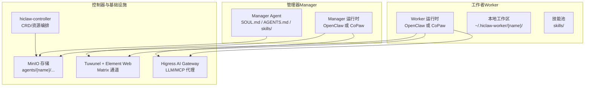
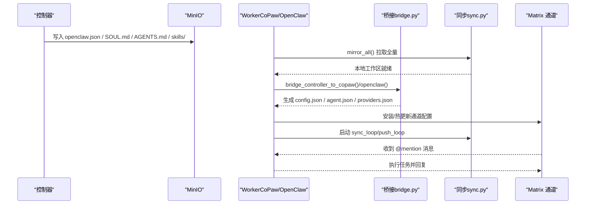
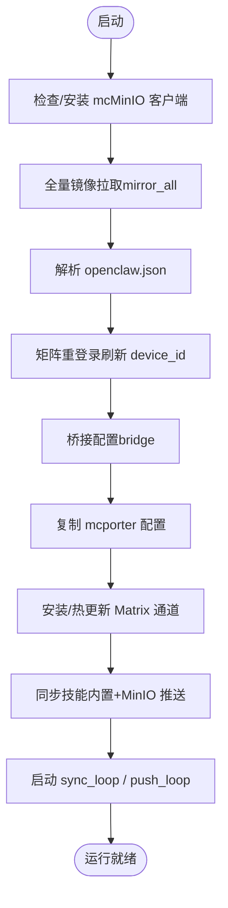
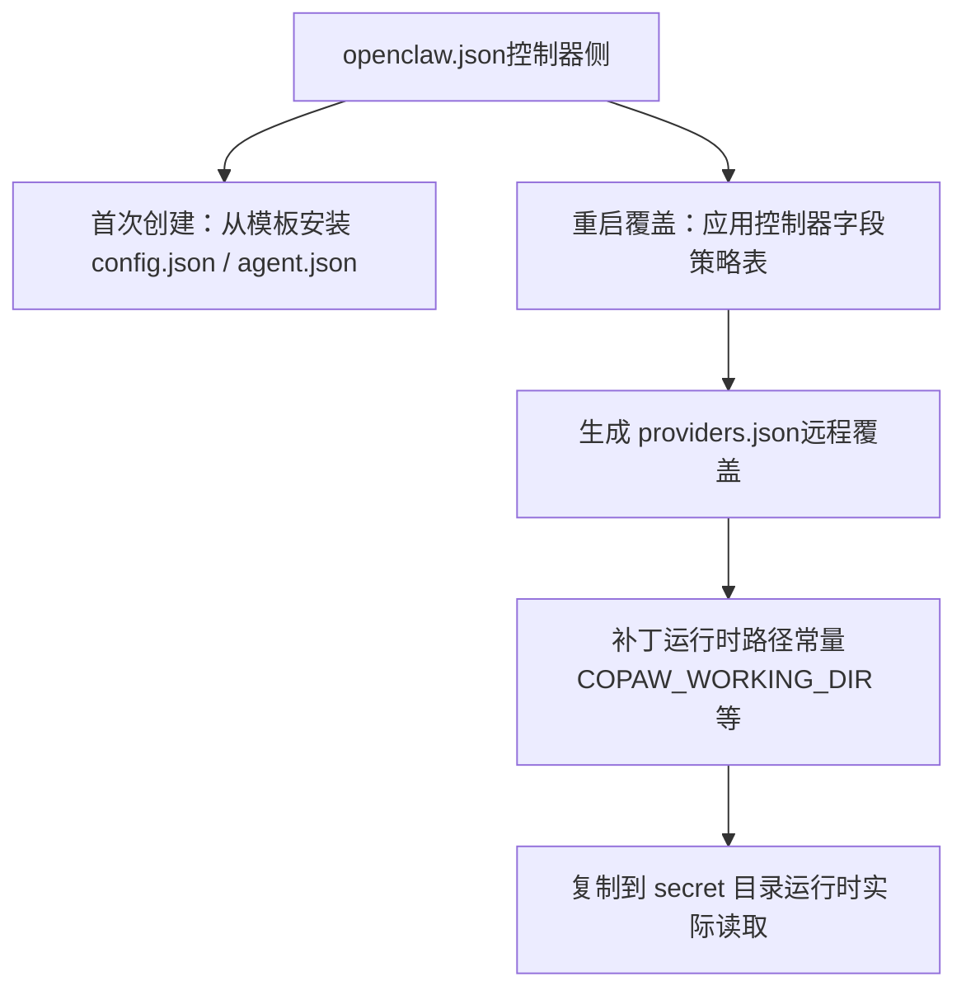
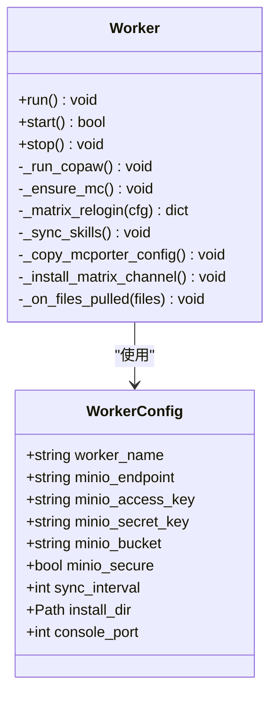
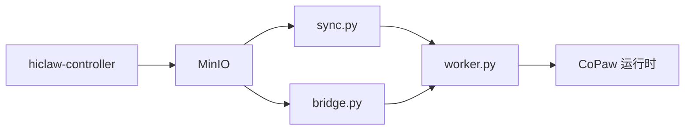

# OpenClaw 运行时

<cite>
**本文引用的文件**
- [README.md](file://README.md)
- [AGENTS.md](file://AGENTS.md)
- [manager/agent/worker-agent/AGENTS.md](file://manager/agent/worker-agent/AGENTS.md)
- [manager/agent/team-leader-agent/AGENTS.md](file://manager/agent/team-leader-agent/AGENTS.md)
- [manager/agent/team-leader-agent/SOUL.md.tmpl](file://manager/agent/team-leader-agent/SOUL.md.tmpl)
- [manager/agent/SOUL.md](file://manager/agent/SOUL.md)
- [copaw/AGENTS.md](file://copaw/AGENTS.md)
- [copaw/src/copaw_worker/config.py](file://copaw/src/copaw_worker/config.py)
- [copaw/src/copaw_worker/cli.py](file://copaw/src/copaw_worker/cli.py)
- [copaw/src/copaw_worker/worker.py](file://copaw/src/copaw_worker/worker.py)
- [copaw/src/copaw_worker/bridge.py](file://copaw/src/copaw_worker/bridge.py)
- [copaw/src/copaw_worker/sync.py](file://copaw/src/copaw_worker/sync.py)
</cite>

## 目录
1. [简介](#简介)
2. [项目结构](#项目结构)
3. [核心组件](#核心组件)
4. [架构总览](#架构总览)
5. [详细组件分析](#详细组件分析)
6. [依赖关系分析](#依赖关系分析)
7. [性能考量](#性能考量)
8. [故障排除指南](#故障排除指南)
9. [结论](#结论)
10. [附录](#附录)

## 简介
本文件面向 OpenClaw 运行时，系统性阐述其作为通用智能体运行时的设计理念与实现方式。OpenClaw 采用“管理器-工作者”（Manager-Workers）架构，通过统一的控制器与共享存储（MinIO）协调多 Worker 协作，结合 Matrix 即时通信通道，实现人类可审计、可干预的多智能体协作。本文重点覆盖以下主题：
- 配置文件结构：openclaw.json、SOUL.md、AGENTS.md 及其在不同运行时中的作用与格式
- 技能系统与工作目录布局：主工作空间与共享数据目录
- 启动流程与初始化：配置同步、技能加载、通道建立
- 配置示例与最佳实践：模型配置、通道设置、性能优化
- 调试工具与故障排除方法：日志定位、会话文件、常见问题

## 项目结构
HiClaw 仓库包含多个子系统与运行时，其中 OpenClaw 与 CoPaw 是两种 Worker 运行时。OpenClaw 以 Node.js 实现，CoPaw 以 Python 实现；两者共享同一套“控制器侧配置（openclaw.json + SOUL.md + AGENTS.md + skills/ + ...）”并通过桥接转换到各自原生配置布局。



图示来源
- [README.md: 305-333:305-333](file://README.md#L305-L333)
- [copaw/AGENTS.md: 23-53:23-53](file://copaw/AGENTS.md#L23-L53)

章节来源
- [README.md: 13-333:13-333](file://README.md#L13-L333)
- [copaw/AGENTS.md: 1-480:1-480](file://copaw/AGENTS.md#L1-L480)

## 核心组件
- 控制器（hiclaw-controller）：负责声明式资源（Worker/Team/Manager/Human）的创建、更新与删除，协调 MinIO、Matrix、Gateway 等基础设施。
- 管理器（Manager）：集中编排 Worker，维护自身身份（SOUL.md）、行为规范（AGENTS.md）、任务与团队状态，通过 Matrix 与人类与 Worker 交互。
- 工作者（Worker）：按需执行具体任务，读取控制器下发的 openclaw.json 并桥接到运行时原生配置，拉取/推送技能与共享数据，通过 Matrix 接收指令与发送结果。
- 共享存储（MinIO）：统一存放 Agent 规范（openclaw.json + SOUL.md + AGENTS.md + skills/），以及共享协作数据（shared/）。
- 通信通道（Matrix/Tuwunel）：基于 Matrix 协议，支持房间与私信，确保人类可审计与干预。
- 网关（Higress）：统一 LLM/MCP 请求路由与凭据管理，避免 Worker 直接持有真实密钥。

章节来源
- [README.md: 240-333:240-333](file://README.md#L240-L333)
- [copaw/AGENTS.md: 55-99:55-99](file://copaw/AGENTS.md#L55-L99)

## 架构总览
下图展示从控制器到 Worker 的完整链路：控制器写入 MinIO 中的 Agent 规范，Worker 拉取后桥接为运行时原生配置，再通过 Matrix 通道进行消息交互。



图示来源
- [copaw/src/copaw_worker/worker.py: 45-177:45-177](file://copaw/src/copaw_worker/worker.py#L45-L177)
- [copaw/src/copaw_worker/bridge.py: 155-211:155-211](file://copaw/src/copaw_worker/bridge.py#L155-L211)
- [copaw/src/copaw_worker/sync.py: 225-263:225-263](file://copaw/src/copaw_worker/sync.py#L225-L263)

章节来源
- [copaw/src/copaw_worker/worker.py: 1-545:1-545](file://copaw/src/copaw_worker/worker.py#L1-L545)
- [copaw/src/copaw_worker/bridge.py: 1-703:1-703](file://copaw/src/copaw_worker/bridge.py#L1-L703)
- [copaw/src/copaw_worker/sync.py: 1-634:1-634](file://copaw/src/copaw_worker/sync.py#L1-L634)

## 详细组件分析

### 组件一：Worker 启动与初始化流程（CoPaw）
该流程展示了 Worker 从镜像启动到进入运行态的关键步骤：确保 mc、拉取全量、解析配置、矩阵重登录、桥接配置、安装通道、同步技能、启动后台同步循环。



图示来源
- [copaw/src/copaw_worker/worker.py: 65-177:65-177](file://copaw/src/copaw_worker/worker.py#L65-L177)

章节来源
- [copaw/src/copaw_worker/worker.py: 45-177:45-177](file://copaw/src/copaw_worker/worker.py#L45-L177)

### 组件二：配置桥接（openclaw.json → 运行时原生配置）
桥接模块将控制器侧的 openclaw.json 转换为运行时原生配置文件（config.json、agent.json、providers.json），并处理容器内端口映射、路径补丁、安全策略等。



图示来源
- [copaw/src/copaw_worker/bridge.py: 155-211:155-211](file://copaw/src/copaw_worker/bridge.py#L155-L211)
- [copaw/src/copaw_worker/bridge.py: 519-648:519-648](file://copaw/src/copaw_worker/bridge.py#L519-L648)

章节来源
- [copaw/src/copaw_worker/bridge.py: 1-703:1-703](file://copaw/src/copaw_worker/bridge.py#L1-L703)

### 组件三：文件同步（MinIO ↔ 本地工作区）
同步模块使用 mc 命令行实现双向同步：Worker 端负责推送本地变更（会话、记忆、自定义文件），控制器/管理器侧负责拉取受控文件（openclaw.json、技能、共享数据）。

```mermaid
flowchart TD
subgraph "本地工作区"
L_WS["~/.hiclaw-worker/{name}/"]
L_COPAW[".copaw/运行时工作区"]
end
subgraph "MinIO"
M_WS["agents/{name}/"]
M_SHARED["shared/ / teams/{team}/shared/"]
end
L_WS <- --> |push_local| M_WS
M_WS <- --> |pull_all| L_WS
M_SHARED <- --> |mirror| L_WS
L_COPAW -.->|内部文件不推送| L_WS
```

图示来源
- [copaw/src/copaw_worker/sync.py: 225-263:225-263](file://copaw/src/copaw_worker/sync.py#L225-L263)
- [copaw/src/copaw_worker/sync.py: 346-463:346-463](file://copaw/src/copaw_worker/sync.py#L346-L463)
- [copaw/src/copaw_worker/sync.py: 487-604:487-604](file://copaw/src/copaw_worker/sync.py#L487-L604)

章节来源
- [copaw/src/copaw_worker/sync.py: 1-634:1-634](file://copaw/src/copaw_worker/sync.py#L1-L634)

### 组件四：命令行入口与配置对象（CoPaw Worker）
CoPaw Worker 提供 CLI 入口，解析命令行参数与环境变量，构建 WorkerConfig，并启动 Worker 生命周期。



图示来源
- [copaw/src/copaw_worker/config.py: 7-29:7-29](file://copaw/src/copaw_worker/config.py#L7-L29)
- [copaw/src/copaw_worker/worker.py: 32-177:32-177](file://copaw/src/copaw_worker/worker.py#L32-L177)
- [copaw/src/copaw_worker/cli.py: 21-69:21-69](file://copaw/src/copaw_worker/cli.py#L21-L69)

章节来源
- [copaw/src/copaw_worker/config.py: 1-29:1-29](file://copaw/src/copaw_worker/config.py#L1-L29)
- [copaw/src/copaw_worker/cli.py: 1-69:1-69](file://copaw/src/copaw_worker/cli.py#L1-L69)
- [copaw/src/copaw_worker/worker.py: 1-545:1-545](file://copaw/src/copaw_worker/worker.py#L1-L545)

## 依赖关系分析
- Worker 对同步模块（sync.py）与桥接模块（bridge.py）存在直接依赖，前者负责与 MinIO 的数据面交互，后者负责配置面转换。
- Worker 对运行时框架（CoPaw）存在运行时级依赖，桥接阶段会修改运行时常量与模块状态，确保配置正确加载。
- 管理器与 Worker 共享同一套 Agent 规范（openclaw.json + SOUL.md + AGENTS.md + skills/），但职责分离：管理器负责编排与下发，Worker 负责执行与回传。



图示来源
- [copaw/src/copaw_worker/worker.py: 24-26:24-26](file://copaw/src/copaw_worker/worker.py#L24-L26)
- [copaw/src/copaw_worker/bridge.py: 94-124:94-124](file://copaw/src/copaw_worker/bridge.py#L94-L124)
- [copaw/src/copaw_worker/sync.py: 114-136:114-136](file://copaw/src/copaw_worker/sync.py#L114-L136)

章节来源
- [copaw/src/copaw_worker/worker.py: 1-545:1-545](file://copaw/src/copaw_worker/worker.py#L1-L545)
- [copaw/src/copaw_worker/bridge.py: 1-703:1-703](file://copaw/src/copaw_worker/bridge.py#L1-L703)
- [copaw/src/copaw_worker/sync.py: 1-634:1-634](file://copaw/src/copaw_worker/sync.py#L1-L634)

## 性能考量
- 同步策略
  - 全量镜像（mirror_all）用于启动时恢复状态，后续使用增量拉取与变更触发推送，降低带宽与延迟。
  - sync_loop 默认周期为 300 秒，若 openclaw.json 发生字段级合并变化，可能触发每 5 分钟的重新桥接，注意避免与业务窗口冲突。
- 端口映射与容器网络
  - 桥接阶段根据容器内外部环境自动重映射端口（如 :8080 → HICLAW_PORT_GATEWAY），避免开发与生产环境差异导致的连通性问题。
- 日志与可观测性
  - Worker 输出两路日志：stdout（运行时日志）与文件日志；建议在调试时提升日志级别并关注会话文件（sessions/）以便复盘。

章节来源
- [copaw/src/copaw_worker/worker.py: 162-171:162-171](file://copaw/src/copaw_worker/worker.py#L162-L171)
- [copaw/src/copaw_worker/bridge.py: 67-76:67-76](file://copaw/src/copaw_worker/bridge.py#L67-L76)
- [copaw/src/copaw_worker/sync.py: 466-485:466-485](file://copaw/src/copaw_worker/sync.py#L466-L485)

## 故障排除指南
- 常见症状与定位路径
  - “Agent 未响应”：按层排查（Matrix 事件接收 → 通道允许列表 → Agent 回合触发 → LLM 请求 → Matrix 回复）。
  - “配置未生效”：检查 openclaw.json 是否被桥接为 .copaw/config.json 与 .copaw/workspaces/default/agent.json；留意每 5 分钟的 re-bridge 触发。
  - “技能未加载”：确认 MinIO skills/ 是否存在且 push_loop 已上传；CoPaw 会先安装内置技能，再叠加 MinIO 推送的技能。
- 日志与会话
  - 管理器与 Worker 的日志位置与会话文件格式在 CoPaw 文档中有明确说明，便于快速定位问题。
- 工具与脚本
  - 使用 hiclaw-debug 技能提供的脚本进行热同步与会话查看，减少频繁重建镜像带来的迭代成本。

章节来源
- [copaw/AGENTS.md: 295-461:295-461](file://copaw/AGENTS.md#L295-L461)

## 结论
OpenClaw 运行时通过“控制器侧统一规范 + 运行时原生配置桥接 + 分布式同步”的设计，实现了可审计、可扩展、可协作的多智能体运行平台。理解 openclaw.json、SOUL.md、AGENTS.md 的职责边界，掌握 Worker 启动流程与同步机制，是高效运维与排障的关键。

## 附录

### 配置文件结构与职责
- openclaw.json（控制器侧）
  - 描述通道（Matrix）、模型提供者、运行参数、心跳策略等；由控制器生成并写入 MinIO，Worker 拉取后桥接为运行时配置。
- SOUL.md（身份与规则）
  - 定义智能体的身份、角色、核心原则与安全规则；管理器与 Worker 均以此为行为基线。
- AGENTS.md（行为与工作流）
  - 定义日常操作流程、沟通协议、任务执行规范、安全与隐私要求等；管理器与 Worker 均以此为操作手册。
- skills/（技能目录）
  - 管理器推送的技能集合；Worker 拉取后安装到 active_skills/，并与内置技能共同构成可用工具集。

章节来源
- [copaw/AGENTS.md: 55-139:55-139](file://copaw/AGENTS.md#L55-L139)
- [manager/agent/worker-agent/AGENTS.md: 1-178:1-178](file://manager/agent/worker-agent/AGENTS.md#L1-L178)
- [manager/agent/team-leader-agent/AGENTS.md: 1-42:1-42](file://manager/agent/team-leader-agent/AGENTS.md#L1-L42)
- [manager/agent/SOUL.md: 1-51:1-51](file://manager/agent/SOUL.md#L1-L51)
- [manager/agent/team-leader-agent/SOUL.md.tmpl: 1-47:1-47](file://manager/agent/team-leader-agent/SOUL.md.tmpl#L1-L47)

### 命令行参数与环境变量（CoPaw Worker）
- 命令行参数
  - --name：Worker 名称
  - --fs/--fs-key/--fs-secret/--fs-bucket：MinIO 端点与凭证
  - --sync-interval：同步间隔（秒）
  - --install-dir：安装目录
  - --console-port：Web 控制台端口
- 环境变量
  - HICLAW_PORT_GATEWAY：网关端口映射
  - HICLAW_MANAGER_RUNTIME：管理器运行时选择（默认 OpenClaw）
  - HICLAW_MATRIX_DOMAIN / HICLAW_WORKER_NAME：矩阵域与 Worker 名称
  - COPAW_LOG_LEVEL：运行时日志级别
  - HICLAW_STORAGE_PREFIX：MinIO 前缀（用于 mc 命令）

章节来源
- [copaw/src/copaw_worker/cli.py: 24-44:24-44](file://copaw/src/copaw_worker/cli.py#L24-L44)
- [copaw/src/copaw_worker/worker.py: 139-144:139-144](file://copaw/src/copaw_worker/worker.py#L139-L144)
- [copaw/src/copaw_worker/bridge.py: 67-76:67-76](file://copaw/src/copaw_worker/bridge.py#L67-L76)
- [copaw/AGENTS.md: 180-190:180-190](file://copaw/AGENTS.md#L180-L190)

### 最佳实践
- 模型配置
  - 在 openclaw.json 的 models.providers 中声明提供者与模型，优先使用控制器侧统一管理，避免 Worker 本地覆盖。
- 通道设置
  - Matrix 允许列表（allow_from/group_allow_from）由控制器下发，Worker 仅做热更新；避免在运行时手动修改。
- 性能优化
  - 合理设置 sync_interval，避免与业务高峰重叠；必要时临时提高日志级别定位问题。
- 安全与合规
  - 禁止在聊天中泄露凭据；敏感信息通过 MinIO 文件系统传递，不通过 IM 明文传输。

章节来源
- [copaw/src/copaw_worker/bridge.py: 469-512:469-512](file://copaw/src/copaw_worker/bridge.py#L469-L512)
- [manager/agent/SOUL.md: 40-51:40-51](file://manager/agent/SOUL.md#L40-L51)
- [manager/agent/team-leader-agent/AGENTS.md: 24-42:24-42](file://manager/agent/team-leader-agent/AGENTS.md#L24-L42)