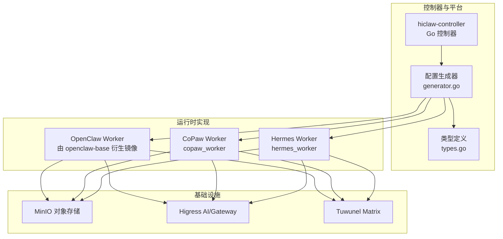
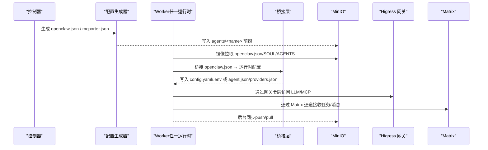
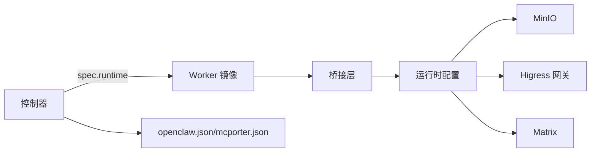

# Worker 运行时系统

<cite>
**本文引用的文件**
- [copaw/src/copaw_worker/config.py](file://copaw/src/copaw_worker/config.py)
- [hermes/src/hermes_worker/config.py](file://hermes/src/hermes_worker/config.py)
- [hiclaw-controller/internal/agentconfig/generator.go](file://hiclaw-controller/internal/agentconfig/generator.go)
- [hiclaw-controller/internal/agentconfig/types.go](file://hiclaw-controller/internal/agentconfig/types.go)
- [copaw/src/copaw_worker/worker.py](file://copaw/src/copaw_worker/worker.py)
- [hermes/src/hermes_worker/worker.py](file://hermes/src/hermes_worker/worker.py)
- [copaw/src/copaw_worker/bridge.py](file://copaw/src/copaw_worker/bridge.py)
- [hermes/src/hermes_worker/bridge.py](file://hermes/src/hermes_worker/bridge.py)
- [hiclaw-controller/internal/agentconfig/mcporter.go](file://hiclaw-controller/internal/agentconfig/mcporter.go)
- [hiclaw-controller/internal/controller/worker_controller.go](file://hiclaw-controller/internal/controller/worker_controller.go)
- [docs/zh-cn/worker-guide.md](file://docs/zh-cn/worker-guide.md)
- [docs/architecture.md](file://docs/architecture.md)
</cite>

## 目录
1. [简介](#简介)
2. [项目结构](#项目结构)
3. [核心组件](#核心组件)
4. [架构总览](#架构总览)
5. [详细组件分析](#详细组件分析)
6. [依赖分析](#依赖分析)
7. [性能考虑](#性能考虑)
8. [故障排除指南](#故障排除指南)
9. [结论](#结论)
10. [附录](#附录)

## 简介
本文件面向 HiClaw 的 Worker 运行时系统，系统提供三种运行时形态：
- OpenClaw 的通用智能体运行时：基于 Node/OpenClaw 的经典路径，适合广泛场景。
- CoPaw 的企业级协作运行时：Python 生态、矩阵通道与安全策略更贴近企业合规与可观测性。
- Hermes 的高性能代理运行时：以 Python 与 hermes-agent 为核心，强调配置桥接与热更新能力。

本文将从架构差异、配置选项、性能与资源消耗、运行时切换与迁移、文件系统布局与工作目录、选择指南与对比分析、调试与故障排除等方面进行系统化说明。

## 项目结构
HiClaw 将控制器、Manager 与 Worker 解耦为多容器体系，Worker 运行时位于独立镜像中，通过控制器生成的 openclaw.json 等配置文件驱动。下图展示与 Worker 运行时相关的核心模块与交互：

图表来源
- [docs/architecture.md:140-162](file://docs/architecture.md#L140-L162)
- [hiclaw-controller/internal/agentconfig/generator.go:25-203](file://hiclaw-controller/internal/agentconfig/generator.go#L25-L203)
- [hiclaw-controller/internal/agentconfig/types.go:3-45](file://hiclaw-controller/internal/agentconfig/types.go#L3-L45)

章节来源
- [docs/architecture.md:140-162](file://docs/architecture.md#L140-L162)
- [docs/architecture.md:163-177](file://docs/architecture.md#L163-L177)

## 核心组件
- 配置生成器（Go）：根据 Worker 请求与全局配置生成 openclaw.json、mcporter.json 等，统一模型、通道策略、网关令牌与端口映射。
- 运行时 Worker：
  - CoPaw Worker：Python 实现，桥接 openclaw.json 到 CoPaw 工作区，安装矩阵通道，维护技能与文件同步。
  - Hermes Worker：Python 实现，桥接 openclaw.json 到 hermes config.yaml/.env，启动 hermes gateway。
  - OpenClaw Worker：Node/OpenClaw，通过 openclaw.json 驱动，使用 mcporter 调用 MCP 服务。
- 桥接层：
  - CoPaw 桥接：将 openclaw.json 映射到 CoPaw 的 config.json/agent.json/providers.json。
  - Hermes 桥接：将 openclaw.json 映射到 HERMES_HOME 下的 .env 与 config.yaml。
- 控制器：根据 Worker CR 的 spec.runtime 决定镜像与运行时入口，协调生命周期与环境变量。

章节来源
- [hiclaw-controller/internal/agentconfig/generator.go:25-203](file://hiclaw-controller/internal/agentconfig/generator.go#L25-L203)
- [copaw/src/copaw_worker/bridge.py:155-211](file://copaw/src/copaw_worker/bridge.py#L155-L211)
- [hermes/src/hermes_worker/bridge.py:400-427](file://hermes/src/hermes_worker/bridge.py#L400-L427)
- [hiclaw-controller/internal/controller/worker_controller.go:43-48](file://hiclaw-controller/internal/controller/worker_controller.go#L43-L48)

## 架构总览
三种运行时的启动与配置桥接流程如下：

图表来源
- [copaw/src/copaw_worker/worker.py:65-177](file://copaw/src/copaw_worker/worker.py#L65-L177)
- [hermes/src/hermes_worker/worker.py:86-165](file://hermes/src/hermes_worker/worker.py#L86-L165)
- [hiclaw-controller/internal/agentconfig/generator.go:25-203](file://hiclaw-controller/internal/agentconfig/generator.go#L25-L203)

## 详细组件分析

### OpenClaw 运行时
- 特点
  - 基于 Node/OpenClaw 的经典路径，适合通用智能体任务与 MCP 工具链。
  - 通过 mcporter 调用 Higress 管理的 MCP 服务，具备良好的工具扩展性。
- 配置与桥接
  - 生成 openclaw.json（含 gateway、channels.matrix、models、agents.defaults 等），并通过 mcporter.json 注入 MCP 服务器列表。
  - Worker 启动时镜像拉取配置，随后启动 OpenClaw 网关与消息通道。
- 性能与资源
  - Node 进程与 OpenClaw 网关占用相对稳定；对大模型推理与并发请求具备良好吞吐。
- 适用场景
  - 需要 MCP 工具链、OpenAI 兼容接口、通用任务编排的场景。

章节来源
- [docs/architecture.md:144-148](file://docs/architecture.md#L144-L148)
- [hiclaw-controller/internal/agentconfig/mcporter.go:19-52](file://hiclaw-controller/internal/agentconfig/mcporter.go#L19-L52)

### CoPaw 运行时
- 特点
  - Python 生态，强调企业级安全与可观测性（config.json 默认安全策略、矩阵通道策略可叠加）。
  - 通过桥接将 openclaw.json 映射到 CoPaw 的工作区（.copaw/），并安装自定义矩阵通道。
- 配置与桥接
  - WorkerConfig 提供 MinIO 连接、同步间隔、安装目录等参数；启动时镜像拉取配置，再桥接到 CoPaw 的 agent.json、providers.json 与 config.json。
  - 支持动态热更新矩阵通道允许列表，避免重启导致的请求中断。
- 性能与资源
  - Python 进程与 uvicorn 服务开销适中；技能与文件同步采用后台任务，对主线程影响较小。
- 适用场景
  - 企业合规要求高、需要细粒度通道策略与安全扫描、偏好 Python 生态的团队。

章节来源
- [copaw/src/copaw_worker/config.py:7-29](file://copaw/src/copaw_worker/config.py#L7-L29)
- [copaw/src/copaw_worker/worker.py:65-177](file://copaw/src/copaw_worker/worker.py#L65-L177)
- [copaw/src/copaw_worker/bridge.py:155-211](file://copaw/src/copaw_worker/bridge.py#L155-L211)

### Hermes 运行时
- 特点
  - 以 hermes-agent 为核心，强调配置桥接与热更新能力，支持 .env 与 config.yaml 的增量覆盖。
  - 通过桥接将 openclaw.json 映射到 HERMES_HOME 下的 .env 与 config.yaml，并加载矩阵适配器。
- 配置与桥接
  - WorkerConfig 提供 MinIO 连接、同步间隔、安装目录等参数；启动时镜像拉取配置，桥接到 .env 与 config.yaml，并加载环境变量。
  - 支持在不重启的情况下热更新矩阵通道策略。
- 性能与资源
  - Python 进程与 hermes gateway 开销较低；热更新策略减少重启带来的抖动。
- 适用场景
  - 强调配置热更新、矩阵行为可控、需要与 hermes 生态集成的场景。

章节来源
- [hermes/src/hermes_worker/config.py:7-40](file://hermes/src/hermes_worker/config.py#L7-L40)
- [hermes/src/hermes_worker/worker.py:86-165](file://hermes/src/hermes_worker/worker.py#L86-L165)
- [hermes/src/hermes_worker/bridge.py:400-427](file://hermes/src/hermes_worker/bridge.py#L400-L427)

### 配置生成器与控制器
- 配置生成器
  - 统一生成 openclaw.json（gateway、channels.matrix、models、agents.defaults、session、plugins 等），并按需注入心跳与嵌入模型配置。
  - 支持通道策略叠加（组/私信允许列表增删），并处理端口映射与令牌一致性。
- 控制器
  - 根据 Worker CR 的 spec.runtime 决定镜像与运行时入口，协调生命周期与环境变量。
  - 通过 reconciler 执行基础设施、配置、容器与暴露流程。

章节来源
- [hiclaw-controller/internal/agentconfig/generator.go:25-203](file://hiclaw-controller/internal/agentconfig/generator.go#L25-L203)
- [hiclaw-controller/internal/agentconfig/types.go:3-45](file://hiclaw-controller/internal/agentconfig/types.go#L3-L45)
- [hiclaw-controller/internal/controller/worker_controller.go:43-48](file://hiclaw-controller/internal/controller/worker_controller.go#L43-L48)

## 依赖分析
- 运行时与控制器的耦合
  - 控制器通过 Worker CR 的 runtime 字段决定镜像与入口；配置生成器输出的 openclaw.json 作为运行时的唯一权威配置源。
- 运行时内部依赖
  - CoPaw 与 Hermes Worker 均依赖 MinIO 作为配置与技能的集中存储，通过 mc 镜像同步实现双向同步。
  - 三者均通过 Higress 网关访问 LLM 与 MCP 服务，使用统一的网关令牌进行鉴权。
- 外部依赖
  - Matrix（Tuwunel）提供人类与智能体的通信通道。
  - MinIO 提供对象存储与持久化配置。

图表来源
- [docs/architecture.md:140-162](file://docs/architecture.md#L140-L162)
- [hiclaw-controller/internal/agentconfig/generator.go:25-203](file://hiclaw-controller/internal/agentconfig/generator.go#L25-L203)

章节来源
- [docs/architecture.md:119-137](file://docs/architecture.md#L119-L137)

## 性能考虑
- 启动与同步
  - 三种运行时均采用“先镜像拉取配置，再启动”的模式，确保配置一致性。
  - 后台同步采用定时拉取与变更触发推送相结合，平衡实时性与带宽。
- 并发与资源
  - OpenClaw：Node 进程与 OpenClaw 网关并发处理消息与工具调用。
  - CoPaw：uvicorn 服务承载控制台与通道，后台任务处理技能与文件同步。
  - Hermes：hermes gateway 轻量运行，热更新策略降低重启成本。
- 模型与网关
  - 通过统一的网关令牌与端口映射，避免频繁重启带来的任务中断与上下文丢失。

章节来源
- [copaw/src/copaw_worker/worker.py:162-171](file://copaw/src/copaw_worker/worker.py#L162-L171)
- [hermes/src/hermes_worker/worker.py:155-162](file://hermes/src/hermes_worker/worker.py#L155-L162)
- [hiclaw-controller/internal/agentconfig/generator.go:89-102](file://hiclaw-controller/internal/agentconfig/generator.go#L89-L102)

## 故障排除指南
- 无法启动
  - 检查 openclaw.json 是否存在、mc 是否可用、端口映射是否正确。
- 无法连接 Matrix
  - 通过 curl 验证 homeserver 可达性，核对 openclaw.json 中的 Matrix 配置。
- 无法访问 LLM
  - 使用 openclaw.json 中的网关令牌访问 /v1/models，确认消费者密钥一致且路由已授权。
- 无法访问 MCP（GitHub）
  - 使用 mcporter 测试连通性，确认 MCP 服务器已授权。
- 重置 Worker
  - 停止并删除容器，让 Manager 重新创建；配置与数据保存在 MinIO，删除容器不会丢失。

章节来源
- [docs/zh-cn/worker-guide.md:61-123](file://docs/zh-cn/worker-guide.md#L61-L123)

## 结论
- 选择建议
  - 通用场景优先 OpenClaw，具备成熟的 MCP 工具链与生态。
  - 企业合规与安全优先 CoPaw，具备更强的策略与可观测性。
  - 高性能与热更新优先 Hermes，强调配置桥接与最小化重启。
- 切换与迁移
  - 通过控制器的 runtime 字段切换运行时；配置由 openclaw.json 统一生成，迁移时保持 MinIO 前缀一致即可复用配置与技能。

## 附录

### 运行时配置选项与差异
- 通用参数
  - Worker 名称、MinIO 端点/凭证、桶名、是否启用 TLS、同步间隔、安装目录/工作目录。
- 运行时特有
  - CoPaw：控制台端口（console_port）、工作区布局（.copaw/）。
  - Hermes：HERMES_HOME、技能目录、config.yaml 与 .env 的桥接范围。
- 控制器生成
  - openclaw.json：gateway、channels.matrix、models、agents.defaults、session、plugins。
  - mcporter.json：MCP 服务器列表与认证头。

章节来源
- [copaw/src/copaw_worker/config.py:7-29](file://copaw/src/copaw_worker/config.py#L7-L29)
- [hermes/src/hermes_worker/config.py:7-40](file://hermes/src/hermes_worker/config.py#L7-L40)
- [hiclaw-controller/internal/agentconfig/generator.go:25-203](file://hiclaw-controller/internal/agentconfig/generator.go#L25-L203)
- [hiclaw-controller/internal/agentconfig/mcporter.go:19-52](file://hiclaw-controller/internal/agentconfig/mcporter.go#L19-L52)

### 文件系统布局与工作目录
- OpenClaw（与 HOME 对齐）
  - 工作目录：/root/hiclaw-fs/agents/<worker-name>，共享数据：/root/hiclaw-fs/shared/。
- CoPaw
  - 工作目录：/root/.hiclaw-worker/<worker-name>，兼容符号链接 /root/hiclaw-fs 指向该树。
- Hermes
  - 工作目录：/root/hiclaw-fs/agents/<worker-name>，状态在 .hermes/（config.yaml、state.db 等）。

章节来源
- [docs/zh-cn/worker-guide.md:22-29](file://docs/zh-cn/worker-guide.md#L22-L29)

### 运行时切换与迁移流程
- 切换步骤
  - 修改 Worker CR 的 runtime 字段，控制器重建容器。
  - 配置仍由 openclaw.json 驱动，迁移时保持 MinIO 前缀一致，即可复用配置与技能。
- 数据兼容性
  - 配置与技能保存在 MinIO，容器删除不影响数据；迁移后通过镜像拉取恢复。

章节来源
- [hiclaw-controller/internal/controller/worker_controller.go:43-48](file://hiclaw-controller/internal/controller/worker_controller.go#L43-L48)
- [docs/architecture.md:140-162](file://docs/architecture.md#L140-L162)