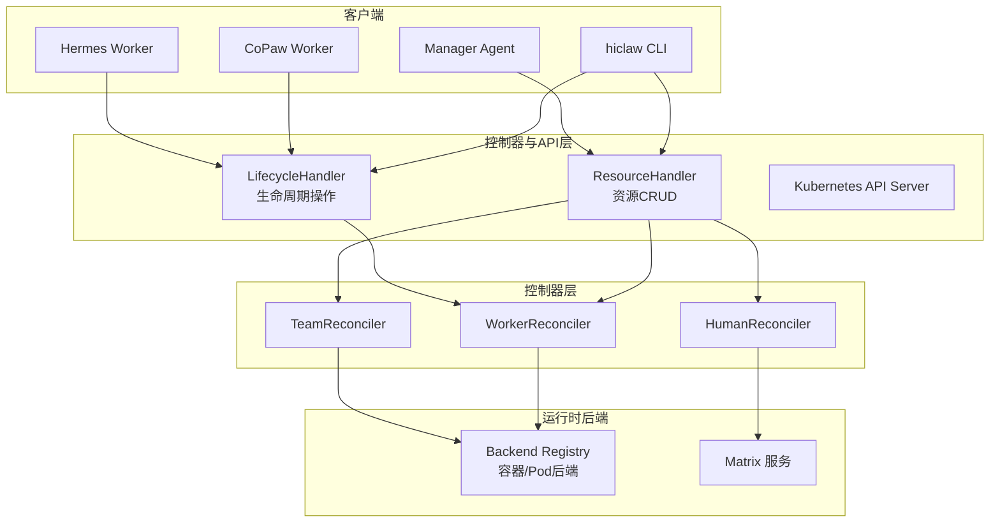
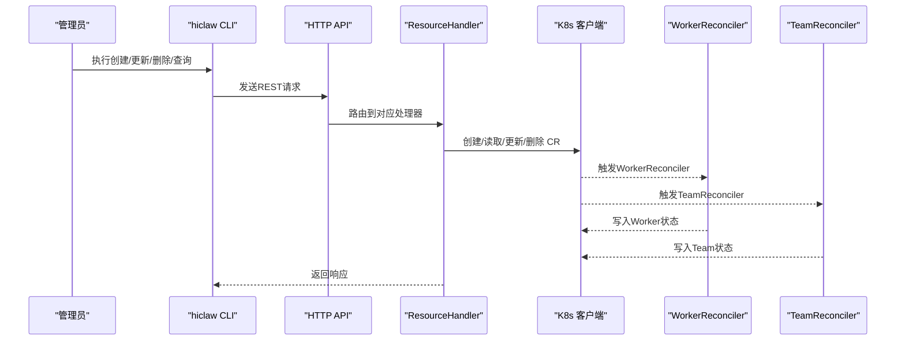
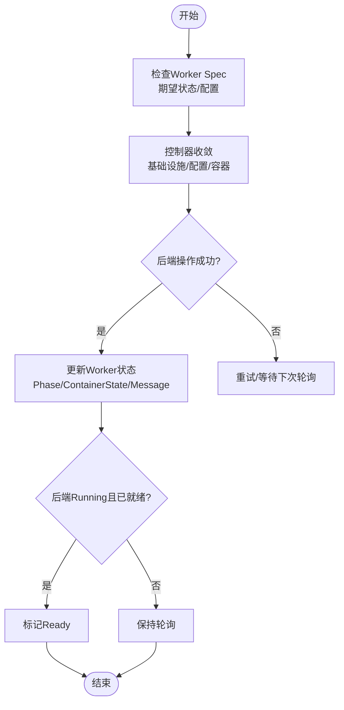
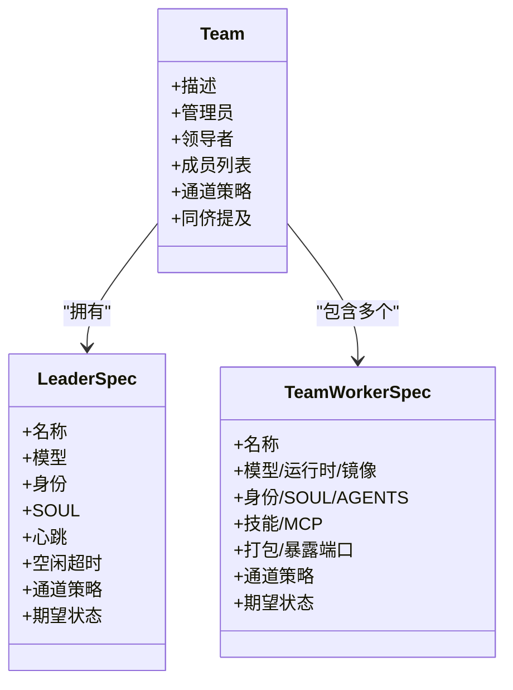
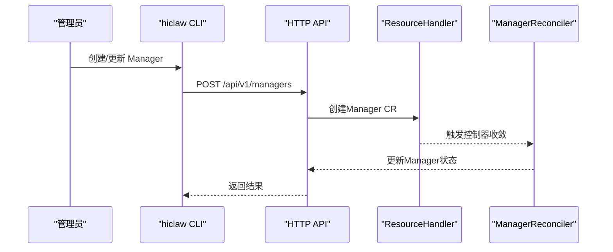
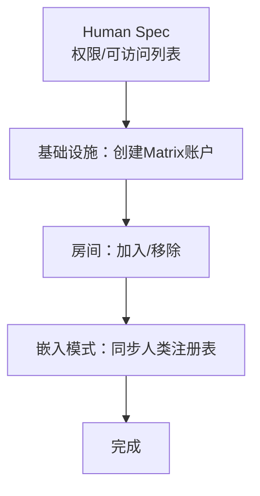
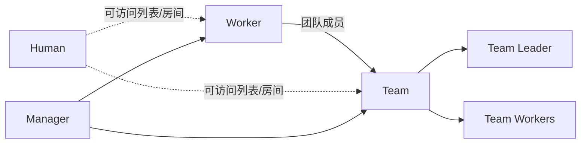

# 智能体管理

<cite>
**本文引用的文件**
- [hiclaw-controller/api/v1beta1/types.go](file://hiclaw-controller/api/v1beta1/types.go)
- [hiclaw-controller/cmd/hiclaw/main.go](file://hiclaw-controller/cmd/hiclaw/main.go)
- [hiclaw-controller/cmd/hiclaw/create.go](file://hiclaw-controller/cmd/hiclaw/create.go)
- [hiclaw-controller/cmd/hiclaw/get.go](file://hiclaw-controller/cmd/hiclaw/get.go)
- [hiclaw-controller/cmd/hiclaw/update.go](file://hiclaw-controller/cmd/hiclaw/update.go)
- [hiclaw-controller/cmd/hiclaw/delete.go](file://hiclaw-controller/cmd/hiclaw/delete.go)
- [hiclaw-controller/cmd/hiclaw/worker_cmd.go](file://hiclaw-controller/cmd/hiclaw/worker_cmd.go)
- [hiclaw-controller/internal/server/resource_handler.go](file://hiclaw-controller/internal/server/resource_handler.go)
- [hiclaw-controller/internal/server/lifecycle_handler.go](file://hiclaw-controller/internal/server/lifecycle_handler.go)
- [hiclaw-controller/internal/controller/worker_controller.go](file://hiclaw-controller/internal/controller/worker_controller.go)
- [hiclaw-controller/internal/controller/team_controller.go](file://hiclaw-controller/internal/controller/team_controller.go)
- [hiclaw-controller/internal/controller/human_controller.go](file://hiclaw-controller/internal/controller/human_controller.go)
- [copaw/src/copaw_worker/cli.py](file://copaw/src/copaw_worker/cli.py)
- [hermes/src/hermes_worker/cli.py](file://hermes/src/hermes_worker/cli.py)
- [manager/agent/team-leader-agent/skills/team-task-management/scripts/manage-team-state.sh](file://manager/agent/team-leader-agent/skills/team-task-management/scripts/manage-team-state.sh)
</cite>

## 目录
1. [简介](#简介)
2. [项目结构](#项目结构)
3. [核心组件](#核心组件)
4. [架构总览](#架构总览)
5. [详细组件分析](#详细组件分析)
6. [依赖分析](#依赖分析)
7. [性能考虑](#性能考虑)
8. [故障排查指南](#故障排查指南)
9. [结论](#结论)
10. [附录：CLI命令与API接口](#附录cli命令与api接口)

## 简介
本文件面向 HiClaw 的智能体管理系统，系统围绕 Worker（工作智能体）、Team（团队）、Manager（协调器）、Human（人类用户）四类核心资源展开，提供从创建、配置、生命周期管理到状态监控的完整能力。同时覆盖 CLI 命令参考与 API 接口说明，并给出实际使用示例与最佳实践建议。

## 项目结构
HiClaw 采用声明式资源模型，通过 CRD 定义 Worker、Team、Manager、Human 的规格与状态；hiclaw-controller 提供控制器与 HTTP API 服务，负责资源的收敛与运行时状态同步；copaw/hermes 等子模块提供不同运行时的 Worker 可执行入口；Manager Agent 提供团队与任务协调能力。

图表来源
- [hiclaw-controller/internal/server/resource_handler.go:22-800](file://hiclaw-controller/internal/server/resource_handler.go#L22-L800)
- [hiclaw-controller/internal/server/lifecycle_handler.go:15-235](file://hiclaw-controller/internal/server/lifecycle_handler.go#L15-L235)
- [hiclaw-controller/internal/controller/worker_controller.go:30-200](file://hiclaw-controller/internal/controller/worker_controller.go#L30-L200)
- [hiclaw-controller/internal/controller/team_controller.go:37-200](file://hiclaw-controller/internal/controller/team_controller.go#L37-L200)
- [hiclaw-controller/internal/controller/human_controller.go:16-103](file://hiclaw-controller/internal/controller/human_controller.go#L16-L103)

章节来源
- [hiclaw-controller/cmd/hiclaw/main.go:9-35](file://hiclaw-controller/cmd/hiclaw/main.go#L9-L35)
- [hiclaw-controller/internal/server/resource_handler.go:22-800](file://hiclaw-controller/internal/server/resource_handler.go#L22-L800)
- [hiclaw-controller/internal/server/lifecycle_handler.go:15-235](file://hiclaw-controller/internal/server/lifecycle_handler.go#L15-L235)

## 核心组件
- Worker：独立或团队成员的 AI 工作智能体，支持多运行时（openclaw、copaw、hermes），可配置模型、镜像、技能、MCP 服务器、暴露端口等，具备 Running/Sleeping/Stopped 生命周期状态。
- Team：由 Team Leader 驱动的协作单元，包含领导者与若干成员，统一管理通信策略、心跳、空闲超时、成员状态汇总与房间。
- Manager：协调器，接收管理员自然语言指令，编排 Worker/Team，提供欢迎提示、版本信息与运行状态。
- Human：真实用户，通过矩阵账户与房间访问进行权限控制，支持可访问团队与工作智能体列表。

章节来源
- [hiclaw-controller/api/v1beta1/types.go:63-146](file://hiclaw-controller/api/v1beta1/types.go#L63-L146)
- [hiclaw-controller/api/v1beta1/types.go:159-325](file://hiclaw-controller/api/v1beta1/types.go#L159-L325)
- [hiclaw-controller/api/v1beta1/types.go:369-447](file://hiclaw-controller/api/v1beta1/types.go#L369-L447)
- [hiclaw-controller/api/v1beta1/types.go:331-363](file://hiclaw-controller/api/v1beta1/types.go#L331-L363)

## 架构总览
HiClaw 以 CRD 为核心数据面，控制器根据 Spec 进行基础设施与容器部署，运行时后端负责 Pod/容器状态采集与控制；API 层提供 HTTP 接口与 CLI，实现资源的声明式管理与生命周期操作；Manager Agent 与 Team Leader 提供任务与项目协调能力。

图表来源
- [hiclaw-controller/internal/server/resource_handler.go:74-332](file://hiclaw-controller/internal/server/resource_handler.go#L74-L332)
- [hiclaw-controller/internal/controller/worker_controller.go:57-151](file://hiclaw-controller/internal/controller/worker_controller.go#L57-L151)
- [hiclaw-controller/internal/controller/team_controller.go:76-106](file://hiclaw-controller/internal/controller/team_controller.go#L76-L106)

## 详细组件分析

### Worker 组件
- 规格字段
  - 模型、运行时、镜像、身份描述、SOUL/AGENTS 内容、内置技能、MCP 服务器、打包包地址、暴露端口、通道策略、期望状态（Running/Sleeping/Stopped）、权限授予条目、Pod 标签等。
- 生命周期
  - 通过控制器将期望状态写入 CR Spec，控制器驱动后端创建/启动/停止/删除容器；CLI 提供唤醒/睡眠/确保就绪/就绪上报/状态查询等操作。
- 状态监控
  - 合并 CR 状态与后端容器状态，Ready 条件在后端 Running 且 Worker 自报就绪时成立。

图表来源
- [hiclaw-controller/internal/server/lifecycle_handler.go:112-160](file://hiclaw-controller/internal/server/lifecycle_handler.go#L112-L160)
- [hiclaw-controller/internal/controller/worker_controller.go:110-151](file://hiclaw-controller/internal/controller/worker_controller.go#L110-L151)

章节来源
- [hiclaw-controller/api/v1beta1/types.go:71-112](file://hiclaw-controller/api/v1beta1/types.go#L71-L112)
- [hiclaw-controller/internal/server/lifecycle_handler.go:34-160](file://hiclaw-controller/internal/server/lifecycle_handler.go#L34-L160)
- [hiclaw-controller/internal/controller/worker_controller.go:110-151](file://hiclaw-controller/internal/controller/worker_controller.go#L110-L151)

### Team 组件
- 角色与成员
  - Team Leader 作为团队协调者，成员包括领导者与若干 Worker；支持统一的通道策略、心跳周期、成员空闲超时。
- 成员管理
  - 控制器直接收敛团队成员（不再创建子 Worker CR），统一处理基础设施、配置、容器与暴露端口；定期清理不在期望中的成员。
- 任务协调
  - Team Leader Agent 提供任务与项目状态管理脚本，维护 team-state.json，支持有限任务与项目的增删查与父子关系标注。

图表来源
- [hiclaw-controller/api/v1beta1/types.go:167-238](file://hiclaw-controller/api/v1beta1/types.go#L167-L238)
- [hiclaw-controller/internal/controller/team_controller.go:108-200](file://hiclaw-controller/internal/controller/team_controller.go#L108-L200)

章节来源
- [hiclaw-controller/api/v1beta1/types.go:167-258](file://hiclaw-controller/api/v1beta1/types.go#L167-L258)
- [hiclaw-controller/internal/controller/team_controller.go:108-200](file://hiclaw-controller/internal/controller/team_controller.go#L108-L200)
- [manager/agent/team-leader-agent/skills/team-task-management/scripts/manage-team-state.sh:1-294](file://manager/agent/team-leader-agent/skills/team-task-management/scripts/manage-team-state.sh#L1-L294)

### Manager 组件
- 配置与启动
  - 支持模型、运行时、镜像、SOUL/AGENTS、内置技能、MCP 服务器、打包包、期望状态与权限授予条目；提供心跳间隔、空闲超时、通知渠道等配置项。
- 协调机制
  - 通过 API 与 CLI 管理 Worker/Team；控制器负责基础设施与容器生命周期；Manager Agent 在首次启动时发送欢迎提示并记录状态。

图表来源
- [hiclaw-controller/internal/server/resource_handler.go:638-682](file://hiclaw-controller/internal/server/resource_handler.go#L638-L682)
- [hiclaw-controller/api/v1beta1/types.go:379-420](file://hiclaw-controller/api/v1beta1/types.go#L379-L420)

章节来源
- [hiclaw-controller/api/v1beta1/types.go:379-447](file://hiclaw-controller/api/v1beta1/types.go#L379-L447)
- [hiclaw-controller/internal/server/resource_handler.go:638-713](file://hiclaw-controller/internal/server/resource_handler.go#L638-L713)

### Human 组件
- 权限与房间
  - 通过 Spec 配置显示名、邮箱、权限等级、可访问团队与工作智能体；控制器负责创建矩阵账户与房间成员关系，嵌入模式下同步人类注册表。
- 访问控制
  - 通过授权中间件与角色上下文限制对资源的操作范围（如团队领导者仅能通过团队接口管理成员）。

图表来源
- [hiclaw-controller/internal/controller/human_controller.go:83-96](file://hiclaw-controller/internal/controller/human_controller.go#L83-L96)
- [hiclaw-controller/internal/server/resource_handler.go:551-585](file://hiclaw-controller/internal/server/resource_handler.go#L551-L585)

章节来源
- [hiclaw-controller/api/v1beta1/types.go:339-355](file://hiclaw-controller/api/v1beta1/types.go#L339-L355)
- [hiclaw-controller/internal/controller/human_controller.go:29-96](file://hiclaw-controller/internal/controller/human_controller.go#L29-L96)

## 依赖分析
- 资源耦合
  - Worker 与 Team：团队成员不再创建子 Worker CR，控制器直接收敛；团队领导者禁止通过独立 Worker API 创建成员。
  - Human 与 Team/Worker：通过可访问列表与房间成员关系实现权限边界。
- 外部依赖
  - 运行时后端（容器/Pod）、Matrix 服务、Higress 网关（暴露端口）、对象存储/网关凭据提供器（权限授予）。

图表来源
- [hiclaw-controller/api/v1beta1/types.go:167-238](file://hiclaw-controller/api/v1beta1/types.go#L167-L238)
- [hiclaw-controller/internal/server/resource_handler.go:85-128](file://hiclaw-controller/internal/server/resource_handler.go#L85-L128)

章节来源
- [hiclaw-controller/internal/server/resource_handler.go:85-128](file://hiclaw-controller/internal/server/resource_handler.go#L85-L128)

## 性能考虑
- 轮询与重试
  - Worker 就绪检测与生命周期操作采用指数退避与重试，避免频繁轮询造成压力。
- 状态合并
  - 控制器在一次收敛中合并多项状态写入，减少状态冲突与重复 Patch。
- 资源标签与作用域
  - 通过控制器实例标签限定缓存范围，避免跨实例资源争用。

## 故障排查指南
- Worker 未就绪
  - 使用状态查询确认 Phase/ContainerState/Message；若后端状态异常，检查后端日志与容器健康；必要时重新报告就绪。
- 生命周期操作失败
  - 唤醒/睡眠/确保就绪失败通常与后端容器状态相关，检查后端错误码与控制器日志。
- 权限与房间问题
  - Human 权限不足或房间未加入，检查可访问列表与矩阵服务状态；嵌入模式下核对人类注册表同步。

章节来源
- [hiclaw-controller/internal/server/lifecycle_handler.go:162-205](file://hiclaw-controller/internal/server/lifecycle_handler.go#L162-L205)
- [hiclaw-controller/internal/controller/human_controller.go:88-96](file://hiclaw-controller/internal/controller/human_controller.go#L88-L96)

## 结论
HiClaw 通过声明式资源与控制器实现了 Worker/Team/Manager/Human 的统一管理，结合 CLI 与 API 提供了从创建到生命周期管理的全链路能力；Team Leader 与 Manager Agent 进一步增强了任务与项目协调效率。建议在生产环境中配合监控与告警，合理设置心跳与空闲超时，并遵循最小权限原则配置 Human 的可访问范围。

## 附录：CLI命令与API接口

### CLI 命令参考
- 根命令
  - hiclaw：根命令，支持环境变量 HICLAW_CONTROLLER_URL、HICLAW_AUTH_TOKEN、HICLAW_AUTH_TOKEN_FILE。
- 资源管理
  - create：创建 Worker/Team/Human/Manager
  - get：查询 Worker/Team/Human/Manager 列表或详情
  - update：更新 Worker/Team/Manager
  - delete：删除 Worker/Team/Human/Manager
- Worker 生命周期
  - worker wake：唤醒睡眠中的 Worker
  - worker sleep：让 Worker 进入睡眠
  - worker ensure-ready：确保 Worker 运行并报告状态
  - worker status：查看 Worker 运行时状态
  - worker report-ready：向控制器报告就绪（可带心跳）

章节来源
- [hiclaw-controller/cmd/hiclaw/main.go:9-35](file://hiclaw-controller/cmd/hiclaw/main.go#L9-L35)
- [hiclaw-controller/cmd/hiclaw/create.go:14-499](file://hiclaw-controller/cmd/hiclaw/create.go#L14-L499)
- [hiclaw-controller/cmd/hiclaw/get.go:11-447](file://hiclaw-controller/cmd/hiclaw/get.go#L11-L447)
- [hiclaw-controller/cmd/hiclaw/update.go:9-215](file://hiclaw-controller/cmd/hiclaw/update.go#L9-L215)
- [hiclaw-controller/cmd/hiclaw/delete.go:9-73](file://hiclaw-controller/cmd/hiclaw/delete.go#L9-L73)
- [hiclaw-controller/cmd/hiclaw/worker_cmd.go:11-299](file://hiclaw-controller/cmd/hiclaw/worker_cmd.go#L11-L299)

### API 接口定义
- 资源管理（ResourceHandler）
  - Worker
    - POST /api/v1/workers：创建独立 Worker（团队成员请使用 /teams/<name>）
    - GET /api/v1/workers：列出所有 Worker（含团队合成视图）
    - GET /api/v1/workers/{name}：获取 Worker（含团队成员合成响应）
    - PUT /api/v1/workers/{name}：更新独立 Worker
    - DELETE /api/v1/workers/{name}：删除独立 Worker
  - Team
    - POST /api/v1/teams：创建 Team
    - GET /api/v1/teams：列出 Team
    - GET /api/v1/teams/{name}：获取 Team
    - PUT /api/v1/teams/{name}：更新 Team
    - DELETE /api/v1/teams/{name}：删除 Team
  - Human
    - POST /api/v1/humans：创建 Human
    - GET /api/v1/humans：列出 Human
    - GET /api/v1/humans/{name}：获取 Human
    - DELETE /api/v1/humans/{name}：删除 Human
  - Manager
    - POST /api/v1/managers：创建 Manager
    - GET /api/v1/managers：列出 Manager
    - GET /api/v1/managers/{name}：获取 Manager
    - PUT /api/v1/managers/{name}：更新 Manager
    - DELETE /api/v1/managers/{name}：删除 Manager

- 生命周期（LifecycleHandler）
  - POST /api/v1/workers/{name}/wake：唤醒 Worker
  - POST /api/v1/workers/{name}/sleep：让 Worker 睡眠
  - POST /api/v1/workers/{name}/ensure-ready：确保 Worker 运行并返回状态
  - GET /api/v1/workers/{name}/status：获取 Worker 运行时状态（合并 CR 与后端）
  - POST /api/v1/workers/{name}/ready：Worker 自报就绪（受中间件鉴权保护）

章节来源
- [hiclaw-controller/internal/server/resource_handler.go:74-797](file://hiclaw-controller/internal/server/resource_handler.go#L74-L797)
- [hiclaw-controller/internal/server/lifecycle_handler.go:34-205](file://hiclaw-controller/internal/server/lifecycle_handler.go#L34-L205)

### 实际使用示例与最佳实践
- 创建 Worker
  - 使用 CLI 指定模型、运行时、技能、暴露端口等；若需 MCP 服务器，请使用 YAML 并通过 apply 管理。
- 创建 Team
  - 指定领导者名称、可选模型、心跳间隔、成员列表；后续通过团队接口管理成员变更。
- 管理 Human 权限
  - 通过 Human Spec 的可访问列表与权限等级控制其可见与交互范围；嵌入模式下注意人类注册表同步。
- Worker 就绪与监控
  - 使用 worker status 查看运行时状态；若后端状态为 Running 且自报就绪则为 Ready；必要时使用 ensure-ready 保证运行态。
- 最佳实践
  - 明确期望状态（Running/Sleeping/Stopped），避免频繁切换；
  - 合理设置心跳与空闲超时，平衡资源占用与响应速度；
  - 为 Worker/Team/Manager 配置最小权限的 AccessEntries；
  - 使用 CLI 的 no-wait 与等待超时参数优化批量操作体验。

章节来源
- [hiclaw-controller/cmd/hiclaw/create.go:29-147](file://hiclaw-controller/cmd/hiclaw/create.go#L29-L147)
- [hiclaw-controller/cmd/hiclaw/get.go:27-92](file://hiclaw-controller/cmd/hiclaw/get.go#L27-L92)
- [hiclaw-controller/cmd/hiclaw/worker_cmd.go:102-133](file://hiclaw-controller/cmd/hiclaw/worker_cmd.go#L102-L133)
- [hiclaw-controller/internal/server/lifecycle_handler.go:162-205](file://hiclaw-controller/internal/server/lifecycle_handler.go#L162-L205)