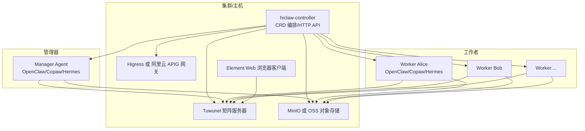
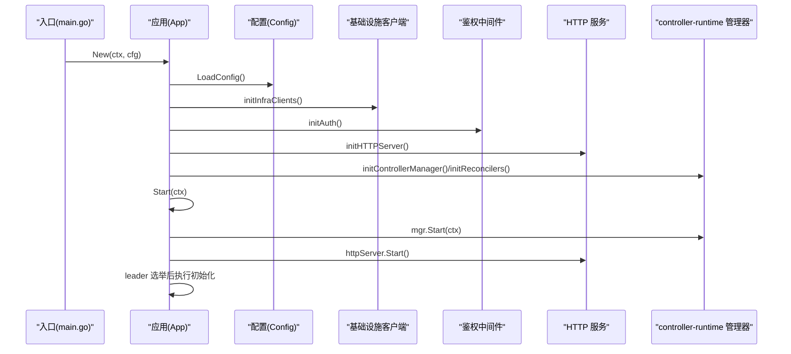
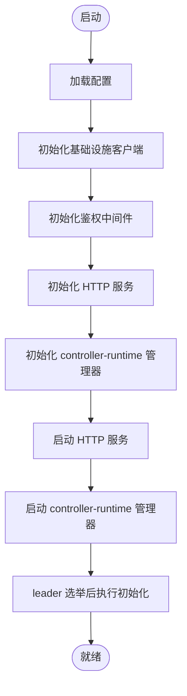
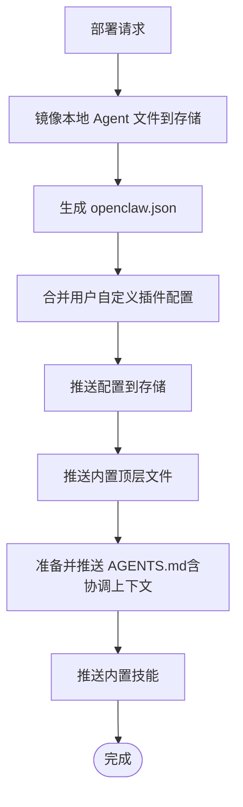
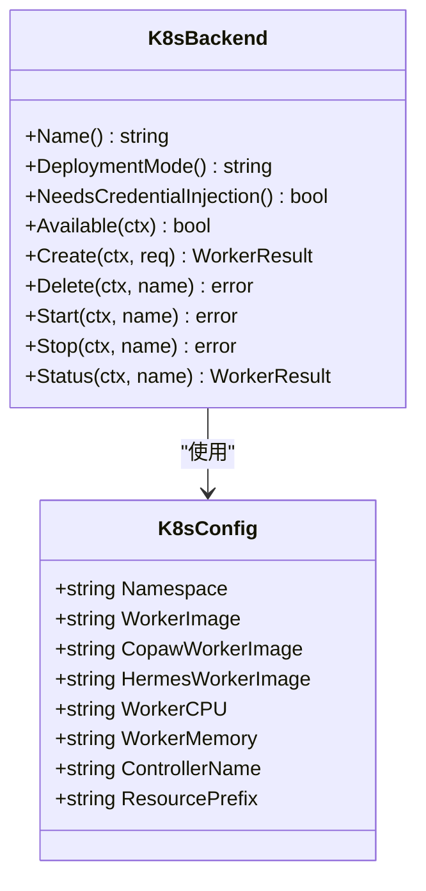
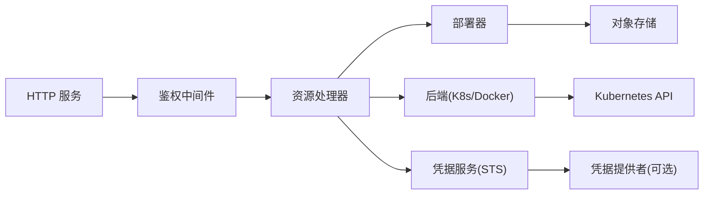

# 最佳实践

<cite>
**本文引用的文件**
- [README.md](file://README.md)
- [hiclaw-controller/cmd/controller/main.go](file://hiclaw-controller/cmd/controller/main.go)
- [hiclaw-controller/internal/app/app.go](file://hiclaw-controller/internal/app/app.go)
- [hiclaw-controller/internal/config/config.go](file://hiclaw-controller/internal/config/config.go)
- [hiclaw-controller/internal/auth/middleware.go](file://hiclaw-controller/internal/auth/middleware.go)
- [hiclaw-controller/internal/server/http.go](file://hiclaw-controller/internal/server/http.go)
- [hiclaw-controller/internal/service/deployer.go](file://hiclaw-controller/internal/service/deployer.go)
- [hiclaw-controller/internal/backend/kubernetes.go](file://hiclaw-controller/internal/backend/kubernetes.go)
- [hiclaw-controller/config/crd/workers.hiclaw.io.yaml](file://hiclaw-controller/config/crd/workers.hiclaw.io.yaml)
- [hiclaw-controller/config/crd/managers.hiclaw.io.yaml](file://hiclaw-controller/config/crd/managers.hiclaw.io.yaml)
- [hiclaw-controller/config/crd/humans.hiclaw.io.yaml](file://hiclaw-controller/config/crd/humans.hiclaw.io.yaml)
- [helm/hiclaw/values.yaml](file://helm/hiclaw/values.yaml)
- [manager/README.md](file://manager/README.md)
- [worker/README.md](file://worker/README.md)
- [copaw/README.md](file://copaw/README.md)
- [hermes/README.md](file://hermes/README.md)
- [scripts/export-debug-log.py](file://scripts/export-debug-log.py)
</cite>

## 目录
1. [简介](#简介)
2. [项目结构](#项目结构)
3. [核心组件](#核心组件)
4. [架构总览](#架构总览)
5. [详细组件分析](#详细组件分析)
6. [依赖关系分析](#依赖关系分析)
7. [性能考虑](#性能考虑)
8. [故障排查指南](#故障排查指南)
9. [结论](#结论)
10. [附录](#附录)

## 简介
本最佳实践指南面向 HiClaw 在生产环境的部署与使用，围绕以下目标展开：  
- 明确生产部署的配置要求、安全设置与性能优化路径  
- 提供可落地的资源分配、缓存策略与并发控制建议  
- 总结安全配置最佳实践（网络隔离、访问控制、凭据管理、数据加密）  
- 基于官方文档与代码实现，给出成功案例与经验总结  
- 规范团队协作工作流与规范  
- 指导成本优化与资源利用率提升  
- 给出监控告警与运维自动化的最佳实践  

## 项目结构
HiClaw 采用“控制器 + 多运行时 Worker”的分布式架构，核心由控制器（hiclaw-controller）、网关（Higress 或阿里云 API 网关）、矩阵服务（Tuwunel）、对象存储（MinIO 或 OSS）与多运行时 Worker（OpenClaw/Copaw/Hermes）组成。  
- 控制器负责 CRD 资源编排、基础设施客户端初始化、鉴权中间件、HTTP API、部署器与后端（Kubernetes/Docker）  
- Helm Chart 提供一键安装与参数化配置，覆盖网关、存储、矩阵、控制器、管理器与元素 Web 客户端  
- 管理器与 Worker 通过共享对象存储进行无状态协作，支持多运行时共存与任务编排



图示来源
- [hiclaw-controller/internal/app/app.go:111-175](file://hiclaw-controller/internal/app/app.go#L111-L175)
- [hiclaw-controller/internal/server/http.go:30-112](file://hiclaw-controller/internal/server/http.go#L30-L112)
- [hiclaw-controller/internal/backend/kubernetes.go:151-313](file://hiclaw-controller/internal/backend/kubernetes.go#L151-L313)
- [helm/hiclaw/values.yaml:55-111](file://helm/hiclaw/values.yaml#L55-L111)

章节来源
- [README.md:305-333](file://README.md#L305-L333)
- [hiclaw-controller/internal/app/app.go:111-175](file://hiclaw-controller/internal/app/app.go#L111-L175)
- [hiclaw-controller/internal/server/http.go:30-112](file://hiclaw-controller/internal/server/http.go#L30-L112)
- [hiclaw-controller/internal/backend/kubernetes.go:151-313](file://hiclaw-controller/internal/backend/kubernetes.go#L151-L313)
- [helm/hiclaw/values.yaml:55-111](file://helm/hiclaw/values.yaml#L55-L111)

## 核心组件
- 控制器（hiclaw-controller）  
  - 初始化基础设施客户端（矩阵、网关、对象存储），构建鉴权中间件与 HTTP 服务，注册 CRD 控制器与字段索引，启动嵌入式或集群模式的 controller-runtime 管理器  
  - 提供统一 REST API，支持资源 CRUD、生命周期控制、凭据发放、Docker API 透传（嵌入式模式）等  
- 管理器（Manager Agent）  
  - 支持 OpenClaw/Copaw/Hermes 运行时，负责任务编排、房间管理、凭据注入、欢迎消息与心跳检查  
- 工作者（Worker Agent）  
  - 无状态容器，通过共享对象存储同步配置与技能，支持多运行时共存  
- 网关（Higress/阿里云 APIG）  
  - 统一流量入口与消费者鉴权，屏蔽真实密钥暴露  
- 矩阵（Tuwunel）  
  - 自建 Matrix 协议服务，支持端到端加密、提及策略与自由响应房间  
- 对象存储（MinIO/OSS）  
  - 中央化文件系统，支撑跨 Agent 的信息交换与状态持久化  

章节来源
- [hiclaw-controller/cmd/controller/main.go:16-36](file://hiclaw-controller/cmd/controller/main.go#L16-L36)
- [hiclaw-controller/internal/app/app.go:81-108](file://hiclaw-controller/internal/app/app.go#L81-L108)
- [hiclaw-controller/internal/server/http.go:30-112](file://hiclaw-controller/internal/server/http.go#L30-L112)
- [manager/README.md:1-94](file://manager/README.md#L1-L94)
- [worker/README.md:1-63](file://worker/README.md#L1-L63)
- [README.md:268-298](file://README.md#L268-L298)

## 架构总览
下图展示控制器如何在启动阶段完成依赖装配、鉴权链路与服务层初始化，并在集群模式下通过 leader 选举与命名空间缓存隔离，确保多实例互不干扰。



图示来源
- [hiclaw-controller/cmd/controller/main.go:16-36](file://hiclaw-controller/cmd/controller/main.go#L16-L36)
- [hiclaw-controller/internal/app/app.go:81-175](file://hiclaw-controller/internal/app/app.go#L81-L175)

章节来源
- [hiclaw-controller/cmd/controller/main.go:16-36](file://hiclaw-controller/cmd/controller/main.go#L16-L36)
- [hiclaw-controller/internal/app/app.go:81-175](file://hiclaw-controller/internal/app/app.go#L81-L175)

## 详细组件分析

### 控制器与 HTTP API
- 启动流程：加载配置、初始化基础设施、鉴权中间件、HTTP 服务、controller-runtime 管理器与控制器，随后启动 HTTP 服务与管理器  
- 鉴权中间件：支持基于 Kubernetes ServiceAccount Token 的身份认证与授权，解析请求中的 Bearer Token，结合资源名称解析团队归属，执行权限矩阵校验  
- HTTP API：提供健康检查、版本查询、资源 CRUD、生命周期控制、网关消费者管理、凭据发放、Docker API 透传（嵌入式模式）



图示来源
- [hiclaw-controller/internal/app/app.go:81-175](file://hiclaw-controller/internal/app/app.go#L81-L175)
- [hiclaw-controller/internal/auth/middleware.go:31-118](file://hiclaw-controller/internal/auth/middleware.go#L31-L118)
- [hiclaw-controller/internal/server/http.go:30-112](file://hiclaw-controller/internal/server/http.go#L30-L112)

章节来源
- [hiclaw-controller/internal/app/app.go:81-175](file://hiclaw-controller/internal/app/app.go#L81-L175)
- [hiclaw-controller/internal/auth/middleware.go:31-118](file://hiclaw-controller/internal/auth/middleware.go#L31-L118)
- [hiclaw-controller/internal/server/http.go:30-112](file://hiclaw-controller/internal/server/http.go#L30-L112)

### 部署器（Deployer）
- 职责：将 Worker/Manager 的配置写入对象存储（openclaw.json、SOUL.md、AGENTS.md、技能目录、mcporter 配置等），并处理内置文件与协调上下文注入  
- 关键流程：本地文件镜像到存储（排除特定文件以避免竞态）、生成配置、合并用户自定义插件配置、推送内置技能与顶层文件、清理删除 Worker 的存储数据  
- 团队协调：为团队领导者注入房间 ID、心跳周期、空闲超时、成员列表与管理员 ID，并渲染模板化 SOUL.md



图示来源
- [hiclaw-controller/internal/service/deployer.go:135-258](file://hiclaw-controller/internal/service/deployer.go#L135-L258)
- [hiclaw-controller/internal/service/deployer.go:260-294](file://hiclaw-controller/internal/service/deployer.go#L260-L294)

章节来源
- [hiclaw-controller/internal/service/deployer.go:135-258](file://hiclaw-controller/internal/service/deployer.go#L135-L258)
- [hiclaw-controller/internal/service/deployer.go:260-294](file://hiclaw-controller/internal/service/deployer.go#L260-L294)

### Kubernetes 后端（K8sBackend）
- 职责：在 Kubernetes 上创建/删除/启动/停止 Worker Pod，注入 SA 令牌、资源限制、标签与 Pod 模板覆盖，支持按需合并资源覆盖与默认值  
- 特性：支持从 Pod 模板 ConfigMap 叠加 Agent Pod 规格；通过 OwnerReference 将 CR 与 Pod 关联；检测命名空间与 kubeconfig；默认资源与 CPU/内存限制可配置



图示来源
- [hiclaw-controller/internal/backend/kubernetes.go:23-145](file://hiclaw-controller/internal/backend/kubernetes.go#L23-L145)
- [hiclaw-controller/internal/backend/kubernetes.go:151-313](file://hiclaw-controller/internal/backend/kubernetes.go#L151-L313)

章节来源
- [hiclaw-controller/internal/backend/kubernetes.go:23-145](file://hiclaw-controller/internal/backend/kubernetes.go#L23-L145)
- [hiclaw-controller/internal/backend/kubernetes.go:151-313](file://hiclaw-controller/internal/backend/kubernetes.go#L151-L313)

### CRD 与资源模型
- Worker：支持指定模型、运行时、镜像、身份/灵魂/行为规则、内置技能、MCP 服务器、暴露端口、通信策略、生命周期状态、标签与访问条目  
- Manager：支持模型、运行时、镜像、自定义 SOUL/AGENTS、启用技能、MCP 服务器、生命周期状态、标签与访问条目  
- Human：支持显示名、邮箱、权限等级、可访问团队/Worker、房间列表与初始密码等

```mermaid
erDiagram
WORKER {
string spec.model
string spec.runtime
string spec.image
string spec.identity
string spec.soul
string spec.agents
array spec.skills
array spec.mcpServers
array spec.expose
object spec.channelPolicy
string spec.state
object spec.labels
array spec.accessEntries
string status.phase
string status.message
}
MANAGER {
string spec.model
string spec.runtime
string spec.image
string spec.soul
string spec.agents
array spec.skills
array spec.mcpServers
string spec.state
object spec.config
object spec.labels
array spec.accessEntries
string status.phase
string status.message
}
HUMAN {
string spec.displayName
string spec.email
int spec.permissionLevel
array spec.accessibleTeams
array spec.accessibleWorkers
string status.phase
string status.message
}
```

图示来源
- [hiclaw-controller/config/crd/workers.hiclaw.io.yaml:15-152](file://hiclaw-controller/config/crd/workers.hiclaw.io.yaml#L15-L152)
- [hiclaw-controller/config/crd/managers.hiclaw.io.yaml:15-149](file://hiclaw-controller/config/crd/managers.hiclaw.io.yaml#L15-L149)
- [hiclaw-controller/config/crd/humans.hiclaw.io.yaml:15-59](file://hiclaw-controller/config/crd/humans.hiclaw.io.yaml#L15-L59)

章节来源
- [hiclaw-controller/config/crd/workers.hiclaw.io.yaml:15-152](file://hiclaw-controller/config/crd/workers.hiclaw.io.yaml#L15-L152)
- [hiclaw-controller/config/crd/managers.hiclaw.io.yaml:15-149](file://hiclaw-controller/config/crd/managers.hiclaw.io.yaml#L15-L149)
- [hiclaw-controller/config/crd/humans.hiclaw.io.yaml:15-59](file://hiclaw-controller/config/crd/humans.hiclaw.io.yaml#L15-L59)

### 配置与部署要点（Helm）
- 网关：支持 Higress 自管或阿里云 APIG 外部模式，需提供公共 URL 与必要参数（区域、网关 ID、模型 API ID、环境 ID）  
- 存储：支持 MinIO 内置或 OSS 外部模式，外部 OSS 需要凭据提供者侧车配合  
- 控制器：可配置副本数（HA 需要 leader 选举）、资源配额、工作后端（k8s/sae）、资源前缀、时区、语言  
- 管理器：可启用自动创建 Manager CR、指定模型与运行时、资源配额  
- Worker 默认：可配置各运行时镜像仓库与标签、默认运行时与资源配额  
- 元素 Web：可选启用，提供浏览器端 IM 客户端

章节来源
- [helm/hiclaw/values.yaml:55-111](file://helm/hiclaw/values.yaml#L55-L111)
- [helm/hiclaw/values.yaml:166-263](file://helm/hiclaw/values.yaml#L166-L263)

### 运行时与容器
- 管理器容器：包含网关、矩阵、MinIO、元素 Web 与管理器 Agent，支持两种运行时模式（OpenClaw/Copaw）  
- Worker 容器：无状态，通过 MinIO 同步配置与技能，支持 OpenClaw/Copaw/Hermes 运行时  
- Copaw/Hermes Worker：提供独立包与适配器，桥接 openclaw.json 到各自运行时配置，保持矩阵策略一致性

章节来源
- [manager/README.md:1-94](file://manager/README.md#L1-L94)
- [worker/README.md:1-63](file://worker/README.md#L1-L63)
- [copaw/README.md:1-18](file://copaw/README.md#L1-L18)
- [hermes/README.md:1-82](file://hermes/README.md#L1-L82)

## 依赖关系分析
- 控制器依赖：Kubernetes API、矩阵服务、网关、对象存储、凭据提供者（可选）  
- 鉴权链路：TokenReview 认证 + 身份增强 + 授权矩阵，结合资源名称解析团队归属  
- HTTP API 与控制器职责解耦：HTTP 层仅负责路由与鉴权，业务逻辑下沉至服务层（部署器、后端、凭证服务）  
- 多实例隔离：通过命名空间缓存选择器与 leader 选举租约，避免跨实例互相影响



图示来源
- [hiclaw-controller/internal/server/http.go:30-112](file://hiclaw-controller/internal/server/http.go#L30-L112)
- [hiclaw-controller/internal/auth/middleware.go:31-118](file://hiclaw-controller/internal/auth/middleware.go#L31-L118)
- [hiclaw-controller/internal/service/deployer.go:86-96](file://hiclaw-controller/internal/service/deployer.go#L86-L96)
- [hiclaw-controller/internal/backend/kubernetes.go:94-131](file://hiclaw-controller/internal/backend/kubernetes.go#L94-L131)

章节来源
- [hiclaw-controller/internal/server/http.go:30-112](file://hiclaw-controller/internal/server/http.go#L30-L112)
- [hiclaw-controller/internal/auth/middleware.go:31-118](file://hiclaw-controller/internal/auth/middleware.go#L31-L118)
- [hiclaw-controller/internal/service/deployer.go:86-96](file://hiclaw-controller/internal/service/deployer.go#L86-L96)
- [hiclaw-controller/internal/backend/kubernetes.go:94-131](file://hiclaw-controller/internal/backend/kubernetes.go#L94-L131)

## 性能考虑
- 资源分配  
  - Worker 默认 CPU/内存上限与请求可在 Helm 值中调整；建议根据运行时与任务类型分层配置（Copaw/Hermes 更偏向计算密集型）  
  - 控制器与管理器资源应满足 CRD 管理与对象存储同步开销  
- 并发与调度  
  - 使用 Kubernetes 后端时，合理设置副本数与节点亲和/反亲和，避免热点 Worker 集中  
  - 通过资源前缀与命名空间隔离，减少事件风暴对控制器的影响  
- 缓存与同步  
  - 对象存储作为中央缓存，避免重复下载与构建；注意镜像同步的排除策略，防止竞态覆盖  
- 网络与网关  
  - 网关消费者绑定与路由配置应尽量复用，减少动态变更频率  
- 日志与可观测性  
  - 启用 CMS/OTLP 导出（如需要）以降低日志检索成本，但注意带宽与存储开销

章节来源
- [helm/hiclaw/values.yaml:243-263](file://helm/hiclaw/values.yaml#L243-L263)
- [hiclaw-controller/internal/backend/kubernetes.go:386-429](file://hiclaw-controller/internal/backend/kubernetes.go#L386-L429)
- [hiclaw-controller/internal/service/deployer.go:156-159](file://hiclaw-controller/internal/service/deployer.go#L156-L159)

## 故障排查指南
- 日志导出  
  - 使用调试脚本导出矩阵消息与代理会话日志，便于交叉比对代码库定位问题  
- 常见问题  
  - MinIO 端口误配：S3/MinIO API 端口为 9000，非网关 8080；控制器已内置修正逻辑  
  - 权限不足：确认鉴权中间件是否启用、Token 是否有效、资源名称解析是否正确  
  - 资源冲突：K8sBackend 在创建前检查 Pod 是否已存在，避免重复创建  
- 建议流程  
  - 采集日志 → 分析错误码与堆栈 → 核对配置与网络连通性 → 检查控制器与后端状态 → 必要时回滚版本或降级运行时

章节来源
- [scripts/export-debug-log.py](file://scripts/export-debug-log.py)
- [hiclaw-controller/internal/config/config.go:546-563](file://hiclaw-controller/internal/config/config.go#L546-L563)
- [hiclaw-controller/internal/auth/middleware.go:137-156](file://hiclaw-controller/internal/auth/middleware.go#L137-L156)
- [hiclaw-controller/internal/backend/kubernetes.go:164-168](file://hiclaw-controller/internal/backend/kubernetes.go#L164-L168)

## 结论
HiClaw 在生产环境中具备高内聚、低耦合的控制器架构与可插拔的运行时生态。通过 Helm 参数化部署、严格的凭据与访问控制、对象存储中心化与 Kubernetes 后端的弹性调度，可实现稳定、可观测且易于扩展的多智能体协作平台。建议在上线前完成资源规划、安全基线与自动化运维流程的落地，持续迭代以获得更优的成本与性能表现。

## 附录

### 生产部署清单（配置要求）
- 基础设施  
  - Kubernetes 集群版本与存储类可用  
  - 网络连通性：Element Web → 网关；控制器 → 矩阵/对象存储  
- Helm 参数  
  - 网关 provider/mode/publicURL；存储 provider/mode/bucket；控制器副本数与资源；管理器启用与资源；Worker 默认镜像与资源  
- 凭据与密钥  
  - 管理员账号、LLM API Key、矩阵注册令牌、对象存储访问密钥（外部 OSS 需要凭据提供者）  
- 运行时选择  
  - 根据场景选择 Manager 与 Worker 运行时（OpenClaw/Copaw/Hermes），并评估资源占用与功能匹配度

章节来源
- [helm/hiclaw/values.yaml:16-263](file://helm/hiclaw/values.yaml#L16-L263)
- [hiclaw-controller/internal/config/config.go:207-356](file://hiclaw-controller/internal/config/config.go#L207-L356)

### 安全最佳实践
- 网络隔离  
  - 将控制器与对象存储置于受控命名空间，使用网络策略限制入站/出站  
  - 网关仅暴露必要端口，内部服务通过 ClusterIP/命名空间访问  
- 访问控制  
  - 启用鉴权中间件，严格校验资源操作权限；为不同角色设置最小权限  
  - 使用资源前缀与命名空间隔离，避免跨实例资源互相影响  
- 数据加密  
  - 矩阵端到端加密开启；对象存储传输与静态加密策略一致  
- 凭据管理  
  - 管理器仅持有消费级令牌；真实密钥由网关统一管理；定期轮换令牌与密钥

章节来源
- [hiclaw-controller/internal/auth/middleware.go:31-118](file://hiclaw-controller/internal/auth/middleware.go#L31-L118)
- [hiclaw-controller/internal/backend/kubernetes.go:234-257](file://hiclaw-controller/internal/backend/kubernetes.go#L234-L257)
- [hiclaw-controller/internal/config/config.go:236-245](file://hiclaw-controller/internal/config/config.go#L236-L245)

### 成功案例与经验总结
- 多运行时协同：在相同房间内混合使用 Deterministic（OpenClaw/QwenPaw）与自主编码（Hermes）运行时，发挥各自优势  
- 企业级 MCP 管理：集中管理 MCP 服务器，通过 mcporter 注入 Authorization，避免密钥泄露  
- 无状态 Worker：通过对象存储实现 Worker 的快速创建/销毁与状态迁移，降低运维复杂度  
- 本地开发到生产的平滑过渡：Helm Chart 提供一致的参数化部署体验，便于 CI/CD 集成

章节来源
- [README.md:290-304](file://README.md#L290-L304)
- [hiclaw-controller/internal/service/deployer.go:223-233](file://hiclaw-controller/internal/service/deployer.go#L223-L233)

### 团队协作工作流与规范
- 资源声明式：通过 Worker/Team/Human CRD 描述团队与成员，统一由控制器编排  
- 权限分级：Human 权限等级与可访问范围清晰划分，避免越权操作  
- 配置治理：通过对象存储集中管理 openclaw.json、SOUL/AGENTS.md 与技能，避免散落配置  
- 变更流程：先在测试环境验证 CR 变更与资源更新，再在生产灰度发布

章节来源
- [hiclaw-controller/config/crd/workers.hiclaw.io.yaml:15-152](file://hiclaw-controller/config/crd/workers.hiclaw.io.yaml#L15-L152)
- [hiclaw-controller/config/crd/managers.hiclaw.io.yaml:15-149](file://hiclaw-controller/config/crd/managers.hiclaw.io.yaml#L15-L149)
- [hiclaw-controller/config/crd/humans.hiclaw.io.yaml:15-59](file://hiclaw-controller/config/crd/humans.hiclaw.io.yaml#L15-L59)

### 成本优化与资源利用
- 镜像与仓库：根据地域选择就近镜像仓库，减少拉取延迟与带宽消耗  
- 资源配额：按运行时与任务类型差异化配置 CPU/内存，避免过度预留  
- 生命周期：合理设置 Worker 空闲休眠与心跳周期，降低闲置资源占用  
- 存储：外部 OSS 与凭据提供者配合，避免在控制器侧维护密钥，降低运维成本

章节来源
- [helm/hiclaw/values.yaml:193-212](file://helm/hiclaw/values.yaml#L193-L212)
- [hiclaw-controller/internal/config/config.go:252-258](file://hiclaw-controller/internal/config/config.go#L252-L258)

### 监控告警与运维自动化
- 健康检查：使用 /healthz 与 /api/v1/version 快速判断控制器状态  
- 日志与追踪：启用 CMS/OTLP 导出（如需要），并结合调试脚本输出定位问题  
- 自动化：通过 Helm 升级与控制器 HTTP API 实现资源的自动化创建/更新/删除  
- 告警：基于控制器日志与对象存储同步状态设置告警阈值（失败率、延迟、容量）

章节来源
- [hiclaw-controller/internal/server/http.go:42-48](file://hiclaw-controller/internal/server/http.go#L42-L48)
- [scripts/export-debug-log.py](file://scripts/export-debug-log.py)