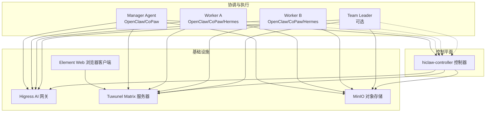
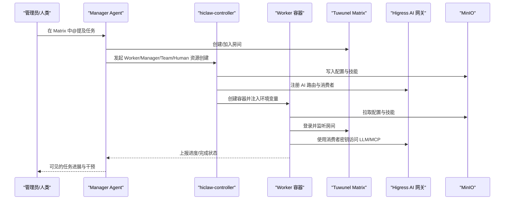
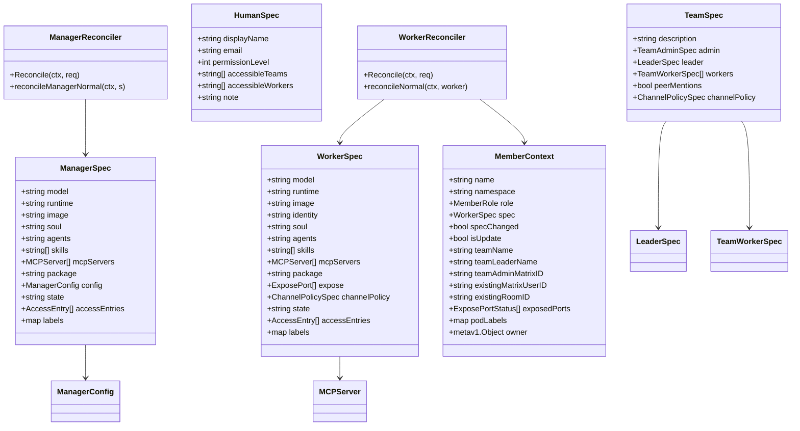
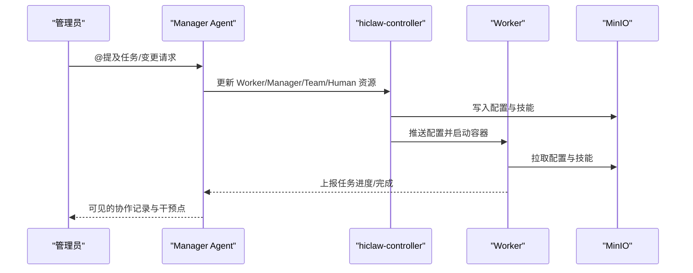
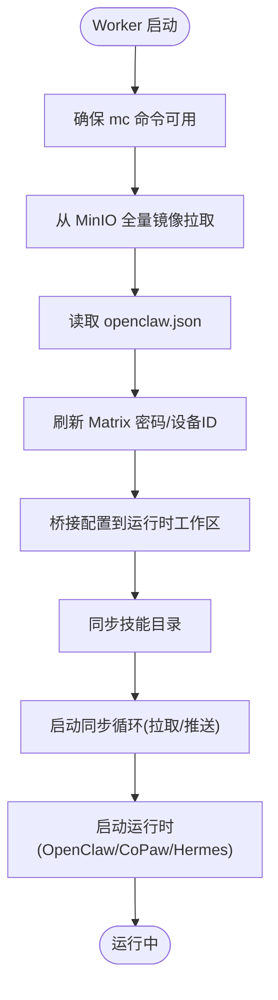
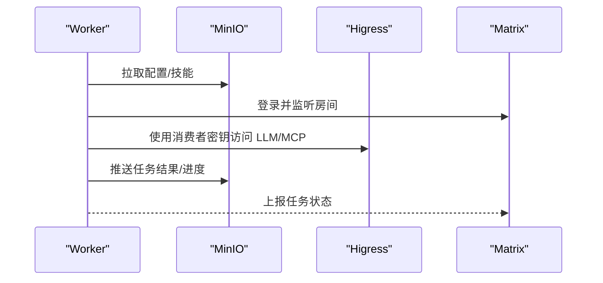
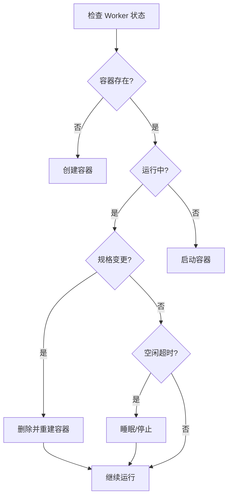
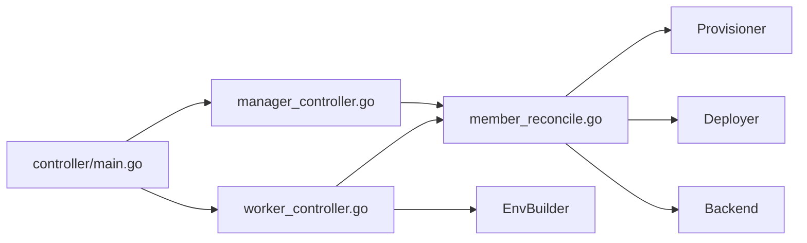

# 管理员-工作者架构

<cite>
**本文档引用的文件**
- [README.md](file://README.md)
- [docs/architecture.md](file://docs/architecture.md)
- [docs/manager-guide.md](file://docs/manager-guide.md)
- [docs/worker-guide.md](file://docs/worker-guide.md)
- [hiclaw-controller/api/v1beta1/types.go](file://hiclaw-controller/api/v1beta1/types.go)
- [hiclaw-controller/internal/controller/manager_controller.go](file://hiclaw-controller/internal/controller/manager_controller.go)
- [hiclaw-controller/internal/controller/worker_controller.go](file://hiclaw-controller/internal/controller/worker_controller.go)
- [hiclaw-controller/internal/controller/member_reconcile.go](file://hiclaw-controller/internal/controller/member_reconcile.go)
- [hiclaw-controller/cmd/controller/main.go](file://hiclaw-controller/cmd/controller/main.go)
- [manager/configs/manager-openclaw.json.tmpl](file://manager/configs/manager-openclaw.json.tmpl)
- [manager/agent/worker-agent/AGENTS.md](file://manager/agent/worker-agent/AGENTS.md)
- [manager/agent/copaw-manager-agent/AGENTS.md](file://manager/agent/copaw-manager-agent/AGENTS.md)
- [copaw/src/copaw_worker/worker.py](file://copaw/src/copaw_worker/worker.py)
- [hermes/src/hermes_worker/worker.py](file://hermes/src/hermes_worker/worker.py)
- [copaw/src/copaw_worker/templates/config.json](file://copaw/src/copaw_worker/templates/config.json)
</cite>

## 目录
1. [简介](#简介)
2. [项目结构](#项目结构)
3. [核心组件](#核心组件)
4. [架构总览](#架构总览)
5. [详细组件分析](#详细组件分析)
6. [依赖关系分析](#依赖关系分析)
7. [性能考量](#性能考量)
8. [故障排查指南](#故障排查指南)
9. [结论](#结论)
10. [附录](#附录)

## 简介
HiClaw 采用 Manager-Workers 架构，通过一个中心化的 Manager 协调多个 Worker，实现人类与 AI Agent 的协作、跨 Agent 的任务编排以及企业级的安全与可观测性。该架构将 Agent 的运行时与基础设施解耦：Manager 负责协调与策略，Worker 负责具体任务执行；两者均以轻量容器形式部署，配合共享存储（MinIO）实现无状态与可替换性。

- **Manager 作为协调器**：负责任务分配、房间管理、MCP 服务器授权、AI 网关路由、心跳检查与状态聚合，并通过 Matrix 与人类和 Worker 实现可见、可干预的协作。
- **Worker 作为任务执行者**：每个 Worker 是独立的轻量容器，连接到 Matrix 获取任务，从 MinIO 同步配置与技能，使用 AI 网关访问 LLM，支持多运行时（OpenClaw、CoPaw、Hermes）。

该架构通过声明式资源（Worker/Manager/Team/Human CRD）、控制器（hiclaw-controller）与共享基础设施（Higress、Tuwunel、MinIO）实现高可用与可扩展性：Worker 可按需创建与销毁，Manager 通过控制器统一管理生命周期与权限，矩阵房间保证人类在环与审计透明。

**章节来源**
- [README.md:13-18](file://README.md#L13-L18)
- [docs/architecture.md:1-235](file://docs/architecture.md#L1-L235)

## 项目结构
HiClaw 仓库围绕 Manager-Workers 架构组织，关键模块包括：
- **hiclaw-controller**：Kubernetes 控制器，负责 Worker/Manager/Team/Human 的声明式管理与生命周期收敛。
- **Manager 容器**：包含 Manager Agent（OpenClaw/CoPaw），负责协调与策略。
- **Worker 容器**：包含多种运行时（OpenClaw、CoPaw、Hermes），负责任务执行。
- **共享基础设施**：Higress（AI 网关）、Tuwunel（Matrix 服务器）、MinIO（对象存储）、Element Web（浏览器客户端）。

**图表来源**
- [docs/architecture.md:23-82](file://docs/architecture.md#L23-L82)

**章节来源**
- [docs/architecture.md:7-116](file://docs/architecture.md#L7-L116)

## 核心组件
- **hiclaw-controller**：基于 Kubernetes CRD 的控制器，负责 Worker/Manager/Team/Human 的声明式管理，提供基础设施准备、配置推送、容器生命周期管理与 MCP 端口暴露。
- **Manager**：协调 Agent 团队，维护房间、授权、心跳与任务状态，支持 OpenClaw 与 CoPaw 运行时。
- **Worker**：任务执行容器，支持 OpenClaw、CoPaw、Hermes 运行时，通过 MinIO 同步配置与技能，通过 Matrix 接收任务。
- **共享基础设施**：Higress 提供 AI 网关与 MCP 路由；Tuwunel 提供 Matrix 服务；MinIO 提供共享存储；Element Web 提供浏览器客户端。

**章节来源**
- [hiclaw-controller/cmd/controller/main.go:16-36](file://hiclaw-controller/cmd/controller/main.go#L16-L36)
- [docs/architecture.md:10-16](file://docs/architecture.md#L10-L16)

## 架构总览
Manager-Workers 架构通过以下机制实现高可用与可扩展：
- **声明式资源与控制器**：Worker/Manager/Team/Human 通过 CRD 声明，控制器自动收敛至期望状态，支持多后端（Kubernetes/Docker）。
- **共享存储与无状态 Worker**：Worker 配置与技能存放在 MinIO，容器重启或替换不影响工作进度，提升弹性与可维护性。
- **矩阵房间与人类在环**：所有协作在 Matrix 房间内进行，人类可随时介入与审计，保障透明度与可控性。
- **AI 网关与凭证隔离**：Worker 仅持有消费者密钥，真实凭证由网关管理，降低泄露风险。

**图表来源**
- [docs/architecture.md:119-137](file://docs/architecture.md#L119-L137)
- [hiclaw-controller/internal/controller/member_reconcile.go:142-192](file://hiclaw-controller/internal/controller/member_reconcile.go#L142-L192)

**章节来源**
- [docs/architecture.md:119-162](file://docs/architecture.md#L119-L162)

## 详细组件分析

### 控制器与资源模型
hiclaw-controller 通过 CRD 定义资源模型，支持 Worker、Manager、Team、Human 的声明式管理。控制器负责：
- 基础设施准备：Matrix 用户、Higress 消费者、MinIO 凭证与房间。
- 配置推送：将 openclaw.json、AGENTS.md、技能等写入 MinIO 并同步到 Worker。
- 容器生命周期：根据 desired state（Running/Sleeping/Stopped）创建/停止/删除容器。
- MCP 端口暴露：为 Worker 暴露 HTTP/gRPC 端口并通过 Higress 路由。

**图表来源**
- [hiclaw-controller/api/v1beta1/types.go:63-447](file://hiclaw-controller/api/v1beta1/types.go#L63-L447)
- [hiclaw-controller/internal/controller/manager_controller.go:31-62](file://hiclaw-controller/internal/controller/manager_controller.go#L31-L62)
- [hiclaw-controller/internal/controller/worker_controller.go:30-55](file://hiclaw-controller/internal/controller/worker_controller.go#L30-L55)
- [hiclaw-controller/internal/controller/member_reconcile.go:30-98](file://hiclaw-controller/internal/controller/member_reconcile.go#L30-L98)

**章节来源**
- [hiclaw-controller/api/v1beta1/types.go:63-447](file://hiclaw-controller/api/v1beta1/types.go#L63-L447)
- [hiclaw-controller/internal/controller/manager_controller.go:72-160](file://hiclaw-controller/internal/controller/manager_controller.go#L72-L160)
- [hiclaw-controller/internal/controller/worker_controller.go:57-151](file://hiclaw-controller/internal/controller/worker_controller.go#L57-L151)
- [hiclaw-controller/internal/controller/member_reconcile.go:142-258](file://hiclaw-controller/internal/controller/member_reconcile.go#L142-L258)

### Manager 作为协调器
Manager 的职责包括：
- **房间与沟通**：为管理员、团队与 Worker 维护 Matrix 房间，确保人类在环与可见性。
- **任务与状态管理**：接收任务指令，分配给合适的 Worker，跟踪进度并在房间中汇报。
- **配置与授权**：生成并推送 openclaw.json、AGENTS.md、技能到 MinIO，为 Worker 授权 AI 路由与 MCP 服务器。
- **心跳与监控**：定期扫描任务状态，评估容量与待办，必要时提醒管理员决策。

**图表来源**
- [docs/manager-guide.md:107-177](file://docs/manager-guide.md#L107-L177)
- [manager/configs/manager-openclaw.json.tmpl:19-44](file://manager/configs/manager-openclaw.json.tmpl#L19-L44)

**章节来源**
- [docs/manager-guide.md:9-50](file://docs/manager-guide.md#L9-L50)
- [manager/configs/manager-openclaw.json.tmpl:19-144](file://manager/configs/manager-openclaw.json.tmpl#L19-L144)

### Worker 作为任务执行者
Worker 的设计强调无状态与弹性：
- **启动流程**：拉取 MinIO 中的 openclaw.json、SOUL.md、AGENTS.md、技能，桥接配置到运行时（OpenClaw/CoPaw/Hermes），启动后台同步循环。
- **同步机制**：本地与 MinIO 之间双向镜像同步，支持热更新配置与技能。
- **运行时差异**：
  - **CoPaw Worker**：通过桥接将 openclaw.json 转换为 CoPaw 工作区配置，安装 Matrix 通道，启动 AgentRunner。
  - **Hermes Worker**：桥接配置到 HERMES_HOME，加载 .env，启动网关与代理循环。

**图表来源**
- [copaw/src/copaw_worker/worker.py:65-177](file://copaw/src/copaw_worker/worker.py#L65-L177)
- [hermes/src/hermes_worker/worker.py:86-165](file://hermes/src/hermes_worker/worker.py#L86-L165)

**章节来源**
- [docs/worker-guide.md:137-185](file://docs/worker-guide.md#L137-L185)
- [copaw/src/copaw_worker/worker.py:65-177](file://copaw/src/copaw_worker/worker.py#L65-L177)
- [hermes/src/hermes_worker/worker.py:86-165](file://hermes/src/hermes_worker/worker.py#L86-L165)

### 通信机制与数据流
- **Matrix 通信**：Manager 与 Worker 通过 Matrix 房间进行任务与状态沟通，支持 @提及触发与历史上下文识别。
- **MinIO 同步**：Worker 与 Manager 通过 mc/mcporter 与 MinIO 同步配置、技能与任务结果，实现无状态与持久化。
- **Higress 网关**：AI 请求与 MCP 服务器通过 Higress 路由，使用消费者密钥进行鉴权，避免 Worker 直接触及真实凭证。

**图表来源**
- [docs/architecture.md:119-137](file://docs/architecture.md#L119-L137)
- [docs/worker-guide.md:137-185](file://docs/worker-guide.md#L137-L185)

**章节来源**
- [docs/architecture.md:119-162](file://docs/architecture.md#L119-L162)
- [docs/worker-guide.md:137-185](file://docs/worker-guide.md#L137-L185)

### 负载均衡、故障转移与资源调度
- **负载均衡**：Manager 通过任务分配与房间管理实现任务在多个 Worker 间的自然分布；控制器根据 desired state 自动调整容器数量与状态。
- **故障转移**：Worker 容器可被安全停止或删除，其状态与配置保存在 MinIO，重启后可恢复；控制器在 Worker 状态异常时进行重建。
- **资源调度**：控制器根据后端类型（Kubernetes/Docker）选择合适的创建/删除/启动策略，支持标签与服务账号管理。

**图表来源**
- [hiclaw-controller/internal/controller/member_reconcile.go:242-340](file://hiclaw-controller/internal/controller/member_reconcile.go#L242-L340)

**章节来源**
- [hiclaw-controller/internal/controller/member_reconcile.go:242-340](file://hiclaw-controller/internal/controller/member_reconcile.go#L242-L340)
- [docs/worker-guide.md:124-136](file://docs/worker-guide.md#L124-L136)

### 最佳实践
- **配置与技能管理**：通过 MinIO 管理集中配置与技能，Worker 通过同步机制热更新；避免在容器内直接修改配置。
- **任务分配与房间**：使用 Matrix 房间进行任务协作，遵循 @提及协议，避免噪音消息导致的无限回路。
- **凭证与安全**：Worker 仅持有消费者密钥，真实凭证由网关管理；启用 E2EE 并在重启后刷新设备 ID 以保持加密一致性。
- **日志与回放**：利用 Manager 日志与回放功能进行问题定位与复盘，结合调试脚本导出日志。

**章节来源**
- [docs/manager-guide.md:158-206](file://docs/manager-guide.md#L158-L206)
- [docs/worker-guide.md:61-123](file://docs/worker-guide.md#L61-L123)
- [manager/agent/worker-agent/AGENTS.md:71-115](file://manager/agent/worker-agent/AGENTS.md#L71-L115)

## 依赖关系分析
- **控制器依赖**：ManagerReconciler 与 WorkerReconciler 依赖 Provisioner（基础设施准备）、Deployer（配置推送）、Backend（容器后端）、EnvBuilder（环境变量构建）。
- **运行时依赖**：Worker 依赖 MinIO（配置与技能）、Matrix（通信）、Higress（AI/MCP 访问）。
- **CRD 依赖**：Worker/Manager/Team/Human CRD 定义了资源的期望状态与行为，控制器据此收敛。

**图表来源**
- [hiclaw-controller/cmd/controller/main.go:16-36](file://hiclaw-controller/cmd/controller/main.go#L16-L36)
- [hiclaw-controller/internal/controller/manager_controller.go:31-62](file://hiclaw-controller/internal/controller/manager_controller.go#L31-L62)
- [hiclaw-controller/internal/controller/worker_controller.go:30-55](file://hiclaw-controller/internal/controller/worker_controller.go#L30-L55)
- [hiclaw-controller/internal/controller/member_reconcile.go:112-140](file://hiclaw-controller/internal/controller/member_reconcile.go#L112-L140)

**章节来源**
- [hiclaw-controller/cmd/controller/main.go:16-36](file://hiclaw-controller/cmd/controller/main.go#L16-L36)
- [hiclaw-controller/internal/controller/manager_controller.go:31-62](file://hiclaw-controller/internal/controller/manager_controller.go#L31-L62)
- [hiclaw-controller/internal/controller/worker_controller.go:30-55](file://hiclaw-controller/internal/controller/worker_controller.go#L30-L55)
- [hiclaw-controller/internal/controller/member_reconcile.go:112-140](file://hiclaw-controller/internal/controller/member_reconcile.go#L112-L140)

## 性能考量
- **同步开销控制**：Worker 与 MinIO 之间采用双向镜像同步，建议合理设置同步间隔与增量推送，减少带宽与 IO 压力。
- **容器生命周期优化**：根据任务负载动态调整 Worker 数量与状态（Running/Sleeping/Stopped），避免长期空闲容器占用资源。
- **缓存与热更新**：运行时对配置与技能的热更新应尽量避免频繁重启，优先采用增量更新策略。
- **日志与监控**：通过日志与回放工具进行性能分析与瓶颈定位，结合会话重置策略避免长时间无响应。

[本节为通用指导，无需特定文件引用]

## 故障排查指南
- **Worker 启动失败**：检查容器日志与 MinIO 连通性，确认 openclaw.json 是否正确生成，mc 命令是否可用。
- **无法连接 Matrix**：验证 Matrix 服务器可达性与认证信息，检查 openclaw.json 中的 Matrix 配置。
- **无法访问 LLM/MCP**：核对 Higress 消费者密钥与路由授权，确认 Worker 的消费者密钥与网关一致。
- **配置不生效**：确认 MinIO 中的配置已推送，Worker 的同步循环是否正常工作，必要时手动触发同步。
- **日志与回放**：使用提供的脚本导出调试日志，结合回放工具进行问题复现与分析。

**章节来源**
- [docs/worker-guide.md:61-123](file://docs/worker-guide.md#L61-L123)
- [docs/manager-guide.md:158-206](file://docs/manager-guide.md#L158-L206)

## 结论
HiClaw 的 Manager-Workers 架构通过声明式资源与控制器实现了高可用与可扩展的协作平台。Manager 聚焦于协调与策略，Worker 聚焦于任务执行，二者通过共享存储与矩阵房间实现无状态与可替换性。该架构在保障人类在环与安全隔离的同时，提供了灵活的任务编排与可观测性，适合企业级的多 Agent 协作场景。

[本节为总结性内容，无需特定文件引用]

## 附录
- **配置示例路径**：Manager 的 openclaw.json 模板位于 manager/configs/manager-openclaw.json.tmpl，定义了网关、通道、模型与会话等关键配置。
- **运行时模板**：CoPaw Worker 的安全配置模板位于 copaw/src/copaw_worker/templates/config.json，用于控制工具与文件安全规则。
- **工作区与技能**：Worker Agent 工作区与技能布局参考 manager/agent/worker-agent/AGENTS.md 与 manager/agent/copaw-manager-agent/AGENTS.md。

**章节来源**
- [manager/configs/manager-openclaw.json.tmpl:1-145](file://manager/configs/manager-openclaw.json.tmpl#L1-L145)
- [copaw/src/copaw_worker/templates/config.json:1-21](file://copaw/src/copaw_worker/templates/config.json#L1-L21)
- [manager/agent/worker-agent/AGENTS.md:1-178](file://manager/agent/worker-agent/AGENTS.md#L1-L178)
- [manager/agent/copaw-manager-agent/AGENTS.md:1-249](file://manager/agent/copaw-manager-agent/AGENTS.md#L1-L249)