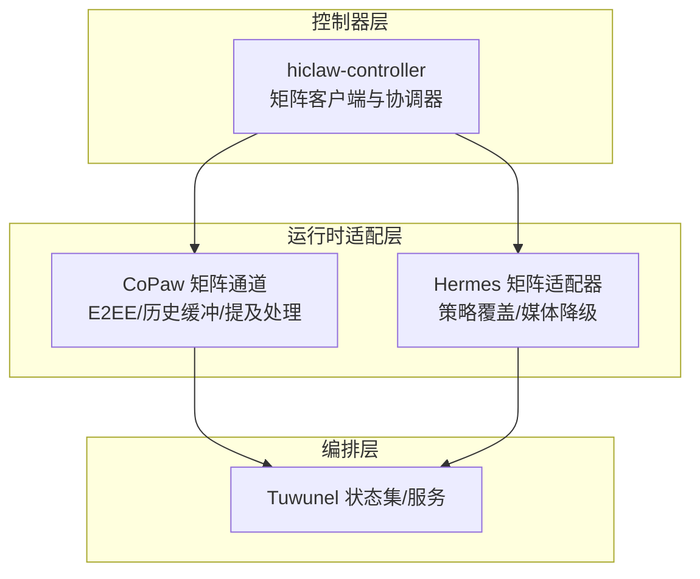
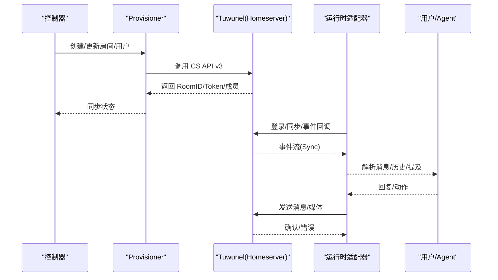
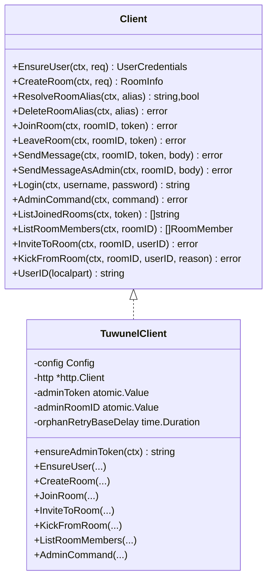
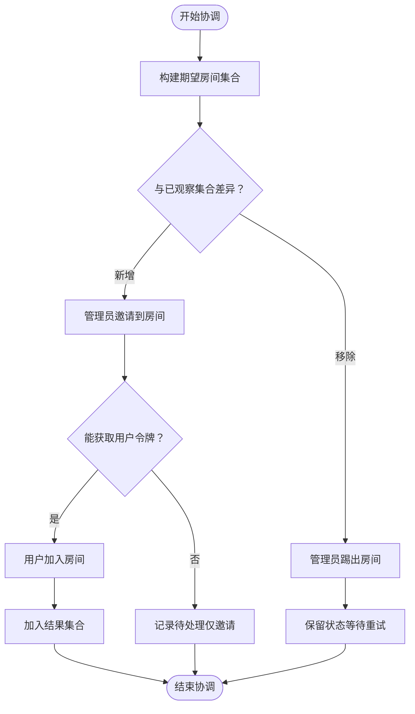
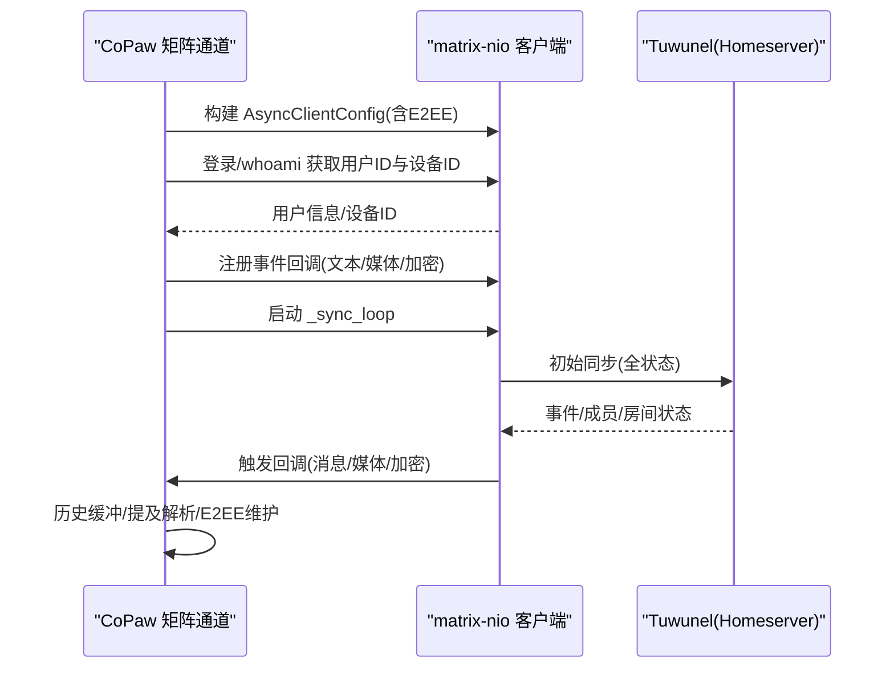
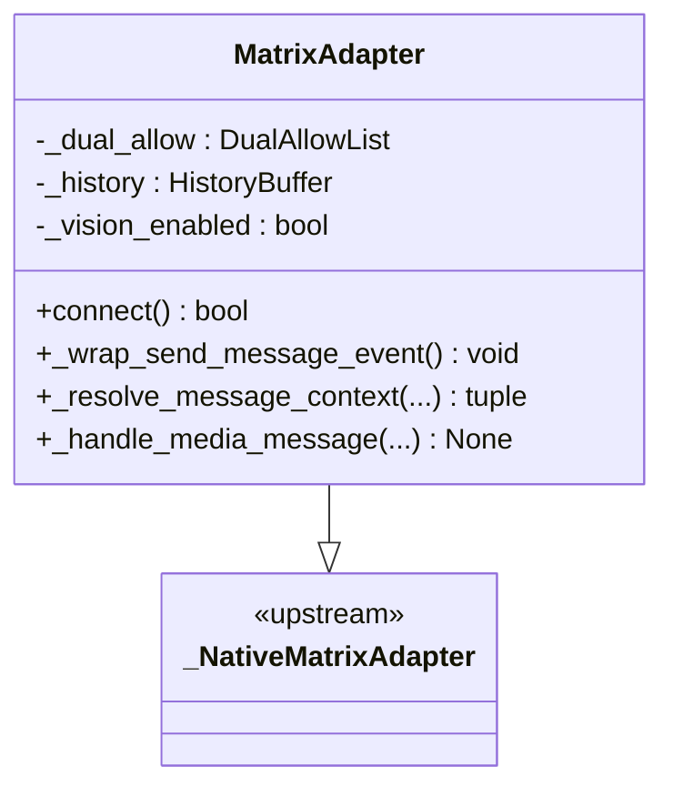
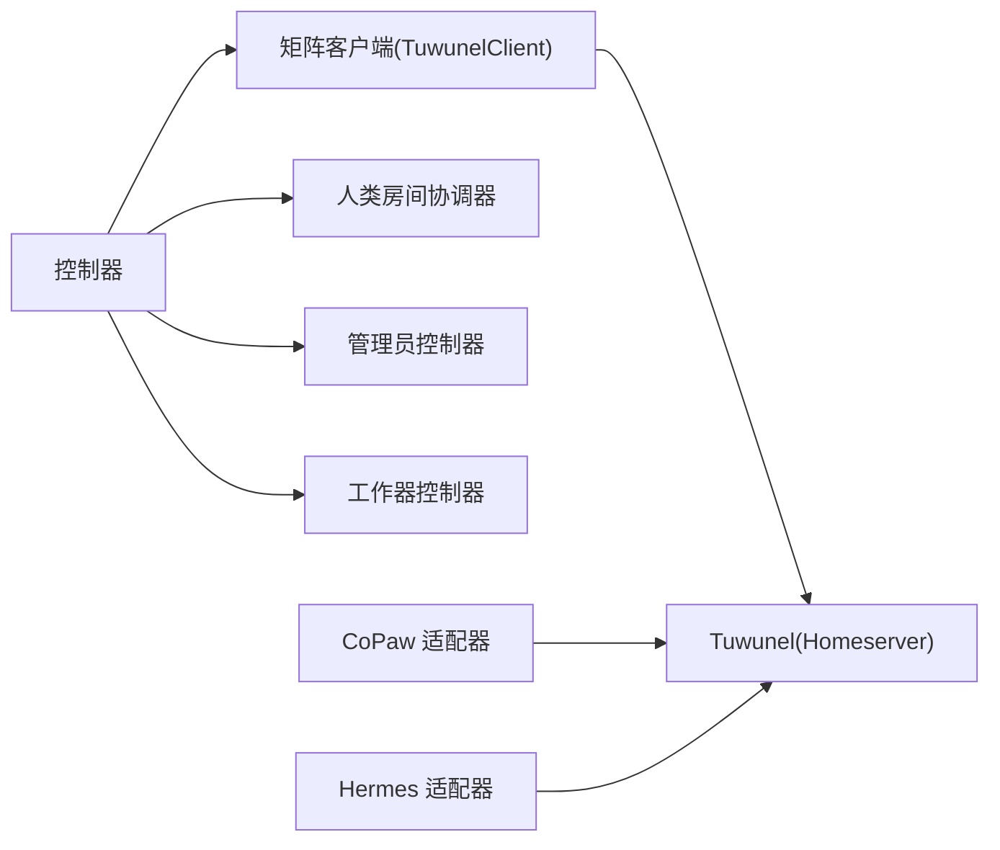

# Matrix 协议与通信

<cite>
**本文引用的文件**
- [hiclaw-controller 内部矩阵类型定义](file://hiclaw-controller/internal/matrix/types.go)
- [hiclaw-controller 矩阵客户端实现](file://hiclaw-controller/internal/matrix/client.go)
- [hiclaw-controller 人类房间协调器](file://hiclaw-controller/internal/controller/human_reconcile_rooms.go)
- [hiclaw-controller 管理员控制器](file://hiclaw-controller/internal/controller/manager_controller.go)
- [hiclaw-controller 工作器控制器](file://hiclaw-controller/internal/controller/worker_controller.go)
- [hiclaw-controller 矩阵客户端测试](file://hiclaw-controller/internal/matrix/client_test.go)
- [CoPaw 矩阵通道覆盖说明](file://copaw/src/matrix/README.md)
- [CoPaw 矩阵通道实现](file://copaw/src/matrix/channel.py)
- [CoPaw 矩阵配置定义](file://copaw/src/matrix/config.py)
- [Hermes 矩阵适配器覆盖](file://hermes/src/hermes_matrix/overlay_adapter.py)
- [Hermes 矩阵适配器兼容层](file://hermes/src/hermes_matrix/adapter.py)
- [Hermes 矩阵适配器 shim](file://hermes/src/hermes_matrix/_shim.py)
- [调试脚本：导出调试日志（Python）](file://scripts/export-debug-log.py)
- [调试脚本：回放任务（Shell）](file://scripts/replay-task.sh)
- [管理员代理：工人管理技能参考](file://manager/agent/worker-agent/AGENTS.md)
- [管理员代理：工人管理技能参考（要点）](file://manager/agent/skills/worker-management/references/skills-management.md)
- [测试：创建工人（Shell）](file://tests/test-02-create-worker.sh)
</cite>

## 目录
1. [简介](#简介)
2. [项目结构](#项目结构)
3. [核心组件](#核心组件)
4. [架构总览](#架构总览)
5. [详细组件分析](#详细组件分析)
6. [依赖关系分析](#依赖关系分析)
7. [性能考量](#性能考量)
8. [故障排查指南](#故障排查指南)
9. [结论](#结论)
10. [附录](#附录)

## 简介
本文件系统性梳理 HiClaw 中基于 Matrix 协议的通信体系，重点覆盖以下方面：
- Matrix 协议作为去中心化通信协议的技术优势与应用场景
- Tuwunel（conduwuit）Matrix 服务器的配置与管理（homeserver 设置、房间管理、用户认证）
- Human、Manager、Worker 三者之间的通信机制（消息传递、状态同步、实时协作）
- Matrix 房间权限模型与安全机制
- 在不同运行时（OpenClaw、CoPaw、Hermes）中集成 Matrix 通信的实践
- 故障排查与性能优化建议

## 项目结构
HiClaw 将 Matrix 通信能力分层部署于控制器、运行时适配器与 Helm 编排层：
- 控制器层：通过 Go 实现的 Matrix 客户端封装 Tuwunel API，驱动人类、管理员与工作器的房间生命周期与权限管理
- 运行时适配层：CoPaw 与 Hermes 均提供对 Matrix 的增强适配，支持 E2EE、历史缓冲、提及处理、媒体降级等特性
- 编排层：Helm Charts 提供 Tuwunel 服务与状态集声明，确保 Matrix 服务可用性与持久化

图示来源
- [hiclaw-controller 矩阵客户端实现:1-120](file://hiclaw-controller/internal/matrix/client.go#L1-L120)
- [CoPaw 矩阵通道实现:1-120](file://copaw/src/matrix/channel.py#L1-L120)
- [Hermes 矩阵适配器覆盖:1-60](file://hermes/src/hermes_matrix/overlay_adapter.py#L1-L60)

章节来源
- [hiclaw-controller 矩阵客户端实现:1-120](file://hiclaw-controller/internal/matrix/client.go#L1-L120)
- [CoPaw 矩阵通道实现:1-120](file://copaw/src/matrix/channel.py#L1-L120)
- [Hermes 矩阵适配器覆盖:1-60](file://hermes/src/hermes_matrix/overlay_adapter.py#L1-L60)

## 核心组件
- 矩阵客户端接口与实现
  - 接口定义涵盖用户注册/登录、房间创建/加入/离开、消息发送、成员列表查询、邀请/踢出等
  - Tuwunel 客户端实现基于 Matrix CS API v3，内置管理员令牌缓存与错误处理
- 人类房间协调器
  - 基于期望集合与观察集合的收敛式房间管理，支持邀请后按需加入，失败重试
- 管理员与工作器控制器
  - 管理员控制器负责基础设施、配置与容器生命周期；工作器控制器负责成员上下文与运行时状态写回
- 运行时适配器
  - CoPaw：基于 matrix-nio 的通道，支持 E2EE、历史缓冲、提及解析、Markdown 渲染、打字指示
  - Hermes：基于上游 mautrix 的适配器，通过覆盖层注入 HiClaw 策略（提及增强、历史缓冲、媒体降级）

章节来源
- [hiclaw-controller 内部矩阵类型定义:1-79](file://hiclaw-controller/internal/matrix/types.go#L1-L79)
- [hiclaw-controller 矩阵客户端实现:16-87](file://hiclaw-controller/internal/matrix/client.go#L16-L87)
- [hiclaw-controller 人类房间协调器:9-87](file://hiclaw-controller/internal/controller/human_reconcile_rooms.go#L9-L87)
- [CoPaw 矩阵通道实现:216-477](file://copaw/src/matrix/channel.py#L216-L477)
- [Hermes 矩阵适配器覆盖:94-133](file://hermes/src/hermes_matrix/overlay_adapter.py#L94-L133)

## 架构总览
下图展示了从控制器到运行时适配器再到 Matrix 服务器的端到端交互路径。

图示来源
- [hiclaw-controller 矩阵客户端实现:131-225](file://hiclaw-controller/internal/matrix/client.go#L131-L225)
- [CoPaw 矩阵通道实现:335-477](file://copaw/src/matrix/channel.py#L335-L477)
- [Hermes 矩阵适配器覆盖:103-133](file://hermes/src/hermes_matrix/overlay_adapter.py#L103-L133)

## 详细组件分析

### 组件一：控制器层的矩阵客户端
- 设计要点
  - 抽象接口 Client 定义了用户、房间、消息、成员管理等操作契约
  - TuwunelClient 实现了基于 HTTP 的 CS API v3 调用，内置管理员令牌缓存与异常处理
  - 支持幂等房间别名解析与删除，避免并发重建
- 关键流程
  - 用户注册/登录：优先尝试注册，失败时回退到登录或通过管理员命令进行“孤儿恢复”
  - 房间管理：创建房间时可设置加密、别名与权限等级；支持根据别名解析房间 ID
  - 成员管理：邀请/踢出幂等，失败时保留状态等待重试
- 错误处理
  - 认证失败自动清空缓存令牌，避免重复失败
  - 对 M_USER_IN_USE、M_ROOM_IN_USE 等特定错误进行分支处理

图示来源
- [hiclaw-controller 内部矩阵类型定义:16-87](file://hiclaw-controller/internal/matrix/types.go#L16-L87)
- [hiclaw-controller 矩阵客户端实现:16-112](file://hiclaw-controller/internal/matrix/client.go#L16-L112)

章节来源
- [hiclaw-controller 内部矩阵类型定义:1-87](file://hiclaw-controller/internal/matrix/types.go#L1-L87)
- [hiclaw-controller 矩阵客户端实现:118-225](file://hiclaw-controller/internal/matrix/client.go#L118-L225)
- [hiclaw-controller 矩阵客户端测试:357-388](file://hiclaw-controller/internal/matrix/client_test.go#L357-L388)

### 组件二：人类房间协调器
- 设计要点
  - 采用期望集合与观察集合的收敛式策略，确保最终一致性
  - 邀请使用管理员令牌，按需懒加载用户令牌并执行加入
  - 失败场景保留状态，等待后续重试
- 关键流程
  - reconcileHumanRooms：计算期望房间集合，批量邀请并按需加入
  - ensureUserToken：仅在需要加入新房间时触发登录，避免设备会话膨胀
- 安全与稳定性
  - 每次登录都会创建新的设备会话，懒加载策略有效控制设备数量增长

图示来源
- [hiclaw-controller 人类房间协调器:27-87](file://hiclaw-controller/internal/controller/human_reconcile_rooms.go#L27-L87)

章节来源
- [hiclaw-controller 人类房间协调器:89-122](file://hiclaw-controller/internal/controller/human_reconcile_rooms.go#L89-L122)

### 组件三：运行时适配器（CoPaw）
- 设计要点
  - 基于 matrix-nio 的异步客户端，支持 E2EE、媒体下载、打字指示、历史缓冲
  - 提供配置类 MatrixChannelConfig，支持允许列表策略、历史缓冲上限、同步超时等
  - 事件回调统一处理文本、媒体与加密事件，并进行 E2EE 维护
- 关键流程
  - start：构建 AsyncClientConfig，选择是否启用 E2EE，登录后启动同步循环
  - _sync_loop：首次部署抓取全量状态以填充显示名，之后增量同步并维护密钥
  - _check_allowed 与 _was_mentioned：实现双策略（DM/群组）与多种提及检测
- 性能与可靠性
  - 同步超时与请求超时匹配，避免连接被 HTTP 层提前中断
  - 加密密钥维护在每次同步后执行，保证密钥轮转与会话建立

图示来源
- [CoPaw 矩阵通道实现:335-477](file://copaw/src/matrix/channel.py#L335-L477)
- [CoPaw 矩阵通道实现:560-670](file://copaw/src/matrix/channel.py#L560-L670)
- [CoPaw 矩阵通道实现:719-754](file://copaw/src/matrix/channel.py#L719-L754)

章节来源
- [CoPaw 矩阵通道实现:216-477](file://copaw/src/matrix/channel.py#L216-L477)
- [CoPaw 矩阵通道实现:531-558](file://copaw/src/matrix/channel.py#L531-L558)
- [CoPaw 矩阵通道实现:719-754](file://copaw/src/matrix/channel.py#L719-L754)

### 组件四：运行时适配器（Hermes）
- 设计要点
  - 通过覆盖层在上游 mautrix 适配器基础上注入 HiClaw 策略
  - 主要覆盖点：出站消息增强提及、双允许列表、历史缓冲、图像降级
- 关键流程
  - connect：连接成功后包装 send_message_event，统一注入 m.mentions
  - _resolve_message_context：在允许策略与历史缓冲之间协调，区分命令与普通消息
  - _handle_media_message：当模型无视觉能力时，将图片降级为文本提示

图示来源
- [Hermes 矩阵适配器覆盖:94-133](file://hermes/src/hermes_matrix/overlay_adapter.py#L94-L133)
- [Hermes 矩阵适配器兼容层:1-5](file://hermes/src/hermes_matrix/adapter.py#L1-L5)

章节来源
- [Hermes 矩阵适配器覆盖:94-240](file://hermes/src/hermes_matrix/overlay_adapter.py#L94-L240)
- [Hermes 矩阵适配器 shim:1-23](file://hermes/src/hermes_matrix/_shim.py#L1-L23)

### 组件五：权限模型与安全机制
- 用户与房间
  - 用户注册通过注册令牌与密码完成；若账户存在则登录或通过管理员命令重置密码
  - 房间创建支持加密与别名，避免并发重复创建
- 成员管理
  - 邀请/踢出幂等，失败保留状态等待重试
  - 管理员令牌缓存，认证失败自动失效
- 运行时策略
  - CoPaw：DM/群组双策略、历史缓冲、提及解析、E2EE
  - Hermes：出站提及增强、历史缓冲、图像降级

章节来源
- [hiclaw-controller 矩阵客户端实现:131-225](file://hiclaw-controller/internal/matrix/client.go#L131-L225)
- [hiclaw-controller 矩阵客户端实现:555-585](file://hiclaw-controller/internal/matrix/client.go#L555-L585)
- [CoPaw 矩阵通道实现:679-718](file://copaw/src/matrix/channel.py#L679-L718)
- [Hermes 矩阵适配器覆盖:109-133](file://hermes/src/hermes_matrix/overlay_adapter.py#L109-L133)

## 依赖关系分析
- 控制器依赖矩阵客户端接口，通过 Provisioner 统一调用 Tuwunel API
- 运行时适配器独立于控制器，直接与 Matrix 服务器交互
- 人类房间协调器在控制器内协调人类用户的房间加入与权限回收
- 管理员与工作器控制器分别负责各自的基础设施与容器生命周期

图示来源
- [hiclaw-controller 矩阵客户端实现:1-120](file://hiclaw-controller/internal/matrix/client.go#L1-L120)
- [hiclaw-controller 人类房间协调器:1-27](file://hiclaw-controller/internal/controller/human_reconcile_rooms.go#L1-L27)
- [hiclaw-controller 管理员控制器:31-62](file://hiclaw-controller/internal/controller/manager_controller.go#L31-L62)
- [hiclaw-controller 工作器控制器:30-55](file://hiclaw-controller/internal/controller/worker_controller.go#L30-L55)

章节来源
- [hiclaw-controller 管理员控制器:126-160](file://hiclaw-controller/internal/controller/manager_controller.go#L126-L160)
- [hiclaw-controller 工作器控制器:110-151](file://hiclaw-controller/internal/controller/worker_controller.go#L110-L151)

## 性能考量
- 同步超时与请求超时匹配
  - CoPaw 的 AsyncClientConfig 请求超时必须大于同步长轮询超时，避免 HTTP 层提前中断
- 设备会话管理
  - 控制器每登录一次即创建一个新设备会话，应避免在高频重试中频繁登录
- 历史缓冲与消息过滤
  - 合理设置历史缓冲上限，减少无关消息对上下文的影响
- E2EE 密钥维护
  - 在同步间隙执行密钥上传、查询与声明，降低解密失败率

章节来源
- [CoPaw 矩阵通道实现:316-333](file://copaw/src/matrix/channel.py#L316-L333)
- [hiclaw-controller 人类房间协调器:95-101](file://hiclaw-controller/internal/controller/human_reconcile_rooms.go#L95-L101)

## 故障排查指南
- 登录失败与设备会话膨胀
  - 症状：每 5 分钟重试导致大量孤儿设备
  - 处理：采用懒加载策略仅在需要加入房间时登录
- 管理员令牌失效
  - 症状：HTTP 401/403 后续调用失败
  - 处理：客户端自动清空缓存令牌，重新登录
- 房间别名冲突
  - 症状：创建房间时报错 M_ROOM_IN_USE
  - 处理：解析别名对应的房间 ID，避免重复创建
- 媒体降级与视觉模型
  - 症状：图像被降级为文本占位符
  - 处理：启用视觉模型或在运行时关闭图像降级策略
- API 使用示例
  - Python：登录获取访问令牌、调用 Matrix API
  - Shell：使用 curl 发送登录与房间查询请求

章节来源
- [调试脚本：导出调试日志（Python）:162-186](file://scripts/export-debug-log.py#L162-L186)
- [调试脚本：回放任务（Shell）:112-140](file://scripts/replay-task.sh#L112-L140)
- [hiclaw-controller 矩阵客户端实现:678-682](file://hiclaw-controller/internal/matrix/client.go#L678-L682)
- [Hermes 矩阵适配器覆盖:189-207](file://hermes/src/hermes_matrix/overlay_adapter.py#L189-L207)

## 结论
HiClaw 通过控制器层的矩阵客户端与协调器，结合运行时适配器的策略覆盖，实现了稳定、可扩展的去中心化通信能力。控制器层负责房间与权限的收敛式管理，运行时适配器提供丰富的消息处理与安全特性。配合合理的性能与故障排查策略，可在多运行时环境中实现一致的实时协作体验。

## 附录
- 运行时集成要点
  - CoPaw：启用 E2EE、配置历史缓冲、提及解析与 Markdown 渲染
  - Hermes：启用出站提及增强、历史缓冲与图像降级策略
- 管理员与工人协作规范
  - 明确 @mention 规则、消息格式与回复时机，避免噪音与循环

章节来源
- [CoPaw 矩阵通道覆盖说明:11-28](file://copaw/src/matrix/README.md#L11-L28)
- [CoPaw 矩阵配置定义:160-184](file://copaw/src/matrix/config.py#L160-L184)
- [管理员代理：工人管理技能参考:71-105](file://manager/agent/worker-agent/AGENTS.md#L71-L105)
- [管理员代理：工人管理技能参考（要点）:35-40](file://manager/agent/skills/worker-management/references/skills-management.md#L35-L40)
- [测试：创建工人（Shell）:39-62](file://tests/test-02-create-worker.sh#L39-L62)