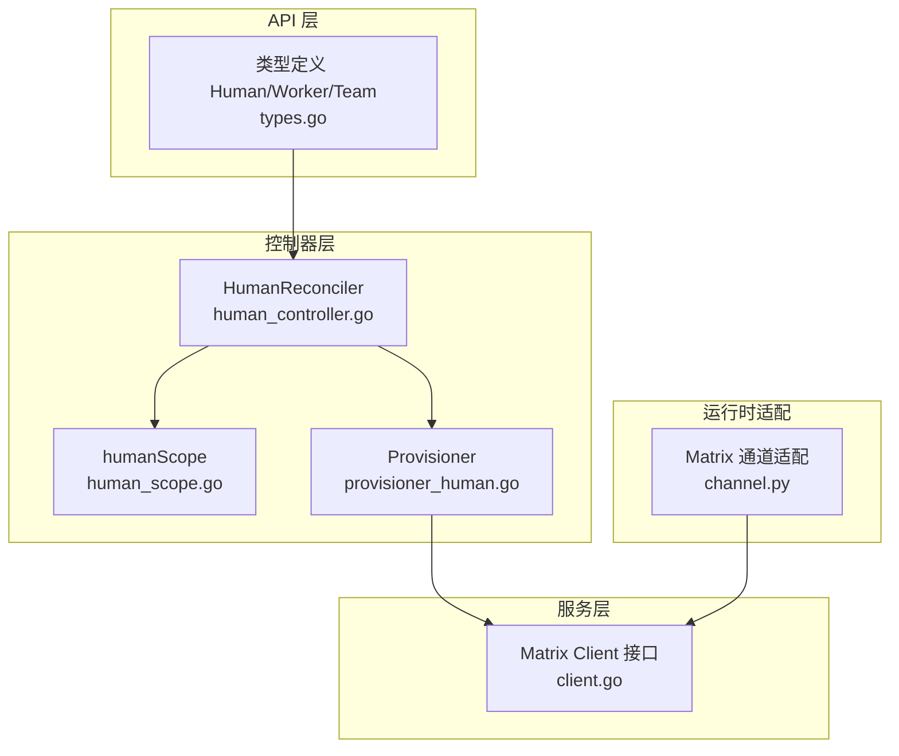
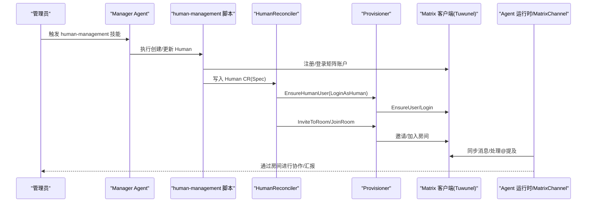
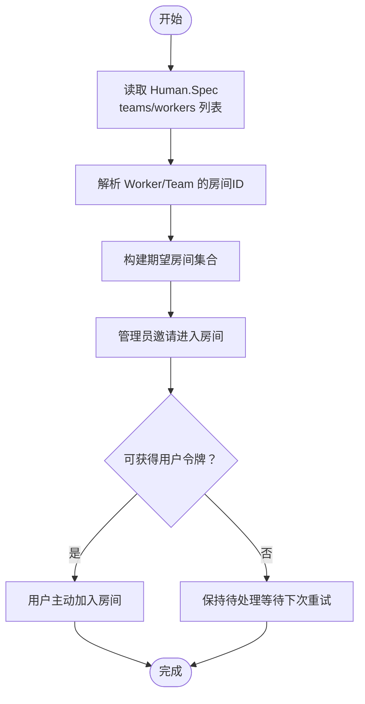
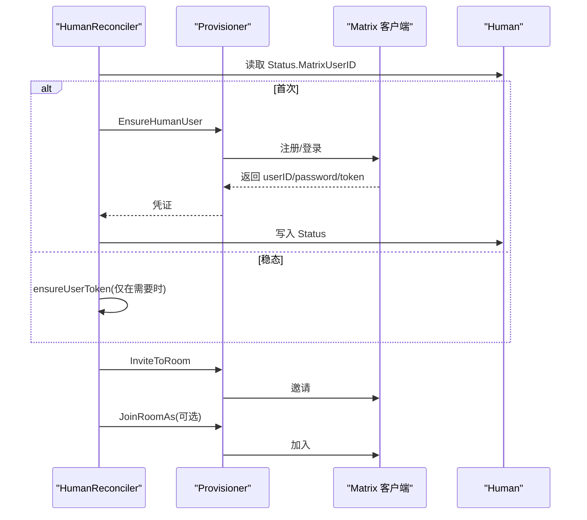
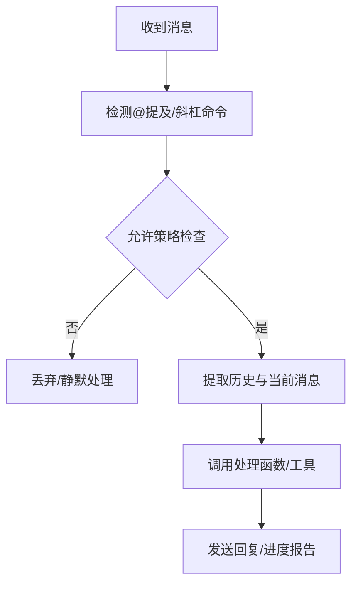
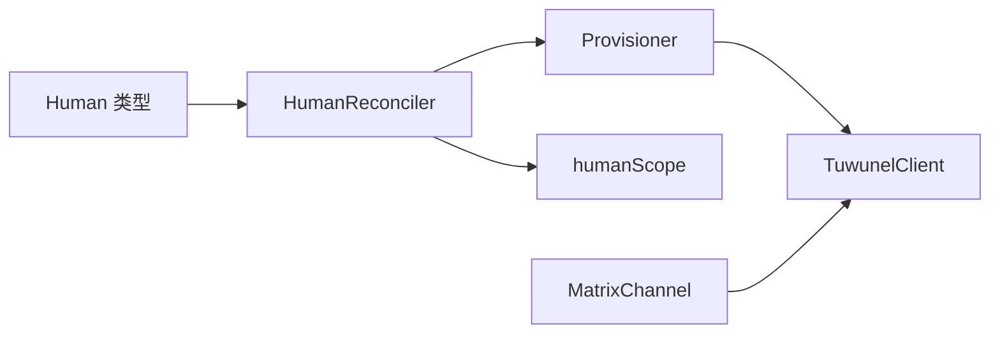

# 人类在回路机制

<cite>
**本文引用的文件**
- [types.go](file://hiclaw-controller/api/v1beta1/types.go)
- [human_controller.go](file://hiclaw-controller/internal/controller/human_controller.go)
- [human_reconcile_infra.go](file://hiclaw-controller/internal/controller/human_reconcile_infra.go)
- [human_reconcile_rooms.go](file://hiclaw-controller/internal/controller/human_reconcile_rooms.go)
- [human_scope.go](file://hiclaw-controller/internal/controller/human_scope.go)
- [provisioner_human.go](file://hiclaw-controller/internal/service/provisioner_human.go)
- [client.go](file://hiclaw-controller/internal/matrix/client.go)
- [channel.py](file://copaw/src/matrix/channel.py)
- [SKILL.md](file://manager/agent/skills/human-management/SKILL.md)
- [create-human.sh](file://manager/agent/skills/human-management/scripts/create-human.sh)
- [HEARTBEAT.md](file://manager/agent/HEARTBEAT.md)
- [AGENTS.md](file://manager/agent/worker-agent/AGENTS.md)
- [matrix-client.sh](file://tests/lib/matrix-client.sh)
</cite>

## 目录
1. [引言](#引言)
2. [项目结构](#项目结构)
3. [核心组件](#核心组件)
4. [架构总览](#架构总览)
5. [详细组件分析](#详细组件分析)
6. [依赖分析](#依赖分析)
7. [性能考虑](#性能考虑)
8. [故障排查指南](#故障排查指南)
9. [结论](#结论)
10. [附录](#附录)

## 引言
本文件系统化阐述 HiClaw 的“人类在回路”（Human-in-the-Loop, HITL）机制：从设计理念与价值主张出发，到人类资源的配置与管理、权限与访问控制、房间管理与协作流程，再到人类在智能体协作过程中的监督、干预与决策支持。文档同时覆盖紧急情况处理、复杂任务协调与质量保证等典型场景，并提供矩阵房间中的通知、进度报告与人工干预触发条件的实操指引，以及管理员最佳实践。

## 项目结构
HiClaw 将“人类在回路”的能力拆分为三层：
- 声明式 API 层：通过 CRD 定义 Human、Worker、Team 等资源及其状态。
- 控制器层：HumanReconciler 负责将 Human 的 Spec 同步到 Matrix 用户与房间成员关系。
- 服务与基础设施层：Matrix 客户端封装、房间邀请/加入/踢出、用户登录与令牌缓存、以及与 Agent 运行时的通道适配。

**图表来源**
- [human_controller.go:1-103](file://hiclaw-controller/internal/controller/human_controller.go#L1-L103)
- [human_scope.go:1-80](file://hiclaw-controller/internal/controller/human_scope.go#L1-L80)
- [provisioner_human.go:1-65](file://hiclaw-controller/internal/service/provisioner_human.go#L1-L65)
- [client.go:1-724](file://hiclaw-controller/internal/matrix/client.go#L1-L724)
- [types.go:331-363](file://hiclaw-controller/api/v1beta1/types.go#L331-L363)
- [channel.py:1-800](file://copaw/src/matrix/channel.py#L1-L800)

**章节来源**
- [types.go:331-363](file://hiclaw-controller/api/v1beta1/types.go#L331-L363)
- [human_controller.go:1-103](file://hiclaw-controller/internal/controller/human_controller.go#L1-L103)
- [provisioner_human.go:1-65](file://hiclaw-controller/internal/service/provisioner_human.go#L1-L65)
- [client.go:1-724](file://hiclaw-controller/internal/matrix/client.go#L1-L724)
- [channel.py:1-800](file://copaw/src/matrix/channel.py#L1-L800)

## 核心组件
- Human 资源与状态机
  - 规范字段：显示名、邮箱、权限等级、可访问团队与工作节点列表、备注。
  - 状态字段：矩阵用户 ID、初始密码、房间列表、邮件发送标记、消息摘要。
  - 权限等级：1（管理员级）、2（团队级）、3（仅工作节点级），决定可访问范围与策略差异。
- HumanReconciler 控制器
  - 基于声明式收敛：先基础设施（注册/登录矩阵用户），再房间成员关系（邀请/加入/移除），最后兼容旧版注册表。
  - 每次调谐仅合并一次状态更新，失败不阻塞后续阶段。
- Matrix 服务与客户端
  - 提供 EnsureUser/Login/Invite/Kick/CreateRoom/ListRoomMembers 等操作；支持管理员令牌缓存与命令通道。
  - 针对 Tuwunel（conduwuit）实现，包含别名解析、E2EE 初始化、同步令牌持久化与重放抑制等细节。
- Agent 通道适配
  - MatrixChannel 支持允许白名单策略、@提及检测、历史缓冲、媒体下载、E2EE 维护与增量同步循环。
- 管理员技能与脚本
  - human-management 技能提供权限等级说明、快速创建、注意事项与参考脚本路径。
  - create-human.sh 实现矩阵账户注册、权限计算、房间邀请与自动加入、欢迎邮件发送、注册表更新等。

**章节来源**
- [types.go:339-355](file://hiclaw-controller/api/v1beta1/types.go#L339-L355)
- [human_controller.go:29-96](file://hiclaw-controller/internal/controller/human_controller.go#L29-L96)
- [provisioner_human.go:10-65](file://hiclaw-controller/internal/service/provisioner_human.go#L10-L65)
- [client.go:18-87](file://hiclaw-controller/internal/matrix/client.go#L18-L87)
- [channel.py:160-206](file://copaw/src/matrix/channel.py#L160-L206)
- [SKILL.md:10-45](file://manager/agent/skills/human-management/SKILL.md#L10-L45)
- [create-human.sh:1-379](file://manager/agent/skills/human-management/scripts/create-human.sh#L1-L379)

## 架构总览
下图展示人类在回路的关键交互：管理员通过 Manager Agent 的 human-management 技能创建/更新 Human；控制器根据 Spec 计算期望房间集合，调用 Matrix 服务完成邀请与加入；Agent 侧 MatrixChannel 处理消息、@提及与历史上下文，形成人机协作闭环。

**图表来源**
- [create-human.sh:88-114](file://manager/agent/skills/human-management/scripts/create-human.sh#L88-L114)
- [human_controller.go:88-96](file://hiclaw-controller/internal/controller/human_controller.go#L88-L96)
- [provisioner_human.go:16-65](file://hiclaw-controller/internal/service/provisioner_human.go#L16-L65)
- [client.go:131-225](file://hiclaw-controller/internal/matrix/client.go#L131-L225)
- [channel.py:335-477](file://copaw/src/matrix/channel.py#L335-L477)

## 详细组件分析

### 人类资源与权限模型
- 权限等级与访问范围
  - 1（管理员级）：可与 Manager、所有 Team Leader、所有 Worker 通信；忽略 teams/workers 列表。
  - 2（团队级）：可访问指定 Team Leader 及其 Worker、指定独立 Worker；由 teams/workers 列表限定。
  - 3（工作节点级）：仅可访问指定 Worker；忽略 teams 列表。
- 访问控制与房间管理
  - 控制器基于 Human.Spec.AccessibleTeams/AccessibleWorkers 解析对应 Worker/Team 的房间 ID，构建期望房间集合。
  - 对于不存在或尚未完成初始化的资源（房间 ID 为空），控制器跳过并在后续轮询中重试。
- 状态与消息
  - Status 中记录 MatrixUserID、InitialPassword、Rooms、邮件发送标记与错误消息，便于诊断与审计。

**图表来源**
- [human_scope.go:49-79](file://hiclaw-controller/internal/controller/human_scope.go#L49-L79)
- [human_reconcile_rooms.go:27-87](file://hiclaw-controller/internal/controller/human_reconcile_rooms.go#L27-L87)

**章节来源**
- [types.go:339-355](file://hiclaw-controller/api/v1beta1/types.go#L339-L355)
- [SKILL.md:10-36](file://manager/agent/skills/human-management/SKILL.md#L10-L36)
- [human_scope.go:49-79](file://hiclaw-controller/internal/controller/human_scope.go#L49-L79)
- [human_reconcile_rooms.go:27-87](file://hiclaw-controller/internal/controller/human_reconcile_rooms.go#L27-L87)

### 基础设施与房间生命周期
- 首次注册与登录
  - 首次：EnsureHumanUser 创建账户并返回初始密码与访问令牌；控制器写入 Status.MatrixUserID 与 InitialPassword，并缓存 userToken 以减少后续登录开销。
  - 稳态：避免周期性登录导致设备会话膨胀；仅在需要加入新房间时才尝试登录。
- 房间成员变更
  - 新增：管理员邀请（InviteToRoom）；若可获得用户令牌，则用户主动加入（JoinRoomAs）。
  - 移除：管理员踢出（KickFromRoom）；失败则保留状态，等待下次重试。
- 登录失败与降级
  - 若使用存储密码登录失败（例如用户在 Element 修改了密码），控制器降级为仅管理员邀请模式，不抛出错误阻塞其他房间。

**图表来源**
- [human_reconcile_infra.go:35-53](file://hiclaw-controller/internal/controller/human_reconcile_infra.go#L35-L53)
- [human_reconcile_rooms.go:89-122](file://hiclaw-controller/internal/controller/human_reconcile_rooms.go#L89-L122)
- [provisioner_human.go:16-65](file://hiclaw-controller/internal/service/provisioner_human.go#L16-L65)
- [client.go:131-225](file://hiclaw-controller/internal/matrix/client.go#L131-L225)

**章节来源**
- [human_reconcile_infra.go:10-53](file://hiclaw-controller/internal/controller/human_reconcile_infra.go#L10-L53)
- [human_reconcile_rooms.go:1-123](file://hiclaw-controller/internal/controller/human_reconcile_rooms.go#L1-L123)
- [provisioner_human.go:10-65](file://hiclaw-controller/internal/service/provisioner_human.go#L10-L65)
- [client.go:18-87](file://hiclaw-controller/internal/matrix/client.go#L18-L87)

### 管理员技能与脚本：创建与管理人类
- 快速创建
  - 使用 human-management 技能提供的脚本，传入矩阵 ID、显示名、权限等级、团队/工作节点列表、邮箱与备注，即可完成账户注册、权限计算、房间邀请与自动加入、欢迎邮件发送、注册表更新。
- 权限与策略要点
  - 权限等级决定组允许列表（groupAllowFrom）与 DM 允许列表（dm.allowFrom）的注入范围。
  - 等级 1 人类忽略 teams/workers 列表，自动获得全局访问。
  - 等级 3 人类忽略 teams，仅按 workers 列表生效。
- 注意事项
  - 更改权限等级需重新计算 groupAllowFrom；建议使用带 --update 的方式执行脚本。
  - 人类无需容器、MinIO 或网关，仅需矩阵房间访问与允许列表配置。

**章节来源**
- [SKILL.md:18-45](file://manager/agent/skills/human-management/SKILL.md#L18-L45)
- [create-human.sh:195-289](file://manager/agent/skills/human-management/scripts/create-human.sh#L195-L289)

### Agent 通道适配与协作流程
- 允许策略与 @提及
  - 支持 DM 与群组允许白名单策略；默认要求在群组中 @提及机器人；支持斜杠命令前缀剥离以便识别指令。
- 历史上下文与消息格式
  - 采用固定分隔符组织历史与当前消息，确保机器人能准确识别触发消息来源。
- 同步与 E2EE
  - 支持增量同步、断点续传（持久化 next_batch）、E2EE 密钥维护与加密媒体事件回调。
- 与管理员的协作
  - 机器人通过房间向管理员汇报心跳、进度与问题；管理员可通过通知渠道工具将汇总信息发送至 Admin DM 或指定通道。

**图表来源**
- [channel.py:679-754](file://copaw/src/matrix/channel.py#L679-L754)
- [channel.py:139-143](file://copaw/src/matrix/channel.py#L139-L143)
- [channel.py:560-670](file://copaw/src/matrix/channel.py#L560-L670)

**章节来源**
- [channel.py:160-206](file://copaw/src/matrix/channel.py#L160-L206)
- [channel.py:335-477](file://copaw/src/matrix/channel.py#L335-L477)
- [channel.py:679-754](file://copaw/src/matrix/channel.py#L679-L754)
- [HEARTBEAT.md:177-192](file://manager/agent/HEARTBEAT.md#L177-L192)
- [AGENTS.md:71-105](file://manager/agent/worker-agent/AGENTS.md#L71-L105)

### 通知机制、进度报告与人工干预
- 通知渠道解析
  - 心跳报告需通过解析通知渠道脚本确定目标通道与方式，确保所有发现的问题与建议动作传达给管理员。
- 进度与状态
  - 机器人在房间内自由发布进度更新；关键状态变化（完成、阻塞、问题）应通过明确的 @提及格式上报协调者。
- 人工干预触发条件
  - 机器人无法继续推进（阻塞）、需要澄清或存在异常时，应通过房间消息触发人工介入；管理员可在 Admin DM 或指定通道接收汇总。

**章节来源**
- [HEARTBEAT.md:177-192](file://manager/agent/HEARTBEAT.md#L177-L192)
- [AGENTS.md:71-105](file://manager/agent/worker-agent/AGENTS.md#L71-L105)
- [matrix-client.sh:180-431](file://tests/lib/matrix-client.sh#L180-L431)

## 依赖分析
- 控制器与服务层耦合
  - HumanReconciler 通过 Provisioner 与 Matrix 客户端解耦；Provisioner 再封装具体实现（TuwunelClient）。
- 数据一致性与幂等
  - 房间邀请/加入/踢出均为幂等操作；失败保留状态，避免丢失一致性。
- 运行时通道与控制器协同
  - Agent 通道负责消息解析与上下文；控制器负责人类账户与房间成员关系的声明式收敛。

**图表来源**
- [human_controller.go:22-27](file://hiclaw-controller/internal/controller/human_controller.go#L22-L27)
- [provisioner_human.go:16-65](file://hiclaw-controller/internal/service/provisioner_human.go#L16-L65)
- [client.go:89-112](file://hiclaw-controller/internal/matrix/client.go#L89-L112)
- [human_scope.go:14-24](file://hiclaw-controller/internal/controller/human_scope.go#L14-L24)
- [channel.py:216-254](file://copaw/src/matrix/channel.py#L216-L254)
- [types.go:331-337](file://hiclaw-controller/api/v1beta1/types.go#L331-L337)

**章节来源**
- [human_controller.go:16-27](file://hiclaw-controller/internal/controller/human_controller.go#L16-L27)
- [provisioner_human.go:10-65](file://hiclaw-controller/internal/service/provisioner_human.go#L10-L65)
- [client.go:18-87](file://hiclaw-controller/internal/matrix/client.go#L18-L87)
- [channel.py:216-254](file://copaw/src/matrix/channel.py#L216-L254)
- [types.go:331-337](file://hiclaw-controller/api/v1beta1/types.go#L331-L337)

## 性能考虑
- 设备会话与登录频率
  - 避免周期性登录导致设备会话膨胀；仅在需要加入新房间时获取用户令牌。
- 同步与重放抑制
  - 首次部署或升级时进行 catch-up 同步并抑制回调，随后采用增量同步与令牌持久化，降低重复消息处理成本。
- 幂等与重试
  - 房间邀请/加入/踢出均幂等，失败保留状态，避免抖动与重复操作。

[本节为通用性能讨论，不直接分析具体文件]

## 故障排查指南
- 人类账户无法登录
  - 现象：ensureUserToken 返回空，房间加入失败。
  - 排查：确认 InitialPassword 是否存在；若用户在 Element 修改密码，控制器将降级为仅管理员邀请模式。
- 房间邀请/加入失败
  - 现象：邀请成功但加入失败，或踢出失败。
  - 排查：检查管理员令牌有效性与权限；关注日志中的 HTTP 错误码与响应体；失败保留状态，等待下次重试。
- 心跳与通知未达管理员
  - 现象：机器人已生成报告但管理员未收到。
  - 排查：确认通知渠道解析脚本输出的 channel/target/via；确保使用正确的消息工具发送至 Admin DM 或指定通道。
- 测试辅助工具
  - 使用测试库中的消息读取与基线事件 ID 比较，定位最新消息是否被正确捕获。

**章节来源**
- [human_reconcile_rooms.go:89-122](file://hiclaw-controller/internal/controller/human_reconcile_rooms.go#L89-L122)
- [client.go:118-129](file://hiclaw-controller/internal/matrix/client.go#L118-L129)
- [HEARTBEAT.md:177-192](file://manager/agent/HEARTBEAT.md#L177-L192)
- [matrix-client.sh:180-431](file://tests/lib/matrix-client.sh#L180-L431)

## 结论
HiClaw 的人类在回路机制通过声明式 API、控制器与 Matrix 服务的协同，实现了对人类用户的自动化注册、权限与房间管理，以及与 Agent 运行时的高效协作。管理员可借助 human-management 技能与脚本快速导入人类用户并配置权限，控制器保障房间成员关系的持续收敛，Agent 通道适配确保消息与上下文的可靠传递。该机制在紧急处理、复杂任务协调与质量保证等方面提供了稳健的人工干预入口与通知通道。

[本节为总结性内容，不直接分析具体文件]

## 附录
- 最佳实践
  - 权限等级变更后，使用带 --update 的脚本重新计算 groupAllowFrom。
  - 为人类用户提供邮箱，启用欢迎邮件以降低上手成本。
  - 在团队协作中，优先使用房间公开进度，关键状态变化通过 @提及格式上报。
  - 定期检查通知渠道解析结果，确保心跳与异常信息送达管理员。

[本节为通用建议，不直接分析具体文件]