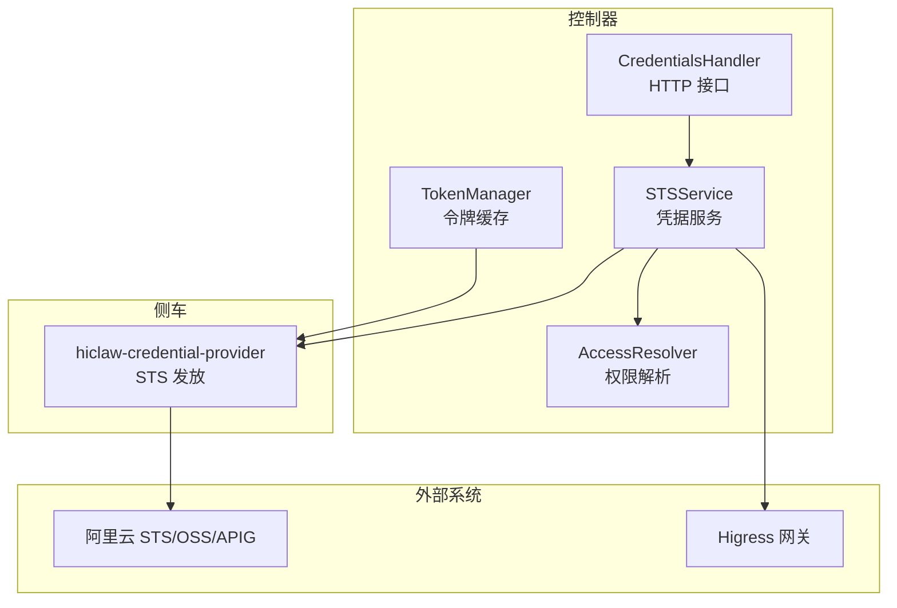
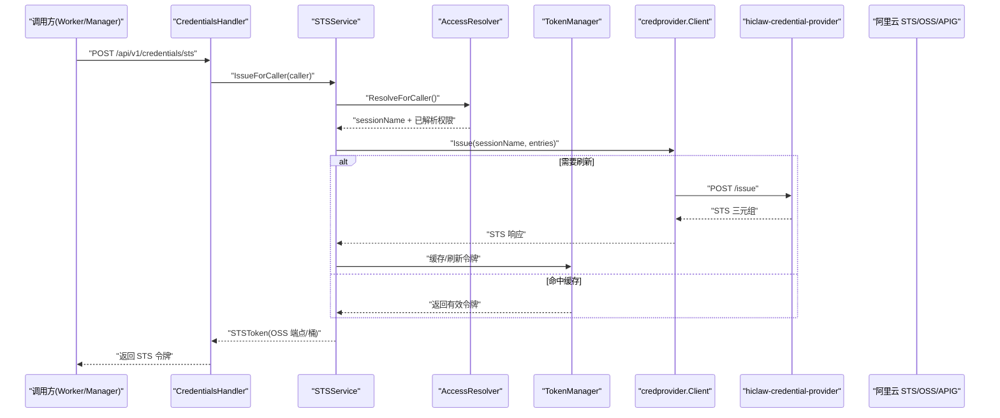
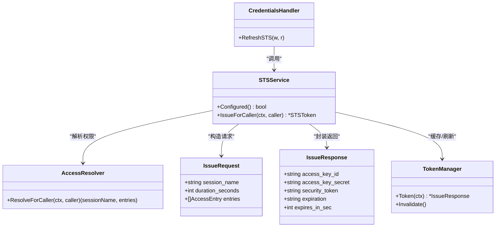
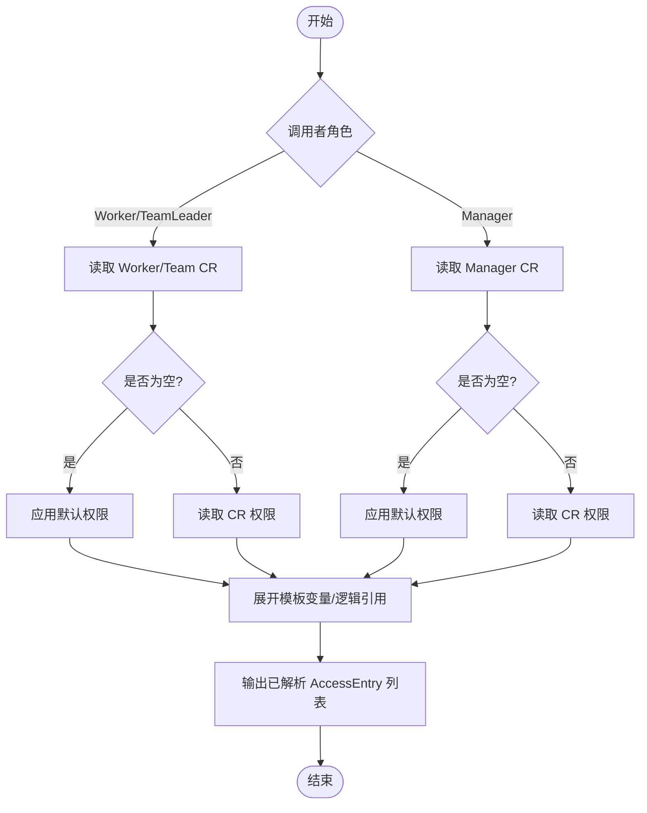
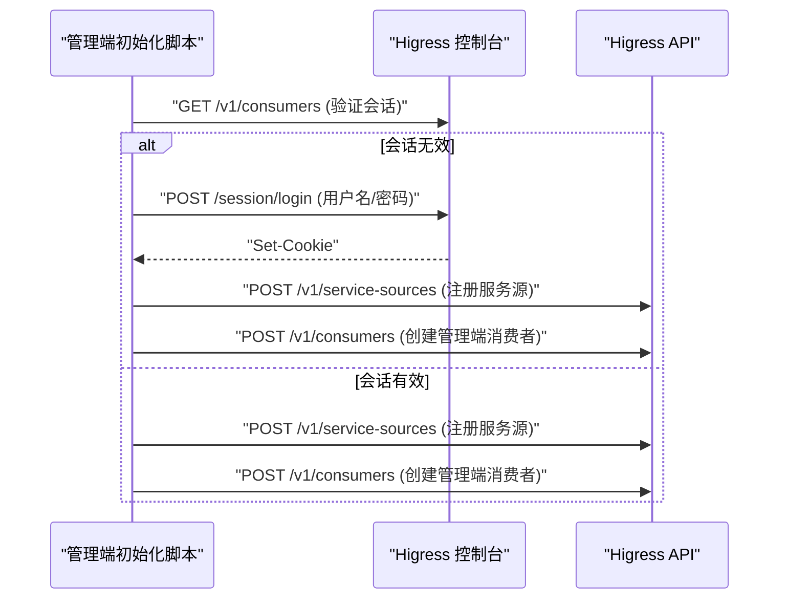
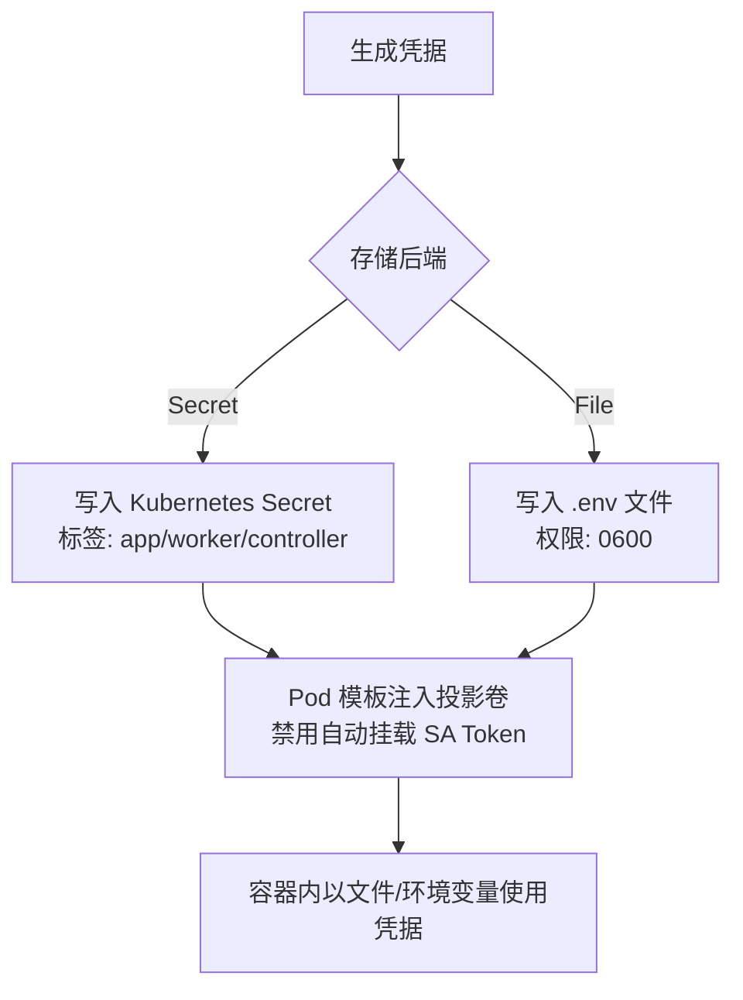
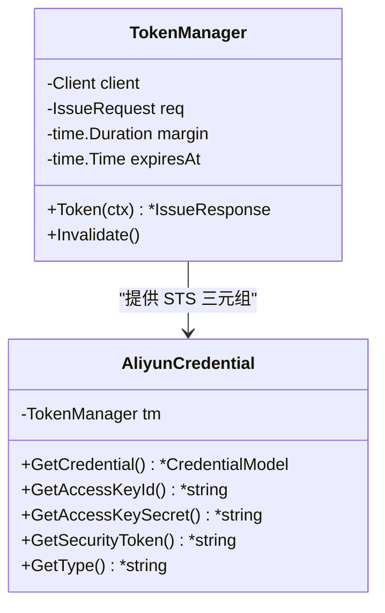
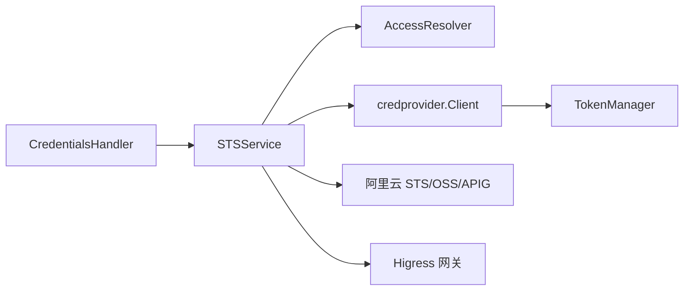

# 凭据安全管理

<cite>
**本文引用的文件**
- [hiclaw-controller/internal/credentials/sts.go](file://hiclaw-controller/internal/credentials/sts.go)
- [hiclaw-controller/internal/credentials/types.go](file://hiclaw-controller/internal/credentials/types.go)
- [hiclaw-controller/internal/credprovider/types.go](file://hiclaw-controller/internal/credprovider/types.go)
- [hiclaw-controller/internal/credprovider/tokenmanager.go](file://hiclaw-controller/internal/credprovider/tokenmanager.go)
- [hiclaw-controller/internal/credprovider/aliyun_credential.go](file://hiclaw-controller/internal/credprovider/aliyun_credential.go)
- [hiclaw-controller/internal/accessresolver/resolver.go](file://hiclaw-controller/internal/accessresolver/resolver.go)
- [hiclaw-controller/internal/accessresolver/defaults.go](file://hiclaw-controller/internal/accessresolver/defaults.go)
- [hiclaw-controller/internal/server/credentials_handler.go](file://hiclaw-controller/internal/server/credentials_handler.go)
- [hiclaw-controller/internal/service/credentials.go](file://hiclaw-controller/internal/service/credentials.go)
- [hiclaw-controller/internal/backend/agent_pod_template.go](file://hiclaw-controller/internal/backend/agent_pod_template.go)
- [hiclaw-controller/internal/backend/kubernetes_test.go](file://hiclaw-controller/internal/backend/kubernetes_test.go)
- [hiclaw-controller/internal/gateway/higress.go](file://hiclaw-controller/internal/gateway/higress.go)
- [hiclaw-controller/internal/gateway/client_test.go](file://hiclaw-controller/internal/gateway/client_test.go)
- [manager/scripts/init/start-manager-agent.sh](file://manager/scripts/init/start-manager-agent.sh)
- [helm/hiclaw/templates/controller/deployment.yaml](file://helm/hiclaw/templates/controller/deployment.yaml)
- [copaw/src/copaw_worker/worker.py](file://copaw/src/copaw_worker/worker.py)
- [hermes/src/hermes_worker/worker.py](file://hermes/src/hermes_worker/worker.py)
</cite>

## 目录
1. [引言](#引言)
2. [项目结构](#项目结构)
3. [核心组件](#核心组件)
4. [架构总览](#架构总览)
5. [详细组件分析](#详细组件分析)
6. [依赖分析](#依赖分析)
7. [性能考虑](#性能考虑)
8. [故障排查指南](#故障排查指南)
9. [结论](#结论)
10. [附录：最佳实践与常见风险](#附录最佳实践与常见风险)

## 引言
本文件系统性阐述 HiClaw 的凭据安全管理机制，重点围绕“零凭据暴露”的安全模型设计与实现，涵盖以下关键主题：
- 零凭据暴露的安全模型：控制器不持有长期凭据，通过可信侧车（hiclaw-credential-provider）发放短期 STS 凭据。
- Higress 消费者密钥认证：基于 key-auth 的消费者凭据生成、下发与轮换策略。
- 凭据隔离：通过命名空间、服务账号、资源前缀与最小权限策略，避免跨用户访问。
- 云提供商凭据提供器：STS 临时凭证与权限最小化原则的落地方式。
- 凭据注入与管理：Kubernetes Secret、环境变量与文件挂载等多形态注入与生命周期管理。
- 安全配置最佳实践与常见风险防护。

## 项目结构
与凭据安全直接相关的核心目录与文件如下：
- 控制器侧凭据服务与解析：hiclaw-controller/internal/credentials、hiclaw-controller/internal/credprovider、hiclaw-controller/internal/accessresolver
- 网关与消费者密钥：hiclaw-controller/internal/gateway
- 凭据存储与注入：hiclaw-controller/internal/service、hiclaw-controller/internal/backend
- 控制器部署与侧车：helm/hiclaw/templates/controller/deployment.yaml
- 管理端初始化脚本：manager/scripts/init/start-manager-agent.sh
- 工作端示例：copaw/src/copaw_worker/worker.py、hermes/src/hermes_worker/worker.py

图表来源
- [hiclaw-controller/internal/credentials/sts.go:29-90](file://hiclaw-controller/internal/credentials/sts.go#L29-L90)
- [hiclaw-controller/internal/accessresolver/resolver.go:48-78](file://hiclaw-controller/internal/accessresolver/resolver.go#L48-L78)
- [hiclaw-controller/internal/server/credentials_handler.go:12-42](file://hiclaw-controller/internal/server/credentials_handler.go#L12-L42)
- [hiclaw-controller/internal/credprovider/tokenmanager.go:10-78](file://hiclaw-controller/internal/credprovider/tokenmanager.go#L10-L78)

章节来源
- [hiclaw-controller/internal/credentials/sts.go:1-90](file://hiclaw-controller/internal/credentials/sts.go#L1-L90)
- [hiclaw-controller/internal/credprovider/types.go:1-75](file://hiclaw-controller/internal/credprovider/types.go#L1-L75)
- [hiclaw-controller/internal/accessresolver/resolver.go:1-345](file://hiclaw-controller/internal/accessresolver/resolver.go#L1-L345)
- [hiclaw-controller/internal/server/credentials_handler.go:1-42](file://hiclaw-controller/internal/server/credentials_handler.go#L1-L42)
- [hiclaw-controller/internal/credprovider/tokenmanager.go:1-78](file://hiclaw-controller/internal/credprovider/tokenmanager.go#L1-L78)

## 核心组件
- STSService：面向调用方（Worker/Manager）发放短期 STS 凭据，负责整合解析器与侧车客户端，并封装返回的 STSToken。
- AccessResolver：将 CR 层声明式权限转换为侧车可理解的已解析权限条目，支持模板变量与逻辑引用展开。
- CredentialsHandler：对外暴露 /api/v1/credentials/sts，作为凭据刷新的统一入口。
- TokenManager：在控制器内部对固定请求的 STS 令牌进行缓存与自动刷新，降低重复请求与延迟。
- 凭据存储与注入：SecretCredentialStore/FileCredentialStore 负责持久化；Pod 模板注入 ServiceAccount Token 投影与挂载。
- Higress 消费者密钥：通过 key-auth 为消费者创建或确保存在，支持会话重认证与密码回退。

章节来源
- [hiclaw-controller/internal/credentials/sts.go:29-90](file://hiclaw-controller/internal/credentials/sts.go#L29-L90)
- [hiclaw-controller/internal/accessresolver/resolver.go:48-78](file://hiclaw-controller/internal/accessresolver/resolver.go#L48-L78)
- [hiclaw-controller/internal/server/credentials_handler.go:12-42](file://hiclaw-controller/internal/server/credentials_handler.go#L12-L42)
- [hiclaw-controller/internal/credprovider/tokenmanager.go:10-78](file://hiclaw-controller/internal/credprovider/tokenmanager.go#L10-L78)
- [hiclaw-controller/internal/service/credentials.go:1-220](file://hiclaw-controller/internal/service/credentials.go#L1-L220)
- [hiclaw-controller/internal/backend/agent_pod_template.go:120-158](file://hiclaw-controller/internal/backend/agent_pod_template.go#L120-L158)

## 架构总览
下图展示从调用方到侧车、再到云服务与网关的完整凭据发放与使用链路。

图表来源
- [hiclaw-controller/internal/server/credentials_handler.go:21-42](file://hiclaw-controller/internal/server/credentials_handler.go#L21-L42)
- [hiclaw-controller/internal/credentials/sts.go:63-89](file://hiclaw-controller/internal/credentials/sts.go#L63-L89)
- [hiclaw-controller/internal/accessresolver/resolver.go:48-78](file://hiclaw-controller/internal/accessresolver/resolver.go#L48-L78)
- [hiclaw-controller/internal/credprovider/tokenmanager.go:52-69](file://hiclaw-controller/internal/credprovider/tokenmanager.go#L52-L69)
- [hiclaw-controller/internal/credprovider/types.go:20-66](file://hiclaw-controller/internal/credprovider/types.go#L20-L66)

## 详细组件分析

### 组件一：凭据服务与零暴露模型
- 设计理念
  - 控制器自身不持有长期凭据，仅通过可信侧车发放短期 STS 三元组。
  - STSService 将调用身份与权限解析结果转发给侧车，侧车负责与云服务交互并返回 STS 三元组。
- 关键流程
  - CredentialsHandler 接收请求，提取调用身份，委托 STSService。
  - STSService 调用 AccessResolver 解析出 sessionName 与已解析权限列表，再通过 credprovider.Client 发送到侧车。
  - 返回的 STSToken 包含 OSS 端点与桶信息，供调用方直接使用。

图表来源
- [hiclaw-controller/internal/server/credentials_handler.go:12-42](file://hiclaw-controller/internal/server/credentials_handler.go#L12-L42)
- [hiclaw-controller/internal/credentials/sts.go:29-90](file://hiclaw-controller/internal/credentials/sts.go#L29-L90)
- [hiclaw-controller/internal/accessresolver/resolver.go:48-78](file://hiclaw-controller/internal/accessresolver/resolver.go#L48-L78)
- [hiclaw-controller/internal/credprovider/tokenmanager.go:10-78](file://hiclaw-controller/internal/credprovider/tokenmanager.go#L10-L78)
- [hiclaw-controller/internal/credprovider/types.go:20-66](file://hiclaw-controller/internal/credprovider/types.go#L20-L66)

章节来源
- [hiclaw-controller/internal/server/credentials_handler.go:1-42](file://hiclaw-controller/internal/server/credentials_handler.go#L1-L42)
- [hiclaw-controller/internal/credentials/sts.go:1-90](file://hiclaw-controller/internal/credentials/sts.go#L1-L90)
- [hiclaw-controller/internal/credprovider/types.go:1-75](file://hiclaw-controller/internal/credprovider/types.go#L1-L75)
- [hiclaw-controller/internal/credprovider/tokenmanager.go:1-78](file://hiclaw-controller/internal/credprovider/tokenmanager.go#L1-L78)

### 组件二：权限解析与最小权限
- 权限解析
  - AccessResolver 支持 Worker/Manager/TeamMember 三种角色，分别从对应 CR 中读取或应用默认权限。
  - 支持模板变量（如 ${self.name}/${self.team}）与逻辑引用（如 bucketRef/workspace、gatewayRef/default），最终输出侧车可识别的 AccessEntry 列表。
- 最小权限与作用域
  - 对象存储：限定 Bucket 与前缀集合；AI Gateway：限定 GatewayID 与资源集合。
  - 默认条目由 ControllerDefaults 提供，确保控制器自身具备必要的只读/写入能力。

图表来源
- [hiclaw-controller/internal/accessresolver/resolver.go:48-174](file://hiclaw-controller/internal/accessresolver/resolver.go#L48-L174)
- [hiclaw-controller/internal/accessresolver/defaults.go:102-134](file://hiclaw-controller/internal/accessresolver/defaults.go#L102-L134)

章节来源
- [hiclaw-controller/internal/accessresolver/resolver.go:1-345](file://hiclaw-controller/internal/accessresolver/resolver.go#L1-L345)
- [hiclaw-controller/internal/accessresolver/defaults.go:102-134](file://hiclaw-controller/internal/accessresolver/defaults.go#L102-L134)

### 组件三：Higress 消费者密钥认证
- 密钥生成与下发
  - 生成随机密钥并以 key-auth 形式注册到 Higress 消费者，首次创建返回 created，若已存在则返回 exists。
- 会话重认证与密码回退
  - 当会话失效时触发重新登录，必要时回退到内置管理员密码并变更目标密码，确保可用性与安全性。
- 管理端初始化
  - 管理端启动脚本会先验证会话有效性，失败则尝试登录；随后注册服务源并将管理端消费者与密钥写入网关。

图表来源
- [hiclaw-controller/internal/gateway/higress.go:137-165](file://hiclaw-controller/internal/gateway/higress.go#L137-L165)
- [hiclaw-controller/internal/gateway/client_test.go:27-62](file://hiclaw-controller/internal/gateway/client_test.go#L27-L62)
- [manager/scripts/init/start-manager-agent.sh:354-416](file://manager/scripts/init/start-manager-agent.sh#L354-L416)

章节来源
- [hiclaw-controller/internal/gateway/higress.go:129-165](file://hiclaw-controller/internal/gateway/higress.go#L129-L165)
- [hiclaw-controller/internal/gateway/client_test.go:1-209](file://hiclaw-controller/internal/gateway/client_test.go#L1-L209)
- [manager/scripts/init/start-manager-agent.sh:354-416](file://manager/scripts/init/start-manager-agent.sh#L354-L416)

### 组件四：凭据注入与管理
- Kubernetes Secret 注入
  - SecretCredentialStore 将 Worker 凭据（矩阵密码、MinIO 密码、网关密钥、矩阵 Token）以 Secret 形式持久化，标签包含资源前缀与控制器标识，便于隔离与检索。
- 文件与环境变量注入
  - FileCredentialStore 在嵌入模式下将凭据写入受控目录的 .env 文件，限制文件权限为 0600，避免泄露。
- Pod 模板与服务账号令牌投影
  - ApplyPodTemplate 自动追加 hiclaw-token 投影卷，禁用 AutomountServiceAccountToken，确保凭据仅通过投影卷暴露，降低泄漏面。

图表来源
- [hiclaw-controller/internal/service/credentials.go:115-142](file://hiclaw-controller/internal/service/credentials.go#L115-L142)
- [hiclaw-controller/internal/service/credentials.go:144-220](file://hiclaw-controller/internal/service/credentials.go#L144-L220)
- [hiclaw-controller/internal/backend/agent_pod_template.go:120-158](file://hiclaw-controller/internal/backend/agent_pod_template.go#L120-L158)
- [hiclaw-controller/internal/backend/kubernetes_test.go:154-194](file://hiclaw-controller/internal/backend/kubernetes_test.go#L154-L194)

章节来源
- [hiclaw-controller/internal/service/credentials.go:1-220](file://hiclaw-controller/internal/service/credentials.go#L1-L220)
- [hiclaw-controller/internal/backend/agent_pod_template.go:120-158](file://hiclaw-controller/internal/backend/agent_pod_template.go#L120-L158)
- [hiclaw-controller/internal/backend/kubernetes_test.go:154-194](file://hiclaw-controller/internal/backend/kubernetes_test.go#L154-L194)

### 组件五：云提供商凭据提供器（STS 与最小权限）
- 适配阿里云 SDK
  - NewAliyunCredential 将 TokenManager 输出的 STS 三元组适配为阿里云 SDK 所需的 Credential 接口，SDK 每次签名前自动触发 Token 获取，透明刷新。
- 令牌缓存与刷新
  - TokenManager 以固定 IssueRequest 为维度缓存 STS 令牌，默认在剩余有效期小于阈值时刷新，保证长连接场景下的连续可用性。
- 侧车职责
  - 侧车是唯一持有长期身份材料的组件，负责与云服务交互并发放短期 STS 三元组，严格遵循最小权限与权限分离原则。

图表来源
- [hiclaw-controller/internal/credprovider/tokenmanager.go:10-78](file://hiclaw-controller/internal/credprovider/tokenmanager.go#L10-L78)
- [hiclaw-controller/internal/credprovider/aliyun_credential.go:9-90](file://hiclaw-controller/internal/credprovider/aliyun_credential.go#L9-L90)

章节来源
- [hiclaw-controller/internal/credprovider/aliyun_credential.go:1-90](file://hiclaw-controller/internal/credprovider/aliyun_credential.go#L1-L90)
- [hiclaw-controller/internal/credprovider/tokenmanager.go:1-78](file://hiclaw-controller/internal/credprovider/tokenmanager.go#L1-L78)

## 依赖分析
- 组件耦合
  - STSService 依赖 AccessResolver 与 credprovider.Client；CredentialsHandler 仅依赖 STSService。
  - TokenManager 仅被需要长期稳定凭据的控制器内部组件使用，避免对调用方暴露。
- 外部依赖
  - 与阿里云 STS/OSS/APIG 的交互通过侧车完成；Higress 网关通过 key-auth 进行消费者与密钥管理。
- 隔离与最小权限
  - 通过命名空间、资源前缀、ServiceAccount 与 Secret 标签实现多租户隔离；权限解析阶段严格限定作用域与权限集合。

图表来源
- [hiclaw-controller/internal/server/credentials_handler.go:12-42](file://hiclaw-controller/internal/server/credentials_handler.go#L12-L42)
- [hiclaw-controller/internal/credentials/sts.go:29-90](file://hiclaw-controller/internal/credentials/sts.go#L29-L90)
- [hiclaw-controller/internal/accessresolver/resolver.go:48-78](file://hiclaw-controller/internal/accessresolver/resolver.go#L48-L78)
- [hiclaw-controller/internal/credprovider/tokenmanager.go:10-78](file://hiclaw-controller/internal/credprovider/tokenmanager.go#L10-L78)

章节来源
- [hiclaw-controller/internal/server/credentials_handler.go:1-42](file://hiclaw-controller/internal/server/credentials_handler.go#L1-L42)
- [hiclaw-controller/internal/credentials/sts.go:1-90](file://hiclaw-controller/internal/credentials/sts.go#L1-L90)
- [hiclaw-controller/internal/accessresolver/resolver.go:1-345](file://hiclaw-controller/internal/accessresolver/resolver.go#L1-L345)
- [hiclaw-controller/internal/credprovider/tokenmanager.go:1-78](file://hiclaw-controller/internal/credprovider/tokenmanager.go#L1-L78)

## 性能考虑
- 令牌缓存与刷新
  - TokenManager 在剩余有效期低于阈值时刷新，减少频繁请求侧车带来的延迟与压力。
- 权限解析稳定性
  - AccessResolver 将 CR 层声明转换为确定性输出，配合默认条目稳定化，降低解析开销。
- 注入路径优化
  - 通过投影卷与最小权限 Secret，避免在容器内频繁读取与传递敏感数据，降低 I/O 与内存拷贝成本。

## 故障排查指南
- /api/v1/credentials/sts 返回 503 或错误
  - 检查 STS 服务是否已配置（provider/resolver 是否就绪）。
  - 参考：[hiclaw-controller/internal/server/credentials_handler.go:21-42](file://hiclaw-controller/internal/server/credentials_handler.go#L21-L42)
- 无法获取 STS 令牌
  - 确认 AccessResolver 能正确解析调用者 CR 并生成 sessionName 与权限条目。
  - 参考：[hiclaw-controller/internal/accessresolver/resolver.go:48-78](file://hiclaw-controller/internal/accessresolver/resolver.go#L48-L78)
- Higress 消费者创建失败或 401
  - 触发重新登录并检查会话 Cookie；确认管理员密码回退逻辑是否生效。
  - 参考：[hiclaw-controller/internal/gateway/client_test.go:173-204](file://hiclaw-controller/internal/gateway/client_test.go#L173-L204)
- 凭据泄露或权限过大
  - 检查 Secret 标签与命名空间隔离；核对对象存储前缀与 AI Gateway 资源范围。
  - 参考：[hiclaw-controller/internal/service/credentials.go:144-220](file://hiclaw-controller/internal/service/credentials.go#L144-L220)

章节来源
- [hiclaw-controller/internal/server/credentials_handler.go:1-42](file://hiclaw-controller/internal/server/credentials_handler.go#L1-L42)
- [hiclaw-controller/internal/accessresolver/resolver.go:1-345](file://hiclaw-controller/internal/accessresolver/resolver.go#L1-L345)
- [hiclaw-controller/internal/gateway/client_test.go:173-204](file://hiclaw-controller/internal/gateway/client_test.go#L173-L204)
- [hiclaw-controller/internal/service/credentials.go:144-220](file://hiclaw-controller/internal/service/credentials.go#L144-L220)

## 结论
HiClaw 通过“零凭据暴露”模型与严格的最小权限策略，实现了对敏感凭据的可控分发与使用。控制器仅承担身份与权限解析职责，真正的凭据发放由可信侧车完成；同时结合 Kubernetes Secret、文件与环境变量等多种注入方式，以及 Higress 消费者密钥的生命周期管理，形成完整的安全闭环。

## 附录：最佳实践与常见风险
- 最佳实践
  - 使用命名空间与资源前缀进行多租户隔离，避免跨用户访问。
  - 严格限定对象存储前缀与 AI Gateway 资源范围，遵循最小权限原则。
  - 控制器内部使用 TokenManager 缓存 STS 令牌，减少重复请求与延迟。
  - Secret 权限设置为 0600，标签包含 app/worker/controller 以便审计与检索。
  - 管理端初始化脚本在会话失效时自动重认证并回退管理员密码，确保可用性。
- 常见风险与防护
  - 风险：凭据明文存储于容器文件系统
    - 防护：使用 Secret 或受控目录的 .env 文件，限制权限为 0600，并通过投影卷注入。
  - 风险：权限过大导致越权访问
    - 防护：在 AccessResolver 中明确指定前缀与资源范围，避免通配符滥用。
  - 风险：侧车不可用导致凭据不可用
    - 防护：启用健康检查与探针，确保侧车可用；控制器内部通过 TokenManager 缓存提升鲁棒性。
  - 风险：Higress 会话过期导致消费者操作失败
    - 防护：实现重认证与密码回退逻辑，保障消费者密钥的持续可用。