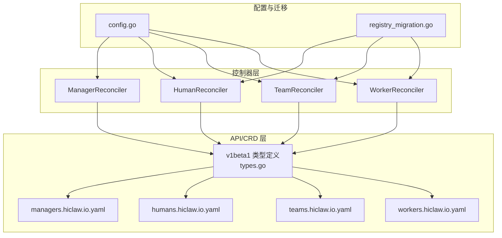
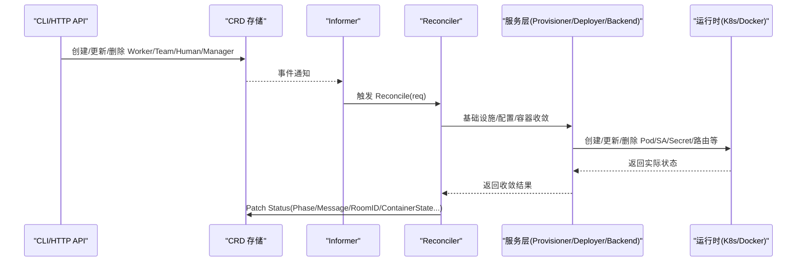
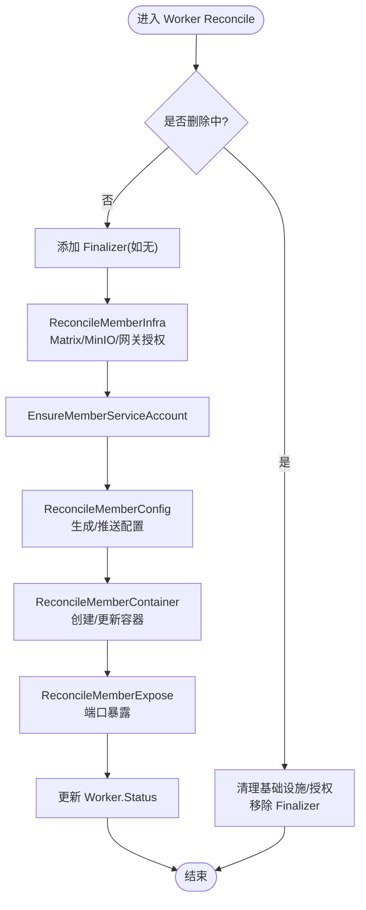
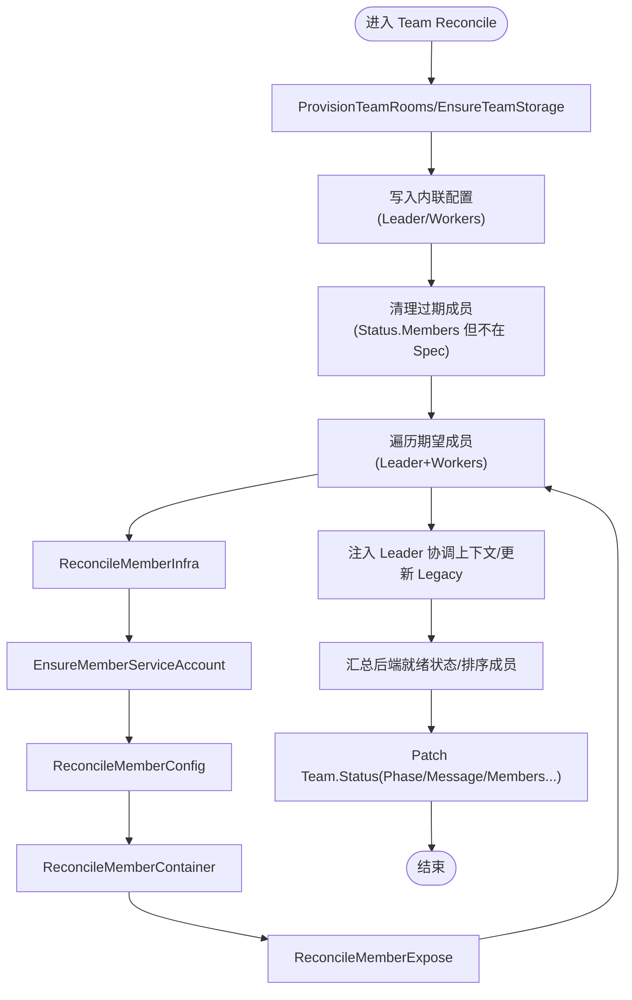
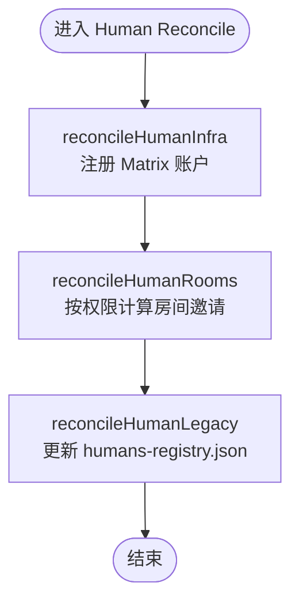
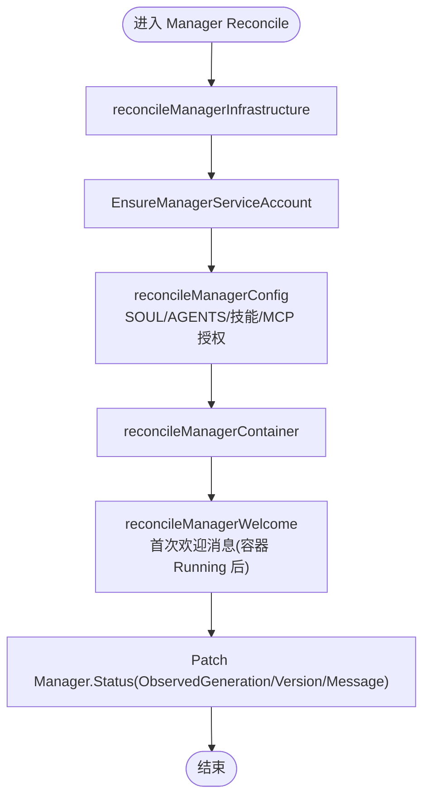
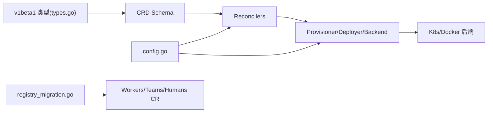

# 声明式资源管理

<cite>
**本文引用的文件**
- [hiclaw-controller/api/v1beta1/types.go](file://hiclaw-controller/api/v1beta1/types.go)
- [hiclaw-controller/config/crd/workers.hiclaw.io.yaml](file://hiclaw-controller/config/crd/workers.hiclaw.io.yaml)
- [hiclaw-controller/config/crd/managers.hiclaw.io.yaml](file://hiclaw-controller/config/crd/managers.hiclaw.io.yaml)
- [hiclaw-controller/config/crd/humans.hiclaw.io.yaml](file://hiclaw-controller/config/crd/humans.hiclaw.io.yaml)
- [hiclaw-controller/config/crd/teams.hiclaw.io.yaml](file://hiclaw-controller/config/crd/teams.hiclaw.io.yaml)
- [hiclaw-controller/internal/controller/worker_controller.go](file://hiclaw-controller/internal/controller/worker_controller.go)
- [hiclaw-controller/internal/controller/team_controller.go](file://hiclaw-controller/internal/controller/team_controller.go)
- [hiclaw-controller/internal/controller/human_controller.go](file://hiclaw-controller/internal/controller/human_controller.go)
- [hiclaw-controller/internal/controller/manager_controller.go](file://hiclaw-controller/internal/controller/manager_controller.go)
- [hiclaw-controller/cmd/controller/main.go](file://hiclaw-controller/cmd/controller/main.go)
- [hiclaw-controller/internal/migration/registry_migration.go](file://hiclaw-controller/internal/migration/registry_migration.go)
- [hiclaw-controller/internal/config/config.go](file://hiclaw-controller/internal/config/config.go)
- [docs/zh-cn/declarative-resource-management.md](file://docs/zh-cn/declarative-resource-management.md)
- [docs/declarative-resource-management.md](file://docs/declarative-resource-management.md)
</cite>

## 目录
1. [简介](#简介)
2. [项目结构](#项目结构)
3. [核心组件](#核心组件)
4. [架构总览](#架构总览)
5. [详细组件分析](#详细组件分析)
6. [依赖关系分析](#依赖关系分析)
7. [性能考量](#性能考量)
8. [故障排查指南](#故障排查指南)
9. [结论](#结论)
10. [附录](#附录)

## 简介
HiClaw 采用 Kubernetes CRD 风格的声明式 YAML 来管理平台资源，核心围绕四种资源类型：Worker（工作节点）、Team（协作组）、Human（真人用户）、Manager（协调代理）。你只需描述期望状态，hiclaw-controller 会自动完成基础设施 provision、配置下发、容器编排与状态修复，实现“所写即所得”的一致性运维。

声明式配置相较传统命令式配置的优势：
- 可重复性与幂等性：控制器持续收敛，即使中间失败也会在下次重试中修复。
- 可审计与可回溯：CR 的 spec 与 status 记录了变更轨迹，便于审计与排障。
- 声明式意图：关注“要什么”而非“怎么做”，降低人为操作错误。
- 自动修复：当实际状态偏离期望时，控制器自动触发修复流程，减少手工干预。

## 项目结构
HiClaw 的声明式资源管理由控制器、CRD、配置与文档共同组成：
- CRD 定义：在 config/crd 下定义 Worker、Team、Human、Manager 的 OpenAPI v3 模式与列印列。
- API 类型：在 api/v1beta1 中定义 Go 结构体与字段语义。
- 控制器：在 internal/controller 下实现 WorkerReconciler、TeamReconciler、HumanReconciler、ManagerReconciler。
- 配置与迁移：internal/config 提供运行时配置加载；internal/migration 提供从旧版 registry 的迁移。
- 文档：docs/zh-cn 与 docs 提供中文与英文的声明式资源管理说明与示例。

图表来源
- [hiclaw-controller/api/v1beta1/types.go:1-448](file://hiclaw-controller/api/v1beta1/types.go#L1-L448)
- [hiclaw-controller/config/crd/workers.hiclaw.io.yaml:1-204](file://hiclaw-controller/config/crd/workers.hiclaw.io.yaml#L1-L204)
- [hiclaw-controller/config/crd/teams.hiclaw.io.yaml:1-351](file://hiclaw-controller/config/crd/teams.hiclaw.io.yaml#L1-L351)
- [hiclaw-controller/config/crd/humans.hiclaw.io.yaml:1-84](file://hiclaw-controller/config/crd/humans.hiclaw.io.yaml#L1-L84)
- [hiclaw-controller/config/crd/managers.hiclaw.io.yaml:1-171](file://hiclaw-controller/config/crd/managers.hiclaw.io.yaml#L1-L171)
- [hiclaw-controller/internal/controller/worker_controller.go:1-407](file://hiclaw-controller/internal/controller/worker_controller.go#L1-L407)
- [hiclaw-controller/internal/controller/team_controller.go:1-1003](file://hiclaw-controller/internal/controller/team_controller.go#L1-L1003)
- [hiclaw-controller/internal/controller/human_controller.go:1-103](file://hiclaw-controller/internal/controller/human_controller.go#L1-L103)
- [hiclaw-controller/internal/controller/manager_controller.go:1-189](file://hiclaw-controller/internal/controller/manager_controller.go#L1-L189)
- [hiclaw-controller/internal/config/config.go:1-680](file://hiclaw-controller/internal/config/config.go#L1-L680)
- [hiclaw-controller/internal/migration/registry_migration.go:1-482](file://hiclaw-controller/internal/migration/registry_migration.go#L1-L482)

章节来源
- [hiclaw-controller/api/v1beta1/types.go:1-448](file://hiclaw-controller/api/v1beta1/types.go#L1-L448)
- [hiclaw-controller/config/crd/workers.hiclaw.io.yaml:1-204](file://hiclaw-controller/config/crd/workers.hiclaw.io.yaml#L1-L204)
- [hiclaw-controller/config/crd/teams.hiclaw.io.yaml:1-351](file://hiclaw-controller/config/crd/teams.hiclaw.io.yaml#L1-L351)
- [hiclaw-controller/config/crd/humans.hiclaw.io.yaml:1-84](file://hiclaw-controller/config/crd/humans.hiclaw.io.yaml#L1-L84)
- [hiclaw-controller/config/crd/managers.hiclaw.io.yaml:1-171](file://hiclaw-controller/config/crd/managers.hiclaw.io.yaml#L1-L171)

## 核心组件
- CRD 与 API 类型：定义资源的结构、字段约束、状态字段与打印列，确保客户端与控制器对资源有一致理解。
- Reconciler 控制器：基于 controller-runtime 实现 Reconciler 模式，负责状态同步、变更检测与自动修复。
- 配置系统：从环境变量与配置文件加载运行参数，决定后端、网关、存储、矩阵服务等行为。
- 迁移器：将历史 registry 数据转换为 CR，保证升级后资源的一致性与可恢复性。

章节来源
- [hiclaw-controller/internal/controller/worker_controller.go:1-407](file://hiclaw-controller/internal/controller/worker_controller.go#L1-L407)
- [hiclaw-controller/internal/controller/team_controller.go:1-1003](file://hiclaw-controller/internal/controller/team_controller.go#L1-L1003)
- [hiclaw-controller/internal/controller/human_controller.go:1-103](file://hiclaw-controller/internal/controller/human_controller.go#L1-L103)
- [hiclaw-controller/internal/controller/manager_controller.go:1-189](file://hiclaw-controller/internal/controller/manager_controller.go#L1-L189)
- [hiclaw-controller/internal/config/config.go:1-680](file://hiclaw-controller/internal/config/config.go#L1-L680)
- [hiclaw-controller/internal/migration/registry_migration.go:1-482](file://hiclaw-controller/internal/migration/registry_migration.go#L1-L482)

## 架构总览
控制器通过 informer 监听 CR 的创建/更新/删除事件，触发对应 Reconciler 执行收敛逻辑。Reconciler 通过 Provisioner/Deployer/Backend 等服务层协调基础设施与容器运行时，最终使实际状态与期望状态一致。

图表来源
- [hiclaw-controller/internal/controller/worker_controller.go:57-151](file://hiclaw-controller/internal/controller/worker_controller.go#L57-L151)
- [hiclaw-controller/internal/controller/team_controller.go:76-305](file://hiclaw-controller/internal/controller/team_controller.go#L76-L305)
- [hiclaw-controller/internal/controller/human_controller.go:29-96](file://hiclaw-controller/internal/controller/human_controller.go#L29-L96)
- [hiclaw-controller/internal/controller/manager_controller.go:72-160](file://hiclaw-controller/internal/controller/manager_controller.go#L72-L160)

## 详细组件分析

### Worker 资源与控制器
- 资源定义：Worker 表示一个 AI Agent 工作节点，包含模型、运行时、镜像、身份、技能、MCP 服务器、暴露端口、通信策略、期望生命周期等字段。
- CRD 约束：OpenAPI v3 schema 定义字段类型、枚举、必填项与描述；status 字段包含阶段、容器状态、最后心跳、消息与暴露端口。
- Reconciler 流程：基础设施（Matrix 房间、MinIO 用户/桶、网关授权）→ ServiceAccount → 配置生成与推送 → 容器创建/更新 → 端口暴露 → 更新状态。
- 删除流程：清理基础设施与授权，移除 Finalizer。

图表来源
- [hiclaw-controller/internal/controller/worker_controller.go:110-151](file://hiclaw-controller/internal/controller/worker_controller.go#L110-L151)
- [hiclaw-controller/config/crd/workers.hiclaw.io.yaml:11-184](file://hiclaw-controller/config/crd/workers.hiclaw.io.yaml#L11-L184)

章节来源
- [hiclaw-controller/api/v1beta1/types.go:64-153](file://hiclaw-controller/api/v1beta1/types.go#L64-L153)
- [hiclaw-controller/config/crd/workers.hiclaw.io.yaml:1-204](file://hiclaw-controller/config/crd/workers.hiclaw.io.yaml#L1-L204)
- [hiclaw-controller/internal/controller/worker_controller.go:1-407](file://hiclaw-controller/internal/controller/worker_controller.go#L1-L407)

### Team 资源与控制器
- 资源定义：Team 由 Leader 与多个 Worker 组成，支持团队级通信策略、Peer Mention、Admin、Worker 列表等。
- CRD 约束：OpenAPI v3 schema 定义 leader、workers、admin、channelPolicy 等字段；status 包含团队房间、Leader DM 房间、Leader 就绪、Worker 就绪数、成员状态等。
- Reconciler 流程：团队级基础设施（房间、共享存储）→ 清理过期成员 → 逐成员收敛（Leader 先于 Worker）→ 注入 Leader 协调上下文 → 汇总后端就绪状态 → 更新 Team.Status。
- 成员状态：每成员包含房间 ID、Matrix 用户 ID、规格哈希、观察标记、就绪状态、暴露端口等。

图表来源
- [hiclaw-controller/internal/controller/team_controller.go:108-305](file://hiclaw-controller/internal/controller/team_controller.go#L108-L305)
- [hiclaw-controller/config/crd/teams.hiclaw.io.yaml:1-351](file://hiclaw-controller/config/crd/teams.hiclaw.io.yaml#L1-L351)

章节来源
- [hiclaw-controller/api/v1beta1/types.go:159-325](file://hiclaw-controller/api/v1beta1/types.go#L159-L325)
- [hiclaw-controller/config/crd/teams.hiclaw.io.yaml:1-351](file://hiclaw-controller/config/crd/teams.hiclaw.io.yaml#L1-L351)
- [hiclaw-controller/internal/controller/team_controller.go:1-1003](file://hiclaw-controller/internal/controller/team_controller.go#L1-L1003)

### Human 资源与控制器
- 资源定义：Human 代表真人用户，包含显示名、邮箱、权限等级、可访问 Team/Worker 列表等；状态包含阶段、Matrix 用户 ID、初始密码、房间列表、邮件发送标记等。
- CRD 约束：OpenAPI v3 schema 定义 displayName、permissionLevel、accessibleTeams、accessibleWorkers 等字段；status 包含 phase、matrixUserID、initialPassword、rooms、emailSent、message。
- Reconciler 流程：基础设施（Matrix 账户）→ 房间权限（按权限等级计算）→ Legacy（更新 humans-registry.json）→ 定期重试（非致命错误仅记录日志）。

图表来源
- [hiclaw-controller/internal/controller/human_controller.go:29-96](file://hiclaw-controller/internal/controller/human_controller.go#L29-L96)
- [hiclaw-controller/config/crd/humans.hiclaw.io.yaml:1-84](file://hiclaw-controller/config/crd/humans.hiclaw.io.yaml#L1-L84)

章节来源
- [hiclaw-controller/api/v1beta1/types.go:331-363](file://hiclaw-controller/api/v1beta1/types.go#L331-L363)
- [hiclaw-controller/config/crd/humans.hiclaw.io.yaml:1-84](file://hiclaw-controller/config/crd/humans.hiclaw.io.yaml#L1-L84)
- [hiclaw-controller/internal/controller/human_controller.go:1-103](file://hiclaw-controller/internal/controller/human_controller.go#L1-L103)

### Manager 资源与控制器
- 资源定义：Manager 表示协调代理，包含模型、运行时、镜像、SOUL/AGENTS、技能、MCP 服务器、配置（心跳间隔、Worker 空闲超时、通知频道）、期望生命周期等；状态包含阶段、容器状态、版本、消息、欢迎消息发送标记等。
- CRD 约束：OpenAPI v3 schema 定义 model、runtime、image、soul、agents、skills、mcpServers、package、config、state、labels、accessEntries 等字段；status 包含 observedGeneration、phase、matrixUserID、roomID、containerState、version、message、welcomeSent。
- Reconciler 流程：基础设施（Matrix 房间、SA）→ 配置（SOUL/AGENTS/技能/MCP 授权）→ 容器（创建/更新）→ 首次启动欢迎消息（待容器 Running 后）→ 更新状态。

图表来源
- [hiclaw-controller/internal/controller/manager_controller.go:72-160](file://hiclaw-controller/internal/controller/manager_controller.go#L72-L160)
- [hiclaw-controller/config/crd/managers.hiclaw.io.yaml:1-171](file://hiclaw-controller/config/crd/managers.hiclaw.io.yaml#L1-L171)

章节来源
- [hiclaw-controller/api/v1beta1/types.go:372-447](file://hiclaw-controller/api/v1beta1/types.go#L372-L447)
- [hiclaw-controller/config/crd/managers.hiclaw.io.yaml:1-171](file://hiclaw-controller/config/crd/managers.hiclaw.io.yaml#L1-L171)
- [hiclaw-controller/internal/controller/manager_controller.go:1-189](file://hiclaw-controller/internal/controller/manager_controller.go#L1-L189)

### Reconciler 模式与状态同步
- 变更检测：Worker/Team 通过 Generation 与 ObservedGeneration 的差异判断 spec 是否变更；Team 还维护 per-member 的 SpecHash，避免不必要的重建。
- 自动修复：控制器在每次 Reconcile 中尝试将实际状态收敛到期望状态；失败时记录 message，Phase 保持稳定，直到修复成功。
- 删除保护：使用 Finalizer 保证删除前清理基础设施与授权，避免资源泄漏。

章节来源
- [hiclaw-controller/internal/controller/worker_controller.go:273-309](file://hiclaw-controller/internal/controller/worker_controller.go#L273-L309)
- [hiclaw-controller/internal/controller/team_controller.go:744-787](file://hiclaw-controller/internal/controller/team_controller.go#L744-L787)

## 依赖关系分析
- 控制器依赖 API 类型与 CRD：Reconciler 读取 CR 的 spec，写入 status；CRD schema 保障字段合法性。
- 控制器依赖服务层：Provisioner 负责 Matrix/MinIO/网关授权；Deployer 负责配置与容器部署；Backend 负责后端状态查询。
- 配置驱动行为：config.go 从环境变量加载运行参数，影响后端选择、网关/存储提供商、默认运行时、资源配额等。
- 迁移器依赖 OSS 与动态客户端：从 workers-registry.json/teams-registry.json/humans-registry.json 读取历史数据，转换为 CR。

图表来源
- [hiclaw-controller/api/v1beta1/types.go:1-448](file://hiclaw-controller/api/v1beta1/types.go#L1-L448)
- [hiclaw-controller/internal/config/config.go:1-680](file://hiclaw-controller/internal/config/config.go#L1-L680)
- [hiclaw-controller/internal/migration/registry_migration.go:1-482](file://hiclaw-controller/internal/migration/registry_migration.go#L1-L482)

章节来源
- [hiclaw-controller/internal/config/config.go:1-680](file://hiclaw-controller/internal/config/config.go#L1-L680)
- [hiclaw-controller/internal/migration/registry_migration.go:1-482](file://hiclaw-controller/internal/migration/registry_migration.go#L1-L482)

## 性能考量
- 重试与重入：控制器设置固定重试间隔与失败重试延迟，避免频繁轮询造成压力。
- 状态缓存与合并：通过 Status().Patch 使用 MergePatch，减少不必要的写放大。
- 后端可达性：TeamReconciler 在后端不可达时保留先前就绪状态，避免抖动。
- Pod 事件过滤：通过 predicates 仅在 Pod 生命周期关键事件触发 Reconcile，降低无关事件开销。

章节来源
- [hiclaw-controller/internal/controller/worker_controller.go:24-28](file://hiclaw-controller/internal/controller/worker_controller.go#L24-L28)
- [hiclaw-controller/internal/controller/team_controller.go:353-387](file://hiclaw-controller/internal/controller/team_controller.go#L353-L387)
- [hiclaw-controller/internal/controller/worker_controller.go:344-386](file://hiclaw-controller/internal/controller/worker_controller.go#L344-L386)

## 故障排查指南
- 查看资源状态：使用 kubectl get wk/tm/hm/mgr -o wide 查看 Phase、Age、打印列。
- 查看控制器日志：控制器通过 zap 日志输出，关注 Reconcile 循环与错误 message。
- 检查权限与授权：确认 accessEntries 与 MCP 授权是否正确下发；检查网关消费者密钥与对象存储作用域。
- 迁移问题：若从旧版本升级，确认 registry_migration 是否成功创建 CR；必要时检查 workers-registry.json/teams-registry.json/humans-registry.json 是否存在且可读。
- 环境变量：核对 HICLAW_* 环境变量，特别是 HICLAW_KUBE_MODE、HICLAW_GATEWAY_PROVIDER、HICLAW_STORAGE_PROVIDER、HICLAW_DEFAULT_WORKER_RUNTIME 等。

章节来源
- [docs/zh-cn/declarative-resource-management.md:1-960](file://docs/zh-cn/declarative-resource-management.md#L1-L960)
- [docs/declarative-resource-management.md:1-960](file://docs/declarative-resource-management.md#L1-L960)
- [hiclaw-controller/internal/migration/registry_migration.go:48-115](file://hiclaw-controller/internal/migration/registry_migration.go#L48-L115)

## 结论
HiClaw 的声明式资源管理以 CRD 为核心，结合 Reconciler 模式实现了高度自动化与可恢复的资源编排。通过 Worker、Team、Human、Manager 四类资源的协同，平台能够在声明式 YAML 的驱动下，自动完成基础设施 provision、配置下发与容器编排，显著提升可运维性与一致性。配合完善的配置体系与迁移能力，用户可以平滑地从旧版本过渡到新架构，并在生产环境中获得稳定的运行体验。

## 附录

### YAML 配置示例与最佳实践
- Worker 基础配置与自定义包、MCP 服务器、暴露端口、通信策略、期望生命周期等字段参考文档。
- Team 基础配置与 Leader/Worker 列表、Peer Mention、Admin、通信策略等字段参考文档。
- Manager 基础配置与模型、运行时、镜像、SOUL/AGENTS、技能、MCP 服务器、配置（心跳间隔、Worker 空闲超时、通知频道）、期望生命周期等字段参考文档。
- Human 基础配置与权限等级（1/2/3）、可访问 Team/Worker 列表、显示名、邮箱等字段参考文档。
- 批量部署：使用多文档 YAML（--- 分隔），按依赖顺序放置 Team 在 Human 之前，独立 Worker 在 L3 Human 之前。
- 操作方式：推荐使用 hiclaw-apply.sh 声明式 Apply；也可使用 hiclaw CLI 或 HTTP API；导入 Worker 可使用 hiclaw-import.sh。

章节来源
- [docs/zh-cn/declarative-resource-management.md:41-782](file://docs/zh-cn/declarative-resource-management.md#L41-L782)
- [docs/declarative-resource-management.md:41-782](file://docs/declarative-resource-management.md#L41-L782)

### 配置验证、版本管理与迁移策略
- 配置验证：CRD schema 严格校验字段类型、枚举与必填项；Reconciler 在失败时写入 status.message，便于定位问题。
- 版本管理：v1beta1 为当前 API 版本，字段演进遵循稳定性契约（如 omitempty 与零值语义），避免因 JSON 键变更导致的全量重建。
- 迁移策略：registry_migration 在控制器启动时扫描 workers-registry.json/teams-registry.json/humans-registry.json，将历史数据转换为 CR；迁移过程幂等，避免重复创建。

章节来源
- [hiclaw-controller/config/crd/workers.hiclaw.io.yaml:11-184](file://hiclaw-controller/config/crd/workers.hiclaw.io.yaml#L11-L184)
- [hiclaw-controller/config/crd/teams.hiclaw.io.yaml:11-328](file://hiclaw-controller/config/crd/teams.hiclaw.io.yaml#L11-L328)
- [hiclaw-controller/config/crd/humans.hiclaw.io.yaml:11-61](file://hiclaw-controller/config/crd/humans.hiclaw.io.yaml#L11-L61)
- [hiclaw-controller/config/crd/managers.hiclaw.io.yaml:11-151](file://hiclaw-controller/config/crd/managers.hiclaw.io.yaml#L11-L151)
- [hiclaw-controller/internal/migration/registry_migration.go:25-115](file://hiclaw-controller/internal/migration/registry_migration.go#L25-L115)