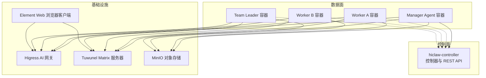
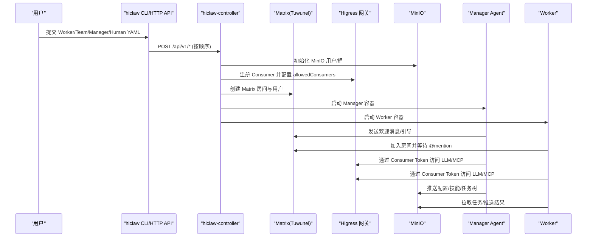
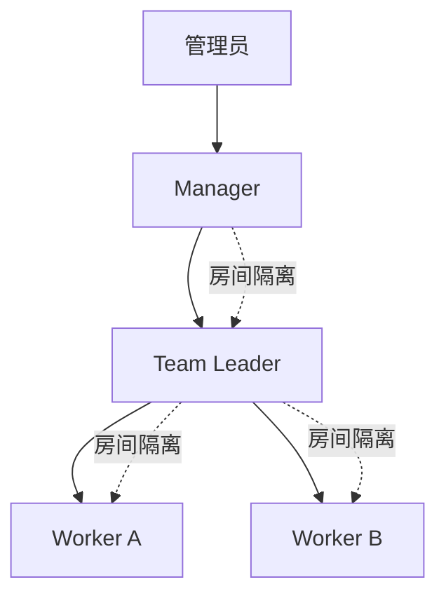
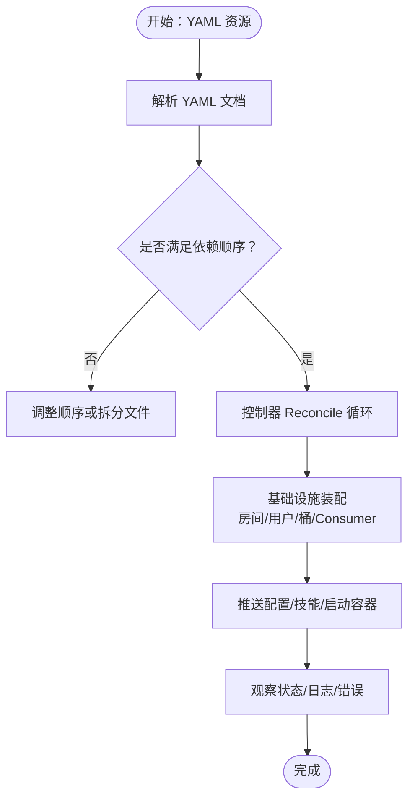
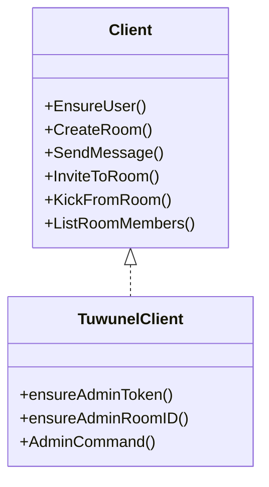
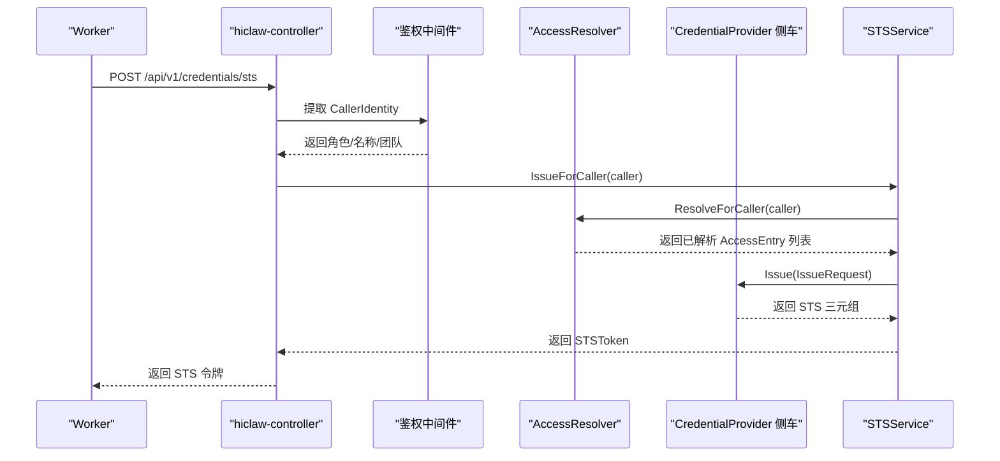
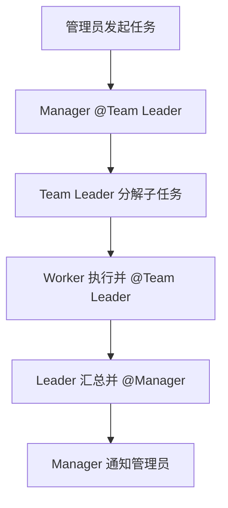
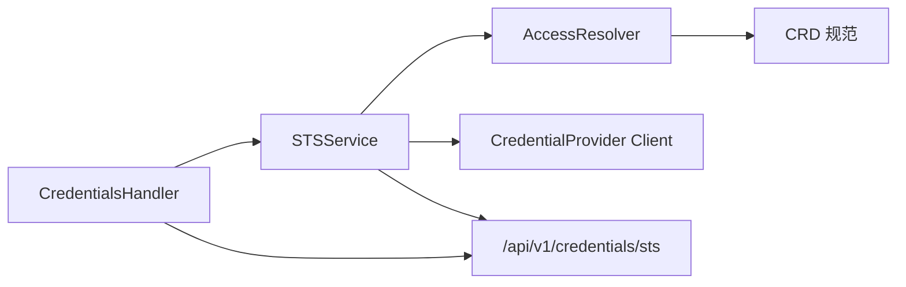

# 核心概念

<cite>
**本文引用的文件**
- [README.md](file://README.md)
- [docs/architecture.md](file://docs/architecture.md)
- [docs/declarative-resource-management.md](file://docs/declarative-resource-management.md)
- [docs/k8s-native-agent-orch.md](file://docs/k8s-native-agent-orch.md)
- [copaw/src/matrix/README.md](file://copaw/src/matrix/README.md)
- [hermes/README.md](file://hermes/README.md)
- [hiclaw-controller/internal/matrix/client.go](file://hiclaw-controller/internal/matrix/client.go)
- [hiclaw-controller/internal/credentials/sts.go](file://hiclaw-controller/internal/credentials/sts.go)
- [hiclaw-controller/internal/credprovider/types.go](file://hiclaw-controller/internal/credprovider/types.go)
- [hiclaw-controller/internal/accessresolver/resolver.go](file://hiclaw-controller/internal/accessresolver/resolver.go)
- [hiclaw-controller/internal/server/credentials_handler.go](file://hiclaw-controller/internal/server/credentials_handler.go)
- [manager/agent/copaw-manager-agent/AGENTS.md](file://manager/agent/copaw-manager-agent/AGENTS.md)
- [manager/agent/hermes-worker-agent/AGENTS.md](file://manager/agent/hermes-worker-agent/AGENTS.md)
</cite>

## 目录
1. [引言](#引言)
2. [项目结构](#项目结构)
3. [核心组件](#核心组件)
4. [架构总览](#架构总览)
5. [详细组件分析](#详细组件分析)
6. [依赖分析](#依赖分析)
7. [性能考虑](#性能考虑)
8. [故障排查指南](#故障排查指南)
9. [结论](#结论)
10. [附录](#附录)

## 引言
本文件面向 HiClaw 平台使用者与贡献者，系统性阐述平台的核心概念与设计思想，重点覆盖：
- Manager-Workers 架构：协调器与工作者的关系、职责边界与协作流程
- 声明式资源管理：对比传统配置管理的优势与落地方式
- Matrix 协议在平台中的应用：去中心化通信与可见性保障
- 凭据安全管理机制：零凭证暴露的安全模型与 STS 短期令牌策略
- 人类在回路（Human-in-the-Loop）：设计理念与实现路径
- 概念图与架构图：帮助读者建立完整的知识体系

## 项目结构
HiClaw 采用“控制面 + 数据面”的分层组织：
- 控制面（hiclaw-controller）：Kubernetes 原生控制器，负责 Worker/Team/Manager/Human 四类资源的声明式编排、基础设施装配与生命周期管理
- 数据面（Manager/Workers）：运行时容器，承载 Agent 逻辑，通过 Matrix 通信、Higress 网关访问外部服务、MinIO 共享存储持久化状态
- 通信与安全：Matrix（Tuwunel）作为协作层；Higress 作为 AI 网关与 MCP 托管；凭据侧通过 STS 短期令牌实现“零凭证暴露”

图表来源
- [docs/architecture.md:19-82](file://docs/architecture.md#L19-L82)
- [docs/k8s-native-agent-orch.md:464-477](file://docs/k8s-native-agent-orch.md#L464-L477)

章节来源
- [docs/architecture.md:1-16](file://docs/architecture.md#L1-L16)
- [docs/k8s-native-agent-orch.md:1-39](file://docs/k8s-native-agent-orch.md#L1-L39)

## 核心组件
- 控制器（hiclaw-controller）
  - 负责 Worker/Team/Manager/Human 的 CRD 编排、房间与用户创建、Higress Consumer 注册、MinIO 用户与桶初始化、配置推送与同步
  - 提供 REST API（默认端口 8090），被 Manager/CLI 使用
- 管理员代理（Manager Agent）
  - 协调任务路由、团队委派、工作者生命周期与权限矩阵，提供人类可干预的可见性
- 工作者（Worker）
  - 任务执行单元，容器化运行，使用 Matrix 与 Manager/Team 成员通信，通过 Higress 访问 LLM/MCP，状态持久化于 MinIO
- Matrix（Tuwunel）
  - 去中心化即时通讯协议，提供房间拓扑、@提及策略、端到端加密与历史审计
- Higress 网关
  - AI 网关与 MCP 托管，基于 Consumer Token 实现细粒度授权与动态策略
- MinIO
  - S3 兼容对象存储，作为共享工作区与持久化后端

章节来源
- [docs/architecture.md:10-16](file://docs/architecture.md#L10-L16)
- [docs/k8s-native-agent-orch.md:464-477](file://docs/k8s-native-agent-orch.md#L464-L477)

## 架构总览
下图展示从声明到执行的关键链路：YAML 资源经控制器解析与装配，生成房间、消费者与存储空间，Manager/Workers 通过 Matrix 与 Higress 协作，MinIO 提供共享状态。

图表来源
- [docs/declarative-resource-management.md:784-800](file://docs/declarative-resource-management.md#L784-L800)
- [docs/k8s-native-agent-orch.md:203-228](file://docs/k8s-native-agent-orch.md#L203-L228)

章节来源
- [docs/declarative-resource-management.md:784-800](file://docs/declarative-resource-management.md#L784-L800)
- [docs/k8s-native-agent-orch.md:203-228](file://docs/k8s-native-agent-orch.md#L203-L228)

## 详细组件分析

### Manager-Workers 架构：协调与委派
- 角色分工
  - Manager：统一入口，负责任务路由、团队委派、权限矩阵与可见性
  - Team Leader：团队内的调度者，不直接执行领域任务，仅委派与汇总
  - Worker：具体任务执行者，容器化、无状态、可替换
- 关系与边界
  - Manager 不直接进入团队房间，避免成为瓶颈；Team Leader 与 Worker 在团队房间内协作
  - 人类管理员在所有相关房间中可见，支持随时干预
- 通信与策略
  - Matrix 房间拓扑与 @提及策略确保透明与可控
  - Channel Policy 支持组/私聊允许/拒绝列表的叠加与覆盖

图表来源
- [docs/declarative-resource-management.md:292-322](file://docs/declarative-resource-management.md#L292-L322)
- [docs/k8s-native-agent-orch.md:143-152](file://docs/k8s-native-agent-orch.md#L143-L152)

章节来源
- [docs/declarative-resource-management.md:257-322](file://docs/declarative-resource-management.md#L257-L322)
- [docs/k8s-native-agent-orch.md:143-152](file://docs/k8s-native-agent-orch.md#L143-L152)

### 声明式资源管理：对比与优势
- 传统配置管理痛点
  - 配置分散、变更不可审计、跨环境一致性差、运维复杂
- 声明式资源管理优势
  - 统一 API 版本与 CRD 结构，YAML 描述期望状态，控制器自动收敛
  - 可组合的资源模型：Worker/Team/Human/Manager，支持批量部署与依赖顺序
  - 可观测与可恢复：状态字段与错误信息便于定位问题
- 平台实践
  - 通过 hiclaw apply -f 顺序提交多文档，控制器按顺序处理
  - 支持包 URI（file://、http(s)://、nacos://、packages/）注入自定义配置与技能

图表来源
- [docs/declarative-resource-management.md:601-619](file://docs/declarative-resource-management.md#L601-L619)
- [docs/declarative-resource-management.md:784-800](file://docs/declarative-resource-management.md#L784-L800)

章节来源
- [docs/declarative-resource-management.md:1-52](file://docs/declarative-resource-management.md#L1-L52)
- [docs/declarative-resource-management.md:601-619](file://docs/declarative-resource-management.md#L601-L619)

### Matrix 协议与去中心化通信
- 设计目标
  - 透明：Agent 间通信与人类可审计的历史
  - 可干预：任何成员可随时加入与介入
  - 开放：基于 Matrix 协议，可联邦、可自托管
- 运行机制
  - Tuwunel 作为高性能 Homeserver，提供注册、房间、邀请、踢人、消息发送等能力
  - CoPaw/Hermes 等运行时通过 matrix-nio 适配器实现一致的提及策略、加密与房间模型
- 安全与合规
  - E2EE、历史缓冲、显示名提及、Markdown 渲染、打字指示等增强特性

图表来源
- [hiclaw-controller/internal/matrix/client.go:16-87](file://hiclaw-controller/internal/matrix/client.go#L16-L87)
- [hiclaw-controller/internal/matrix/client.go:89-112](file://hiclaw-controller/internal/matrix/client.go#L89-L112)

章节来源
- [copaw/src/matrix/README.md:1-97](file://copaw/src/matrix/README.md#L1-L97)
- [hermes/README.md:1-82](file://hermes/README.md#L1-L82)
- [hiclaw-controller/internal/matrix/client.go:16-87](file://hiclaw-controller/internal/matrix/client.go#L16-L87)

### 凭据安全管理：零凭证暴露模型
- 核心原则
  - 真正的密钥永远不出 Worker：由 Higress 网关注入真实凭证，Worker 仅持有可撤销的 Consumer Token
  - 动态授权：通过 allowedConsumers 实现按 Agent/任务维度的细粒度控制
- STS 短期令牌
  - 控制器通过 accessresolver 将 CR 中的 AccessEntry 解析为侧车可识别的已解析条目
  - 侧车以 OIDC/AKSK 等方式签发短期 STS 三元组，返回给控制器，再下发给 Worker
- Handler 与上下文
  - /api/v1/credentials/sts 由 CredentialsHandler 处理，从请求上下文中提取调用者身份，调用 STSService 签发令牌

图表来源
- [hiclaw-controller/internal/server/credentials_handler.go:21-42](file://hiclaw-controller/internal/server/credentials_handler.go#L21-L42)
- [hiclaw-controller/internal/credentials/sts.go:63-89](file://hiclaw-controller/internal/credentials/sts.go#L63-L89)
- [hiclaw-controller/internal/accessresolver/resolver.go:48-78](file://hiclaw-controller/internal/accessresolver/resolver.go#L48-L78)
- [hiclaw-controller/internal/credprovider/types.go:20-75](file://hiclaw-controller/internal/credprovider/types.go#L20-L75)

章节来源
- [hiclaw-controller/internal/credentials/sts.go:1-90](file://hiclaw-controller/internal/credentials/sts.go#L1-L90)
- [hiclaw-controller/internal/accessresolver/resolver.go:1-345](file://hiclaw-controller/internal/accessresolver/resolver.go#L1-L345)
- [hiclaw-controller/internal/server/credentials_handler.go:1-43](file://hiclaw-controller/internal/server/credentials_handler.go#L1-L43)
- [hiclaw-controller/internal/credprovider/types.go:1-75](file://hiclaw-controller/internal/credprovider/types.go#L1-L75)

### 人类在回路（Human-in-the-Loop）
- 设计理念
  - 每个房间都包含管理员与相关工作者，全程可见、随时干预
  - 通过 @提及与房间历史实现可审计的协作流
- 实现要点
  - Matrix 房间拓扑：Leader Room/Team Room/Worker Room/Leader DM
  - 权限矩阵：groupAllowFrom 限制可 @mention 的用户集合
  - 人类权限分级：L1（全局）、L2（团队范围）、L3（仅指定 Worker）

图表来源
- [docs/declarative-resource-management.md:305-322](file://docs/declarative-resource-management.md#L305-L322)
- [docs/k8s-native-agent-orch.md:378-392](file://docs/k8s-native-agent-orch.md#L378-L392)

章节来源
- [docs/declarative-resource-management.md:439-541](file://docs/declarative-resource-management.md#L439-L541)
- [docs/k8s-native-agent-orch.md:378-392](file://docs/k8s-native-agent-orch.md#L378-L392)

### 运行时与技能生态
- 运行时选择
  - OpenClaw/CoPaw/Hermes 三种运行时可共存于同一 IM 房间，通过 Matrix @提及协作
- 技能体系
  - Manager/Worker/Team Leader 各自具备不同技能集，Manager 可按需推送 Worker 技能
  - 技能目录结构与引用路径在各运行时中保持一致，便于复用

章节来源
- [docs/architecture.md:140-162](file://docs/architecture.md#L140-L162)
- [docs/declarative-resource-management.md:180-221](file://docs/declarative-resource-management.md#L180-L221)

## 依赖分析
- 控制器内部模块耦合
  - CredentialsHandler 依赖 STSService；STSService 依赖 AccessResolver 与 CredentialProvider 客户端
  - Matrix Client 抽象与 Tuwunel 实现分离，便于未来扩展其他 Homeserver
- 控制器与外部系统集成
  - Higress：Consumer 注册与 allowedConsumers 策略
  - MinIO：用户/桶/镜像同步
  - Matrix：用户注册/房间/消息/权限

图表来源
- [hiclaw-controller/internal/server/credentials_handler.go:12-42](file://hiclaw-controller/internal/server/credentials_handler.go#L12-L42)
- [hiclaw-controller/internal/credentials/sts.go:29-89](file://hiclaw-controller/internal/credentials/sts.go#L29-L89)
- [hiclaw-controller/internal/accessresolver/resolver.go:21-78](file://hiclaw-controller/internal/accessresolver/resolver.go#L21-L78)
- [hiclaw-controller/internal/credprovider/types.go:20-75](file://hiclaw-controller/internal/credprovider/types.go#L20-L75)

章节来源
- [hiclaw-controller/internal/server/credentials_handler.go:1-43](file://hiclaw-controller/internal/server/credentials_handler.go#L1-L43)
- [hiclaw-controller/internal/credentials/sts.go:1-90](file://hiclaw-controller/internal/credentials/sts.go#L1-L90)
- [hiclaw-controller/internal/accessresolver/resolver.go:1-345](file://hiclaw-controller/internal/accessresolver/resolver.go#L1-L345)
- [hiclaw-controller/internal/credprovider/types.go:1-75](file://hiclaw-controller/internal/credprovider/types.go#L1-L75)

## 性能考虑
- 低耦合高内聚：控制器通过 CRD 与外部系统交互，避免硬编码，便于横向扩展
- 事件驱动：基于 informer 的 Reconcile 循环，减少轮询开销
- 存储与网络：MinIO 与 Higress 的分离降低热点与单点风险
- 运行时多样性：不同运行时适合不同任务场景，可按需组合，提升整体吞吐

## 故障排查指南
- 常见问题定位
  - 控制器端：查看控制器日志与状态字段（如 status.message），确认资源阶段（Pending/Running/Failed）
  - 通信端：检查 Matrix 房间与 @提及策略，确认用户已加入房间且权限矩阵正确
  - 凭据端：确认 Consumer Token 是否有效、allowedConsumers 是否包含对应 Agent
- 调试工具
  - 导出 Matrix 消息与会话日志，结合代码库进行交叉分析
  - 使用 hiclaw CLI 获取资源详情与状态，核对期望与实际

章节来源
- [README.md:355-378](file://README.md#L355-L378)
- [docs/declarative-resource-management.md:141-152](file://docs/declarative-resource-management.md#L141-L152)

## 结论
HiClaw 以 Manager-Workers 架构为核心，结合声明式资源管理、Matrix 协议与 Higress 网关，构建了“可协作、可审计、可干预”的多智能体操作系统。通过 STS 短期令牌与零凭证暴露模型，平台在保证安全的同时实现了灵活的动态授权与快速策略变更。人类在回路的设计进一步提升了系统的透明度与可控性，适用于企业级的团队协作与自动化流水线。

## 附录
- 运行时与技能参考
  - CoPaw 运行时增强：E2EE、历史缓冲、提及处理、Markdown 渲染、DM 检测、打字指示
  - Hermes 运行时桥接：将 openclaw.json 映射为 hermes-agent 配置，复用 Matrix 策略
- 管理员与工作者行为规范
  - 管理员（CoPaw）：严格的消息发送规则、控制器 API 使用规范、每日记忆与长期记忆维护
  - 工作者（Hermes）：任务目录结构、进度与结果推送、MCP 工具调用与安全约束

章节来源
- [copaw/src/matrix/README.md:1-97](file://copaw/src/matrix/README.md#L1-L97)
- [hermes/README.md:1-82](file://hermes/README.md#L1-L82)
- [manager/agent/copaw-manager-agent/AGENTS.md:1-249](file://manager/agent/copaw-manager-agent/AGENTS.md#L1-L249)
- [manager/agent/hermes-worker-agent/AGENTS.md:1-225](file://manager/agent/hermes-worker-agent/AGENTS.md#L1-L225)