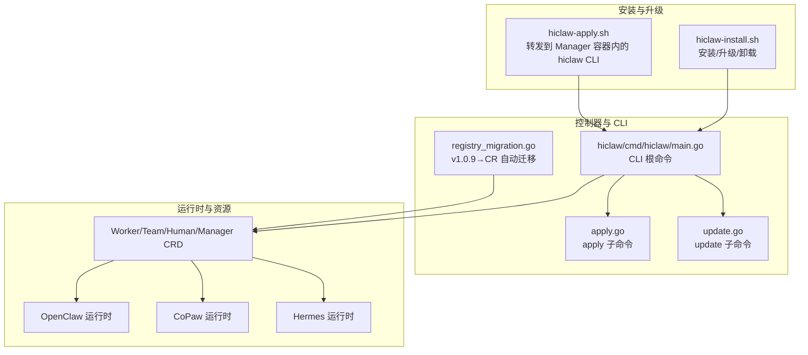
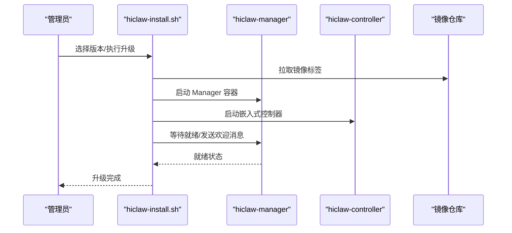
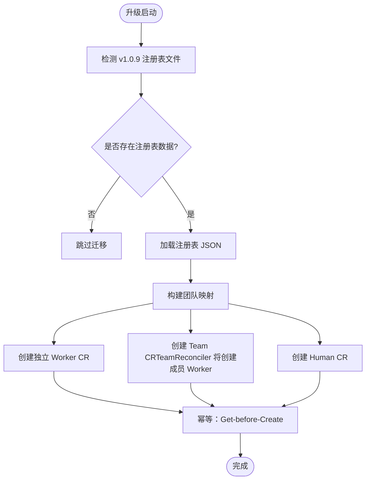
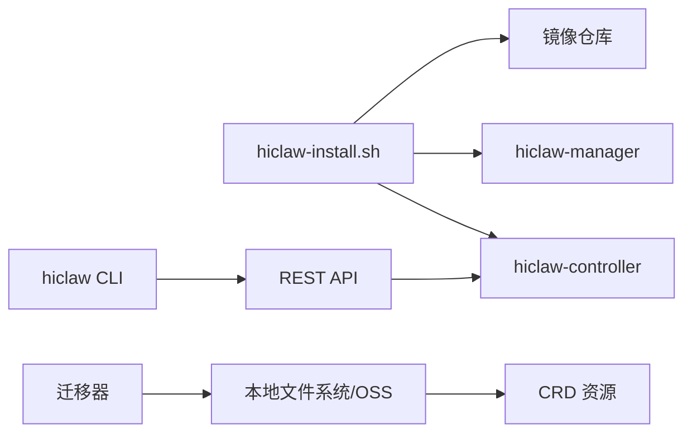

# 版本升级

<cite>
**本文引用的文件**
- [README.md](file://README.md)
- [hiclaw-install.sh](file://install/hiclaw-install.sh)
- [hiclaw-apply.sh](file://install/hiclaw-apply.sh)
- [main.go](file://hiclaw-controller/cmd/hiclaw/main.go)
- [apply.go](file://hiclaw-controller/cmd/hiclaw/apply.go)
- [update.go](file://hiclaw-controller/cmd/hiclaw/update.go)
- [registry_migration.go](file://hiclaw-controller/internal/migration/registry_migration.go)
- [v1.1.0.md](file://changelog/v1.1.0.md)
- [v1.0.9.md](file://changelog/v1.0.9.md)
- [v1.0.8.md](file://changelog/v1.0.8.md)
- [current.md](file://changelog/current.md)
- [upgrade-builtins.sh](file://manager/scripts/init/upgrade-builtins.sh)
</cite>

## 目录
1. [简介](#简介)
2. [项目结构](#项目结构)
3. [核心组件](#核心组件)
4. [架构总览](#架构总览)
5. [详细组件分析](#详细组件分析)
6. [依赖分析](#依赖分析)
7. [性能考虑](#性能考虑)
8. [故障排查指南](#故障排查指南)
9. [结论](#结论)
10. [附录](#附录)

## 简介
本文件面向 HiClaw 用户与运维人员，提供完整、可操作的版本升级指南与迁移说明。内容涵盖升级前准备、升级步骤、升级后验证、兼容性说明、迁移脚本使用、回滚与应急处理、版本新功能与改进、升级检查清单与验证步骤，以及常见问题与解决方案。

## 项目结构
HiClaw 采用“Manager-Workers 架构”，结合控制器（hiclaw-controller）与声明式资源（Worker/Team/Human/Manager）实现 Kubernetes 原生编排与多运行时协作。安装与升级主要通过安装脚本与 hiclaw CLI 完成，控制器提供 REST API 供 CLI 与安装脚本调用。

图表来源
- [hiclaw-install.sh:1-120](file://install/hiclaw-install.sh#L1-L120)
- [hiclaw-apply.sh:1-85](file://install/hiclaw-apply.sh#L1-L85)
- [main.go:9-35](file://hiclaw-controller/cmd/hiclaw/main.go#L9-L35)
- [apply.go:16-39](file://hiclaw-controller/cmd/hiclaw/apply.go#L16-L39)
- [update.go:9-18](file://hiclaw-controller/cmd/hiclaw/update.go#L9-L18)
- [registry_migration.go:25-115](file://hiclaw-controller/internal/migration/registry_migration.go#L25-L115)

章节来源
- [README.md:86-94](file://README.md#L86-L94)
- [hiclaw-install.sh:1-120](file://install/hiclaw-install.sh#L1-L120)
- [hiclaw-apply.sh:1-85](file://install/hiclaw-apply.sh#L1-L85)
- [main.go:9-35](file://hiclaw-controller/cmd/hiclaw/main.go#L9-L35)

## 核心组件
- 安装与升级脚本：负责版本选择、镜像拉取、容器编排、环境变量注入、就绪探测与欢迎消息发送。
- hiclaw CLI：提供 apply、update、worker、team、manager 等资源管理命令，通过 REST API 与控制器交互。
- 控制器迁移器：从 v1.0.9 的注册表文件自动迁移为 CRD 资源，保证 Worker/Team/Human 数据不丢失。
- 运行时支持：OpenClaw、CoPaw、Hermes 三类运行时可共存于同一 IM 房间，支持跨运行时消息投递与协作。

章节来源
- [hiclaw-install.sh:964-1031](file://install/hiclaw-install.sh#L964-L1031)
- [apply.go:16-39](file://hiclaw-controller/cmd/hiclaw/apply.go#L16-L39)
- [update.go:9-18](file://hiclaw-controller/cmd/hiclaw/update.go#L9-L18)
- [registry_migration.go:25-115](file://hiclaw-controller/internal/migration/registry_migration.go#L25-L115)

## 架构总览
升级路径分为两类：
- 单机/嵌入式模式（Embedded）：通过安装脚本拉取嵌入式控制器镜像与 Manager/Worker 镜像，完成就绪与欢迎消息流程。
- Kubernetes 模式（Helm）：通过 Helm 升级控制器与子图，实现 HA、RBAC、PVC 等企业级能力。

图表来源
- [hiclaw-install.sh:964-1031](file://install/hiclaw-install.sh#L964-L1031)
- [README.md:224-229](file://README.md#L224-L229)

章节来源
- [README.md:224-229](file://README.md#L224-L229)
- [hiclaw-install.sh:964-1031](file://install/hiclaw-install.sh#L964-L1031)

## 详细组件分析

### 升级前准备
- 确认当前版本与目标版本：通过安装脚本支持的版本选择与镜像标签解析，确保目标版本存在对应嵌入式镜像。
- 备份数据卷与环境文件：安装脚本在全新重装时会清理数据卷、网络与工作空间，升级前应备份重要文件。
- 网络与端口：确认端口映射与本地绑定策略，避免升级后端口冲突。
- 运行时选择：根据业务场景选择 Manager 与 Worker 的运行时（OpenClaw/CoPaw/Hermes），升级后可动态切换。

章节来源
- [hiclaw-install.sh:1547-1598](file://install/hiclaw-install.sh#L1547-L1598)
- [hiclaw-install.sh:1141-1175](file://install/hiclaw-install.sh#L1141-L1175)

### 升级步骤
- 单机/嵌入式模式
  - 使用安装脚本执行升级：支持指定版本或使用最新版本。
  - 安装脚本会解析镜像标签、拉取嵌入式控制器镜像与各运行时镜像，启动容器并等待就绪。
  - 若嵌入式镜像不可用，将给出明确错误与解决建议（回退到旧版本需显式开启强制标志）。
- Kubernetes 模式
  - 使用 Helm 升级：更新仓库索引后执行升级，保留现有 values 并应用新版本控制器与子图。
  - 控制器支持多副本 HA、Leader Election、RBAC、PVC 等企业特性。

章节来源
- [hiclaw-install.sh:964-1031](file://install/hiclaw-install.sh#L964-L1031)
- [README.md:224-229](file://README.md#L224-L229)

### 升级后验证
- Manager 就绪：安装脚本通过健康检查确认网关就绪与 Matrix 服务就绪。
- 欢迎消息：安装脚本等待并确认欢迎消息发送成功，否则提供手动触发与排查命令。
- CLI 可用：控制器容器内预装 hiclaw CLI，可直接查询资源状态。
- 资源一致性：通过 apply/update 命令验证 Worker/Team/Manager/人类资源状态与期望一致。

章节来源
- [hiclaw-install.sh:1087-1139](file://install/hiclaw-install.sh#L1087-L1139)
- [hiclaw-install.sh:768-787](file://install/hiclaw-install.sh#L768-L787)
- [main.go:9-35](file://hiclaw-controller/cmd/hiclaw/main.go#L9-L35)

### 兼容性说明
- v1.1.0 关键变更
  - 控制器架构重构：从单容器模式迁移到 Kubernetes 原生控制平面，引入 CRD 与控制器协调。
  - 新增 Hermes Worker 运行时，支持自主编码 Agent。
  - Helm Chart 企业级部署：支持 HA、RBAC、PVC、Pod 模板叠加与多租户凭证提供者。
  - 声明式 Worker 生命周期（spec.state）：支持 running/stopped 状态切换。
  - 自动迁移 v1.0.9 注册表数据到 CRD。
- v1.0.9 关键变更
  - 引入 hiclaw-controller 与声明式资源管理（Worker/Team/Human）。
  - Worker 模板市场与 MCP 直接代理。
  - Team Leader Agent 与 DAG 编排。
  - Worker 暴露服务（expose）与 CoPaw Manager 运行时。
- v1.0.8 关键变更
  - OpenClaw 升级至 v2026.3.8，提升稳定性。
  - 阿里云原生部署支持与 CoPaw Worker 支持。
  - Worker 导入系统与调试日志导出工具。

章节来源
- [v1.1.0.md:1-184](file://changelog/v1.1.0.md#L1-L184)
- [v1.0.9.md:1-203](file://changelog/v1.0.9.md#L1-L203)
- [v1.0.8.md:1-109](file://changelog/v1.0.8.md#L1-L109)

### 迁移脚本与策略
- 自动迁移（v1.0.9→CR）
  - 控制器在首次启动时扫描本地文件系统或 OSS 中的 workers-registry.json、teams-registry.json、humans-registry.json。
  - 将数据转换为 Worker/Team/Human CRD，并通过 Get-before-Create 保证幂等。
  - 迁移保留 Worker 运行时、模型、技能、MCP 服务器与团队成员关系。
- 手动迁移
  - 使用 hiclaw CLI 的 apply 子命令从 YAML 文件批量创建/更新资源。
  - 使用 update 子命令增量更新指定字段，避免全量替换。

图表来源
- [registry_migration.go:48-115](file://hiclaw-controller/internal/migration/registry_migration.go#L48-L115)
- [registry_migration.go:174-232](file://hiclaw-controller/internal/migration/registry_migration.go#L174-L232)

章节来源
- [registry_migration.go:25-115](file://hiclaw-controller/internal/migration/registry_migration.go#L25-L115)

### 回滚策略与应急处理
- 回滚策略
  - 单机/嵌入式模式：若升级后控制器镜像不可用，安装脚本会报错并提供解决路径（固定版本、等待发布、使用本地镜像或自定义镜像）。
  - Kubernetes 模式：使用 Helm rollback 回退到上一个受管版本。
- 应急处理
  - 控制器容器内预装 hiclaw CLI，可直接查询资源状态与版本。
  - 安装脚本提供欢迎消息等待与排查命令，便于人工介入。
  - 升级后如遇 Worker 无法加入房间或 MCP 服务器异常，检查控制器日志与路由授权状态。

章节来源
- [hiclaw-install.sh:1019-1031](file://install/hiclaw-install.sh#L1019-L1031)
- [main.go:9-35](file://hiclaw-controller/cmd/hiclaw/main.go#L9-L35)
- [v1.1.0.md:103-140](file://changelog/v1.1.0.md#L103-L140)

### 各版本新功能与改进
- v1.1.0
  - 控制器架构重构、Hermes 运行时、Helm Chart、声明式 Worker 生命周期、自动迁移。
- v1.0.9
  - 声明式资源管理、Worker 模板市场、MCP 直接代理、Team Leader 与 DAG 编排、Worker 暴露服务。
- v1.0.8
  - OpenClaw 升级、阿里云原生部署、Worker 导入系统、调试日志导出工具。

章节来源
- [v1.1.0.md:7-73](file://changelog/v1.1.0.md#L7-L73)
- [v1.0.9.md:7-41](file://changelog/v1.0.9.md#L7-L41)
- [v1.0.8.md:7-34](file://changelog/v1.0.8.md#L7-L34)

### 升级检查清单与验证步骤
- 升级前
  - 备份数据卷、环境文件与工作空间。
  - 记录当前版本与运行时配置。
  - 确认网络与端口策略。
- 升级中
  - 观察安装脚本输出与错误提示。
  - 等待 Manager 就绪与欢迎消息确认。
- 升级后
  - 使用 hiclaw CLI 查询资源状态与版本。
  - 验证 Worker/Team/Manager/人类资源一致性。
  - 测试跨运行时消息投递与 MCP 服务器连通性。

章节来源
- [hiclaw-install.sh:1087-1139](file://install/hiclaw-install.sh#L1087-L1139)
- [main.go:9-35](file://hiclaw-controller/cmd/hiclaw/main.go#L9-L35)

### 常见问题与解决方案
- 嵌入式镜像不可用
  - 现象：安装脚本报错提示嵌入式镜像不可用。
  - 解决：固定版本、等待发布、使用本地镜像或自定义镜像；必要时开启强制标志（谨慎使用）。
- 欢迎消息未送达
  - 现象：安装脚本等待欢迎消息超时。
  - 解决：手动触发 onboarding；检查 Higress 路由授权与 LLM 探活；使用控制器内 hiclaw CLI 检查状态。
- Worker 无法加入房间
  - 现象：Worker 启动后未加入 Matrix 房间。
  - 解决：控制器已修复该问题；若自建环境，确保服务端 JoinRoom 调用可用。
- MCP 服务器授权冲突
  - 现象：并发路由授权导致冲突或 403。
  - 解决：控制器已引入乐观锁重试；升级后问题应得到缓解。

章节来源
- [hiclaw-install.sh:1019-1031](file://install/hiclaw-install.sh#L1019-L1031)
- [hiclaw-install.sh:768-787](file://install/hiclaw-install.sh#L768-L787)
- [v1.1.0.md:103-140](file://changelog/v1.1.0.md#L103-L140)

## 依赖分析
- 安装脚本依赖镜像仓库与版本标签解析，确保目标版本存在嵌入式镜像。
- CLI 依赖控制器 REST API，提供资源创建/更新/查询能力。
- 迁移器依赖本地文件系统或 OSS，读取注册表数据并转换为 CRD。
- 运行时依赖矩阵与网关，跨运行时消息投递与 MCP 服务器通过控制器统一管理。

图表来源
- [hiclaw-install.sh:964-1031](file://install/hiclaw-install.sh#L964-L1031)
- [apply.go:16-39](file://hiclaw-controller/cmd/hiclaw/apply.go#L16-L39)
- [registry_migration.go:174-232](file://hiclaw-controller/internal/migration/registry_migration.go#L174-L232)

章节来源
- [hiclaw-install.sh:964-1031](file://install/hiclaw-install.sh#L964-L1031)
- [apply.go:16-39](file://hiclaw-controller/cmd/hiclaw/apply.go#L16-L39)
- [registry_migration.go:174-232](file://hiclaw-controller/internal/migration/registry_migration.go#L174-L232)

## 性能考虑
- 镜像拉取与层优化：v1.0.8 对镜像层顺序进行了优化，提升升级拉取速度。
- 控制器幂等与重试：迁移器与控制器在资源创建前进行查询，避免重复创建；并发授权引入乐观锁重试。
- 资源收敛：声明式资源管理通过控制器持续收敛，减少手工干预带来的不一致。

章节来源
- [v1.0.8.md:105-109](file://changelog/v1.0.8.md#L105-L109)
- [registry_migration.go:317-355](file://hiclaw-controller/internal/migration/registry_migration.go#L317-L355)

## 故障排查指南
- 日志导出：使用调试日志导出工具收集 Matrix 消息与 Agent 会话日志，辅助定位问题。
- 控制器内 CLI：在控制器容器内使用 hiclaw CLI 查询资源状态与版本，便于快速诊断。
- 欢迎消息等待：若超时，提供手动触发与排查命令；检查 Higress 路由授权与 LLM 探活。
- 迁移失败：检查注册表文件格式与权限；确认控制器对本地文件系统或 OSS 的访问。

章节来源
- [README.md:367-378](file://README.md#L367-L378)
- [main.go:9-35](file://hiclaw-controller/cmd/hiclaw/main.go#L9-L35)
- [hiclaw-install.sh:768-787](file://install/hiclaw-install.sh#L768-L787)
- [registry_migration.go:174-232](file://hiclaw-controller/internal/migration/registry_migration.go#L174-L232)

## 结论
HiClaw 的升级流程以安装脚本与 hiclaw CLI 为核心，结合控制器的声明式资源管理与自动迁移能力，确保升级过程可控、可观测、可回滚。建议在升级前做好数据备份与环境确认，升级后通过 CLI 与安装脚本提供的验证步骤进行核验，遇到问题时利用调试日志与控制器内 CLI 快速定位。

## 附录
- 升级检查清单
  - 备份数据卷、环境文件与工作空间
  - 记录当前版本与运行时配置
  - 确认网络与端口策略
  - 执行升级并等待就绪
  - 使用 CLI 验证资源状态与版本
  - 测试跨运行时消息与 MCP 服务器连通性
- 升级后验证步骤
  - Manager 就绪与欢迎消息确认
  - Worker/Team/Manager/人类资源一致性
  - 控制器内 CLI 查询与版本检查
  - 跨运行时消息投递与 MCP 服务器连通性测试

章节来源
- [hiclaw-install.sh:1087-1139](file://install/hiclaw-install.sh#L1087-L1139)
- [main.go:9-35](file://hiclaw-controller/cmd/hiclaw/main.go#L9-L35)
- [v1.1.0.md:1-184](file://changelog/v1.1.0.md#L1-L184)