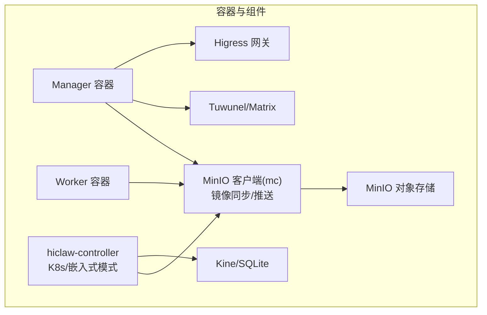
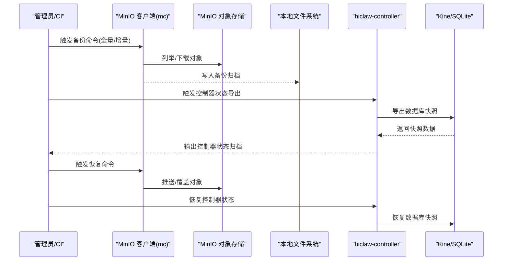
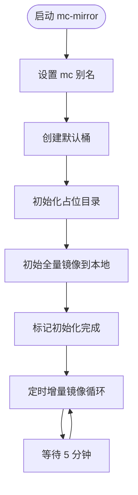
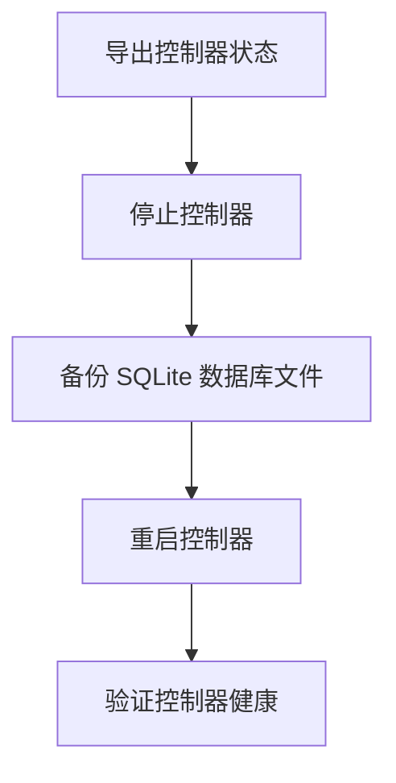
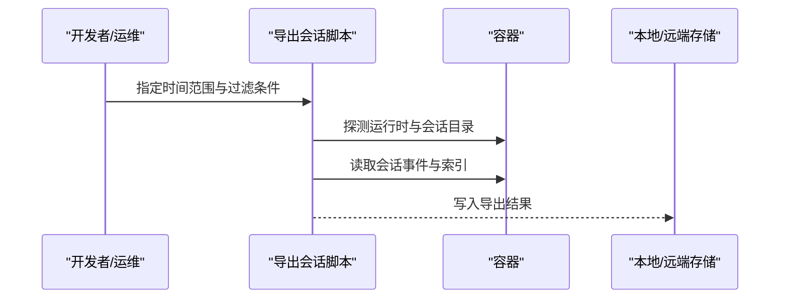

# 备份与恢复

<cite>
**本文引用的文件**
- [manager-guide.md](file://docs/zh-cn/manager-guide.md)
- [manager-guide.md](file://docs/manager-guide.md)
- [start-mc-mirror.sh](file://manager/scripts/init/start-mc-mirror.sh)
- [start-minio.sh](file://manager/scripts/init/start-minio.sh)
- [minio-statefulset.yaml](file://helm/hiclaw/templates/storage/minio-statefulset.yaml)
- [values.yaml](file://helm/hiclaw/values.yaml)
- [kine.go](file://hiclaw-controller/internal/store/kine.go)
- [types.go](file://hiclaw-controller/api/v1beta1/types.go)
- [minio_admin.go](file://hiclaw-controller/internal/oss/minio_admin.go)
- [types.go](file://hiclaw-controller/internal/oss/types.go)
- [config.go](file://hiclaw-controller/internal/config/config.go)
- [package.go](file://hiclaw-controller/internal/executor/package.go)
- [export-debug-log.py](file://scripts/export-debug-log.py)
- [smoke-test.sh](file://manager/tests/smoke-test.sh)
- [hiclaw-verify.sh](file://install/hiclaw-verify.sh)
- [base.sh](file://manager/scripts/lib/base.sh)
- [supervisord.conf](file://manager/supervisord.conf)
- [supervisord.embedded.conf](file://hiclaw-controller/supervisord.embedded.conf)
</cite>

## 目录
1. [简介](#简介)
2. [项目结构](#项目结构)
3. [核心组件](#核心组件)
4. [架构总览](#架构总览)
5. [详细组件分析](#详细组件分析)
6. [依赖关系分析](#依赖关系分析)
7. [性能考量](#性能考量)
8. [故障排查指南](#故障排查指南)
9. [结论](#结论)
10. [附录](#附录)

## 简介
本文件面向 HiClaw 的运维与平台工程团队，提供一套系统化的备份与恢复方案。内容覆盖：
- 数据备份策略：配置数据、会话记录、用户数据与系统日志的备份范围与方法
- 存储方案：本地备份、云存储备份与异地备份的配置与管理要点
- 自动化脚本：定时备份、增量/全量策略的落地建议与使用方法
- 恢复流程：完整恢复、部分恢复、点恢复的操作步骤
- 灾难恢复：RTO/RPO 目标设定、恢复时间估算与业务连续性保障
- 验证与监控：备份数据完整性与可恢复性验证、监控与告警配置

## 项目结构
HiClaw 的持久化数据主要由以下组件承载：
- Docker 卷 hiclaw-data：持久化存储根卷
- MinIO 对象存储：共享知识、任务、Worker 资料、声明式资源等
- 内嵌数据库（kine/SQLite）：控制器状态与元数据
- Matrix/Tuwunel：历史消息与房间元数据
- Higress：网关路由与消费者配置



图表来源
- [start-mc-mirror.sh:1-95](file://manager/scripts/init/start-mc-mirror.sh#L1-L95)
- [minio-statefulset.yaml:1-79](file://helm/hiclaw/templates/storage/minio-statefulset.yaml#L1-L79)
- [kine.go:1-56](file://hiclaw-controller/internal/store/kine.go#L1-L56)
- [values.yaml:72-111](file://helm/hiclaw/values.yaml#L72-L111)

章节来源
- [manager-guide.md:207-238](file://docs/zh-cn/manager-guide.md#L207-L238)
- [manager-guide.md:226-238](file://docs/manager-guide.md#L226-L238)

## 核心组件
- MinIO 对象存储
  - 用于存放共享知识、任务数据、Worker 配置、声明式资源等
  - 提供 S3 兼容接口，支持 mc 命令进行镜像与同步
- 本地持久化卷与镜像同步
  - Manager/Worker 侧通过 mc mirror 将 MinIO 中的共享数据拉取到本地
  - 本地写入完成后，由各端主动推送回 MinIO，避免后台同步导致的数据漂移
- 控制器与数据库
  - 控制器内置 kine/SQLite，作为声明式资源与状态的持久化后端
- Matrix/Tuwunel
  - 历史消息与房间元数据，作为会话与协作审计的重要来源
- Higress
  - 网关路由与消费者配置，属于系统配置类数据

章节来源
- [manager-guide.md:207-238](file://docs/zh-cn/manager-guide.md#L207-L238)
- [start-mc-mirror.sh:1-95](file://manager/scripts/init/start-mc-mirror.sh#L1-L95)
- [kine.go:1-56](file://hiclaw-controller/internal/store/kine.go#L1-L56)
- [minio-statefulset.yaml:1-79](file://helm/hiclaw/templates/storage/minio-statefulset.yaml#L1-L79)

## 架构总览
下图展示备份与恢复的关键数据流与组件交互。



图表来源
- [start-mc-mirror.sh:70-94](file://manager/scripts/init/start-mc-mirror.sh#L70-L94)
- [kine.go:28-55](file://hiclaw-controller/internal/store/kine.go#L28-L55)

## 详细组件分析

### MinIO 对象存储与镜像同步
- 设计原则
  - 本地写入方负责立即推送至 MinIO（显式 mc cp/mirror）
  - 远端修改后通过 Matrix 通知触发按需拉取
  - 定时拉取仅为安全网，不作为常规依赖
- 初始化与镜像
  - 启动时创建默认桶与占位目录
  - 初始全量镜像到本地 hiclaw-fs
  - 定时增量镜像（带 newer-than 过滤）作为兜底
- 关键路径
  - mc alias 设置、桶创建、占位目录初始化
  - 初始全量镜像与后续增量镜像循环



图表来源
- [start-mc-mirror.sh:42-94](file://manager/scripts/init/start-mc-mirror.sh#L42-L94)

章节来源
- [start-mc-mirror.sh:1-95](file://manager/scripts/init/start-mc-mirror.sh#L1-L95)

### 控制器状态与数据库备份
- 控制器状态来源
  - 声明式资源（Worker/Team/Human）与控制器内部状态
  - 通过 kine/SQLite 提供 etcd 兼容接口
- 备份策略
  - 全量：导出 SQLite 数据库文件
  - 增量：基于 WAL 日志的增量导出（视部署模式）
- 恢复策略
  - 停止控制器，恢复数据库文件，重启控制器



图表来源
- [kine.go:28-55](file://hiclaw-controller/internal/store/kine.go#L28-L55)

章节来源
- [kine.go:1-56](file://hiclaw-controller/internal/store/kine.go#L1-L56)

### 会话记录与任务历史备份
- 会话记录
  - OpenClaw/Copaw/Hermes 三类运行时的会话事件与索引
  - 支持导出指定时间范围内的会话事件，便于审计与问题复现
- 任务历史
  - Worker 本地维护最近若干任务的历史文件
  - 通过 MinIO 共享，支持跨节点/跨会话恢复上下文
- 备份建议
  - 定期导出会话日志与任务历史目录
  - 使用统一时间窗口进行增量备份



图表来源
- [export-debug-log.py:333-392](file://scripts/export-debug-log.py#L333-L392)
- [export-debug-log.py:627-670](file://scripts/export-debug-log.py#L627-L670)

章节来源
- [export-debug-log.py:1-756](file://scripts/export-debug-log.py#L1-L756)

### 用户数据与共享目录
- 用户主目录共享
  - 可选地将宿主机用户主目录映射到容器内，便于 Agent 访问
  - 适合需要直接读写宿主机文件的场景
- 备份建议
  - 对共享目录进行独立的文件级备份
  - 结合对象存储中的配置与任务数据，形成完整用户工作区备份

章节来源
- [manager-guide.md:218-224](file://docs/zh-cn/manager-guide.md#L218-L224)

### 系统日志与健康检查
- 日志位置
  - 控制器与基础设施日志集中于 hiclaw-controller 容器
  - Manager Agent、OpenClaw 运行时日志可通过容器内日志文件查看
- 健康检查
  - 提供针对 MinIO、Tuwunel、Higress 的健康探针
  - 支持外部访问检查与运行时健康检测

章节来源
- [manager-guide.md:160-198](file://docs/zh-cn/manager-guide.md#L160-L198)
- [smoke-test.sh:1-70](file://manager/tests/smoke-test.sh#L1-L70)
- [hiclaw-verify.sh:129-175](file://install/hiclaw-verify.sh#L129-L175)

## 依赖关系分析
- MinIO 与 mc 的依赖
  - mc alias、桶与占位目录初始化依赖 MinIO 可用
  - mc mirror 依赖正确的 S3 端口（非 Higress 网关端口）
- 控制器与数据库
  - 控制器启动依赖 kine/SQLite 正常运行
  - 备份/恢复需在控制器停止状态下进行
- 运行时与会话
  - 会话导出脚本依赖容器内运行时布局与会话目录存在

```mermaid
graph LR
MINIO["MinIO"] <- --> MC["mc 客户端"]
MC --> FS["本地/远端存储"]
CTRL["hiclaw-controller"] --> KINE["kine/SQLite"]
CTRL --> MINIO
SCRIPT["导出会话脚本"] --> CONT["容器运行时"]
CONT --> FS
```

图表来源
- [start-mc-mirror.sh:27-53](file://manager/scripts/init/start-mc-mirror.sh#L27-L53)
- [kine.go:28-55](file://hiclaw-controller/internal/store/kine.go#L28-L55)
- [export-debug-log.py:333-392](file://scripts/export-debug-log.py#L333-L392)

章节来源
- [start-mc-mirror.sh:27-53](file://manager/scripts/init/start-mc-mirror.sh#L27-L53)
- [kine.go:28-55](file://hiclaw-controller/internal/store/kine.go#L28-L55)
- [export-debug-log.py:333-392](file://scripts/export-debug-log.py#L333-L392)

## 性能考量
- 备份窗口与影响
  - 全量备份对网络与存储 IO 压力较大，建议在低峰时段执行
  - 增量备份应结合 newer-than 与排除规则，减少传输量
- 并发与一致性
  - 备份前建议暂停写入或采用只读快照（如对象存储支持）
  - 控制器状态备份需在停止控制器后进行，确保一致性
- 存储容量规划
  - 定期清理过期备份与临时导出文件，预留增长空间
  - 对日志与会话导出进行压缩与分片，降低存储压力

## 故障排查指南
- MinIO 不可用或端口错误
  - 确认 HICLAW_MINIO_S3_URL/HICLAW_FS_ENDPOINT 指向 S3 端口（默认 9000）
  - 使用健康检查脚本验证 MinIO live/ready 状态
- mc alias 未配置或权限不足
  - 手动设置别名并校验桶是否存在
  - 确保 mc 命令具备列出与写入权限
- 控制器状态异常
  - 停止控制器后导出/恢复数据库文件
  - 恢复后验证控制器健康与消费者状态
- 会话导出失败
  - 检查容器内运行时布局与会话目录
  - 确认时间范围与过滤条件正确

章节来源
- [start-mc-mirror.sh:31-53](file://manager/scripts/init/start-mc-mirror.sh#L31-L53)
- [smoke-test.sh:27-48](file://manager/tests/smoke-test.sh#L27-L48)
- [hiclaw-verify.sh:129-175](file://install/hiclaw-verify.sh#L129-L175)
- [export-debug-log.py:333-392](file://scripts/export-debug-log.py#L333-L392)

## 结论
HiClaw 的备份与恢复体系围绕“对象存储 + 本地镜像 + 控制器状态”三大支柱构建。通过明确的推送优先与按需拉取原则、严格的备份窗口与一致性策略，以及完善的日志与健康检查机制，可有效保障数据完整性与业务连续性。建议结合企业级存储与自动化流水线，持续优化备份策略与恢复演练频率。

## 附录

### 备份策略与实施清单
- 配置数据
  - MinIO 中 agents/manager、shared、workers、hiclaw-config 等目录
  - 控制器状态（kine/SQLite）
  - Higress 路由与消费者配置
- 会话记录
  - 按时间范围导出会话事件与索引
  - 保留最近若干天的每日进度日志
- 用户数据
  - 共享主目录与任务工作区
- 系统日志
  - 控制器与基础设施日志
  - Manager Agent 与运行时日志

章节来源
- [manager-guide.md:129-156](file://docs/zh-cn/manager-guide.md#L129-L156)
- [manager-guide.md:37-49](file://docs/manager-guide.md#L37-L49)
- [kine.go:28-55](file://hiclaw-controller/internal/store/kine.go#L28-L55)

### 存储方案与配置
- 本地备份
  - 使用 mc 命令将 MinIO 对象下载到本地归档
  - 控制器状态导出到本地文件
- 云存储备份
  - 通过 mc alias 指向云对象存储（如 OSS/兼容 S3）
  - 使用排除规则与 newer-than 进行增量同步
- 异地备份
  - 跨区域/跨账号的多活或多副本策略
  - 定期进行跨地域复制与一致性校验

章节来源
- [start-mc-mirror.sh:42-94](file://manager/scripts/init/start-mc-mirror.sh#L42-L94)
- [values.yaml:78-111](file://helm/hiclaw/values.yaml#L78-L111)

### 自动化脚本使用方法
- 定时备份
  - 编排脚本：先导出控制器状态，再执行 mc 全量/增量备份
  - 建议使用 cron 或 CI 定时任务触发
- 增量备份
  - 使用 newer-than 参数，结合排除规则
  - 对日志与会话导出进行压缩与分片
- 全量备份
  - 停止控制器后导出数据库快照
  - 重新启动控制器并验证健康

章节来源
- [start-mc-mirror.sh:70-94](file://manager/scripts/init/start-mc-mirror.sh#L70-L94)
- [kine.go:28-55](file://hiclaw-controller/internal/store/kine.go#L28-L55)

### 恢复流程
- 完整恢复
  - 恢复 MinIO 对象与本地镜像
  - 恢复控制器状态（停止控制器、导入快照、重启）
  - 验证健康与消费者状态
- 部分恢复
  - 仅恢复特定目录（如 shared、agents/manager）
  - 通过 mc mirror 覆盖目标路径
- 点恢复
  - 基于时间戳与对象版本（若对象存储支持）
  - 通过 mc 版本管理与覆盖操作实现细粒度恢复

章节来源
- [start-mc-mirror.sh:70-94](file://manager/scripts/init/start-mc-mirror.sh#L70-L94)
- [kine.go:28-55](file://hiclaw-controller/internal/store/kine.go#L28-L55)

### 灾难恢复计划
- RTO/RPO 目标
  - RPO：基于增量备份频率与 newer-than 精度设定
  - RTO：基于恢复脚本自动化与健康检查脚本的执行时间
- 恢复时间估算
  - 全量恢复：网络与存储 IO、数据库快照大小
  - 增量恢复：新增对象数量与传输速率
- 业务连续性保障
  - 多活部署与跨区域复制
  - 自动化演练与变更窗口管理

### 备份验证与测试
- 完整性验证
  - 校验对象数量与哈希（如可用）
  - 导入后运行健康检查脚本
- 可恢复性测试
  - 在隔离环境执行恢复流程
  - 验证控制器状态、会话与任务历史可用性

章节来源
- [smoke-test.sh:1-70](file://manager/tests/smoke-test.sh#L1-L70)
- [hiclaw-verify.sh:129-175](file://install/hiclaw-verify.sh#L129-L175)

### 监控与告警
- 监控项
  - MinIO 可用性与健康状态
  - 控制器进程与数据库连接
  - 备份任务执行状态与存储空间
- 告警
  - 备份失败、存储空间不足、控制器不可用
  - 通过日志与健康检查脚本输出进行告警联动

章节来源
- [base.sh:7-47](file://manager/scripts/lib/base.sh#L7-L47)
- [supervisord.conf:106-142](file://manager/supervisord.conf#L106-L142)
- [supervisord.embedded.conf:106-122](file://hiclaw-controller/supervisord.embedded.conf#L106-L122)