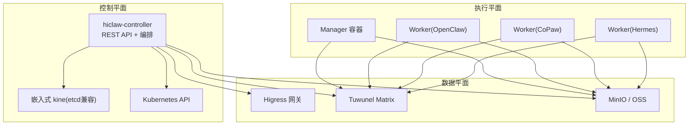
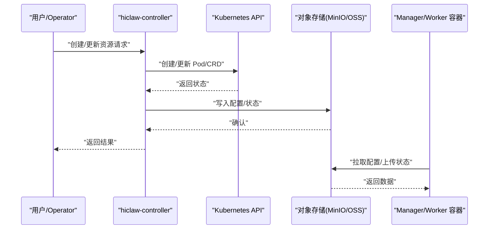
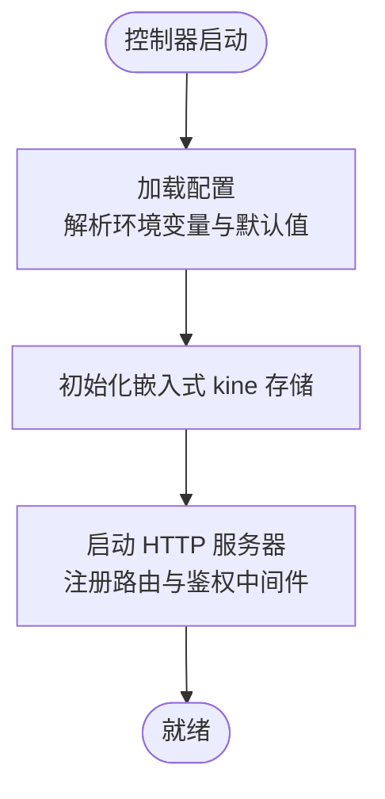
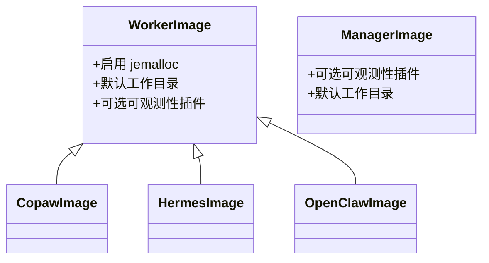
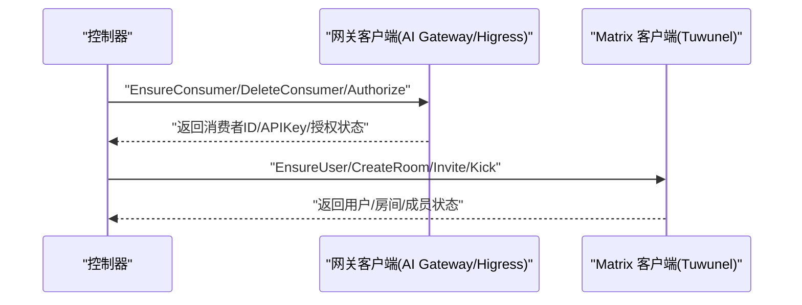
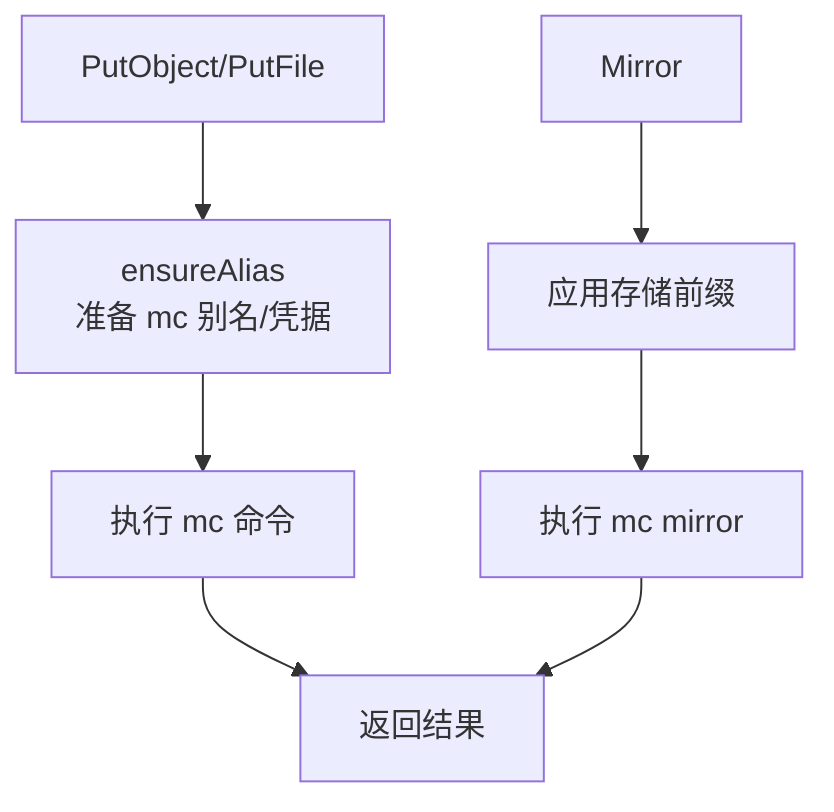
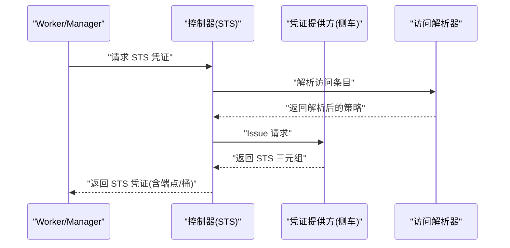
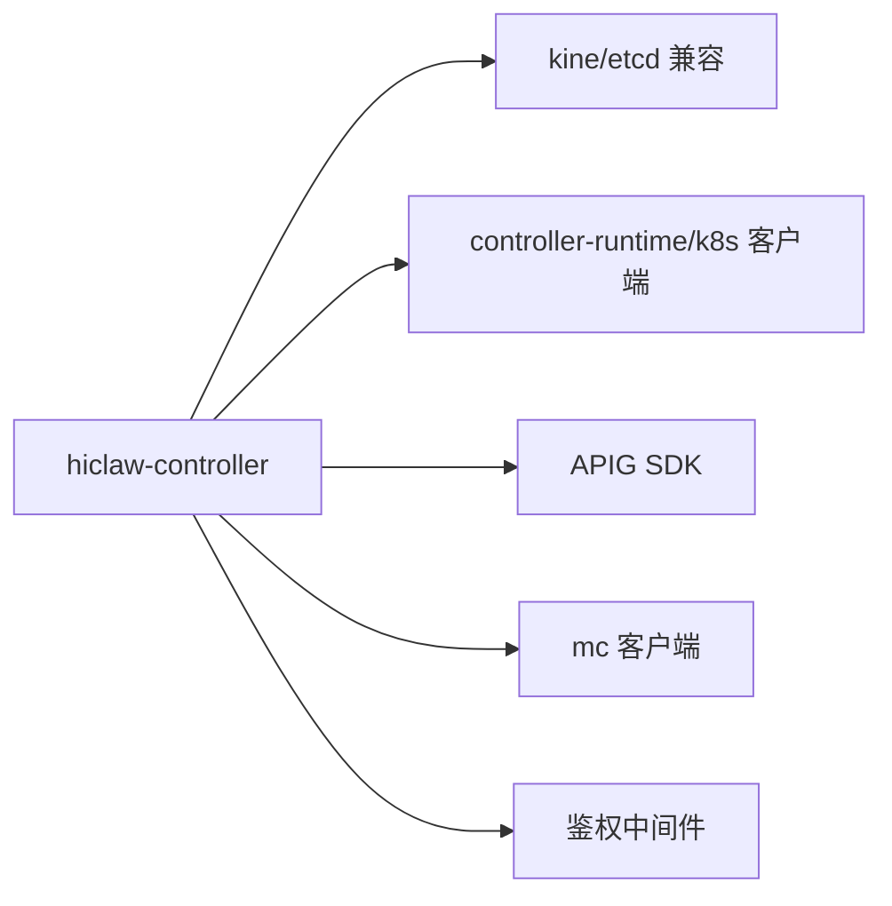

# 性能优化

<cite>
**本文引用的文件**
- [hiclaw-controller/Dockerfile](file://hiclaw-controller/Dockerfile)
- [copaw/Dockerfile](file://copaw/Dockerfile)
- [hermes/Dockerfile](file://hermes/Dockerfile)
- [worker/Dockerfile](file://worker/Dockerfile)
- [manager/Dockerfile](file://manager/Dockerfile)
- [hiclaw-controller/go.mod](file://hiclaw-controller/go.mod)
- [hiclaw-controller/internal/config/config.go](file://hiclaw-controller/internal/config/config.go)
- [hiclaw-controller/internal/store/kine.go](file://hiclaw-controller/internal/store/kine.go)
- [hiclaw-controller/internal/backend/kubernetes.go](file://hiclaw-controller/internal/backend/kubernetes.go)
- [hiclaw-controller/internal/oss/minio.go](file://hiclaw-controller/internal/oss/minio.go)
- [hiclaw-controller/internal/matrix/client.go](file://hiclaw-controller/internal/matrix/client.go)
- [hiclaw-controller/internal/gateway/aigateway.go](file://hiclaw-controller/internal/gateway/aigateway.go)
- [hiclaw-controller/internal/credentials/sts.go](file://hiclaw-controller/internal/credentials/sts.go)
- [hiclaw-controller/internal/server/http.go](file://hiclaw-controller/internal/server/http.go)
- [helm/hiclaw/values.yaml](file://helm/hiclaw/values.yaml)
</cite>

## 目录
1. [简介](#简介)
2. [项目结构](#项目结构)
3. [核心组件](#核心组件)
4. [架构总览](#架构总览)
5. [详细组件分析](#详细组件分析)
6. [依赖关系分析](#依赖关系分析)
7. [性能考量与优化建议](#性能考量与优化建议)
8. [故障排查指南](#故障排查指南)
9. [结论](#结论)
10. [附录：性能测试与基准测试](#附录性能测试与基准测试)

## 简介
本文件面向 HiClaw 的性能优化，围绕 CPU、内存、网络与存储等资源的识别与优化，结合控制器、工作器（Worker）与管理器（Manager）的运行特性，给出资源配置、缓存策略、高可用与负载均衡、数据库与对象存储优化、网络优化以及性能测试方法的系统化指导。内容基于仓库中的控制器源码、容器镜像构建脚本与 Helm 配置，确保建议可落地、可验证。

## 项目结构
HiClaw 采用多容器与多后端的分层架构：
- 控制器（hiclaw-controller）：统一 REST API、资源编排、网关与凭证管理、嵌入式存储与 K8s 后端。
- 工作器（Worker）：三种运行时（OpenClaw、CoPaw、Hermes），通过容器镜像与 MinIO 存储同步配置与状态。
- 管理器（Manager）：承载 LLM 与业务流程，支持多种运行时与可观测性插件。
- 基础设施：Higress 网关、Tuwunel Matrix、MinIO 对象存储；或阿里云 API 网关与 OSS。

图示来源
- [hiclaw-controller/internal/server/http.go:30-112](file://hiclaw-controller/internal/server/http.go#L30-L112)
- [hiclaw-controller/internal/store/kine.go:23-55](file://hiclaw-controller/internal/store/kine.go#L23-L55)
- [hiclaw-controller/internal/backend/kubernetes.go:47-149](file://hiclaw-controller/internal/backend/kubernetes.go#L47-L149)
- [hiclaw-controller/internal/matrix/client.go:16-87](file://hiclaw-controller/internal/matrix/client.go#L16-L87)
- [hiclaw-controller/internal/gateway/aigateway.go:46-90](file://hiclaw-controller/internal/gateway/aigateway.go#L46-L90)
- [hiclaw-controller/internal/oss/minio.go:13-50](file://hiclaw-controller/internal/oss/minio.go#L13-L50)

章节来源
- [hiclaw-controller/internal/server/http.go:30-112](file://hiclaw-controller/internal/server/http.go#L30-L112)
- [helm/hiclaw/values.yaml:1-263](file://helm/hiclaw/values.yaml#L1-L263)

## 核心组件
- 控制器（hiclaw-controller）
  - 提供统一 REST API，负责资源生命周期、网关消费者管理、凭证发放、对象存储操作与嵌入式 kine 存储。
  - 支持嵌入模式（embedded）与集群模式（incluster），在嵌入模式下内置 MinIO、Matrix 与 kube-apiserver。
- 工作器（Worker）
  - 多运行时支持：OpenClaw、CoPaw、Hermes；均通过容器镜像运行，状态与配置由 MinIO 统一管理。
  - CoPaw/Hermes 镜像显式启用 jemalloc 以降低内存碎片。
- 管理器（Manager）
  - 承载 LLM 与业务流程，支持多种运行时与可观测性插件。
- 基础设施
  - 网关：Higress 或阿里云 AI Gateway。
  - 存储：MinIO 或阿里云 OSS；通过 mc 客户端进行对象操作。
  - Matrix：Tuwunel 作为 homeserver。

章节来源
- [hiclaw-controller/Dockerfile:1-61](file://hiclaw-controller/Dockerfile#L1-L61)
- [copaw/Dockerfile:44-48](file://copaw/Dockerfile#L44-L48)
- [hermes/Dockerfile:62-65](file://hermes/Dockerfile#L62-L65)
- [worker/Dockerfile:34-48](file://worker/Dockerfile#L34-L48)
- [manager/Dockerfile:32-47](file://manager/Dockerfile#L32-L47)
- [hiclaw-controller/internal/config/config.go:19-162](file://hiclaw-controller/internal/config/config.go#L19-L162)
- [hiclaw-controller/internal/oss/minio.go:13-50](file://hiclaw-controller/internal/oss/minio.go#L13-L50)

## 架构总览
控制器作为统一入口，协调资源创建、凭证发放与基础设施对接。工作器与管理器通过容器运行，状态与配置经由对象存储同步。矩阵与网关分别提供通信与路由能力。

图示来源
- [hiclaw-controller/internal/backend/kubernetes.go:151-313](file://hiclaw-controller/internal/backend/kubernetes.go#L151-L313)
- [hiclaw-controller/internal/oss/minio.go:194-201](file://hiclaw-controller/internal/oss/minio.go#L194-L201)
- [hiclaw-controller/internal/server/http.go:50-112](file://hiclaw-controller/internal/server/http.go#L50-L112)

章节来源
- [hiclaw-controller/internal/server/http.go:30-112](file://hiclaw-controller/internal/server/http.go#L30-L112)
- [hiclaw-controller/internal/backend/kubernetes.go:151-313](file://hiclaw-controller/internal/backend/kubernetes.go#L151-L313)
- [hiclaw-controller/internal/oss/minio.go:194-201](file://hiclaw-controller/internal/oss/minio.go#L194-L201)

## 详细组件分析

### 控制器性能与资源管理
- 资源请求/限制
  - Helm values 中为控制器、管理器与元素 Web 等组件定义了默认 CPU/内存请求与限制，便于在集群中进行资源配额与调度。
- 嵌入式存储（kine）
  - 使用 SQLite 后端并通过 kine 暴露 etcd 兼容接口，适合小规模部署；注意磁盘 I/O 与 WAL 写入对性能的影响。
- 网络与认证
  - REST API 提供健康检查、资源 CRUD、生命周期与凭证接口；鉴权中间件按角色授权，避免未授权访问导致的无效调用开销。

图示来源
- [hiclaw-controller/internal/config/config.go:207-356](file://hiclaw-controller/internal/config/config.go#L207-L356)
- [hiclaw-controller/internal/store/kine.go:28-55](file://hiclaw-controller/internal/store/kine.go#L28-L55)
- [hiclaw-controller/internal/server/http.go:36-112](file://hiclaw-controller/internal/server/http.go#L36-L112)

章节来源
- [hiclaw-controller/internal/config/config.go:19-162](file://hiclaw-controller/internal/config/config.go#L19-L162)
- [hiclaw-controller/internal/store/kine.go:13-55](file://hiclaw-controller/internal/store/kine.go#L13-L55)
- [hiclaw-controller/internal/server/http.go:16-28](file://hiclaw-controller/internal/server/http.go#L16-L28)

### 工作器与管理器的资源与内存优化
- jemalloc 内存分配
  - CoPaw 与 Hermes 镜像显式启用 jemalloc，有助于降低 Python 进程的内存碎片，提升内存使用效率。
- 默认工作目录与工作空间
  - 不同运行时的工作目录与 HOME 设置不同，需确保持久化挂载与权限正确，避免频繁 IO 抖动。
- 可观测性插件
  - 管理器与工作器镜像内置可观测性插件，可在生产环境启用以采集指标与追踪，但需评估对 CPU/内存的影响。

图示来源
- [copaw/Dockerfile:44-48](file://copaw/Dockerfile#L44-L48)
- [hermes/Dockerfile:62-65](file://hermes/Dockerfile#L62-L65)
- [worker/Dockerfile:34-48](file://worker/Dockerfile#L34-L48)
- [manager/Dockerfile:32-47](file://manager/Dockerfile#L32-L47)

章节来源
- [copaw/Dockerfile:44-48](file://copaw/Dockerfile#L44-L48)
- [hermes/Dockerfile:62-65](file://hermes/Dockerfile#L62-L65)
- [worker/Dockerfile:34-48](file://worker/Dockerfile#L34-L48)
- [manager/Dockerfile:32-47](file://manager/Dockerfile#L32-L47)

### 网关与矩阵通信性能
- 网关客户端
  - Higress 与阿里云 AI Gateway 客户端分别用于消费者管理与授权；AI Gateway 在云端模式下不支持部分本地网关操作，需避免在控制器中误用。
- Matrix 客户端
  - 封装注册、登录、房间管理、消息发送等操作，并对管理员令牌进行缓存，减少重复认证开销。

图示来源
- [hiclaw-controller/internal/gateway/aigateway.go:104-151](file://hiclaw-controller/internal/gateway/aigateway.go#L104-L151)
- [hiclaw-controller/internal/matrix/client.go:131-225](file://hiclaw-controller/internal/matrix/client.go#L131-L225)

章节来源
- [hiclaw-controller/internal/gateway/aigateway.go:46-90](file://hiclaw-controller/internal/gateway/aigateway.go#L46-L90)
- [hiclaw-controller/internal/matrix/client.go:16-87](file://hiclaw-controller/internal/matrix/client.go#L16-L87)

### 对象存储与同步性能
- mc 客户端封装
  - 通过 mc CLI 实现对象的上传、下载、列举与镜像同步；支持静态与动态凭据模式，动态模式适用于外部 OSS 与 STS 凭证轮换场景。
- 路径前缀与覆盖策略
  - 自动为键名添加存储前缀，镜像同步支持覆盖与排除规则，便于大规模配置同步与增量更新。

图示来源
- [hiclaw-controller/internal/oss/minio.go:73-159](file://hiclaw-controller/internal/oss/minio.go#L73-L159)
- [hiclaw-controller/internal/oss/minio.go:203-226](file://hiclaw-controller/internal/oss/minio.go#L203-L226)

章节来源
- [hiclaw-controller/internal/oss/minio.go:13-50](file://hiclaw-controller/internal/oss/minio.go#L13-L50)
- [hiclaw-controller/internal/oss/minio.go:73-159](file://hiclaw-controller/internal/oss/minio.go#L73-L159)

### 凭证与安全
- STS 服务
  - 基于访问解析器与凭证提供方，为调用者签发带内策略的短期凭证；支持 OSS 端点与桶信息回传，便于工作器定位资源。
- 安全中间件
  - HTTP 层通过鉴权中间件按角色授权，避免无效请求对控制器造成压力。

图示来源
- [hiclaw-controller/internal/credentials/sts.go:63-89](file://hiclaw-controller/internal/credentials/sts.go#L63-L89)
- [hiclaw-controller/internal/server/http.go:99-103](file://hiclaw-controller/internal/server/http.go#L99-L103)

章节来源
- [hiclaw-controller/internal/credentials/sts.go:12-90](file://hiclaw-controller/internal/credentials/sts.go#L12-L90)
- [hiclaw-controller/internal/server/http.go:99-103](file://hiclaw-controller/internal/server/http.go#L99-L103)

## 依赖关系分析
- 控制器依赖
  - kine/etcd 兼容存储、Kubernetes API、网关与对象存储客户端、鉴权中间件。
- 第三方库
  - Go 模块包含控制器运行所需的各类依赖，如 Kubernetes 客户端、API 网关 SDK、日志与指标库等。

图示来源
- [hiclaw-controller/go.mod:1-143](file://hiclaw-controller/go.mod#L1-L143)
- [hiclaw-controller/internal/store/kine.go:10-11](file://hiclaw-controller/internal/store/kine.go#L10-L11)
- [hiclaw-controller/internal/gateway/aigateway.go:10-14](file://hiclaw-controller/internal/gateway/aigateway.go#L10-L14)

章节来源
- [hiclaw-controller/go.mod:1-143](file://hiclaw-controller/go.mod#L1-L143)

## 性能考量与优化建议

### CPU 与内存优化
- 控制器与基础设施
  - 为控制器、管理器与元素 Web 设置合理的 requests/limits，避免抢占与 OOM。
  - 在嵌入模式下，注意 kube-apiserver 与 kine 的 CPU/内存占用，必要时调整资源上限。
- 工作器与管理器
  - 利用 jemalloc 降低内存碎片，减少 GC 压力；根据任务复杂度调整 CPU/内存请求。
  - 可观测性插件会增加额外开销，建议在生产环境按需启用并设置采样率。

章节来源
- [helm/hiclaw/values.yaml:166-242](file://helm/hiclaw/values.yaml#L166-L242)
- [copaw/Dockerfile:44-48](file://copaw/Dockerfile#L44-L48)
- [hermes/Dockerfile:62-65](file://hermes/Dockerfile#L62-L65)
- [manager/Dockerfile:32-47](file://manager/Dockerfile#L32-L47)

### 网络性能优化
- 网关与路由
  - 云端模式下使用阿里云 AI Gateway，避免控制器自行创建路由；确保 Region、GatewayID、ModelAPIID、EnvID 正确配置。
  - 本地模式使用 Higress，合理设置副本数与端口暴露策略，避免端口冲突与路由抖动。
- 矩阵通信
  - 管理器与工作器通过 Matrix 交互，建议开启 E2EE 并合理设置房间权限，减少无效消息与重试。
- 凭证与对象存储
  - 使用动态凭据模式（外部 OSS/STS）时，确保凭证提供方响应及时，避免请求阻塞。

章节来源
- [hiclaw-controller/internal/gateway/aigateway.go:23-58](file://hiclaw-controller/internal/gateway/aigateway.go#L23-L58)
- [hiclaw-controller/internal/matrix/client.go:16-87](file://hiclaw-controller/internal/matrix/client.go#L16-L87)
- [hiclaw-controller/internal/oss/minio.go:42-50](file://hiclaw-controller/internal/oss/minio.go#L42-L50)

### 存储与对象存储优化
- mc 同步策略
  - 使用镜像同步（mirror）时启用覆盖与排除规则，减少不必要的传输；对大文件采用断点续传与并发控制。
- 前缀与命名
  - 统一使用存储前缀，避免键名冲突；合理规划桶与路径结构，提升检索与清理效率。
- 嵌入式 MinIO
  - 注意 WAL 写入与磁盘 I/O，建议使用高性能存储卷并开启合适的持久化策略。

章节来源
- [hiclaw-controller/internal/oss/minio.go:138-159](file://hiclaw-controller/internal/oss/minio.go#L138-L159)
- [hiclaw-controller/internal/oss/minio.go:69-71](file://hiclaw-controller/internal/oss/minio.go#L69-L71)
- [hiclaw-controller/internal/store/kine.go:42-43](file://hiclaw-controller/internal/store/kine.go#L42-L43)

### 高可用与弹性伸缩
- 控制器高可用
  - 通过 Helm 将副本数提升至 2 或以上，并启用 leader election，避免单点故障。
- 工作器弹性
  - 基于 Kubernetes 的水平扩展（HPA）与节点亲和性调度，结合资源请求/限制与污点容忍，实现按负载自动扩容。
- 网关与存储
  - 网关与存储采用托管方案（Higress/阿里云 AI Gateway、MinIO/OSS）时，关注其 SLA 与容量规划。

章节来源
- [helm/hiclaw/values.yaml:166-192](file://helm/hiclaw/values.yaml#L166-L192)
- [hiclaw-controller/internal/backend/kubernetes.go:386-407](file://hiclaw-controller/internal/backend/kubernetes.go#L386-L407)

### 缓存策略配置
- Redis 缓存
  - 当前代码未直接使用 Redis；若需引入，建议在应用层以连接池方式接入，设置合理的过期时间与淘汰策略。
- 会话缓存
  - 控制器对 Matrix 管理员令牌与房间 ID 进行缓存，减少重复认证与查询；可适当增大缓存 TTL 以降低请求频率。
- 静态资源缓存
  - 元素 Web 与网关静态资源可通过 CDN/浏览器缓存策略优化，缩短首屏加载时间。

章节来源
- [hiclaw-controller/internal/matrix/client.go:90-100](file://hiclaw-controller/internal/matrix/client.go#L90-L100)
- [hiclaw-controller/internal/matrix/client.go:450-475](file://hiclaw-controller/internal/matrix/client.go#L450-L475)
- [helm/hiclaw/values.yaml:212-230](file://helm/hiclaw/values.yaml#L212-L230)

### 数据库性能优化
- 嵌入式存储（kine/SQLite）
  - 使用 WAL 模式提升写入性能；确保磁盘具备足够 IOPS；定期备份与维护。
- 外部数据库
  - 若迁移到外部 etcd/数据库，需优化连接池参数、事务大小与索引设计，避免热点写入。

章节来源
- [hiclaw-controller/internal/store/kine.go:42-49](file://hiclaw-controller/internal/store/kine.go#L42-L49)

### 负载均衡与高可用配置
- 服务发现与故障转移
  - 通过 Kubernetes Service 与 Headless Service 实现服务发现；结合探针与滚动升级策略实现平滑切换。
- 自动扩缩容
  - 结合 HPA/CRA 策略，基于 CPU/内存与自定义指标进行弹性伸缩；设置合理的最小/最大副本数与冷却时间。

章节来源
- [hiclaw-controller/internal/backend/kubernetes.go:151-313](file://hiclaw-controller/internal/backend/kubernetes.go#L151-L313)
- [helm/hiclaw/values.yaml:166-263](file://helm/hiclaw/values.yaml#L166-L263)

## 故障排查指南
- 健康检查
  - 通过 /healthz 接口快速判断控制器是否就绪；若失败，检查嵌入式服务（kine、kube-apiserver）与依赖组件状态。
- 网关问题
  - AI Gateway 模式下，确认 Region/GatewayID/ModelAPIID/EnvID 配置正确；若授权失败，检查凭证提供方与消费者状态。
- 对象存储问题
  - 使用 mc 命令行工具验证端点、桶与凭据；检查前缀与路径拼接逻辑，避免键名错误。
- 矩阵问题
  - 关注管理员令牌缓存失效与重试机制；检查房间别名解析与成员状态变更。

章节来源
- [hiclaw-controller/internal/server/http.go:42-48](file://hiclaw-controller/internal/server/http.go#L42-L48)
- [hiclaw-controller/internal/gateway/aigateway.go:293-303](file://hiclaw-controller/internal/gateway/aigateway.go#L293-L303)
- [hiclaw-controller/internal/oss/minio.go:203-226](file://hiclaw-controller/internal/oss/minio.go#L203-L226)
- [hiclaw-controller/internal/matrix/client.go:118-129](file://hiclaw-controller/internal/matrix/client.go#L118-L129)

## 结论
HiClaw 的性能优化应从资源规划、容器内存分配、对象存储同步策略、网关与矩阵通信、嵌入式存储与外部数据库等多个维度协同推进。通过 Helm 值与控制器配置的精细化调优，结合 jemalloc、缓存与可观测性插件的合理使用，可在保证稳定性的同时显著提升吞吐与响应速度。

## 附录：性能测试与基准测试
- 基准测试工具
  - 使用 k6/JMeter/Loader.io 等工具对控制器 REST API 进行并发压测，覆盖资源 CRUD、生命周期与凭证接口。
- 场景建议
  - 高并发创建/删除 Worker、批量上传包、矩阵消息风暴、对象存储镜像同步等典型场景。
- 指标采集
  - 结合 Prometheus/Grafana 采集 CPU/内存/网络/磁盘 I/O 指标，观察控制器、工作器与基础设施的资源占用趋势。
- 回归验证
  - 在每次配置变更后进行回归测试，确保关键路径（创建/删除、状态同步、消息收发）的性能满足预期。

[本节为通用实践建议，无需特定文件引用]