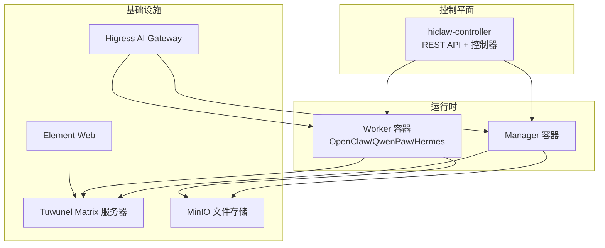
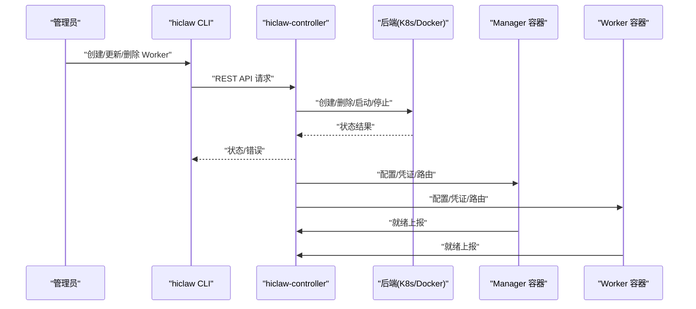
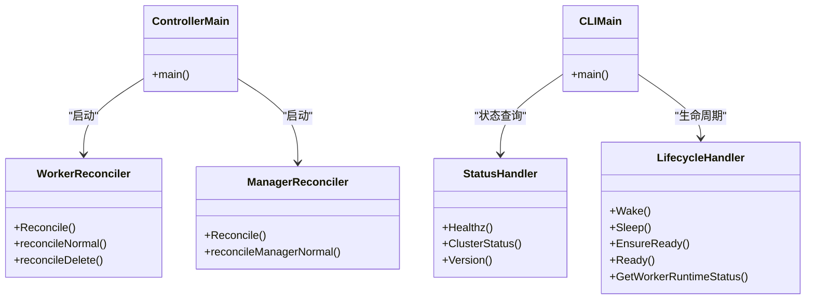
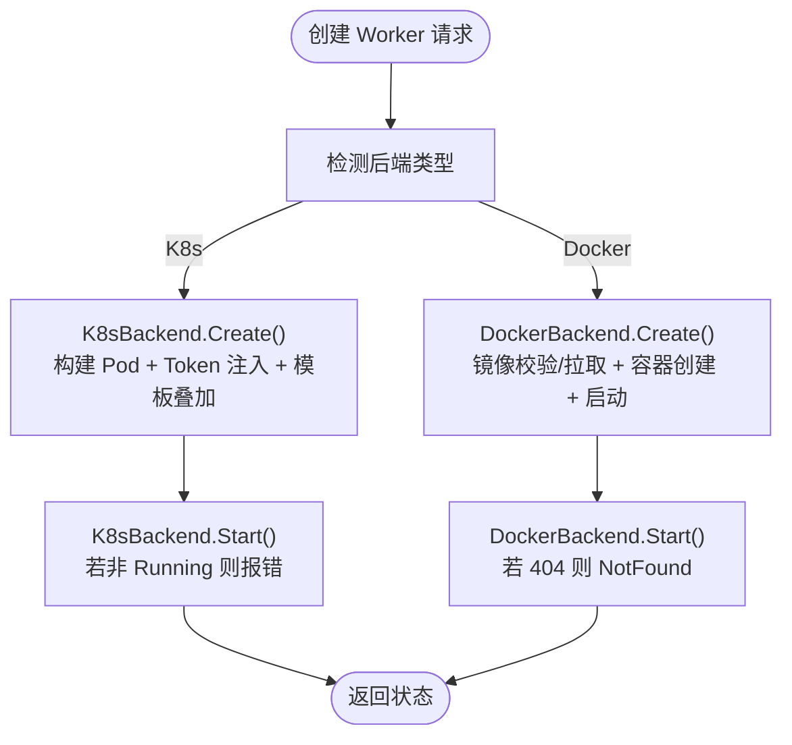
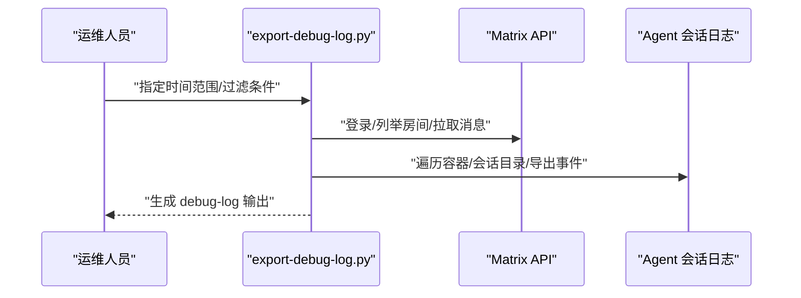
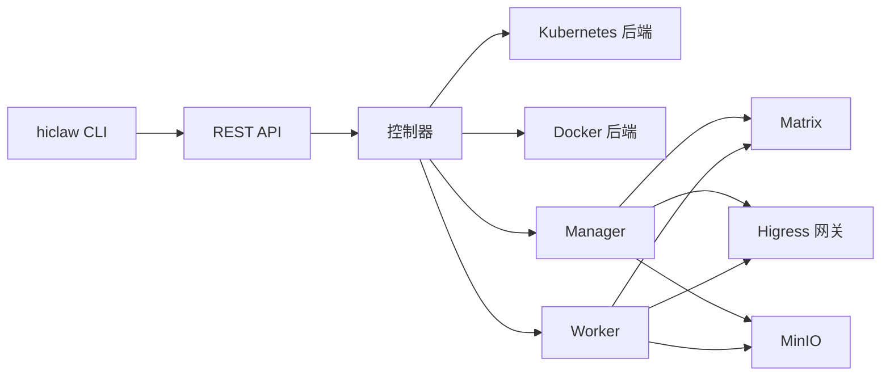

# 故障排查

<cite>
**本文引用的文件**
- [README.md](file://README.md)
- [docs/faq.md](file://docs/faq.md)
- [docs/zh-cn/faq.md](file://docs/zh-cn/faq.md)
- [scripts/export-debug-log.py](file://scripts/export-debug-log.py)
- [scripts/replay-task.sh](file://scripts/replay-task.sh)
- [hiclaw-controller/cmd/hiclaw/main.go](file://hiclaw-controller/cmd/hiclaw/main.go)
- [hiclaw-controller/cmd/controller/main.go](file://hiclaw-controller/cmd/controller/main.go)
- [hiclaw-controller/internal/controller/worker_controller.go](file://hiclaw-controller/internal/controller/worker_controller.go)
- [hiclaw-controller/internal/controller/manager_controller.go](file://hiclaw-controller/internal/controller/manager_controller.go)
- [hiclaw-controller/internal/server/status_handler.go](file://hiclaw-controller/internal/server/status_handler.go)
- [hiclaw-controller/internal/server/lifecycle_handler.go](file://hiclaw-controller/internal/server/lifecycle_handler.go)
- [hiclaw-controller/internal/backend/kubernetes.go](file://hiclaw-controller/internal/backend/kubernetes.go)
- [hiclaw-controller/internal/backend/docker.go](file://hiclaw-controller/internal/backend/docker.go)
- [manager/README.md](file://manager/README.md)
- [worker/README.md](file://worker/README.md)
- [copaw/README.md](file://copaw/README.md)
- [hermes/README.md](file://hermes/README.md)
</cite>

## 目录
1. [简介](#简介)
2. [项目结构](#项目结构)
3. [核心组件](#核心组件)
4. [架构总览](#架构总览)
5. [详细组件分析](#详细组件分析)
6. [依赖关系分析](#依赖关系分析)
7. [性能考量](#性能考量)
8. [故障排查指南](#故障排查指南)
9. [结论](#结论)
10. [附录](#附录)

## 简介
本文件面向 HiClaw 运维与技术支持人员，提供系统性的故障排查文档。内容涵盖症状识别、根因分析、解决方案制定、调试工具使用、问题分类与优先级评估、故障恢复策略、监控告警配置与使用、以及预防与最佳实践。文档结合代码库中的控制器、CLI、日志导出与回放脚本、Worker/Manager 组件说明，帮助快速定位并处理 Worker 启动失败、通信异常、资源不足、网关错误、会话卡死等典型问题。

## 项目结构
HiClaw 采用多容器与 Kubernetes 原生控制平面架构：
- 控制器（hiclaw-controller）：负责 Worker/Manager/Team/Human 等资源的声明式编排与生命周期管理。
- 管理者（Manager）：集中编排多个 Worker，负责任务委派、矩阵通信与凭据管理。
- 工作者（Worker）：无状态代理容器，通过 MinIO 共享文件系统与矩阵通道协同。
- 网关与基础设施：Higress AI Gateway、Tuwunel（Matrix）服务器、MinIO 文件存储、Element Web 客户端。
- CLI：hiclaw CLI 提供资源查询、创建、更新、删除与状态检查能力。

图示来源
- [hiclaw-controller/cmd/controller/main.go:16-35](file://hiclaw-controller/cmd/controller/main.go#L16-L35)
- [manager/README.md:3-11](file://manager/README.md#L3-L11)
- [worker/README.md:3-9](file://worker/README.md#L3-L9)

章节来源
- [README.md:305-333](file://README.md#L305-L333)
- [manager/README.md:3-11](file://manager/README.md#L3-L11)
- [worker/README.md:3-9](file://worker/README.md#L3-L9)

## 核心组件
- 控制器与 CLI
  - 控制器入口与生命周期：启动控制器、监听信号、加载配置并运行。
  - CLI 入口：hiclaw CLI 提供 apply/get/create/update/delete/status/version 等子命令。
- 控制器内部
  - Worker/Manager 控制器：负责资源基础设施、配置、容器与暴露的收敛。
  - 服务器处理器：健康检查、集群状态、版本、Worker 生命周期（唤醒/休眠/就绪）。
  - 后端适配：Kubernetes 与 Docker 两种部署模式，统一抽象 Worker 生命周期。
- 调试与回放
  - 导出调试日志：抓取 Matrix 消息与 Agent 会话日志，支持 PII 脱敏与时间范围过滤。
  - 任务回放：以管理员身份向 Manager 发送任务消息并等待回复，辅助验证通道与网关连通性。

章节来源
- [hiclaw-controller/cmd/controller/main.go:16-35](file://hiclaw-controller/cmd/controller/main.go#L16-L35)
- [hiclaw-controller/cmd/hiclaw/main.go:9-34](file://hiclaw-controller/cmd/hiclaw/main.go#L9-L34)
- [hiclaw-controller/internal/controller/worker_controller.go:57-151](file://hiclaw-controller/internal/controller/worker_controller.go#L57-L151)
- [hiclaw-controller/internal/controller/manager_controller.go:72-160](file://hiclaw-controller/internal/controller/manager_controller.go#L72-L160)
- [hiclaw-controller/internal/server/status_handler.go:23-74](file://hiclaw-controller/internal/server/status_handler.go#L23-L74)
- [hiclaw-controller/internal/server/lifecycle_handler.go:34-205](file://hiclaw-controller/internal/server/lifecycle_handler.go#L34-L205)
- [hiclaw-controller/internal/backend/kubernetes.go:151-313](file://hiclaw-controller/internal/backend/kubernetes.go#L151-L313)
- [hiclaw-controller/internal/backend/docker.go:87-209](file://hiclaw-controller/internal/backend/docker.go#L87-L209)
- [scripts/export-debug-log.py:677-756](file://scripts/export-debug-log.py#L677-L756)
- [scripts/replay-task.sh:298-415](file://scripts/replay-task.sh#L298-L415)

## 架构总览
控制器通过 CRD（Worker/Manager/Team/Human）实现声明式管理，控制器内部协调后端（Kubernetes/Docker）创建/删除/启动/停止 Worker 容器，同时维护 Matrix 用户与房间、Higress 路由与消费者、MinIO 环境变量等基础设施状态。Manager/Worker 通过 Matrix 与 Higress 网关交互，会话日志落地 MinIO，便于审计与复盘。

图示来源
- [hiclaw-controller/cmd/hiclaw/main.go:9-34](file://hiclaw-controller/cmd/hiclaw/main.go#L9-L34)
- [hiclaw-controller/internal/server/lifecycle_handler.go:112-174](file://hiclaw-controller/internal/server/lifecycle_handler.go#L112-L174)
- [hiclaw-controller/internal/backend/kubernetes.go:151-313](file://hiclaw-controller/internal/backend/kubernetes.go#L151-L313)
- [hiclaw-controller/internal/backend/docker.go:87-209](file://hiclaw-controller/internal/backend/docker.go#L87-L209)

## 详细组件分析

### 控制器与 CLI
- 控制器启动与信号处理：初始化日志、加载配置、启动应用并在收到中断信号时优雅退出。
- CLI 命令树：提供资源管理、状态查询、版本信息等命令，支持环境变量注入（控制器地址、认证令牌）。
- 控制器职责：Worker/Manager 的基础设施、配置、容器与暴露收敛；删除时清理资源与 Finalizer。

图示来源
- [hiclaw-controller/cmd/controller/main.go:16-35](file://hiclaw-controller/cmd/controller/main.go#L16-L35)
- [hiclaw-controller/cmd/hiclaw/main.go:9-34](file://hiclaw-controller/cmd/hiclaw/main.go#L9-L34)
- [hiclaw-controller/internal/controller/worker_controller.go:57-151](file://hiclaw-controller/internal/controller/worker_controller.go#L57-L151)
- [hiclaw-controller/internal/controller/manager_controller.go:72-160](file://hiclaw-controller/internal/controller/manager_controller.go#L72-L160)
- [hiclaw-controller/internal/server/status_handler.go:23-74](file://hiclaw-controller/internal/server/status_handler.go#L23-L74)
- [hiclaw-controller/internal/server/lifecycle_handler.go:34-205](file://hiclaw-controller/internal/server/lifecycle_handler.go#L34-L205)

章节来源
- [hiclaw-controller/cmd/controller/main.go:16-35](file://hiclaw-controller/cmd/controller/main.go#L16-L35)
- [hiclaw-controller/cmd/hiclaw/main.go:9-34](file://hiclaw-controller/cmd/hiclaw/main.go#L9-L34)
- [hiclaw-controller/internal/controller/worker_controller.go:57-151](file://hiclaw-controller/internal/controller/worker_controller.go#L57-L151)
- [hiclaw-controller/internal/controller/manager_controller.go:72-160](file://hiclaw-controller/internal/controller/manager_controller.go#L72-L160)
- [hiclaw-controller/internal/server/status_handler.go:23-74](file://hiclaw-controller/internal/server/status_handler.go#L23-L74)
- [hiclaw-controller/internal/server/lifecycle_handler.go:34-205](file://hiclaw-controller/internal/server/lifecycle_handler.go#L34-L205)

### 后端适配（Kubernetes 与 Docker）
- Kubernetes 后端：通过 Pod 模板叠加、ServiceAccount、Token 注入、HostAliases 等实现 Worker 生命周期管理；支持资源限制与请求合并。
- Docker 后端：通过 Unix Socket 调用 Docker Engine API，负责容器创建、启动、停止、删除与状态查询；支持端口冲突重试与镜像拉取。

图示来源
- [hiclaw-controller/internal/backend/kubernetes.go:151-313](file://hiclaw-controller/internal/backend/kubernetes.go#L151-L313)
- [hiclaw-controller/internal/backend/docker.go:87-209](file://hiclaw-controller/internal/backend/docker.go#L87-L209)

章节来源
- [hiclaw-controller/internal/backend/kubernetes.go:151-313](file://hiclaw-controller/internal/backend/kubernetes.go#L151-L313)
- [hiclaw-controller/internal/backend/docker.go:87-209](file://hiclaw-controller/internal/backend/docker.go#L87-L209)

### 调试与回放工具
- 导出调试日志：支持按时间范围导出 Matrix 消息与 Agent 会话日志，自动脱敏敏感信息，支持过滤容器与房间。
- 任务回放：以管理员身份登录 Matrix，查找或创建与 Manager 的 DM 房间，发送任务消息并等待回复，记录对话日志，辅助验证通道与网关连通性。

图示来源
- [scripts/export-debug-log.py:677-756](file://scripts/export-debug-log.py#L677-L756)

章节来源
- [scripts/export-debug-log.py:677-756](file://scripts/export-debug-log.py#L677-L756)
- [scripts/replay-task.sh:298-415](file://scripts/replay-task.sh#L298-L415)

## 依赖关系分析
- 控制器依赖后端适配层（K8s/Docker）实现 Worker 生命周期；依赖服务器处理器提供健康检查与状态查询；依赖 CLI 提供外部操作入口。
- Manager/Worker 依赖 Matrix 通道与 Higress 网关；会话日志与共享文件系统位于 MinIO。
- 文档 FAQ 提供常见问题与排障步骤，覆盖启动超时、网络代理、会话卡死、模型配置错误等场景。

图示来源
- [hiclaw-controller/cmd/hiclaw/main.go:9-34](file://hiclaw-controller/cmd/hiclaw/main.go#L9-L34)
- [hiclaw-controller/internal/server/status_handler.go:23-74](file://hiclaw-controller/internal/server/status_handler.go#L23-L74)
- [hiclaw-controller/internal/server/lifecycle_handler.go:34-205](file://hiclaw-controller/internal/server/lifecycle_handler.go#L34-L205)
- [hiclaw-controller/internal/backend/kubernetes.go:151-313](file://hiclaw-controller/internal/backend/kubernetes.go#L151-L313)
- [hiclaw-controller/internal/backend/docker.go:87-209](file://hiclaw-controller/internal/backend/docker.go#L87-L209)

章节来源
- [docs/faq.md:227-267](file://docs/faq.md#L227-L267)
- [docs/zh-cn/faq.md:227-267](file://docs/zh-cn/faq.md#L227-L267)

## 性能考量
- 资源配额：Worker 默认 CPU/内存限制可在后端层合并覆盖，建议根据运行时（OpenClaw/QwenPaw/Hermes）与任务复杂度调整。
- 并发与重试：控制器定期轮询与重试间隔固定，避免过度轮询；后端适配层对端口冲突与镜像拉取进行重试与清理。
- 会话压缩：长任务前建议使用压缩指令释放上下文窗口，减少模型调用开销。

章节来源
- [hiclaw-controller/internal/backend/kubernetes.go:390-429](file://hiclaw-controller/internal/backend/kubernetes.go#L390-L429)
- [docs/faq.md:666-703](file://docs/faq.md#L666-L703)
- [docs/zh-cn/faq.md:670-706](file://docs/zh-cn/faq.md#L670-L706)

## 故障排查指南

### 一、症状识别与优先级评估
- 紧急（P1）：Manager/Worker 完全无响应、UI 无法访问、Higress 返回 5xx/401。
- 高（P2）：Worker 启动失败、容器状态异常、会话卡死、模型切换无效。
- 中（P3）：网络代理导致 Matrix 不可达、端口占用、日志缺失。
- 低（P4）：UI 显示“输入中”超过阈值、会话历史被跳过、文件同步延迟。

章节来源
- [docs/faq.md:492-531](file://docs/faq.md#L492-L531)
- [docs/zh-cn/faq.md:496-534](file://docs/zh-cn/faq.md#L496-L534)

### 二、常见问题与排查流程

#### 1) Worker 启动失败
- 现象：Worker 状态为 Pending/Stopped/Failed，容器无法启动或被删除。
- 排查步骤：
  - 检查控制器日志与 Worker 状态消息，确认是否存在冲突或后端错误。
  - 若为 Kubernetes 后端：检查 Pod 阶段、事件与资源配额；确认镜像拉取、Token 注入与 Pod 模板叠加是否成功。
  - 若为 Docker 后端：检查 Docker Socket 可用性、镜像是否存在、端口冲突与容器清理。
- 解决方案：
  - 调整资源配额或镜像标签；修复 Pod 模板叠加；清理冲突容器后重试。

章节来源
- [hiclaw-controller/internal/controller/worker_controller.go:294-309](file://hiclaw-controller/internal/controller/worker_controller.go#L294-L309)
- [hiclaw-controller/internal/backend/kubernetes.go:151-313](file://hiclaw-controller/internal/backend/kubernetes.go#L151-L313)
- [hiclaw-controller/internal/backend/docker.go:87-209](file://hiclaw-controller/internal/backend/docker.go#L87-L209)

#### 2) 通信异常（Matrix 无法访问/消息不达）
- 现象：Element Web 无法连接 Matrix、消息发送无响应、@提及无效。
- 排查步骤：
  - 检查浏览器/系统代理设置，确保本地域名解析到 127.0.0.1。
  - 使用回放脚本验证 Matrix 登录、DM 房间创建与消息发送链路。
  - 检查 Manager/Worker 的 Matrix 用户与房间状态。
- 解决方案：
  - 关闭代理或加入绕过列表；修正 Matrix 服务器地址；确保 Manager 已加入 DM 房间。

章节来源
- [docs/faq.md:294-300](file://docs/faq.md#L294-L300)
- [docs/zh-cn/faq.md:294-300](file://docs/zh-cn/faq.md#L294-L300)
- [scripts/replay-task.sh:298-415](file://scripts/replay-task.sh#L298-L415)

#### 3) 资源不足（内存/CPU/磁盘）
- 现象：容器反复重启、启动缓慢、会话崩溃。
- 排查步骤：
  - 检查后端资源配额与节点资源；确认 Worker 默认 CPU/内存限制与覆盖策略。
  - 观察会话日志中上下文窗口耗尽与压缩失败提示。
- 解决方案：
  - 提升 Worker 资源配额；优化任务长度与压缩策略；必要时切换更轻量的运行时。

章节来源
- [hiclaw-controller/internal/backend/kubernetes.go:390-429](file://hiclaw-controller/internal/backend/kubernetes.go#L390-L429)
- [docs/faq.md:472-490](file://docs/faq.md#L472-L490)
- [docs/zh-cn/faq.md:476-492](file://docs/zh-cn/faq.md#L476-L492)

#### 4) 网关错误（Higress 503/404）
- 现象：调用 LLM 返回 503（容器无法访问外部服务）或 404（模型名错误）。
- 排查步骤：
  - 检查 Higress 网关日志，区分上游错误与路由配置问题。
  - 校验模型名称、路由规则与凭据注入。
- 解决方案：
  - 修复网络策略或上游主机；修正模型名称与路由匹配；重新激活或更换有效凭据。

章节来源
- [docs/faq.md:534-585](file://docs/faq.md#L534-L585)
- [docs/zh-cn/faq.md:538-588](file://docs/zh-cn/faq.md#L538-L588)

#### 5) 会话卡死/“输入中”超时
- 现象：长时间“输入中”或无响应，会话历史被跳过。
- 排查步骤：
  - 使用 OpenClaw TUI 查看会话列表与错误；尝试发送“/new”重置会话。
  - 检查会话日志中 LLM 调用与工具使用是否异常。
- 解决方案：
  - 重置会话；压缩上下文；优化任务分片与模型参数。

章节来源
- [docs/faq.md:492-531](file://docs/faq.md#L492-L531)
- [docs/zh-cn/faq.md:496-534](file://docs/zh-cn/faq.md#L496-L534)

#### 6) 日志导出与分析
- 使用导出脚本按时间范围抓取 Matrix 消息与 Agent 会话日志，自动脱敏敏感信息，便于离线分析与 AI 辅助根因定位。

章节来源
- [scripts/export-debug-log.py:677-756](file://scripts/export-debug-log.py#L677-L756)

### 三、调试工具使用

#### 1) 导出调试日志
- 功能：按时间范围导出 Matrix 消息与 Agent 会话日志，支持容器/房间过滤与 PII 脱敏。
- 使用建议：在问题发生前后导出，结合会话日志定位 Agent 执行轨迹。

章节来源
- [scripts/export-debug-log.py:677-756](file://scripts/export-debug-log.py#L677-L756)

#### 2) 任务回放
- 功能：以管理员身份登录 Matrix，自动创建或复用与 Manager 的 DM 房间，发送任务消息并等待回复，记录完整对话日志。
- 使用建议：用于验证通道连通性、网关路由与 Manager 响应链路。

章节来源
- [scripts/replay-task.sh:298-415](file://scripts/replay-task.sh#L298-L415)

#### 3) 健康检查与状态查询
- 健康检查：/healthz 返回“ok”，用于基础连通性验证。
- 集群状态：/api/v1/status 返回 Worker/Team/Human 数量，辅助规模核对。
- 版本信息：/api/v1/version 返回控制器与模式信息。
- Worker 生命周期：/api/v1/workers/{name}/wake/sleep/ensure-ready/ready/status，用于强制状态变更与就绪上报。

章节来源
- [hiclaw-controller/internal/server/status_handler.go:23-74](file://hiclaw-controller/internal/server/status_handler.go#L23-L74)
- [hiclaw-controller/internal/server/lifecycle_handler.go:34-205](file://hiclaw-controller/internal/server/lifecycle_handler.go#L34-L205)

### 四、问题分类与优先级评估
- P1：服务不可用（UI/网关/Manager/Worker 全部不可用）
- P2：功能异常（Worker 启动失败/通信异常/网关错误）
- P3：体验问题（代理影响/端口冲突/日志缺失）
- P4：微小缺陷（长时间“输入中”/会话历史跳过）

章节来源
- [docs/faq.md:492-531](file://docs/faq.md#L492-L531)
- [docs/zh-cn/faq.md:496-534](file://docs/zh-cn/faq.md#L496-L534)

### 五、故障恢复策略
- 数据恢复：Worker 无状态，配置与记忆存储于 MinIO，删除 Worker 后可重建恢复；Manager 配置亦在 MinIO，需确保备份策略。
- 服务重启：优先使用 CLI 的生命周期接口（wake/sleep/ensure-ready）触发后端重启；必要时直接删除容器/Pod 触发控制器重建。
- 系统重建：卸载后重新安装，清理残留数据与网络卷；在 Kubernetes 环境中重建命名空间与 CRD。

章节来源
- [README.md:96-108](file://README.md#L96-L108)
- [docs/faq.md:183-194](file://docs/faq.md#L183-L194)
- [docs/zh-cn/faq.md:183-194](file://docs/zh-cn/faq.md#L183-L194)

### 六、监控告警配置与使用
- 关键指标：
  - 控制器健康：/healthz、/api/v1/version
  - 集群规模：/api/v1/status（Worker/Team/Human 数量）
  - Worker 状态：/api/v1/workers/{name}/status（后端状态、就绪标记）
- 告警建议：
  - 5xx/4xx 错误率上升、Worker 长时间未就绪、Higress 上游失败、会话日志异常增长。
- 使用建议：
  - 结合导出脚本与会话日志进行根因分析；对高频错误建立自动化告警与自愈流程。

章节来源
- [hiclaw-controller/internal/server/status_handler.go:23-74](file://hiclaw-controller/internal/server/status_handler.go#L23-L74)
- [hiclaw-controller/internal/server/lifecycle_handler.go:176-205](file://hiclaw-controller/internal/server/lifecycle_handler.go#L176-L205)

### 七、故障预防与最佳实践
- 容量规划：根据 Worker 数量与运行时选择合理资源配额；预留峰值负载余量。
- 备份策略：定期备份 Manager/Worker 配置与 MinIO 数据；验证恢复流程。
- 灾难恢复：明确重建步骤与依赖项（网关、Matrix、MinIO、Element Web）；演练跨环境迁移。
- 运行时选择：根据任务特性选择合适运行时（OpenClaw/QwenPaw/Hermes），并保持模型与上下文窗口配置一致。
- 网络与代理：避免系统代理影响本地域名解析；确保容器网络可达外部 LLM 服务。

章节来源
- [docs/faq.md:402-444](file://docs/faq.md#L402-L444)
- [docs/zh-cn/faq.md:406-445](file://docs/zh-cn/faq.md#L406-L445)
- [README.md:58-62](file://README.md#L58-L62)

## 结论
HiClaw 的故障排查应围绕“控制器—后端—容器—通道—网关—存储”的链路展开。通过 CLI 与服务器处理器进行状态核对，借助导出与回放工具定位问题根因，结合 FAQ 与运行时特性制定恢复与预防策略，可显著提升问题解决效率与系统稳定性。

## 附录
- 运行时说明：Manager/Worker 支持多种运行时（OpenClaw/QwenPaw/Hermes），不同运行时的会话日志位置与配置差异较大，需按运行时区分排查。
- 安装与卸载：遵循官方安装脚本与卸载流程，确保清理容器、卷、网络与环境文件，避免残留导致后续问题。

章节来源
- [manager/README.md:12-18](file://manager/README.md#L12-L18)
- [worker/README.md](file://worker/README.md#L9)
- [copaw/README.md:1-18](file://copaw/README.md#L1-L18)
- [hermes/README.md:19-38](file://hermes/README.md#L19-L38)
- [README.md:96-108](file://README.md#L96-L108)