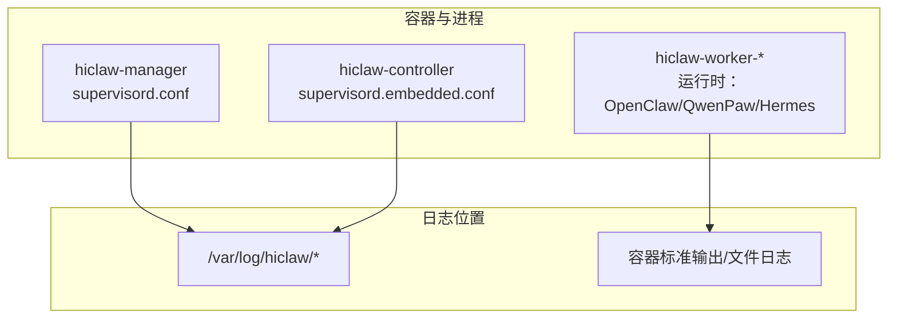
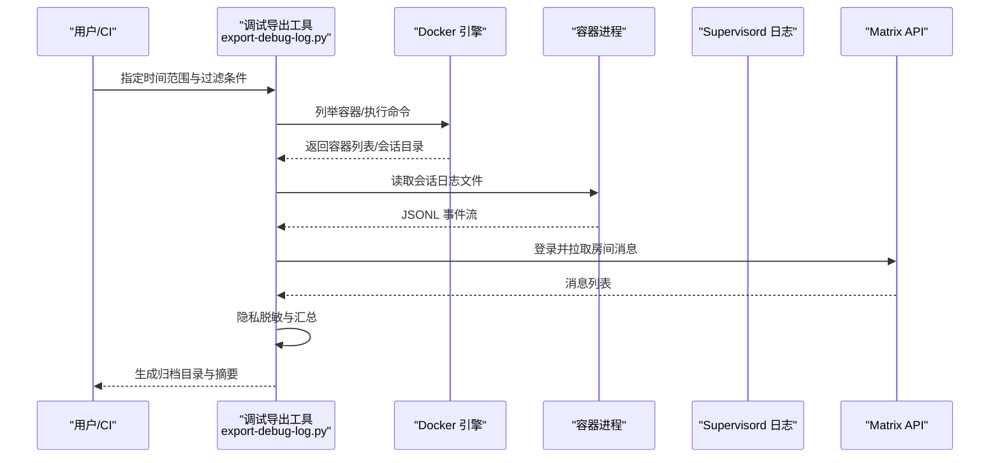
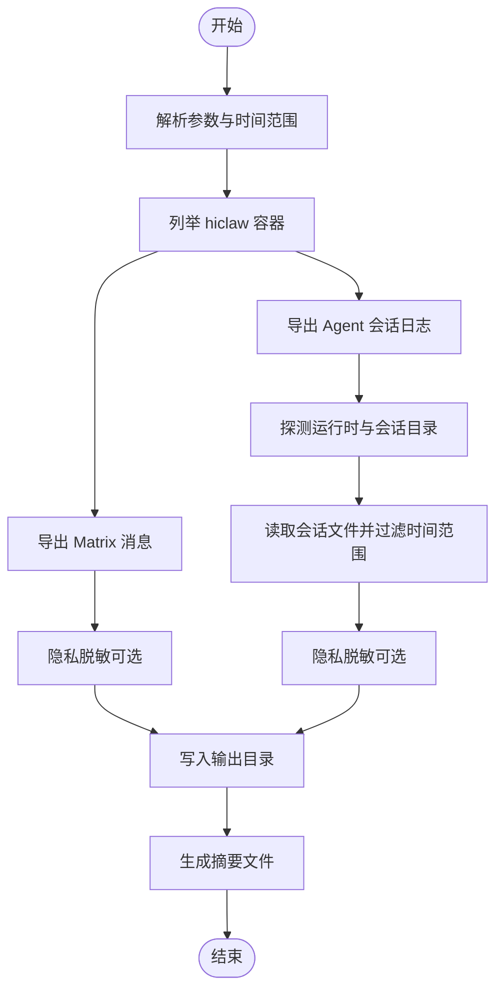
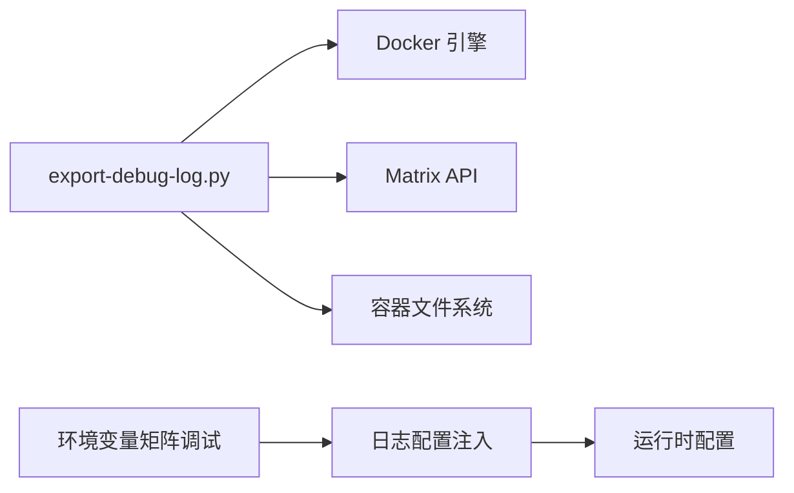

# 日志管理

<cite>
**本文引用的文件**
- [export-debug-log.py](file://scripts/export-debug-log.py)
- [supervisord.conf（Manager）](file://manager/supervisord.conf)
- [supervisord.embedded.conf（控制器嵌入式）](file://hiclaw-controller/supervisord.embedded.conf)
- [AGENTS.md（CoPaw 运行时日志与容器日志）](file://copaw/AGENTS.md)
- [base.sh（启动脚本通用工具）](file://manager/scripts/lib/base.sh)
- [test_bridge.py（矩阵调试日志开关测试）](file://hermes/tests/test_bridge.py)
- [bridge.py（日志配置注入逻辑）](file://hermes/src/hermes_worker/bridge.py)
- [README.md（故障排查与调试日志导出指引）](file://README.md)
- [agent-metrics.sh（会话指标采集与日志）](file://tests/lib/agent-metrics.sh)
- [main.go（CLI 环境变量说明）](file://hiclaw-controller/cmd/hiclaw/main.go)
</cite>

## 目录
1. [简介](#简介)
2. [项目结构](#项目结构)
3. [核心组件](#核心组件)
4. [架构总览](#架构总览)
5. [详细组件分析](#详细组件分析)
6. [依赖分析](#依赖分析)
7. [性能考虑](#性能考虑)
8. [故障排查指南](#故障排查指南)
9. [结论](#结论)
10. [附录](#附录)

## 简介
本文件面向 HiClaw 平台用户与运维人员，系统化梳理日志管理策略与最佳实践，覆盖容器日志、应用日志与系统日志的采集、存储与归档；提供日志分析与检索工具使用方法；介绍日志可视化与监控告警配置思路；并给出调试日志导出工具的参数与隐私保护要点。

## 项目结构
HiClaw 采用多容器架构，日志主要由 supervisord 统一管理，各子进程输出到独立日志文件；同时提供专用调试日志导出工具，用于跨容器聚合 Matrix 消息与 Agent 会话日志，并进行隐私信息脱敏。

图表来源
- [supervisord.conf（Manager）:1-143](file://manager/supervisord.conf#L1-L143)
- [supervisord.embedded.conf（控制器嵌入式）:1-123](file://hiclaw-controller/supervisord.embedded.conf#L1-L123)
- [AGENTS.md（CoPaw 运行时日志与容器日志）:303-329](file://copaw/AGENTS.md#L303-L329)

章节来源
- [supervisord.conf（Manager）:1-143](file://manager/supervisord.conf#L1-L143)
- [supervisord.embedded.conf（控制器嵌入式）:1-123](file://hiclaw-controller/supervisord.embedded.conf#L1-L123)
- [AGENTS.md（CoPaw 运行时日志与容器日志）:303-329](file://copaw/AGENTS.md#L303-L329)

## 核心组件
- 容器日志与进程日志
  - Manager 容器通过 supervisord 配置多个 program，每个程序输出独立的 stdout/stderr 日志文件，便于按模块定位问题。
  - 控制器嵌入式配置同样对关键组件进行日志分流。
- 应用日志
  - 各运行时（OpenClaw/QwenPaw/Hermes）在容器内输出标准输出或特定文件日志，便于统一采集。
- 系统日志
  - Matrix 服务器、网关、对象存储等基础设施组件均通过 supervisord 输出独立日志文件。
- 调试日志导出工具
  - 提供一键导出指定时间范围内的 Matrix 消息与 Agent 会话日志，并支持隐私信息自动脱敏。

章节来源
- [supervisord.conf（Manager）:106-142](file://manager/supervisord.conf#L106-L142)
- [supervisord.embedded.conf（控制器嵌入式）:106-122](file://hiclaw-controller/supervisord.embedded.conf#L106-L122)
- [AGENTS.md（CoPaw 运行时日志与容器日志）:303-329](file://copaw/AGENTS.md#L303-L329)
- [export-debug-log.py:677-756](file://scripts/export-debug-log.py#L677-L756)

## 架构总览
下图展示日志从产生到采集的关键路径：容器进程输出到 supervisord 管理的日志文件；调试导出工具通过容器命令读取会话日志与 Matrix API 获取消息；最终形成可检索的本地归档。

图表来源
- [export-debug-log.py:126-140](file://scripts/export-debug-log.py#L126-L140)
- [export-debug-log.py:162-187](file://scripts/export-debug-log.py#L162-L187)
- [export-debug-log.py:189-214](file://scripts/export-debug-log.py#L189-L214)
- [export-debug-log.py:394-466](file://scripts/export-debug-log.py#L394-L466)
- [export-debug-log.py:469-545](file://scripts/export-debug-log.py#L469-L545)
- [export-debug-log.py:548-624](file://scripts/export-debug-log.py#L548-L624)

## 详细组件分析

### 容器日志与进程日志（Manager）
- 关键日志文件
  - 管理器代理：/var/log/hiclaw/manager-agent.log（标准输出）、manager-agent-error.log（错误输出）
  - 控制器：/var/log/hiclaw/hiclaw-controller.log（标准输出）、hiclaw-controller-error.log（错误输出）
  - 矩阵服务器：/var/log/hiclaw/tuwunel.log
  - 网关：/var/log/hiclaw/higress-gateway.log
  - 对象存储：/var/log/hiclaw/minio.log
- 日志轮转与大小限制
  - supervisord 配置了 stdout_logfile_maxbytes 与 stderr_logfile_maxbytes，实现基于大小的轮转。
- 建议
  - 结合系统级日志轮转工具（如 logrotate）对上述文件进行压缩与归档，避免单文件过大影响 IO。
  - 在生产环境为关键日志设置独立挂载卷，确保日志持久化与容量预警。

章节来源
- [supervisord.conf（Manager）:106-142](file://manager/supervisord.conf#L106-L142)
- [AGENTS.md（CoPaw 运行时日志与容器日志）:303-329](file://copaw/AGENTS.md#L303-L329)

### 容器日志与进程日志（控制器嵌入式）
- 关键日志文件
  - minio、tuwunel、higress 系列组件均有独立日志文件
  - 控制器自身日志位于 hiclaw-controller.log 与 hiclaw-controller-error.log
- 日志轮转
  - 同样通过 supervisord 的最大文件大小限制实现轮转。

章节来源
- [supervisord.embedded.conf（控制器嵌入式）:11-122](file://hiclaw-controller/supervisord.embedded.conf#L11-L122)

### 应用日志（运行时）
- OpenClaw/QwenPaw/Hermes
  - Manager 容器中运行时日志通常输出到标准输出，可通过 docker logs 查看
  - 某些运行时会在容器内创建特定日志文件（例如 CoPaw Worker 的文件日志），便于直接读取
- 日志级别与调试
  - 可通过环境变量开启更详细的日志记录（例如矩阵调试模式）

章节来源
- [AGENTS.md（CoPaw 运行时日志与容器日志）:324-329](file://copaw/AGENTS.md#L324-L329)
- [test_bridge.py（矩阵调试日志开关测试）:94-109](file://hermes/tests/test_bridge.py#L94-L109)
- [bridge.py（日志配置注入逻辑）:483-488](file://hermes/src/hermes_worker/bridge.py#L483-L488)

### 系统日志（基础设施）
- 包括但不限于：MinIO、Tuwunel（Matrix）、Higress 网关与控制平面、Element Web
- 建议
  - 将这些组件的日志集中到统一的采集端（如 systemd-journald、rsyslog 或第三方日志代理），并结合索引与查询能力进行检索

章节来源
- [supervisord.conf（Manager）:11-100](file://manager/supervisord.conf#L11-L100)
- [supervisord.embedded.conf（控制器嵌入式）:11-88](file://hiclaw-controller/supervisord.embedded.conf#L11-L88)

### 调试日志导出工具（export-debug-log.py）
- 功能概览
  - 导出指定时间范围内的 Matrix 房间消息（支持仅导出文本消息）
  - 导出各容器内 Agent 会话日志（OpenClaw/QwenPaw/Hermes）
  - 自动脱敏敏感信息（如身份证、电话、邮箱、银行卡、IP、密钥、令牌等）
  - 支持按容器名与房间名过滤
- 输出结构
  - debug-log/<时间戳>/summary.txt、matrix-messages、agent-sessions
- 使用示例与参数
  - 时间范围：--range（如 1h、1d）
  - 过滤容器：--container
  - 过滤房间：--room
  - 仅导出消息：--messages-only
  - 关闭隐私脱敏：--no-redact
  - 指定 Matrix 地址与令牌：--homeserver、--token
  - 指定环境文件：--env-file
- 隐私保护
  - 内置多种敏感信息正则匹配与替换策略，支持对 JSON 字符串与键值对进行脱敏
- 性能与可靠性
  - 工具内部对超时与错误进行处理，失败时打印错误码与响应体，便于快速定位

图表来源
- [export-debug-log.py:677-756](file://scripts/export-debug-log.py#L677-L756)
- [export-debug-log.py:101-124](file://scripts/export-debug-log.py#L101-L124)
- [export-debug-log.py:134-140](file://scripts/export-debug-log.py#L134-L140)
- [export-debug-log.py:242-326](file://scripts/export-debug-log.py#L242-L326)
- [export-debug-log.py:333-392](file://scripts/export-debug-log.py#L333-L392)
- [export-debug-log.py:394-466](file://scripts/export-debug-log.py#L394-L466)
- [export-debug-log.py:469-545](file://scripts/export-debug-log.py#L469-L545)
- [export-debug-log.py:548-624](file://scripts/export-debug-log.py#L548-L624)

章节来源
- [export-debug-log.py:1-756](file://scripts/export-debug-log.py#L1-L756)
- [README.md（故障排查与调试日志导出指引）:363-379](file://README.md#L363-L379)

## 依赖分析
- 组件耦合
  - 调试导出工具依赖 Docker 引擎与 Matrix API，以及容器内会话目录布局
  - 运行时日志与调试开关存在环境变量耦合（如矩阵调试开关）
- 外部依赖
  - Docker 守护进程、Matrix Homeserver、Higress 网关、MinIO

图表来源
- [export-debug-log.py:126-140](file://scripts/export-debug-log.py#L126-L140)
- [export-debug-log.py:162-187](file://scripts/export-debug-log.py#L162-L187)
- [bridge.py（日志配置注入逻辑）:483-488](file://hermes/src/hermes_worker/bridge.py#L483-L488)
- [test_bridge.py（矩阵调试日志开关测试）:94-109](file://hermes/tests/test_bridge.py#L94-L109)

章节来源
- [export-debug-log.py:1-756](file://scripts/export-debug-log.py#L1-L756)
- [bridge.py（日志配置注入逻辑）:483-488](file://hermes/src/hermes_worker/bridge.py#L483-L488)
- [test_bridge.py（矩阵调试日志开关测试）:94-109](file://hermes/tests/test_bridge.py#L94-L109)

## 性能考虑
- 日志轮转
  - 使用 supervisord 的 maxbytes 限制实现简单可靠的轮转，适合中小规模部署
  - 生产环境建议配合系统级轮转工具（如 logrotate）进行压缩与归档，降低磁盘占用
- I/O 优化
  - 将关键日志目录挂载到高性能持久卷，避免频繁小文件写入导致的 I/O 抖动
- 导出效率
  - 调试导出工具按时间范围过滤，避免全量扫描；建议合理设置时间窗口以减少读取量
- 网络与 API 限流
  - Matrix API 拉取消息时注意分页与速率限制，必要时增加重试与退避策略

## 故障排查指南
- 快速定位
  - 使用 supervisord 配置中的日志文件路径，结合容器名称与组件角色进行筛选
  - 通过调试导出工具快速获取最近时段的 Matrix 消息与 Agent 会话，辅助复现问题
- 常见场景
  - 矩阵消息缺失：检查 tuwunel 日志与 higress-gateway 请求日志
  - Worker 无法创建/删除：检查 hiclaw-controller 日志与错误输出
  - 管理器无响应：检查 manager-agent 日志与错误输出
- 环境变量与 CLI
  - 控制器 CLI 支持通过环境变量设置基础地址与认证令牌，便于自动化集成

章节来源
- [AGENTS.md（CoPaw 运行时日志与容器日志）:303-329](file://copaw/AGENTS.md#L303-L329)
- [README.md（故障排查与调试日志导出指引）:355-379](file://README.md#L355-L379)
- [main.go（CLI 环境变量说明）:16-20](file://hiclaw-controller/cmd/hiclaw/main.go#L16-L20)

## 结论
HiClaw 的日志体系以 supervisord 为核心，实现了容器进程日志的清晰分离与可控轮转；同时提供专用调试导出工具，能够高效聚合 Matrix 消息与 Agent 会话日志，并内置隐私脱敏能力。建议在生产环境中结合系统级日志轮转与集中采集，完善检索与可视化能力，并建立基于错误日志的监控与告警机制，持续提升可观测性与问题定位效率。

## 附录

### 日志收集策略清单
- 容器日志
  - 使用 supervisord 管理 stdout/stderr，按组件拆分日志文件
  - 对关键组件启用 maxbytes 轮转
- 应用日志
  - 运行时日志统一输出到标准输出，必要时落盘到容器内固定路径
  - 通过环境变量控制日志级别（如矩阵调试）
- 系统日志
  - 基础设施组件（MinIO、Tuwunel、Higress）分别输出独立日志
- 调试导出
  - 使用 export-debug-log.py 导出指定时间范围内的消息与会话
  - 默认开启隐私脱敏，必要时可关闭

章节来源
- [supervisord.conf（Manager）:106-142](file://manager/supervisord.conf#L106-L142)
- [supervisord.embedded.conf（控制器嵌入式）:115-122](file://hiclaw-controller/supervisord.embedded.conf#L115-L122)
- [export-debug-log.py:677-756](file://scripts/export-debug-log.py#L677-L756)
- [test_bridge.py（矩阵调试日志开关测试）:94-109](file://hermes/tests/test_bridge.py#L94-L109)