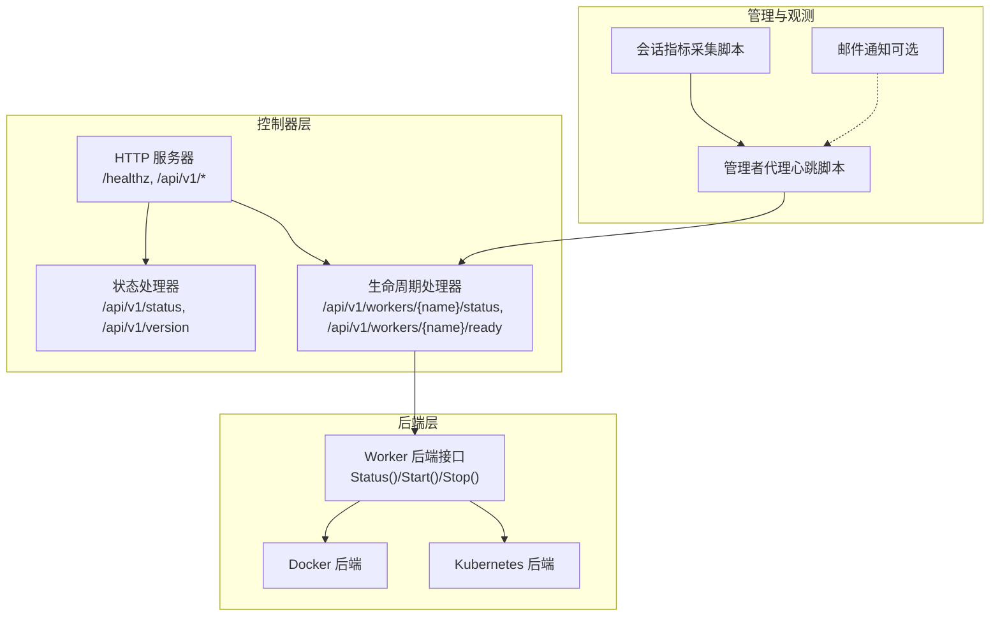
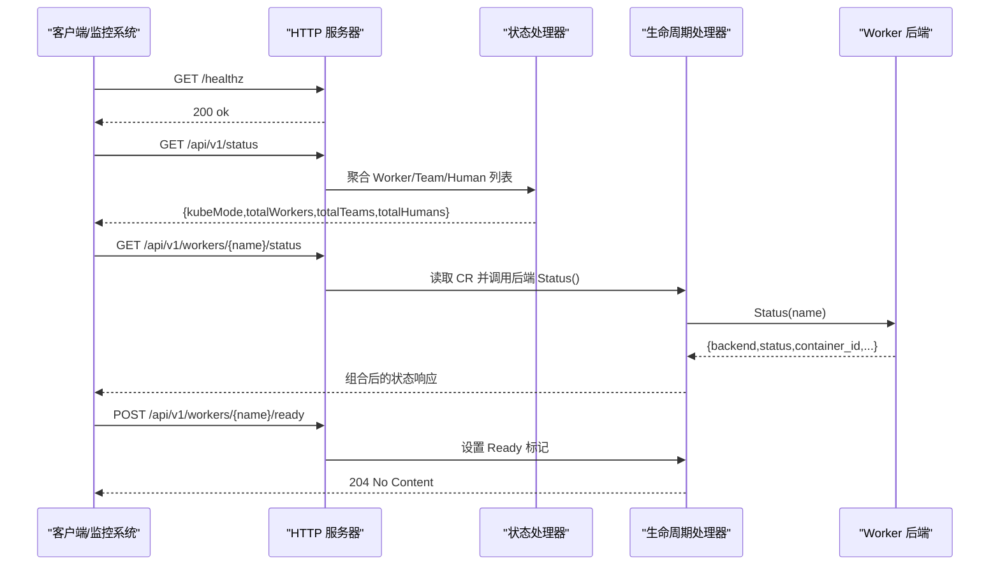
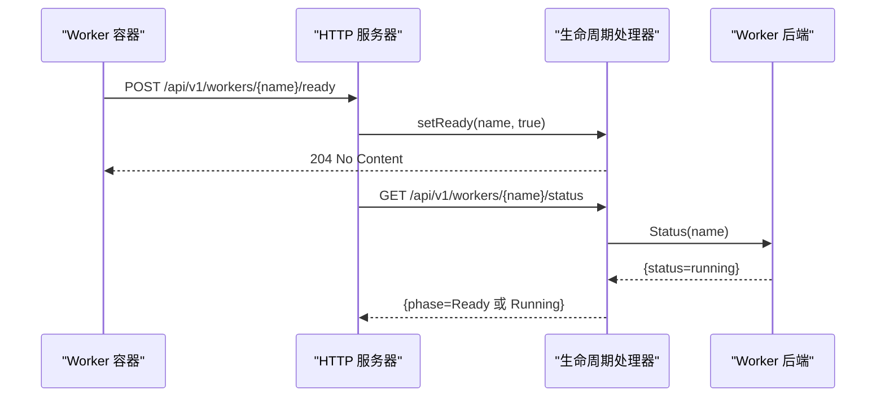
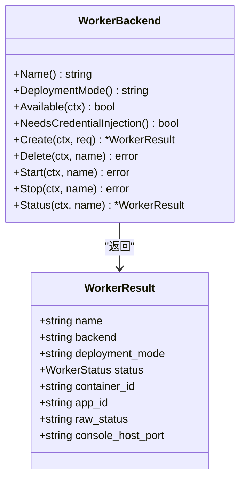
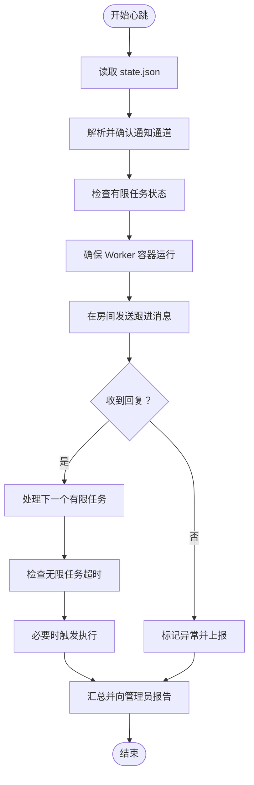
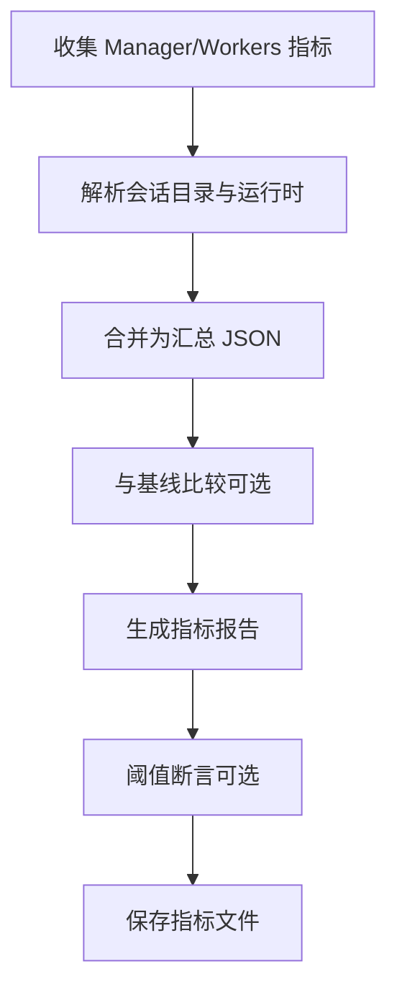
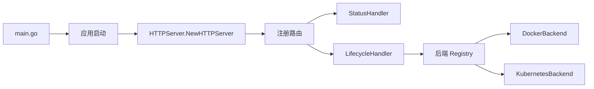

# 监控与告警

<cite>
**本文引用的文件**
- [hiclaw-controller/cmd/controller/main.go](file://hiclaw-controller/cmd/controller/main.go)
- [hiclaw-controller/internal/server/http.go](file://hiclaw-controller/internal/server/http.go)
- [hiclaw-controller/internal/server/status_handler.go](file://hiclaw-controller/internal/server/status_handler.go)
- [hiclaw-controller/internal/server/lifecycle_handler.go](file://hiclaw-controller/internal/server/lifecycle_handler.go)
- [hiclaw-controller/internal/backend/interface.go](file://hiclaw-controller/internal/backend/interface.go)
- [hiclaw-controller/internal/config/config.go](file://hiclaw-controller/internal/config/config.go)
- [hiclaw-controller/internal/mail/smtp.go](file://hiclaw-controller/internal/mail/smtp.go)
- [install/hiclaw-verify.sh](file://install/hiclaw-verify.sh)
- [manager/scripts/init/start-manager-agent.sh](file://manager/scripts/init/start-manager-agent.sh)
- [manager/agent/skills/worker-management/scripts/lifecycle-worker.sh](file://manager/agent/skills/worker-management/scripts/lifecycle-worker.sh)
- [manager/agent/HEARTBEAT.md](file://manager/agent/HEARTBEAT.md)
- [manager/agent/copaw-manager-agent/HEARTBEAT.md](file://manager/agent/copaw-manager-agent/HEARTBEAT.md)
- [tests/lib/agent-metrics.sh](file://tests/lib/agent-metrics.sh)
- [tests/test-05-heartbeat.sh](file://tests/test-05-heartbeat.sh)
</cite>

## 目录
1. [简介](#简介)
2. [项目结构](#项目结构)
3. [核心组件](#核心组件)
4. [架构总览](#架构总览)
5. [详细组件分析](#详细组件分析)
6. [依赖分析](#依赖分析)
7. [性能考虑](#性能考虑)
8. [故障排查指南](#故障排查指南)
9. [结论](#结论)
10. [附录](#附录)

## 简介
本文件面向 HiClaw 的运维与平台工程团队，提供系统级监控与告警的完整指南。内容覆盖控制器健康检查、Worker 运行状态监控与资源使用跟踪、性能指标采集与展示、告警规则配置（阈值、级别与通知渠道）、监控工具集成（Prometheus/Grafana）以及常见场景的配置示例与最佳实践，并说明如何通过 API 获取系统状态与健康检查结果。

## 项目结构
HiClaw 的监控与告警能力由“控制器 API + 后端运行时 + 管理者代理心跳”三部分协同实现：
- 控制器 API：提供健康检查、集群状态查询、版本信息、Worker 生命周期与状态查询接口。
- 后端运行时：抽象容器/集群后端（Docker/Kubernetes），统一暴露 Worker 状态与生命周期操作。
- 管理者代理心跳：周期性检查 Worker 容器状态、任务进度与异常上报，形成可观测闭环。

**图表来源**
- [hiclaw-controller/internal/server/http.go:30-112](file://hiclaw-controller/internal/server/http.go#L30-L112)
- [hiclaw-controller/internal/server/status_handler.go:12-74](file://hiclaw-controller/internal/server/status_handler.go#L12-L74)
- [hiclaw-controller/internal/server/lifecycle_handler.go:15-32](file://hiclaw-controller/internal/server/lifecycle_handler.go#L15-L32)
- [hiclaw-controller/internal/backend/interface.go:179-209](file://hiclaw-controller/internal/backend/interface.go#L179-L209)
- [manager/agent/HEARTBEAT.md:177-192](file://manager/agent/HEARTBEAT.md#L177-L192)
- [tests/lib/agent-metrics.sh:926-1019](file://tests/lib/agent-metrics.sh#L926-L1019)

**章节来源**
- [hiclaw-controller/internal/server/http.go:30-112](file://hiclaw-controller/internal/server/http.go#L30-L112)
- [hiclaw-controller/internal/server/status_handler.go:12-74](file://hiclaw-controller/internal/server/status_handler.go#L12-L74)
- [hiclaw-controller/internal/server/lifecycle_handler.go:15-32](file://hiclaw-controller/internal/server/lifecycle_handler.go#L15-L32)
- [hiclaw-controller/internal/backend/interface.go:179-209](file://hiclaw-controller/internal/backend/interface.go#L179-L209)

## 核心组件
- 健康检查与状态接口
  - /healthz：轻量健康探针，返回成功状态码。
  - /api/v1/status：返回集群维度统计（Worker/Team/Human 数量）。
  - /api/v1/version：返回控制器版本与运行模式。
- Worker 生命周期与状态
  - /api/v1/workers/{name}/status：聚合 CR 与后端状态，返回容器状态与 Ready 标识。
  - /api/v1/workers/{name}/ready：Worker 自报就绪。
  - /api/v1/workers/{name}/wake/sleep/ensure-ready：触发后端启动/停止或确保运行。
- 后端抽象
  - WorkerBackend 接口定义了 Status/Start/Stop/Create/Delete 等操作；支持 Docker 与 Kubernetes 两种部署模式。
- 配置与可观测性开关
  - 控制器配置中包含 CMS 指标与追踪开关，用于启用/禁用诊断插件与指标导出。

**章节来源**
- [hiclaw-controller/internal/server/status_handler.go:23-74](file://hiclaw-controller/internal/server/status_handler.go#L23-L74)
- [hiclaw-controller/internal/server/lifecycle_handler.go:34-160](file://hiclaw-controller/internal/server/lifecycle_handler.go#L34-L160)
- [hiclaw-controller/internal/backend/interface.go:179-209](file://hiclaw-controller/internal/backend/interface.go#L179-L209)
- [hiclaw-controller/internal/config/config.go:306-333](file://hiclaw-controller/internal/config/config.go#L306-L333)

## 架构总览
下图展示了控制器 API 如何与后端交互，以及管理者代理如何通过 API 与脚本进行状态核对与上报。

**图表来源**
- [hiclaw-controller/internal/server/http.go:42-91](file://hiclaw-controller/internal/server/http.go#L42-L91)
- [hiclaw-controller/internal/server/status_handler.go:35-61](file://hiclaw-controller/internal/server/status_handler.go#L35-L61)
- [hiclaw-controller/internal/server/lifecycle_handler.go:176-205](file://hiclaw-controller/internal/server/lifecycle_handler.go#L176-L205)
- [hiclaw-controller/internal/backend/interface.go:207-209](file://hiclaw-controller/internal/backend/interface.go#L207-L209)

## 详细组件分析

### 健康检查与状态 API
- /healthz：用于外部探活，返回 200 表示服务可用。
- /api/v1/status：列出命名空间下的 Worker/Team/Human，返回数量统计，便于仪表盘聚合。
- /api/v1/version：返回控制器版本与运行模式（embedded/incluster）。

这些接口无需鉴权，适合被 Prometheus 等监控系统直接抓取。

**章节来源**
- [hiclaw-controller/internal/server/http.go:42-48](file://hiclaw-controller/internal/server/http.go#L42-L48)
- [hiclaw-controller/internal/server/status_handler.go:23-74](file://hiclaw-controller/internal/server/status_handler.go#L23-L74)

### Worker 运行状态与 Ready 标记
- /api/v1/workers/{name}/status：结合 CR 状态与后端状态，返回容器状态与 Ready 标识。当后端状态为 running 且 Worker 已自报 Ready，则标记为 Ready。
- /api/v1/workers/{name}/ready：Worker 自报 Ready，仅允许该 Worker 自身访问（中间件校验）。
- /api/v1/workers/{name}/wake/sleep/ensure-ready：触发后端启动/停止或确保运行，同时更新 CR 状态以保持声明式一致性。

**图表来源**
- [hiclaw-controller/internal/server/lifecycle_handler.go:162-174](file://hiclaw-controller/internal/server/lifecycle_handler.go#L162-L174)
- [hiclaw-controller/internal/server/lifecycle_handler.go:176-205](file://hiclaw-controller/internal/server/lifecycle_handler.go#L176-L205)

**章节来源**
- [hiclaw-controller/internal/server/lifecycle_handler.go:34-160](file://hiclaw-controller/internal/server/lifecycle_handler.go#L34-L160)

### 后端抽象与状态来源
- WorkerBackend 接口统一了不同后端的状态查询与生命周期操作，支持 Docker 与 Kubernetes。
- WorkerResult 中包含 backend 名称、部署模式、容器状态、容器 ID、控制台端口等字段，便于上层聚合与展示。

**图表来源**
- [hiclaw-controller/internal/backend/interface.go:179-209](file://hiclaw-controller/internal/backend/interface.go#L179-L209)

**章节来源**
- [hiclaw-controller/internal/backend/interface.go:167-177](file://hiclaw-controller/internal/backend/interface.go#L167-L177)

### 管理者代理心跳与健康检查
- 安装验证脚本会根据运行时类型（CoPaw/OpenClaw）分别检查管理器代理健康：
  - CoPaw：访问 /health。
  - OpenClaw：执行 openclaw gateway health --json。
- 管理者代理心跳脚本负责：
  - 确保 Worker 容器处于运行状态（必要时唤醒/重建）。
  - 在项目/任务房间中发送跟进消息，检测 Worker 回复与超时。
  - 将异常与报告通过消息通道发送给管理员。

**图表来源**
- [install/hiclaw-verify.sh:139-164](file://install/hiclaw-verify.sh#L139-L164)
- [manager/agent/HEARTBEAT.md:177-192](file://manager/agent/HEARTBEAT.md#L177-L192)
- [manager/agent/copaw-manager-agent/HEARTBEAT.md:204-233](file://manager/agent/copaw-manager-agent/HEARTBEAT.md#L204-L233)

**章节来源**
- [install/hiclaw-verify.sh:139-164](file://install/hiclaw-verify.sh#L139-L164)
- [manager/agent/HEARTBEAT.md:177-192](file://manager/agent/HEARTBEAT.md#L177-L192)
- [manager/agent/copaw-manager-agent/HEARTBEAT.md:204-233](file://manager/agent/copaw-manager-agent/HEARTBEAT.md#L204-L233)

### 性能指标采集与展示
- 会话指标采集脚本支持：
  - 收集 Manager 与 Worker 的会话指标（如 LLM 调用次数、输入/输出/缓存 Token、总耗时等）。
  - 计算当前与基线的对比，生成报告并支持断言阈值。
  - 输出按角色（Manager/Workers）的汇总与差异分析。
- 测试脚本会在心跳测试中收集并打印指标报告，便于回归与稳定性评估。

**图表来源**
- [tests/lib/agent-metrics.sh:825-834](file://tests/lib/agent-metrics.sh#L825-L834)
- [tests/lib/agent-metrics.sh:926-1019](file://tests/lib/agent-metrics.sh#L926-L1019)
- [tests/lib/agent-metrics.sh:1045-1074](file://tests/lib/agent-metrics.sh#L1045-L1074)
- [tests/test-05-heartbeat.sh:82-91](file://tests/test-05-heartbeat.sh#L82-L91)

**章节来源**
- [tests/lib/agent-metrics.sh:926-1019](file://tests/lib/agent-metrics.sh#L926-L1019)
- [tests/lib/agent-metrics.sh:1045-1074](file://tests/lib/agent-metrics.sh#L1045-L1074)
- [tests/test-05-heartbeat.sh:82-91](file://tests/test-05-heartbeat.sh#L82-L91)

### 告警规则配置指南
- 阈值建议（示例）
  - Worker 可用性：连续 N 分钟 /healthz 失败或 /api/v1/workers/{name}/status 长期非 Running/Ready。
  - 资源压力：Worker 容器 CPU/内存持续超过阈值（需结合后端指标）。
  - 任务超时：无限任务超过计划时间未执行，或有限任务超过 N 个心跳周期无回复。
  - 管理者代理健康：CoPaw/OpenClaw 代理健康检查失败。
- 告警级别
  - Info：发现异常但不影响业务，需要人工核查。
  - Warning：影响单个 Worker 或任务，建议干预。
  - Critical：影响多 Worker/任务或核心链路，需立即处理。
- 通知渠道
  - 矩阵房间：通过管理者代理脚本解析 primary-channel 或 admin DM 发送。
  - 邮件：可选 SMTP 配置（用于欢迎邮件等），见 SMTP 配置项。

**章节来源**
- [hiclaw-controller/internal/mail/smtp.go:10-32](file://hiclaw-controller/internal/mail/smtp.go#L10-L32)
- [manager/agent/HEARTBEAT.md:177-192](file://manager/agent/HEARTBEAT.md#L177-L192)
- [manager/agent/copaw-manager-agent/HEARTBEAT.md:235-258](file://manager/agent/copaw-manager-agent/HEARTBEAT.md#L235-L258)

### 监控工具集成（Prometheus/Grafana）
- Prometheus 抓取
  - 使用 /healthz 作为存活探针，/api/v1/status 作为指标来源（可自定义 exporter 将统计映射为指标）。
  - 对 /api/v1/workers/{name}/status 的聚合结果可作为实例级指标（phase、backend、container_state）。
- Grafana 展示
  - 仪表盘建议指标：Worker 总数、Running/Ready/Stopped 比例、平均初始化耗时、任务超时计数、异常事件趋势。
  - 可视化告警面板：按 Worker/任务/房间维度分组，叠加异常标签。

[本节为通用集成建议，不直接分析具体代码文件]

### 常见监控场景与最佳实践
- 场景一：Worker 异常重启
  - 触发条件：/api/v1/workers/{name}/status 长期显示 Stopped/Unknown，后端 Status 返回 not_found。
  - 处理：自动 ensure-ready 或 wake，若失败则上报管理员。
- 场景二：任务长时间无进展
  - 触发条件：无限任务超过计划时间未执行；有限任务超过 N 个心跳周期无回复。
  - 处理：发送跟进消息并等待回复，超时后标记异常并上报。
- 场景三：管理者代理不可达
  - 触发条件：/healthz 或运行时健康检查失败。
  - 处理：检查容器/网络/凭证注入，必要时重启或切换后端。

**章节来源**
- [hiclaw-controller/internal/server/lifecycle_handler.go:176-205](file://hiclaw-controller/internal/server/lifecycle_handler.go#L176-L205)
- [manager/agent/HEARTBEAT.md:177-192](file://manager/agent/HEARTBEAT.md#L177-L192)
- [install/hiclaw-verify.sh:139-164](file://install/hiclaw-verify.sh#L139-L164)

## 依赖分析
- 控制器入口通过 main.go 启动应用，应用内部创建 HTTPServer 并注册路由。
- HTTPServer 将 /healthz、/api/v1/status、/api/v1/version、/api/v1/workers/{name}/status 等路由与处理器绑定。
- 生命周期处理器依赖后端 Registry，按环境选择 Docker 或 Kubernetes 后端。

**图表来源**
- [hiclaw-controller/cmd/controller/main.go:16-36](file://hiclaw-controller/cmd/controller/main.go#L16-L36)
- [hiclaw-controller/internal/server/http.go:36-112](file://hiclaw-controller/internal/server/http.go#L36-L112)
- [hiclaw-controller/internal/backend/interface.go:179-209](file://hiclaw-controller/internal/backend/interface.go#L179-L209)

**章节来源**
- [hiclaw-controller/cmd/controller/main.go:16-36](file://hiclaw-controller/cmd/controller/main.go#L16-L36)
- [hiclaw-controller/internal/server/http.go:36-112](file://hiclaw-controller/internal/server/http.go#L36-L112)

## 性能考虑
- 探针与查询频率
  - /healthz：建议每 5–10 秒一次，避免过载。
  - /api/v1/status：建议每 30–60 秒一次，避免频繁列表 API。
  - /api/v1/workers/{name}/status：按 Worker 数量与活跃度动态调整频率。
- 指标采集
  - 会话指标采集涉及容器/文件系统扫描，建议在空闲时段执行或限制 Worker 数量。
  - 对比基线时注意 I/O 与 JSON 解析开销，可缓存上次结果。
- 后端选择
  - Docker 后端适用于本地/开发环境；Kubernetes 后端适用于生产，具备更强的资源隔离与弹性。

[本节提供通用指导，不直接分析具体代码文件]

## 故障排查指南
- 控制器无法访问
  - 检查 /healthz 是否返回 200；若失败，查看控制器日志与监听地址配置。
- Worker 状态异常
  - 使用 /api/v1/workers/{name}/status 查看后端状态与 Ready 标记；若后端返回 not_found，尝试 ensure-ready 或 recreate。
- 管理者代理健康问题
  - CoPaw：检查 /health；OpenClaw：执行 openclaw gateway health --json 并解析输出。
  - 若健康检查失败，检查容器 API 可用性与网络连通性。
- 指标缺失或异常
  - 确认运行时是否支持会话指标记录；若不支持，采集脚本会输出占位数据，需升级运行时或启用诊断插件。
- 通知渠道不通
  - 检查 primary-channel.json 与 admin DM 房间解析；若 none，先完成管理员 DM 房间发现流程。

**章节来源**
- [hiclaw-controller/internal/server/http.go:42-48](file://hiclaw-controller/internal/server/http.go#L42-L48)
- [hiclaw-controller/internal/server/lifecycle_handler.go:176-205](file://hiclaw-controller/internal/server/lifecycle_handler.go#L176-L205)
- [install/hiclaw-verify.sh:139-164](file://install/hiclaw-verify.sh#L139-L164)
- [manager/agent/HEARTBEAT.md:177-192](file://manager/agent/HEARTBEAT.md#L177-L192)
- [tests/lib/agent-metrics.sh:752-783](file://tests/lib/agent-metrics.sh#L752-L783)

## 结论
HiClaw 的监控与告警体系以控制器 API 为核心，结合后端抽象与管理者代理心跳，实现了从“健康检查—状态聚合—异常上报”的闭环。通过 /healthz、/api/v1/status、/api/v1/workers/{name}/status 等接口，可快速构建 Prometheus 抓取与 Grafana 展示；配合会话指标采集脚本，能够量化 LLM 使用与任务执行效率。建议在生产环境中启用 Ready 标记、任务超时告警与通知渠道校验，确保异常可感知、可追踪、可处置。

[本节为总结性内容，不直接分析具体代码文件]

## 附录
- API 参考（路径与用途）
  - GET /healthz：健康探针
  - GET /api/v1/status：集群状态统计
  - GET /api/v1/version：版本信息
  - GET /api/v1/workers/{name}/status：Worker 运行状态
  - POST /api/v1/workers/{name}/ready：Worker 自报 Ready
  - POST /api/v1/workers/{name}/wake/sleep/ensure-ready：生命周期操作
- 关键配置项（示例）
  - HICLAW_HTTP_ADDR：HTTP 服务器监听地址
  - HICLAW_KUBE_MODE：embedded 或 incluster
  - HICLAW_CMS_METRICS_ENABLED：启用 CMS 指标导出
  - HICLAW_SMTP_*：邮件通知相关配置（可选）

**章节来源**
- [hiclaw-controller/internal/server/http.go:42-91](file://hiclaw-controller/internal/server/http.go#L42-L91)
- [hiclaw-controller/internal/config/config.go:207-356](file://hiclaw-controller/internal/config/config.go#L207-L356)
- [hiclaw-controller/internal/mail/smtp.go:10-32](file://hiclaw-controller/internal/mail/smtp.go#L10-L32)