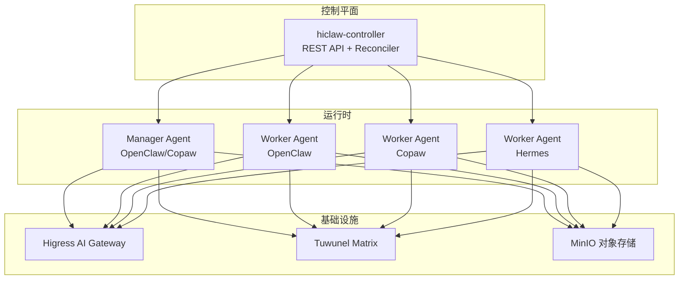
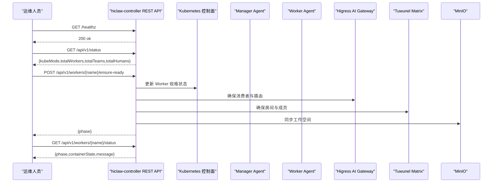
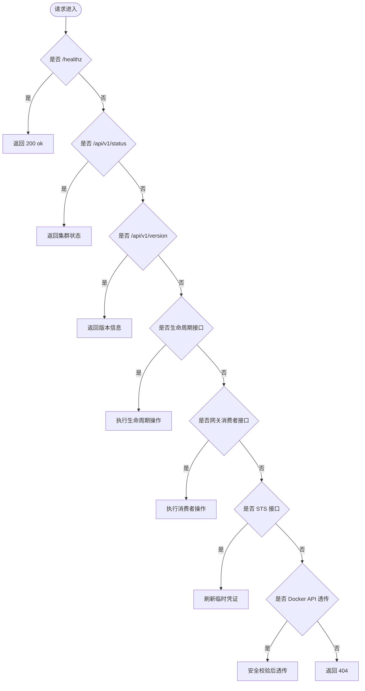
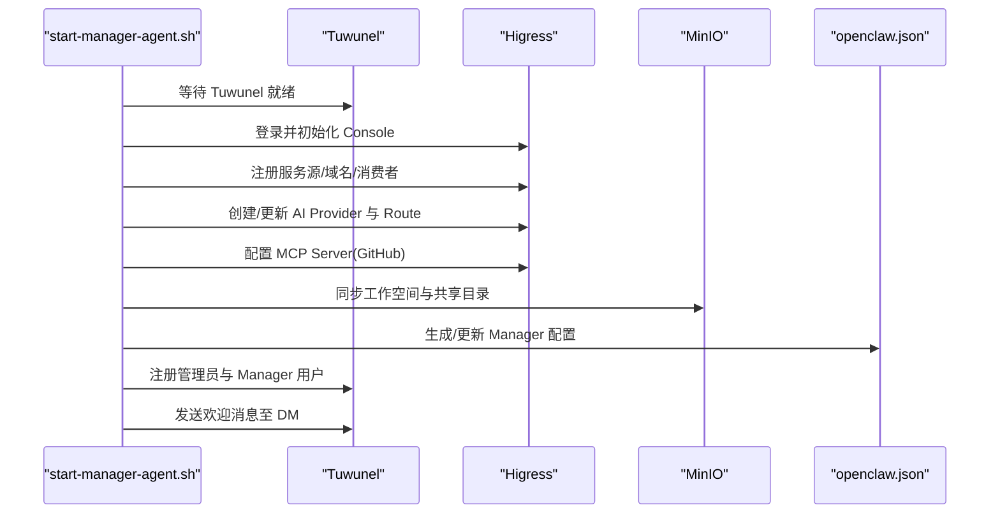
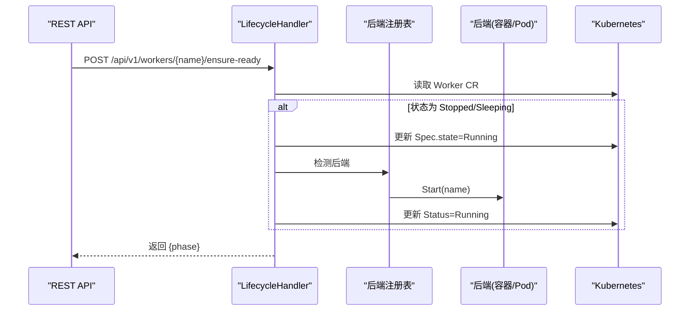
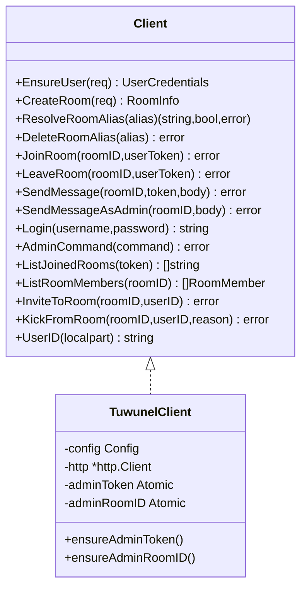
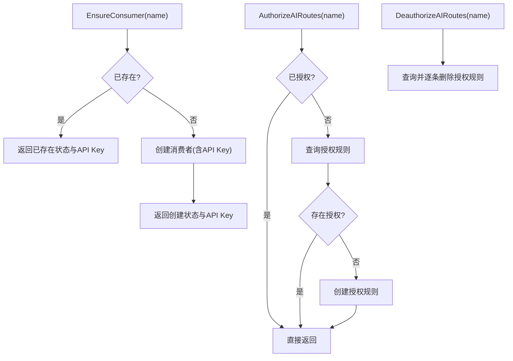
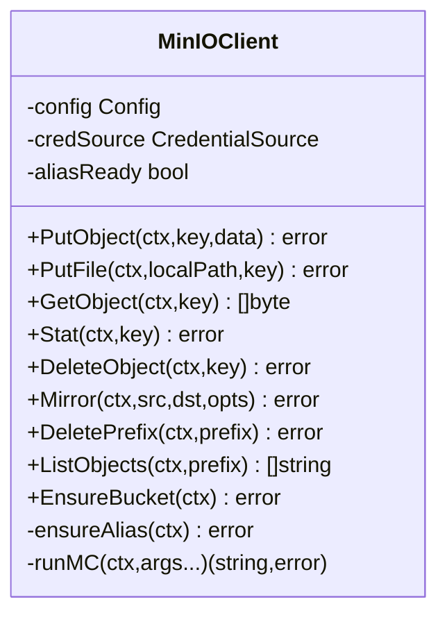
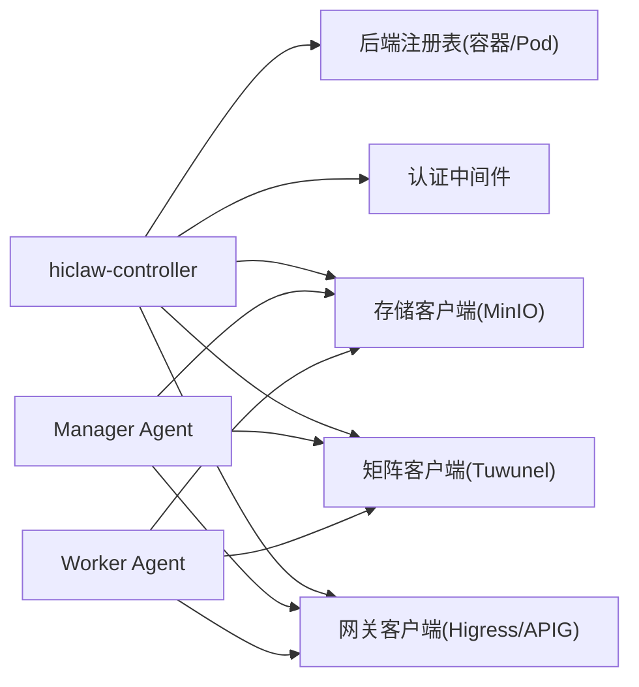
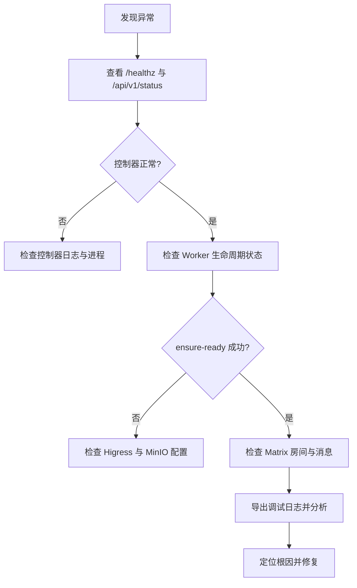

# 运维管理

<cite>
**本文引用的文件**
- [README.md](file://README.md)
- [hiclaw-controller/cmd/controller/main.go](file://hiclaw-controller/cmd/controller/main.go)
- [hiclaw-controller/internal/server/http.go](file://hiclaw-controller/internal/server/http.go)
- [hiclaw-controller/internal/server/status_handler.go](file://hiclaw-controller/internal/server/status_handler.go)
- [hiclaw-controller/internal/server/lifecycle_handler.go](file://hiclaw-controller/internal/server/lifecycle_handler.go)
- [hiclaw-controller/internal/matrix/client.go](file://hiclaw-controller/internal/matrix/client.go)
- [hiclaw-controller/internal/gateway/aigateway.go](file://hiclaw-controller/internal/gateway/aigateway.go)
- [hiclaw-controller/internal/oss/minio.go](file://hiclaw-controller/internal/oss/minio.go)
- [manager/scripts/init/start-manager-agent.sh](file://manager/scripts/init/start-manager-agent.sh)
- [manager/scripts/init/setup-higress.sh](file://manager/scripts/init/setup-higress.sh)
- [manager/Dockerfile](file://manager/Dockerfile)
- [copaw/Dockerfile](file://copaw/Dockerfile)
- [hermes/Dockerfile](file://hermes/Dockerfile)
- [copaw/src/copaw_worker/cli.py](file://copaw/src/copaw_worker/cli.py)
- [hermes/src/hermes_worker/cli.py](file://hermes/src/hermes_worker/cli.py)
- [install/hiclaw-install.sh](file://install/hiclaw-install.sh)
- [scripts/export-debug-log.py](file://scripts/export-debug-log.py)
- [tests/skills/hiclaw-test/scripts/hiclaw-debug.sh](file://tests/skills/hiclaw-test/scripts/hiclaw-debug.sh)
</cite>

## 目录
1. [简介](#简介)
2. [项目结构](#项目结构)
3. [核心组件](#核心组件)
4. [架构总览](#架构总览)
5. [详细组件分析](#详细组件分析)
6. [依赖关系分析](#依赖关系分析)
7. [性能考虑](#性能考虑)
8. [故障排查指南](#故障排查指南)
9. [结论](#结论)
10. [附录](#附录)

## 简介
本运维管理文档面向 HiClaw 生产环境的运行维护，覆盖监控与告警、日志管理、性能优化、故障排查、备份与恢复、运维自动化以及生产部署最佳实践与安全加固建议。HiClaw 是一个基于 Manager-Workers 架构的多智能体协作平台，通过 Higress AI Gateway、Tuwunel Matrix、MinIO 文件系统等基础设施实现企业级的安全与可观测性。

## 项目结构
HiClaw 由控制器（hiclaw-controller）、Manager Agent、Worker Agent（OpenClaw/QwenPaw/Hermes）、Higress AI Gateway、Tuwunel Matrix、MinIO 文件系统及 Helm Chart 组成。控制器负责 Kubernetes 原生控制平面（CRD/Reconciler），提供统一 REST API；Manager/Worker 通过脚本与容器镜像初始化，完成矩阵注册、网关路由与消费者配置、存储同步等；Helm Chart 提供一键安装与升级。

图示来源
- [hiclaw-controller/cmd/controller/main.go:16-36](file://hiclaw-controller/cmd/controller/main.go#L16-L36)
- [hiclaw-controller/internal/server/http.go:36-112](file://hiclaw-controller/internal/server/http.go#L36-L112)
- [manager/scripts/init/start-manager-agent.sh:1-120](file://manager/scripts/init/start-manager-agent.sh#L1-L120)
- [manager/scripts/init/setup-higress.sh:1-120](file://manager/scripts/init/setup-higress.sh#L1-L120)

章节来源
- [README.md:110-238](file://README.md#L110-L238)

## 核心组件
- 控制器（hiclaw-controller）
  - 提供统一 REST API：健康检查、集群状态、版本、资源 CRUD、生命周期、网关消费者、凭证等。
  - 内置认证中间件与鉴权策略，支持声明式资源与命令式生命周期操作。
- Manager Agent
  - 初始化与启动：等待基础设施就绪、注册 Matrix 用户、配置 Higress、生成 Manager 配置、发送欢迎消息。
  - 支持 OpenClaw/Copaw 运行时，提供可观测性插件（CMS）。
- Worker Agent
  - 支持 OpenClaw/QwenPaw/Hermes 运行时，通过 MinIO 同步配置与技能，提供 CLI 入口。
- 基础设施
  - Higress AI Gateway：AI 路由、消费者、MCP 服务器、认证与授权。
  - Tuwunel Matrix：自建 Matrix 服务，提供房间、成员、消息等能力。
  - MinIO：对象存储，用于共享文件与工作空间同步。

章节来源
- [hiclaw-controller/internal/server/http.go:36-112](file://hiclaw-controller/internal/server/http.go#L36-L112)
- [hiclaw-controller/internal/server/status_handler.go:23-74](file://hiclaw-controller/internal/server/status_handler.go#L23-L74)
- [hiclaw-controller/internal/server/lifecycle_handler.go:34-205](file://hiclaw-controller/internal/server/lifecycle_handler.go#L34-L205)
- [manager/scripts/init/start-manager-agent.sh:1-120](file://manager/scripts/init/start-manager-agent.sh#L1-L120)
- [manager/scripts/init/setup-higress.sh:1-120](file://manager/scripts/init/setup-higress.sh#L1-L120)
- [manager/Dockerfile:1-87](file://manager/Dockerfile#L1-L87)
- [copaw/Dockerfile:1-132](file://copaw/Dockerfile#L1-L132)
- [hermes/Dockerfile:1-175](file://hermes/Dockerfile#L1-L175)

## 架构总览
控制器作为统一入口，暴露健康检查、状态查询、资源管理与生命周期控制接口；Manager/Worker 通过脚本完成初始化与配置注入；Higress 负责 AI 流量与 MCP 服务，Tuwunel 提供 Matrix 通信，MinIO 提供共享存储。

图示来源
- [hiclaw-controller/internal/server/http.go:42-98](file://hiclaw-controller/internal/server/http.go#L42-L98)
- [hiclaw-controller/internal/server/status_handler.go:35-61](file://hiclaw-controller/internal/server/status_handler.go#L35-L61)
- [hiclaw-controller/internal/server/lifecycle_handler.go:112-160](file://hiclaw-controller/internal/server/lifecycle_handler.go#L112-L160)
- [hiclaw-controller/internal/matrix/client.go:254-332](file://hiclaw-controller/internal/matrix/client.go#L254-L332)
- [hiclaw-controller/internal/gateway/aigateway.go:104-151](file://hiclaw-controller/internal/gateway/aigateway.go#L104-L151)
- [hiclaw-controller/internal/oss/minio.go:138-159](file://hiclaw-controller/internal/oss/minio.go#L138-L159)

## 详细组件分析

### 控制器 REST API 与健康检查
- 健康检查：/healthz 返回 ok。
- 状态查询：/api/v1/status 返回集群资源数量；/api/v1/version 返回控制器版本与模式。
- 生命周期：/api/v1/workers/{name}/ensure-ready、/api/v1/workers/{name}/status、/api/v1/workers/{name}/ready 等。
- 网关消费者：/api/v1/gateway/consumers、/api/v1/gateway/consumers/{id}/bind、/api/v1/gateway/consumers/{id}。
- 凭证：/api/v1/credentials/sts（临时凭证刷新）。
- Docker API 透传（嵌入式模式）：/docker/。

图示来源
- [hiclaw-controller/internal/server/http.go:42-112](file://hiclaw-controller/internal/server/http.go#L42-L112)
- [hiclaw-controller/internal/server/status_handler.go:23-74](file://hiclaw-controller/internal/server/status_handler.go#L23-L74)
- [hiclaw-controller/internal/server/lifecycle_handler.go:34-205](file://hiclaw-controller/internal/server/lifecycle_handler.go#L34-L205)

章节来源
- [hiclaw-controller/internal/server/http.go:36-112](file://hiclaw-controller/internal/server/http.go#L36-L112)
- [hiclaw-controller/internal/server/status_handler.go:12-74](file://hiclaw-controller/internal/server/status_handler.go#L12-L74)

### Manager Agent 初始化与 Higress 配置
- 等待基础设施就绪（Higress、Tuwunel、MinIO）。
- 注册 Matrix 用户（管理员与 Manager），登录获取 Token。
- 初始化 Higress：注册服务源、域名、消费者、AI Provider、AI Route、MCP Server（GitHub）。
- 生成 Manager 配置（openclaw.json），应用云/本地覆盖。
- 发送欢迎消息至管理员 DM 房间。

图示来源
- [manager/scripts/init/start-manager-agent.sh:106-290](file://manager/scripts/init/start-manager-agent.sh#L106-L290)
- [manager/scripts/init/setup-higress.sh:96-327](file://manager/scripts/init/setup-higress.sh#L96-L327)

章节来源
- [manager/scripts/init/start-manager-agent.sh:1-290](file://manager/scripts/init/start-manager-agent.sh#L1-L290)
- [manager/scripts/init/setup-higress.sh:1-327](file://manager/scripts/init/setup-higress.sh#L1-L327)

### Worker Agent 生命周期与就绪上报
- 命令式生命周期：/api/v1/workers/{name}/wake、/api/v1/workers/{name}/sleep、/api/v1/workers/{name}/ensure-ready。
- 就绪上报：/api/v1/workers/{name}/ready（由 Worker 自报）。
- 状态聚合：/api/v1/workers/{name}/status（结合 CR 与后端状态）。

图示来源
- [hiclaw-controller/internal/server/lifecycle_handler.go:112-160](file://hiclaw-controller/internal/server/lifecycle_handler.go#L112-L160)

章节来源
- [hiclaw-controller/internal/server/lifecycle_handler.go:34-205](file://hiclaw-controller/internal/server/lifecycle_handler.go#L34-L205)

### 矩阵客户端与房间管理
- 用户注册/登录、房间创建/别名解析/删除、加入/离开、消息发送、管理员命令、成员列表、邀请/踢出等。
- 支持端到端加密（E2EE）开关与管理员身份缓存。

图示来源
- [hiclaw-controller/internal/matrix/client.go:16-87](file://hiclaw-controller/internal/matrix/client.go#L16-L87)
- [hiclaw-controller/internal/matrix/client.go:89-112](file://hiclaw-controller/internal/matrix/client.go#L89-L112)

章节来源
- [hiclaw-controller/internal/matrix/client.go:131-225](file://hiclaw-controller/internal/matrix/client.go#L131-L225)

### Higress AI Gateway 与消费者管理
- 支持消费者创建/删除、授权/撤销授权 AI 路由。
- 健康检查：轻量调用消费者列表。
- 云平台（APIG）模式下，不支持路由/服务源/Provider 管理，返回不支持错误。

图示来源
- [hiclaw-controller/internal/gateway/aigateway.go:104-250](file://hiclaw-controller/internal/gateway/aigateway.go#L104-L250)

章节来源
- [hiclaw-controller/internal/gateway/aigateway.go:23-303](file://hiclaw-controller/internal/gateway/aigateway.go#L23-L303)

### MinIO 存储客户端
- 基于 mc CLI 的存储客户端，支持静态/动态凭据模式。
- 提供 Put/Get/Object、Stat、Delete、Mirror、List、EnsureBucket 等操作。
- 动态凭据模式通过环境变量注入 MC_HOST 到 mc 命令。

图示来源
- [hiclaw-controller/internal/oss/minio.go:13-67](file://hiclaw-controller/internal/oss/minio.go#L13-L67)
- [hiclaw-controller/internal/oss/minio.go:203-226](file://hiclaw-controller/internal/oss/minio.go#L203-L226)

章节来源
- [hiclaw-controller/internal/oss/minio.go:73-201](file://hiclaw-controller/internal/oss/minio.go#L73-L201)

### Worker 运行时镜像与 CLI
- Manager 镜像：基于 openclaw-base，内置 mc、hiclaw CLI，打包 CMS 插件。
- Copaw Worker 镜像：Python 基础，安装 copaw、mcporter、skills CLI，提供 copaw-sync 包装。
- Hermes Worker 镜像：安装 hermes-agent，注入矩阵适配器，提供 hermes-worker CLI。
- Worker CLI：提供 name、fs、fs-key、fs-secret、fs-bucket、sync-interval、install-dir 等参数。

章节来源
- [manager/Dockerfile:1-87](file://manager/Dockerfile#L1-L87)
- [copaw/Dockerfile:1-132](file://copaw/Dockerfile#L1-L132)
- [hermes/Dockerfile:1-175](file://hermes/Dockerfile#L1-L175)
- [copaw/src/copaw_worker/cli.py:21-69](file://copaw/src/copaw_worker/cli.py#L21-L69)
- [hermes/src/hermes_worker/cli.py:21-72](file://hermes/src/hermes_worker/cli.py#L21-L72)

## 依赖关系分析
- 控制器依赖
  - 认证中间件：鉴权与授权。
  - 网关客户端：Higress/APIG。
  - 矩阵客户端：Tuwunel。
  - 存储客户端：MinIO。
  - 后端注册表：容器/Pod 管理。
- Manager/Worker 依赖
  - Higress：AI 路由与消费者。
  - Tuwunel：房间与消息。
  - MinIO：工作空间与共享文件。

图示来源
- [hiclaw-controller/internal/server/http.go:16-28](file://hiclaw-controller/internal/server/http.go#L16-L28)
- [hiclaw-controller/internal/gateway/aigateway.go:55-84](file://hiclaw-controller/internal/gateway/aigateway.go#L55-L84)
- [hiclaw-controller/internal/matrix/client.go:90-112](file://hiclaw-controller/internal/matrix/client.go#L90-L112)
- [hiclaw-controller/internal/oss/minio.go:25-50](file://hiclaw-controller/internal/oss/minio.go#L25-L50)

章节来源
- [hiclaw-controller/internal/server/http.go:16-28](file://hiclaw-controller/internal/server/http.go#L16-L28)

## 性能考虑
- 资源调优
  - Manager/Worker 资源请求与限制：根据模型与并发任务调整 CPU/内存。
  - MinIO：持久化卷与副本策略，确保高可用与吞吐。
  - Higress：路由与插件配置对延迟的影响，合理设置超时与并发。
- 缓存策略
  - 使用 jemalloc 降低 Python 内存碎片，减少 RSS。
  - MinIO 客户端采用 mc alias 缓存静态凭据，动态凭据通过环境变量注入。
- 负载均衡
  - 外部流量通过 Ingress/LB 指向 Higress Gateway。
  - Matrix 通过 Element Web 与移动端直连 Tuwunel。
  - Worker 通过 MinIO 同步配置，避免重复下载。

章节来源
- [copaw/Dockerfile:44-48](file://copaw/Dockerfile#L44-L48)
- [hermes/Dockerfile:62-66](file://hermes/Dockerfile#L62-L66)
- [hiclaw-controller/internal/oss/minio.go:52-67](file://hiclaw-controller/internal/oss/minio.go#L52-L67)

## 故障排查指南
- 健康检查
  - /healthz：确认控制器进程存活。
  - /api/v1/status：确认集群资源数量与模式。
- 日志导出
  - 使用导出脚本收集 Matrix 消息与 Agent 会话日志，便于 AI 辅助根因分析。
- 调试技巧
  - Manager/Worker 日志位置：容器内日志目录。
  - 通过 hiclaw CLI 查询资源状态与生命周期。
  - 使用测试技能脚本进行本地调试。
- 常见问题
  - Higress Console 会话失效：重新登录并验证 Cookie。
  - 管理员账户被回收：通过 Admin Bot 重置密码后重试登录。
  - MinIO 同步失败：检查凭据与网络连通性。

图示来源
- [hiclaw-controller/internal/server/status_handler.go:23-61](file://hiclaw-controller/internal/server/status_handler.go#L23-L61)
- [hiclaw-controller/internal/server/lifecycle_handler.go:112-160](file://hiclaw-controller/internal/server/lifecycle_handler.go#L112-L160)
- [scripts/export-debug-log.py:1-200](file://scripts/export-debug-log.py#L1-L200)
- [tests/skills/hiclaw-test/scripts/hiclaw-debug.sh:1-200](file://tests/skills/hiclaw-test/scripts/hiclaw-debug.sh#L1-L200)

章节来源
- [README.md:355-379](file://README.md#L355-L379)
- [scripts/export-debug-log.py:1-200](file://scripts/export-debug-log.py#L1-L200)
- [tests/skills/hiclaw-test/scripts/hiclaw-debug.sh:1-200](file://tests/skills/hiclaw-test/scripts/hiclaw-debug.sh#L1-L200)

## 结论
HiClaw 提供了完整的运维闭环：控制器统一管理、Manager/Worker 自动初始化、Higress 与 Tuwunel 提供安全与通信保障、MinIO 实现共享存储。通过健康检查、状态查询、生命周期控制与可观测性插件，可实现高效运维与快速故障定位。建议在生产环境中结合 Helm Chart 进行标准化部署，并持续完善监控、日志与备份策略。

## 附录

### 监控与告警配置
- 健康检查
  - /healthz：控制器存活探针。
  - /api/v1/status：集群资源状态。
- 性能指标
  - 使用控制器内置状态接口与 Worker/Manager 日志采集。
  - 可结合 CMS 插件与外部 APM 平台（如 ARMS）进行指标采集。
- 异常告警
  - 基于 /api/v1/workers/{name}/status 与生命周期接口返回的 phase/message。
  - 结合日志导出与 AI 分析，建立根因告警。

章节来源
- [hiclaw-controller/internal/server/status_handler.go:23-74](file://hiclaw-controller/internal/server/status_handler.go#L23-L74)
- [hiclaw-controller/internal/server/lifecycle_handler.go:176-205](file://hiclaw-controller/internal/server/lifecycle_handler.go#L176-L205)
- [manager/Dockerfile:32-47](file://manager/Dockerfile#L32-L47)

### 日志管理策略
- 收集
  - 控制器：标准输出日志，结合 systemd/docker 日志驱动。
  - Manager/Worker：容器内日志目录，定期归档。
- 存储
  - 使用集中式日志系统（如 ELK/ Loki）收集与索引。
- 分析与可视化
  - 通过导出脚本生成 JSONL 文件，配合 AI 工具进行根因分析。
  - 在 Element Web 中导出聊天记录，辅助问题复现。

章节来源
- [scripts/export-debug-log.py:1-200](file://scripts/export-debug-log.py#L1-L200)
- [README.md:367-379](file://README.md#L367-L379)

### 备份与恢复
- 数据保护
  - MinIO：对象存储快照与跨区域复制。
  - Manager/Worker 工作空间：定期备份与版本化存储。
- 灾难恢复
  - 控制器：重建 CRD 与控制器实例，恢复资源状态。
  - Manager/Worker：通过控制器 API 重建与同步。
- 业务连续性
  - 多副本部署与滚动升级策略。
  - 关键服务（Higress、Tuwunel、MinIO）高可用配置。

章节来源
- [hiclaw-controller/internal/oss/minio.go:194-201](file://hiclaw-controller/internal/oss/minio.go#L194-L201)
- [manager/scripts/init/start-manager-agent.sh:171-182](file://manager/scripts/init/start-manager-agent.sh#L171-L182)

### 运维自动化脚本与工具
- 安装与升级
  - 一键安装脚本：交互式与非交互式模式，支持多种提供商与端口配置。
  - Helm Chart：一键安装/升级/卸载，支持多区域镜像仓库。
- 调试与诊断
  - 导出调试日志脚本。
  - 测试技能脚本：本地调试与验证。
- CLI 工具
  - hiclaw CLI：资源管理与状态查询。
  - Worker CLI：Copaw/Hermes Worker 启动参数与同步间隔。

章节来源
- [install/hiclaw-install.sh:1-200](file://install/hiclaw-install.sh#L1-L200)
- [README.md:110-238](file://README.md#L110-L238)
- [copaw/src/copaw_worker/cli.py:21-69](file://copaw/src/copaw_worker/cli.py#L21-L69)
- [hermes/src/hermes_worker/cli.py:21-72](file://hermes/src/hermes_worker/cli.py#L21-L72)

### 生产环境部署最佳实践与安全加固
- 部署最佳实践
  - 使用 Helm Chart 进行标准化部署，配置 Ingress/LB 与 TLS。
  - 为关键服务配置专用命名空间与 RBAC。
  - 启用 Pod 安全标准（如 baseline）与资源限制。
- 安全加固
  - 网关安全：消费者凭据最小权限、路由授权白名单。
  - 矩阵安全：E2EE 可选启用，房间加密策略统一。
  - 存储安全：凭据注入与轮换、只读访问策略。
  - 网络安全：最小暴露端口、内部域名与外部域名分离。

章节来源
- [README.md:110-238](file://README.md#L110-L238)
- [manager/scripts/init/setup-higress.sh:160-327](file://manager/scripts/init/setup-higress.sh#L160-L327)
- [hiclaw-controller/internal/gateway/aigateway.go:170-212](file://hiclaw-controller/internal/gateway/aigateway.go#L170-L212)
- [hiclaw-controller/internal/matrix/client.go:477-490](file://hiclaw-controller/internal/matrix/client.go#L477-L490)