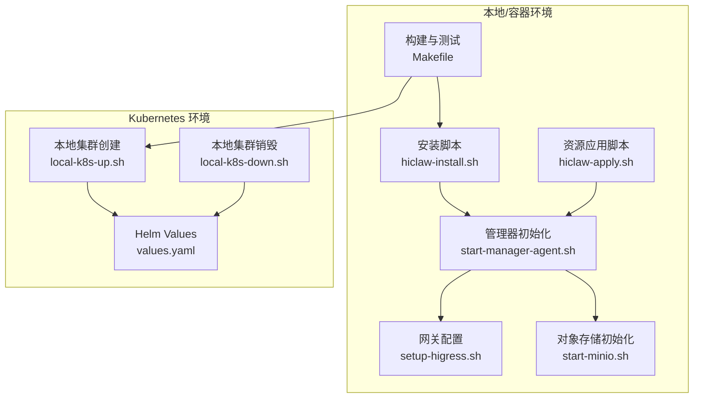
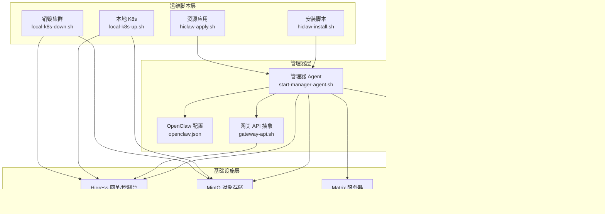
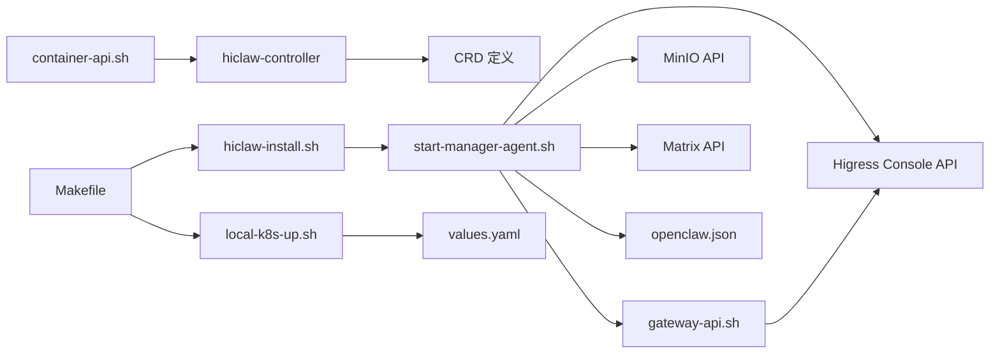

# 运维自动化

<cite>
**本文引用的文件**
- [hiclaw-install.sh](file://install/hiclaw-install.sh)
- [hiclaw-apply.sh](file://install/hiclaw-apply.sh)
- [local-k8s-up.sh](file://hack/local-k8s-up.sh)
- [local-k8s-down.sh](file://hack/local-k8s-down.sh)
- [setup-higress.sh](file://manager/scripts/init/setup-higress.sh)
- [start-manager-agent.sh](file://manager/scripts/init/start-manager-agent.sh)
- [start-minio.sh](file://manager/scripts/init/start-minio.sh)
- [Makefile](file://Makefile)
- [Dockerfile（Manager）](file://manager/Dockerfile)
- [Dockerfile（控制器）](file://hiclaw-controller/Dockerfile)
- [values.yaml（Helm）](file://helm/hiclaw/values.yaml)
- [base.sh](file://manager/scripts/lib/base.sh)
- [container-api.sh](file://manager/scripts/lib/container-api.sh)
- [gateway-api.sh](file://manager/scripts/lib/gateway-api.sh)
</cite>

## 目录
1. [简介](#简介)
2. [项目结构](#项目结构)
3. [核心组件](#核心组件)
4. [架构总览](#架构总览)
5. [详细组件分析](#详细组件分析)
6. [依赖关系分析](#依赖关系分析)
7. [性能考量](#性能考量)
8. [故障排查指南](#故障排查指南)
9. [结论](#结论)
10. [附录](#附录)

## 简介
本文件面向 HiClaw 的运维与平台工程团队，系统化梳理并输出“运维自动化”实践文档。内容覆盖：
- 自动化脚本使用：部署、监控、维护与资源编排
- CI/CD 集成：构建、测试、发布与 Helm 部署流水线
- 运维工具：批量操作、配置管理、状态监控与可观测性
- 基础设施即代码（IaC）：Kubernetes（Kind/Helm）、Docker Compose（本地）
- 自动化告警与自愈：健康检查、重试与降级策略
- 运维流程标准化：SOP 与变更管理
- 质量保障：自动化测试与可维护性

## 项目结构
HiClaw 的运维自动化围绕“安装脚本 + 控制器 + 管理器 + Worker + 网关 + 存储 + Helm Chart”的组合展开。关键自动化入口如下：
- 一键安装与升级：install/hiclaw-install.sh
- 资源声明式应用：install/hiclaw-apply.sh
- 本地 K8s 快速搭建：hack/local-k8s-up.sh、hack/local-k8s-down.sh
- 管理器初始化与网关配置：manager/scripts/init/start-manager-agent.sh、setup-higress.sh
- 存储初始化：manager/scripts/init/start-minio.sh
- 构建与测试：Makefile
- 容器镜像：manager/Dockerfile、hiclaw-controller/Dockerfile
- Helm 部署：helm/hiclaw/values.yaml
- 运维脚本库：manager/scripts/lib/base.sh、container-api.sh、gateway-api.sh

图表来源
- [hiclaw-install.sh:1-800](file://install/hiclaw-install.sh#L1-L800)
- [hiclaw-apply.sh:1-85](file://install/hiclaw-apply.sh#L1-L85)
- [start-manager-agent.sh:1-800](file://manager/scripts/init/start-manager-agent.sh#L1-L800)
- [setup-higress.sh:1-327](file://manager/scripts/init/setup-higress.sh#L1-L327)
- [start-minio.sh:1-10](file://manager/scripts/init/start-minio.sh#L1-L10)
- [Makefile:1-823](file://Makefile#L1-L823)
- [local-k8s-up.sh:1-260](file://hack/local-k8s-up.sh#L1-L260)
- [local-k8s-down.sh:1-28](file://hack/local-k8s-down.sh#L1-L28)
- [values.yaml（Helm）:1-263](file://helm/hiclaw/values.yaml#L1-L263)

章节来源
- [hiclaw-install.sh:1-800](file://install/hiclaw-install.sh#L1-L800)
- [hiclaw-apply.sh:1-85](file://install/hiclaw-apply.sh#L1-L85)
- [start-manager-agent.sh:1-800](file://manager/scripts/init/start-manager-agent.sh#L1-L800)
- [setup-higress.sh:1-327](file://manager/scripts/init/setup-higress.sh#L1-L327)
- [start-minio.sh:1-10](file://manager/scripts/init/start-minio.sh#L1-L10)
- [Makefile:1-823](file://Makefile#L1-L823)
- [local-k8s-up.sh:1-260](file://hack/local-k8s-up.sh#L1-L260)
- [local-k8s-down.sh:1-28](file://hack/local-k8s-down.sh#L1-L28)
- [values.yaml（Helm）:1-263](file://helm/hiclaw/values.yaml#L1-L263)

## 核心组件
- 安装与升级脚本：hiclaw-install.sh 支持交互与非交互模式，自动检测时区、语言、镜像仓库、端口与域名，并完成 Manager/Worker 的安装、升级与卸载。
- 资源应用脚本：hiclaw-apply.sh 将 YAML 资源转发至 Manager 容器内的 hiclaw CLI，实现 Worker/Team/Human 等资源的声明式管理。
- 管理器初始化：start-manager-agent.sh 负责等待基础设施、注册 Matrix 用户、生成 openclaw.json、配置 Higress、创建欢迎消息等。
- 网关配置：setup-higress.sh 通过 Higress Console API 注册服务源、域名、消费者与路由，支持 LLM Provider 与 MCP Server 授权。
- 存储初始化：start-minio.sh 启动 MinIO 并注入凭据，用于对象存储与文件系统。
- 构建与测试：Makefile 提供统一的构建、测试、推送、安装、日志查看、K8s 本地集群管理等目标。
- 容器镜像：manager/Dockerfile 与 hiclaw-controller/Dockerfile 定义了 Manager 与控制器的镜像结构与运行时入口。
- Helm 部署：helm/hiclaw/values.yaml 提供 K8s 环境下的默认配置，支持 Higress/MinIO/Element Web 等组件的托管与外部对接。

章节来源
- [hiclaw-install.sh:1-800](file://install/hiclaw-install.sh#L1-L800)
- [hiclaw-apply.sh:1-85](file://install/hiclaw-apply.sh#L1-L85)
- [start-manager-agent.sh:1-800](file://manager/scripts/init/start-manager-agent.sh#L1-L800)
- [setup-higress.sh:1-327](file://manager/scripts/init/setup-higress.sh#L1-L327)
- [start-minio.sh:1-10](file://manager/scripts/init/start-minio.sh#L1-L10)
- [Makefile:1-823](file://Makefile#L1-L823)
- [Dockerfile（Manager）:1-87](file://manager/Dockerfile#L1-L87)
- [Dockerfile（控制器）:1-61](file://hiclaw-controller/Dockerfile#L1-L61)
- [values.yaml（Helm）:1-263](file://helm/hiclaw/values.yaml#L1-L263)

## 架构总览
HiClaw 的运维自动化以“控制器 + 管理器 + Worker + 网关 + 存储 + Helm”为核心，形成“声明式资源 + 统一 API + 自动化初始化 + 观测”的闭环。

图表来源
- [hiclaw-install.sh:1-800](file://install/hiclaw-install.sh#L1-L800)
- [hiclaw-apply.sh:1-85](file://install/hiclaw-apply.sh#L1-L85)
- [start-manager-agent.sh:1-800](file://manager/scripts/init/start-manager-agent.sh#L1-L800)
- [setup-higress.sh:1-327](file://manager/scripts/init/setup-higress.sh#L1-L327)
- [container-api.sh:1-211](file://manager/scripts/lib/container-api.sh#L1-L211)
- [gateway-api.sh:1-288](file://manager/scripts/lib/gateway-api.sh#L1-L288)
- [local-k8s-up.sh:1-260](file://hack/local-k8s-up.sh#L1-L260)
- [local-k8s-down.sh:1-28](file://hack/local-k8s-down.sh#L1-L28)
- [Dockerfile（控制器）:1-61](file://hiclaw-controller/Dockerfile#L1-L61)
- [Dockerfile（Manager）:1-87](file://manager/Dockerfile#L1-L87)

## 详细组件分析

### 部署脚本：hiclaw-install.sh
- 功能要点
  - 支持交互与非交互安装，自动检测时区与语言，推断镜像仓库与默认端口
  - 支持多种 LLM 提供商与模型，含通义 Token 套餐、OpenAI 兼容等
  - 管理器与 Worker 的安装、升级与卸载，支持 Docker/Podman
  - 端口绑定（本地/外部）、域名配置、Matrix E2EE、Docker API 代理、Worker 空闲超时等高级选项
- 关键环境变量
  - HICLAW_LLM_API_KEY、HICLAW_ADMIN_USER、HICLAW_ADMIN_PASSWORD、HICLAW_MATRIX_DOMAIN、HICLAW_PORT_*、HICLAW_MOUNT_SOCKET、HICLAW_REGISTRY、HICLAW_WORKER_IDLE_TIMEOUT 等
- 使用建议
  - 生产环境建议使用非交互模式，结合环境变量与配置文件固化参数
  - 首次安装后可通过 hiclaw-apply.sh 应用资源清单，实现声明式管理

章节来源
- [hiclaw-install.sh:1-800](file://install/hiclaw-install.sh#L1-L800)

### 资源应用脚本：hiclaw-apply.sh
- 功能要点
  - 将 YAML 文件复制到 Manager 容器内的 /tmp/import，调用容器内 hiclaw CLI 执行 apply
  - 支持增量应用、全量同步、干跑与文件监听
- 使用建议
  - 适用于 CI/CD 的声明式资源管理，配合 GitOps 工具链
  - 结合 Makefile 的 verify/status/logs 目标进行验证与巡检

章节来源
- [hiclaw-apply.sh:1-85](file://install/hiclaw-apply.sh#L1-L85)

### 管理器初始化：start-manager-agent.sh
- 功能要点
  - 选择运行时（OpenClaw/Copaw），设置时区，等待基础设施就绪
  - 注册 Matrix 用户、生成 openclaw.json、配置 Higress（本地/云端差异处理）
  - 生成/更新 Manager 凭据与密钥，持久化到 /data
  - 云端模式（K8s/阿里云）通过控制器注入凭据与初始化
- 关键流程
  - 等待 Higress/Tuwunel/MinIO/Console 就绪
  - 初始化/升级管理器工作空间
  - 云端模式下通过控制器完成注册与路由授权
  - 生成欢迎消息与 Admin DM 房间（非 K8s）

章节来源
- [start-manager-agent.sh:1-800](file://manager/scripts/init/start-manager-agent.sh#L1-L800)

### 网关配置：setup-higress.sh
- 功能要点
  - 本地模式：注册服务源、域名、消费者与路由，启用 Basic-Auth
  - 支持 LLM Provider（qwen/openai-compat/custom）与 AI Gateway Route
  - 支持 GitHub MCP Server 注册与授权
  - 非幂等与幂等段分离，避免重复覆盖
- 关键流程
  - 首次启动标记（marker）保护非幂等步骤
  - 幂等段：根据当前环境更新 Provider、Route、MCP 授权
  - 等待 AI 插件激活

章节来源
- [setup-higress.sh:1-327](file://manager/scripts/init/setup-higress.sh#L1-L327)

### 存储初始化：start-minio.sh
- 功能要点
  - 启动 MinIO 单节点实例，设置根用户与密码
  - 挂载 /data/minio，暴露控制台与 API 端口
- 使用建议
  - 与管理器初始化脚本配合，确保 MinIO 就绪后再进行后续步骤

章节来源
- [start-minio.sh:1-10](file://manager/scripts/init/start-minio.sh#L1-L10)

### 构建与测试：Makefile
- 功能要点
  - 统一构建：Manager/Worker/Controller/Embedded 多镜像构建与多架构推送
  - 测试：集成测试、快速测试、已安装环境测试、等待就绪
  - 安装/卸载：本地安装、嵌入式安装、安装/卸载嵌入式模式
  - K8s：本地 Kind 集群创建/销毁、Helm lint/template
  - 运维：状态查看、日志查看、镜像镜像、CRD 同步
- 使用建议
  - CI/CD 中使用 make test 与 make push 实现自动化流水线
  - 本地开发使用 make install 与 make logs 快速迭代

章节来源
- [Makefile:1-823](file://Makefile#L1-L823)

### 容器镜像：Dockerfile（Manager 与控制器）
- 功能要点
  - Manager 基于 openclaw-base，拷贝控制器 CLI 与管理器 Agent，内置 CMS 插件
  - 控制器镜像包含控制器二进制、hiclaw CLI、kube-apiserver 与 CRD
- 使用建议
  - 通过 Makefile 的构建目标与多架构推送策略，确保镜像一致性与可追溯性

章节来源
- [Dockerfile（Manager）:1-87](file://manager/Dockerfile#L1-L87)
- [Dockerfile（控制器）:1-61](file://hiclaw-controller/Dockerfile#L1-L61)

### Helm 部署：values.yaml
- 功能要点
  - 默认值覆盖：凭证、矩阵、网关、存储、Higress、控制器、管理器、Worker 默认镜像与资源
  - 支持本地（Kind/Minikube）与云（阿里云 APIG/OSS）两种部署形态
  - 可选开启 CMS 观测与 Element Web
- 使用建议
  - 本地开发使用默认值；生产环境通过 values-aliyun.yaml 或自定义 values 覆盖

章节来源
- [values.yaml（Helm）:1-263](file://helm/hiclaw/values.yaml#L1-L263)

### 运维脚本库：base.sh、container-api.sh、gateway-api.sh
- base.sh：提供等待服务、等待 HTTP、生成密钥、带时间戳的日志等通用能力
- container-api.sh：封装控制器 REST API，统一 Worker 生命周期管理与 Docker API 透传
- gateway-api.sh：抽象 Higress Console 与控制器 API，统一封装消费者创建、路由授权、MCP 授权

章节来源
- [base.sh:1-61](file://manager/scripts/lib/base.sh#L1-L61)
- [container-api.sh:1-211](file://manager/scripts/lib/container-api.sh#L1-L211)
- [gateway-api.sh:1-288](file://manager/scripts/lib/gateway-api.sh#L1-L288)

## 依赖关系分析
- 安装脚本依赖 Docker/Podman、curl、jq 等工具，自动检测容器运行时与 socket
- 管理器初始化依赖 Higress Console、Tuwunel、MinIO、Element Web 等基础设施
- 网关配置依赖 HIGRESS_COOKIE_FILE 与 LLM Provider 配置
- 容器 API 客户端依赖控制器 REST API 与 Bearer Token
- Helm 部署依赖 Kind/Helm/kubectl，values.yaml 作为配置源

图表来源
- [hiclaw-install.sh:1-800](file://install/hiclaw-install.sh#L1-L800)
- [start-manager-agent.sh:1-800](file://manager/scripts/init/start-manager-agent.sh#L1-L800)
- [setup-higress.sh:1-327](file://manager/scripts/init/setup-higress.sh#L1-L327)
- [container-api.sh:1-211](file://manager/scripts/lib/container-api.sh#L1-L211)
- [gateway-api.sh:1-288](file://manager/scripts/lib/gateway-api.sh#L1-L288)
- [Makefile:1-823](file://Makefile#L1-L823)
- [local-k8s-up.sh:1-260](file://hack/local-k8s-up.sh#L1-L260)
- [values.yaml（Helm）:1-263](file://helm/hiclaw/values.yaml#L1-L263)

章节来源
- [hiclaw-install.sh:1-800](file://install/hiclaw-install.sh#L1-L800)
- [start-manager-agent.sh:1-800](file://manager/scripts/init/start-manager-agent.sh#L1-L800)
- [setup-higress.sh:1-327](file://manager/scripts/init/setup-higress.sh#L1-L327)
- [container-api.sh:1-211](file://manager/scripts/lib/container-api.sh#L1-L211)
- [gateway-api.sh:1-288](file://manager/scripts/lib/gateway-api.sh#L1-L288)
- [Makefile:1-823](file://Makefile#L1-L823)
- [local-k8s-up.sh:1-260](file://hack/local-k8s-up.sh#L1-L260)
- [values.yaml（Helm）:1-263](file://helm/hiclaw/values.yaml#L1-L263)

## 性能考量
- 多架构镜像构建与推送：Makefile 支持多平台（amd64/arm64）与 Buildx/Podman 适配，避免覆盖多架构清单
- 本地 K8s 预加载镜像：local-k8s-up.sh 预加载上游镜像，减少 Kind 拉取失败与等待时间
- 管理器初始化等待策略：基于 HTTP/端口探测与超时控制，避免长时间阻塞
- 网关配置幂等：区分一次性与幂等步骤，减少重复配置带来的性能损耗

章节来源
- [Makefile:204-446](file://Makefile#L204-L446)
- [local-k8s-up.sh:133-156](file://hack/local-k8s-up.sh#L133-L156)
- [base.sh:7-47](file://manager/scripts/lib/base.sh#L7-L47)

## 故障排查指南
- 安装失败
  - 检查 Docker/Podman 是否可用，容器运行时 socket 是否存在
  - 查看 hiclaw-install.sh 日志文件（默认 ~/hiclaw-install.log）
- 管理器未就绪
  - 使用 make wait-ready 或 make wait-ready-embedded 等待基础设施就绪
  - 查看控制器与管理器日志：make logs
- 网关配置问题
  - 确认 HIGRESS_COOKIE_FILE 是否正确生成与有效
  - 检查 LLM Provider 与 AI Route 配置是否一致
- Worker 生命周期
  - 使用 container-api.sh 的 worker_backend_* 与 container_* 方法进行状态查询与日志查看
- Helm 部署问题
  - 使用 make helm-lint 与 make helm-template 进行模板校验
  - 使用 local-k8s-down.sh 销毁后重建集群

章节来源
- [hiclaw-install.sh:63-78](file://install/hiclaw-install.sh#L63-L78)
- [Makefile:491-515](file://Makefile#L491-L515)
- [Makefile:617-638](file://Makefile#L617-L638)
- [container-api.sh:75-211](file://manager/scripts/lib/container-api.sh#L75-L211)
- [gateway-api.sh:31-51](file://manager/scripts/lib/gateway-api.sh#L31-L51)
- [local-k8s-down.sh:1-28](file://hack/local-k8s-down.sh#L1-L28)

## 结论
HiClaw 的运维自动化以“安装脚本 + 控制器 + 管理器 + 网关 + 存储 + Helm”为核心，辅以 Makefile 的统一构建与测试、container-api.sh/gateway-api.sh 的 API 抽象，形成了可复用、可扩展、可观测的自动化体系。通过声明式资源与 CI/CD 流水线的结合，能够显著降低运维成本、提升交付效率与稳定性。

## 附录
- 常用运维命令
  - 安装：make install（非交互，指定 HICLAW_LLM_API_KEY）
  - 测试：make test（或 make test-quick）
  - 日志：make logs（可调整 LINES）
  - 状态：make status
  - K8s：make local-k8s-up / make local-k8s-down
  - Helm：make helm-lint / make helm-template
- 建议的 CI/CD 集成
  - 构建阶段：make build / make push（多架构）
  - 测试阶段：make test（或使用 GitHub Actions）
  - 部署阶段：Helm 安装（values.yaml 覆盖）或本地 K8s 快速验证
- 变更管理与 SOP
  - 变更前：备份环境（数据卷/配置）、记录版本
  - 变更中：使用声明式资源（hiclaw-apply.sh）与 Helm values 覆盖
  - 变更后：验证（make verify）、巡检（make status/logs）、回滚预案