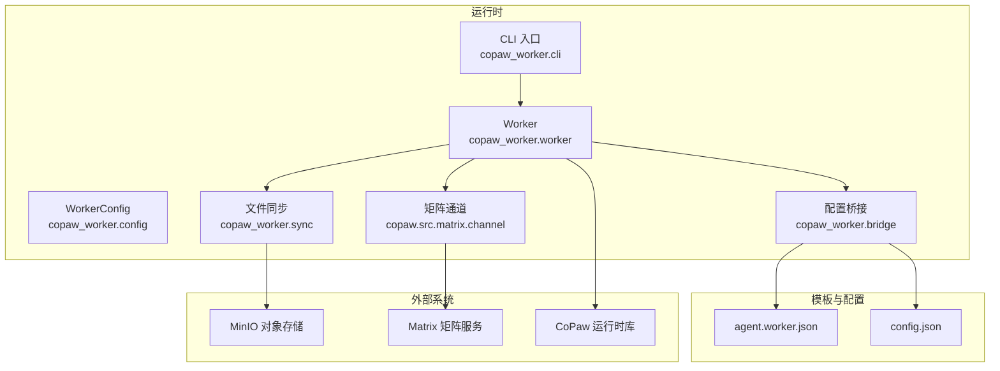
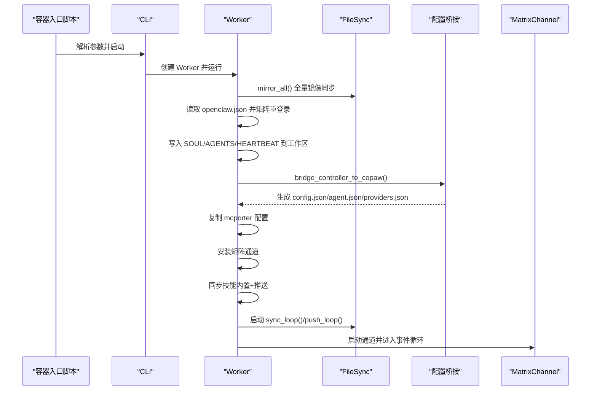
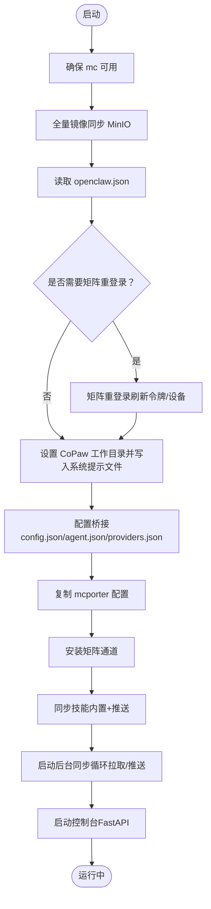
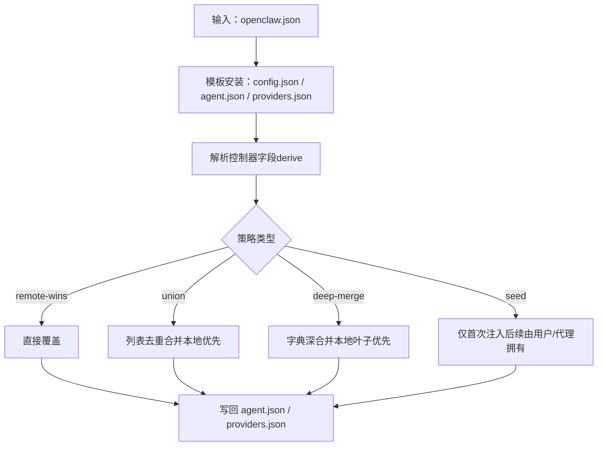
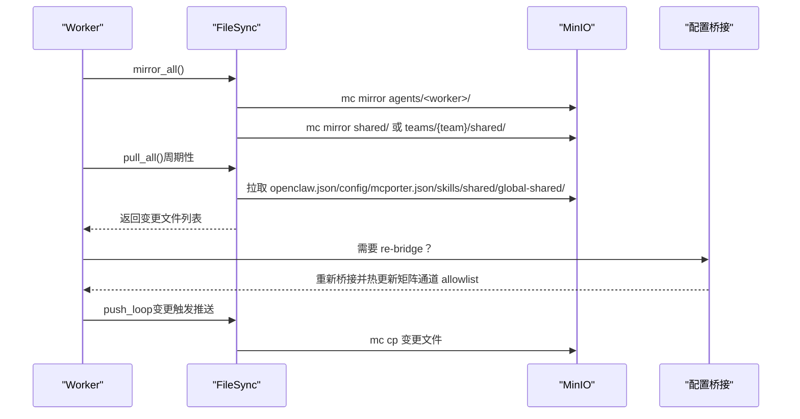
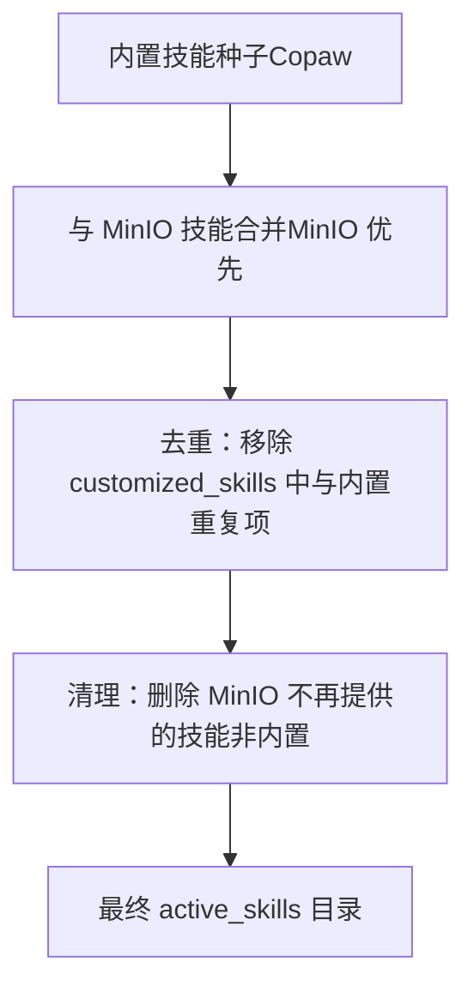
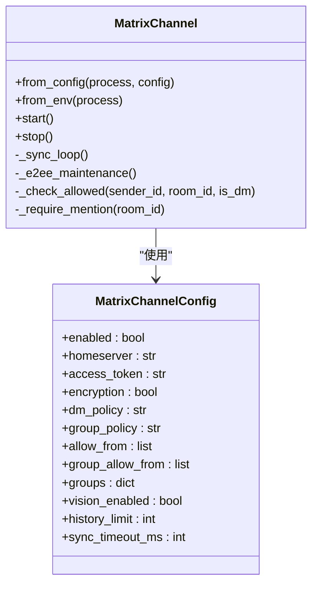
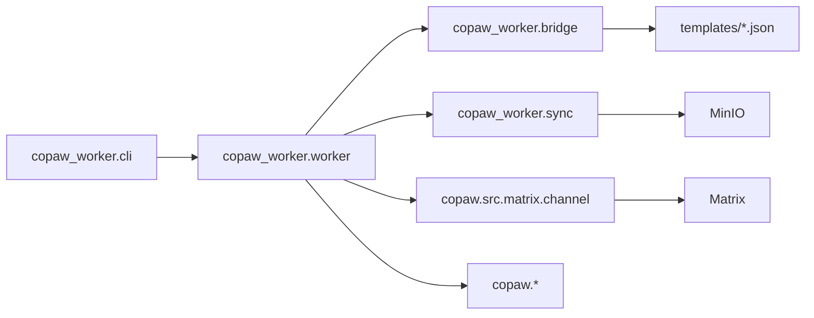

# CoPaw 运行时

<cite>
**本文引用的文件**
- [README.md](file://copaw/README.md)
- [pyproject.toml](file://copaw/pyproject.toml)
- [cli.py](file://copaw/src/copaw_worker/cli.py)
- [config.py](file://copaw/src/copaw_worker/config.py)
- [worker.py](file://copaw/src/copaw_worker/worker.py)
- [bridge.py](file://copaw/src/copaw_worker/bridge.py)
- [sync.py](file://copaw/src/copaw_worker/sync.py)
- [channel.py](file://copaw/src/matrix/channel.py)
- [config.py](file://copaw/src/matrix/config.py)
- [agent.worker.json](file://copaw/src/copaw_worker/templates/agent.worker.json)
- [config.json](file://copaw/src/copaw_worker/templates/config.json)
- [copaw-worker-entrypoint.sh](file://copaw/scripts/copaw-worker-entrypoint.sh)
- [worker-guide.md](file://docs/worker-guide.md)
- [architecture.md](file://docs/architecture.md)
- [test_bridge.py](file://copaw/tests/test_bridge.py)
</cite>

## 目录
1. [简介](#简介)
2. [项目结构](#项目结构)
3. [核心组件](#核心组件)
4. [架构总览](#架构总览)
5. [详细组件分析](#详细组件分析)
6. [依赖关系分析](#依赖关系分析)
7. [性能考虑](#性能考虑)
8. [故障排查指南](#故障排查指南)
9. [结论](#结论)
10. [附录](#附录)

## 简介
CoPaw 运行时是基于 CoPaw 的 Python 化 Worker 容器运行时，负责在容器中拉取并桥接来自控制器的配置、同步文件、安装矩阵通道、启动 AgentRunner 与 Web 控制台，并通过 MinIO 实现双向文件同步。其目标是在不改变容器可替换性的前提下，将控制器侧的 openclaw.json 配置转换为 CoPaw 的本地工作区配置（agent.json、providers.json 等），并保持用户侧的个性化修改不受覆盖。

## 项目结构
- 运行时入口与配置
  - CLI 入口：命令行参数解析与 Worker 生命周期管理
  - Worker：启动流程、配置桥接、文件同步、技能同步、通道安装、控制台启动
  - 配置对象：WorkerConfig 封装运行时参数
- 配置桥接
  - bridge：将 openclaw.json 映射为 config.json、agent.json、providers.json；支持模板创建与重启覆盖策略
  - 模板：默认安全策略与通道配置
- 文件同步
  - sync：基于 mc 的全量镜像同步与增量拉取；本地变更推送；字段级合并 openclaw.json
- 矩阵通道
  - channel：基于 matrix-nio 的 MatrixChannel 实现，含 E2EE、历史缓冲、提及检测、权限白名单等
  - config：通道配置模型与运行时参数
- 容器入口脚本
  - entrypoint：环境变量注入、云模式凭据刷新、就绪上报、虚拟环境执行

图表来源
- [cli.py:21-69](file://copaw/src/copaw_worker/cli.py#L21-L69)
- [config.py:7-29](file://copaw/src/copaw_worker/config.py#L7-L29)
- [worker.py:32-177](file://copaw/src/copaw_worker/worker.py#L32-L177)
- [bridge.py:155-200](file://copaw/src/copaw_worker/bridge.py#L155-L200)
- [sync.py:114-138](file://copaw/src/copaw_worker/sync.py#L114-L138)
- [channel.py:216-255](file://copaw/src/matrix/channel.py#L216-L255)

章节来源
- [README.md:1-18](file://copaw/README.md#L1-L18)
- [pyproject.toml:1-31](file://copaw/pyproject.toml#L1-L31)

## 核心组件
- CLI 入口：解析命令行参数，构造 WorkerConfig，启动 Worker 并处理信号关闭
- Worker：完整的启动序列，包括 mc 安装、全量镜像同步、配置桥接、通道安装、技能同步、后台同步循环
- 配置桥接：将 openclaw.json 映射为 CoPaw 的 config.json、agent.json、providers.json；模板创建与重启覆盖策略
- 文件同步：全量镜像同步（启动时）、增量拉取（周期性）、本地推送（变更触发）
- 矩阵通道：基于 matrix-nio 的通道实现，支持 E2EE、历史缓冲、权限白名单、提及检测
- 模板与默认配置：安全策略默认关闭、通道默认开启、矩阵允许列表等

章节来源
- [cli.py:21-69](file://copaw/src/copaw_worker/cli.py#L21-L69)
- [worker.py:32-177](file://copaw/src/copaw_worker/worker.py#L32-L177)
- [bridge.py:155-200](file://copaw/src/copaw_worker/bridge.py#L155-L200)
- [sync.py:114-138](file://copaw/src/copaw_worker/sync.py#L114-L138)
- [channel.py:216-255](file://copaw/src/matrix/channel.py#L216-L255)
- [agent.worker.json:1-25](file://copaw/src/copaw_worker/templates/agent.worker.json#L1-L25)
- [config.json:1-21](file://copaw/src/copaw_worker/templates/config.json#L1-L21)

## 架构总览
CoPaw Worker 在容器内完成以下关键步骤：
1) 初始化 mc 客户端（本地或云模式）
2) 全量镜像同步 MinIO 上的 Worker 工作区内容
3) 读取 openclaw.json，进行矩阵重新登录以刷新设备与令牌
4) 设置 CoPaw 工作目录，写入 SOUL/AGENTS/HEARTBEAT 到工作区
5) 执行配置桥接，生成 config.json、agent.json、providers.json
6) 复制 mcporter 配置到工作目录
7) 安装并启用矩阵通道
8) 同步技能（内置 + 管理端推送）
9) 启动后台同步循环（拉取与推送）
10) 启动 CoPaw 控制台（FastAPI）

图表来源
- [copaw-worker-entrypoint.sh:1-144](file://copaw/scripts/copaw-worker-entrypoint.sh#L1-L144)
- [cli.py:21-69](file://copaw/src/copaw_worker/cli.py#L21-L69)
- [worker.py:65-177](file://copaw/src/copaw_worker/worker.py#L65-L177)
- [sync.py:225-263](file://copaw/src/copaw_worker/sync.py#L225-L263)
- [bridge.py:155-200](file://copaw/src/copaw_worker/bridge.py#L155-L200)
- [channel.py:335-476](file://copaw/src/matrix/channel.py#L335-L476)

## 详细组件分析

### Worker 启动流程
- 责任边界
  - CLI：参数解析、信号处理、异步运行
  - Worker：生命周期编排、错误处理、状态打印
  - FileSync：与 MinIO 的交互、全量/增量同步、推送
  - Bridge：openclaw.json → CoPaw 配置映射
  - MatrixChannel：矩阵连接、事件回调、E2EE 维护
- 关键步骤
  - 确保 mc 可用（自动下载或使用已安装版本）
  - 全量镜像同步恢复所有状态（配置、会话、同步令牌等）
  - 读取 openclaw.json，必要时进行矩阵重登录（E2EE 设备刷新）
  - 设置 CoPaw 工作目录，写入系统提示文件
  - 执行配置桥接，复制 mcporter 配置
  - 安装矩阵通道，同步技能（去重内置与推送）
  - 启动后台同步循环（拉取/推送）
  - 启动控制台（FastAPI）

图表来源
- [worker.py:65-205](file://copaw/src/copaw_worker/worker.py#L65-L205)
- [sync.py:225-263](file://copaw/src/copaw_worker/sync.py#L225-L263)
- [bridge.py:155-200](file://copaw/src/copaw_worker/bridge.py#L155-L200)
- [channel.py:335-476](file://copaw/src/matrix/channel.py#L335-L476)

章节来源
- [worker.py:65-205](file://copaw/src/copaw_worker/worker.py#L65-L205)
- [sync.py:225-263](file://copaw/src/copaw_worker/sync.py#L225-L263)
- [bridge.py:155-200](file://copaw/src/copaw_worker/bridge.py#L155-L200)
- [channel.py:335-476](file://copaw/src/matrix/channel.py#L335-L476)

### 配置桥接机制（openclaw.json → agent.json / providers.json）
- 模板创建阶段
  - 若缺失则从模板安装 config.json（全局安全策略默认关闭）
  - 依据 profile 选择 agent.worker.json 或 agent.manager.json 模板安装 agent.json
  - 生成 providers.json（基于 models.providers，提取 baseUrl/apiKey/models）
- 重启覆盖阶段（仅受控制器拥有的字段）
  - channels.matrix.*：remote-wins（如 enabled、homeserver、access_token、user_id、encryption、dm/group 策略、vision_enabled、history_limit）
  - channels.matrix.allow_from / group_allow_from：union（去重，本地优先）
  - channels.matrix.groups：deep-merge（本地叶子优先）
  - running.max_input_length / embedding_config：remote-wins（由 derive 函数计算）
  - heartbeat：seed（首次由控制器注入，之后由用户/代理拥有）
- 用户侧保留
  - 用户编辑的 agent.json 非控制器字段（如语言、console 开关、env、自定义字段）在重启后保留
  - config.json 一旦存在不再被桥接覆盖

图表来源
- [bridge.py:469-512](file://copaw/src/copaw_worker/bridge.py#L469-L512)
- [bridge.py:535-581](file://copaw/src/copaw_worker/bridge.py#L535-L581)
- [bridge.py:587-648](file://copaw/src/copaw_worker/bridge.py#L587-L648)
- [agent.worker.json:1-25](file://copaw/src/copaw_worker/templates/agent.worker.json#L1-L25)
- [config.json:1-21](file://copaw/src/copaw_worker/templates/config.json#L1-L21)

章节来源
- [bridge.py:469-512](file://copaw/src/copaw_worker/bridge.py#L469-L512)
- [bridge.py:535-581](file://copaw/src/copaw_worker/bridge.py#L535-L581)
- [bridge.py:587-648](file://copaw/src/copaw_worker/bridge.py#L587-L648)
- [test_bridge.py:1-405](file://copaw/tests/test_bridge.py#L1-L405)

### 文件同步系统（全量镜像 + 增量拉取 + 本地推送）
- 设计原则
  - 谁写谁推：Worker 写入的文件立即推送到 MinIO；通过 @mention 通知另一方拉取
  - 分类职责：Manager-managed（只读拉取）与 Worker-managed（可写推送）
- 全量镜像同步（启动时）
  - 拉取 agents/<worker>/ 下的所有内容（除 credentials/**）
  - 拉取 shared/（团队成员使用 teams/{team}/shared/，非团队使用全局 shared/）
  - 团队负责人额外拉取全局 shared/ 为 global-shared/
- 增量拉取（周期性）
  - 允许列表：openclaw.json、config/mcporter.json、skills/*、shared/、global-shared/
  - openclaw.json 字段级合并：remote 覆盖 base，本地保留 plugins.entries、channels.matrix.accessToken、channels 等
- 本地推送（变更触发）
  - 排除：openclaw.json、mcporter-servers.json、config/mcporter.json、derived 文件（.copaw 下的 config.json、providers.json、AGENTS.md、SOUL.md、mcporter.json）
  - 内外层同步：.copaw/workspaces/default 下的 AGENTS.md/SOUL.md/HEARTBEAT.md 与根目录同名文件互拷
  - 推送策略：mtime > since 且内容不同才上传
- 后台任务
  - push_loop：每 5 秒扫描一次，触发推送
  - sync_loop：按间隔拉取，触发 re-bridge 与技能/配置更新

图表来源
- [sync.py:225-263](file://copaw/src/copaw_worker/sync.py#L225-L263)
- [sync.py:346-463](file://copaw/src/copaw_worker/sync.py#L346-L463)
- [sync.py:487-604](file://copaw/src/copaw_worker/sync.py#L487-L604)
- [worker.py:494-545](file://copaw/src/copaw_worker/worker.py#L494-L545)

章节来源
- [sync.py:225-263](file://copaw/src/copaw_worker/sync.py#L225-L263)
- [sync.py:346-463](file://copaw/src/copaw_worker/sync.py#L346-L463)
- [sync.py:487-604](file://copaw/src/copaw_worker/sync.py#L487-L604)
- [worker.py:494-545](file://copaw/src/copaw_worker/worker.py#L494-L545)

### 技能管理系统（内置技能种子 + 自定义技能叠加）
- 内置技能种子
  - 启动时调用 Copaw 的 sync_skills_to_working_dir，将内置技能安装到 active_skills
- 自定义技能叠加
  - 从 MinIO 拉取 skills/<name>/（含 SKILL.md、scripts/、references/）
  - 覆盖内置同名技能，保留内置与 MinIO 技能集合
- 去重与清理
  - 清理 customized_skills 中与内置重复的目录，避免 UI 重复显示
  - 删除 MinIO 不再提供的技能（非内置）

图表来源
- [worker.py:342-416](file://copaw/src/copaw_worker/worker.py#L342-L416)

章节来源
- [worker.py:342-416](file://copaw/src/copaw_worker/worker.py#L342-L416)

### 矩阵通信集成（MatrixChannel）
- 登录与认证
  - 支持 access_token 与用户名/密码两种方式
  - E2EE：启用时加载加密存储、上传/查询/声明密钥、发送 to-device 消息
- 事件处理
  - 文本消息、媒体消息（图片/文件/音频/视频）事件回调
  - 加密媒体事件与 Megolm 事件处理
- 同步与令牌持久化
  - 从 MinIO 拉取的 matrix_sync_token 持久化到 COPAW_WORKING_DIR
  - catch-up sync 抑制回调，增量同步正常处理
- 权限与策略
  - DM/群组白名单策略（allowlist/disable）
  - per-room requireMention/autoReply 配置
  - 历史缓冲与最大条数限制

图表来源
- [channel.py:160-206](file://copaw/src/matrix/channel.py#L160-L206)
- [channel.py:216-255](file://copaw/src/matrix/channel.py#L216-L255)

章节来源
- [channel.py:160-206](file://copaw/src/matrix/channel.py#L160-L206)
- [channel.py:216-255](file://copaw/src/matrix/channel.py#L216-L255)
- [channel.py:335-476](file://copaw/src/matrix/channel.py#L335-L476)
- [channel.py:486-670](file://copaw/src/matrix/channel.py#L486-L670)

## 依赖关系分析
- 运行时依赖
  - copaw：运行时核心、通道注册、技能管理
  - matrix-nio：Matrix 事件客户端与 E2EE
  - markdown-it-py / linkify-it-py：消息格式化
- CLI 与 Worker
  - CLI 负责参数与生命周期，Worker 负责具体启动步骤
- 模板与配置
  - 模板提供安全默认值与通道骨架，桥接决定控制器可控字段的覆盖策略
- 外部系统
  - MinIO：配置与技能的集中存储
  - Matrix：人机协作与任务流转

图表来源
- [pyproject.toml:12-17](file://copaw/pyproject.toml#L12-L17)
- [cli.py:12-13](file://copaw/src/copaw_worker/cli.py#L12-L13)
- [worker.py:24-26](file://copaw/src/copaw_worker/worker.py#L24-L26)
- [bridge.py:130-134](file://copaw/src/copaw_worker/bridge.py#L130-L134)
- [sync.py:100-111](file://copaw/src/copaw_worker/sync.py#L100-L111)
- [channel.py:23-41](file://copaw/src/matrix/channel.py#L23-L41)

章节来源
- [pyproject.toml:12-17](file://copaw/pyproject.toml#L12-L17)
- [cli.py:12-13](file://copaw/src/copaw_worker/cli.py#L12-L13)
- [worker.py:24-26](file://copaw/src/copaw_worker/worker.py#L24-L26)
- [bridge.py:130-134](file://copaw/src/copaw_worker/bridge.py#L130-L134)
- [sync.py:100-111](file://copaw/src/copaw_worker/sync.py#L100-L111)
- [channel.py:23-41](file://copaw/src/matrix/channel.py#L23-L41)

## 性能考虑
- 同步频率与窗口
  - 增量拉取间隔默认 300 秒；可通过配置调整
  - 本地推送检查间隔 5 秒，避免频繁 IO
- 端口映射与网关
  - 容器内 :8080 通过环境变量映射到宿主端口（如 18080），避免冲突
- LLM 速率限制与并发
  - 运行时配置提供 LLM 最大并发、QPM、退避策略等参数，建议结合实际网关能力调优
- E2EE 维护
  - 同步间隙进行密钥维护，减少解密失败与重试开销

## 故障排查指南
- Worker 启动失败
  - 检查容器日志；确认 openclaw.json 是否存在；确认 mc 是否可用
- 无法连接 Matrix
  - 使用容器内 curl 测试 homeserver 可达性；核对 openclaw.json 中的 Matrix 配置
- 无法访问 LLM
  - 使用 Worker 容器内 curl 测试 AI Gateway 模型列表；核对 Bearer Key 与路由授权
- 无法访问 MCP（GitHub）
  - 使用 mcporter 测试服务器连通性与授权
- 重置 Worker
  - 停止并删除容器；向 Manager 请求重建；数据保存在 MinIO，不会丢失

章节来源
- [worker-guide.md:61-123](file://docs/worker-guide.md#L61-L123)

## 结论
CoPaw 运行时通过“模板创建 + 控制器覆盖”的桥接模型，将控制器侧的 openclaw.json 精准映射为 CoPaw 的本地工作区配置；借助 mc 的全量镜像与增量拉取，实现了 Worker 与 Manager 之间的高效双向同步；矩阵通道提供安全可控的人机协作界面；整体设计兼顾了可替换性、安全性与可维护性。

## 附录

### 运行时配置选项与最佳实践
- CLI 参数
  - --name：Worker 名称
  - --fs / --fs-key / --fs-secret / --fs-bucket：MinIO 端点与凭证
  - --sync-interval：增量拉取间隔（秒）
  - --install-dir：安装目录
  - --console-port：控制台端口
- 环境变量（容器入口）
  - HICLAW_WORKER_NAME、HICLAW_FS_ENDPOINT、HICLAW_FS_ACCESS_KEY、HICLAW_FS_SECRET_KEY、HICLAW_RUNTIME、HICLAW_CONSOLE_PORT、TZ、COPAW_LOG_LEVEL
- 最佳实践
  - 保持 openclaw.json 的最小化控制器字段，用户侧个性化配置放在 agent.json
  - 合理设置 sync-interval，平衡实时性与网络负载
  - 使用矩阵 allowlist 严格控制 DM/群组来源
  - 定期清理不再使用的技能，避免 active_skills 目录膨胀

章节来源
- [cli.py:24-44](file://copaw/src/copaw_worker/cli.py#L24-L44)
- [copaw-worker-entrypoint.sh:18-51](file://copaw/scripts/copaw-worker-entrypoint.sh#L18-L51)
- [worker-guide.md:160-175](file://docs/worker-guide.md#L160-L175)