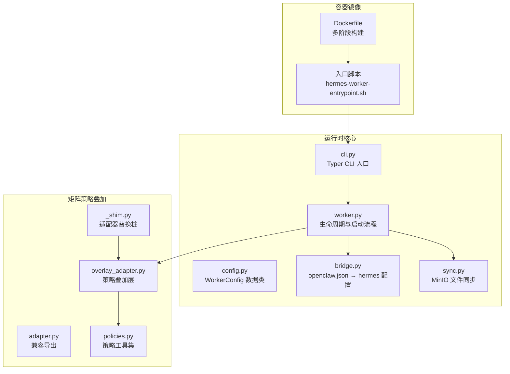
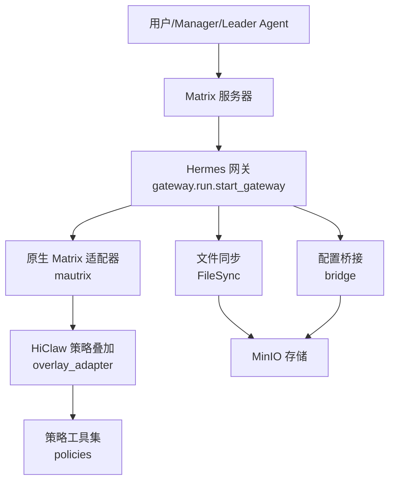
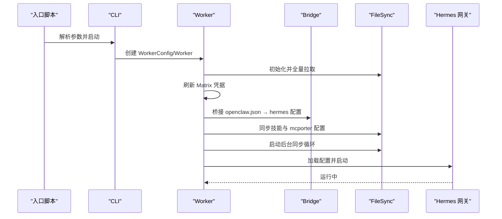
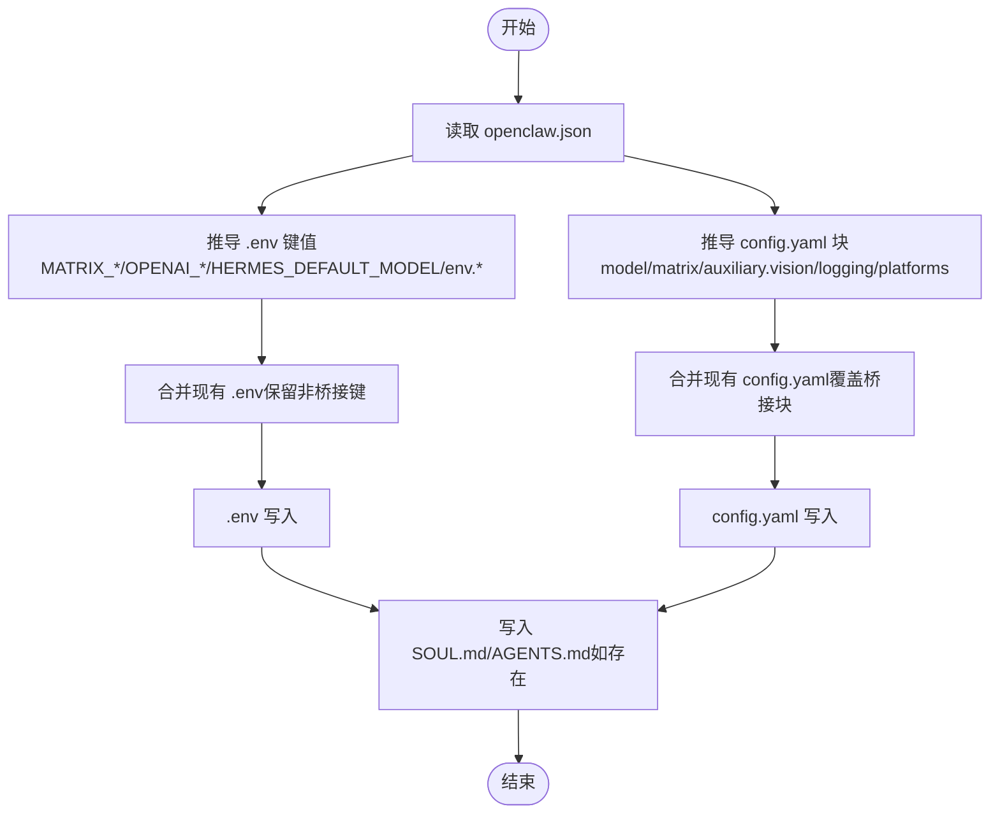
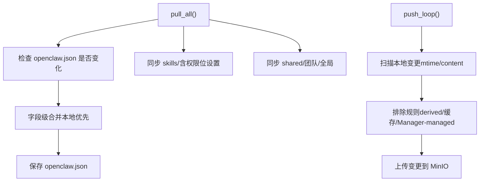
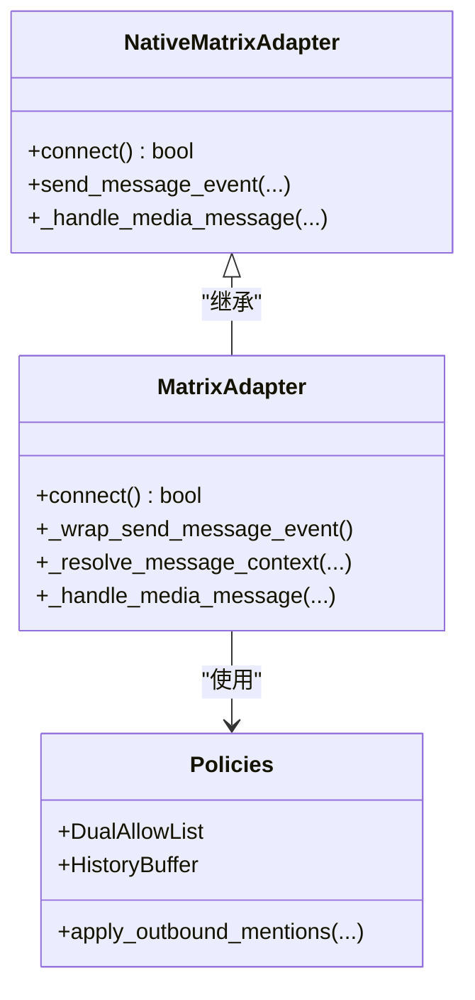
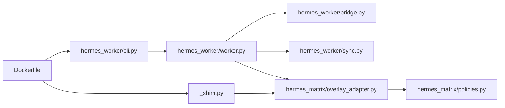

# Hermes 运行时

<cite>
**本文引用的文件**
- [hermes/README.md](file://hermes/README.md)
- [hermes/pyproject.toml](file://hermes/pyproject.toml)
- [hermes/src/hermes_worker/__init__.py](file://hermes/src/hermes_worker/__init__.py)
- [hermes/src/hermes_worker/worker.py](file://hermes/src/hermes_worker/worker.py)
- [hermes/src/hermes_worker/config.py](file://hermes/src/hermes_worker/config.py)
- [hermes/src/hermes_worker/cli.py](file://hermes/src/hermes_worker/cli.py)
- [hermes/src/hermes_worker/bridge.py](file://hermes/src/hermes_worker/bridge.py)
- [hermes/src/hermes_worker/sync.py](file://hermes/src/hermes_worker/sync.py)
- [hermes/src/hermes_matrix/adapter.py](file://hermes/src/hermes_matrix/adapter.py)
- [hermes/src/hermes_matrix/overlay_adapter.py](file://hermes/src/hermes_matrix/overlay_adapter.py)
- [hermes/src/hermes_matrix/policies.py](file://hermes/src/hermes_matrix/policies.py)
- [hermes/src/hermes_matrix/_shim.py](file://hermes/src/hermes_matrix/_shim.py)
- [hermes/Dockerfile](file://hermes/Dockerfile)
- [hermes/scripts/hermes-worker-entrypoint.sh](file://hermes/scripts/hermes-worker-entrypoint.sh)
- [blog/hiclaw-1.1.0-release.md](file://blog/hiclaw-1.1.0-release.md)
- [README.md](file://README.md)
- [README.zh-CN.md](file://README.zh-CN.md)
- [tests/lib/agent-metrics.sh](file://tests/lib/agent-metrics.sh)
</cite>

## 目录
1. [简介](#简介)
2. [项目结构](#项目结构)
3. [核心组件](#核心组件)
4. [架构总览](#架构总览)
5. [详细组件分析](#详细组件分析)
6. [依赖关系分析](#依赖关系分析)
7. [性能考量](#性能考量)
8. [故障排查指南](#故障排查指南)
9. [结论](#结论)
10. [附录](#附录)

## 简介
本文件面向 Hermes 运行时的技术文档，系统阐述其作为“自主编码代理运行时”的独特架构与能力。Hermes 基于 hermes-agent（v0.10.0），在 HiClaw 平台中以“Worker”角色提供：
- 自主决策与代码生成能力
- 与 Matrix 协议深度集成的消息处理策略
- 基于 MinIO 的分布式配置与状态同步
- 可热更新的技能体系与可观测性支持

Hermes 运行时强调“自生长”与“可协作”：完成任务后自动沉淀为可复用技能；通过持久化记忆与跨会话检索提升对项目的理解；在多运行时协同场景中，与 Manager/Leader Agent 配合，实现“确定性编排 + 自主执行”的最佳实践。

## 项目结构
Hermes 运行时位于仓库的 hermes 目录，主要由以下模块构成：
- hermes_worker：运行时引导、配置桥接、文件同步与生命周期管理
- hermes_matrix：基于 hermes-agent 原生 Matrix 适配器的策略叠加层（mentions 增强、双允许列表、历史上下文缓冲、视觉能力降级）
- 容器镜像与入口脚本：多阶段构建、虚拟环境隔离、入口脚本注入运行时参数与环境变量

**图表来源**
- [hermes/Dockerfile:1-175](file://hermes/Dockerfile#L1-L175)
- [hermes/scripts/hermes-worker-entrypoint.sh:1-157](file://hermes/scripts/hermes-worker-entrypoint.sh#L1-L157)
- [hermes/src/hermes_worker/cli.py:1-72](file://hermes/src/hermes_worker/cli.py#L1-L72)
- [hermes/src/hermes_worker/worker.py:1-463](file://hermes/src/hermes_worker/worker.py#L1-L463)
- [hermes/src/hermes_worker/bridge.py:1-538](file://hermes/src/hermes_worker/bridge.py#L1-L538)
- [hermes/src/hermes_worker/sync.py:1-622](file://hermes/src/hermes_worker/sync.py#L1-L622)
- [hermes/src/hermes_matrix/overlay_adapter.py:1-240](file://hermes/src/hermes_matrix/overlay_adapter.py#L1-L240)
- [hermes/src/hermes_matrix/policies.py:1-223](file://hermes/src/hermes_matrix/policies.py#L1-L223)
- [hermes/src/hermes_matrix/_shim.py:1-23](file://hermes/src/hermes_matrix/_shim.py#L1-L23)

**章节来源**
- [hermes/README.md:1-82](file://hermes/README.md#L1-L82)
- [hermes/Dockerfile:1-175](file://hermes/Dockerfile#L1-L175)
- [hermes/scripts/hermes-worker-entrypoint.sh:1-157](file://hermes/scripts/hermes-worker-entrypoint.sh#L1-L157)

## 核心组件
- Worker 生命周期与启动流程
  - 初始化 mc（MinIO 客户端）、拉取 MinIO 工作区、重新登录 Matrix（保持 E2EE 设备一致性）、桥接 openclaw.json 到 hermes 配置、同步技能目录、启动后台同步循环、启动网关并进入运行态。
- 配置桥接（bridge）
  - 将 openclaw.json 中的模型、通道、环境变量等映射到 hermes 的 .env 与 config.yaml，并保留用户自定义配置块。
- 文件同步（FileSync）
  - 使用 mc CLI 实现双向同步：Worker 写入的内容推送回 MinIO；Manager 推送的配置与技能按需拉取；支持字段级合并 openclaw.json。
- 矩阵策略叠加（overlay_adapter）
  - 在 hermes-agent 原生 mautrix 适配器之上，注入 mentions 增强、DM/群组双允许列表、未提及消息的历史上下文缓冲、以及当模型不支持视觉时的媒体降级策略。
- CLI 与配置
  - 提供 hermes-worker 命令行入口，解析运行参数并驱动 Worker 启动；WorkerConfig 统一管理 MinIO 连接、工作区路径与同步间隔等。

**章节来源**
- [hermes/src/hermes_worker/worker.py:1-463](file://hermes/src/hermes_worker/worker.py#L1-L463)
- [hermes/src/hermes_worker/bridge.py:1-538](file://hermes/src/hermes_worker/bridge.py#L1-L538)
- [hermes/src/hermes_worker/sync.py:1-622](file://hermes/src/hermes_worker/sync.py#L1-L622)
- [hermes/src/hermes_matrix/overlay_adapter.py:1-240](file://hermes/src/hermes_matrix/overlay_adapter.py#L1-L240)
- [hermes/src/hermes_worker/cli.py:1-72](file://hermes/src/hermes_worker/cli.py#L1-L72)
- [hermes/src/hermes_worker/config.py:1-40](file://hermes/src/hermes_worker/config.py#L1-L40)

## 架构总览
Hermes 运行时采用“容器 + 网关 + 策略叠加”的分层设计：
- 容器层：多阶段构建，安装 hermes-agent 与运行时依赖，挂载入口脚本与环境注入。
- 网关层：加载 hermes 配置，启动 Matrix 适配器，承载消息路由与平台交互。
- 策略层：在原生 Matrix 适配器上叠加 HiClaw 策略，确保一致的权限、提及与上下文行为。
- 同步层：通过 MinIO 与 mc CLI 实现配置、技能与会话数据的双向同步。

**图表来源**
- [hermes/src/hermes_worker/worker.py:170-192](file://hermes/src/hermes_worker/worker.py#L170-L192)
- [hermes/src/hermes_matrix/overlay_adapter.py:1-240](file://hermes/src/hermes_matrix/overlay_adapter.py#L1-L240)
- [hermes/src/hermes_worker/bridge.py:400-538](file://hermes/src/hermes_worker/bridge.py#L400-L538)
- [hermes/src/hermes_worker/sync.py:114-622](file://hermes/src/hermes_worker/sync.py#L114-L622)

## 详细组件分析

### Worker 生命周期与启动流程
- 启动步骤
  - 确保 mc 可用（自动下载）
  - 全量拉取 MinIO 工作区（含 shared/global-shared）
  - 读取 openclaw.json，刷新 Matrix 凭据（新设备 ID 保持 E2EE 透明）
  - 桥接 openclaw.json → hermes 配置（.env 与 config.yaml）
  - 同步技能目录与 mcporter 配置
  - 启动后台同步循环（拉取 Manager 更新、推送 Worker 变更）
  - 加载网关配置并启动 hermes 网关
- 关闭与信号处理
  - 支持 SIGINT/SIGTERM，取消网关任务并优雅退出

**图表来源**
- [hermes/scripts/hermes-worker-entrypoint.sh:145-157](file://hermes/scripts/hermes-worker-entrypoint.sh#L145-L157)
- [hermes/src/hermes_worker/cli.py:21-72](file://hermes/src/hermes_worker/cli.py#L21-L72)
- [hermes/src/hermes_worker/worker.py:59-192](file://hermes/src/hermes_worker/worker.py#L59-L192)
- [hermes/src/hermes_worker/bridge.py:400-538](file://hermes/src/hermes_worker/bridge.py#L400-L538)
- [hermes/src/hermes_worker/sync.py:460-622](file://hermes/src/hermes_worker/sync.py#L460-L622)

**章节来源**
- [hermes/src/hermes_worker/worker.py:59-192](file://hermes/src/hermes_worker/worker.py#L59-L192)
- [hermes/src/hermes_worker/sync.py:222-265](file://hermes/src/hermes_worker/sync.py#L222-L265)

### 配置桥接（openclaw.json → hermes）
- 目标
  - 将 openclaw.json 中的模型、通道、环境变量等映射到 hermes 的 .env 与 config.yaml，并保留用户自定义配置块。
- 关键点
  - 仅桥接受控键（如 MATRIX_*、OPENAI_*、HERMES_DEFAULT_MODEL），其余用户键保留
  - 生成 .env 与 config.yaml，设置 platforms.matrix.enabled=true 等默认值
  - 当启用 HICLAW_MATRIX_DEBUG=1 时，提升日志级别至 DEBUG
- 映射关系
  - agentName → config.yaml: name 与 .env: AGENT_NAME
  - model/provider/apiKey/baseURL → .env: OPENAI_* 与 config.yaml: model
  - embedding → .env: EMBEDDING_*
  - matrix.* → .env: MATRIX_* 与 config.yaml: matrix 与 platforms.matrix
  - system_prompt/SOUL.md 与 skills/* → hermes_home 下对应文件

**图表来源**
- [hermes/src/hermes_worker/bridge.py:400-538](file://hermes/src/hermes_worker/bridge.py#L400-L538)

**章节来源**
- [hermes/src/hermes_worker/bridge.py:1-538](file://hermes/src/hermes_worker/bridge.py#L1-L538)

### 文件同步（MinIO + mc）
- 设计原则
  - 写入方负责推送；Manager 推送的配置与技能按需拉取；本地变更周期性或事件触发推送
- 同步范围
  - Manager-managed：openclaw.json、mcporter.json、skills/、shared/
  - Worker-managed：AGENTS.md、SOUL.md、.hermes/sessions/、memory/ 等
- 字段级合并 openclaw.json
  - 本地优先，远程仅覆盖 models、gateway、channels（含 deep merge）与 plugins.entries/load.paths
- 排除策略
  - 排除 derived 文件（.hermes/config.yaml/.env）、缓存与临时文件、Manager-managed shared 目录等

**图表来源**
- [hermes/src/hermes_worker/sync.py:346-457](file://hermes/src/hermes_worker/sync.py#L346-L457)
- [hermes/src/hermes_worker/sync.py:481-621](file://hermes/src/hermes_worker/sync.py#L481-L621)

**章节来源**
- [hermes/src/hermes_worker/sync.py:1-622](file://hermes/src/hermes_worker/sync.py#L1-L622)

### 矩阵策略叠加（mentions/allowlist/history/vision）
- 策略要点
  - 出站 mentions 增强：从 body 文本提取 MXID 并注入 m.mentions.user_ids
  - 双允许列表：DM 与群组分别控制 allowlist/open/disabled
  - 历史上下文缓冲：未提及消息在会话中累积，回复时注入上下文前缀
  - 视觉降级：当 active model 不支持图像输入时，将图片转为文本描述
- 实现方式
  - 通过适配器替换桩（_shim.py）将原生 mautrix 适配器替换为 overlay_adapter
  - 在 connect 阶段包装 send_message_event 注入 mentions
  - 在消息解析阶段应用允许列表与历史缓冲策略

**图表来源**
- [hermes/src/hermes_matrix/overlay_adapter.py:94-240](file://hermes/src/hermes_matrix/overlay_adapter.py#L94-L240)
- [hermes/src/hermes_matrix/policies.py:126-223](file://hermes/src/hermes_matrix/policies.py#L126-L223)
- [hermes/src/hermes_matrix/_shim.py:1-23](file://hermes/src/hermes_matrix/_shim.py#L1-L23)

**章节来源**
- [hermes/src/hermes_matrix/overlay_adapter.py:1-240](file://hermes/src/hermes_matrix/overlay_adapter.py#L1-L240)
- [hermes/src/hermes_matrix/policies.py:1-223](file://hermes/src/hermes_matrix/policies.py#L1-L223)
- [hermes/src/hermes_matrix/_shim.py:1-23](file://hermes/src/hermes_matrix/_shim.py#L1-L23)

### CLI 与配置（WorkerConfig）
- CLI
  - hermes-worker 命令行入口，支持 --name/--fs/--fs-key/--fs-secret/--fs-bucket/--sync-interval/--install-dir
  - 注册信号处理器，支持优雅关闭
- WorkerConfig
  - 统一管理 worker 名称、MinIO 连接信息、工作区与 hermes_home 路径、同步间隔等

**章节来源**
- [hermes/src/hermes_worker/cli.py:1-72](file://hermes/src/hermes_worker/cli.py#L1-L72)
- [hermes/src/hermes_worker/config.py:1-40](file://hermes/src/hermes_worker/config.py#L1-L40)

## 依赖关系分析
- 外部依赖
  - hermes-agent（通过 Git 引入，版本标签 v2026.4.16）
  - matrix-nio（用于策略叠加层的 mentions 与媒体处理）
  - mautrix（原生 Matrix 适配器，被 overlay_adapter 包装）
  - mc（MinIO 客户端，通过 mc-wrapper.sh 管理 STS 凭证）
- 内部依赖
  - hermes_worker 依赖 bridge 与 sync
  - hermes_matrix.overlay_adapter 依赖 policies
  - 容器镜像通过 _shim.py 替换 hermes-agent 的原生矩阵适配器

**图表来源**
- [hermes/src/hermes_worker/cli.py:1-72](file://hermes/src/hermes_worker/cli.py#L1-L72)
- [hermes/src/hermes_worker/worker.py:1-463](file://hermes/src/hermes_worker/worker.py#L1-L463)
- [hermes/src/hermes_worker/bridge.py:1-538](file://hermes/src/hermes_worker/bridge.py#L1-L538)
- [hermes/src/hermes_worker/sync.py:1-622](file://hermes/src/hermes_worker/sync.py#L1-L622)
- [hermes/src/hermes_matrix/overlay_adapter.py:1-240](file://hermes/src/hermes_matrix/overlay_adapter.py#L1-L240)
- [hermes/src/hermes_matrix/policies.py:1-223](file://hermes/src/hermes_matrix/policies.py#L1-L223)
- [hermes/src/hermes_matrix/_shim.py:1-23](file://hermes/src/hermes_matrix/_shim.py#L1-L23)
- [hermes/Dockerfile:1-175](file://hermes/Dockerfile#L1-L175)

**章节来源**
- [hermes/pyproject.toml:1-37](file://hermes/pyproject.toml#L1-L37)
- [hermes/Dockerfile:1-175](file://hermes/Dockerfile#L1-L175)

## 性能考量
- 内存与进程
  - 使用 jemalloc 降低内存碎片，建议在容器部署时保留 LD_PRELOAD 设置
  - 网关与策略叠加均为异步事件驱动，避免阻塞主线程
- I/O 与网络
  - 文件同步采用 mc CLI，建议在高延迟网络下适当增大 sync_interval
  - MinIO 端点与安全连接（secure）应与实际环境匹配，避免不必要的 TLS 开销
- 日志与可观测性
  - HICLAW_MATRIX_DEBUG=1 时桥接会将日志级别提升至 DEBUG，便于定位 Matrix 侧问题
  - 若启用 CMS（OTel），建议合理设置采样与字段捕获，避免过高的开销

[本节为通用指导，无需特定文件引用]

## 故障排查指南
- 启动失败
  - 检查 mc 是否可用（容器内 PATH 或自动下载），确认 MinIO 端点与凭据正确
  - 查看入口脚本输出与容器日志，确认是否成功生成 .env 与 config.yaml
- Matrix 登录与 E2EE
  - 若重启后 E2EE 失效，确认已执行 Matrix 重登录流程并写回 openclaw.json
  - 检查 MATRIX_ACCESS_TOKEN/MATRIX_DEVICE_ID 是否存在且有效
- 配置未生效
  - openclaw.json 变更后需触发 re-bridge 流程；若某些设置不支持热重载，需重启网关
  - 检查 HICLAW_MATRIX_DEBUG 是否导致日志级别提升
- 技能缺失或过期
  - 确认 MinIO 上 skills/ 是否存在；本地会清理不再发布的技能目录
- 同步异常
  - 检查 mc-wrapper.sh 是否正确刷新 STS 凭证（云模式）
  - 排查排除规则是否误删了本地重要文件

**章节来源**
- [hermes/src/hermes_worker/worker.py:197-277](file://hermes/src/hermes_worker/worker.py#L197-L277)
- [hermes/src/hermes_worker/bridge.py:383-394](file://hermes/src/hermes_worker/bridge.py#L383-L394)
- [hermes/src/hermes_worker/sync.py:446-457](file://hermes/src/hermes_worker/sync.py#L446-L457)
- [hermes/scripts/hermes-worker-entrypoint.sh:158-161](file://hermes/scripts/hermes-worker-entrypoint.sh#L158-L161)

## 结论
Hermes 运行时通过“容器化 + 网关 + 策略叠加 + 分布式同步”的组合，实现了在多运行时协作场景下的统一通信与一致行为。其核心优势在于：
- 自主编码与自生长技能：以任务为中心的规划、执行与沉淀
- 与 Matrix 的深度集成：mentions、允许列表、历史上下文与媒体降级策略
- 可靠的配置与状态管理：openclaw.json → hermes 配置桥接与 mc 驱动的双向同步
- 可观测性与调试：日志级别桥接、OTel 导出与会话度量采集

在多运行时协同中，Hermes 适合承担“创造性与自主性”的任务，而 Manager/Leader Agent 负责“确定性与可预测性”的编排，二者通过 Matrix 的 m.mentions 完全可见、随时可干预。

[本节为总结，无需特定文件引用]

## 附录

### 配置文件与环境变量
- openclaw.json 映射到 hermes 的 .env 与 config.yaml（部分映射关系见“配置桥接”章节）
- 运行时关键环境变量
  - HICLAW_WORKER_NAME：Worker 名称
  - HICLAW_FS_ENDPOINT/HICLAW_FS_ACCESS_KEY/HICLAW_FS_SECRET_KEY：MinIO 连接信息（本地模式）
  - HICLAW_RUNTIME=aliyun：云模式（RRSA/STS）
  - HICLAW_MATRIX_DEBUG=1：开启 Matrix 调试日志（桥接后写入 config.yaml logging.level）
  - HICLAW_CMS_TRACES_ENABLED/OTEL_*：CMS/OTel 配置（可选）

**章节来源**
- [hermes/src/hermes_worker/bridge.py:1-538](file://hermes/src/hermes_worker/bridge.py#L1-L538)
- [hermes/scripts/hermes-worker-entrypoint.sh:1-157](file://hermes/scripts/hermes-worker-entrypoint.sh#L1-L157)

### 使用示例与部署
- 本地开发
  - 构建镜像并运行容器，传入 HICLAW_WORKER_NAME 与 MinIO 连接参数
- 生产部署
  - 通过控制器注入环境变量与凭据，容器启动后自动桥接配置并启动网关
- 切换运行时
  - 支持在不丢失 Matrix 房间与数据的前提下切换到 Hermes 运行时

**章节来源**
- [hermes/README.md:40-52](file://hermes/README.md#L40-L52)
- [README.md:290-303](file://README.md#L290-L303)
- [README.zh-CN.md:338-343](file://README.zh-CN.md#L338-L343)

### 与 Matrix 协议的集成与消息处理
- 入站消息
  - 应用允许列表策略与历史缓冲；命令型消息（/ 或 !）不附加历史上下文
  - 图片消息在模型无视觉能力时降级为文本描述
- 出站消息
  - 自动注入 m.mentions.user_ids，确保可见的全 MXID 提及
- 房间与线程
  - 支持 require_mention/auto_thread 等行为开关

**章节来源**
- [hermes/src/hermes_matrix/overlay_adapter.py:134-240](file://hermes/src/hermes_matrix/overlay_adapter.py#L134-L240)
- [hermes/src/hermes_matrix/policies.py:126-223](file://hermes/src/hermes_matrix/policies.py#L126-L223)

### 性能监控与日志分析
- 会话度量采集
  - 针对 Hermes 运行时，通过检测 .hermes/state.db 并解析最新指标进行采集
- 日志级别
  - HICLAW_MATRIX_DEBUG=1 时桥接 DEBUG 级别，便于定位 Matrix/gateway 侧问题
- OTel 导出
  - 通过 HICLAW_CMS_* 环境变量配置 OTLP 导出器，采集 GenAI 内容

**章节来源**
- [tests/lib/agent-metrics.sh:890-902](file://tests/lib/agent-metrics.sh#L890-L902)
- [hermes/src/hermes_worker/bridge.py:383-394](file://hermes/src/hermes_worker/bridge.py#L383-L394)
- [hermes/scripts/hermes-worker-entrypoint.sh:132-143](file://hermes/scripts/hermes-worker-entrypoint.sh#L132-L143)