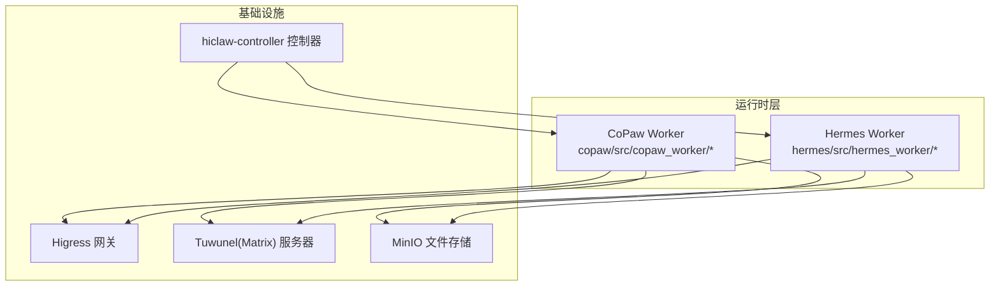
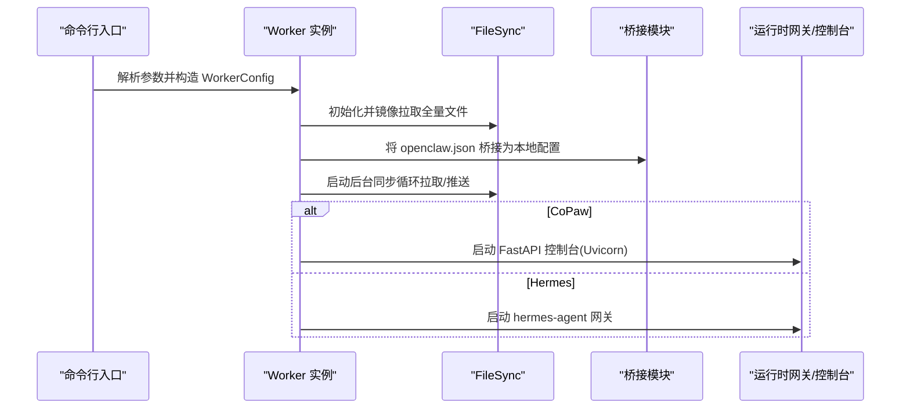
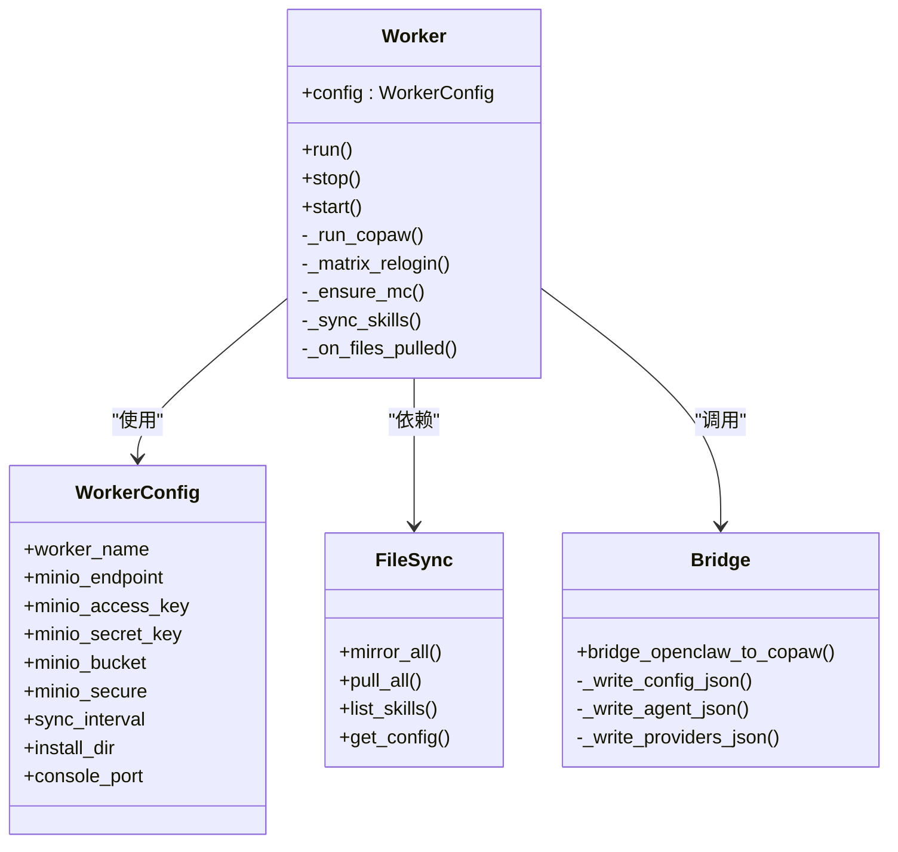
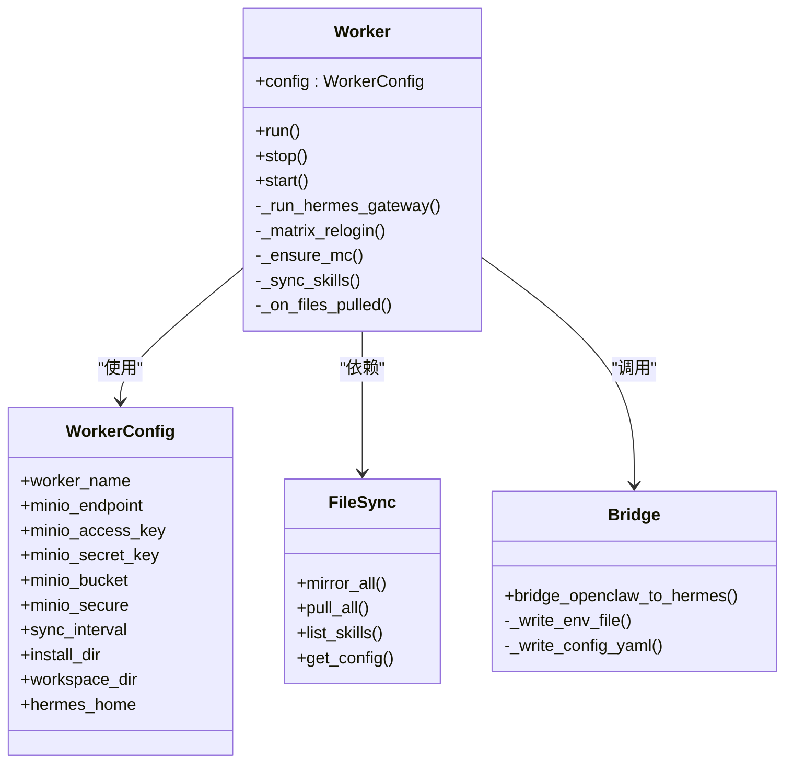
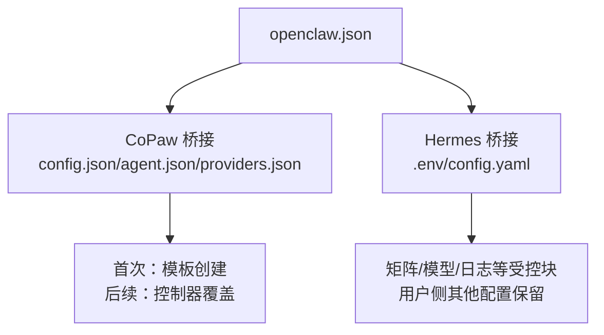
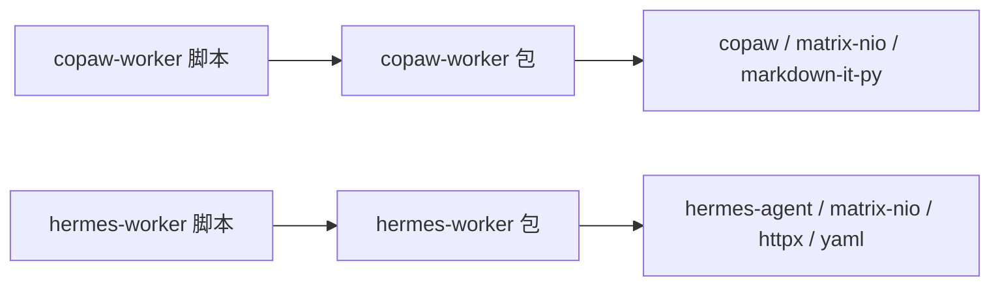
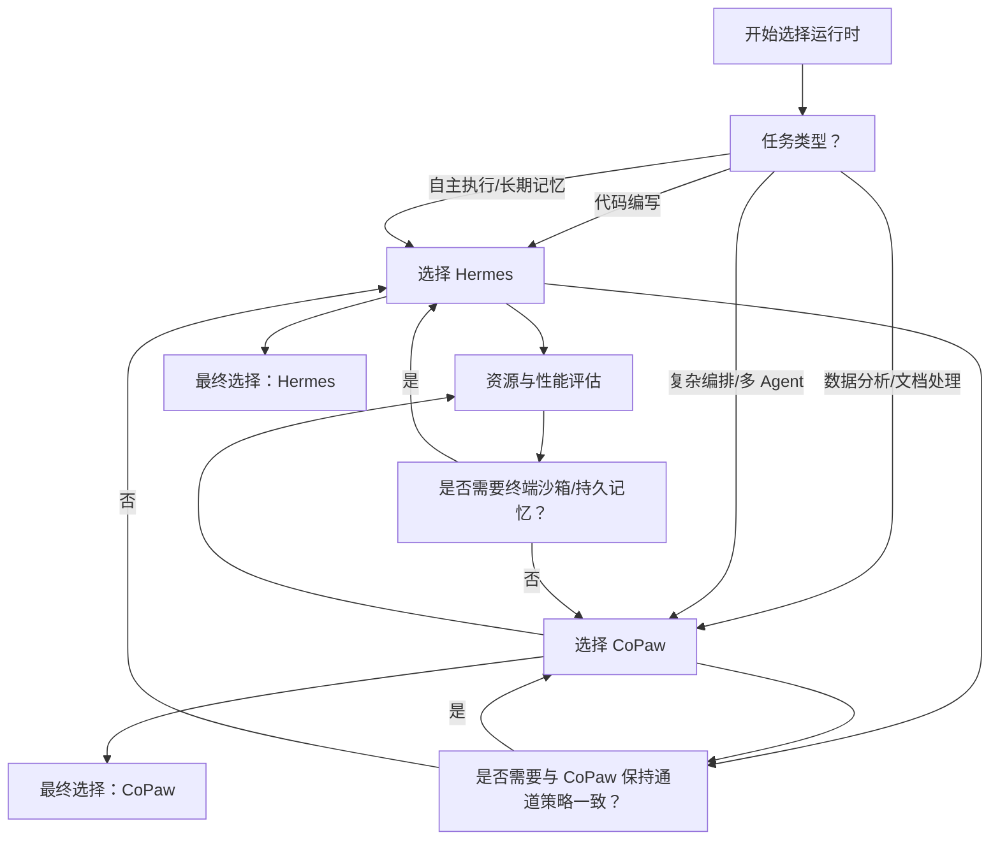

# 运行时对比与选择

<cite>
**本文引用的文件**
- [README.md](file://README.md)
- [copaw/README.md](file://copaw/README.md)
- [hermes/README.md](file://hermes/README.md)
- [copaw/src/copaw_worker/__init__.py](file://copaw/src/copaw_worker/__init__.py)
- [hermes/src/hermes_worker/__init__.py](file://hermes/src/hermes_worker/__init__.py)
- [copaw/src/copaw_worker/worker.py](file://copaw/src/copaw_worker/worker.py)
- [hermes/src/hermes_worker/worker.py](file://hermes/src/hermes_worker/worker.py)
- [copaw/src/copaw_worker/config.py](file://copaw/src/copaw_worker/config.py)
- [hermes/src/hermes_worker/config.py](file://hermes/src/hermes_worker/config.py)
- [copaw/src/copaw_worker/bridge.py](file://copaw/src/copaw_worker/bridge.py)
- [hermes/src/hermes_worker/bridge.py](file://hermes/src/hermes_worker/bridge.py)
- [copaw/src/copaw_worker/sync.py](file://copaw/src/copaw_worker/sync.py)
- [hermes/src/hermes_worker/sync.py](file://hermes/src/hermes_worker/sync.py)
- [copaw/src/copaw_worker/cli.py](file://copaw/src/copaw_worker/cli.py)
- [hermes/src/hermes_worker/cli.py](file://hermes/src/hermes_worker/cli.py)
- [copaw/pyproject.toml](file://copaw/pyproject.toml)
- [hermes/pyproject.toml](file://hermes/pyproject.toml)
</cite>

## 目录
1. [简介](#简介)
2. [项目结构](#项目结构)
3. [核心组件](#核心组件)
4. [架构总览](#架构总览)
5. [详细组件分析](#详细组件分析)
6. [依赖关系分析](#依赖关系分析)
7. [性能考量](#性能考量)
8. [故障排查指南](#故障排查指南)
9. [结论](#结论)
10. [附录](#附录)

## 简介
本文件面向需要在 HiClaw 平台上为不同任务类型选择合适运行时（CoPaw、Hermes 等）的用户与工程师，提供系统性的对比分析与选择指南。内容覆盖运行时特性、性能表现、适用场景、资源消耗、并发与扩展性、兼容与互操作、迁移成本与注意事项，以及可操作的决策树与选择清单。

## 项目结构
HiClaw 提供多运行时共存能力，其中 CoPaw 与 Hermes 是两种 Worker 运行时实现，二者均通过统一的控制器与共享存储（MinIO）、通信协议（Matrix）协同工作。下图展示运行时层与基础设施的关系：

图表来源
- [README.md:305-333](file://README.md#L305-L333)
- [copaw/src/copaw_worker/worker.py:183-205](file://copaw/src/copaw_worker/worker.py#L183-L205)
- [hermes/src/hermes_worker/worker.py:171-191](file://hermes/src/hermes_worker/worker.py#L171-L191)

章节来源
- [README.md:290-333](file://README.md#L290-L333)

## 核心组件
- 运行时入口与生命周期管理：CoPaw 与 Hermes 的 Worker 类负责启动、配置桥接、文件同步、通道接入与停止流程。
- 配置桥接：将统一的 openclaw.json 映射到各自运行时的本地配置文件或环境变量。
- 文件同步：基于 mc 客户端的双向同步机制，确保 Manager 侧与 Worker 侧状态一致。
- CLI 入口：分别提供 copaw-worker 与 hermes-worker 命令行工具，支持参数化启动。

章节来源
- [copaw/src/copaw_worker/worker.py:32-177](file://copaw/src/copaw_worker/worker.py#L32-L177)
- [hermes/src/hermes_worker/worker.py:44-165](file://hermes/src/hermes_worker/worker.py#L44-L165)
- [copaw/src/copaw_worker/bridge.py:155-211](file://copaw/src/copaw_worker/bridge.py#L155-L211)
- [hermes/src/hermes_worker/bridge.py:400-538](file://hermes/src/hermes_worker/bridge.py#L400-L538)
- [copaw/src/copaw_worker/sync.py:114-138](file://copaw/src/copaw_worker/sync.py#L114-L138)
- [hermes/src/hermes_worker/sync.py:114-143](file://hermes/src/hermes_worker/sync.py#L114-L143)
- [copaw/src/copaw_worker/cli.py:21-68](file://copaw/src/copaw_worker/cli.py#L21-L68)
- [hermes/src/hermes_worker/cli.py:21-72](file://hermes/src/hermes_worker/cli.py#L21-L72)

## 架构总览
下图展示运行时启动与配置桥接的关键步骤，体现两者在启动流程上的相似性与差异点（如 CoPaw 使用 FastAPI 启动控制台，Hermes 使用 hermes-agent 网关）：

图表来源
- [copaw/src/copaw_worker/worker.py:45-205](file://copaw/src/copaw_worker/worker.py#L45-L205)
- [hermes/src/hermes_worker/worker.py:59-191](file://hermes/src/hermes_worker/worker.py#L59-L191)
- [copaw/src/copaw_worker/bridge.py:155-211](file://copaw/src/copaw_worker/bridge.py#L155-L211)
- [hermes/src/hermes_worker/bridge.py:400-538](file://hermes/src/hermes_worker/bridge.py#L400-L538)
- [copaw/src/copaw_worker/sync.py:466-485](file://copaw/src/copaw_worker/sync.py#L466-L485)
- [hermes/src/hermes_worker/sync.py:460-479](file://hermes/src/hermes_worker/sync.py#L460-L479)

## 详细组件分析

### CoPaw Worker 组件分析
- 启动流程要点
  - 自动安装 mc 客户端，确保 MinIO 访问可用。
  - 全量镜像拉取后，解析 openclaw.json 并执行 Matrix 重新登录以刷新设备 ID，保障 E2EE 一致性。
  - 将 openclaw.json 桥接为 CoPaw 工作目录下的 config.json、agent.json、providers.json，并安装自定义 Matrix 通道。
  - 同步技能目录，启动后台同步循环。
  - 通过 Uvicorn 启动 FastAPI 控制台，提供 Web 可视化与调试能力。
- 配置桥接策略
  - 采用“模板创建 + 控制器覆盖”的双阶段策略：首次缺失文件时从模板复制默认值；后续仅对控制器拥有的字段进行覆盖，避免覆盖用户侧修改。
  - 支持远程优先、列表合并、深度合并等策略，确保模型、通道、运行参数等可控。
- 文件同步机制
  - 严格区分 Manager 管理与 Worker 管理的文件范围，避免互相覆盖。
  - 对 openclaw.json 执行字段级合并，保留本地侧的插件、频道等自定义项。
- 生命周期与热更新
  - 支持在不重启的情况下热更新 Matrix 允许列表等配置，减少中断风险。

图表来源
- [copaw/src/copaw_worker/config.py:7-29](file://copaw/src/copaw_worker/config.py#L7-L29)
- [copaw/src/copaw_worker/worker.py:32-177](file://copaw/src/copaw_worker/worker.py#L32-L177)
- [copaw/src/copaw_worker/sync.py:114-138](file://copaw/src/copaw_worker/sync.py#L114-L138)
- [copaw/src/copaw_worker/bridge.py:155-211](file://copaw/src/copaw_worker/bridge.py#L155-L211)

章节来源
- [copaw/src/copaw_worker/worker.py:45-205](file://copaw/src/copaw_worker/worker.py#L45-L205)
- [copaw/src/copaw_worker/bridge.py:155-211](file://copaw/src/copaw_worker/bridge.py#L155-L211)
- [copaw/src/copaw_worker/sync.py:225-263](file://copaw/src/copaw_worker/sync.py#L225-L263)

### Hermes Worker 组件分析
- 启动流程要点
  - 与 CoPaw 类似的启动序列：确保 mc、全量镜像、Matrix 重新登录、桥接 openclaw.json 到 .env 与 config.yaml、同步技能与 mcporter 配置、启动后台同步循环。
  - 通过 hermes-agent 的网关启动器加载配置并运行，适配其平台与终端沙箱。
- 配置桥接策略
  - 将 openclaw.json 中的模型、通道、日志等映射到 .env 与 config.yaml 的受控块，保留用户侧其他自定义项。
  - 对矩阵行为（提及要求、自由回复房间、自动建线程等）进行显式桥接。
- 文件同步机制
  - 与 CoPaw 相同的同步策略，但排除由桥接生成的衍生文件（如 .env、config.yaml），避免与 Manager 的配置变更冲突。
- 生命周期与热更新
  - 部分设置支持热更新，部分需重启网关生效；提供提示以便用户按需重启。

图表来源
- [hermes/src/hermes_worker/config.py:7-40](file://hermes/src/hermes_worker/config.py#L7-L40)
- [hermes/src/hermes_worker/worker.py:44-165](file://hermes/src/hermes_worker/worker.py#L44-L165)
- [hermes/src/hermes_worker/sync.py:114-143](file://hermes/src/hermes_worker/sync.py#L114-L143)
- [hermes/src/hermes_worker/bridge.py:400-538](file://hermes/src/hermes_worker/bridge.py#L400-L538)

章节来源
- [hermes/src/hermes_worker/worker.py:59-191](file://hermes/src/hermes_worker/worker.py#L59-L191)
- [hermes/src/hermes_worker/bridge.py:400-538](file://hermes/src/hermes_worker/bridge.py#L400-L538)
- [hermes/src/hermes_worker/sync.py:222-264](file://hermes/src/hermes_worker/sync.py#L222-L264)

### 配置桥接流程对比
- CoPaw
  - 模板驱动的首次创建 + 控制器覆盖的后续更新。
  - 覆盖范围明确限定于控制器拥有字段，其余由用户侧维护。
- Hermes
  - 将 openclaw.json 的关键字段映射到 .env 与 config.yaml 的受控块，保留用户侧其他配置。
  - 对矩阵行为与视觉能力进行专门桥接，保持与 CoPaw 的策略一致性。

图表来源
- [copaw/src/copaw_worker/bridge.py:155-211](file://copaw/src/copaw_worker/bridge.py#L155-L211)
- [hermes/src/hermes_worker/bridge.py:400-538](file://hermes/src/hermes_worker/bridge.py#L400-L538)

章节来源
- [copaw/src/copaw_worker/bridge.py:155-211](file://copaw/src/copaw_worker/bridge.py#L155-L211)
- [hermes/src/hermes_worker/bridge.py:400-538](file://hermes/src/hermes_worker/bridge.py#L400-L538)

## 依赖关系分析
- 运行时依赖
  - CoPaw Worker：依赖 copaw 运行时与 matrix-nio 等库，提供 Web 控制台与通道管理。
  - Hermes Worker：依赖 hermes-agent（容器内已安装）与 matrix-nio 等库，通过网关启动器运行。
- 包与脚本
  - 分别注册 copaw-worker 与 hermes-worker 命令行入口，便于直接运行或集成到容器中。

图表来源
- [copaw/pyproject.toml:12-24](file://copaw/pyproject.toml#L12-L24)
- [hermes/pyproject.toml:12-32](file://hermes/pyproject.toml#L12-L32)
- [copaw/src/copaw_worker/cli.py:21-68](file://copaw/src/copaw_worker/cli.py#L21-L68)
- [hermes/src/hermes_worker/cli.py:21-72](file://hermes/src/hermes_worker/cli.py#L21-L72)

章节来源
- [copaw/pyproject.toml:12-24](file://copaw/pyproject.toml#L12-L24)
- [hermes/pyproject.toml:12-32](file://hermes/pyproject.toml#L12-L32)

## 性能考量
- 资源消耗
  - CoPaw Worker 在文档与多 Agent 场景中具备显著内存优势，适合大规模协作与低资源占用需求。
  - Hermes Worker 提供终端沙箱与持久记忆，适合需要自主执行与长期记忆的任务，但资源开销相对更高。
- 并发与扩展性
  - 两者均通过异步后台任务维持文件同步，支持周期性拉取与触发式推送，满足动态任务编排与多 Worker 扩展。
  - 网关层（CoPaw 控制台/UVicorn 或 Hermes 网关）作为运行时入口，具备良好的并发处理能力。
- 端口与网络
  - 运行时通过环境变量 HICLAW_PORT_GATEWAY 将容器内部端口映射到宿主机端口，确保跨环境一致性。

章节来源
- [README.md:37-58](file://README.md#L37-L58)
- [copaw/src/copaw_worker/worker.py:139-144](file://copaw/src/copaw_worker/worker.py#L139-L144)
- [hermes/src/hermes_worker/worker.py:127-132](file://hermes/src/hermes_worker/worker.py#L127-L132)

## 故障排查指南
- 常见问题定位
  - 网络与凭据：确认 mc 别名设置、MinIO 端点与密钥正确；在云模式下检查 STS 凭据刷新逻辑。
  - 配置桥接：核对 openclaw.json 字段是否被正确映射至本地配置；关注控制器覆盖策略导致的字段变化。
  - 文件同步：检查同步循环是否正常运行，确认 Manager 管理与 Worker 管理文件的边界，避免互相覆盖。
- 日志与导出
  - 可通过控制器日志与调试日志导出工具定位问题，结合 Matrix 消息与会话日志进行交叉分析。

章节来源
- [copaw/src/copaw_worker/sync.py:163-183](file://copaw/src/copaw_worker/sync.py#L163-L183)
- [hermes/src/hermes_worker/sync.py:166-180](file://hermes/src/hermes_worker/sync.py#L166-L180)
- [README.md:355-379](file://README.md#L355-L379)

## 结论
- CoPaw 与 Hermes 在 HiClaw 生态中互补：前者强调轻量化与协作稳定性，后者强调自主执行与记忆能力。
- 选择建议应基于任务类型与资源约束：通用编排与文档处理倾向 CoPaw；需要终端执行与长期记忆的代码类任务倾向 Hermes。
- 运行时间可平滑切换，迁移成本较低，主要涉及配置桥接与同步策略的一致性验证。

## 附录

### 运行时对比矩阵（任务类型与推荐）
- 代码编写
  - 推荐：Hermes（终端沙箱、自学习技能、持久记忆）
  - 备选：CoPaw（通用工具链丰富，适合非自主执行场景）
- 数据分析
  - 推荐：CoPaw（文档处理与多 Agent 协作更稳定）
  - 备选：Hermes（若需结合终端执行与可视化）
- 文档处理
  - 推荐：CoPaw（内存占用低，适合大规模文档协作）
- 复杂编排与多 Agent 协同
  - 推荐：CoPaw（控制器覆盖策略明确，易于维护）
- 自主执行与长期记忆
  - 推荐：Hermes（网关与沙箱能力更强）

### 运行时切换与迁移指南
- 切换可行性
  - 通过 hiclaw CLI 或控制器接口将 Worker 运行时从 CoPaw 切换到 Hermes（或反向），无需重建房间或用户数据。
- 迁移成本
  - 主要为配置桥接与技能生态适配：确保 openclaw.json 字段映射正确，技能目录与工具链一致。
- 注意事项
  - 切换前备份 openclaw.json 与关键配置。
  - 关注 Matrix 通道策略一致性（提及要求、允许列表、加密等）。
  - 如需重启网关/控制台，请遵循运行时提供的热更新与重启提示。

章节来源
- [README.md:290-304](file://README.md#L290-L304)

### 决策树与选择清单
- 决策树

- 选择清单
  - 任务类型是否偏向代码编写与自主执行？
  - 是否需要终端沙箱与持久记忆？
  - 是否需要与现有 CoPaw 策略保持一致（提及、允许列表、加密）？
  - 资源预算与并发需求如何？
  - 是否需要快速上手与低资源占用？