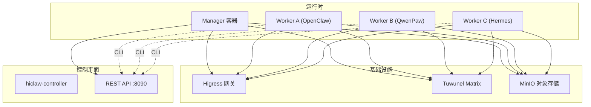
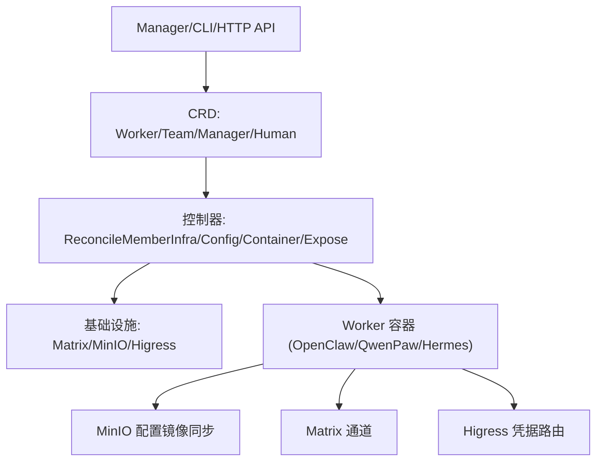
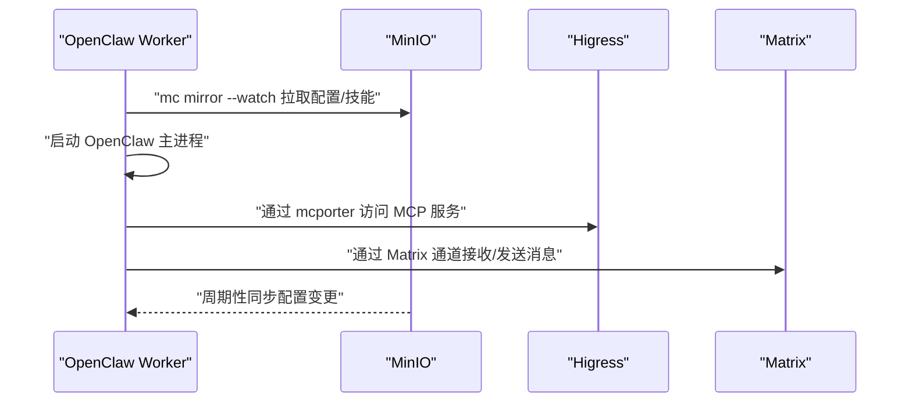
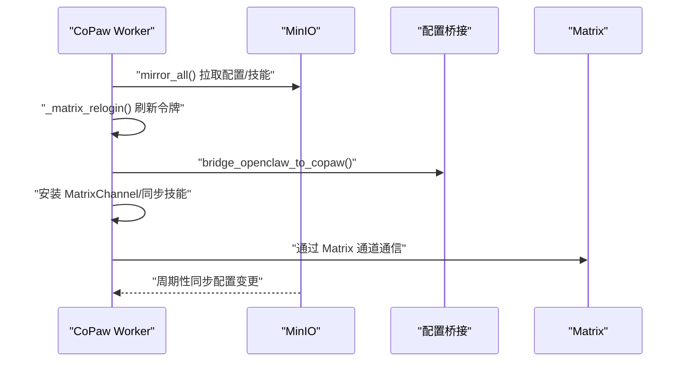
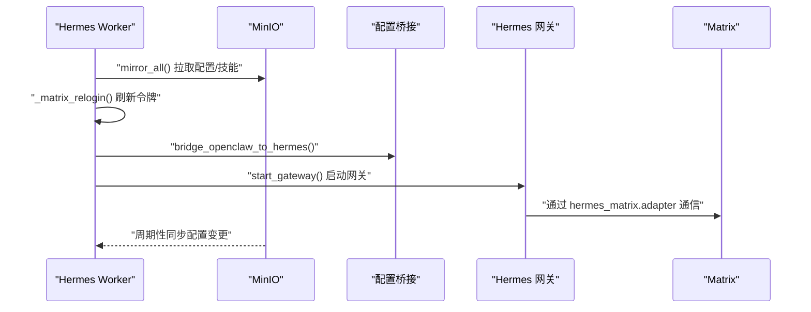
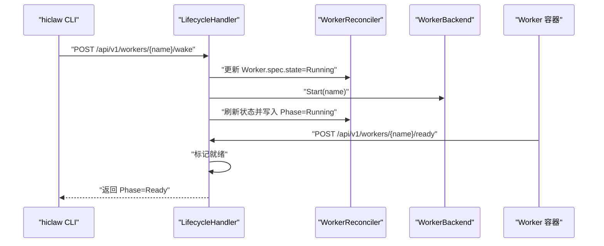
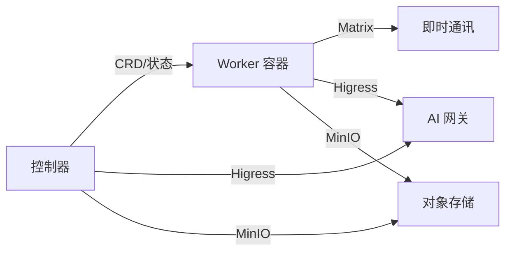

# 运行时系统

<cite>
**本文引用的文件**
- [README.md](file://README.md)
- [docs/architecture.md](file://docs/architecture.md)
- [docs/worker-guide.md](file://docs/worker-guide.md)
- [docs/declarative-resource-management.md](file://docs/declarative-resource-management.md)
- [copaw/README.md](file://copaw/README.md)
- [hermes/README.md](file://hermes/README.md)
- [hiclaw-controller/cmd/hiclaw/worker_cmd.go](file://hiclaw-controller/cmd/hiclaw/worker_cmd.go)
- [hiclaw-controller/internal/controller/worker_controller.go](file://hiclaw-controller/internal/controller/worker_controller.go)
- [hiclaw-controller/internal/server/lifecycle_handler.go](file://hiclaw-controller/internal/server/lifecycle_handler.go)
- [hiclaw-controller/internal/backend/interface.go](file://hiclaw-controller/internal/backend/interface.go)
- [copaw/src/copaw_worker/worker.py](file://copaw/src/copaw_worker/worker.py)
- [hermes/src/hermes_worker/worker.py](file://hermes/src/hermes_worker/worker.py)
- [helm/hiclaw/values.yaml](file://helm/hiclaw/values.yaml)
</cite>

## 目录
1. [简介](#简介)
2. [项目结构](#项目结构)
3. [核心组件](#核心组件)
4. [架构总览](#架构总览)
5. [详细组件分析](#详细组件分析)
6. [依赖关系分析](#依赖关系分析)
7. [性能考量](#性能考量)
8. [故障排查指南](#故障排查指南)
9. [结论](#结论)
10. [附录](#附录)

## 简介
HiClaw 提供多运行时协作的多智能体平台，支持三种 Worker 运行时在同一 IM 房间内协同工作：
- OpenClaw（Node.js）：通用 Agent，生态丰富，适合任务编排与工具调用
- QwenPaw（Python）：轻量运行时，适合浏览器自动化与快速任务
- Hermes（自主编码代理）：具备终端沙箱、自进化技能与持久记忆的自主编码代理

系统通过 Manager-Workers 架构实现集中编排，并以 Kubernetes 原生控制面（CRD + 控制器）实现 Worker 生命周期与配置的声明式管理。运行时可在不中断协作的前提下进行在线切换与热更新。

## 项目结构
HiClaw 的运行时系统由以下关键部分组成：
- 控制平面（hiclaw-controller）：负责 Worker/Manager/Team/Human 资源的声明式管理与生命周期编排
- 基础设施层（Higress 网关、Tuwunel Matrix、MinIO）：提供统一的流量治理、即时通讯与共享存储
- 运行时层（Worker 容器）：三种运行时分别在各自容器中执行，共享同一配置与文件系统

图表来源
- [docs/architecture.md:23-82](file://docs/architecture.md#L23-L82)

章节来源
- [docs/architecture.md:1-235](file://docs/architecture.md#L1-L235)
- [README.md:290-324](file://README.md#L290-L324)

## 核心组件
- 控制器（WorkerReconciler）：负责 Worker 资源的基础设施准备、配置生成、容器部署与暴露端口等流程；支持状态回写与失败消息记录
- 生命周期处理器（LifecycleHandler）：提供 /api/v1/workers/{name}/wake、/sleep、/ensure-ready、/ready 等接口，支持即时唤醒、休眠与就绪上报
- CLI（hiclaw worker 子命令）：提供 wake/sleep/ensure-ready/status/report-ready 等操作，便于在 Manager 或控制器容器内直接管理 Worker
- 运行时 Worker（OpenClaw/QwenPaw/Hermes）：从 MinIO 拉取配置与技能，建立双向文件同步，启动各自的 Agent 通道与网关

章节来源
- [hiclaw-controller/internal/controller/worker_controller.go:110-151](file://hiclaw-controller/internal/controller/worker_controller.go#L110-L151)
- [hiclaw-controller/internal/server/lifecycle_handler.go:34-160](file://hiclaw-controller/internal/server/lifecycle_handler.go#L34-L160)
- [hiclaw-controller/cmd/hiclaw/worker_cmd.go:28-133](file://hiclaw-controller/cmd/hiclaw/worker_cmd.go#L28-L133)
- [docs/worker-guide.md:139-185](file://docs/worker-guide.md#L139-L185)

## 架构总览
HiClaw 的多运行时协作基于“声明式资源 + 控制器 + 统一基础设施”的设计：
- Worker/Team/Manager/Human 通过 CRD 描述，控制器自动完成创建、更新与删除
- Worker 启动后通过 MinIO 镜像同步配置与技能，保持与 Manager 的配置一致
- 所有 Worker 共享同一 Matrix 房间，通过提及（@mentions）进行可见且可干预的任务协作

图表来源
- [docs/declarative-resource-management.md:787-800](file://docs/declarative-resource-management.md#L787-L800)
- [docs/architecture.md:165-177](file://docs/architecture.md#L165-L177)

章节来源
- [docs/declarative-resource-management.md:1-960](file://docs/declarative-resource-management.md#L1-L960)
- [docs/architecture.md:140-177](file://docs/architecture.md#L140-L177)

## 详细组件分析

### OpenClaw（Node.js）运行时
- 特点
  - 基于 Node.js 与 OpenClaw 运行时，具备丰富的技能生态与工具调用能力
  - 通过 mcporter 通过 Higress 访问 MCP 服务器
- 启动流程
  - 初始化 mc 别名，拉取 Worker 配置与技能模板
  - 启动双向 mc 镜像同步
  - 配置 mcporter 与 MCP 端点
  - 启动 OpenClaw 主进程
- 文件布局与同步
  - 工作区位于 /root/hiclaw-fs/agents/<worker-name>/，HOME 指向该目录
  - 支持本地到远端实时推送与远端到本地周期性拉取

图表来源
- [docs/worker-guide.md:139-160](file://docs/worker-guide.md#L139-L160)

章节来源
- [docs/worker-guide.md:22-28](file://docs/worker-guide.md#L22-L28)
- [docs/worker-guide.md:139-160](file://docs/worker-guide.md#L139-L160)

### QwenPaw（Python）运行时
- 特点
  - 轻量级 Python 运行时，适合浏览器自动化与快速任务
  - 通过 CoPaw 通道与 Matrix 集成，具备与 OpenClaw 相同的策略与加密模型
- 启动流程
  - 确保 mc 可用，拉取全部文件，解析 openclaw.json
  - 重新登录 Matrix 获取新鲜访问令牌与设备 ID（解决 E2EE 设备轮换）
  - 将 openclaw.json 映射为 CoPaw 工作空间配置
  - 安装 MatrixChannel，同步技能，启动后台同步与 Uvicorn 控制台

图表来源
- [copaw/src/copaw_worker/worker.py:65-177](file://copaw/src/copaw_worker/worker.py#L65-L177)

章节来源
- [copaw/README.md:1-18](file://copaw/README.md#L1-L18)
- [copaw/src/copaw_worker/worker.py:1-545](file://copaw/src/copaw_worker/worker.py#L1-L545)

### Hermes（自主编码代理）运行时
- 特点
  - 基于 hermes-agent，具备终端沙箱、自进化技能与持久记忆
  - 使用 hermes_matrix.overlay_adapter 适配 Matrix 策略（允许列表、@提及、加密、视觉支持）
- 启动流程
  - 确保 mc 可用，全量镜像拉取
  - 重新登录 Matrix，刷新访问令牌与设备 ID
  - 将 openclaw.json 映射为 Hermes 配置（config.yaml/.env/SOUL.md/AGENTS.md/skills）
  - 启动网关（gateway.run.start_gateway），运行 Agent 循环

图表来源
- [hermes/src/hermes_worker/worker.py:86-165](file://hermes/src/hermes_worker/worker.py#L86-L165)

章节来源
- [hermes/README.md:1-82](file://hermes/README.md#L1-L82)
- [hermes/src/hermes_worker/worker.py:1-463](file://hermes/src/hermes_worker/worker.py#L1-L463)

### 运行时切换机制（在线迁移与配置变更）
- 在线迁移
  - 通过 HTTP API 或 CLI 触发 /api/v1/workers/{name}/wake、/sleep、/ensure-ready
  - 控制器将 Worker.spec.state 更新为期望状态，触发后端立即执行（如 Start/Stop）
  - Worker 自报告就绪：/api/v1/workers/{name}/ready，控制器维护就绪映射，用于将 Phase 映射为 Ready
- 配置变更
  - Manager 推送新的 openclaw.json、SOUL.md、AGENTS.md、skills/ 等至 MinIO
  - Worker 通过 mc mirror 周期性拉取，或在收到变更事件后触发 re-bridge 与热更新（如 Matrix 允许列表）
  - 部分设置（如网关相关）需要重启网关以生效

图表来源
- [hiclaw-controller/internal/server/lifecycle_handler.go:34-160](file://hiclaw-controller/internal/server/lifecycle_handler.go#L34-L160)
- [hiclaw-controller/internal/controller/worker_controller.go:110-151](file://hiclaw-controller/internal/controller/worker_controller.go#L110-L151)
- [hiclaw-controller/cmd/hiclaw/worker_cmd.go:28-133](file://hiclaw-controller/cmd/hiclaw/worker_cmd.go#L28-L133)

章节来源
- [hiclaw-controller/internal/server/lifecycle_handler.go:1-235](file://hiclaw-controller/internal/server/lifecycle_handler.go#L1-L235)
- [hiclaw-controller/internal/controller/worker_controller.go:1-407](file://hiclaw-controller/internal/controller/worker_controller.go#L1-L407)
- [hiclaw-controller/cmd/hiclaw/worker_cmd.go:1-299](file://hiclaw-controller/cmd/hiclaw/worker_cmd.go#L1-L299)

### 运行时选择指南
- 任务编排与工具调用优先：OpenClaw（Node.js）
  - 生态丰富，适合复杂任务分解与多工具链协作
  - 适合需要大量技能与 MCP 交互的场景
- 快速任务与浏览器自动化：QwenPaw（Python）
  - 轻量、易部署，适合浏览器自动化与短任务
  - 与 Matrix 策略一致，便于统一管理
- 自主编码与终端交互：Hermes
  - 具备终端沙箱、自进化技能与持久记忆
  - 适合需要持续学习与独立执行代码的场景

章节来源
- [README.md:290-298](file://README.md#L290-L298)
- [docs/architecture.md:140-151](file://docs/architecture.md#L140-L151)

### 调试方法、性能监控与故障排查
- 调试方法
  - 导出调试日志：export-debug-log.py 支持按时间范围导出 Matrix 消息与 Agent 会话日志
  - Worker 日志：docker logs <worker-container> 或进入容器查看 /var/log
  - 配置验证：检查 openclaw.json、SOUL.md、AGENTS.md 是否正确同步
- 性能监控
  - 通过 CMS（阿里云 ARMS）集成导出 OTLP 指标与追踪（可选）
  - Worker 资源请求/限制在 Helm values 中配置，可根据负载调整
- 故障排查
  - Worker 启动失败：确认 openclaw.json 是否存在、mc 是否可用、MinIO 连接是否可达
  - 无法连接 Matrix：验证 homeserver 可达性与 openclaw.json 中的 Matrix 配置
  - 无法访问 LLM：检查 Higress Consumer Key 与路由授权
  - 无法访问 MCP：确认 mcporter 与路由授权

章节来源
- [README.md:355-379](file://README.md#L355-L379)
- [docs/worker-guide.md:61-123](file://docs/worker-guide.md#L61-L123)
- [helm/hiclaw/values.yaml:231-242](file://helm/hiclaw/values.yaml#L231-L242)

## 依赖关系分析
- 运行时与基础设施
  - 所有 Worker 通过 Higress 网关访问 LLM 与 MCP 服务，凭据由网关统一管理
  - 通过 MinIO 实现配置与技能的共享与镜像同步
  - 通过 Matrix 提供人类可见、可干预的协作通道
- 控制器与运行时
  - 控制器负责 Worker 的生命周期与配置下发，运行时负责实际执行与状态上报
  - 运行时通过就绪上报与心跳维持健康状态，控制器据此决定 Phase 与 Ready 状态

图表来源
- [docs/architecture.md:19-82](file://docs/architecture.md#L19-L82)

章节来源
- [docs/architecture.md:19-82](file://docs/architecture.md#L19-L82)

## 性能考量
- 资源分配建议
  - 最低配置：2 CPU + 4 GB 内存，推荐配置：4 CPU + 8 GB（多 Worker 场景）
- 运行时特性
  - OpenClaw：适合复杂任务与工具链，内存占用相对较高
  - QwenPaw：轻量运行时，适合快速任务与浏览器自动化
  - Hermes：具备终端与自进化能力，对资源与安全沙箱有更高要求
- 文件同步
  - MinIO 镜像同步采用本地实时推送与远端周期性拉取，降低延迟并减少冲突

章节来源
- [README.md:56-58](file://README.md#L56-L58)
- [docs/worker-guide.md:148-160](file://docs/worker-guide.md#L148-L160)

## 故障排查指南
- Worker 启动失败
  - 检查 openclaw.json 是否生成、mc 是否可用、MinIO 端点与密钥是否正确
- 无法连接 Matrix
  - 使用 curl 验证 homeserver 可达性，核对 openclaw.json 中的 Matrix 配置
- 无法访问 LLM
  - 使用 Worker 的 Consumer Key 调用 Higress 路由，检查 401/403 错误原因
- 无法访问 MCP
  - 使用 mcporter 测试路由与授权，确认 Worker 是否被授权访问目标 MCP 服务器
- 重置 Worker
  - 停止并删除容器后，让 Manager 重新创建并注入新凭证与配置

章节来源
- [docs/worker-guide.md:61-123](file://docs/worker-guide.md#L61-L123)

## 结论
HiClaw 的多运行时系统通过声明式资源与控制器实现了 Worker 生命周期与配置的统一管理，同时以基础设施层保障了跨运行时的一致性与安全性。三种运行时各具特色，可在同一房间内协同完成从任务编排到自主编码的全栈工作流。通过在线迁移与热更新机制，用户可以在不中断协作的前提下灵活切换与优化运行时配置。

## 附录
- 运行时默认镜像与资源
  - OpenClaw/QwenPaw/Hermes Worker 默认镜像在 Helm values 中定义，可通过 worker.defaultImage 与 worker.resources 调整
- 运行时选择与 Helm 参数
  - manager.runtime 与 worker.defaultRuntime 支持在 Helm 中指定默认运行时

章节来源
- [helm/hiclaw/values.yaml:243-263](file://helm/hiclaw/values.yaml#L243-L263)
- [README.md:161-191](file://README.md#L161-L191)