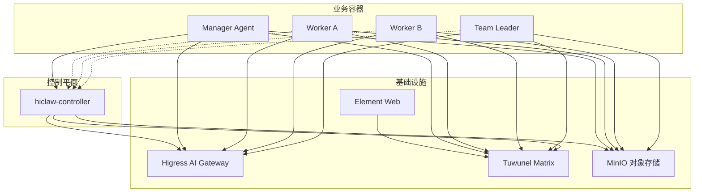
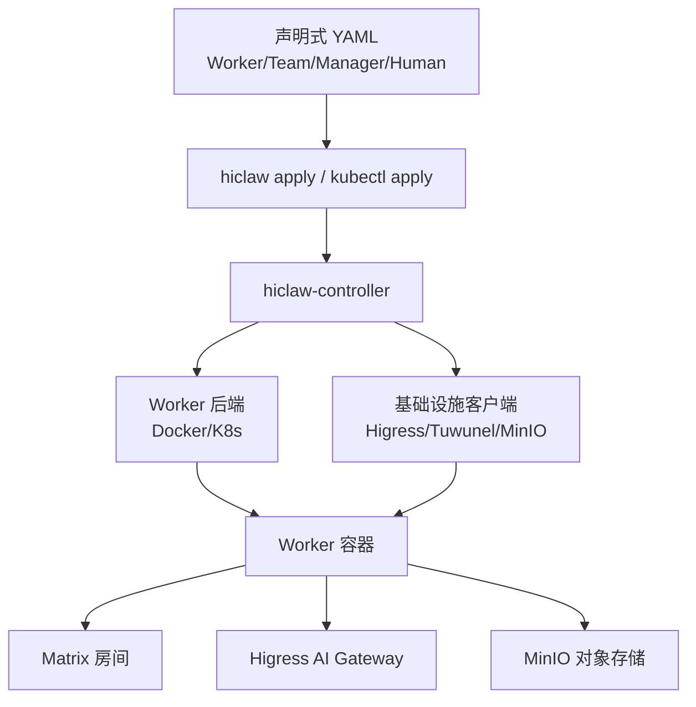
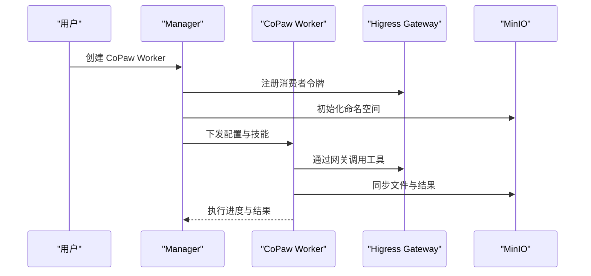
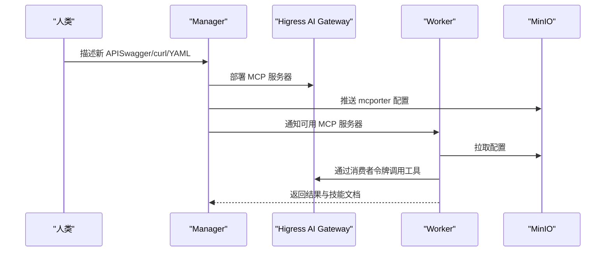
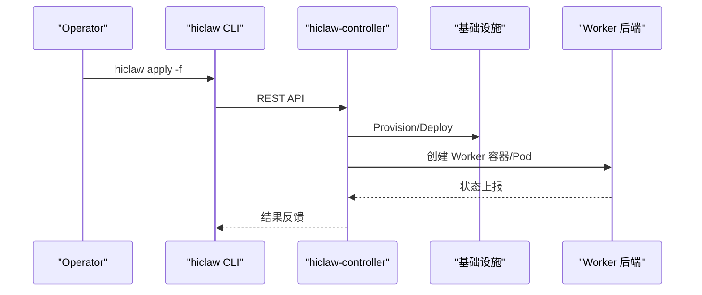
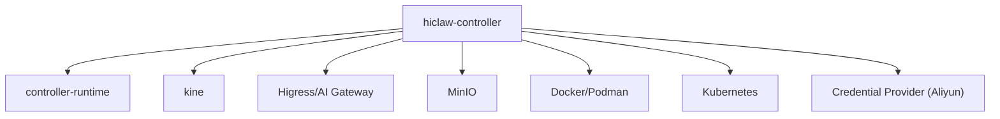

# 发展历程

<cite>
**本文引用的文件**
- [hiclaw-1.0.4-release.md](file://blog/hiclaw-1.0.4-release.md)
- [hiclaw-1.0.6-release.md](file://blog/hiclaw-1.0.6-release.md)
- [hiclaw-1.1.0-release.md](file://blog/hiclaw-1.1.0-release.md)
- [v1.0.4.md](file://changelog/v1.0.4.md)
- [v1.0.6.md](file://changelog/v1.0.6.md)
- [v1.1.0.md](file://changelog/v1.1.0.md)
- [README.md](file://README.md)
- [architecture.md](file://docs/architecture.md)
- [k8s-native-agent-orch.md](file://docs/k8s-native-agent-orch.md)
- [main.go](file://hiclaw-controller/cmd/controller/main.go)
- [app.go](file://hiclaw-controller/internal/app/app.go)
- [go.mod](file://hiclaw-controller/go.mod)
</cite>

## 目录
1. [引言](#引言)
2. [项目结构](#项目结构)
3. [核心组件](#核心组件)
4. [架构总览](#架构总览)
5. [详细组件分析](#详细组件分析)
6. [依赖分析](#依赖分析)
7. [性能考虑](#性能考虑)
8. [故障排查指南](#故障排查指南)
9. [结论](#结论)
10. [附录](#附录)

## 引言
本文围绕 HiClaw 自 2026 年 3 月开源以来的关键里程碑，系统梳理 v1.0.4、v1.0.6、v1.1.0 三个版本的演进脉络，重点阐述以下主题：
- 关键版本的发布日期与核心改进
- 技术路线与设计理念的演进（从“全栈容器”到“Kubernetes 原生控制平面”）
- 企业级 MCP 服务器管理与零凭证暴露的安全模型
- 多运行时协作（OpenClaw/QwenPaw/Hermes）与跨运行时消息传递
- 社区贡献与开源生态的发展
- 版本兼容性与升级建议
- 未来规划与技术方向展望

## 项目结构
HiClaw 采用“多容器 + 控制平面”的分层架构：基础设施（Higress 网关、Tuwunel 矩阵、MinIO 对象存储、Element Web）与业务容器（Manager/Worker）解耦，控制平面负责资源编排与一致性保证。v1.1.0 引入 hiclaw-controller，实现 Kubernetes 原生控制平面，支持 Embedded 模式与 Helm Chart 模式两种部署形态。

图表来源
- [architecture.md: 305-333:305-333](file://docs/architecture.md#L305-L333)
- [k8s-native-agent-orch.md: 478-490:478-490](file://docs/k8s-native-agent-orch.md#L478-L490)

章节来源
- [README.md: 305-333:305-333](file://README.md#L305-L333)
- [architecture.md: 3-16:3-16](file://docs/architecture.md#L3-L16)

## 核心组件
- 控制平面（hiclaw-controller）：基于 controller-runtime，提供 Worker/Team/Manager/Human 四类 CRD 的声明式编排与控制器。
- 网关与安全：Higress（或 AI Gateway）提供 LLM/MCP 代理与消费者令牌鉴权，实现“真实凭证不下发给 Agent”的零泄露模型。
- 协同通信：Matrix（Tuwunel）作为统一通信协议，支持人类与 Agent 的可见、可干预协作。
- 共享状态：MinIO 提供对象存储，Worker 工作空间与共享任务树持久化，实现无状态容器与可替换 Worker。
- 多运行时：OpenClaw（Node.js）、QwenPaw（Python，CoPaw）、Hermes（Python，自主编程 Agent）。

章节来源
- [architecture.md: 19-82:19-82](file://docs/architecture.md#L19-L82)
- [k8s-native-agent-orch.md: 464-477:464-477](file://docs/k8s-native-agent-orch.md#L464-L477)

## 架构总览
v1.1.0 的架构以“声明式资源 + 控制器 + 多后端”为核心：通过 CRD 描述期望状态，控制器驱动基础设施与容器后端（Docker/Podman/Kubernetes）达成收敛；同时提供 CLI 与 HTTP API，支持 Operator 与自动化流程。

图表来源
- [k8s-native-agent-orch.md: 203-228:203-228](file://docs/k8s-native-agent-orch.md#L203-L228)
- [app.go: 432-496:432-496](file://hiclaw-controller/internal/app/app.go#L432-L496)

章节来源
- [k8s-native-agent-orch.md: 197-242:197-242](file://docs/k8s-native-agent-orch.md#L197-L242)
- [app.go: 83-108:83-108](file://hiclaw-controller/internal/app/app.go#L83-L108)

## 详细组件分析

### v1.0.4：CoPaw Worker 支持与轻量化
- 发布日期：2026-03-10
- 核心改进
  - 引入 CoPaw Worker（Python 运行时），显著降低内存占用（约 80%），支持容器模式与本地模式。
  - 通过 Matrix Channel 与配置桥接，实现与 Manager/其他 Worker 的无缝协作。
  - 提升模型切换可控性、优化 Worker 间“自言自语”问题、增强 AI 身份意识。
- 设计理念
  - Manager-Worker 架构：通过统一通信层（Matrix）降低集成新 Agent 运行时的成本。
  - 轻量化优先：CoPaw Worker 适合多实例并行与本地环境访问场景。
- 社区影响
  - 降低部署门槛，提升多 Worker 场景下的资源利用率。
- 升级建议
  - 安装脚本支持选择默认运行时；升级时可平滑切换运行时。

图表来源
- [hiclaw-1.0.4-release.md: 109-179:109-179](file://blog/hiclaw-1.0.4-release.md#L109-L179)
- [v1.0.4.md: 7-23:7-23](file://changelog/v1.0.4.md#L7-L23)

章节来源
- [hiclaw-1.0.4-release.md: 1-306:1-306](file://blog/hiclaw-1.0.4-release.md#L1-L306)
- [v1.0.4.md: 1-72:1-72](file://changelog/v1.0.4.md#L1-L72)

### v1.0.6：企业级 MCP 服务器管理与零凭证暴露
- 发布日期：2026-03-14
- 核心改进
  - 引入 mcporter 与 Higress AI Gateway，实现 MCP 服务器的统一管理与零凭证暴露。
  - 支持从 Swagger/OpenAPI/curl 快速生成 MCP 工具，Manager 自动生成 YAML 并部署到网关。
  - Worker 通过消费者令牌访问 MCP，不接触真实凭证；支持权限隔离与动态撤销。
  - 增强文件同步设计原则，统一“写方推送 + 读方按需拉取”，减少冲突。
  - 引入斜杠命令（/reset、/stop）实现跨场景控制。
- 安全模型
  - 消费者令牌仅限授权 MCP 服务器访问；真实凭证驻留在网关侧，可即时撤销。
- 社区影响
  - 降低企业接入内部 API 的门槛，提升工具链标准化与可审计性。
- 升级建议
  - 保持 mcporter 配置路径兼容；注意矩阵房间预设与锁文件同步策略。

图表来源
- [hiclaw-1.0.6-release.md: 98-154:98-154](file://blog/hiclaw-1.0.6-release.md#L98-L154)
- [v1.0.6.md: 5-28:5-28](file://changelog/v1.0.6.md#L5-L28)

章节来源
- [hiclaw-1.0.6-release.md: 1-474:1-474](file://blog/hiclaw-1.0.6-release.md#L1-L474)
- [v1.0.6.md: 1-86:1-86](file://changelog/v1.0.6.md#L1-L86)

### v1.1.0：从个人工具到企业级多 Agent 平台
- 发布日期：2026-04-24
- 核心改进
  - 引入 hiclaw-controller，实现 Kubernetes 原生控制平面，支持 Embedded 模式与 Helm Chart 模式。
  - 新增 Hermes Worker（自主编程 Agent），与 OpenClaw/QwenPaw 形成“确定性领导者 + 自主执行者”的协作模式。
  - 1.7 GB 镜像瘦身：Manager 镜像不再捆绑基础设施，基础设施服务迁移到独立的 embedded 镜像。
  - 引入声明式 Worker 生命周期（spec.state: running/stopped），支持空闲休眠与按需唤醒。
  - 控制器内置 hiclaw CLI，支持 REST API 与 CLI 的一致体验。
  - 自动迁移 v1.0.9 的注册表数据到 CRD 资源，升级路径平滑。
- 设计理念演进
  - 从“全栈容器”到“控制平面 + 多后端”：控制器统一编排，后端可选 Docker/Podman/Kubernetes。
  - 从“聊天入口”到“声明式 API”：CLI/REST/YAML 三轨并行，满足不同使用场景。
- 社区影响
  - 提供企业级 Helm Chart，支持多租户、凭证提供者、RBAC、多副本 HA 等能力。
- 升级建议
  - 从 v1.0.9 升级：自动迁移注册表数据；注意 CRD schema 默认值与运行时选择逻辑的修复。

图表来源
- [k8s-native-agent-orch.md: 203-228:203-228](file://docs/k8s-native-agent-orch.md#L203-L228)
- [v1.1.0.md: 7-34:7-34](file://changelog/v1.1.0.md#L7-L34)

章节来源
- [hiclaw-1.1.0-release.md: 1-197:1-197](file://blog/hiclaw-1.1.0-release.md#L1-L197)
- [v1.1.0.md: 1-184:1-184](file://changelog/v1.1.0.md#L1-L184)
- [main.go: 16-36:16-36](file://hiclaw-controller/cmd/controller/main.go#L16-L36)
- [app.go: 111-175:111-175](file://hiclaw-controller/internal/app/app.go#L111-L175)

## 依赖分析
- 控制平面依赖
  - controller-runtime：构建控制器与缓存、认证中间件、HTTP 服务。
  - kine：Embedded 模式下的 etcd 替代，提供 CRD 存储。
  - Higress/AI Gateway：提供 LLM/MCP 代理与消费者令牌鉴权。
  - MinIO：对象存储，支撑共享工作空间与文件同步。
- 运行时与后端
  - Docker/Podman：Embedded 模式下的 Worker 容器后端。
  - Kubernetes：In-cluster 模式下的 Worker Pod 后端。
- 第三方集成
  - Aliyun API Gateway 与凭证提供者：在企业环境中提供 STS 令牌与细粒度访问控制。

图表来源
- [app.go: 181-262:181-262](file://hiclaw-controller/internal/app/app.go#L181-L262)
- [go.mod: 5-19:5-19](file://hiclaw-controller/go.mod#L5-L19)

章节来源
- [app.go: 181-262:181-262](file://hiclaw-controller/internal/app/app.go#L181-L262)
- [go.mod: 1-143:1-143](file://hiclaw-controller/go.mod#L1-L143)

## 性能考虑
- 轻量化运行时：CoPaw Worker 显著降低内存占用，适合多实例并行与本地环境访问。
- 镜像瘦身：Manager 镜像剥离基础设施，整体体积下降约 1.7 GB，提升启动速度与资源利用率。
- 声明式收敛：控制器每 5 分钟进行一次协调，避免频繁重启与令牌轮换带来的抖动。
- 文件同步优化：统一“写方推送 + 读方按需拉取”策略，减少冲突与带宽消耗。
- 网关与存储抽象：通过 Provider 接口支持多种后端（Higress/MinIO/Aliyun OSS），便于按需扩展与成本优化。

## 故障排查指南
- 控制器重启后 AI 路由 allowedConsumers 清空
  - 现象：重启后 Manager/Workers 403。
  - 处理：确保控制器持久化令牌与策略，避免每次协调轮转。
- CoPaw Manager 创建 Worker DM 回复阻塞
  - 现象：创建后 DM 回复超过 5 分钟。
  - 处理：使用 --no-wait + 心跳延迟处理，提升确认响应可靠性。
- Hermes Worker 未加入房间
  - 现象：Worker 无法接收消息。
  - 处理：控制器在创建房间后执行服务端 JoinRoom，确保加入成功。
- 安装器卸载残留
  - 现象：卸载后 Docker 卷占用，状态残留。
  - 处理：完善卸载流程，清理控制器容器与相关卷。

章节来源
- [v1.1.0.md: 35-67:35-67](file://changelog/v1.1.0.md#L35-L67)
- [v1.0.6.md: 15-28:15-28](file://changelog/v1.0.6.md#L15-L28)
- [v1.0.4.md: 16-23:16-23](file://changelog/v1.0.4.md#L16-L23)

## 结论
HiClaw 在 2026 年 3-4 月期间完成了从“轻量化运行时支持”到“企业级 MCP 管理”，再到“Kubernetes 原生控制平面”的三级跃迁。v1.0.4 解决了资源压力与本地环境访问问题；v1.0.6 将企业级安全与工具链标准化落地；v1.1.0 则以控制器为中心，打通声明式 API、多后端与企业级 Helm 部署，形成可扩展、可观测、可治理的多 Agent 协作平台。未来，HiClaw 将继续在多运行时协同、团队管理控制台、更丰富的 MCP 注册中心与可选的 NemoClaw 沙箱层等方面深化，持续展现技术创新活力与生态繁荣。

## 附录

### 版本兼容性与升级建议
- v1.0.4 → v1.0.6
  - 保持 mcporter 配置路径兼容；注意矩阵房间预设与锁文件同步策略。
  - 建议升级到最新安装脚本，启用斜杠命令与优化后的文件同步。
- v1.0.6 → v1.1.0
  - 自动迁移 v1.0.9 的注册表数据到 CRD 资源；注意 CRD schema 默认值与运行时选择逻辑的修复。
  - 推荐使用 hiclaw CLI 或 kubectl 管理资源，结合 Helm Chart 实现企业级部署。
  - 如需从 Embedded 模式迁移到 Helm 模式，参考 Helm Chart 文档与 CRD 规范。

章节来源
- [v1.1.0.md: 25-34:25-34](file://changelog/v1.1.0.md#L25-L34)
- [v1.0.6.md: 29-46:29-46](file://changelog/v1.0.6.md#L29-L46)
- [v1.0.4.md: 64-72:64-72](file://changelog/v1.0.4.md#L64-L72)