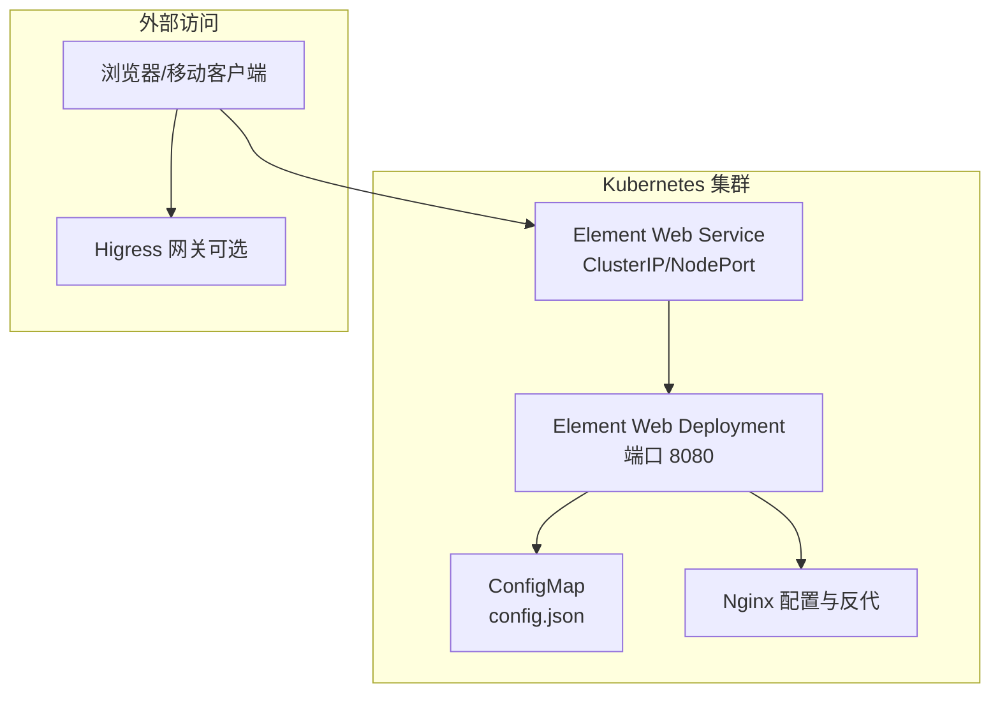
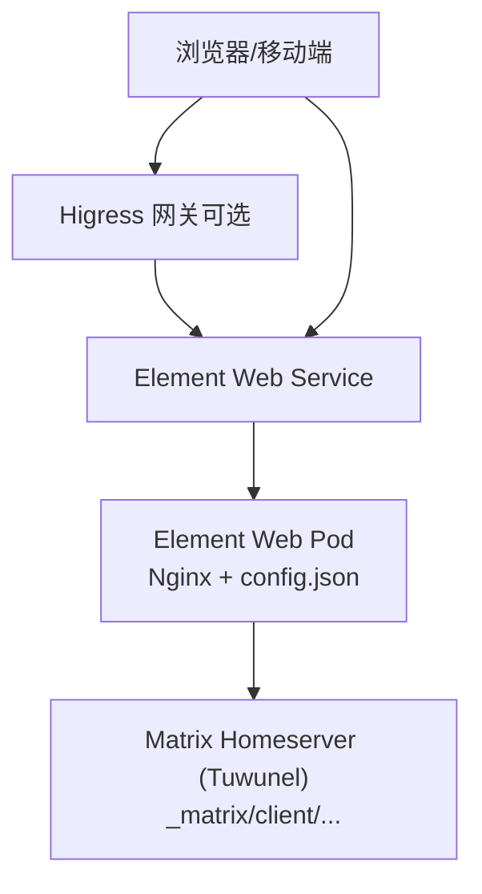
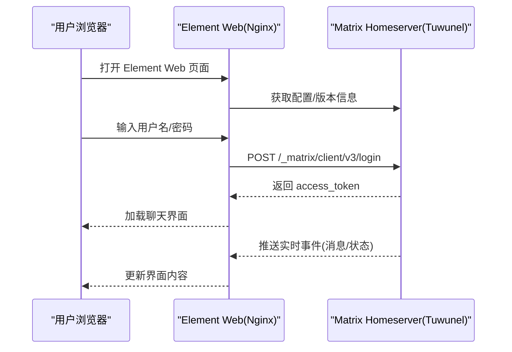
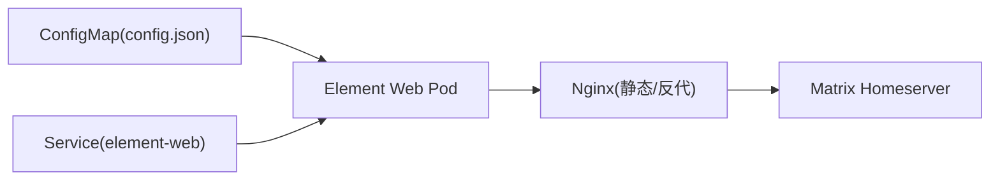

# Element Web 界面

<cite>
**本文引用的文件**
- [README.md](file://README.md)
- [start-element-web.sh](file://manager/scripts/init/start-element-web.sh)
- [configmap.yaml](file://helm/hiclaw/templates/element-web/configmap.yaml)
- [deployment.yaml](file://helm/hiclaw/templates/element-web/deployment.yaml)
- [service.yaml](file://helm/hiclaw/templates/element-web/service.yaml)
- [values.yaml](file://helm/hiclaw/values.yaml)
- [manager-guide.md](file://docs/manager-guide.md)
- [manager-guide.md（中文）](file://docs/zh-cn/manager-guide.md)
- [export-debug-log.py](file://scripts/export-debug-log.py)
</cite>

## 目录
1. [简介](#简介)
2. [项目结构](#项目结构)
3. [核心组件](#核心组件)
4. [架构总览](#架构总览)
5. [组件详解](#组件详解)
6. [依赖关系分析](#依赖关系分析)
7. [性能与可用性](#性能与可用性)
8. [故障排查指南](#故障排查指南)
9. [结论](#结论)
10. [附录](#附录)

## 简介
本文件面向 Element Web 界面在 HiClaw 体系中的集成与运维，聚焦以下目标：
- 界面定制与用户体验优化：品牌化、浏览器兼容性绕过、缓存策略与静态资源分发。
- 响应式与易用性：零配置接入、移动端与桌面端一致体验。
- 与后端服务的交互：Element Web 通过 Matrix Homeserver（Tuwunel）实现消息收发、状态同步与实时更新。
- 配置与个性化：通过 Helm Values 与启动脚本注入配置，支持品牌、禁用访客、自定义域名等。
- 部署与维护：Kubernetes 原生部署、健康探针、反向代理与端口规划、升级与回滚策略。
- 最佳实践与排障：日志导出、健康检查、常见问题定位。

## 项目结构
Element Web 在 HiClaw 中以独立容器部署，通过 Nginx 提供静态页面与反代能力，并由 Helm Chart 管理配置与服务暴露。整体结构如下：

图表来源
- [deployment.yaml:1-58](file://helm/hiclaw/templates/element-web/deployment.yaml#L1-L58)
- [service.yaml:1-23](file://helm/hiclaw/templates/element-web/service.yaml#L1-L23)
- [configmap.yaml:1-24](file://helm/hiclaw/templates/element-web/configmap.yaml#L1-L24)
- [start-element-web.sh:34-57](file://manager/scripts/init/start-element-web.sh#L34-L57)

章节来源
- [deployment.yaml:1-58](file://helm/hiclaw/templates/element-web/deployment.yaml#L1-L58)
- [service.yaml:1-23](file://helm/hiclaw/templates/element-web/service.yaml#L1-L23)
- [configmap.yaml:1-24](file://helm/hiclaw/templates/element-web/configmap.yaml#L1-L24)
- [values.yaml:212-230](file://helm/hiclaw/values.yaml#L212-L230)

## 核心组件
- Element Web 容器：承载前端静态资源与基础路由，监听 8080 端口。
- ConfigMap：注入 Element Web 的 homeserver 基础地址、品牌、访客策略等配置。
- Service：ClusterIP 或 NodePort 暴露 Element Web，便于浏览器访问或经网关转发。
- Nginx：在容器内提供静态文件服务、自动接受不受支持浏览器的脚本注入、反代 Manager 控制台（OpenClaw 运行时）与 WASM 插件服务器。
- Helm Values：集中定义 Element Web 的镜像、副本数、资源限制、服务类型与端口等。

章节来源
- [values.yaml:212-230](file://helm/hiclaw/values.yaml#L212-L230)
- [configmap.yaml:1-24](file://helm/hiclaw/templates/element-web/configmap.yaml#L1-L24)
- [deployment.yaml:1-58](file://helm/hiclaw/templates/element-web/deployment.yaml#L1-L58)
- [service.yaml:1-23](file://helm/hiclaw/templates/element-web/service.yaml#L1-L23)
- [start-element-web.sh:1-147](file://manager/scripts/init/start-element-web.sh#L1-L147)

## 架构总览
Element Web 作为 Matrix 客户端，通过 Element 的配置指向本地或网关暴露的 Matrix Homeserver（Tuwunel），实现消息收发、房间列表、实时事件推送等。Nginx 在容器内承担静态资源服务与反向代理，确保用户体验与安全策略（CSP）兼顾。

图表来源
- [values.yaml:62-62](file://helm/hiclaw/values.yaml#L62-L62)
- [configmap.yaml:12-22](file://helm/hiclaw/templates/element-web/configmap.yaml#L12-L22)
- [deployment.yaml:32-34](file://helm/hiclaw/templates/element-web/deployment.yaml#L32-L34)
- [service.yaml:14-18](file://helm/hiclaw/templates/element-web/service.yaml#L14-L18)

## 组件详解

### Element Web 配置与品牌化
- 配置来源：Helm ConfigMap 注入 homeserver 基础地址、品牌名、访客策略等。
- 品牌与外观：通过 brand 字段统一品牌名；disable_guests 控制访客登录；disable_custom_urls 控制自定义 URL。
- 动态生成：容器启动时根据环境变量生成 config.json 并挂载至 Nginx 静态目录。

章节来源
- [configmap.yaml:12-22](file://helm/hiclaw/templates/element-web/configmap.yaml#L12-L22)
- [start-element-web.sh:10-22](file://manager/scripts/init/start-element-web.sh#L10-L22)

### 浏览器兼容性与 CSP 绕过
- 问题背景：Element Web 内置浏览器版本检测，可能阻止部分浏览器访问。
- 解决方案：通过 Nginx sub_filter 注入外部 JS 文件（browser-bypass.js），在不破坏 CSP 的前提下绕过检测。
- 安全性：使用外部 JS 文件避免 inline script，维持 script-src 'self' 的 CSP 策略。

章节来源
- [start-element-web.sh:30-32](file://manager/scripts/init/start-element-web.sh#L30-L32)
- [start-element-web.sh:43-47](file://manager/scripts/init/start-element-web.sh#L43-L47)

### 反向代理与多端口协同
- Element Web 端口：Pod 内 8080，Service 暴露端口由 values 控制。
- Manager 控制台反代（OpenClaw 运行时）：通过 Nginx 注入 token 到 URL hash，实现自动登录；CSP 被临时剥离以便注入。
- WASM 插件服务器：Nginx 监听 8002，向 Envoy 提供插件模块，保障网关侧 AI 插件正常加载。

章节来源
- [start-element-web.sh:62-93](file://manager/scripts/init/start-element-web.sh#L62-L93)
- [start-element-web.sh:112-141](file://manager/scripts/init/start-element-web.sh#L112-L141)
- [deployment.yaml:32-34](file://helm/hiclaw/templates/element-web/deployment.yaml#L32-L34)
- [service.yaml:14-18](file://helm/hiclaw/templates/element-web/service.yaml#L14-L18)

### 与 Matrix 后端的交互流程
- 登录与认证：通过 Matrix Homeserver 的登录接口获取访问令牌，后续请求携带 Authorization 头。
- API 调用：使用 Matrix 官方客户端 API，如登录、房间列表、消息收发、状态同步等。
- 实时更新：Element Web 通过 Matrix 客户端库与 Homeserver 建立长连接，接收实时事件（消息、成员变更、状态等）。

图表来源
- [export-debug-log.py:162-186](file://scripts/export-debug-log.py#L162-L186)

章节来源
- [export-debug-log.py:162-186](file://scripts/export-debug-log.py#L162-L186)

### 配置项与个性化设置
- 品牌与外观：brand、disable_guests、disable_custom_urls。
- Matrix 服务器地址：default_server_config.m.homeserver.base_url，来源于 Helm Values 或启动脚本注入。
- 端口与服务：elementWeb.service.port、elementWeb.service.type、elementWeb.replicaCount。
- 资源限制：elementWeb.resources.requests/limits 控制 CPU 与内存。

章节来源
- [configmap.yaml:12-22](file://helm/hiclaw/templates/element-web/configmap.yaml#L12-L22)
- [values.yaml:212-230](file://helm/hiclaw/values.yaml#L212-L230)
- [deployment.yaml:35-44](file://helm/hiclaw/templates/element-web/deployment.yaml#L35-L44)

### 部署与维护策略
- 部署方式：Helm Chart 管理 Deployment、Service 与 ConfigMap。
- 健康检查：就绪探针与存活探针均针对 8080 端口。
- 升级与回滚：通过 Helm 升级 values 或镜像 tag；必要时回滚到上一个版本。
- 兼容性处理：通过 Nginx 统一处理静态资源与反代，减少前端版本差异带来的兼容问题。

章节来源
- [deployment.yaml:45-56](file://helm/hiclaw/templates/element-web/deployment.yaml#L45-L56)
- [service.yaml:14-18](file://helm/hiclaw/templates/element-web/service.yaml#L14-L18)
- [values.yaml:212-230](file://helm/hiclaw/values.yaml#L212-L230)

## 依赖关系分析
- Element Web 依赖 ConfigMap 提供的 homeserver 地址与品牌配置。
- Service 作为入口，将流量转发至 Pod 的 8080 端口。
- Nginx 在 Pod 内部提供静态服务与反代，同时处理浏览器兼容性绕过。
- 与 Matrix 的交互通过 Element 的配置与 Matrix 官方 API 实现。

图表来源
- [configmap.yaml:1-24](file://helm/hiclaw/templates/element-web/configmap.yaml#L1-L24)
- [deployment.yaml:24-44](file://helm/hiclaw/templates/element-web/deployment.yaml#L24-L44)
- [service.yaml:1-23](file://helm/hiclaw/templates/element-web/service.yaml#L1-L23)

章节来源
- [configmap.yaml:1-24](file://helm/hiclaw/templates/element-web/configmap.yaml#L1-L24)
- [deployment.yaml:24-44](file://helm/hiclaw/templates/element-web/deployment.yaml#L24-L44)
- [service.yaml:1-23](file://helm/hiclaw/templates/element-web/service.yaml#L1-L23)

## 性能与可用性
- 资源配额：通过 requests/limits 控制 CPU 与内存，避免资源争抢。
- 健康检查：就绪与存活探针定期探测 8080 端口，保证流量只进入健康实例。
- 缓存策略：对 config.json、index.html、i18n、version 等资源设置 no-cache，确保配置与国际化内容及时更新。
- 反代与压缩：Nginx 提供静态资源服务与反代，减少前端复杂度与浏览器兼容性问题。

章节来源
- [deployment.yaml:45-56](file://helm/hiclaw/templates/element-web/deployment.yaml#L45-L56)
- [start-element-web.sh:53-55](file://manager/scripts/init/start-element-web.sh#L53-L55)

## 故障排查指南
- 访问 Element Web 失败
  - 检查 Service 类型与端口映射是否正确。
  - 使用 curl 或浏览器访问 Service IP:PORT，确认就绪探针状态。
- 浏览器提示不受支持
  - 确认 Nginx 已注入 browser-bypass.js，且 CSP 未阻止外部脚本。
- 无法登录 Matrix
  - 使用导出脚本提供的登录与 API 方法验证 homeserver 地址与凭据。
  - 检查 Matrix Homeserver 的版本接口是否可达。
- 实时消息不同步
  - 确认 Element Web 已正确加载并连接到 Matrix Homeserver。
  - 检查网络连通性与网关路由配置。

章节来源
- [export-debug-log.py:162-186](file://scripts/export-debug-log.py#L162-L186)
- [start-element-web.sh:34-57](file://manager/scripts/init/start-element-web.sh#L34-L57)

## 结论
Element Web 在 HiClaw 中通过 Helm Chart 与 Nginx 协同，实现了零配置接入、品牌化与浏览器兼容性优化。其与 Matrix Homeserver 的交互清晰明确，结合健康检查与缓存策略，能够稳定支撑多端协作场景。通过合理的配置项与运维策略，可进一步提升可用性与可维护性。

## 附录
- 访问入口
  - 本地直连：http://127.0.0.1:18088
  - 经网关：http://matrix-client-local.hiclaw.io:18080（需解析到本机）
- 环境变量参考
  - HICLAW_ELEMENT_HOMESERVER_URL：Element Web 指向的 Matrix 基础地址
  - HICLAW_ELEMENT_BRAND：品牌名
  - HICLAW_MANAGER_RUNTIME：Manager 运行时（影响控制台反代行为）

章节来源
- [manager-guide.md:203-205](file://docs/manager-guide.md#L203-L205)
- [manager-guide.md（中文）:203-205](file://docs/zh-cn/manager-guide.md#L203-L205)
- [start-element-web.sh:4-8](file://manager/scripts/init/start-element-web.sh#L4-L8)