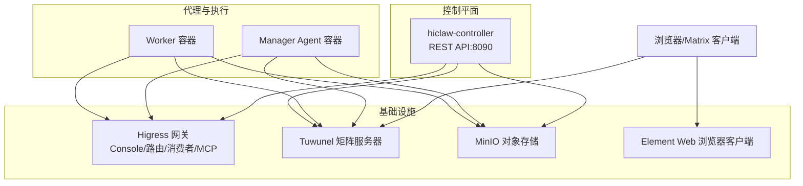
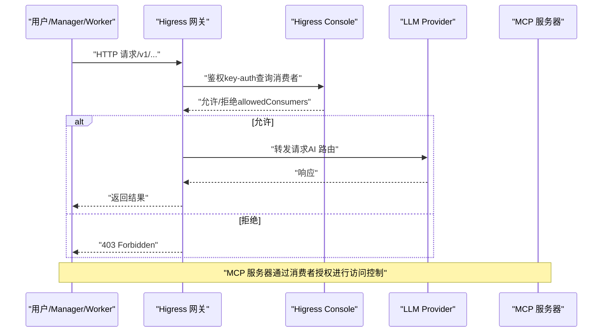
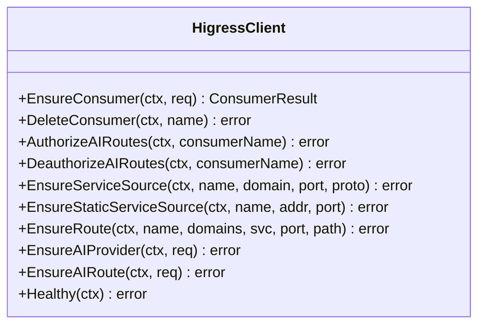
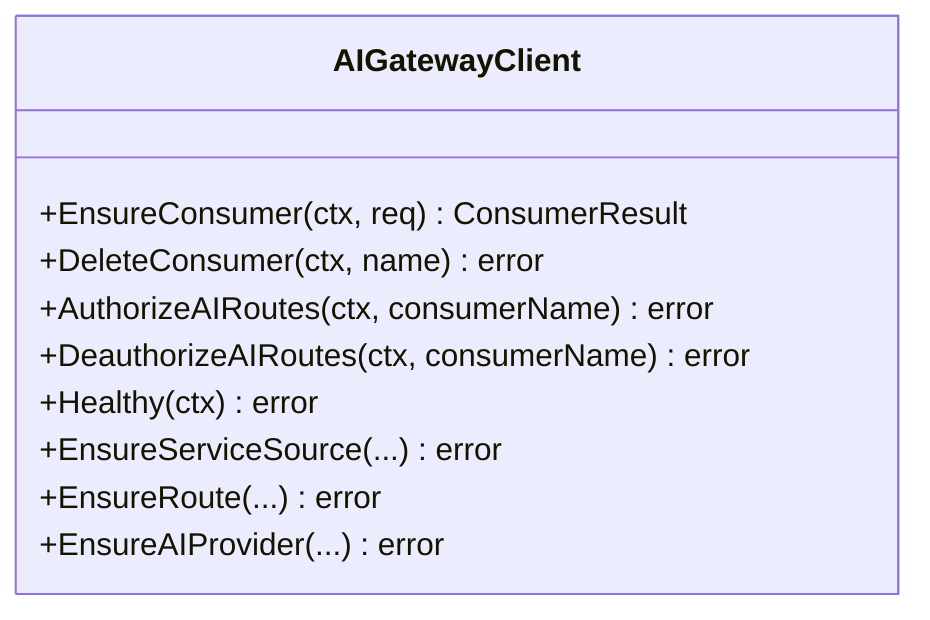
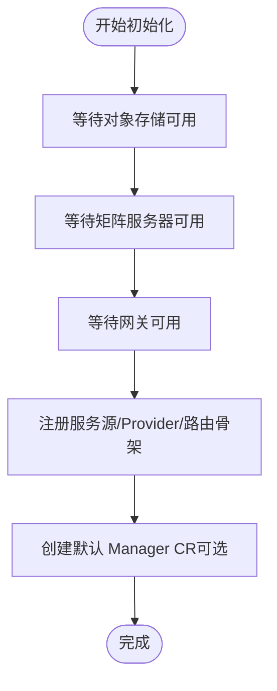
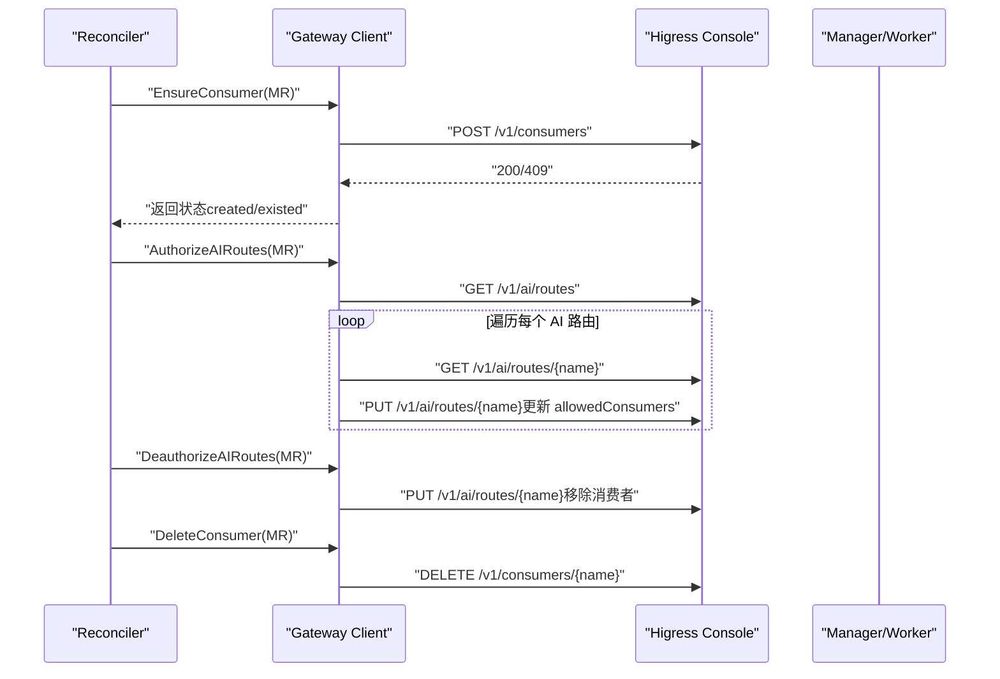
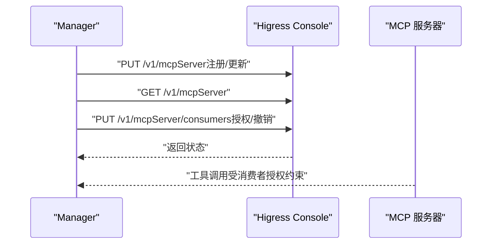
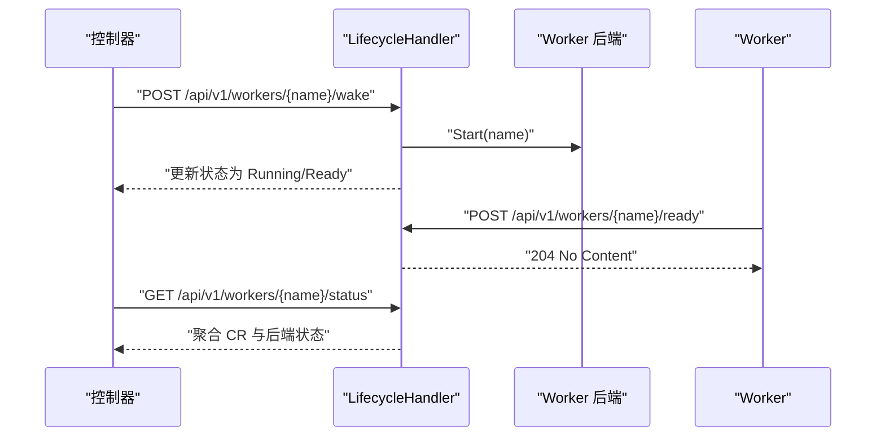
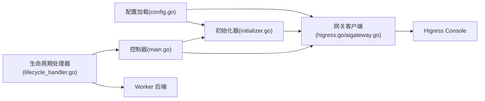

# Higress AI 网关

<cite>
**本文引用的文件**
- [README.md](file://README.md)
- [docs/architecture.md](file://docs/architecture.md)
- [hiclaw-controller/internal/gateway/higress.go](file://hiclaw-controller/internal/gateway/higress.go)
- [hiclaw-controller/internal/gateway/aigateway.go](file://hiclaw-controller/internal/gateway/aigateway.go)
- [hiclaw-controller/internal/gateway/types.go](file://hiclaw-controller/internal/gateway/types.go)
- [hiclaw-controller/internal/initializer/initializer.go](file://hiclaw-controller/internal/initializer/initializer.go)
- [hiclaw-controller/internal/server/lifecycle_handler.go](file://hiclaw-controller/internal/server/lifecycle_handler.go)
- [hiclaw-controller/internal/server/gateway_handler.go](file://hiclaw-controller/internal/server/gateway_handler.go)
- [hiclaw-controller/internal/config/config.go](file://hiclaw-controller/internal/config/config.go)
- [hiclaw-controller/cmd/controller/main.go](file://hiclaw-controller/cmd/controller/main.go)
- [docs/quickstart.md](file://docs/quickstart.md)
- [manager/scripts/lib/gateway-api.sh](file://manager/scripts/lib/gateway-api.sh)
- [manager/agent/skills/mcp-server-management/scripts/setup-mcp-proxy.sh](file://manager/agent/skills/mcp-server-management/scripts/setup-mcp-proxy.sh)
- [hiclaw-controller/internal/controller/manager_controller.go](file://hiclaw-controller/internal/controller/manager_controller.go)
- [hiclaw-controller/internal/controller/team_controller.go](file://hiclaw-controller/internal/controller/team_controller.go)
- [hiclaw-controller/internal/controller/human_controller.go](file://hiclaw-controller/internal/controller/human_controller.go)
- [worker/scripts/worker-entrypoint.sh](file://worker/scripts/worker-entrypoint.sh)
</cite>

## 目录
1. [简介](#简介)
2. [项目结构](#项目结构)
3. [核心组件](#核心组件)
4. [架构总览](#架构总览)
5. [详细组件分析](#详细组件分析)
6. [依赖关系分析](#依赖关系分析)
7. [性能考量](#性能考量)
8. [故障排查指南](#故障排查指南)
9. [结论](#结论)
10. [附录](#附录)

## 简介
本文件面向 Higress AI 网关的使用者与维护者，系统性阐述 HiClaw 自托管 AI 网关的设计与实现，重点覆盖以下方面：
- 路由管理：AI 路由骨架、服务源、域名与路径前缀的注册与幂等化。
- 负载均衡：通过 Higress 的服务源与上游配置实现多后端分发。
- 流量控制：基于 key-auth 的消费者授权与 MCP 服务器访问控制。
- 消费者生命周期：创建、授权、删除的完整流程与幂等保障。
- MCP 服务器集成：在 Higress 中托管 MCP 代理、消费者授权与动态权限控制。
- 健康检查与故障恢复：控制器启动阶段的基础设施等待与重试、网关会话缓存与自动恢复。
- 配置最佳实践与性能优化：环境变量、初始化顺序、并发与重试策略。
- 典型配置示例与常见问题：安装与升级、端口暴露、MCP 权限变更。

## 项目结构
HiClaw 将“控制器 + 网关 + 即时通讯 + 对象存储 + Web 客户端”的多容器布局拆分为：
- 控制器层：hiclaw-controller，负责资源编排、网关初始化、消费者与授权管理。
- 网关层：Higress（自托管）或阿里云 API 网关（AI Gateway），提供统一入口与认证。
- 通信层：Tuwunel（Matrix）用于人机协作；Element Web 提供浏览器客户端。
- 存储层：MinIO（或兼容 S3/OSS）用于共享工作区与任务树。

图示来源
- [docs/architecture.md:19-82](file://docs/architecture.md#L19-L82)

章节来源
- [docs/architecture.md:1-235](file://docs/architecture.md#L1-L235)
- [README.md:1-404](file://README.md#L1-L404)

## 核心组件
- Higress 客户端：封装 Higress Console API，支持会话登录、消费者创建/删除、AI 路由与服务源管理、MCP 服务器消费者授权等。
- AI Gateway 客户端：封装阿里云 API 网关（APIG）能力，仅支持消费者生命周期与授权，不管理路由与服务源。
- 初始化器：在控制器启动时等待基础设施就绪，注册服务源、AI Provider、AI 路由骨架，并可选择创建默认 Manager CR。
- 生命周期处理器：提供 Worker 的唤醒/睡眠/就绪上报等接口，配合控制器状态更新。
- 网关 API 处理器：对外暴露创建消费者等网关操作的 REST 接口。
- 配置加载：集中解析环境变量，生成网关、矩阵、对象存储、资源配额等配置。

章节来源
- [hiclaw-controller/internal/gateway/higress.go:1-631](file://hiclaw-controller/internal/gateway/higress.go#L1-L631)
- [hiclaw-controller/internal/gateway/aigateway.go:1-367](file://hiclaw-controller/internal/gateway/aigateway.go#L1-L367)
- [hiclaw-controller/internal/gateway/types.go:1-61](file://hiclaw-controller/internal/gateway/types.go#L1-L61)
- [hiclaw-controller/internal/initializer/initializer.go:1-524](file://hiclaw-controller/internal/initializer/initializer.go#L1-L524)
- [hiclaw-controller/internal/server/lifecycle_handler.go:1-235](file://hiclaw-controller/internal/server/lifecycle_handler.go#L1-L235)
- [hiclaw-controller/internal/server/gateway_handler.go:1-53](file://hiclaw-controller/internal/server/gateway_handler.go#L1-L53)
- [hiclaw-controller/internal/config/config.go:1-680](file://hiclaw-controller/internal/config/config.go#L1-L680)

## 架构总览
下图展示从浏览器到网关、再到 LLM 与 MCP 服务器的请求链路，以及消费者授权如何贯穿其中：

图示来源
- [hiclaw-controller/internal/gateway/higress.go:178-300](file://hiclaw-controller/internal/gateway/higress.go#L178-L300)
- [hiclaw-controller/internal/gateway/aigateway.go:170-250](file://hiclaw-controller/internal/gateway/aigateway.go#L170-L250)

章节来源
- [docs/architecture.md:120-137](file://docs/architecture.md#L120-L137)

## 详细组件分析

### Higress 客户端与 AI 路由管理
- 会话与登录：首次调用 Console API 时先执行系统初始化，再以管理员身份登录并缓存 Cookie，后续请求复用。
- 消费者管理：支持创建消费者（key-auth）、删除消费者；修改 AI 路由授权列表（添加/移除消费者）。
- 路由与服务源：注册服务源（DNS/静态）、域名、AI Provider、AI 路由骨架；幂等处理避免重复创建。
- 健康检查：对 /v1/consumers 进行探测，确保网关可用。

图示来源
- [hiclaw-controller/internal/gateway/higress.go:17-324](file://hiclaw-controller/internal/gateway/higress.go#L17-L324)

章节来源
- [hiclaw-controller/internal/gateway/higress.go:34-176](file://hiclaw-controller/internal/gateway/higress.go#L34-L176)
- [hiclaw-controller/internal/gateway/higress.go:178-300](file://hiclaw-controller/internal/gateway/higress.go#L178-L300)
- [hiclaw-controller/internal/gateway/higress.go:302-448](file://hiclaw-controller/internal/gateway/higress.go#L302-L448)
- [hiclaw-controller/internal/gateway/higress.go:450-459](file://hiclaw-controller/internal/gateway/higress.go#L450-L459)

### AI Gateway 客户端（阿里云 API 网关）
- 仅支持消费者生命周期与授权：创建、删除消费者；为消费者授权/撤销 LLM 资源访问。
- 不支持路由与服务源管理：这些资源由云平台控制台或基础设施外置管理。
- 健康检查：通过列举消费者验证连通性。

图示来源
- [hiclaw-controller/internal/gateway/aigateway.go:46-287](file://hiclaw-controller/internal/gateway/aigateway.go#L46-L287)

章节来源
- [hiclaw-controller/internal/gateway/aigateway.go:16-58](file://hiclaw-controller/internal/gateway/aigateway.go#L16-L58)
- [hiclaw-controller/internal/gateway/aigateway.go:252-287](file://hiclaw-controller/internal/gateway/aigateway.go#L252-L287)
- [hiclaw-controller/internal/gateway/aigateway.go:289-303](file://hiclaw-controller/internal/gateway/aigateway.go#L289-L303)

### 初始化器与基础设施等待
- 等待对象存储（MinIO/OSS）可用，确保桶存在且可列出。
- 等待矩阵服务器可用，使用健康检查账号尝试登录。
- 等待网关可用，调用 Healthy 接口。
- 注册服务源、AI Provider、AI 路由骨架；可选创建默认 Manager CR。
- 重试机制：固定间隔轮询，超时失败。

图示来源
- [hiclaw-controller/internal/initializer/initializer.go:69-134](file://hiclaw-controller/internal/initializer/initializer.go#L69-L134)
- [hiclaw-controller/internal/initializer/initializer.go:136-200](file://hiclaw-controller/internal/initializer/initializer.go#L136-L200)
- [hiclaw-controller/internal/initializer/initializer.go:202-399](file://hiclaw-controller/internal/initializer/initializer.go#L202-L399)

章节来源
- [hiclaw-controller/internal/initializer/initializer.go:69-134](file://hiclaw-controller/internal/initializer/initializer.go#L69-L134)
- [hiclaw-controller/internal/initializer/initializer.go:136-200](file://hiclaw-controller/internal/initializer/initializer.go#L136-L200)
- [hiclaw-controller/internal/initializer/initializer.go:202-399](file://hiclaw-controller/internal/initializer/initializer.go#L202-L399)

### 消费者生命周期与授权
- 创建消费者：向 Higress Console 发起创建请求，若已存在则返回“已存在”状态。
- 授权 AI 路由：遍历所有 AI 路由，读取当前路由配置，追加/移除消费者，触发 WASM 凭证重载。
- 删除消费者：删除消费者及其关联授权；同时清理 MinIO 用户（如启用）。

图示来源
- [hiclaw-controller/internal/gateway/higress.go:137-176](file://hiclaw-controller/internal/gateway/higress.go#L137-L176)
- [hiclaw-controller/internal/gateway/higress.go:178-300](file://hiclaw-controller/internal/gateway/higress.go#L178-L300)
- [hiclaw-controller/internal/gateway/higress.go:302-338](file://hiclaw-controller/internal/gateway/higress.go#L302-L338)
- [hiclaw-controller/internal/gateway/higress.go:450-459](file://hiclaw-controller/internal/gateway/higress.go#L450-L459)

章节来源
- [hiclaw-controller/internal/gateway/higress.go:137-176](file://hiclaw-controller/internal/gateway/higress.go#L137-L176)
- [hiclaw-controller/internal/gateway/higress.go:178-300](file://hiclaw-controller/internal/gateway/higress.go#L178-L300)
- [hiclaw-controller/internal/gateway/higress.go:302-338](file://hiclaw-controller/internal/gateway/higress.go#L302-L338)
- [hiclaw-controller/internal/gateway/higress.go:450-459](file://hiclaw-controller/internal/gateway/higress.go#L450-L459)

### MCP 服务器集成与权限控制
- MCP 代理配置：通过 Manager 技能脚本在 Higress 中注册 OPEN_API 类型的 MCP 服务器，绑定域名与服务引用，并启用 key-auth。
- 消费者授权：为 MCP 服务器更新 allowedConsumers 列表，支持批量授权与去重。
- 动态权限：Manager 可根据需要撤销或恢复某个消费者的 MCP 访问权限。

图示来源
- [manager/agent/skills/mcp-server-management/scripts/setup-mcp-proxy.sh:259-291](file://manager/agent/skills/mcp-server-management/scripts/setup-mcp-proxy.sh#L259-L291)
- [manager/scripts/lib/gateway-api.sh:223-287](file://manager/scripts/lib/gateway-api.sh#L223-L287)

章节来源
- [manager/agent/skills/mcp-server-management/scripts/setup-mcp-proxy.sh:259-291](file://manager/agent/skills/mcp-server-management/scripts/setup-mcp-proxy.sh#L259-L291)
- [manager/scripts/lib/gateway-api.sh:223-287](file://manager/scripts/lib/gateway-api.sh#L223-L287)

### Worker 生命周期与就绪上报
- 唤醒/睡眠：通过 REST 接口设置 Worker 的期望状态，控制器立即作用于后端并更新状态。
- 就绪上报：Worker 自报就绪，控制器记录并据此将状态提升为 Ready。
- 运行时状态聚合：结合 CR 与后端状态，输出最终 Phase。

图示来源
- [hiclaw-controller/internal/server/lifecycle_handler.go:34-160](file://hiclaw-controller/internal/server/lifecycle_handler.go#L34-L160)
- [hiclaw-controller/internal/server/lifecycle_handler.go:162-205](file://hiclaw-controller/internal/server/lifecycle_handler.go#L162-L205)
- [worker/scripts/worker-entrypoint.sh:348-358](file://worker/scripts/worker-entrypoint.sh#L348-L358)

章节来源
- [hiclaw-controller/internal/server/lifecycle_handler.go:34-160](file://hiclaw-controller/internal/server/lifecycle_handler.go#L34-L160)
- [hiclaw-controller/internal/server/lifecycle_handler.go:162-205](file://hiclaw-controller/internal/server/lifecycle_handler.go#L162-L205)
- [worker/scripts/worker-entrypoint.sh:348-358](file://worker/scripts/worker-entrypoint.sh#L348-L358)

### 配置加载与运行入口
- 配置加载：集中解析环境变量，生成网关、矩阵、对象存储、资源配额等配置；支持主机替换与 MinIO S3 端口规范化。
- 运行入口：控制器启动日志打印，优雅信号处理，应用初始化与启动。

章节来源
- [hiclaw-controller/internal/config/config.go:207-356](file://hiclaw-controller/internal/config/config.go#L207-L356)
- [hiclaw-controller/internal/config/config.go:565-680](file://hiclaw-controller/internal/config/config.go#L565-L680)
- [hiclaw-controller/cmd/controller/main.go:16-36](file://hiclaw-controller/cmd/controller/main.go#L16-L36)

## 依赖关系分析
- 控制器依赖网关客户端（Higress 或 AI Gateway）进行消费者与路由管理。
- 初始化器在控制器启动早期运行，确保基础设施可用后再进入常规 reconciler 循环。
- 生命周期处理器与 Worker 后端交互，实现即时状态变更与就绪上报。
- 配置模块为各子系统提供统一参数来源。

图示来源
- [hiclaw-controller/internal/config/config.go:565-680](file://hiclaw-controller/internal/config/config.go#L565-L680)
- [hiclaw-controller/internal/gateway/higress.go:17-32](file://hiclaw-controller/internal/gateway/higress.go#L17-L32)
- [hiclaw-controller/internal/gateway/aigateway.go:46-58](file://hiclaw-controller/internal/gateway/aigateway.go#L46-L58)
- [hiclaw-controller/internal/initializer/initializer.go:61-67](file://hiclaw-controller/internal/initializer/initializer.go#L61-L67)
- [hiclaw-controller/cmd/controller/main.go:16-36](file://hiclaw-controller/cmd/controller/main.go#L16-L36)
- [hiclaw-controller/internal/server/lifecycle_handler.go:15-32](file://hiclaw-controller/internal/server/lifecycle_handler.go#L15-L32)

章节来源
- [hiclaw-controller/internal/config/config.go:1-680](file://hiclaw-controller/internal/config/config.go#L1-L680)
- [hiclaw-controller/internal/gateway/higress.go:1-631](file://hiclaw-controller/internal/gateway/higress.go#L1-L631)
- [hiclaw-controller/internal/gateway/aigateway.go:1-367](file://hiclaw-controller/internal/gateway/aigateway.go#L1-L367)
- [hiclaw-controller/internal/initializer/initializer.go:1-524](file://hiclaw-controller/internal/initializer/initializer.go#L1-L524)
- [hiclaw-controller/internal/server/lifecycle_handler.go:1-235](file://hiclaw-controller/internal/server/lifecycle_handler.go#L1-L235)
- [hiclaw-controller/cmd/controller/main.go:1-37](file://hiclaw-controller/cmd/controller/main.go#L1-L37)

## 性能考量
- 幂等与冲突处理：消费者创建与路由更新均采用幂等策略，遇到冲突时重试并等待短暂退避，降低并发写入冲突。
- 会话缓存：Higress 客户端登录后缓存 Cookie，减少重复认证开销。
- 健康检查与重试：初始化器与控制器在启动阶段采用固定间隔与超时上限的重试，避免长时间阻塞。
- 路由授权批量更新：遍历 AI 路由时逐个更新 allowedConsumers，确保凭证框架触发重载，避免遗漏。
- 端口暴露与域名：本地开发场景默认生成 .local.hiclaw.io 域名，便于浏览器直连与调试。

章节来源
- [hiclaw-controller/internal/gateway/higress.go:202-297](file://hiclaw-controller/internal/gateway/higress.go#L202-L297)
- [hiclaw-controller/internal/gateway/higress.go:34-84](file://hiclaw-controller/internal/gateway/higress.go#L34-L84)
- [hiclaw-controller/internal/initializer/initializer.go:478-495](file://hiclaw-controller/internal/initializer/initializer.go#L478-L495)

## 故障排查指南
- 网关不可用：检查 Higress Console 地址与管理员凭据，确认 Healthy 接口返回 200。
- 消费者未生效：确认 AI 路由授权是否成功更新，查看 allowedConsumers 是否包含目标消费者。
- MCP 权限异常：核对 MCP 服务器消费者授权列表，必要时重新授权或撤销。
- Worker 就绪上报：确认 Worker 已执行就绪上报脚本，控制器侧 Ready 标记是否正确。
- 初始化失败：关注初始化器的等待阶段（OSS/MX/GW），定位具体超时环节。

章节来源
- [hiclaw-controller/internal/gateway/higress.go:450-459](file://hiclaw-controller/internal/gateway/higress.go#L450-L459)
- [hiclaw-controller/internal/gateway/higress.go:178-300](file://hiclaw-controller/internal/gateway/higress.go#L178-L300)
- [hiclaw-controller/internal/server/lifecycle_handler.go:162-174](file://hiclaw-controller/internal/server/lifecycle_handler.go#L162-L174)
- [hiclaw-controller/internal/initializer/initializer.go:136-200](file://hiclaw-controller/internal/initializer/initializer.go#L136-L200)

## 结论
Higress AI 网关在 HiClaw 中承担统一入口、消费者认证与 MCP 服务器托管的关键职责。通过幂等化的初始化流程、细粒度的消费者授权与路由管理、以及完善的健康检查与重试机制，系统实现了安全、可观测、可扩展的自托管 AI 网关方案。配合控制器的资源编排与 Worker 生命周期管理，整体平台具备良好的企业级落地能力。

## 附录

### 配置最佳实践
- 环境变量优先：通过环境变量集中配置网关、矩阵、对象存储与模型参数，避免硬编码。
- 主机替换与端口规范化：嵌入式模式下自动替换主机名，MinIO S3 端口需指向 9000。
- 默认路由骨架：仅创建 AI 路由骨架，授权字段由控制器在运行时维护，避免重启竞态。
- 会话与凭据：Higress 管理员凭据与矩阵凭据保持一致，便于统一管理。

章节来源
- [hiclaw-controller/internal/config/config.go:207-356](file://hiclaw-controller/internal/config/config.go#L207-L356)
- [hiclaw-controller/internal/config/config.go:546-563](file://hiclaw-controller/internal/config/config.go#L546-L563)
- [hiclaw-controller/internal/initializer/initializer.go:377-391](file://hiclaw-controller/internal/initializer/initializer.go#L377-L391)

### 安装与升级参考
- 一键安装与登录：参考快速入门指南中的安装步骤与登录校验清单。
- 升级与卸载：使用官方安装脚本进行升级与卸载，确保数据卷与网络保留或清理。

章节来源
- [docs/quickstart.md:13-77](file://docs/quickstart.md#L13-L77)
- [docs/quickstart.md:347-356](file://docs/quickstart.md#L347-L356)

### 常见问题与解决思路
- 网关 403：检查消费者是否已授权至 AI 路由与 MCP 服务器。
- 路由未生效：确认 AI 路由骨架已创建，allowedConsumers 字段已更新。
- Worker 无法就绪：确认就绪上报接口被调用，控制器 Ready 标记已更新。
- 初始化超时：检查 OSS/MX/GW 的可达性与凭据，适当延长重试时间。

章节来源
- [hiclaw-controller/internal/gateway/higress.go:178-300](file://hiclaw-controller/internal/gateway/higress.go#L178-L300)
- [hiclaw-controller/internal/server/lifecycle_handler.go:162-174](file://hiclaw-controller/internal/server/lifecycle_handler.go#L162-L174)
- [hiclaw-controller/internal/initializer/initializer.go:136-200](file://hiclaw-controller/internal/initializer/initializer.go#L136-L200)