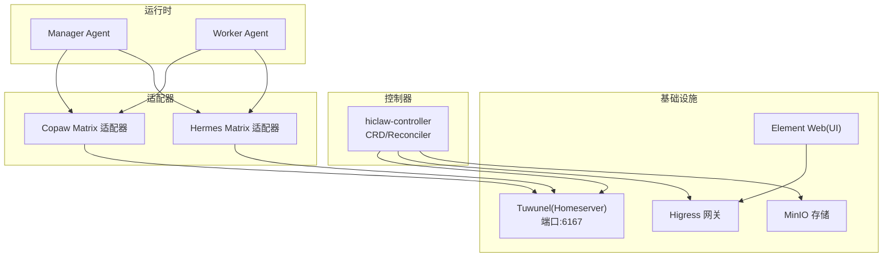
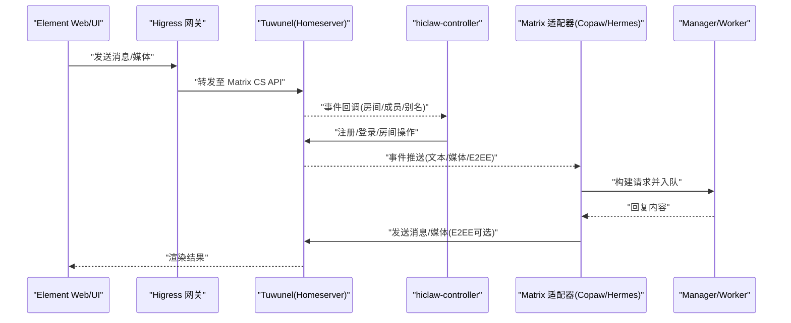
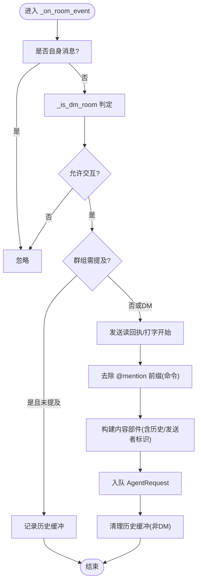
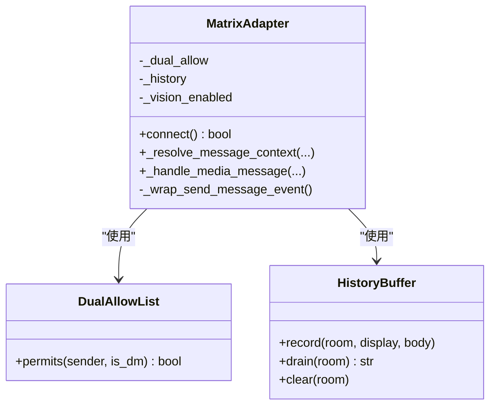
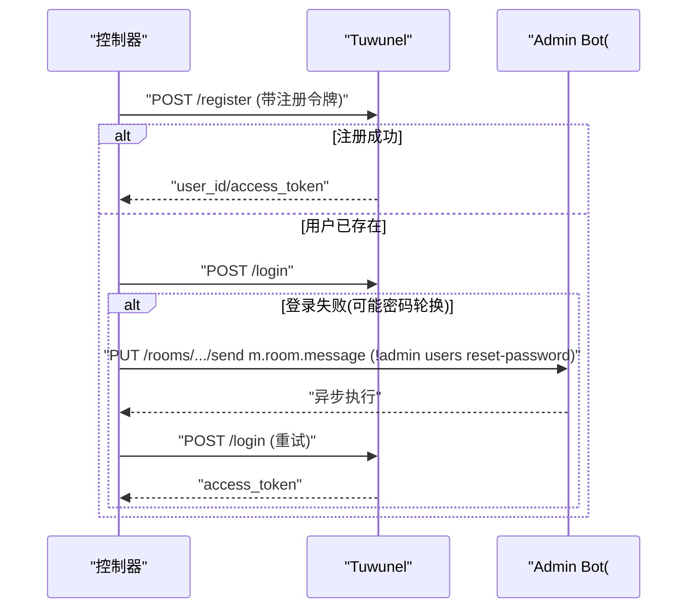
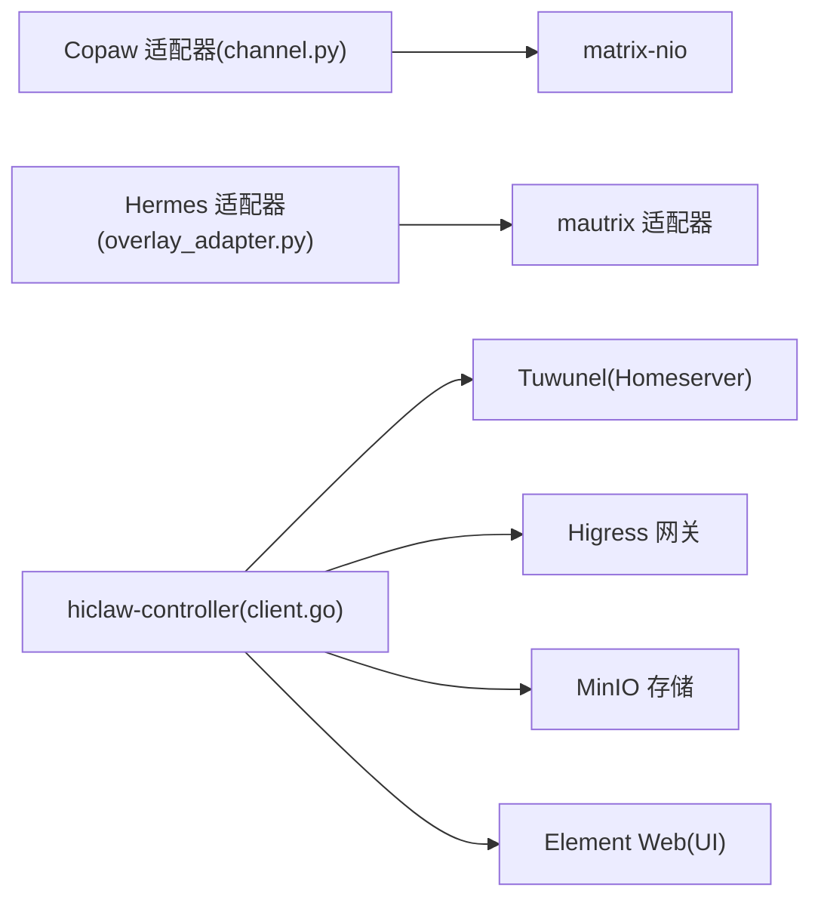

# Matrix 协议服务器

<cite>
**本文引用的文件**
- [copaw/src/matrix/README.md](file://copaw/src/matrix/README.md)
- [copaw/src/matrix/__init__.py](file://copaw/src/matrix/__init__.py)
- [copaw/src/matrix/channel.py](file://copaw/src/matrix/channel.py)
- [copaw/src/matrix/config.py](file://copaw/src/matrix/config.py)
- [hermes/src/hermes_matrix/adapter.py](file://hermes/src/hermes_matrix/adapter.py)
- [hermes/src/hermes_matrix/overlay_adapter.py](file://hermes/src/hermes_matrix/overlay_adapter.py)
- [hiclaw-controller/internal/matrix/client.go](file://hiclaw-controller/internal/matrix/client.go)
- [hiclaw-controller/internal/matrix/types.go](file://hiclaw-controller/internal/matrix/types.go)
- [hiclaw-controller/cmd/controller/main.go](file://hiclaw-controller/cmd/controller/main.go)
- [helm/hiclaw/values.yaml](file://helm/hiclaw/values.yaml)
- [helm/hiclaw/templates/matrix/tuwunel-statefulset.yaml](file://helm/hiclaw/templates/matrix/tuwunel-statefulset.yaml)
- [helm/hiclaw/templates/matrix/tuwunel-service.yaml](file://helm/hiclaw/templates/matrix/tuwunel-service.yaml)
</cite>

## 目录
1. [简介](#简介)
2. [项目结构](#项目结构)
3. [核心组件](#核心组件)
4. [架构总览](#架构总览)
5. [详细组件分析](#详细组件分析)
6. [依赖关系分析](#依赖关系分析)
7. [性能考虑](#性能考虑)
8. [故障排查指南](#故障排查指南)
9. [结论](#结论)
10. [附录](#附录)

## 简介
本文件面向使用 HiClaw 的团队，系统化阐述基于 Matrix 协议的服务器架构与部署方案，重点覆盖以下方面：
- 服务器架构：以 Tuwunel（conduwuit）作为 Matrix Homeserver，结合控制器（hiclaw-controller）实现房间生命周期管理、用户与权限治理、以及与 Worker/Manager 的集成。
- 房间管理：通过控制器在受控环境下创建/邀请/离开/删除房间，支持别名幂等与 E2EE 初始化。
- 用户认证机制：基于注册令牌与管理员凭据的自动化账户注册与登录；支持“孤儿恢复”路径应对密码轮换场景。
- 消息传递流程：文本、媒体、提及（@mention）与历史上下文缓冲；支持 DM 与群组房间的不同策略。
- 与 Worker/Manager 集成：控制器负责房间与成员管理，通道适配器负责消息编解码与策略注入。
- 安全配置与访问控制：允许列表/禁用策略、提及策略、E2EE、读回执与打字指示。
- 监控与维护：Helm 部署参数、健康检查、日志与可观测性建议。

## 项目结构
HiClaw 将 Matrix 服务器能力拆分为多个层面：
- 控制器层：hiclaw-controller 提供 CRD 与控制器逻辑，负责用户、房间、权限与生命周期管理。
- 传输适配层：copaw 与 hermes 的 Matrix 适配器，负责与 homeserver 的消息收发、提及增强、历史缓冲与媒体处理。
- 运行时层：Manager/Worker 通过通道适配器接入 Matrix，形成统一的消息编排入口。
- 基础设施层：Helm Chart 部署 Tuwunel（conduwuit）作为 Matrix Homeserver，并提供网关、存储与 UI 组件。

图表来源
- [hiclaw-controller/internal/matrix/client.go:16-87](file://hiclaw-controller/internal/matrix/client.go#L16-L87)
- [copaw/src/matrix/channel.py:216-255](file://copaw/src/matrix/channel.py#L216-L255)
- [hermes/src/hermes_matrix/overlay_adapter.py:94-132](file://hermes/src/hermes_matrix/overlay_adapter.py#L94-L132)
- [helm/hiclaw/templates/matrix/tuwunel-statefulset.yaml:25-82](file://helm/hiclaw/templates/matrix/tuwunel-statefulset.yaml#L25-L82)
- [helm/hiclaw/values.yaml:25-53](file://helm/hiclaw/values.yaml#L25-L53)

章节来源
- [helm/hiclaw/values.yaml:25-53](file://helm/hiclaw/values.yaml#L25-L53)
- [helm/hiclaw/templates/matrix/tuwunel-statefulset.yaml:1-106](file://helm/hiclaw/templates/matrix/tuwunel-statefulset.yaml#L1-L106)
- [helm/hiclaw/templates/matrix/tuwunel-service.yaml:1-21](file://helm/hiclaw/templates/matrix/tuwunel-service.yaml#L1-L21)

## 核心组件
- Matrix 传输适配器（Copaw）
  - 负责与 homeserver 同步、事件回调、提及解析、历史缓冲、媒体下载/上传、E2EE 维护、读回执与打字指示。
  - 支持配置化的允许列表/禁用策略、每房间提及策略、历史缓冲上限、Markdown 渲染、结构化提及（MSC3952）。
- Matrix 传输适配器（Hermes）
  - 在上游 mautrix 适配器基础上注入 HiClaw 策略：单独的 DM/群组允许列表、历史缓冲、图像降级（无视觉模型时）。
- 控制器（hiclaw-controller）
  - 提供 Matrix 客户端接口，封装注册、登录、房间创建/解析/删除、加入/离开、成员管理、管理员命令等。
  - 通过 Go 接口抽象，便于扩展到其他 homeserver 实现（如 Synapse）。
- Helm 部署
  - 部署 Tuwunel（conduwuit）StatefulSet 与 Service，暴露 Matrix 内部 API 端口；提供网关、存储与 UI 组件。

章节来源
- [copaw/src/matrix/channel.py:160-206](file://copaw/src/matrix/channel.py#L160-L206)
- [copaw/src/matrix/channel.py:216-255](file://copaw/src/matrix/channel.py#L216-L255)
- [hermes/src/hermes_matrix/overlay_adapter.py:94-132](file://hermes/src/hermes_matrix/overlay_adapter.py#L94-L132)
- [hiclaw-controller/internal/matrix/client.go:16-87](file://hiclaw-controller/internal/matrix/client.go#L16-L87)
- [hiclaw-controller/internal/matrix/types.go:5-13](file://hiclaw-controller/internal/matrix/types.go#L5-L13)

## 架构总览
下图展示从客户端到 homeserver，再到控制器与运行时的整体交互：

图表来源
- [hiclaw-controller/internal/matrix/client.go:131-225](file://hiclaw-controller/internal/matrix/client.go#L131-L225)
- [copaw/src/matrix/channel.py:414-476](file://copaw/src/matrix/channel.py#L414-L476)
- [hermes/src/hermes_matrix/overlay_adapter.py:103-132](file://hermes/src/hermes_matrix/overlay_adapter.py#L103-L132)
- [helm/hiclaw/templates/matrix/tuwunel-statefulset.yaml:25-82](file://helm/hiclaw/templates/matrix/tuwunel-statefulset.yaml#L25-L82)

## 详细组件分析

### Copaw Matrix 适配器（通道）
- 登录与同步
  - 支持 Token 与用户名/密码两种登录方式；自动加载 whoami 并设置 user_id/device_id。
  - 启动后注册事件回调（文本/媒体/E2EE），并启动长轮询同步循环；支持 catch-up/full-state 同步避免消息重放。
- 访问控制与提及
  - 支持 DM/群组允许列表与禁用策略；按房间配置 requireMention/autoReply。
  - 提供多种提及检测方式（m.mentions、matrix.to 链接、纯文本 MXID）；支持去除前缀以便识别斜杠命令。
- 历史缓冲与上下文
  - 对未被提及的群组消息进行缓冲，拼接到后续提及消息前，形成“当前消息前的聊天上下文”。
- 媒体处理
  - 下载 mxc:// 媒体；E2EE 场景下先解密再落盘；根据是否具备视觉能力决定图像是否上送模型。
- 打字指示与读回执
  - 自动发送读回执与打字指示，支持周期续期与最大持续时间。
- 发送策略
  - Markdown 渲染为 formatted_body；可附加结构化提及（MSC3952）与可见锚点链接。

图表来源
- [copaw/src/matrix/channel.py:1461-1584](file://copaw/src/matrix/channel.py#L1461-L1584)
- [copaw/src/matrix/channel.py:813-942](file://copaw/src/matrix/channel.py#L813-L942)

章节来源
- [copaw/src/matrix/channel.py:334-476](file://copaw/src/matrix/channel.py#L334-L476)
- [copaw/src/matrix/channel.py:1461-1584](file://copaw/src/matrix/channel.py#L1461-L1584)
- [copaw/src/matrix/channel.py:1600-1734](file://copaw/src/matrix/channel.py#L1600-L1734)
- [copaw/src/matrix/channel.py:1741-1838](file://copaw/src/matrix/channel.py#L1741-L1838)
- [copaw/src/matrix/channel.py:2036-2200](file://copaw/src/matrix/channel.py#L2036-L2200)

### Hermes Matrix 适配器（策略叠加）
- 在上游 mautrix 适配器之上，注入 HiClaw 策略：
  - 出站事件自动附加 MSC3952 结构化提及。
  - 分离 DM/群组允许列表，独立策略。
  - 群组未提及消息的历史缓冲，与 Copaw 行为一致。
  - 当激活模型不支持视觉时，将图片降级为文本描述。

图表来源
- [hermes/src/hermes_matrix/overlay_adapter.py:94-132](file://hermes/src/hermes_matrix/overlay_adapter.py#L94-L132)
- [hermes/src/hermes_matrix/overlay_adapter.py:134-177](file://hermes/src/hermes_matrix/overlay_adapter.py#L134-L177)
- [hermes/src/hermes_matrix/overlay_adapter.py:179-239](file://hermes/src/hermes_matrix/overlay_adapter.py#L179-L239)

章节来源
- [hermes/src/hermes_matrix/adapter.py:1-5](file://hermes/src/hermes_matrix/adapter.py#L1-L5)
- [hermes/src/hermes_matrix/overlay_adapter.py:94-132](file://hermes/src/hermes_matrix/overlay_adapter.py#L94-L132)
- [hermes/src/hermes_matrix/overlay_adapter.py:134-177](file://hermes/src/hermes_matrix/overlay_adapter.py#L134-L177)
- [hermes/src/hermes_matrix/overlay_adapter.py:179-239](file://hermes/src/hermes_matrix/overlay_adapter.py#L179-L239)

### 控制器（Matrix 客户端）
- 接口职责
  - 用户：注册/登录、密码轮换后的“孤儿恢复”。
  - 房间：创建/解析/删除别名、加入/离开、发送系统提示、管理员命令。
  - 成员：列出房间成员、邀请/踢出用户。
- 关键行为
  - EnsureUser：优先注册，失败则登录；若用户存在但登录失败，通过 AdminCommand 触发“重置密码”并重试。
  - CreateRoom：支持 preset/trusted_private_chat、初始加密、房间别名幂等。
  - AdminCommand：向“#admins:domain”房间发送“!admin ...”命令，异步执行。
  - ListRoomMembers：仅返回 join/invite 成员，过滤 leave/ban/knock。

图表来源
- [hiclaw-controller/internal/matrix/client.go:131-225](file://hiclaw-controller/internal/matrix/client.go#L131-L225)
- [hiclaw-controller/internal/matrix/client.go:492-508](file://hiclaw-controller/internal/matrix/client.go#L492-L508)

章节来源
- [hiclaw-controller/internal/matrix/client.go:16-87](file://hiclaw-controller/internal/matrix/client.go#L16-L87)
- [hiclaw-controller/internal/matrix/client.go:131-225](file://hiclaw-controller/internal/matrix/client.go#L131-L225)
- [hiclaw-controller/internal/matrix/client.go:254-332](file://hiclaw-controller/internal/matrix/client.go#L254-L332)
- [hiclaw-controller/internal/matrix/client.go:492-508](file://hiclaw-controller/internal/matrix/client.go#L492-L508)
- [hiclaw-controller/internal/matrix/types.go:5-13](file://hiclaw-controller/internal/matrix/types.go#L5-L13)

### 配置与部署要点
- Helm Values
  - Matrix provider: tuwunel/synapse；mode: managed/existing。
  - Tuwunel：镜像、副本数、资源、持久化、服务端口、注册令牌、服务器名等。
  - Gateway/provider: higress/ai-gateway；publicURL 必填。
  - Storage/provider: minio/oss；bucket 名称。
- Tuwunel StatefulSet/Service
  - 暴露 6167 端口；启用就绪/存活探针；支持持久化卷。
- Controller 入口
  - 通过 main.go 启动控制器，加载配置并运行。

章节来源
- [helm/hiclaw/values.yaml:25-53](file://helm/hiclaw/values.yaml#L25-L53)
- [helm/hiclaw/values.yaml:88-111](file://helm/hiclaw/values.yaml#L88-L111)
- [helm/hiclaw/templates/matrix/tuwunel-statefulset.yaml:25-82](file://helm/hiclaw/templates/matrix/tuwunel-statefulset.yaml#L25-L82)
- [helm/hiclaw/templates/matrix/tuwunel-service.yaml:15-19](file://helm/hiclaw/templates/matrix/tuwunel-service.yaml#L15-L19)
- [hiclaw-controller/cmd/controller/main.go:16-36](file://hiclaw-controller/cmd/controller/main.go#L16-L36)

## 依赖关系分析
- 适配器依赖
  - Copaw 适配器依赖 matrix-nio 进行同步与 E2EE；Hermes 适配器依赖上游 mautrix 适配器。
- 控制器依赖
  - 通过 Go 接口抽象，当前实现为 Tuwunel 客户端；可扩展为 Synapse 客户端。
- 部署依赖
  - Helm Chart 依赖 Higress 网关、MinIO 存储与 Element Web；Matrix 服务通过 StatefulSet/Service 提供。

图表来源
- [copaw/src/matrix/channel.py:23-41](file://copaw/src/matrix/channel.py#L23-L41)
- [hermes/src/hermes_matrix/overlay_adapter.py:22-29](file://hermes/src/hermes_matrix/overlay_adapter.py#L22-L29)
- [hiclaw-controller/internal/matrix/client.go:16-87](file://hiclaw-controller/internal/matrix/client.go#L16-L87)
- [helm/hiclaw/templates/matrix/tuwunel-statefulset.yaml:25-82](file://helm/hiclaw/templates/matrix/tuwunel-statefulset.yaml#L25-L82)

章节来源
- [copaw/src/matrix/channel.py:23-41](file://copaw/src/matrix/channel.py#L23-L41)
- [hermes/src/hermes_matrix/overlay_adapter.py:22-29](file://hermes/src/hermes_matrix/overlay_adapter.py#L22-L29)
- [hiclaw-controller/internal/matrix/client.go:16-87](file://hiclaw-controller/internal/matrix/client.go#L16-L87)

## 性能考虑
- 同步与超时
  - 同步轮询超时应大于 HTTP 请求超时，避免连接提前断开；控制器中已确保请求超时 > 同步超时。
- 缓存与持久化
  - 同步 token 持久化于工作目录，重启后快速恢复增量同步；Tuwunel StatefulSet 支持持久化存储，降低 RocksDB 抖动风险。
- 媒体处理
  - 媒体下载采用共享异步 HTTP 客户端；E2EE 下载需解密后再写盘，注意磁盘 IO 与内存占用。
- 打字指示
  - 定期续期与最大持续时间限制，避免过度请求。

章节来源
- [copaw/src/matrix/channel.py:316-333](file://copaw/src/matrix/channel.py#L316-L333)
- [copaw/src/matrix/channel.py:1759-1838](file://copaw/src/matrix/channel.py#L1759-L1838)
- [helm/hiclaw/templates/matrix/tuwunel-statefulset.yaml:54-66](file://helm/hiclaw/templates/matrix/tuwunel-statefulset.yaml#L54-L66)

## 故障排查指南
- 登录失败/孤儿恢复
  - 现象：注册成功但登录失败（可能密码轮换）。
  - 处理：控制器会尝试通过 AdminCommand 触发“重置密码”，随后重试登录；确认 AdminBot 已就绪。
- 别名冲突
  - 现象：创建房间时报错 M_ROOM_IN_USE。
  - 处理：控制器会解析别名并返回现有房间 ID，避免重复创建。
- 成员状态异常
  - 现象：ListRoomMembers 返回空或错误。
  - 处理：确认管理员 Token 有效；检查房间成员状态过滤逻辑（仅 join/invite）。
- 媒体不可用
  - 现象：下载 mxc:// 失败或解密失败。
  - 处理：检查 homeserver 媒体仓库可达性、访问令牌、以及 E2EE 密钥状态。
- UI 无法访问
  - 现象：Element Web 无法连接。
  - 处理：确认 Higress 公网 URL、证书与路由配置；检查网关与服务连通性。

章节来源
- [hiclaw-controller/internal/matrix/client.go:194-224](file://hiclaw-controller/internal/matrix/client.go#L194-L224)
- [hiclaw-controller/internal/matrix/client.go:313-331](file://hiclaw-controller/internal/matrix/client.go#L313-L331)
- [hiclaw-controller/internal/matrix/client.go:510-552](file://hiclaw-controller/internal/matrix/client.go#L510-L552)
- [copaw/src/matrix/channel.py:1038-1069](file://copaw/src/matrix/channel.py#L1038-L1069)
- [copaw/src/matrix/channel.py:1078-1128](file://copaw/src/matrix/channel.py#L1078-L1128)

## 结论
HiClaw 的 Matrix 服务器方案以 Tuwunel 为核心，结合控制器与适配器实现了：
- 可靠的房间与用户生命周期管理；
- 策略化的消息处理（提及、历史缓冲、媒体降级）；
- 易于扩展的接口设计（控制器接口、Helm Chart）；
- 与 Worker/Manager 的无缝集成。

通过合理的部署参数与安全策略配置，可在本地或云环境中稳定运行，并具备良好的可观测性与可维护性。

## 附录
- 配置参考
  - Copaw Matrix 通道配置项：启用/禁用、homeserver、访问令牌、加密开关、允许列表、历史缓冲上限、同步超时、提及策略等。
  - Helm Values：Matrix provider/mode、Tuwunel 镜像/资源/持久化、网关/存储/provider、Manager/Worker 默认镜像与资源等。
- 建议
  - 生产环境开启 E2EE 并配置稳定的持久化存储；
  - 使用管理员命令进行批量房间清理与成员管理；
  - 为 UI 配置公网访问 URL 与证书，确保 Element Web 可用。

章节来源
- [copaw/src/matrix/README.md:53-78](file://copaw/src/matrix/README.md#L53-L78)
- [copaw/src/matrix/config.py:160-184](file://copaw/src/matrix/config.py#L160-L184)
- [helm/hiclaw/values.yaml:25-53](file://helm/hiclaw/values.yaml#L25-L53)
- [helm/hiclaw/values.yaml:167-263](file://helm/hiclaw/values.yaml#L167-L263)