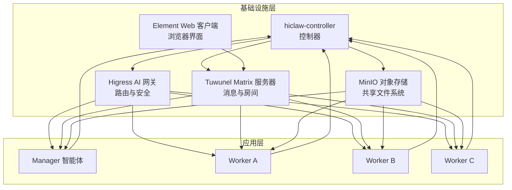
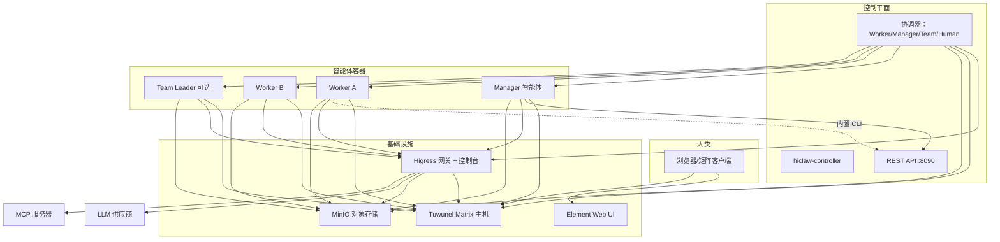
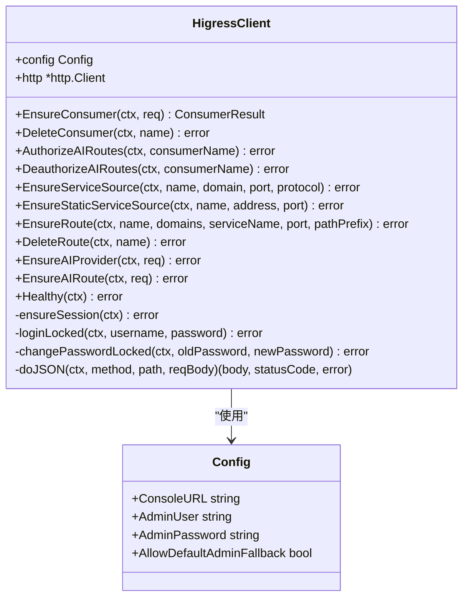
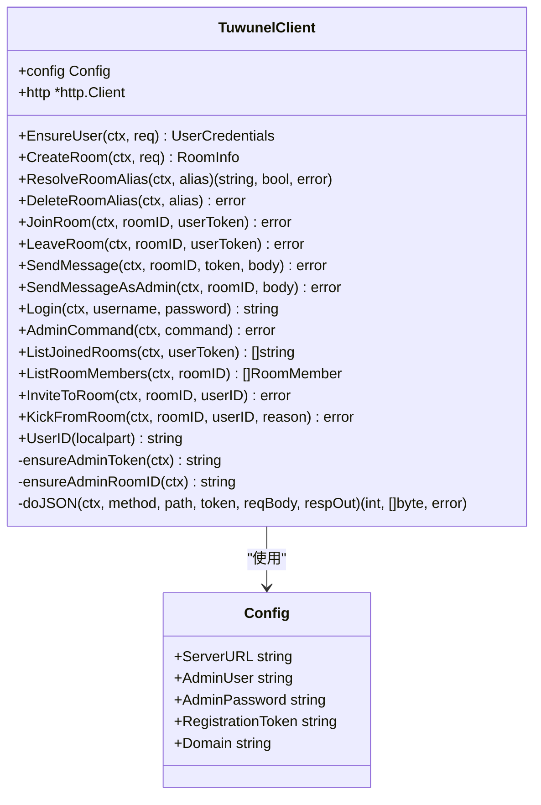
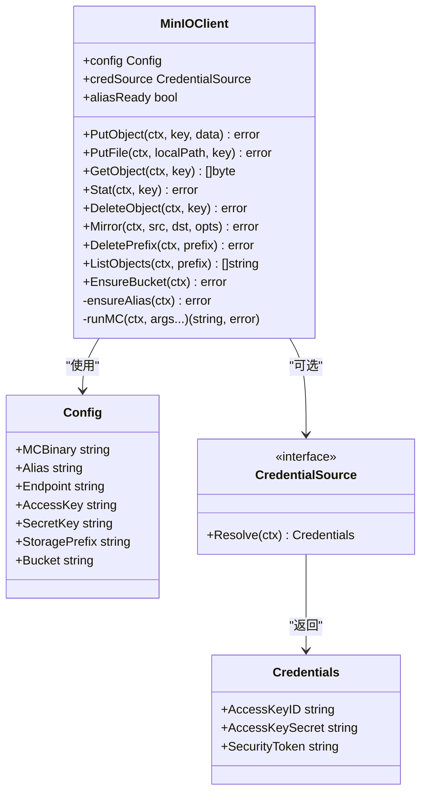
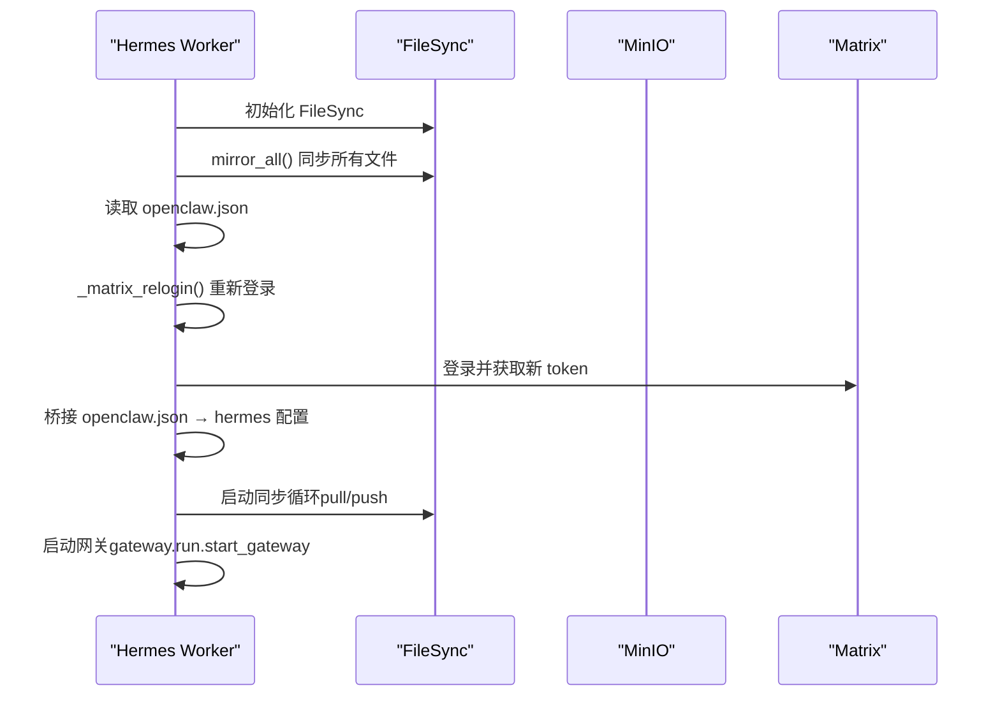
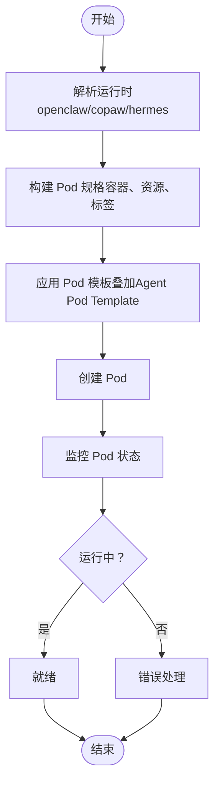
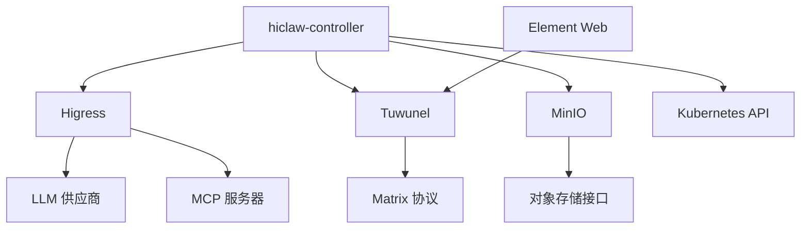
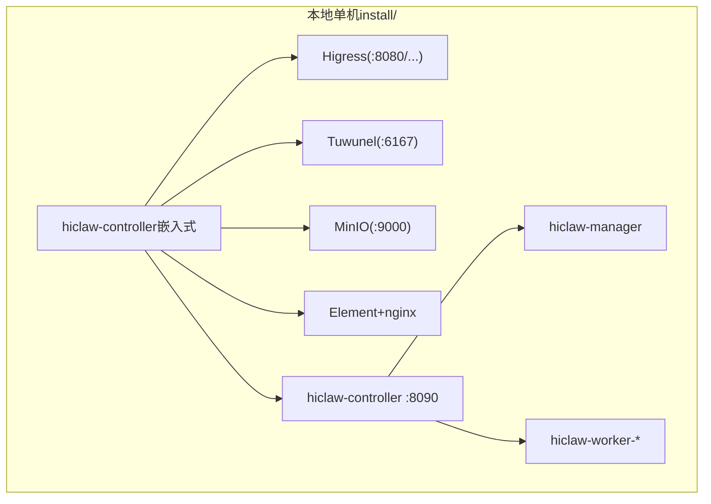
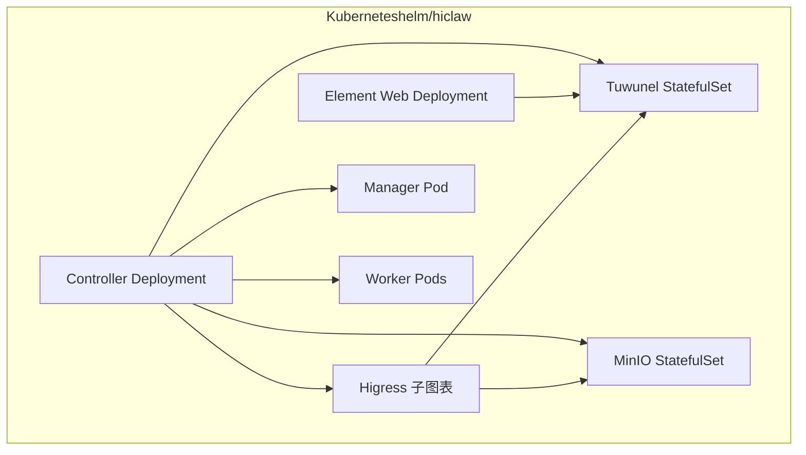

# 基础设施层架构

<cite>
**本文档引用的文件**
- [README.md](file://README.md)
- [docs/architecture.md](file://docs/architecture.md)
- [hiclaw-controller/internal/gateway/higress.go](file://hiclaw-controller/internal/gateway/higress.go)
- [hiclaw-controller/internal/matrix/client.go](file://hiclaw-controller/internal/matrix/client.go)
- [hiclaw-controller/internal/oss/minio.go](file://hiclaw-controller/internal/oss/minio.go)
- [hermes/src/hermes_worker/worker.py](file://hermes/src/hermes_worker/worker.py)
- [helm/hiclaw/values.yaml](file://helm/hiclaw/values.yaml)
- [hiclaw-controller/internal/controller/manager_controller.go](file://hiclaw-controller/internal/controller/manager_controller.go)
- [hiclaw-controller/internal/controller/worker_controller.go](file://hiclaw-controller/internal/controller/worker_controller.go)
- [hiclaw-controller/internal/initializer/initializer.go](file://hiclaw-controller/internal/initializer/initializer.go)
- [hiclaw-controller/internal/backend/kubernetes.go](file://hiclaw-controller/internal/backend/kubernetes.go)
- [hiclaw-controller/internal/service/provisioner.go](file://hiclaw-controller/internal/service/provisioner.go)
- [hiclaw-controller/internal/service/deployer.go](file://hiclaw-controller/internal/service/deployer.go)
- [helm/hiclaw/templates/matrix/tuwunel-statefulset.yaml](file://helm/hiclaw/templates/matrix/tuwunel-statefulset.yaml)
- [helm/hiclaw/templates/storage/minio-statefulset.yaml](file://helm/hiclaw/templates/storage/minio-statefulset.yaml)
- [copaw/src/matrix/channel.py](file://copaw/src/matrix/channel.py)
- [hermes/src/hermes_matrix/adapter.py](file://hermes/src/hermes_matrix/adapter.py)
- [hiclaw-controller/internal/oss/types.go](file://hiclaw-controller/internal/oss/types.go)
</cite>

## 目录
1. [引言](#引言)
2. [项目结构](#项目结构)
3. [核心组件](#核心组件)
4. [架构总览](#架构总览)
5. [详细组件分析](#详细组件分析)
6. [依赖关系分析](#依赖关系分析)
7. [性能考虑](#性能考虑)
8. [故障排除指南](#故障排除指南)
9. [结论](#结论)
10. [附录](#附录)

## 引言

HiClaw 是一个开源的多智能体协作运行时平台，采用 Manager-Workers 架构，通过 Kubernetes 控制平面实现多智能体的编排与协作。基础设施层是整个系统的核心，负责路由管理、负载均衡、认证授权、消息传递、对象存储等关键能力。

本架构文档聚焦于基础设施层的设计与实现，深入解释 Higress AI 网关的路由管理与安全控制、Tuwunel Matrix 服务器的部署与配置、MinIO 对象存储的架构与优化策略，并阐述 Element Web 界面的集成方式与用户体验设计。同时，文档将展示各组件间的依赖关系与通信协议，并提供部署拓扑图与组件交互关系图。

## 项目结构

HiClaw 的基础设施层主要由以下几部分组成：

- **hiclaw-controller**：Kubernetes 控制器，负责资源协调、生命周期管理、网关消费者设置、凭证流等。
- **Higress AI 网关**：统一的流量入口，提供 LLM 路由、MCP 服务器托管、凭证管理与安全控制。
- **Tuwunel Matrix 服务器**：自托管的即时通讯服务器，支持端到端加密、房间管理与用户认证。
- **MinIO 对象存储**：共享文件系统，用于 Worker 工作空间与任务树的持久化存储。
- **Element Web 客户端**：零配置的浏览器客户端，提供简洁的用户体验。
- **Helm Charts**：Kubernetes 部署模板，定义了各组件的资源配置与依赖关系。

**图表来源**
- [docs/architecture.md](file://docs/architecture.md)
- [hiclaw-controller/internal/gateway/higress.go](file://hiclaw-controller/internal/gateway/higress.go)
- [hiclaw-controller/internal/matrix/client.go](file://hiclaw-controller/internal/matrix/client.go)
- [hiclaw-controller/internal/oss/minio.go](file://hiclaw-controller/internal/oss/minio.go)

**章节来源**
- [README.md](file://README.md)
- [docs/architecture.md](file://docs/architecture.md)

## 核心组件

### Higress AI 网关

Higress 作为统一的 AI 网关，承担以下职责：
- **路由管理**：为 LLM API、MCP 服务器与内部服务建立路由规则，支持基于路径前缀的匹配与上游提供者绑定。
- **负载均衡**：通过服务源（Service Sources）与路由配置实现流量分发。
- **认证授权**：基于消费者密钥（key-auth）进行身份验证，确保每个 Manager/Worker 只能访问其授权的资源。
- **控制台管理**：提供会话 Cookie 认证的控制台，用于路由与消费者的集中管理。

关键实现要点：
- 使用 Higress Console API 进行会话登录与状态维护，支持默认管理员密码回退与收敛。
- 提供消费者（Consumer）的创建、删除与授权/去授权操作，确保路由级别的访问控制。
- 支持 AI Provider 的注册与 AI Route 的骨架创建，避免在初始化过程中覆盖授权状态。

**章节来源**
- [hiclaw-controller/internal/gateway/higress.go](file://hiclaw-controller/internal/gateway/higress.go)

### Tuwunel Matrix 服务器

Tuwunel 是基于 conduwuit 的 Matrix 服务器，提供：
- **用户注册与登录**：支持注册令牌与密码登录，具备孤儿账户恢复机制。
- **房间管理**：支持私有聊天室、直接消息（DM）、权限级别（power levels）与成员邀请/踢出。
- **消息传递**：支持明文与端到端加密（E2EE），通过 m.mentions 实现智能体间的消息路由。
- **管理员命令**：通过 Admin Bot 房间执行管理命令，如删除房间、重置密码等。

关键实现要点：
- 通过 EnsureUser 注册用户，支持孤儿恢复（orphan recovery）以处理用户被软删除或密码轮换的情况。
- CreateRoom 支持别名（alias）以保证幂等性，避免并发重建导致的重复房间。
- JoinRoom/LeaveRoom/KickFromRoom 等操作均具备幂等性与错误处理，确保房间状态一致性。

**章节来源**
- [hiclaw-controller/internal/matrix/client.go](file://hiclaw-controller/internal/matrix/client.go)

### MinIO 对象存储

MinIO 作为共享文件系统，为所有智能体提供：
- **工作空间存储**：agents/<name>/... 用于 Worker 的工作空间镜像与同步。
- **共享任务树**：shared/tasks/... 用于跨智能体的任务共享。
- **管理器路径**：manager/... 用于管理器相关配置与数据。
- **技能与配置**：skills/ 与 config/ 的同步，确保智能体配置的一致性。

关键实现要点：
- 通过 mc CLI 封装 MinIO 客户端，支持静态与动态凭据模式（STS）。
- 提供 PutObject/PutFile/GetObject/Stat/DeleteObject/Mirror/ListObjects/DeletePrefix 等操作。
- 支持策略请求（PolicyRequest）以生成针对 Worker 的访问策略，包含团队与管理器的额外访问权限。

**章节来源**
- [hiclaw-controller/internal/oss/minio.go](file://hiclaw-controller/internal/oss/minio.go)
- [hiclaw-controller/internal/oss/types.go](file://hiclaw-controller/internal/oss/types.go)

### Element Web 界面

Element Web 提供零配置的浏览器客户端体验：
- **零配置接入**：无需外部服务或机器人应用，直接通过浏览器访问。
- **矩阵协议兼容**：与 Tuwunel Matrix 服务器完全兼容，支持端到端加密与消息历史。
- **移动端支持**：可使用任意 Matrix 客户端（如 Element、FluffyChat）连接。

**章节来源**
- [docs/architecture.md](file://docs/architecture.md)

## 架构总览

基础设施层采用多容器与多组件协同的架构设计，控制器负责资源协调与生命周期管理，网关负责流量与安全，Matrix 服务器负责消息与房间，对象存储负责共享数据，客户端提供用户体验。

**图表来源**
- [docs/architecture.md](file://docs/architecture.md)

## 详细组件分析

### Higress 网关组件分析

Higress 网关通过 HigressClient 实现对 Console API 的调用，包括会话登录、消费者管理、AI 路由与服务源的创建与删除。

**图表来源**
- [hiclaw-controller/internal/gateway/higress.go](file://hiclaw-controller/internal/gateway/higress.go)

**章节来源**
- [hiclaw-controller/internal/gateway/higress.go](file://hiclaw-controller/internal/gateway/higress.go)

### Matrix 组件分析

Matrix 客户端通过 TuwunelClient 实现用户注册、房间创建、消息发送与成员管理等功能。

**图表来源**
- [hiclaw-controller/internal/matrix/client.go](file://hiclaw-controller/internal/matrix/client.go)

**章节来源**
- [hiclaw-controller/internal/matrix/client.go](file://hiclaw-controller/internal/matrix/client.go)

### MinIO 组件分析

MinIO 客户端通过 MinIOClient 实现对象存储的读写与同步操作。

**图表来源**
- [hiclaw-controller/internal/oss/minio.go](file://hiclaw-controller/internal/oss/minio.go)
- [hiclaw-controller/internal/oss/types.go](file://hiclaw-controller/internal/oss/types.go)

**章节来源**
- [hiclaw-controller/internal/oss/minio.go](file://hiclaw-controller/internal/oss/minio.go)
- [hiclaw-controller/internal/oss/types.go](file://hiclaw-controller/internal/oss/types.go)

### 智能体文件同步与启动流程

Hermes Worker 通过 FileSync 与 mc 客户端实现与 MinIO 的双向同步，并在启动时进行 Matrix 重新登录以保持 E2EE 的设备标识一致。

**图表来源**
- [hermes/src/hermes_worker/worker.py](file://hermes/src/hermes_worker/worker.py)

**章节来源**
- [hermes/src/hermes_worker/worker.py](file://hermes/src/hermes_worker/worker.py)

### Kubernetes 部署与资源管理

hiclaw-controller 通过 Kubernetes Backend 在集群中创建与管理 Worker Pod，并注入服务账号令牌与环境变量。

**图表来源**
- [hiclaw-controller/internal/backend/kubernetes.go](file://hiclaw-controller/internal/backend/kubernetes.go)

**章节来源**
- [hiclaw-controller/internal/backend/kubernetes.go](file://hiclaw-controller/internal/backend/kubernetes.go)

## 依赖关系分析

基础设施层组件之间的依赖关系如下：

- **hiclaw-controller** 依赖 Higress、Tuwunel、MinIO 与 Kubernetes API，负责资源协调与生命周期管理。
- **Higress** 依赖 LLM 供应商与 MCP 服务器，通过 Console API 进行路由与消费者管理。
- **Tuwunel** 依赖 Matrix 协议，提供用户、房间与消息服务。
- **MinIO** 依赖对象存储接口，提供文件上传、下载与同步。
- **Element Web** 依赖 Matrix 服务器，提供浏览器客户端访问。

**图表来源**
- [hiclaw-controller/internal/gateway/higress.go](file://hiclaw-controller/internal/gateway/higress.go)
- [hiclaw-controller/internal/matrix/client.go](file://hiclaw-controller/internal/matrix/client.go)
- [hiclaw-controller/internal/oss/minio.go](file://hiclaw-controller/internal/oss/minio.go)

**章节来源**
- [hiclaw-controller/internal/gateway/higress.go](file://hiclaw-controller/internal/gateway/higress.go)
- [hiclaw-controller/internal/matrix/client.go](file://hiclaw-controller/internal/matrix/client.go)
- [hiclaw-controller/internal/oss/minio.go](file://hiclaw-controller/internal/oss/minio.go)

## 性能考虑

- **Higress 路由与消费者缓存**：通过会话 Cookie 缓存与消费者授权状态的幂等性，减少重复认证与路由更新开销。
- **MinIO 同步策略**：通过 mc mirror 的覆盖与排除策略，避免不必要的文件传输；合理设置存储前缀与桶命名，提升查询效率。
- **Matrix 同步优化**：通过持久化的 next_batch token 与增量同步，减少消息重放与回调处理开销；E2EE 维护在同步间隔内完成，降低握手频率。
- **Kubernetes 资源限制**：通过默认资源限制与模板叠加，确保 Worker Pod 的资源隔离与稳定性。

## 故障排除指南

常见问题与排查步骤：
- **Higress 登录失败**：检查 Console URL 与管理员凭据，确认会话 Cookie 是否正确缓存；若使用默认管理员凭据，确认密码收敛流程是否成功。
- **MinIO 同步异常**：检查 mc 命令执行结果与错误信息，确认凭据模式（静态/动态）与端点配置；验证存储前缀与桶权限。
- **Matrix 房间创建冲突**：确认房间别名是否已被占用，使用 ResolveRoomAlias 获取现有 RoomID；检查幂等性逻辑与并发重建场景。
- **Element Web 无法访问**：确认网关路由与 Element Web 服务源配置，检查域名解析与证书配置；验证浏览器网络与代理设置。

**章节来源**
- [hiclaw-controller/internal/gateway/higress.go](file://hiclaw-controller/internal/gateway/higress.go)
- [hiclaw-controller/internal/oss/minio.go](file://hiclaw-controller/internal/oss/minio.go)
- [hiclaw-controller/internal/matrix/client.go](file://hiclaw-controller/internal/matrix/client.go)

## 结论

HiClaw 的基础设施层通过清晰的组件划分与严格的依赖管理，实现了从路由、认证、消息到存储的全栈能力。Higress 网关提供统一的安全与路由入口，Tuwunel Matrix 服务器保障消息与房间的可靠性，MinIO 对象存储支撑智能体的工作空间与共享数据，Element Web 则提供了简洁的用户体验。通过控制器的资源协调与生命周期管理，系统在 Kubernetes 环境中实现了高可用与可扩展的多智能体协作平台。

## 附录

### 部署拓扑图

**图表来源**
- [docs/architecture.md](file://docs/architecture.md)

### Kubernetes 部署拓扑图

**图表来源**
- [helm/hiclaw/values.yaml](file://helm/hiclaw/values.yaml)
- [helm/hiclaw/templates/matrix/tuwunel-statefulset.yaml](file://helm/hiclaw/templates/matrix/tuwunel-statefulset.yaml)
- [helm/hiclaw/templates/storage/minio-statefulset.yaml](file://helm/hiclaw/templates/storage/minio-statefulset.yaml)