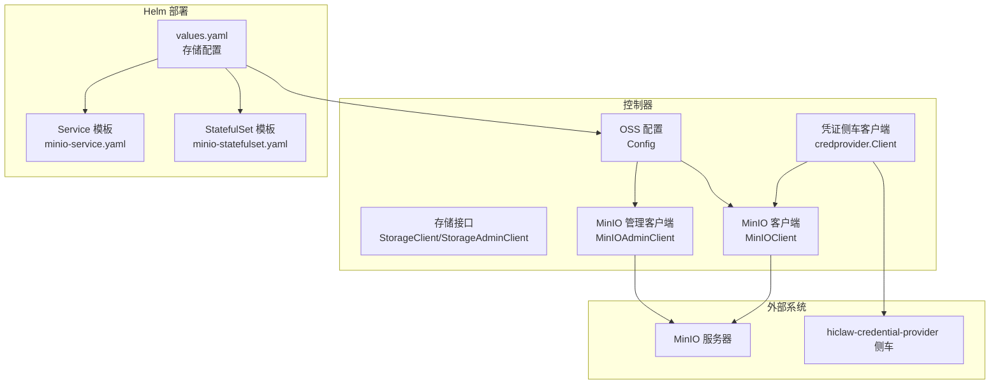
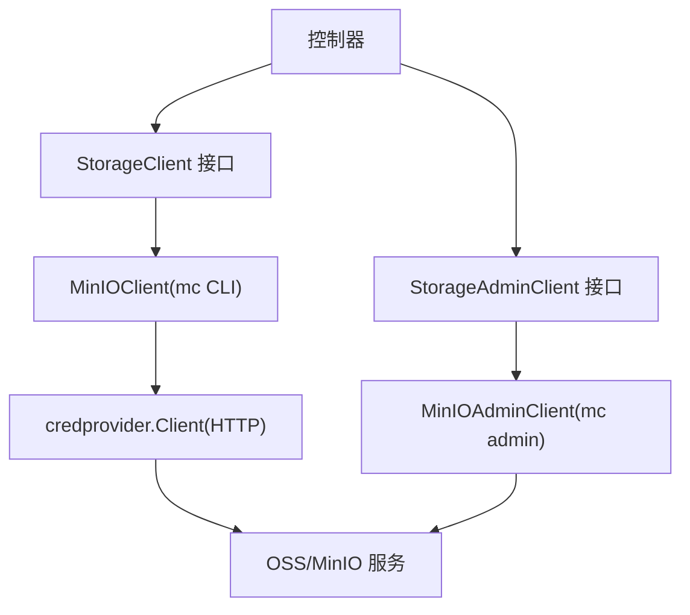
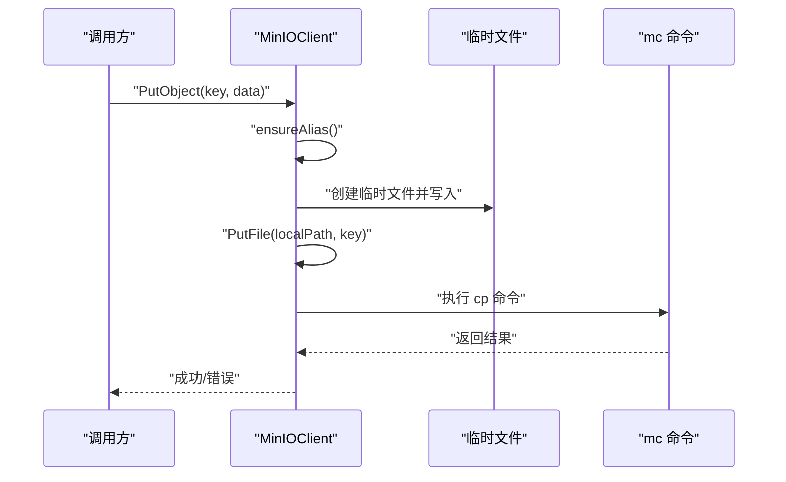
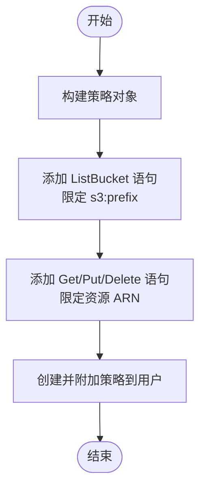
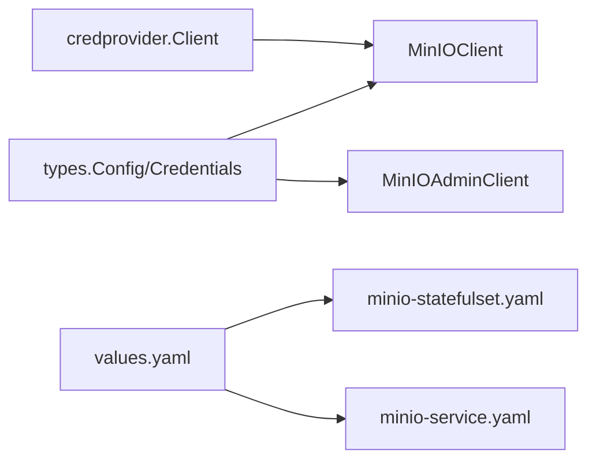

# 对象存储系统

<cite>
**本文引用的文件**
- [hiclaw-controller/internal/oss/client.go](file://hiclaw-controller/internal/oss/client.go)
- [hiclaw-controller/internal/oss/types.go](file://hiclaw-controller/internal/oss/types.go)
- [hiclaw-controller/internal/oss/minio.go](file://hiclaw-controller/internal/oss/minio.go)
- [hiclaw-controller/internal/oss/minio_admin.go](file://hiclaw-controller/internal/oss/minio_admin.go)
- [hiclaw-controller/internal/credprovider/client.go](file://hiclaw-controller/internal/credprovider/client.go)
- [hiclaw-controller/internal/credprovider/types.go](file://hiclaw-controller/internal/credprovider/types.go)
- [helm/hiclaw/values.yaml](file://helm/hiclaw/values.yaml)
- [helm/hiclaw/templates/storage/minio-statefulset.yaml](file://helm/hiclaw/templates/storage/minio-statefulset.yaml)
- [helm/hiclaw/templates/storage/minio-service.yaml](file://helm/hiclaw/templates/storage/minio-service.yaml)
</cite>

## 目录
1. [简介](#简介)
2. [项目结构](#项目结构)
3. [核心组件](#核心组件)
4. [架构总览](#架构总览)
5. [详细组件分析](#详细组件分析)
6. [依赖分析](#依赖分析)
7. [性能考虑](#性能考虑)
8. [故障排查指南](#故障排查指南)
9. [结论](#结论)
10. [附录](#附录)

## 简介
本文件面向对象存储子系统，聚焦于基于 MinIO 的对象存储架构与实现细节，涵盖数据分布与副本策略、一致性模型、存储桶管理、访问控制与策略生成、生命周期管理（通过镜像同步与前缀删除）、以及与 Worker 和 Manager 的数据交换机制（上传/下载、版本化能力、缓存策略）。同时给出高可用与灾难恢复建议、性能优化与容量规划指南，并提供可操作的配置示例与运维最佳实践。

## 项目结构
对象存储相关代码主要分布在控制器内部的 OSS 抽象层与凭证侧车（Credential Provider）之间，配合 Helm Chart 提供本地 MinIO 部署与服务暴露。整体结构如下：

图示来源
- [hiclaw-controller/internal/oss/client.go:1-55](file://hiclaw-controller/internal/oss/client.go#L1-L55)
- [hiclaw-controller/internal/oss/types.go:5-14](file://hiclaw-controller/internal/oss/types.go#L5-L14)
- [hiclaw-controller/internal/oss/minio.go:31-40](file://hiclaw-controller/internal/oss/minio.go#L31-L40)
- [hiclaw-controller/internal/oss/minio_admin.go:20-29](file://hiclaw-controller/internal/oss/minio_admin.go#L20-L29)
- [hiclaw-controller/internal/credprovider/client.go:23-41](file://hiclaw-controller/internal/credprovider/client.go#L23-L41)
- [helm/hiclaw/values.yaml:72-111](file://helm/hiclaw/values.yaml#L72-L111)
- [helm/hiclaw/templates/storage/minio-statefulset.yaml:1-79](file://helm/hiclaw/templates/storage/minio-statefulset.yaml#L1-L79)
- [helm/hiclaw/templates/storage/minio-service.yaml:1-25](file://helm/hiclaw/templates/storage/minio-service.yaml#L1-L25)

章节来源
- [hiclaw-controller/internal/oss/client.go:1-55](file://hiclaw-controller/internal/oss/client.go#L1-L55)
- [hiclaw-controller/internal/oss/types.go:5-14](file://hiclaw-controller/internal/oss/types.go#L5-L14)
- [hiclaw-controller/internal/oss/minio.go:31-40](file://hiclaw-controller/internal/oss/minio.go#L31-L40)
- [hiclaw-controller/internal/oss/minio_admin.go:20-29](file://hiclaw-controller/internal/oss/minio_admin.go#L20-L29)
- [hiclaw-controller/internal/credprovider/client.go:23-41](file://hiclaw-controller/internal/credprovider/client.go#L23-L41)
- [helm/hiclaw/values.yaml:72-111](file://helm/hiclaw/values.yaml#L72-L111)
- [helm/hiclaw/templates/storage/minio-statefulset.yaml:1-79](file://helm/hiclaw/templates/storage/minio-statefulset.yaml#L1-L79)
- [helm/hiclaw/templates/storage/minio-service.yaml:1-25](file://helm/hiclaw/templates/storage/minio-service.yaml#L1-L25)

## 核心组件
- 存储接口与抽象
  - StorageClient：统一的对象存储操作接口，支持写入、读取、统计、删除、镜像同步、列举、按前缀删除等。
  - StorageAdminClient：在嵌入式 MinIO 场景下提供用户与策略管理能力。
- MinIO 客户端
  - 基于 mc CLI 的封装，支持静态与动态凭据模式；自动处理别名设置、路径前缀拼接、错误映射等。
- MinIO 管理客户端
  - 使用 mc admin 管理用户与策略，按 Worker/团队/管理角色生成最小权限策略。
- 凭证侧车客户端
  - 向 hiclaw-credential-provider 侧车请求短期 STS 三元组，用于外部 OSS 或嵌入式 MinIO 的动态凭据注入。
- Helm 部署
  - 提供本地 MinIO 的 StatefulSet 与 Service 模板，支持持久化卷、探针与端口配置。

章节来源
- [hiclaw-controller/internal/oss/client.go:5-39](file://hiclaw-controller/internal/oss/client.go#L5-L39)
- [hiclaw-controller/internal/oss/minio.go:13-50](file://hiclaw-controller/internal/oss/minio.go#L13-L50)
- [hiclaw-controller/internal/oss/minio_admin.go:13-29](file://hiclaw-controller/internal/oss/minio_admin.go#L13-L29)
- [hiclaw-controller/internal/credprovider/client.go:15-41](file://hiclaw-controller/internal/credprovider/client.go#L15-L41)
- [helm/hiclaw/templates/storage/minio-statefulset.yaml:25-59](file://helm/hiclaw/templates/storage/minio-statefulset.yaml#L25-L59)
- [helm/hiclaw/templates/storage/minio-service.yaml:15-23](file://helm/hiclaw/templates/storage/minio-service.yaml#L15-L23)

## 架构总览
对象存储系统围绕“控制器 + MinIO/外部 OSS + 凭证侧车”的组合展开。控制器通过 StorageClient 接口与对象存储交互；当使用嵌入式 MinIO 时，通过 StorageAdminClient 进行用户与策略管理；当使用外部 OSS 时，控制器通过凭据侧车获取短期 STS 三元组，以环境变量形式注入 mc 调用，避免长期凭据落地。

图示来源
- [hiclaw-controller/internal/oss/client.go:5-54](file://hiclaw-controller/internal/oss/client.go#L5-L54)
- [hiclaw-controller/internal/oss/minio.go:203-226](file://hiclaw-controller/internal/oss/minio.go#L203-L226)
- [hiclaw-controller/internal/oss/minio_admin.go:178-190](file://hiclaw-controller/internal/oss/minio_admin.go#L178-L190)
- [hiclaw-controller/internal/credprovider/client.go:43-84](file://hiclaw-controller/internal/credprovider/client.go#L43-L84)

## 详细组件分析

### 组件一：存储接口与数据路径
- 设计要点
  - 统一的接口屏蔽底层差异（嵌入式 MinIO vs 外部 OSS）。
  - 路径前缀由配置决定，所有远程操作均自动拼接存储前缀，确保隔离性与可移植性。
  - 错误处理对“对象不存在”进行标准化映射，便于上层逻辑判断。
- 关键流程（PutObject）

图示来源
- [hiclaw-controller/internal/oss/minio.go:73-98](file://hiclaw-controller/internal/oss/minio.go#L73-L98)
- [hiclaw-controller/internal/oss/minio.go:203-226](file://hiclaw-controller/internal/oss/minio.go#L203-L226)

章节来源
- [hiclaw-controller/internal/oss/client.go:5-39](file://hiclaw-controller/internal/oss/client.go#L5-L39)
- [hiclaw-controller/internal/oss/minio.go:69-98](file://hiclaw-controller/internal/oss/minio.go#L69-L98)
- [hiclaw-controller/internal/oss/minio.go:203-226](file://hiclaw-controller/internal/oss/minio.go#L203-L226)

### 组件二：访问控制与策略生成
- 策略生成规则
  - 列举权限限定在 agents/{worker}、shared、teams/{team}（可选）、manager（可选）等前缀。
  - 读写权限限定在对应资源路径，确保最小权限。
  - 支持为 Manager 角色附加 manager 前缀的读写权限。
- 动态凭据注入
  - 在外部 OSS 模式下，每次 mc 调用前从凭据侧车解析当前 STS 三元组，并以环境变量形式注入，避免持久化凭据。
- 关键流程（策略生成）

图示来源
- [hiclaw-controller/internal/oss/minio_admin.go:124-176](file://hiclaw-controller/internal/oss/minio_admin.go#L124-L176)

章节来源
- [hiclaw-controller/internal/oss/minio_admin.go:57-94](file://hiclaw-controller/internal/oss/minio_admin.go#L57-L94)
- [hiclaw-controller/internal/oss/minio_admin.go:124-176](file://hiclaw-controller/internal/oss/minio_admin.go#L124-L176)
- [hiclaw-controller/internal/credprovider/client.go:43-84](file://hiclaw-controller/internal/credprovider/client.go#L43-L84)

### 组件三：与 Worker 和 Manager 的数据交换
- 数据交换范围
  - Worker：读写自身 agents/{worker}/... 与 shared/*，可选读写 teams/{team}/...（当属于团队时）。
  - Manager：除上述外，还可读写 manager/*，用于工作区同步。
- 生命周期管理
  - 通过镜像同步（Mirror）实现目录级复制，支持覆盖与排除模式。
  - 通过按前缀删除（DeletePrefix）清理历史或过期内容。
- 版本管理
  - 当前实现未显式启用版本化；如需版本控制，应在部署的 MinIO/外部 OSS 上开启桶版本化并在上层业务中协调。
- 缓存策略
  - 控制器侧未内置对象缓存；建议在 Worker 侧对热点文件做本地缓存，并结合镜像同步的覆盖策略减少重复传输。

章节来源
- [hiclaw-controller/internal/oss/minio_admin.go:124-176](file://hiclaw-controller/internal/oss/minio_admin.go#L124-L176)
- [hiclaw-controller/internal/oss/minio.go:138-159](file://hiclaw-controller/internal/oss/minio.go#L138-L159)
- [hiclaw-controller/internal/oss/minio.go:161-167](file://hiclaw-controller/internal/oss/minio.go#L161-L167)

### 组件四：嵌入式 MinIO 部署与服务暴露
- 部署形态
  - 使用 StatefulSet 单副本运行，支持持久化卷与就绪/存活探针。
  - 通过 Service 暴露 API 与控制台端口。
- 配置要点
  - 根用户与密码在 values 中定义；生产环境应替换默认值。
  - 可根据需要调整镜像、资源配额与持久化大小。

章节来源
- [helm/hiclaw/templates/storage/minio-statefulset.yaml:1-79](file://helm/hiclaw/templates/storage/minio-statefulset.yaml#L1-L79)
- [helm/hiclaw/templates/storage/minio-service.yaml:1-25](file://helm/hiclaw/templates/storage/minio-service.yaml#L1-L25)
- [helm/hiclaw/values.yaml:104-111](file://helm/hiclaw/values.yaml#L104-L111)

## 依赖分析
- 组件耦合
  - StorageClient 与 MinIOClient：通过接口解耦，便于未来扩展其他后端（如 S3Client）。
  - StorageAdminClient 与 MinIOAdminClient：仅在嵌入式 MinIO 模式下使用，外部 OSS 模式下无需。
  - 凭证侧车：仅在需要短期 STS 三元组时参与，避免长期凭据泄露风险。
- 外部依赖
  - mc CLI：作为与 MinIO/外部 OSS 交互的唯一后端，确保与现有脚本生态兼容。
  - Kubernetes：通过 Helm Chart 部署 MinIO，利用 StatefulSet 与 PVC 管理状态。

图示来源
- [hiclaw-controller/internal/oss/types.go:5-38](file://hiclaw-controller/internal/oss/types.go#L5-L38)
- [hiclaw-controller/internal/oss/minio.go:31-40](file://hiclaw-controller/internal/oss/minio.go#L31-L40)
- [hiclaw-controller/internal/oss/minio_admin.go:20-29](file://hiclaw-controller/internal/oss/minio_admin.go#L20-L29)
- [hiclaw-controller/internal/credprovider/client.go:23-41](file://hiclaw-controller/internal/credprovider/client.go#L23-L41)
- [helm/hiclaw/values.yaml:78-111](file://helm/hiclaw/values.yaml#L78-L111)

章节来源
- [hiclaw-controller/internal/oss/types.go:5-38](file://hiclaw-controller/internal/oss/types.go#L5-L38)
- [hiclaw-controller/internal/oss/minio.go:31-40](file://hiclaw-controller/internal/oss/minio.go#L31-L40)
- [hiclaw-controller/internal/oss/minio_admin.go:20-29](file://hiclaw-controller/internal/oss/minio_admin.go#L20-L29)
- [hiclaw-controller/internal/credprovider/client.go:23-41](file://hiclaw-controller/internal/credprovider/client.go#L23-L41)
- [helm/hiclaw/values.yaml:78-111](file://helm/hiclaw/values.yaml#L78-L111)

## 性能考虑
- 传输与并发
  - mc 命令串行执行，建议在上层业务中合并小文件上传、批量镜像同步，减少命令开销。
- 存储层优化
  - 嵌入式 MinIO：合理设置持久化卷大小与 IOPS，避免 IO 瓶颈；必要时启用纠删码与分片上传（取决于 MinIO 版本与配置）。
  - 外部 OSS：选择就近地域与高 QPS 的接入点，结合 CDN/边缘节点提升访问速度。
- 缓存与去重
  - Worker 侧缓存热点文件，镜像同步时利用覆盖与排除策略降低带宽占用。
- 并发与限流
  - 控制器与 Worker 的并发度应与存储后端能力匹配，避免打满带宽或触发限流。

## 故障排查指南
- 常见问题定位
  - “对象不存在”：确认 key 是否正确拼接了存储前缀；检查路径是否以斜杠开头导致前缀被覆盖。
  - 权限不足：核对策略生成是否包含目标前缀；确认 IsManager/TeamName 参数是否正确传递。
  - 凭证无效：检查凭据侧车是否可达；确认返回的 STS 三元组完整且未过期。
- 关键日志与诊断
  - mc 命令的 stderr 输出会包含具体错误信息，便于快速定位。
  - MinIO 控制台与日志可用于排查后端异常。

章节来源
- [hiclaw-controller/internal/oss/minio.go:100-136](file://hiclaw-controller/internal/oss/minio.go#L100-L136)
- [hiclaw-controller/internal/oss/minio.go:221-225](file://hiclaw-controller/internal/oss/minio.go#L221-L225)
- [hiclaw-controller/internal/credprovider/client.go:65-84](file://hiclaw-controller/internal/credprovider/client.go#L65-L84)

## 结论
该对象存储系统通过统一接口与 mc CLI 封装，实现了对嵌入式 MinIO 与外部 OSS 的一致化支持。访问控制采用最小权限策略与动态凭据注入，兼顾安全与易用。通过镜像同步与前缀删除，满足 Worker/Manager 的数据交换与生命周期管理需求。建议在生产环境中启用外部 OSS 并结合凭据侧车，同时完善高可用与灾备策略，持续优化性能与容量规划。

## 附录

### 配置示例与最佳实践
- 嵌入式 MinIO（本地开发/测试）
  - 在 values 中设置 provider=minio、mode=managed，并配置根用户与持久化大小。
  - 通过 Service 暴露 MinIO API 与控制台端口，便于调试。
- 外部 OSS（生产推荐）
  - 设置 provider=oss、mode=existing，并启用 credentialProvider。
  - 通过凭据侧车为控制器与 Worker 分配短期 STS 三元组，避免长期凭据。
- 访问控制
  - 为每个 Worker 生成独立策略，限定其 agents/{worker}、shared、teams/{team}（可选）与 manager（可选）前缀。
- 生命周期管理
  - 使用镜像同步进行目录级复制；使用按前缀删除清理历史数据。
- 高可用与灾备
  - 外部 OSS：选择多可用区/多副本桶，开启版本化与跨域备份。
  - 嵌入式 MinIO：使用多副本与纠删码，定期快照与异地备份。
- 性能优化
  - 合理设置 mc 并发与批处理；Worker 侧缓存热点文件；CDN 加速静态资源。

章节来源
- [helm/hiclaw/values.yaml:78-111](file://helm/hiclaw/values.yaml#L78-L111)
- [hiclaw-controller/internal/credprovider/types.go:20-31](file://hiclaw-controller/internal/credprovider/types.go#L20-L31)
- [hiclaw-controller/internal/oss/minio_admin.go:124-176](file://hiclaw-controller/internal/oss/minio_admin.go#L124-L176)
- [hiclaw-controller/internal/oss/minio.go:138-167](file://hiclaw-controller/internal/oss/minio.go#L138-L167)