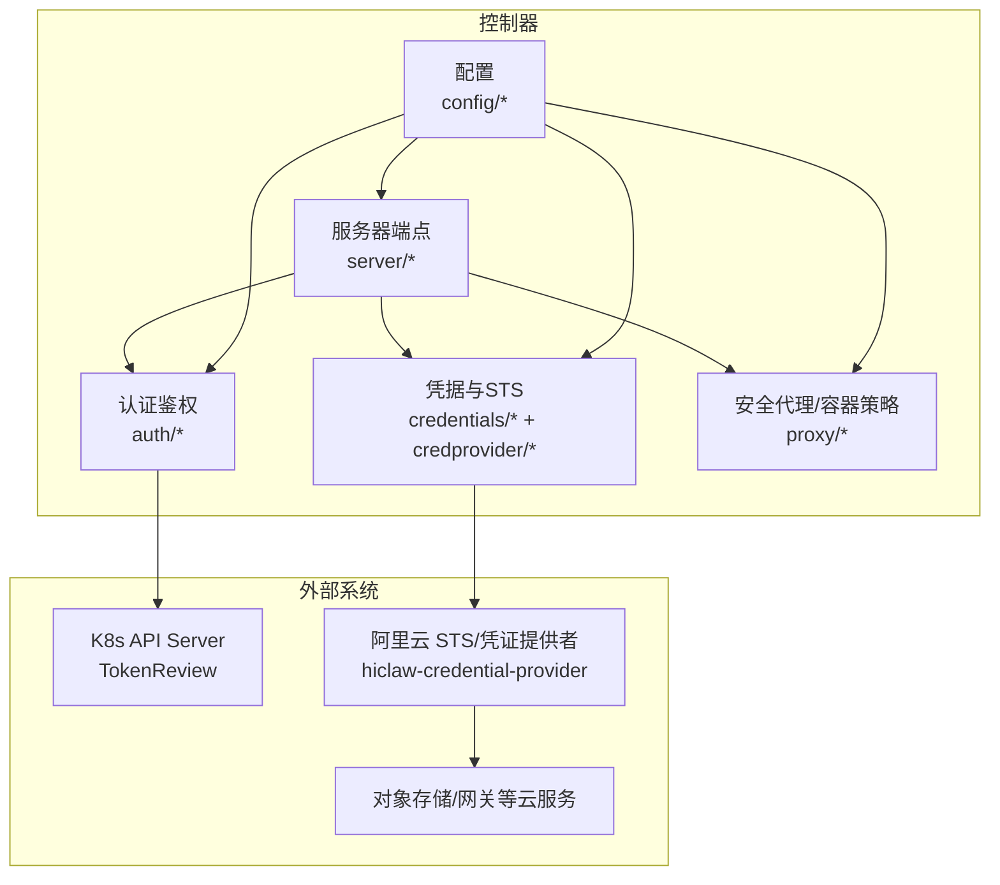
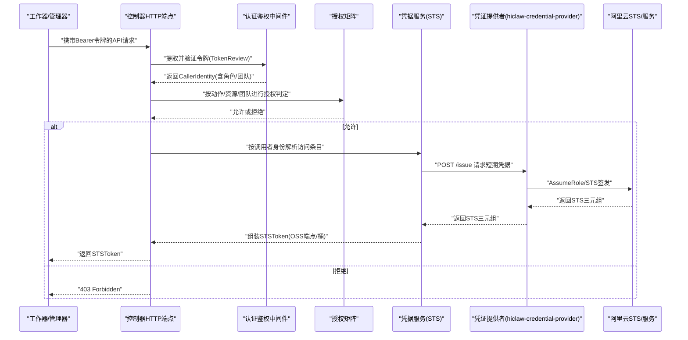
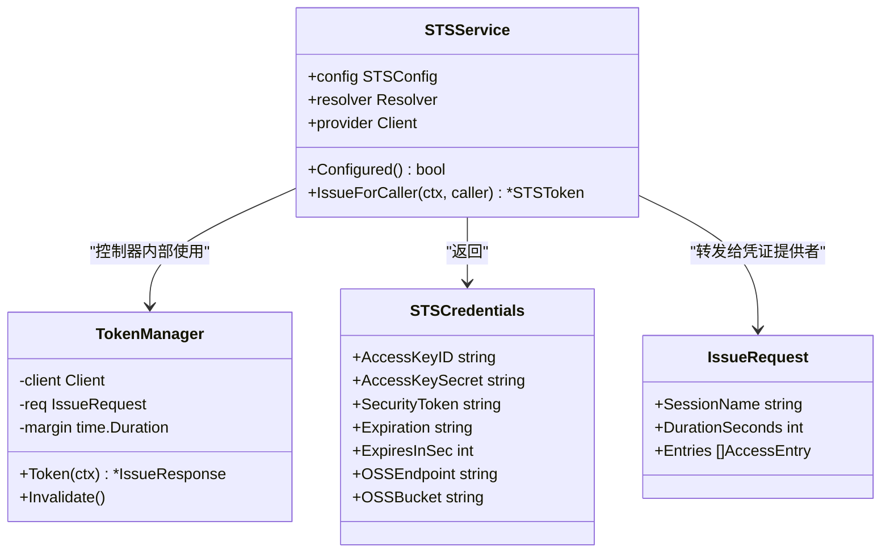
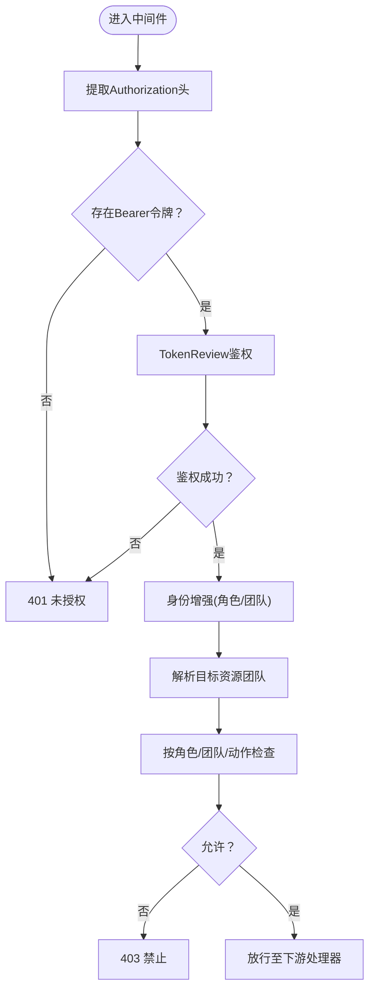
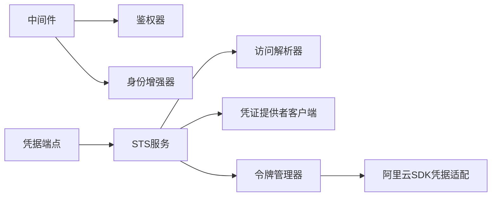

# 安全架构设计

<cite>
**本文引用的文件**
- [hiclaw-controller/internal/auth/authenticator.go](file://hiclaw-controller/internal/auth/authenticator.go)
- [hiclaw-controller/internal/auth/authorizer.go](file://hiclaw-controller/internal/auth/authorizer.go)
- [hiclaw-controller/internal/auth/enricher.go](file://hiclaw-controller/internal/auth/enricher.go)
- [hiclaw-controller/internal/auth/middleware.go](file://hiclaw-controller/internal/auth/middleware.go)
- [hiclaw-controller/internal/credentials/sts.go](file://hiclaw-controller/internal/credentials/sts.go)
- [hiclaw-controller/internal/credentials/types.go](file://hiclaw-controller/internal/credentials/types.go)
- [hiclaw-controller/internal/credprovider/types.go](file://hiclaw-controller/internal/credprovider/types.go)
- [hiclaw-controller/internal/credprovider/tokenmanager.go](file://hiclaw-controller/internal/credprovider/tokenmanager.go)
- [hiclaw-controller/internal/credprovider/aliyun_credential.go](file://hiclaw-controller/internal/credprovider/aliyun_credential.go)
- [hiclaw-controller/internal/proxy/security.go](file://hiclaw-controller/internal/proxy/security.go)
- [hiclaw-controller/internal/server/credentials_handler.go](file://hiclaw-controller/internal/server/credentials_handler.go)
- [hiclaw-controller/internal/server/lifecycle_handler.go](file://hiclaw-controller/internal/server/lifecycle_handler.go)
- [hiclaw-controller/internal/server/status_handler.go](file://hiclaw-controller/internal/server/status_handler.go)
- [hiclaw-controller/internal/config/config.go](file://hiclaw-controller/internal/config/config.go)
- [scripts/export-debug-log.py](file://scripts/export-debug-log.py)
- [docs/zh-cn/manager-guide.md](file://docs/zh-cn/manager-guide.md)
</cite>

## 目录
1. [引言](#引言)
2. [项目结构](#项目结构)
3. [核心组件](#核心组件)
4. [架构总览](#架构总览)
5. [详细组件分析](#详细组件分析)
6. [依赖分析](#依赖分析)
7. [性能考虑](#性能考虑)
8. [故障排查指南](#故障排查指南)
9. [结论](#结论)
10. [附录](#附录)

## 引言
本文件面向 HiClaw 的安全架构设计，系统化阐述凭据隔离与轮换、RBAC 权限模型、API 认证与授权、安全通信、安全审计与监控、以及云原生安全集成（STS、密钥管理、安全策略）。文档以代码为依据，结合流程图与类图，帮助读者快速理解各模块职责、交互关系与安全控制点。

## 项目结构
HiClaw 的控制器包含认证鉴权、凭据发放、容器后端安全策略、服务器端点等模块。安全相关的关键目录与文件如下：
- 认证与授权：auth 包（TokenReview 鉴权、身份增强、中间件、授权矩阵）
- 凭据与 STS：credentials 与 credprovider 包（STS 发放、令牌缓存、阿里云 SDK 凭据适配）
- 安全代理与容器策略：proxy 包（镜像白名单、挂载限制、危险能力禁止等）
- 服务器端点：server 包（凭据刷新、生命周期、状态接口）
- 配置：config 包（环境变量驱动的部署模式、端点、令牌受众等）

图表来源
- [hiclaw-controller/internal/auth/authenticator.go:35-140](file://hiclaw-controller/internal/auth/authenticator.go#L35-L140)
- [hiclaw-controller/internal/credentials/sts.go:29-90](file://hiclaw-controller/internal/credentials/sts.go#L29-L90)
- [hiclaw-controller/internal/credprovider/types.go:20-75](file://hiclaw-controller/internal/credprovider/types.go#L20-L75)
- [hiclaw-controller/internal/proxy/security.go:59-182](file://hiclaw-controller/internal/proxy/security.go#L59-L182)
- [hiclaw-controller/internal/server/credentials_handler.go:12-43](file://hiclaw-controller/internal/server/credentials_handler.go#L12-L43)
- [hiclaw-controller/internal/config/config.go:19-162](file://hiclaw-controller/internal/config/config.go#L19-L162)

章节来源
- [hiclaw-controller/internal/auth/authenticator.go:1-140](file://hiclaw-controller/internal/auth/authenticator.go#L1-L140)
- [hiclaw-controller/internal/credentials/sts.go:1-90](file://hiclaw-controller/internal/credentials/sts.go#L1-L90)
- [hiclaw-controller/internal/credprovider/types.go:1-75](file://hiclaw-controller/internal/credprovider/types.go#L1-L75)
- [hiclaw-controller/internal/proxy/security.go:1-182](file://hiclaw-controller/internal/proxy/security.go#L1-L182)
- [hiclaw-controller/internal/server/credentials_handler.go:1-43](file://hiclaw-controller/internal/server/credentials_handler.go#L1-L43)
- [hiclaw-controller/internal/config/config.go:1-680](file://hiclaw-controller/internal/config/config.go#L1-L680)

## 核心组件
- 认证层：基于 Kubernetes TokenReview 的 Bearer 令牌验证，支持缓存与受众校验。
- 身份增强：从 Worker/Team CR 推导角色与团队信息，补充 CallerIdentity。
- 授权层：基于角色与团队的细粒度权限矩阵，区分管理员、管理者、团队负责人、工作者。
- 凭据发放：通过 STS 服务按调用者身份解析访问条目，向凭证提供者请求短期凭据。
- 令牌管理：对控制器内部长期使用场景提供令牌缓存与自动刷新。
- 容器安全：镜像白名单、挂载限制、危险能力禁用、网络与 PID 模式约束。
- 服务器端点：凭据刷新、工作器生命周期、健康与版本状态接口。
- 配置：统一从环境变量加载控制器行为（令牌受众、端点、云服务参数）。

章节来源
- [hiclaw-controller/internal/auth/authenticator.go:27-140](file://hiclaw-controller/internal/auth/authenticator.go#L27-L140)
- [hiclaw-controller/internal/auth/enricher.go:21-104](file://hiclaw-controller/internal/auth/enricher.go#L21-L104)
- [hiclaw-controller/internal/auth/authorizer.go:23-155](file://hiclaw-controller/internal/auth/authorizer.go#L23-L155)
- [hiclaw-controller/internal/credentials/sts.go:29-90](file://hiclaw-controller/internal/credentials/sts.go#L29-L90)
- [hiclaw-controller/internal/credprovider/tokenmanager.go:10-78](file://hiclaw-controller/internal/credprovider/tokenmanager.go#L10-L78)
- [hiclaw-controller/internal/proxy/security.go:59-182](file://hiclaw-controller/internal/proxy/security.go#L59-L182)
- [hiclaw-controller/internal/server/credentials_handler.go:12-43](file://hiclaw-controller/internal/server/credentials_handler.go#L12-L43)
- [hiclaw-controller/internal/config/config.go:19-162](file://hiclaw-controller/internal/config/config.go#L19-L162)

## 架构总览
下图展示从客户端到控制器、再到凭证提供者与云服务的完整安全链路。

图表来源
- [hiclaw-controller/internal/auth/middleware.go:51-118](file://hiclaw-controller/internal/auth/middleware.go#L51-L118)
- [hiclaw-controller/internal/auth/authorizer.go:38-58](file://hiclaw-controller/internal/auth/authorizer.go#L38-L58)
- [hiclaw-controller/internal/credentials/sts.go:63-89](file://hiclaw-controller/internal/credentials/sts.go#L63-L89)
- [hiclaw-controller/internal/credprovider/types.go:20-66](file://hiclaw-controller/internal/credprovider/types.go#L20-L66)
- [hiclaw-controller/internal/server/credentials_handler.go:21-42](file://hiclaw-controller/internal/server/credentials_handler.go#L21-L42)

## 详细组件分析

### 凭据隔离与轮换机制
- 设计目标
  - 工作者凭据最小化暴露：仅在需要时发放短期凭据，避免长期密钥常驻。
  - 多租户隔离：通过资源前缀与会话名区分不同实例与租户，便于审计与策略匹配。
  - 自动轮换：令牌管理器在过期前自动刷新，降低运维复杂度。
- 关键实现
  - STS 服务：根据调用者身份解析访问条目，向凭证提供者发起签发请求，返回包含 OSS 端点与桶的 STSToken。
  - 令牌管理：对控制器内部使用场景缓存 STS 三元组，在剩余有效期低于阈值时自动刷新。
  - 阿里云 SDK 适配：将令牌管理器适配为阿里云 SDK 可识别的“sts”类型凭据，SDK 每次签名前自动获取最新凭据。
  - 客户端刷新：工作器通过凭据端点刷新短期凭据，凭据范围由其声明的访问条目决定。

图表来源
- [hiclaw-controller/internal/credentials/sts.go:29-90](file://hiclaw-controller/internal/credentials/sts.go#L29-L90)
- [hiclaw-controller/internal/credentials/types.go:3-13](file://hiclaw-controller/internal/credentials/types.go#L3-L13)
- [hiclaw-controller/internal/credprovider/tokenmanager.go:10-78](file://hiclaw-controller/internal/credprovider/tokenmanager.go#L10-L78)
- [hiclaw-controller/internal/credprovider/types.go:20-66](file://hiclaw-controller/internal/credprovider/types.go#L20-L66)

章节来源
- [hiclaw-controller/internal/credentials/sts.go:29-90](file://hiclaw-controller/internal/credentials/sts.go#L29-L90)
- [hiclaw-controller/internal/credentials/types.go:3-13](file://hiclaw-controller/internal/credentials/types.go#L3-L13)
- [hiclaw-controller/internal/credprovider/tokenmanager.go:10-78](file://hiclaw-controller/internal/credprovider/tokenmanager.go#L10-L78)
- [hiclaw-controller/internal/credprovider/aliyun_credential.go:9-90](file://hiclaw-controller/internal/credprovider/aliyun_credential.go#L9-L90)
- [hiclaw-controller/internal/server/credentials_handler.go:21-42](file://hiclaw-controller/internal/server/credentials_handler.go#L21-L42)

### 访问控制模型（RBAC）
- 角色定义
  - admin：完全权限
  - manager：完全权限
  - team-leader：团队内有限读写，部分动作需同团队
  - worker：自服务能力（如自身状态查询、就绪上报、凭据刷新）
- 授权矩阵要点
  - 管理员与管理者拥有全部资源的全部动作权限。
  - 团队负责人可对 worker 与 team 资源执行有限动作，且要求目标资源属于同一团队。
  - 工作者仅能访问自身资源或凭据刷新端点（凭据端点为自限定作用域）。
- 中间件流程
  - 提取 Bearer 令牌 → TokenReview 验证 → 增强身份（角色/团队）→ 解析目标资源团队 → 执行授权判定 → 放行或返回 403。

图表来源
- [hiclaw-controller/internal/auth/middleware.go:51-118](file://hiclaw-controller/internal/auth/middleware.go#L51-L118)
- [hiclaw-controller/internal/auth/authorizer.go:38-58](file://hiclaw-controller/internal/auth/authorizer.go#L38-L58)

章节来源
- [hiclaw-controller/internal/auth/authorizer.go:5-21](file://hiclaw-controller/internal/auth/authorizer.go#L5-L21)
- [hiclaw-controller/internal/auth/authorizer.go:38-155](file://hiclaw-controller/internal/auth/authorizer.go#L38-L155)
- [hiclaw-controller/internal/auth/middleware.go:51-118](file://hiclaw-controller/internal/auth/middleware.go#L51-L118)
- [hiclaw-controller/internal/auth/enricher.go:21-104](file://hiclaw-controller/internal/auth/enricher.go#L21-L104)

### API 认证机制
- 令牌来源：Kubernetes ServiceAccount TokenReview。
- 受众校验：默认受众为控制器标识，确保令牌用于正确目标。
- 缓存策略：对鉴权结果进行缓存，减少重复 TokenReview 调用。
- 中间件职责：统一从 Authorization 头提取令牌，失败时返回 401。

章节来源
- [hiclaw-controller/internal/auth/authenticator.go:23-25](file://hiclaw-controller/internal/auth/authenticator.go#L23-L25)
- [hiclaw-controller/internal/auth/authenticator.go:78-112](file://hiclaw-controller/internal/auth/authenticator.go#L78-L112)
- [hiclaw-controller/internal/auth/middleware.go:137-169](file://hiclaw-controller/internal/auth/middleware.go#L137-L169)

### 安全通信与 TLS
- TLS 证书管理：Higress 网关提供 TLS 证书的增删改查接口，支持按名称管理证书。
- 证书 API：包含新增、更新、删除、列表等操作，错误码覆盖 404、409、500 等场景。
- 证书数据：包含证书内容、私钥、名称等字段，接口返回结构体中定义了分页与通用响应格式。

章节来源
- [manager/agent/skills-alpha/higress-gateway-management/references/higress-api-doc.json:197-325](file://manager/agent/skills-alpha/higress-gateway-management/references/higress-api-doc.json#L197-L325)
- [manager/agent/skills-alpha/higress-gateway-management/references/higress-api-doc.json:2589-2620](file://manager/agent/skills-alpha/higress-gateway-management/references/higress-api-doc.json#L2589-L2620)

### 安全审计与监控
- 日志采集：嵌入式安装模式下，控制器集中输出日志；可通过容器日志查看 Higress、Tuwunel、MinIO 等组件日志。
- 日志脱敏：调试日志导出脚本对敏感键（如 SECRET_KV、ALIYUN_SK、BEARER）进行脱敏处理，避免泄露。
- 健康检查：提供 /healthz、/api/v1/status、/api/v1/version 等端点，便于外部探活与状态观测。
- 运行态可观测：工作器生命周期端点记录 Ready 状态变更，便于追踪运行态。

章节来源
- [docs/zh-cn/manager-guide.md:158-198](file://docs/zh-cn/manager-guide.md#L158-L198)
- [scripts/export-debug-log.py:76-119](file://scripts/export-debug-log.py#L76-L119)
- [hiclaw-controller/internal/server/status_handler.go:23-75](file://hiclaw-controller/internal/server/status_handler.go#L23-L75)
- [hiclaw-controller/internal/server/lifecycle_handler.go:162-174](file://hiclaw-controller/internal/server/lifecycle_handler.go#L162-L174)

### 云原生安全集成
- STS 令牌：通过凭证提供者签发短期凭据，支持对象存储与 AI 网关两类服务范围。
- 密钥管理：控制器不直接持有长期密钥，所有云服务调用均通过凭证提供者获取临时凭据。
- 安全策略：访问条目在控制器侧解析为凭证提供者的内联策略，确保最小权限。
- 环境变量驱动：控制器通过环境变量配置令牌受众、端点、云服务参数，便于多环境一致性与安全基线。

章节来源
- [hiclaw-controller/internal/credentials/sts.go:29-90](file://hiclaw-controller/internal/credentials/sts.go#L29-L90)
- [hiclaw-controller/internal/credprovider/types.go:20-75](file://hiclaw-controller/internal/credprovider/types.go#L20-L75)
- [hiclaw-controller/internal/config/config.go:19-162](file://hiclaw-controller/internal/config/config.go#L19-L162)

## 依赖分析
- 组件耦合
  - 认证中间件依赖鉴权器与身份增强器，形成鉴权链。
  - 凭据服务依赖访问解析器与凭证提供者客户端，形成凭据发放链。
  - 令牌管理器被控制器内部组件复用，避免重复获取与刷新。
  - 服务器端点依赖中间件完成鉴权与授权，再调用具体业务处理器。
- 外部依赖
  - Kubernetes API：TokenReview 用于令牌验证。
  - 凭证提供者：统一的 STS 三元组签发入口。
  - 阿里云服务：OSS、APIG、STS 等。

图表来源
- [hiclaw-controller/internal/auth/middleware.go:31-49](file://hiclaw-controller/internal/auth/middleware.go#L31-L49)
- [hiclaw-controller/internal/auth/authorizer.go:31-36](file://hiclaw-controller/internal/auth/authorizer.go#L31-L36)
- [hiclaw-controller/internal/auth/enricher.go:21-34](file://hiclaw-controller/internal/auth/enricher.go#L21-L34)
- [hiclaw-controller/internal/server/credentials_handler.go:12-19](file://hiclaw-controller/internal/server/credentials_handler.go#L12-L19)
- [hiclaw-controller/internal/credentials/sts.go:29-53](file://hiclaw-controller/internal/credentials/sts.go#L29-L53)
- [hiclaw-controller/internal/credprovider/tokenmanager.go:10-32](file://hiclaw-controller/internal/credprovider/tokenmanager.go#L10-L32)
- [hiclaw-controller/internal/credprovider/aliyun_credential.go:9-23](file://hiclaw-controller/internal/credprovider/aliyun_credential.go#L9-L23)

章节来源
- [hiclaw-controller/internal/auth/middleware.go:31-49](file://hiclaw-controller/internal/auth/middleware.go#L31-L49)
- [hiclaw-controller/internal/credentials/sts.go:29-53](file://hiclaw-controller/internal/credentials/sts.go#L29-L53)
- [hiclaw-controller/internal/credprovider/tokenmanager.go:10-32](file://hiclaw-controller/internal/credprovider/tokenmanager.go#L10-L32)
- [hiclaw-controller/internal/credprovider/aliyun_credential.go:9-23](file://hiclaw-controller/internal/credprovider/aliyun_credential.go#L9-L23)

## 性能考虑
- 鉴权缓存：TokenReview 结果缓存可显著降低鉴权开销，建议结合令牌 TTL 合理设置缓存窗口。
- 令牌刷新：令牌管理器采用“剩余有效期阈值”触发刷新，避免频繁请求；可在高并发场景下调小刷新边距提升稳定性。
- 容器安全策略：镜像白名单与挂载限制在创建阶段即拦截风险配置，减少后续运行时开销。
- 端点负载：凭据刷新与状态端点应避免不必要的日志输出，防止 I/O 成为瓶颈。

## 故障排查指南
- 401 未授权
  - 检查请求是否携带正确的 Bearer 令牌，确认令牌受众与控制器一致。
  - 查看鉴权中间件日志定位 TokenReview 失败原因。
- 403 禁止
  - 核对调用者角色与目标资源团队是否满足授权矩阵。
  - 确认资源名称与团队解析逻辑是否正确。
- STS 服务不可用
  - 确认凭证提供者 URL 是否配置，控制器是否处于云模式。
  - 检查访问解析器与凭证提供者客户端连通性。
- 日志与脱敏
  - 使用调试日志导出脚本对敏感信息进行脱敏处理后再外发。
  - 通过健康检查端点确认基础设施组件存活状态。

章节来源
- [hiclaw-controller/internal/auth/middleware.go:51-118](file://hiclaw-controller/internal/auth/middleware.go#L51-L118)
- [hiclaw-controller/internal/server/credentials_handler.go:21-42](file://hiclaw-controller/internal/server/credentials_handler.go#L21-L42)
- [scripts/export-debug-log.py:76-119](file://scripts/export-debug-log.py#L76-L119)
- [hiclaw-controller/internal/server/status_handler.go:23-75](file://hiclaw-controller/internal/server/status_handler.go#L23-L75)

## 结论
HiClaw 的安全架构以“最小权限、短期凭据、严格授权、可控审计”为核心原则，通过 Kubernetes TokenReview 实现 API 层认证，以 RBAC 授权矩阵保障资源访问边界，并借助凭证提供者与令牌管理器实现凭据的隔离与自动轮换。容器安全策略与 TLS 证书管理完善了运行时与传输层安全。配合日志脱敏与健康检查端点，整体形成闭环的安全可观测体系。

## 附录
- 威胁模型与控制矩阵（示例）
  - 威胁：令牌泄露、越权访问、容器逃逸、凭证滥用
  - 控制：TokenReview 受众校验、RBAC 授权、容器策略、凭据短期化、日志脱敏、健康检查
- 关键端点与动作
  - /api/v1/credentials/sts：凭据刷新（动作：sts）
  - /api/v1/workers/{name}/wake：唤醒（动作：wake）
  - /api/v1/workers/{name}/sleep：休眠（动作：sleep）
  - /api/v1/workers/{name}/ensure-ready：确保就绪（动作：ensure-ready）
  - /api/v1/workers/{name}/status：状态查询（动作：status）
  - /healthz、/api/v1/status、/api/v1/version：健康与状态