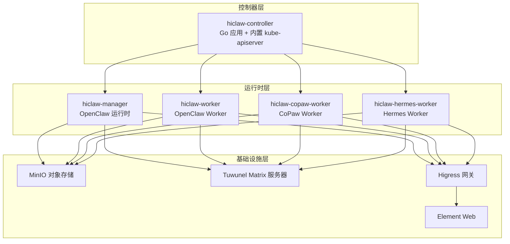
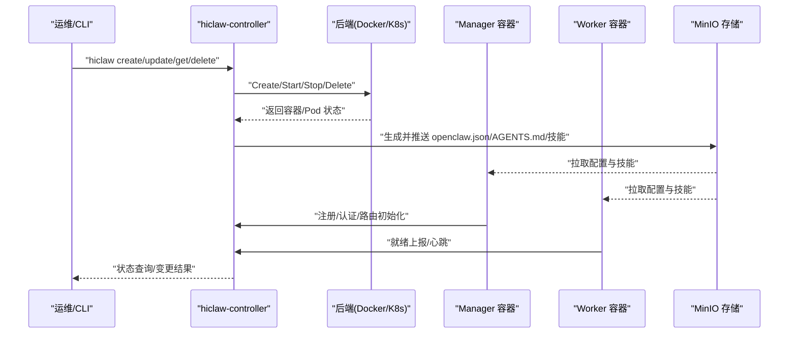
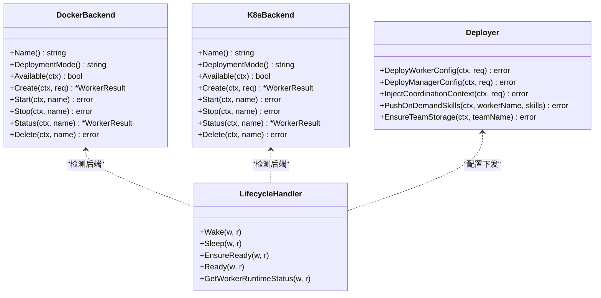
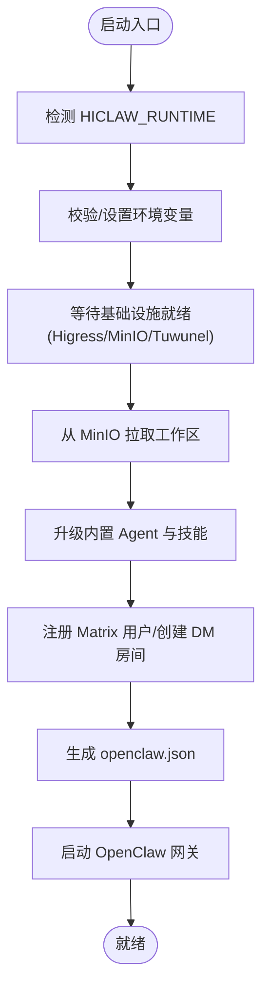
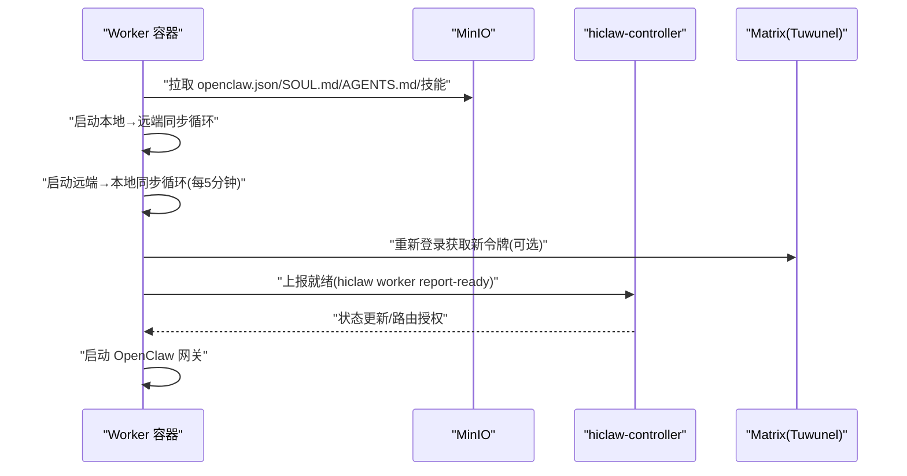
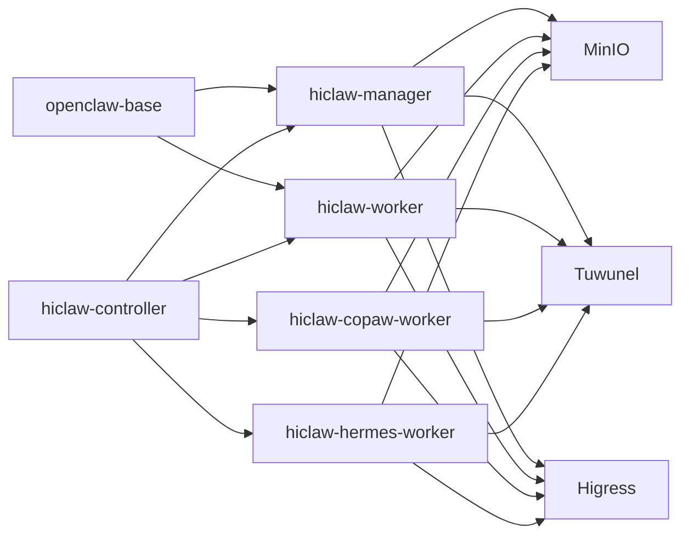

# 容器化架构设计

<cite>
**本文档引用的文件**
- [hiclaw-controller/Dockerfile](file://hiclaw-controller/Dockerfile)
- [manager/Dockerfile](file://manager/Dockerfile)
- [worker/Dockerfile](file://worker/Dockerfile)
- [copaw/Dockerfile](file://copaw/Dockerfile)
- [hermes/Dockerfile](file://hermes/Dockerfile)
- [openclaw-base/Dockerfile](file://openclaw-base/Dockerfile)
- [hiclaw-controller/internal/backend/docker.go](file://hiclaw-controller/internal/backend/docker.go)
- [hiclaw-controller/internal/backend/kubernetes.go](file://hiclaw-controller/internal/backend/kubernetes.go)
- [hiclaw-controller/internal/service/deployer.go](file://hiclaw-controller/internal/service/deployer.go)
- [hiclaw-controller/internal/server/lifecycle_handler.go](file://hiclaw-controller/internal/server/lifecycle_handler.go)
- [manager/scripts/init/start-manager-agent.sh](file://manager/scripts/init/start-manager-agent.sh)
- [worker/scripts/worker-entrypoint.sh](file://worker/scripts/worker-entrypoint.sh)
- [helm/hiclaw/values.yaml](file://helm/hiclaw/values.yaml)
- [helm/hiclaw/Chart.yaml](file://helm/hiclaw/Chart.yaml)
- [hiclaw-controller/cmd/controller/main.go](file://hiclaw-controller/cmd/controller/main.go)
- [hiclaw-controller/cmd/hiclaw/main.go](file://hiclaw-controller/cmd/hiclaw/main.go)
</cite>

## 目录
1. [简介](#简介)
2. [项目结构](#项目结构)
3. [核心组件](#核心组件)
4. [架构总览](#架构总览)
5. [详细组件分析](#详细组件分析)
6. [依赖关系分析](#依赖关系分析)
7. [性能考虑](#性能考虑)
8. [故障排查指南](#故障排查指南)
9. [结论](#结论)
10. [附录](#附录)

## 简介
本文件面向 HiClaw 的容器化架构设计，系统性阐述多容器架构的设计原则与实现细节，包括容器职责分离、资源共享、网络通信；各镜像的设计思路（hiclaw-controller、Manager、Worker 及基础设施组件）；容器间通信机制（Docker/Podman API、Kubernetes Service、环境变量传递）；容器生命周期管理（启动顺序、健康检查、优雅关闭）；以及安全设计（权限控制、资源限制、网络隔离）。同时提供架构图与容器关系图，帮助读者快速理解与落地部署。

## 项目结构
HiClaw 采用分层清晰的多容器架构：控制器（hiclaw-controller）负责编排与生命周期管理；Manager 负责团队协调与人类交互；Worker 承载具体任务执行；基础设施（MinIO、Tuwunel、Higress/Element Web）通过 Helm Chart 统一部署。镜像构建遵循“共享基础层 + 专用运行时”的策略，确保最小化体积与可维护性。

**图表来源**
- [hiclaw-controller/Dockerfile:1-61](file://hiclaw-controller/Dockerfile#L1-L61)
- [manager/Dockerfile:1-87](file://manager/Dockerfile#L1-L87)
- [worker/Dockerfile:1-81](file://worker/Dockerfile#L1-L81)
- [copaw/Dockerfile:1-132](file://copaw/Dockerfile#L1-L132)
- [hermes/Dockerfile:1-175](file://hermes/Dockerfile#L1-L175)
- [helm/hiclaw/values.yaml:1-263](file://helm/hiclaw/values.yaml#L1-L263)

**章节来源**
- [hiclaw-controller/Dockerfile:1-61](file://hiclaw-controller/Dockerfile#L1-L61)
- [manager/Dockerfile:1-87](file://manager/Dockerfile#L1-L87)
- [worker/Dockerfile:1-81](file://worker/Dockerfile#L1-L81)
- [copaw/Dockerfile:1-132](file://copaw/Dockerfile#L1-L132)
- [hermes/Dockerfile:1-175](file://hermes/Dockerfile#L1-L175)
- [helm/hiclaw/values.yaml:1-263](file://helm/hiclaw/values.yaml#L1-L263)

## 核心组件
- hiclaw-controller：嵌入式 kube-apiserver 与控制器，提供 Worker 生命周期管理、配置下发、资源编排与网关/凭证服务。
- Manager：基于 OpenClaw 的团队协调代理，负责人类交互、任务编排、技能管理与工作区同步。
- Worker：轻量级执行代理，按需拉取配置与技能，通过 MinIO 实现状态持久化与双向同步。
- 基础设施：MinIO（对象存储）、Tuwunel（Matrix 服务器）、Higress（API 网关）、Element Web（聊天界面）。

**章节来源**
- [hiclaw-controller/Dockerfile:1-61](file://hiclaw-controller/Dockerfile#L1-L61)
- [hiclaw-controller/internal/backend/docker.go:1-577](file://hiclaw-controller/internal/backend/docker.go#L1-L577)
- [hiclaw-controller/internal/backend/kubernetes.go:1-569](file://hiclaw-controller/internal/backend/kubernetes.go#L1-L569)
- [hiclaw-controller/internal/service/deployer.go:1-678](file://hiclaw-controller/internal/service/deployer.go#L1-L678)
- [hiclaw-controller/internal/server/lifecycle_handler.go:1-235](file://hiclaw-controller/internal/server/lifecycle_handler.go#L1-L235)
- [helm/hiclaw/values.yaml:1-263](file://helm/hiclaw/values.yaml#L1-L263)

## 架构总览
HiClaw 的容器化架构以“控制器中心化 + 多运行时后端”为核心：控制器在本地模式使用 Docker Engine API，在云模式使用 Kubernetes API。所有 Worker 配置与技能通过 MinIO 同步，Manager 与 Worker 通过 Matrix 协作，Higress 提供统一入口与路由。

**图表来源**
- [hiclaw-controller/internal/backend/docker.go:87-209](file://hiclaw-controller/internal/backend/docker.go#L87-L209)
- [hiclaw-controller/internal/backend/kubernetes.go:151-313](file://hiclaw-controller/internal/backend/kubernetes.go#L151-L313)
- [hiclaw-controller/internal/service/deployer.go:135-258](file://hiclaw-controller/internal/service/deployer.go#L135-L258)
- [hiclaw-controller/internal/server/lifecycle_handler.go:34-160](file://hiclaw-controller/internal/server/lifecycle_handler.go#L34-L160)
- [worker/scripts/worker-entrypoint.sh:174-225](file://worker/scripts/worker-entrypoint.sh#L174-L225)

**章节来源**
- [hiclaw-controller/internal/backend/docker.go:1-577](file://hiclaw-controller/internal/backend/docker.go#L1-L577)
- [hiclaw-controller/internal/backend/kubernetes.go:1-569](file://hiclaw-controller/internal/backend/kubernetes.go#L1-L569)
- [hiclaw-controller/internal/service/deployer.go:1-678](file://hiclaw-controller/internal/service/deployer.go#L1-L678)
- [hiclaw-controller/internal/server/lifecycle_handler.go:1-235](file://hiclaw-controller/internal/server/lifecycle_handler.go#L1-L235)
- [worker/scripts/worker-entrypoint.sh:1-359](file://worker/scripts/worker-entrypoint.sh#L1-L359)

## 详细组件分析

### 控制器（hiclaw-controller）
- 设计要点
  - 单体镜像包含控制器二进制、CLI 工具与内置 kube-apiserver，便于本地与嵌入式场景部署。
  - 支持两种后端：Docker（Unix Socket）与 Kubernetes（InClusterConfig），自动探测可用后端。
  - 通过环境变量注入控制器 URL 与认证令牌，支持 K8s 投射卷与本地文件两种方式。
- 关键能力
  - Worker 生命周期：创建、启动、停止、状态查询与就绪上报。
  - 配置下发：将 openclaw.json、AGENTS.md、技能等推送到 MinIO，并支持更新合并策略。
  - 网关与凭证：在 K8s 模式下为 Manager 创建消费者与路由；在本地模式提供 Higress 初始化。
- 入口与信号处理
  - 使用 signal.NotifyContext 接收 SIGINT/SIGTERM，优雅退出。

**图表来源**
- [hiclaw-controller/internal/backend/docker.go:29-577](file://hiclaw-controller/internal/backend/docker.go#L29-L577)
- [hiclaw-controller/internal/backend/kubernetes.go:47-569](file://hiclaw-controller/internal/backend/kubernetes.go#L47-L569)
- [hiclaw-controller/internal/service/deployer.go:72-678](file://hiclaw-controller/internal/service/deployer.go#L72-L678)
- [hiclaw-controller/internal/server/lifecycle_handler.go:15-235](file://hiclaw-controller/internal/server/lifecycle_handler.go#L15-L235)

**章节来源**
- [hiclaw-controller/Dockerfile:1-61](file://hiclaw-controller/Dockerfile#L1-L61)
- [hiclaw-controller/internal/backend/docker.go:1-577](file://hiclaw-controller/internal/backend/docker.go#L1-L577)
- [hiclaw-controller/internal/backend/kubernetes.go:1-569](file://hiclaw-controller/internal/backend/kubernetes.go#L1-L569)
- [hiclaw-controller/internal/service/deployer.go:1-678](file://hiclaw-controller/internal/service/deployer.go#L1-L678)
- [hiclaw-controller/internal/server/lifecycle_handler.go:1-235](file://hiclaw-controller/internal/server/lifecycle_handler.go#L1-L235)
- [hiclaw-controller/cmd/controller/main.go:1-37](file://hiclaw-controller/cmd/controller/main.go#L1-L37)

### Manager 容器
- 设计要点
  - 基于 openclaw-base，内置 Node.js 与 OpenClaw，支持本地/云/K8s 三种运行模式。
  - 通过 HICLAW_RUNTIME 切换运行时（openclaw/copaw），默认 openclaw。
  - 在 K8s 模式下由控制器注入凭据与密钥，本地模式自注册与初始化。
- 启动流程
  - 环境校验与初始化（Higress、MinIO、Tuwunel 就绪检查）。
  - 下载/升级内置 Agent 文件与技能，生成 openclaw.json。
  - 注册 Matrix 用户、创建管理员 DM 房间、发送欢迎消息。
  - 启动 OpenClaw 网关（18799 端口）。
- 资源与安全
  - 通过 Helm values.yaml 设置 CPU/内存请求与限制。
  - 云模式使用 ServiceAccount Token 与投影卷读取令牌。

**图表来源**
- [manager/scripts/init/start-manager-agent.sh:1-800](file://manager/scripts/init/start-manager-agent.sh#L1-L800)
- [helm/hiclaw/values.yaml:193-211](file://helm/hiclaw/values.yaml#L193-L211)

**章节来源**
- [manager/Dockerfile:1-87](file://manager/Dockerfile#L1-L87)
- [manager/scripts/init/start-manager-agent.sh:1-800](file://manager/scripts/init/start-manager-agent.sh#L1-L800)
- [helm/hiclaw/values.yaml:193-211](file://helm/hiclaw/values.yaml#L193-L211)

### Worker 容器
- 设计要点
  - Worker 是无状态容器，所有配置与状态存放在 MinIO，通过 HOME 指向 /root/hiclaw-fs/agents/<name>。
  - 采用双通道同步：本地变更触发推送（change-triggered），远端变更通过 on-demand 拉取（fallback 每 5 分钟刷新）。
  - 支持多种运行时（OpenClaw/Copaw/Hermes），通过 HICLAW_WORKER_NAME 识别身份。
- 启动流程
  - 配置 mc 别名，从 MinIO 拉取 openclaw.json、SOUL.md、AGENTS.md 与技能。
  - 启动本地→远端同步进程与远端→本地同步进程。
  - 合并 openclaw.json（本地优先），必要时重新登录 Matrix 获取新设备令牌。
  - 上报就绪并通过 hiclaw CLI 通知控制器。
  - 启动 OpenClaw 网关运行。
- 安全与容错
  - 清理旧会话锁与 Matrix 加密存储，避免不一致导致的 E2EE 问题。
  - 通过 HICLAW_CONTROLLER_URL 与令牌进行控制器鉴权。

**图表来源**
- [worker/scripts/worker-entrypoint.sh:1-359](file://worker/scripts/worker-entrypoint.sh#L1-L359)
- [hiclaw-controller/internal/server/lifecycle_handler.go:162-174](file://hiclaw-controller/internal/server/lifecycle_handler.go#L162-L174)

**章节来源**
- [worker/Dockerfile:1-81](file://worker/Dockerfile#L1-L81)
- [worker/scripts/worker-entrypoint.sh:1-359](file://worker/scripts/worker-entrypoint.sh#L1-L359)

### 基础设施组件镜像与部署
- MinIO（对象存储）
  - Helm values 中提供 managed/existing 两种模式，支持静态凭据或外部 OSS。
  - 提供 API/Console 端口与持久化存储。
- Tuwunel（Matrix 服务器）
  - 支持 managed/existing 两种模式，Helm Chart 自动部署或对接现有实例。
- Higress（API 网关）
  - Helm Chart 作为子依赖，提供 Console 与 Gateway；支持本地与云模式。
- Element Web（聊天界面）
  - 可选部署，作为 Matrix 客户端访问入口。

**章节来源**
- [helm/hiclaw/values.yaml:25-142](file://helm/hiclaw/values.yaml#L25-L142)
- [helm/hiclaw/Chart.yaml:1-28](file://helm/hiclaw/Chart.yaml#L1-L28)

## 依赖关系分析
- 镜像依赖
  - openclaw-base 作为 Manager/Worker 的共享基础镜像，内置 Node.js 与 OpenClaw。
  - 控制器镜像内含 CLI 与 kube-apiserver，复用其二进制到 Manager/Worker 镜像中。
  - CoPaw/Hermes Worker 基于 Python，集成 mcporter 与技能生态。
- 运行时后端
  - Docker 后端通过 Unix Socket 访问 Docker 引擎，适合本地/单机场景。
  - Kubernetes 后端通过 InClusterConfig 访问集群 API，适合云原生场景。
- 配置与同步
  - 所有 Agent 配置与技能通过 MinIO 同步，避免容器间共享卷的复杂性。
  - 控制器负责生成与合并 openclaw.json，Worker 侧执行本地优先合并。

**图表来源**
- [openclaw-base/Dockerfile:1-132](file://openclaw-base/Dockerfile#L1-L132)
- [manager/Dockerfile:1-87](file://manager/Dockerfile#L1-L87)
- [worker/Dockerfile:1-81](file://worker/Dockerfile#L1-L81)
- [copaw/Dockerfile:1-132](file://copaw/Dockerfile#L1-L132)
- [hermes/Dockerfile:1-175](file://hermes/Dockerfile#L1-L175)
- [hiclaw-controller/Dockerfile:1-61](file://hiclaw-controller/Dockerfile#L1-L61)

**章节来源**
- [openclaw-base/Dockerfile:1-132](file://openclaw-base/Dockerfile#L1-L132)
- [manager/Dockerfile:1-87](file://manager/Dockerfile#L1-L87)
- [worker/Dockerfile:1-81](file://worker/Dockerfile#L1-L81)
- [copaw/Dockerfile:1-132](file://copaw/Dockerfile#L1-L132)
- [hermes/Dockerfile:1-175](file://hermes/Dockerfile#L1-L175)
- [hiclaw-controller/Dockerfile:1-61](file://hiclaw-controller/Dockerfile#L1-L61)

## 性能考虑
- 镜像体积与层缓存
  - 控制器镜像采用多阶段构建，仅复制必需二进制，减少体积。
  - Manager/Worker 镜像复用 openclaw-base，避免重复安装 Node.js 与 OpenClaw。
- 同步策略
  - Worker 采用 change-triggered 推送与定时回退拉取，降低带宽与 IO 压力。
- 资源配额
  - Helm values 为各组件设置合理的 requests/limits，避免资源争抢。
- 运行时选择
  - K8s 模式下利用 Pod 调度与亲和性，结合 MinIO 的就近访问优化延迟。

[本节为通用指导，无需特定文件引用]

## 故障排查指南
- Worker 未就绪
  - 检查控制器日志与后端状态（Docker/K8s），确认容器/Pod 是否正常运行。
  - 使用 hiclaw CLI 查询 Worker 状态，核对控制器返回的 backend/status。
- 配置不同步
  - 确认 MinIO 可达且凭据正确；检查 Worker 同步循环是否运行。
  - 核对 openclaw.json 合并策略（本地优先），避免被远端覆盖。
- Matrix 登录失败
  - Worker 启动时会重新登录以获取新设备令牌；若失败，检查密码文件与 homeserver URL。
- 网关初始化异常
  - K8s 模式下检查 Higress Console 初始化与路由配置；本地模式检查端口占用与证书。

**章节来源**
- [hiclaw-controller/internal/server/lifecycle_handler.go:176-205](file://hiclaw-controller/internal/server/lifecycle_handler.go#L176-L205)
- [worker/scripts/worker-entrypoint.sh:268-311](file://worker/scripts/worker-entrypoint.sh#L268-L311)
- [manager/scripts/init/start-manager-agent.sh:298-464](file://manager/scripts/init/start-manager-agent.sh#L298-L464)

## 结论
HiClaw 的容器化架构通过“控制器中心化 + 多运行时后端 + MinIO 同步”的组合，实现了高内聚、低耦合的多容器协作体系。镜像设计强调职责分离与共享基础层，部署通过 Helm Chart 实现标准化与可移植性。该架构在保证可扩展性的同时，兼顾了安全性与可观测性，适合本地开发与云端生产环境。

## 附录

### 容器间通信机制
- Docker API：本地模式下控制器通过 Unix Socket 调用 Docker Engine API，实现容器生命周期管理。
- Kubernetes API：云模式下控制器使用 InClusterConfig 访问集群 API，创建/删除 Pod 并注入凭据。
- 环境变量传递：控制器将 HICLAW_CONTROLLER_URL 与认证令牌注入到容器环境，Worker 通过 hiclaw CLI 与控制器交互。
- 网络通信：Manager/Worker 通过 Higress 对外暴露，内部通过 Kubernetes Service 与 MinIO/Tuwunel 通信。

**章节来源**
- [hiclaw-controller/internal/backend/docker.go:36-51](file://hiclaw-controller/internal/backend/docker.go#L36-L51)
- [hiclaw-controller/internal/backend/kubernetes.go:94-108](file://hiclaw-controller/internal/backend/kubernetes.go#L94-L108)
- [hiclaw-controller/internal/server/lifecycle_handler.go:34-71](file://hiclaw-controller/internal/server/lifecycle_handler.go#L34-L71)
- [worker/scripts/worker-entrypoint.sh:332-352](file://worker/scripts/worker-entrypoint.sh#L332-L352)

### 容器生命周期管理
- 启动顺序
  - 控制器启动后，先初始化基础设施（MinIO/Tuwunel/Higress），再创建 Manager/Pod。
  - Manager 启动后注册 Matrix 用户、生成配置并启动网关。
  - Worker 启动后拉取配置、启动同步进程并上报就绪。
- 健康检查
  - Worker 通过 openclaw gateway health 检查网关健康，控制器据此判断 Ready。
- 优雅关闭
  - 控制器使用 signal.NotifyContext 接收终止信号，优雅退出；Worker 在重启时清理会话锁与加密存储。

**章节来源**
- [hiclaw-controller/cmd/controller/main.go:16-36](file://hiclaw-controller/cmd/controller/main.go#L16-L36)
- [hiclaw-controller/internal/server/lifecycle_handler.go:162-174](file://hiclaw-controller/internal/server/lifecycle_handler.go#L162-L174)
- [worker/scripts/worker-entrypoint.sh:313-326](file://worker/scripts/worker-entrypoint.sh#L313-L326)

### 安全设计
- 权限控制
  - K8s 模式使用 ServiceAccount 与投影卷注入令牌；本地模式使用文件与环境变量。
  - 控制器在 K8s 模式下为每个 Worker 创建独立 ServiceAccount，限制权限范围。
- 资源限制
  - Helm values 为各组件设置 CPU/内存 requests/limits，防止资源滥用。
- 网络隔离
  - 通过 Kubernetes Service 与命名空间隔离；Higress 提供统一入口与路由控制。

**章节来源**
- [hiclaw-controller/internal/backend/kubernetes.go:234-257](file://hiclaw-controller/internal/backend/kubernetes.go#L234-L257)
- [helm/hiclaw/values.yaml:166-263](file://helm/hiclaw/values.yaml#L166-L263)