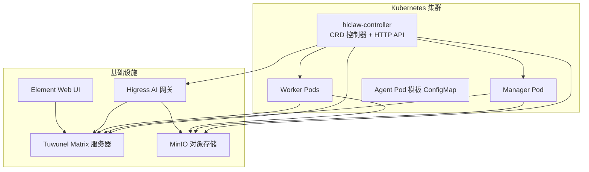
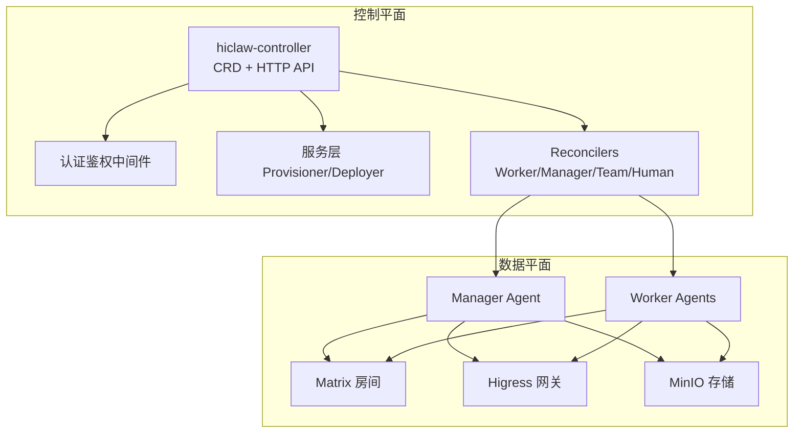
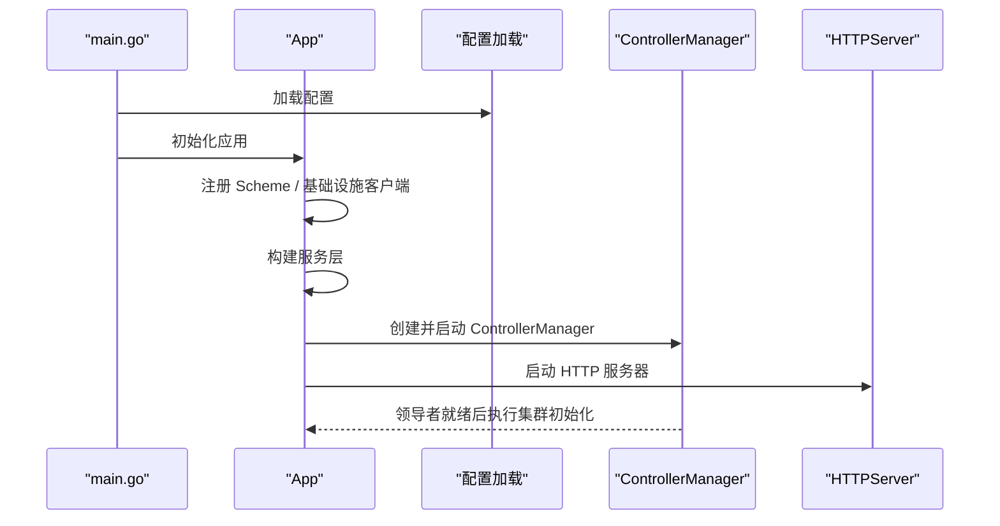
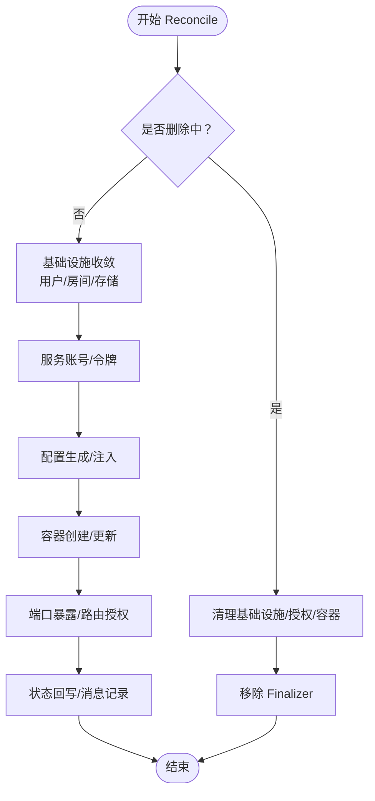
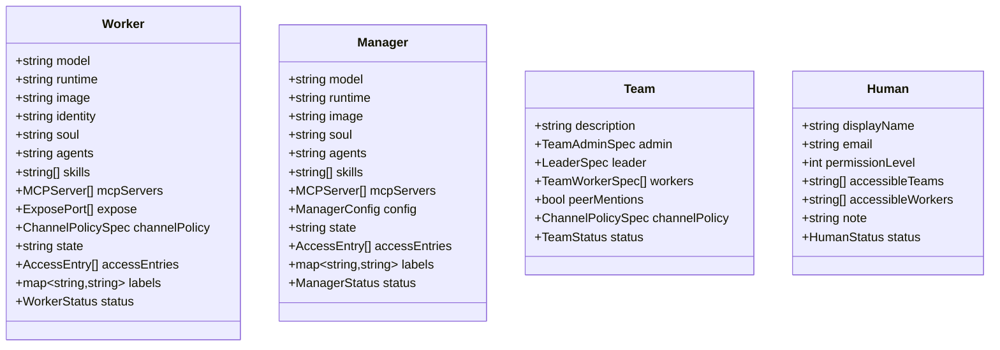
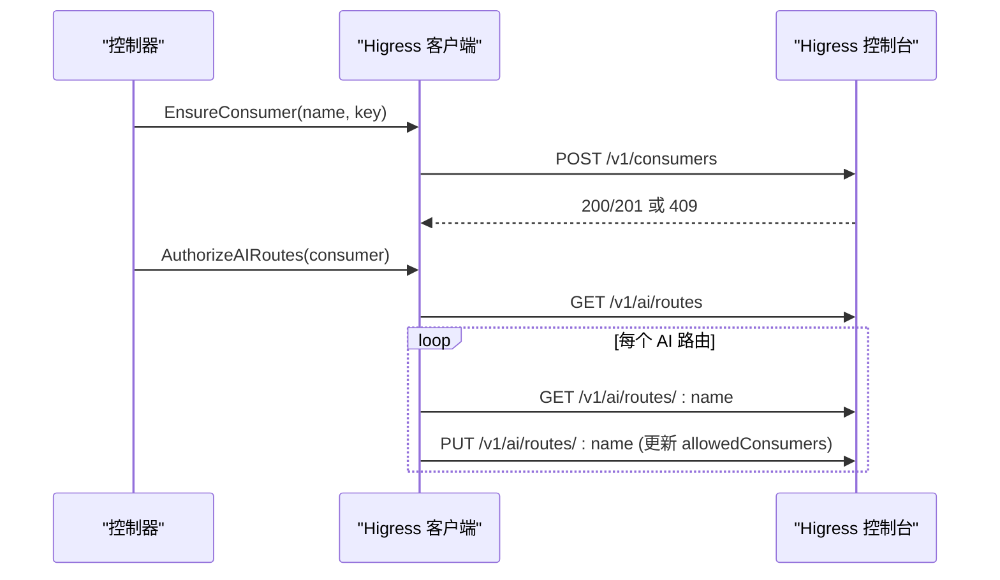
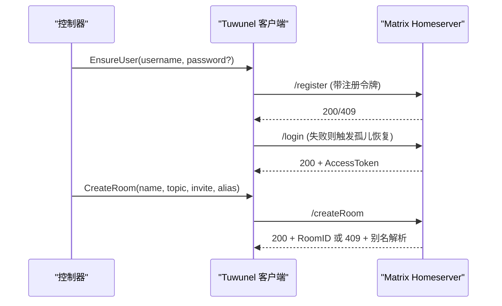
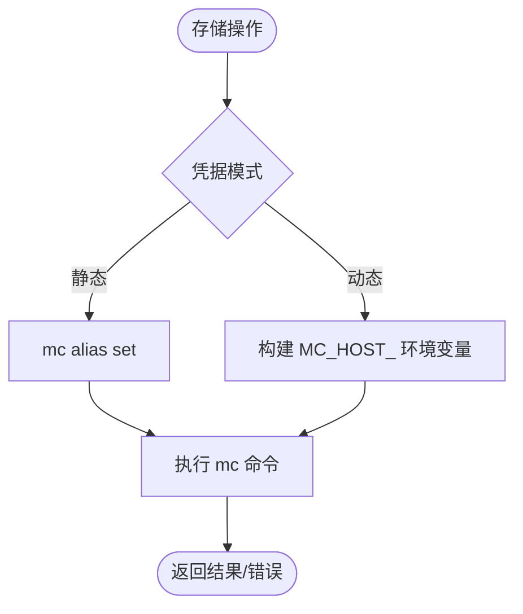
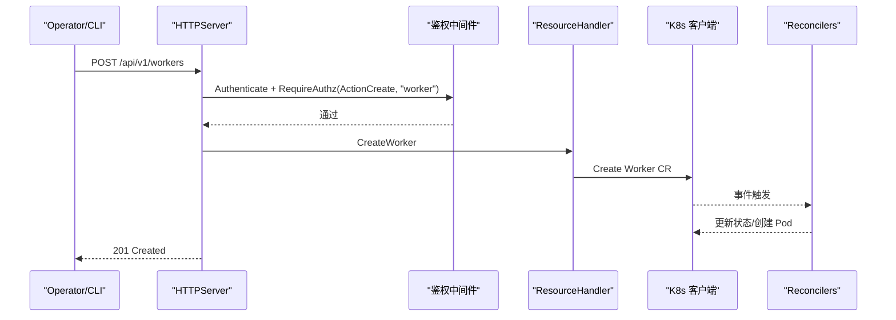
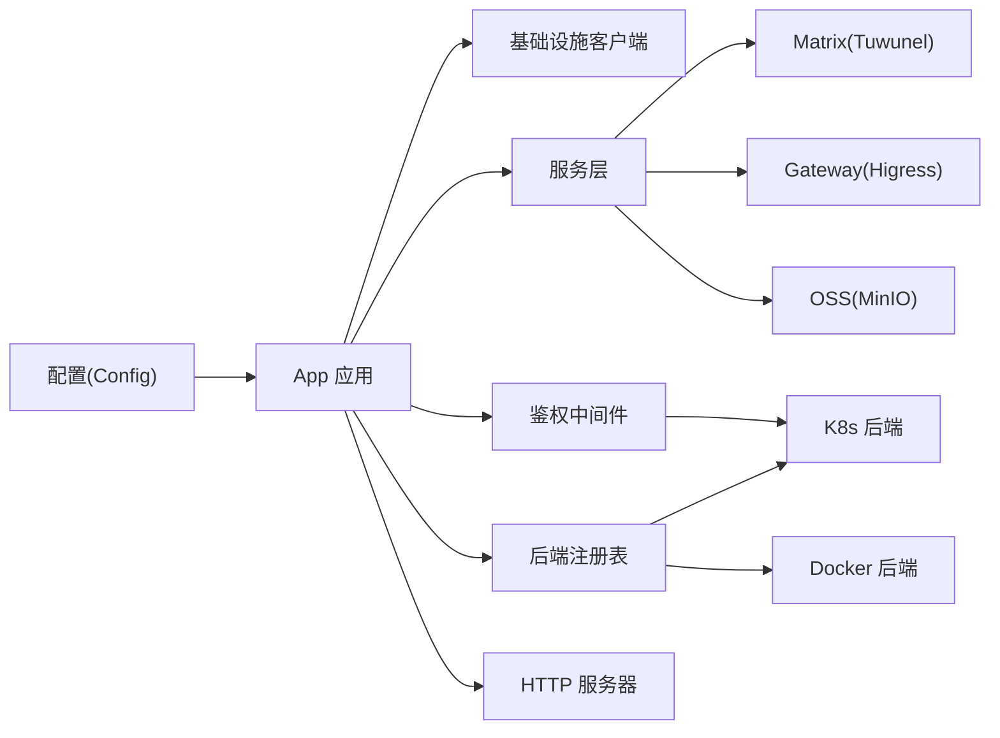

# 技术架构总览

<cite>
**本文档引用的文件**
- [README.md](file://README.md)
- [docs/architecture.md](file://docs/architecture.md)
- [hiclaw-controller/api/v1beta1/types.go](file://hiclaw-controller/api/v1beta1/types.go)
- [hiclaw-controller/cmd/controller/main.go](file://hiclaw-controller/cmd/controller/main.go)
- [hiclaw-controller/internal/app/app.go](file://hiclaw-controller/internal/app/app.go)
- [hiclaw-controller/internal/controller/manager_controller.go](file://hiclaw-controller/internal/controller/manager_controller.go)
- [hiclaw-controller/internal/controller/worker_controller.go](file://hiclaw-controller/internal/controller/worker_controller.go)
- [hiclaw-controller/internal/controller/team_controller.go](file://hiclaw-controller/internal/controller/team_controller.go)
- [hiclaw-controller/internal/controller/human_controller.go](file://hiclaw-controller/internal/controller/human_controller.go)
- [hiclaw-controller/internal/gateway/higress.go](file://hiclaw-controller/internal/gateway/higress.go)
- [hiclaw-controller/internal/matrix/client.go](file://hiclaw-controller/internal/matrix/client.go)
- [hiclaw-controller/internal/oss/minio.go](file://hiclaw-controller/internal/oss/minio.go)
- [hiclaw-controller/internal/server/http.go](file://hiclaw-controller/internal/server/http.go)
- [helm/hiclaw/values.yaml](file://helm/hiclaw/values.yaml)
</cite>

## 目录
1. [引言](#引言)
2. [项目结构](#项目结构)
3. [核心组件](#核心组件)
4. [架构总览](#架构总览)
5. [详细组件分析](#详细组件分析)
6. [依赖关系分析](#依赖关系分析)
7. [性能考量](#性能考量)
8. [故障排查指南](#故障排查指南)
9. [结论](#结论)
10. [附录](#附录)

## 引言
本文件面向 HiClaw 的技术架构总览，重点阐述基于 Kubernetes 原生的控制平面设计、hiclaw-controller 的作用与工作机制、Manager-Workers 分层架构、基础设施组件（Higress AI 网关、Tuwunel Matrix 服务器、MinIO 对象存储、Element Web）的职责与交互，以及数据流与控制流的设计原则。同时覆盖声明式资源管理（CRD）与控制器实现、容器化部署与扩展性设计，并通过多种架构图展示组件关系与交互。

## 项目结构
HiClaw 采用模块化分层组织：控制器层（hiclaw-controller）、Manager/Worker 运行时层、基础设施层（网关、矩阵、对象存储、Web 客户端），并通过 Helm Chart 提供 Kubernetes 部署入口。核心目录与职责概览：
- hiclaw-controller：Kubernetes 控制器与统一 HTTP API，负责 Worker/Manager/Team/Human 资源的声明式编排、基础设施初始化与生命周期管理。
- manager：Manager Agent 容器镜像与技能生态，提供任务协调、房间管理、MCP 服务管理等能力。
- worker：Worker Agent 容器镜像，按需创建，无状态，通过对象存储持久化工作区。
- copaw/hermes：多运行时 Worker 支持（CoPaw、Hermes），在相同 IM 房间内协作。
- helm/hiclaw：官方 Helm Chart，封装控制器、Higress、Tuwunel、MinIO、Element Web、Manager 默认配置等。
- docs：架构与使用文档，包含声明式资源管理、Kubernetes 原生编排等专题。

**图表来源**
- [hiclaw-controller/internal/app/app.go:1-120](file://hiclaw-controller/internal/app/app.go#L1-L120)
- [hiclaw-controller/internal/server/http.go:30-112](file://hiclaw-controller/internal/server/http.go#L30-L112)
- [docs/architecture.md:1-120](file://docs/architecture.md#L1-L120)

**章节来源**
- [README.md:110-238](file://README.md#L110-L238)
- [docs/architecture.md:1-120](file://docs/architecture.md#L1-L120)

## 核心组件
- hiclaw-controller：Kubernetes 原生控制平面，负责 CRD（Worker/Manager/Team/Human）的声明式收敛、基础设施初始化（Higress/Tuwunel/MinIO）、凭证发放（STS）、HTTP API（资源 CRUD、生命周期、网关消费者、包上传、凭据刷新）。
- Manager：协调 Agent 团队，负责任务委派、房间管理、MCP 服务暴露、模型切换、团队协作上下文注入等。
- Worker：执行具体任务的轻量 Agent 容器，支持多运行时（OpenClaw/Copaw/Hermes），通过对象存储共享工作区。
- 基础设施组件：Higress AI 网关（统一 LLM/MCP 流量与密钥管理）、Tuwunel Matrix（自托管 IM 服务器）、MinIO（共享对象存储）、Element Web（零配置浏览器客户端）。

**章节来源**
- [docs/architecture.md:1-120](file://docs/architecture.md#L1-L120)
- [hiclaw-controller/api/v1beta1/types.go:63-173](file://hiclaw-controller/api/v1beta1/types.go#L63-L173)

## 架构总览
HiClaw 将“控制平面”与“数据平面”解耦：控制平面以 Kubernetes 原生 CRD 为核心，通过控制器实现声明式收敛；数据平面由 Manager/Worker 容器与基础设施组成，通过统一网关与对象存储进行通信与持久化。控制器同时提供统一 HTTP API，便于 Operator 与 CLI 工具操作。

**图表来源**
- [hiclaw-controller/internal/app/app.go:41-120](file://hiclaw-controller/internal/app/app.go#L41-L120)
- [hiclaw-controller/internal/server/http.go:30-112](file://hiclaw-controller/internal/server/http.go#L30-L112)
- [hiclaw-controller/internal/controller/worker_controller.go:30-151](file://hiclaw-controller/internal/controller/worker_controller.go#L30-L151)
- [hiclaw-controller/internal/controller/manager_controller.go:31-160](file://hiclaw-controller/internal/controller/manager_controller.go#L31-L160)

## 详细组件分析

### hiclaw-controller 控制器与应用启动
- 启动流程：解析配置、构建 Scheme、初始化基础设施客户端（Matrix/Higress/MinIO）、注册后端（Docker/K8s）、建立控制器管理器、注册鉴权中间件、构建服务层（Provisioner/Deployer/EnvBuilder）、注册 Reconcilers、启动 HTTP 服务器。
- 领导者选举：在集群模式下启用领导者选举，确保多实例部署时仅一个控制器处理事件。
- 文件监听：嵌入式模式下监听配置目录变更并同步至集群。

**图表来源**
- [hiclaw-controller/cmd/controller/main.go:16-36](file://hiclaw-controller/cmd/controller/main.go#L16-L36)
- [hiclaw-controller/internal/app/app.go:81-175](file://hiclaw-controller/internal/app/app.go#L81-L175)

**章节来源**
- [hiclaw-controller/cmd/controller/main.go:1-37](file://hiclaw-controller/cmd/controller/main.go#L1-L37)
- [hiclaw-controller/internal/app/app.go:81-175](file://hiclaw-controller/internal/app/app.go#L81-L175)

### Reconciler 与声明式资源管理
- WorkerReconciler：处理 Worker CR 的基础设施、配置、容器生命周期，支持 MCP 服务器暴露、端口暴露、状态回写。
- ManagerReconciler：处理 Manager CR 的基础设施、配置、容器生命周期，首次运行发送欢迎消息。
- TeamReconciler：处理 Team CR，协调团队成员（Leader + Workers）的房间、存储、容器与 MCP 授权，汇总后端就绪状态。
- HumanReconciler：处理 Human CR，维护 Matrix 用户与房间权限，嵌入式模式下同步人类注册表。

**图表来源**
- [hiclaw-controller/internal/controller/worker_controller.go:106-151](file://hiclaw-controller/internal/controller/worker_controller.go#L106-L151)
- [hiclaw-controller/internal/controller/manager_controller.go:126-160](file://hiclaw-controller/internal/controller/manager_controller.go#L126-L160)
- [hiclaw-controller/internal/controller/team_controller.go:108-305](file://hiclaw-controller/internal/controller/team_controller.go#L108-L305)

**章节来源**
- [hiclaw-controller/internal/controller/worker_controller.go:30-151](file://hiclaw-controller/internal/controller/worker_controller.go#L30-L151)
- [hiclaw-controller/internal/controller/manager_controller.go:31-160](file://hiclaw-controller/internal/controller/manager_controller.go#L31-L160)
- [hiclaw-controller/internal/controller/team_controller.go:37-305](file://hiclaw-controller/internal/controller/team_controller.go#L37-L305)
- [hiclaw-controller/internal/controller/human_controller.go:16-96](file://hiclaw-controller/internal/controller/human_controller.go#L16-L96)

### 声明式资源与 CRD 设计
- Worker：模型、运行时、镜像、技能、MCP 服务器、暴露端口、通道策略、期望生命周期状态、访问条目（云权限授予）。
- Manager：模型、运行时、镜像、Soul/Agents 覆盖、技能、MCP 服务器、配置（心跳间隔、空闲超时、通知通道）、期望生命周期状态、访问条目。
- Team：Leader + Workers 规范、管理员、同僚提及开关、团队级通道策略、状态聚合（Leader 就绪、就绪 Worker 数）。
- Human：显示名、邮箱、权限级别、可访问团队/Worker、房间列表、初始密码。

**图表来源**
- [hiclaw-controller/api/v1beta1/types.go:63-173](file://hiclaw-controller/api/v1beta1/types.go#L63-L173)

**章节来源**
- [hiclaw-controller/api/v1beta1/types.go:22-173](file://hiclaw-controller/api/v1beta1/types.go#L22-L173)

### 基础设施组件与数据流

#### Higress AI 网关
- 负责 LLM/MCP 流量接入、消费者密钥管理（key-auth Bearer）、AI 路由骨架与授权名单维护、域名/服务源/路由创建与删除。
- 在集群模式下与控制器共同维护消费者与路由授权；在嵌入式模式下负责初始化与会话登录。

**图表来源**
- [hiclaw-controller/internal/gateway/higress.go:137-300](file://hiclaw-controller/internal/gateway/higress.go#L137-L300)

**章节来源**
- [hiclaw-controller/internal/gateway/higress.go:17-120](file://hiclaw-controller/internal/gateway/higress.go#L17-L120)

#### Tuwunel Matrix 服务器
- 统一 Matrix 客户端 API，负责用户注册/登录、房间创建/别名解析/删除、加入/离开、消息发送、成员管理、管理员命令通道。
- 通过管理员令牌缓存与错误重试机制保证幂等与可靠性。

**图表来源**
- [hiclaw-controller/internal/matrix/client.go:131-225](file://hiclaw-controller/internal/matrix/client.go#L131-L225)

**章节来源**
- [hiclaw-controller/internal/matrix/client.go:16-120](file://hiclaw-controller/internal/matrix/client.go#L16-L120)

#### MinIO 对象存储
- 通过 mc CLI 访问 MinIO，支持静态/动态凭据模式（嵌入式 MinIO 使用静态凭据，外部 OSS 使用 STS 动态凭据）。
- 提供 PutObject/PutFile/GetObject/Stat/DeleteObject/Mirror/DeletePrefix/ListObjects/EnsureBucket 等操作，统一存储前缀与路径处理。

**图表来源**
- [hiclaw-controller/internal/oss/minio.go:52-67](file://hiclaw-controller/internal/oss/minio.go#L52-L67)
- [hiclaw-controller/internal/oss/minio.go:203-226](file://hiclaw-controller/internal/oss/minio.go#L203-L226)

**章节来源**
- [hiclaw-controller/internal/oss/minio.go:13-120](file://hiclaw-controller/internal/oss/minio.go#L13-L120)

#### Element Web 界面
- 作为 Matrix Web 客户端，零配置访问，通过 Higress 网关暴露的公共 URL 访问。

**章节来源**
- [helm/hiclaw/values.yaml:212-230](file://helm/hiclaw/values.yaml#L212-L230)

### HTTP API 与控制流
- 统一 REST API：状态查询、版本信息、资源 CRUD（Worker/Team/Human/Manager）、包上传、生命周期控制（唤醒/睡眠/就绪）、网关消费者管理、凭据 STS 刷新、Docker API 代理（嵌入式模式）。
- 鉴权中间件：基于 Kubernetes ServiceAccount Token 的认证与授权，结合资源前缀与动作粒度控制。

**图表来源**
- [hiclaw-controller/internal/server/http.go:36-112](file://hiclaw-controller/internal/server/http.go#L36-L112)

**章节来源**
- [hiclaw-controller/internal/server/http.go:16-119](file://hiclaw-controller/internal/server/http.go#L16-L119)

## 依赖关系分析
- 控制器依赖：配置驱动的基础设施客户端（Higress/Tuwunel/MinIO）、服务层（Provisioner/Deployer/EnvBuilder）、后端注册表（Docker/K8s）、鉴权中间件、HTTP 服务器。
- Reconcilers 依赖：服务层提供矩阵/网关/存储操作；后端注册表提供容器创建/状态查询；控制器负责标签选择与缓存过滤，避免跨实例干扰。
- Helm Chart 依赖：默认启用 Higress/Tuwunel/MinIO/Element Web，支持外部 OSS 与 API 网关，通过凭据提供器侧车获取 STS 凭证。

**图表来源**
- [hiclaw-controller/internal/app/app.go:180-286](file://hiclaw-controller/internal/app/app.go#L180-L286)
- [hiclaw-controller/internal/app/app.go:686-715](file://hiclaw-controller/internal/app/app.go#L686-L715)

**章节来源**
- [hiclaw-controller/internal/app/app.go:180-286](file://hiclaw-controller/internal/app/app.go#L180-L286)
- [hiclaw-controller/internal/app/app.go:686-715](file://hiclaw-controller/internal/app/app.go#L686-L715)
- [helm/hiclaw/values.yaml:1-263](file://helm/hiclaw/values.yaml#L1-L263)

## 性能考量
- 控制器并发与缓存：通过字段索引器（Team 领导者/成员名）与缓存标签选择，减少无关事件处理；领导者选举避免重复收敛。
- 资源与后端：K8s 后端与 Docker 后端可并存，按需选择；对象存储采用 mc CLI，避免 SDK 复杂度与迁移风险。
- 网关与存储：Higress 路由批量授权与冲突重试；MinIO 动态凭据避免长期密钥泄露风险。
- 扩展性：多运行时 Worker 并存，Manager/Worker 可独立扩缩容；Helm Chart 支持多副本控制器（HA）与资源限制。

[本节为通用指导，无需特定文件引用]

## 故障排查指南
- 控制器健康检查：/healthz 返回健康状态；/api/v1/status 提供集群状态摘要。
- 日志定位：查看控制器日志与 HTTP 请求错误码；关注鉴权失败（401/403）与资源冲突（409）。
- 网关问题：确认 Higress 控制台可达、消费者创建成功、AI 路由存在且 allowedConsumers 正确更新。
- 矩阵问题：检查注册令牌、管理员令牌缓存、房间别名冲突、成员加入/邀请状态。
- 存储问题：确认 mc 别名设置、端点与凭据、对象存在性与权限。

**章节来源**
- [hiclaw-controller/internal/server/http.go:42-49](file://hiclaw-controller/internal/server/http.go#L42-L49)
- [hiclaw-controller/internal/gateway/higress.go:450-459](file://hiclaw-controller/internal/gateway/higress.go#L450-L459)
- [hiclaw-controller/internal/matrix/client.go:118-129](file://hiclaw-controller/internal/matrix/client.go#L118-L129)
- [hiclaw-controller/internal/oss/minio.go:52-67](file://hiclaw-controller/internal/oss/minio.go#L52-L67)

## 结论
HiClaw 以 Kubernetes 原生控制平面为核心，通过声明式 CRD 与控制器实现 Manager-Workers 的协同编排，结合 Higress 网关、Tuwunel Matrix、MinIO 对象存储与 Element Web，形成安全、可观测、可扩展的多 Agent 协作平台。控制器提供统一 HTTP API 与强大的服务层抽象，既支持本地单机嵌入式部署，也支持生产级 Kubernetes 集群部署与云原生扩展。

[本节为总结性内容，无需特定文件引用]

## 附录

### 数据流与控制流设计原则
- 配置数据：通过 CRD 声明，控制器收敛至实际状态；对象存储用于 Worker 工作区与共享数据持久化。
- 通信数据：Matrix 房间承载人类与 Agent 的可见协作；MCP 服务器通过网关路由与消费者授权实现受控调用。
- 状态数据：控制器维护 ObservedGeneration 与 Phase，确保幂等与可追踪；HTTP API 提供运行时状态查询与生命周期控制。

**章节来源**
- [hiclaw-controller/api/v1beta1/types.go:130-173](file://hiclaw-controller/api/v1beta1/types.go#L130-L173)
- [hiclaw-controller/internal/controller/worker_controller.go:294-309](file://hiclaw-controller/internal/controller/worker_controller.go#L294-L309)

### 容器化部署与扩展性设计
- Helm Chart：默认启用 Higress/Tuwunel/MinIO/Element Web，支持外部 OSS/API 网关；凭据提供器侧车按需启用。
- 多运行时：Worker 支持 OpenClaw/Copaw/Hermes，Manager 可选择运行时；通过 CRD 与模板实现一致的生命周期管理。
- 扩展性：控制器支持多副本（HA）与命名空间隔离；后端可选 K8s/Docker；对象存储可替换为外部 OSS。

**章节来源**
- [helm/hiclaw/values.yaml:166-263](file://helm/hiclaw/values.yaml#L166-L263)
- [docs/architecture.md:140-162](file://docs/architecture.md#L140-L162)