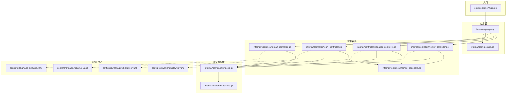
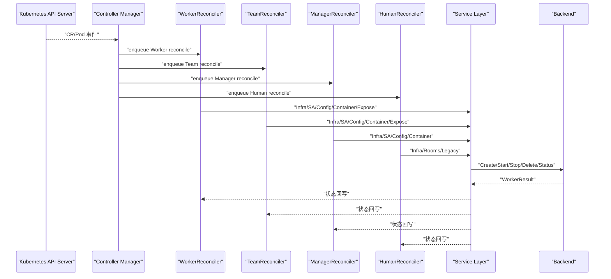
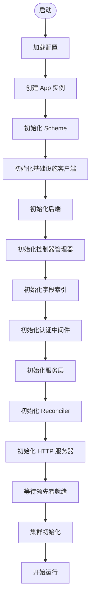
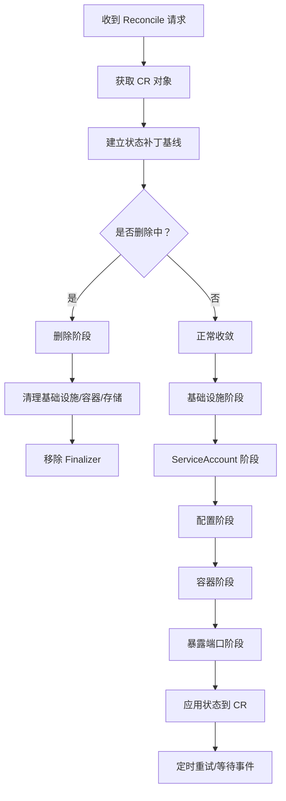
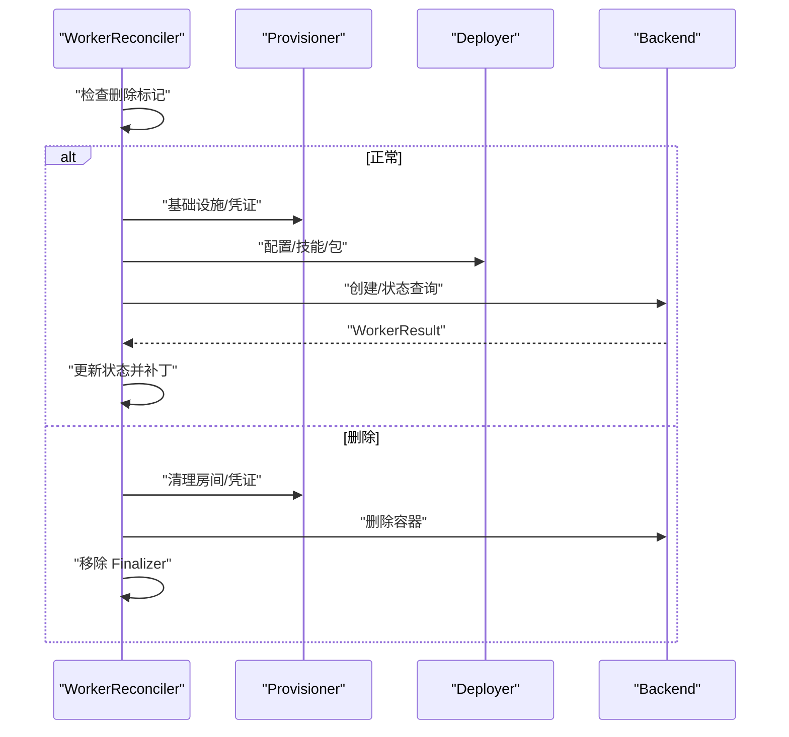
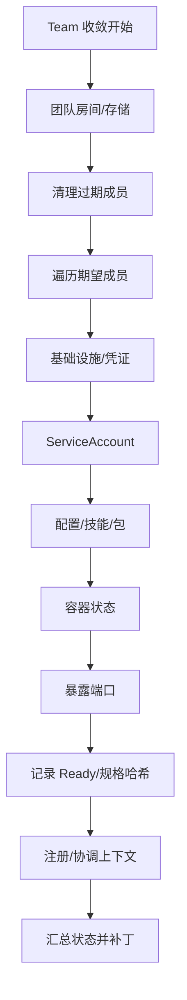
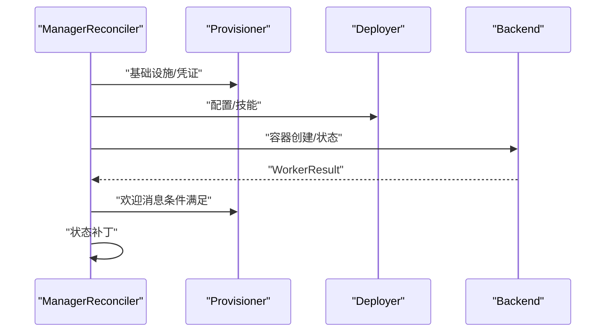
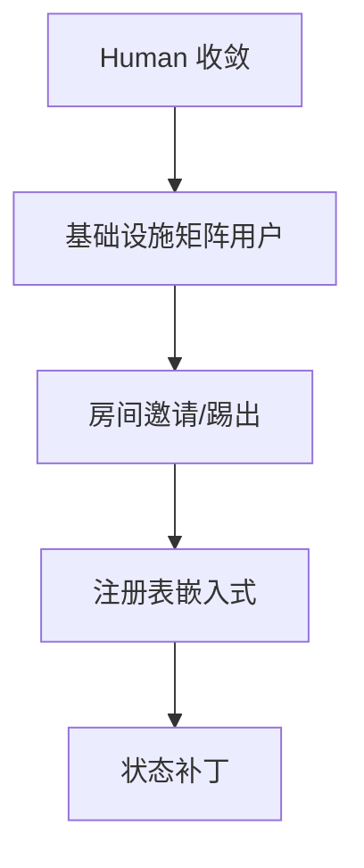
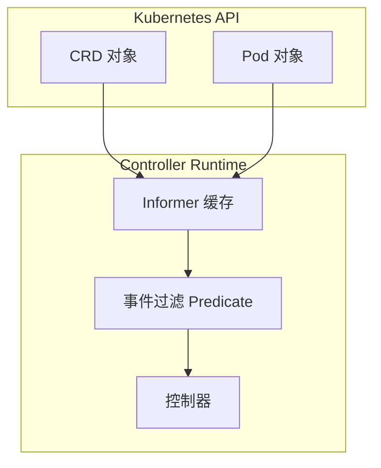
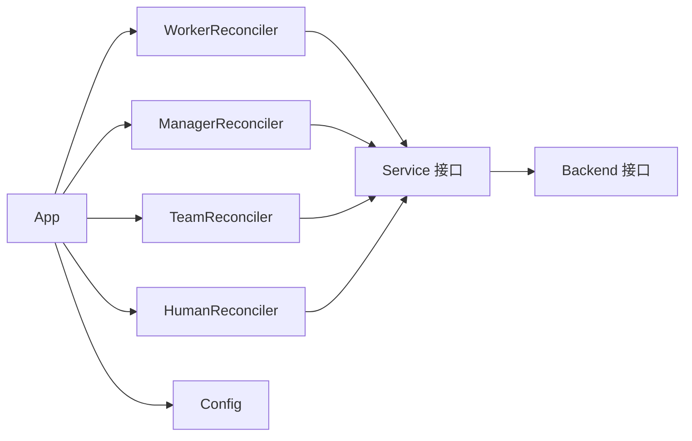

# 控制平面设计

<cite>
**本文档引用的文件**
- [main.go](file://hiclaw-controller/cmd/controller/main.go)
- [app.go](file://hiclaw-controller/internal/app/app.go)
- [config.go](file://hiclaw-controller/internal/config/config.go)
- [types.go](file://hiclaw-controller/api/v1beta1/types.go)
- [worker_controller.go](file://hiclaw-controller/internal/controller/worker_controller.go)
- [manager_controller.go](file://hiclaw-controller/internal/controller/manager_controller.go)
- [team_controller.go](file://hiclaw-controller/internal/controller/team_controller.go)
- [human_controller.go](file://hiclaw-controller/internal/controller/human_controller.go)
- [member_reconcile.go](file://hiclaw-controller/internal/controller/member_reconcile.go)
- [labels.go](file://hiclaw-controller/internal/controller/labels.go)
- [interfaces.go](file://hiclaw-controller/internal/service/interfaces.go)
- [interface.go](file://hiclaw-controller/internal/backend/interface.go)
- [workers.hiclaw.io.yaml](file://hiclaw-controller/config/crd/workers.hiclaw.io.yaml)
- [managers.hiclaw.io.yaml](file://hiclaw-controller/config/crd/managers.hiclaw.io.yaml)
- [teams.hiclaw.io.yaml](file://hiclaw-controller/config/crd/teams.hiclaw.io.yaml)
- [humans.hiclaw.io.yaml](file://hiclaw-controller/config/crd/humans.hiclaw.io.yaml)
</cite>

## 目录
1. [简介](#简介)
2. [项目结构](#项目结构)
3. [核心组件](#核心组件)
4. [架构总览](#架构总览)
5. [详细组件分析](#详细组件分析)
6. [依赖关系分析](#依赖关系分析)
7. [性能考虑](#性能考虑)
8. [故障排除指南](#故障排除指南)
9. [结论](#结论)

## 简介
本文件面向 HiClaw 控制平面的设计与实现，系统性阐述 hiclaw-controller 的职责边界、初始化流程、Reconciler 工作机制以及四种核心 CRD（Worker、Manager、Team、Human）的生命周期管理策略。文档重点覆盖以下方面：
- 控制器初始化与应用启动流程
- Reconciler 的分阶段收敛模型与错误处理
- 与 Kubernetes API Server 的交互模式（Informer/缓存）
- 事件驱动的资源管理与重试策略
- 与矩阵服务、网关、对象存储等基础设施的集成
- 多后端支持（Docker/Kubernetes）与标签合并策略

## 项目结构
hiclaw-controller 采用 controller-runtime 驱动的控制器模式，核心目录与职责如下：
- cmd/controller：入口程序，负责加载配置并启动应用
- internal/app：应用容器，负责依赖注入、组件装配与生命周期管理
- internal/config：配置解析与环境变量映射
- api/v1beta1：CRD 类型定义与 deepcopy 生成
- internal/controller：各 CRD 的 Reconciler 实现与共享成员协调逻辑
- internal/service：服务层抽象（凭证、部署、环境构建等）
- internal/backend：后端接口与运行时抽象（Docker/K8s）
- config/crd：CRD 定义文件

**图表来源**
- [main.go:16-36](file://hiclaw-controller/cmd/controller/main.go#L16-L36)
- [app.go:81-108](file://hiclaw-controller/internal/app/app.go#L81-L108)
- [worker_controller.go:311-342](file://hiclaw-controller/internal/controller/worker_controller.go#L311-L342)
- [manager_controller.go:162-188](file://hiclaw-controller/internal/controller/manager_controller.go#L162-L188)
- [team_controller.go:76-106](file://hiclaw-controller/internal/controller/team_controller.go#L76-L106)
- [human_controller.go:98-103](file://hiclaw-controller/internal/controller/human_controller.go#L98-L103)
- [interfaces.go:9-188](file://hiclaw-controller/internal/service/interfaces.go#L9-L188)
- [interface.go:179-210](file://hiclaw-controller/internal/backend/interface.go#L179-L210)
- [workers.hiclaw.io.yaml:1-84](file://hiclaw-controller/config/crd/workers.hiclaw.io.yaml#L1-L84)
- [managers.hiclaw.io.yaml:1-171](file://hiclaw-controller/config/crd/managers.hiclaw.io.yaml#L1-L171)
- [teams.hiclaw.io.yaml:1-120](file://hiclaw-controller/config/crd/teams.hiclaw.io.yaml#L1-L120)
- [humans.hiclaw.io.yaml:1-84](file://hiclaw-controller/config/crd/humans.hiclaw.io.yaml#L1-L84)

**章节来源**
- [main.go:16-36](file://hiclaw-controller/cmd/controller/main.go#L16-L36)
- [app.go:81-108](file://hiclaw-controller/internal/app/app.go#L81-L108)

## 核心组件
- 应用容器 App：集中管理依赖构建、组件装配与生命周期，按步骤初始化 Scheme、基础设施客户端、后端、控制器管理器、字段索引、认证中间件、服务层、Reconciler 与 HTTP 服务器。
- 配置 Config：从环境变量解析控制器运行所需的所有参数，涵盖网关/存储提供商选择、K8s 后端、默认运行时、控制器名称、嵌入式模式参数等。
- Reconciler：针对 Worker/Manager/Team/Human 的具体协调器，统一使用共享的成员协调流程（member_reconcile），确保一致的收敛行为。
- 服务层 Service：封装凭证发放、部署包与配置推送、环境变量构建、团队存储与协调上下文注入等。
- 后端 Backend：抽象 Worker 生命周期操作（创建/删除/启动/停止/状态查询），支持 Docker 与 Kubernetes 两种后端。

**章节来源**
- [app.go:41-79](file://hiclaw-controller/internal/app/app.go#L41-L79)
- [config.go:19-162](file://hiclaw-controller/internal/config/config.go#L19-L162)
- [interfaces.go:9-188](file://hiclaw-controller/internal/service/interfaces.go#L9-L188)
- [interface.go:179-210](file://hiclaw-controller/internal/backend/interface.go#L179-L210)

## 架构总览
hiclaw-controller 基于 controller-runtime 构建，采用“声明式收敛”的 Reconciler 模式。其关键特性包括：
- 事件驱动：通过 Informer 缓存监听 CR 与 Pod 变更，触发 Reconciler 协调。
- 多后端：通过 Backend 接口屏蔽 Docker 与 Kubernetes 的差异。
- 分层服务：Provisioner/Deployer/EnvBuilder 等服务层解耦基础设施细节。
- 标签合并：统一的标签合并策略保证 Pod 标识的一致性与可预测性。
- 认证与授权：基于 K8s ServiceAccount Token Review 的鉴权中间件。

**图表来源**
- [app.go:518-631](file://hiclaw-controller/internal/app/app.go#L518-L631)
- [worker_controller.go:57-104](file://hiclaw-controller/internal/controller/worker_controller.go#L57-L104)
- [team_controller.go:76-106](file://hiclaw-controller/internal/controller/team_controller.go#L76-L106)
- [manager_controller.go:72-124](file://hiclaw-controller/internal/controller/manager_controller.go#L72-L124)
- [human_controller.go:29-81](file://hiclaw-controller/internal/controller/human_controller.go#L29-L81)
- [member_reconcile.go:142-192](file://hiclaw-controller/internal/controller/member_reconcile.go#L142-L192)
- [interface.go:195-209](file://hiclaw-controller/internal/backend/interface.go#L195-L209)

## 详细组件分析

### 初始化流程与应用启动
- 入口程序加载配置并创建应用实例，随后按序执行初始化步骤：注册 Scheme、构建基础设施客户端、后端、控制器管理器、字段索引、认证中间件、服务层、Reconciler、HTTP 服务器。
- 在嵌入式模式下，启动本地 etcd 与 kube-apiserver，并创建 controller-runtime Manager；在集群模式下，使用 in-cluster 配置并启用 LeaderElection。
- 领先者当选后执行集群初始化（如网关、矩阵、对象存储初始化），并在嵌入式模式下生成管理员 CLI 令牌。

**图表来源**
- [main.go:16-36](file://hiclaw-controller/cmd/controller/main.go#L16-L36)
- [app.go:81-108](file://hiclaw-controller/internal/app/app.go#L81-L108)
- [app.go:111-175](file://hiclaw-controller/internal/app/app.go#L111-L175)
- [app.go:519-631](file://hiclaw-controller/internal/app/app.go#L519-L631)

**章节来源**
- [main.go:16-36](file://hiclaw-controller/cmd/controller/main.go#L16-L36)
- [app.go:81-108](file://hiclaw-controller/internal/app/app.go#L81-L108)
- [app.go:111-175](file://hiclaw-controller/internal/app/app.go#L111-L175)
- [app.go:519-631](file://hiclaw-controller/internal/app/app.go#L519-L631)

### Reconciler 工作原理与共享成员协调
- WorkerReconciler/ManagerReconciler/TeamReconciler/HumanReconciler 统一遵循“延迟状态补丁”模式：在 defer 中根据最终结果计算 Phase/ObservedGeneration/Message 并一次性 Patch，避免无限循环。
- 成员协调（MemberReconcile）将收敛过程拆分为多个阶段：基础设施（矩阵用户/房间/凭证）、ServiceAccount、配置（包/内联配置/代理配置/技能）、容器（运行/睡眠/停止）、暴露端口。
- Pod 事件过滤：通过 Predicate 仅响应与控制器实例相关的 Pod 生命周期事件，避免跨实例交叉触发。

**图表来源**
- [worker_controller.go:57-104](file://hiclaw-controller/internal/controller/worker_controller.go#L57-L104)
- [manager_controller.go:72-124](file://hiclaw-controller/internal/controller/manager_controller.go#L72-L124)
- [team_controller.go:76-106](file://hiclaw-controller/internal/controller/team_controller.go#L76-L106)
- [human_controller.go:29-81](file://hiclaw-controller/internal/controller/human_controller.go#L29-L81)
- [member_reconcile.go:142-192](file://hiclaw-controller/internal/controller/member_reconcile.go#L142-L192)
- [member_reconcile.go:242-320](file://hiclaw-controller/internal/controller/member_reconcile.go#L242-L320)

**章节来源**
- [worker_controller.go:57-104](file://hiclaw-controller/internal/controller/worker_controller.go#L57-L104)
- [manager_controller.go:72-124](file://hiclaw-controller/internal/controller/manager_controller.go#L72-L124)
- [team_controller.go:76-106](file://hiclaw-controller/internal/controller/team_controller.go#L76-L106)
- [human_controller.go:29-81](file://hiclaw-controller/internal/controller/human_controller.go#L29-L81)
- [member_reconcile.go:142-192](file://hiclaw-controller/internal/controller/member_reconcile.go#L142-L192)

### Worker 生命周期管理
- 创建：添加 Finalizer，执行基础设施、ServiceAccount、配置、容器创建与暴露端口阶段，记录 Phase/状态信息。
- 更新：当 Generation 与 ObservedGeneration 不一致或成员规格变更时，重建容器；睡眠/停止状态下根据后端能力进行启动或删除。
- 删除：清理房间/凭证/容器/存储，移除 Finalizer。

**图表来源**
- [worker_controller.go:110-151](file://hiclaw-controller/internal/controller/worker_controller.go#L110-L151)
- [worker_controller.go:156-192](file://hiclaw-controller/internal/controller/worker_controller.go#L156-L192)
- [member_reconcile.go:242-320](file://hiclaw-controller/internal/controller/member_reconcile.go#L242-L320)

**章节来源**
- [worker_controller.go:110-151](file://hiclaw-controller/internal/controller/worker_controller.go#L110-L151)
- [worker_controller.go:156-192](file://hiclaw-controller/internal/controller/worker_controller.go#L156-L192)

### Team 生命周期管理
- 团队级基础设施：为团队领导者与成员创建房间、共享存储。
- 成员清理：对比期望成员与已存在成员，清理不再期望的成员。
- 成员收敛：逐个成员执行基础设施、ServiceAccount、配置、容器、暴露端口阶段；记录每个成员的 Ready 状态与规格哈希。
- 注册与协调：向 Manager 注入协调上下文，更新注册表。

**图表来源**
- [team_controller.go:114-305](file://hiclaw-controller/internal/controller/team_controller.go#L114-L305)
- [team_controller.go:307-351](file://hiclaw-controller/internal/controller/team_controller.go#L307-L351)
- [team_controller.go:353-387](file://hiclaw-controller/internal/controller/team_controller.go#L353-L387)

**章节来源**
- [team_controller.go:114-305](file://hiclaw-controller/internal/controller/team_controller.go#L114-L305)
- [team_controller.go:307-351](file://hiclaw-controller/internal/controller/team_controller.go#L307-L351)

### Manager 生命周期管理
- 基础设施：确保 ServiceAccount，准备凭证与网关消费者。
- 配置：推送包、内联配置、代理配置与技能。
- 容器：创建/启动/停止/删除 Manager 容器。
- 欢迎消息：在 Manager 加入管理员 DM 且网关认证生效后发送首次引导消息。

**图表来源**
- [manager_controller.go:128-160](file://hiclaw-controller/internal/controller/manager_controller.go#L128-L160)
- [manager_controller.go:162-188](file://hiclaw-controller/internal/controller/manager_controller.go#L162-L188)

**章节来源**
- [manager_controller.go:128-160](file://hiclaw-controller/internal/controller/manager_controller.go#L128-L160)
- [manager_controller.go:162-188](file://hiclaw-controller/internal/controller/manager_controller.go#L162-L188)

### Human 生命周期管理
- 基础设施：确保矩阵用户。
- 房间：根据权限授予邀请/踢出，保持房间集合与权限一致。
- 注册表：在嵌入式模式下维护人类注册表。

**图表来源**
- [human_controller.go:88-96](file://hiclaw-controller/internal/controller/human_controller.go#L88-L96)

**章节来源**
- [human_controller.go:88-96](file://hiclaw-controller/internal/controller/human_controller.go#L88-L96)

### 错误处理机制、重试策略与故障恢复
- 延迟状态补丁：在 defer 中统一写入 Phase/ObservedGeneration/Message，避免失败时触发无限重入。
- 成员级错误聚合：TeamReconciler 将成员级错误收集后写入状态，降低整体重试频率。
- Pod 事件过滤：Predicate 仅响应特定标签与控制器实例的 Pod 事件，减少无效重试。
- 后端不可用降级：当 Backend 未检测到可用后端时，记录日志并保持稳定状态，避免频繁重试。
- 重试间隔：常规重试间隔与失败重试间隔区分，失败时缩短重试间隔以加速恢复。

**章节来源**
- [worker_controller.go:71-86](file://hiclaw-controller/internal/controller/worker_controller.go#L71-L86)
- [team_controller.go:289-298](file://hiclaw-controller/internal/controller/team_controller.go#L289-L298)
- [member_reconcile.go:322-340](file://hiclaw-controller/internal/controller/member_reconcile.go#L322-L340)

### 与 Kubernetes API Server 的交互与 Informer 模式
- 控制器管理器：创建并运行 controller-runtime Manager，内置 LeaderElection、Metrics、Cache 等。
- Informer 缓存：通过 Label 选择器将缓存限定到当前控制器实例，避免跨实例交叉触发。
- Pod Watch：Worker/Manager 控制器为独立 Pod 资源注册 Watch，结合 Predicate 过滤生命周期事件。
- 字段索引：为 Team 的领导者与成员名建立索引，便于快速反查团队归属。

**图表来源**
- [app.go:598-631](file://hiclaw-controller/internal/app/app.go#L598-L631)
- [worker_controller.go:311-342](file://hiclaw-controller/internal/controller/worker_controller.go#L311-L342)
- [manager_controller.go:162-188](file://hiclaw-controller/internal/controller/manager_controller.go#L162-L188)
- [app.go:298-336](file://hiclaw-controller/internal/app/app.go#L298-L336)

**章节来源**
- [app.go:598-631](file://hiclaw-controller/internal/app/app.go#L598-L631)
- [worker_controller.go:311-342](file://hiclaw-controller/internal/controller/worker_controller.go#L311-L342)
- [manager_controller.go:162-188](file://hiclaw-controller/internal/controller/manager_controller.go#L162-L188)
- [app.go:298-336](file://hiclaw-controller/internal/app/app.go#L298-L336)

### 标签合并与 Pod 标识一致性
- 四层标签合并顺序：Pod 模板 Overlay → CR metadata.labels → CR spec.labels → 控制器系统标签（最高优先级，保留键覆盖）。
- Team 成员通过统一的 MemberContext 构建 Pod 标签集，确保控制器实例隔离与角色标识一致。

**章节来源**
- [labels.go:3-38](file://hiclaw-controller/internal/controller/labels.go#L3-L38)
- [team_controller.go:644-730](file://hiclaw-controller/internal/controller/team_controller.go#L644-L730)
- [worker_controller.go:239-271](file://hiclaw-controller/internal/controller/worker_controller.go#L239-L271)

## 依赖关系分析
- 组件耦合：Reconciler 仅依赖 Service 层接口，Service 层再依赖 Backend 接口，形成清晰的分层依赖。
- 外部依赖：controller-runtime、Kubernetes API、第三方网关/存储 SDK。
- 循环依赖：未发现直接循环依赖；标签合并与成员协调逻辑集中在 controller 包内，避免跨包循环。

**图表来源**
- [interfaces.go:9-188](file://hiclaw-controller/internal/service/interfaces.go#L9-L188)
- [interface.go:179-210](file://hiclaw-controller/internal/backend/interface.go#L179-L210)
- [app.go:432-497](file://hiclaw-controller/internal/app/app.go#L432-L497)

**章节来源**
- [interfaces.go:9-188](file://hiclaw-controller/internal/service/interfaces.go#L9-L188)
- [interface.go:179-210](file://hiclaw-controller/internal/backend/interface.go#L179-L210)
- [app.go:432-497](file://hiclaw-controller/internal/app/app.go#L432-L497)

## 性能考虑
- 事件驱动与批量补丁：通过一次性状态补丁减少 API 写入次数，降低缓存抖动。
- 后端可用性检测：在 Backend 未就绪时短时间退避，避免无效重试。
- 标签选择器与字段索引：缩小 Informer 视野，减少不必要的事件处理。
- 资源请求与限制：Manager 资源需求通过配置注入，避免过度占用集群资源。

## 故障排除指南
- Reconcile 循环卡住：检查状态补丁是否成功，确认 Phase/ObservedGeneration 是否正确更新。
- Pod 事件不触发：确认控制器实例标签与 Pod 标签匹配，检查 Predicate 过滤条件。
- Backend 不可用：查看后端可用性检测日志，确认容器/网络/凭证配置。
- 权限问题：核对 ServiceAccount 与 RBAC 设置，确认凭证发放与网关消费者同步。

**章节来源**
- [worker_controller.go:71-86](file://hiclaw-controller/internal/controller/worker_controller.go#L71-L86)
- [app.go:598-631](file://hiclaw-controller/internal/app/app.go#L598-L631)
- [member_reconcile.go:260-320](file://hiclaw-controller/internal/controller/member_reconcile.go#L260-L320)

## 结论
hiclaw-controller 通过清晰的分层架构与声明式收敛模型，实现了对 Worker、Manager、Team、Human 四类资源的全生命周期管理。其关键优势在于：
- 事件驱动与可预测的状态补丁，确保收敛稳定性
- 统一的成员协调流程，简化多资源一致性保障
- 多后端与多提供商抽象，提升部署灵活性
- 严格的标签与字段索引策略，增强可观测性与可维护性