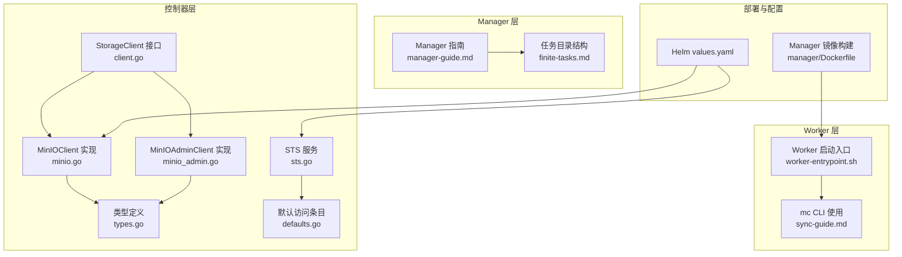
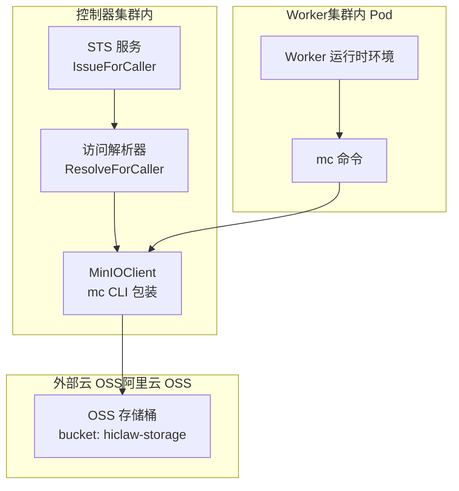
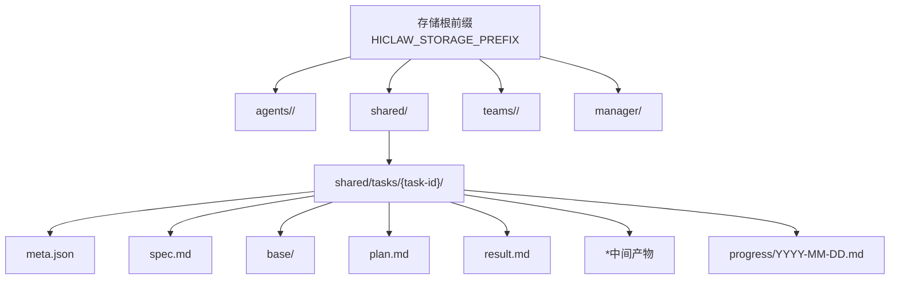
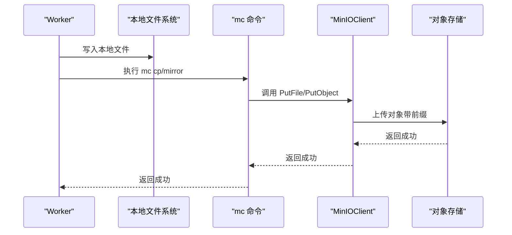
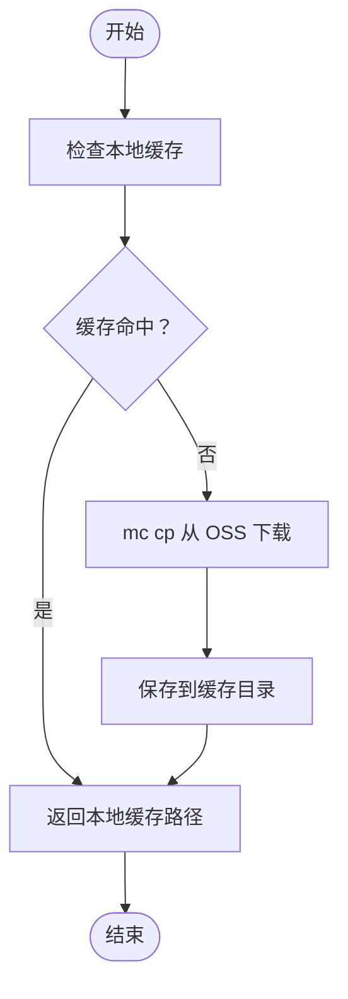
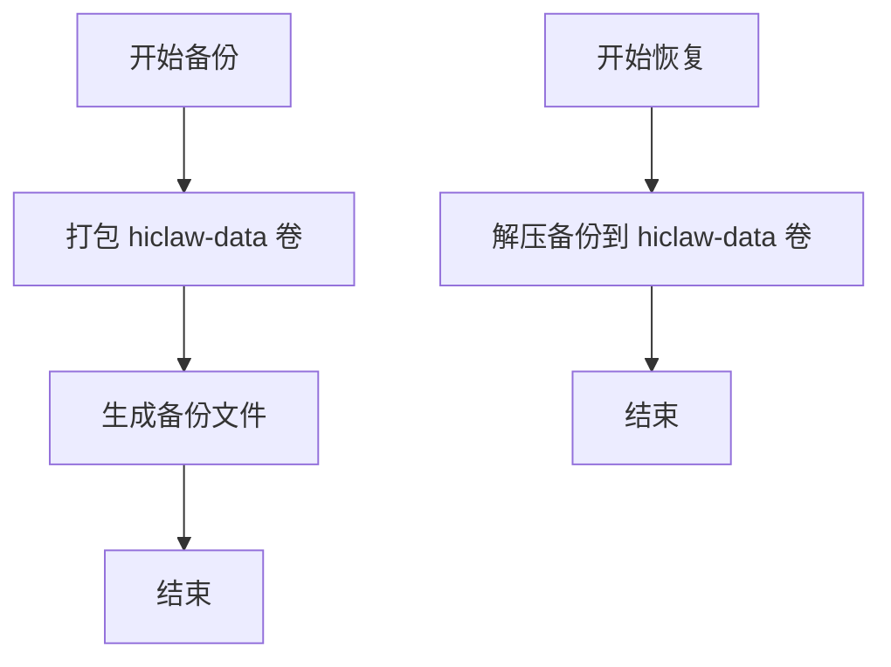
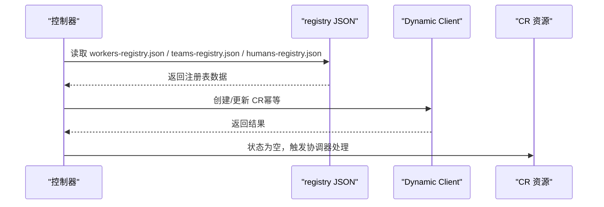
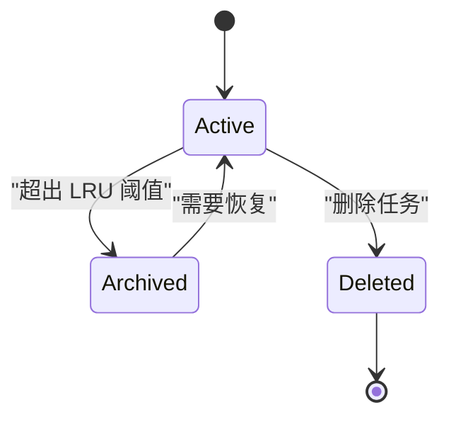
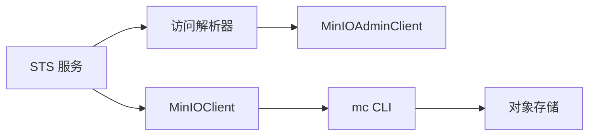

# 存储数据流

<cite>
**本文引用的文件**
- [hiclaw-controller/internal/oss/client.go](file://hiclaw-controller/internal/oss/client.go)
- [hiclaw-controller/internal/oss/minio.go](file://hiclaw-controller/internal/oss/minio.go)
- [hiclaw-controller/internal/oss/minio_admin.go](file://hiclaw-controller/internal/oss/minio_admin.go)
- [hiclaw-controller/internal/oss/types.go](file://hiclaw-controller/internal/oss/types.go)
- [hiclaw-controller/internal/accessresolver/defaults.go](file://hiclaw-controller/internal/accessresolver/defaults.go)
- [hiclaw-controller/internal/credentials/sts.go](file://hiclaw-controller/internal/credentials/sts.go)
- [hiclaw-controller/internal/executor/package.go](file://hiclaw-controller/internal/executor/package.go)
- [worker/scripts/worker-entrypoint.sh](file://worker/scripts/worker-entrypoint.sh)
- [manager/agent/skills/file-sync-management/references/sync-guide.md](file://manager/agent/skills/file-sync-management/references/sync-guide.md)
- [manager/agent/skills/task-management/references/finite-tasks.md](file://manager/agent/skills/task-management/references/finite-tasks.md)
- [docs/manager-guide.md](file://docs/manager-guide.md)
- [helm/hiclaw/values.yaml](file://helm/hiclaw/values.yaml)
- [manager/Dockerfile](file://manager/Dockerfile)
</cite>

## 目录
1. [简介](#简介)
2. [项目结构](#项目结构)
3. [核心组件](#核心组件)
4. [架构总览](#架构总览)
5. [详细组件分析](#详细组件分析)
6. [依赖分析](#依赖分析)
7. [性能考虑](#性能考虑)
8. [故障排查指南](#故障排查指南)
9. [结论](#结论)
10. [附录](#附录)

## 简介
本文件面向 HiClaw 的存储数据流，系统性阐述对象存储中的数据组织结构、写入与读取流程、访问权限控制、缓存与预加载策略、备份与恢复、迁移与版本管理、生命周期管理以及性能优化与容量规划建议。文档基于仓库内的控制器、Worker、Manager 与 Helm 部署配置等源码与文档进行归纳总结，帮助技术与非技术读者理解并安全地运维对象存储。

## 项目结构
HiClaw 的对象存储由控制器抽象出统一接口，并通过 MinIO 客户端与 mc CLI 交互；在嵌入式模式下，控制器还负责用户与策略管理；在外部云 OSS 模式下，控制器通过 STS 获取临时凭证，避免长期密钥暴露。Worker 与 Manager 通过 mc 命令进行同步与拉取，任务数据采用共享目录树结构，支持多 Worker 并行协作与审计追踪。

**图表来源**
- [hiclaw-controller/internal/oss/client.go:1-54](file://hiclaw-controller/internal/oss/client.go#L1-L54)
- [hiclaw-controller/internal/oss/minio.go:1-268](file://hiclaw-controller/internal/oss/minio.go#L1-L268)
- [hiclaw-controller/internal/oss/minio_admin.go:1-191](file://hiclaw-controller/internal/oss/minio_admin.go#L1-L191)
- [hiclaw-controller/internal/oss/types.go:1-53](file://hiclaw-controller/internal/oss/types.go#L1-L53)
- [hiclaw-controller/internal/credentials/sts.go:1-90](file://hiclaw-controller/internal/credentials/sts.go#L1-L90)
- [hiclaw-controller/internal/accessresolver/defaults.go:25-100](file://hiclaw-controller/internal/accessresolver/defaults.go#L25-L100)
- [worker/scripts/worker-entrypoint.sh:35-62](file://worker/scripts/worker-entrypoint.sh#L35-L62)
- [manager/agent/skills/file-sync-management/references/sync-guide.md:1-41](file://manager/agent/skills/file-sync-management/references/sync-guide.md#L1-L41)
- [manager/agent/skills/task-management/references/finite-tasks.md:99-110](file://manager/agent/skills/task-management/references/finite-tasks.md#L99-L110)
- [docs/manager-guide.md:218-250](file://docs/manager-guide.md#L218-L250)
- [helm/hiclaw/values.yaml:72-111](file://helm/hiclaw/values.yaml#L72-L111)
- [manager/Dockerfile:17-31](file://manager/Dockerfile#L17-L31)

**章节来源**
- [hiclaw-controller/internal/oss/client.go:1-54](file://hiclaw-controller/internal/oss/client.go#L1-L54)
- [hiclaw-controller/internal/oss/minio.go:1-268](file://hiclaw-controller/internal/oss/minio.go#L1-L268)
- [hiclaw-controller/internal/oss/minio_admin.go:1-191](file://hiclaw-controller/internal/oss/minio_admin.go#L1-L191)
- [hiclaw-controller/internal/oss/types.go:1-53](file://hiclaw-controller/internal/oss/types.go#L1-L53)
- [hiclaw-controller/internal/credentials/sts.go:1-90](file://hiclaw-controller/internal/credentials/sts.go#L1-L90)
- [hiclaw-controller/internal/accessresolver/defaults.go:25-100](file://hiclaw-controller/internal/accessresolver/defaults.go#L25-L100)
- [worker/scripts/worker-entrypoint.sh:35-62](file://worker/scripts/worker-entrypoint.sh#L35-L62)
- [manager/agent/skills/file-sync-management/references/sync-guide.md:1-41](file://manager/agent/skills/file-sync-management/references/sync-guide.md#L1-L41)
- [manager/agent/skills/task-management/references/finite-tasks.md:99-110](file://manager/agent/skills/task-management/references/finite-tasks.md#L99-L110)
- [docs/manager-guide.md:218-250](file://docs/manager-guide.md#L218-L250)
- [helm/hiclaw/values.yaml:72-111](file://helm/hiclaw/values.yaml#L72-L111)
- [manager/Dockerfile:17-31](file://manager/Dockerfile#L17-L31)

## 核心组件
- 对象存储客户端接口与实现
  - StorageClient 抽象 PutObject/PutFile/GetObject/Stat/DeleteObject/Mirror/ListObjects/DeletePrefix 等操作，屏蔽底层差异。
  - MinIOClient 基于 mc CLI，支持静态与动态两种凭证模式；动态模式用于外部云 OSS 的 STS 令牌轮换。
  - MinIOAdminClient 负责嵌入式 MinIO 的用户与策略管理。
- 访问控制与权限
  - 默认访问条目为 Worker/Leader/Manager 分别生成最小权限范围，覆盖 agents/<name>/*、shared/* 与 teams/<team>/* 等前缀。
  - STS 服务根据调用者身份解析 AccessEntries，下发带内联策略的临时凭证。
- 数据目录与任务树
  - Worker 工作空间 agents/<name>/ 下存放自身配置与输出；shared/ 作为跨 Worker 共享区；teams/<team>/ 支持团队协作。
  - 任务目录 shared/tasks/{task-id}/ 下包含 meta.json、spec.md、base/、plan.md、result.md 与中间产物。
- 同步与镜像
  - Worker 启动时通过 mc mirror 拉取 agents/<name>/ 与 shared/；写入完成后通过 mc cp/mirror 推送并通知 Worker 执行同步。
- 包解析与缓存
  - PackageResolver 将来自 OSS 的包按内容寻址缓存，避免重复下载；支持本地文件与 HTTP 下载回退。

**章节来源**
- [hiclaw-controller/internal/oss/client.go:1-54](file://hiclaw-controller/internal/oss/client.go#L1-L54)
- [hiclaw-controller/internal/oss/minio.go:13-268](file://hiclaw-controller/internal/oss/minio.go#L13-L268)
- [hiclaw-controller/internal/oss/minio_admin.go:13-191](file://hiclaw-controller/internal/oss/minio_admin.go#L13-L191)
- [hiclaw-controller/internal/accessresolver/defaults.go:25-100](file://hiclaw-controller/internal/accessresolver/defaults.go#L25-L100)
- [hiclaw-controller/internal/credentials/sts.go:29-90](file://hiclaw-controller/internal/credentials/sts.go#L29-L90)
- [worker/scripts/worker-entrypoint.sh:35-62](file://worker/scripts/worker-entrypoint.sh#L35-L62)
- [manager/agent/skills/task-management/references/finite-tasks.md:99-110](file://manager/agent/skills/task-management/references/finite-tasks.md#L99-L110)
- [hiclaw-controller/internal/executor/package.go:416-435](file://hiclaw-controller/internal/executor/package.go#L416-L435)

## 架构总览
对象存储在 HiClaw 中承担以下角色：
- 统一的数据中心：集中存放 Worker 配置、共享资源、任务数据与审计日志。
- 权限边界：通过前缀与内联策略限制 Worker/Manager 的访问范围。
- 同步枢纽：Worker 与 Manager 通过 mc 命令与存储交互，确保一致性。
- 凭证安全：外部云 OSS 使用 STS 临时凭证，降低密钥泄露风险。

**图表来源**
- [hiclaw-controller/internal/credentials/sts.go:63-89](file://hiclaw-controller/internal/credentials/sts.go#L63-L89)
- [hiclaw-controller/internal/accessresolver/defaults.go:25-100](file://hiclaw-controller/internal/accessresolver/defaults.go#L25-L100)
- [hiclaw-controller/internal/oss/minio.go:203-226](file://hiclaw-controller/internal/oss/minio.go#L203-L226)
- [worker/scripts/worker-entrypoint.sh:35-62](file://worker/scripts/worker-entrypoint.sh#L35-L62)

## 详细组件分析

### 数据组织结构
- 工作空间目录布局
  - agents/<worker-name>/：Worker 自身配置与输出，受 agents/<name>/* 前缀策略保护。
  - shared/：跨 Worker 共享数据，受 shared/* 前缀策略保护。
  - teams/<team-name>/：团队协作数据，受 teams/<team>/* 前缀策略保护。
  - manager/：Manager 特有工作区，受 manager/* 前缀策略保护。
- 任务树结构
  - shared/tasks/{task-id}/：任务生命周期数据，包含 meta.json、spec.md、base/、plan.md、result.md 与中间产物。
  - progress/YYYY-MM-DD.md：每日进度日志，用于审计与会话重置后的上下文恢复。

**图表来源**
- [hiclaw-controller/internal/accessresolver/defaults.go:35-47](file://hiclaw-controller/internal/accessresolver/defaults.go#L35-L47)
- [hiclaw-controller/internal/accessresolver/defaults.go:65-78](file://hiclaw-controller/internal/accessresolver/defaults.go#L65-L78)
- [hiclaw-controller/internal/accessresolver/defaults.go:86-99](file://hiclaw-controller/internal/accessresolver/defaults.go#L86-L99)
- [manager/agent/skills/task-management/references/finite-tasks.md:99-110](file://manager/agent/skills/task-management/references/finite-tasks.md#L99-L110)

**章节来源**
- [hiclaw-controller/internal/accessresolver/defaults.go:25-100](file://hiclaw-controller/internal/accessresolver/defaults.go#L25-L100)
- [manager/agent/skills/task-management/references/finite-tasks.md:99-110](file://manager/agent/skills/task-management/references/finite-tasks.md#L99-L110)

### 数据写入流程
- 文件上传
  - Worker 写入本地 /root/hiclaw-fs/ 后，使用 mc cp/mirror 推送到 HICLAW_STORAGE_PREFIX 对应前缀。
  - 控制器侧通过 MinIOClient.PutFile/PutObject 提供统一上传能力；在外部云 OSS 模式下，使用 STS 动态凭证。
- 元数据管理
  - 任务元数据（meta.json）、规范（spec.md）、计划（plan.md）、结果（result.md）与每日进度日志（progress/*.md）在共享目录维护。
- 访问权限控制
  - 默认访问条目为 Worker/Leader/Manager 分配 agents/<name>/*、shared/* 与 teams/<team>/* 的只读/读写权限；Manager 额外拥有 manager/* 权限。
  - STS 服务根据调用者身份解析 AccessEntries，下发带内联策略的临时凭证，避免硬编码密钥。

**图表来源**
- [hiclaw-controller/internal/oss/minio.go:92-98](file://hiclaw-controller/internal/oss/minio.go#L92-L98)
- [hiclaw-controller/internal/oss/minio.go:203-226](file://hiclaw-controller/internal/oss/minio.go#L203-L226)
- [manager/agent/skills/file-sync-management/references/sync-guide.md:24-34](file://manager/agent/skills/file-sync-management/references/sync-guide.md#L24-L34)

**章节来源**
- [hiclaw-controller/internal/oss/minio.go:73-98](file://hiclaw-controller/internal/oss/minio.go#L73-L98)
- [hiclaw-controller/internal/oss/minio.go:203-226](file://hiclaw-controller/internal/oss/minio.go#L203-L226)
- [hiclaw-controller/internal/credentials/sts.go:63-89](file://hiclaw-controller/internal/credentials/sts.go#L63-L89)
- [hiclaw-controller/internal/accessresolver/defaults.go:25-100](file://hiclaw-controller/internal/accessresolver/defaults.go#L25-L100)
- [manager/agent/skills/file-sync-management/references/sync-guide.md:24-34](file://manager/agent/skills/file-sync-management/references/sync-guide.md#L24-L34)

### 数据读取与缓存策略
- 读取流程
  - Worker 启动时通过 mc mirror 拉取 agents/<name>/ 与 shared/ 到本地工作空间；写入完成后推送并通知 Worker 执行同步。
  - Manager 通过 mc mirror 从 shared/tasks/{task-id}/ 拉取任务输出，读取 result.md 与 progress 日志。
- 缓存与预加载
  - PackageResolver 对来自 OSS 的包进行内容寻址缓存（文件名包含 MD5），命中则直接返回本地缓存，避免重复下载。
  - Worker 通过 .last-pull 标记避免将刚拉取的文件再次推回，减少冗余同步。

**图表来源**
- [hiclaw-controller/internal/executor/package.go:416-435](file://hiclaw-controller/internal/executor/package.go#L416-L435)

**章节来源**
- [worker/scripts/worker-entrypoint.sh:51-62](file://worker/scripts/worker-entrypoint.sh#L51-L62)
- [hiclaw-controller/internal/executor/package.go:416-435](file://hiclaw-controller/internal/executor/package.go#L416-L435)

### 备份与恢复流程
- 备份
  - 使用 Docker 卷 hiclaw-data 进行全量打包备份，包含 MinIO 存储、Tuwunel 数据库与 Higress 配置。
- 恢复
  - 通过 tar 解压恢复至 hiclaw-data 卷，完成系统级恢复。
- 备份粒度建议
  - 业务层面可结合共享存储前缀（agents/shared/teams/manager）进行增量备份与快照策略。

**图表来源**
- [docs/manager-guide.md:226-238](file://docs/manager-guide.md#L226-L238)

**章节来源**
- [docs/manager-guide.md:218-250](file://docs/manager-guide.md#L218-L250)
- [docs/manager-guide.md:226-238](file://docs/manager-guide.md#L226-L238)

### 数据迁移与版本管理
- 迁移机制
  - 启动时控制器将 registry JSON（workers-registry.json、teams-registry.json、humans-registry.json）转换为 CR，实现从 v1.0.x 到 v1beta1 的平滑迁移。
  - 迁移逻辑幂等：先加载 registry，再与 CR 状态比对，缺失即创建，已存在则不触碰。
- 版本管理
  - 迁移标记 agents/manager/.migration-v1beta1-done 用于标识迁移完成状态，避免重复迁移。
- 迁移脚本
  - 通过控制器内置迁移器与 CRD 协调器配合，自动完成 Worker/Team/Human 的注册与资源创建。

**图表来源**
- [hiclaw-controller/internal/migration/registry_migration.go:25-72](file://hiclaw-controller/internal/migration/registry_migration.go#L25-L72)

**章节来源**
- [hiclaw-controller/internal/migration/registry_migration.go:25-72](file://hiclaw-controller/internal/migration/registry_migration.go#L25-L72)
- [hiclaw-controller/internal/migration/registry_migration.go:174-202](file://hiclaw-controller/internal/migration/registry_migration.go#L174-L202)

### 生命周期管理
- 清理与销毁
  - 删除 Manager 时，控制器调用 LeaveAllManagerRooms、删除房间、反配置 Manager、删除容器并清理 OSS 数据（最终化流程）。
- 归档与保留
  - 任务历史采用 LRU 策略，超过阈值的历史条目归档至 history-tasks/{task-id}.json，便于长期保留与检索。
- 会话重置恢复
  - 通过 task-history.json 与 progress 日志重建上下文，保证任务在重启后可继续执行。

**图表来源**
- [docs/manager-guide.md:139-147](file://docs/manager-guide.md#L139-L147)

**章节来源**
- [hiclaw-controller/internal/controller/manager_reconcile_delete.go:13-39](file://hiclaw-controller/internal/controller/manager_reconcile_delete.go#L13-L39)
- [docs/manager-guide.md:129-147](file://docs/manager-guide.md#L129-L147)

## 依赖分析
- 组件耦合
  - StorageClient 与 MinIOClient 解耦，便于替换为 S3Client 等实现。
  - STS 服务依赖访问解析器与凭证提供方，形成清晰的职责边界。
- 外部依赖
  - mc CLI 作为统一后端，屏蔽不同对象存储的差异。
  - Helm values.yaml 定义存储提供商与模式（embedded vs external），影响控制器行为（是否创建用户/策略、是否使用 STS）。

**图表来源**
- [hiclaw-controller/internal/credentials/sts.go:63-89](file://hiclaw-controller/internal/credentials/sts.go#L63-L89)
- [hiclaw-controller/internal/oss/minio_admin.go:57-94](file://hiclaw-controller/internal/oss/minio_admin.go#L57-L94)
- [hiclaw-controller/internal/oss/minio.go:203-226](file://hiclaw-controller/internal/oss/minio.go#L203-L226)
- [helm/hiclaw/values.yaml:72-111](file://helm/hiclaw/values.yaml#L72-L111)

**章节来源**
- [hiclaw-controller/internal/credentials/sts.go:1-90](file://hiclaw-controller/internal/credentials/sts.go#L1-L90)
- [hiclaw-controller/internal/oss/minio_admin.go:1-191](file://hiclaw-controller/internal/oss/minio_admin.go#L1-L191)
- [hiclaw-controller/internal/oss/minio.go:1-268](file://hiclaw-controller/internal/oss/minio.go#L1-L268)
- [helm/hiclaw/values.yaml:72-111](file://helm/hiclaw/values.yaml#L72-L111)

## 性能考虑
- 传输与并发
  - mc mirror 支持覆盖与排除规则，建议在 Worker 启动阶段排除不必要的子目录（如矩阵缓存）以减少同步开销。
  - 对大文件与批量任务，优先使用 mc mirror 并行传输，结合本地缓存减少重复下载。
- 缓存策略
  - PackageResolver 的内容寻址缓存可显著降低重复下载成本；建议定期清理过期缓存以释放磁盘。
- 权限与网络
  - 外部云 OSS 使用 STS 令牌，建议缩短令牌有效期并启用轮换，平衡安全性与性能。
  - 在大规模场景下，建议为对象存储配置就近接入与 CDN 加速（若云厂商支持）。

[本节为通用指导，无需特定文件来源]

## 故障排查指南
- 无法连接对象存储
  - 检查 HICLAW_FS_ENDPOINT、HICLAW_FS_ACCESS_KEY、HICLAW_FS_SECRET_KEY 环境变量；确认 mc alias 设置正确。
  - 若使用 STS，确认 credential-provider 服务可用且返回有效令牌。
- 权限不足
  - 确认 AccessEntries 是否包含 agents/<name>/*、shared/*、teams/<team>/* 与 manager/* 前缀；必要时调整默认条目。
- 同步异常
  - Worker 启动后未拉取到最新数据：检查 mc mirror 参数与排除规则；确认 .last-pull 标记未阻断回推。
- 备份与恢复
  - 备份失败：检查 hiclaw-data 卷挂载与权限；恢复时确保目标路径存在且权限正确。

**章节来源**
- [hiclaw-controller/internal/oss/minio.go:52-67](file://hiclaw-controller/internal/oss/minio.go#L52-L67)
- [hiclaw-controller/internal/credentials/sts.go:63-89](file://hiclaw-controller/internal/credentials/sts.go#L63-L89)
- [hiclaw-controller/internal/accessresolver/defaults.go:25-100](file://hiclaw-controller/internal/accessresolver/defaults.go#L25-L100)
- [worker/scripts/worker-entrypoint.sh:35-62](file://worker/scripts/worker-entrypoint.sh#L35-L62)
- [docs/manager-guide.md:226-238](file://docs/manager-guide.md#L226-L238)

## 结论
HiClaw 的对象存储通过统一的客户端接口与 mc CLI 抽象，结合 STS 临时凭证与前缀策略，实现了安全、可扩展且易于运维的数据中心。工作空间与任务树结构清晰，配合缓存与同步策略，满足多 Worker 协作与审计需求。通过 Helm 配置与迁移器，系统可在不同部署模式间平滑切换，并具备完善的备份、恢复与生命周期管理能力。

[本节为总结，无需特定文件来源]

## 附录
- 关键环境变量与配置
  - HICLAW_STORAGE_PREFIX：存储根前缀，决定对象键的完整路径。
  - HICLAW_FS_ENDPOINT/HICLAW_FS_ACCESS_KEY/HICLAW_FS_SECRET_KEY：对象存储端点与凭证（嵌入式模式）。
  - HICLAW_RUNTIME：Worker 运行模式（本地/云），影响 mc 与 STS 的使用方式。
- 镜像与工具
  - Manager 镜像内置 mc 二进制与 hiclaw CLI，便于在集群内直接管理对象存储与 Worker。

**章节来源**
- [hiclaw-controller/internal/oss/minio.go:69-71](file://hiclaw-controller/internal/oss/minio.go#L69-L71)
- [hiclaw-controller/internal/oss/minio.go:245-267](file://hiclaw-controller/internal/oss/minio.go#L245-L267)
- [manager/Dockerfile:17-31](file://manager/Dockerfile#L17-L31)
- [worker/scripts/worker-entrypoint.sh:35-62](file://worker/scripts/worker-entrypoint.sh#L35-L62)