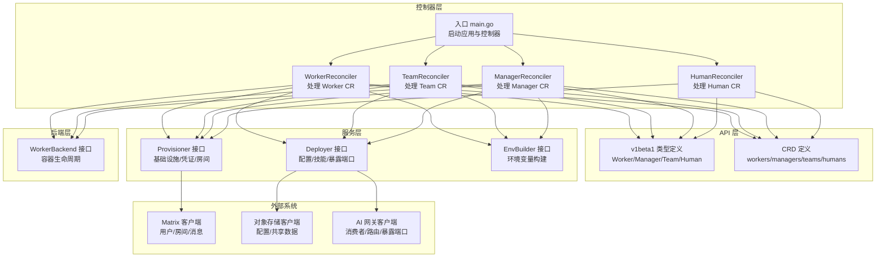
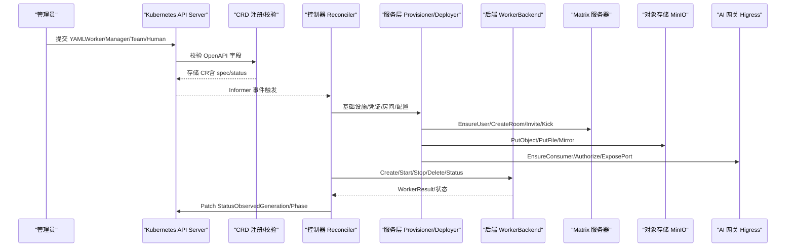
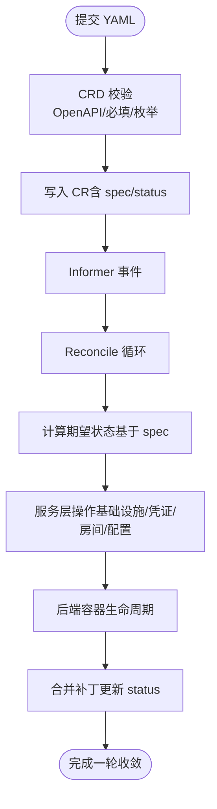
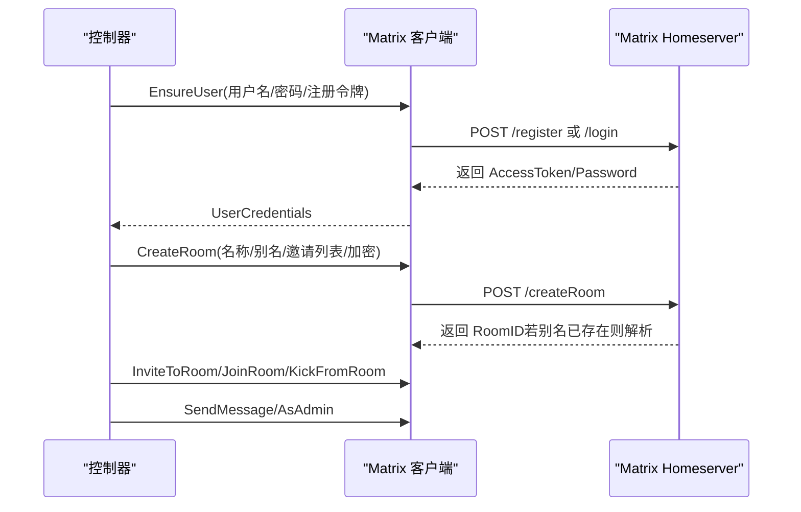
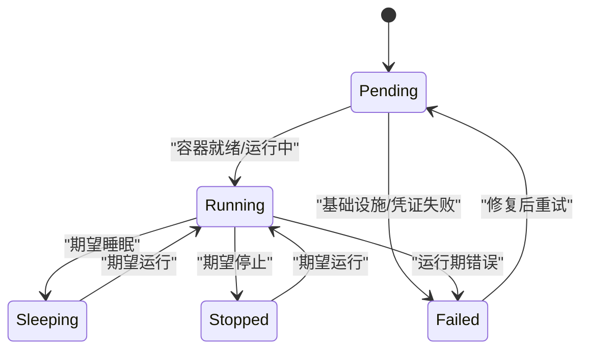
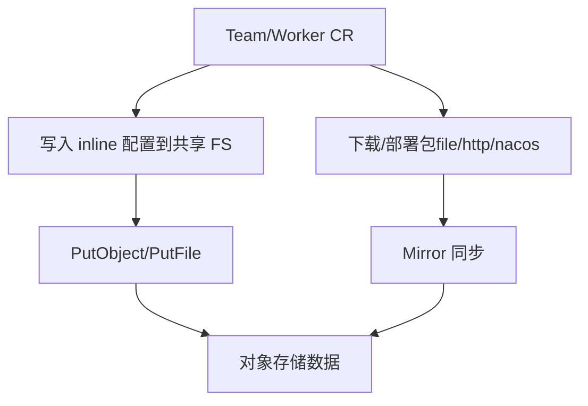
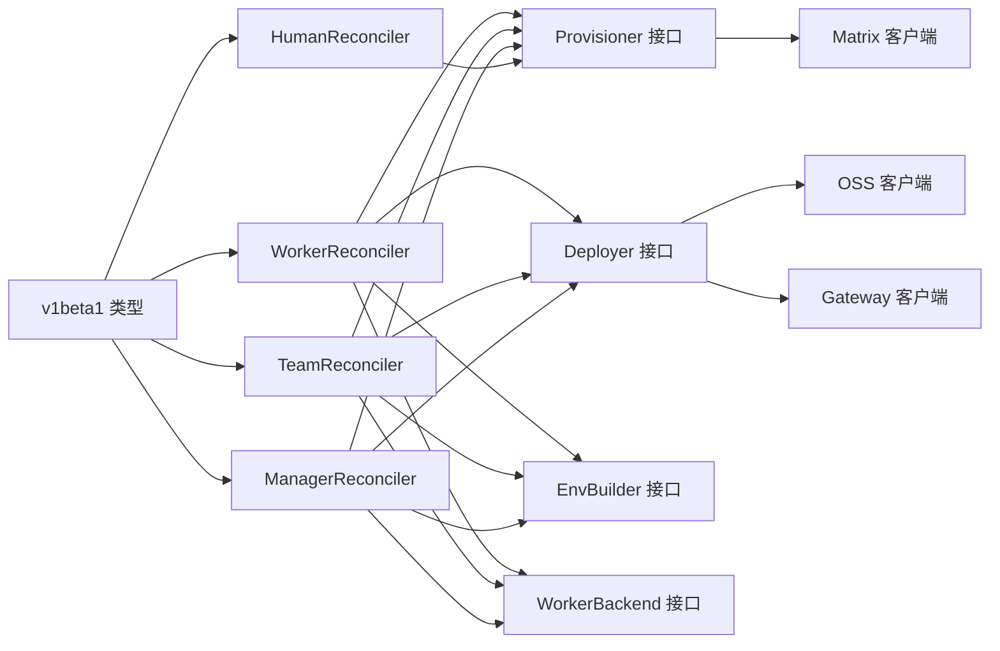

# 数据流设计

<cite>
**本文引用的文件**
- [hiclaw-controller/api/v1beta1/types.go](file://hiclaw-controller/api/v1beta1/types.go)
- [hiclaw-controller/config/crd/workers.hiclaw.io.yaml](file://hiclaw-controller/config/crd/workers.hiclaw.io.yaml)
- [hiclaw-controller/config/crd/managers.hiclaw.io.yaml](file://hiclaw-controller/config/crd/managers.hiclaw.io.yaml)
- [hiclaw-controller/config/crd/humans.hiclaw.io.yaml](file://hiclaw-controller/config/crd/humans.hiclaw.io.yaml)
- [hiclaw-controller/config/crd/teams.hiclaw.io.yaml](file://hiclaw-controller/config/crd/teams.hiclaw.io.yaml)
- [hiclaw-controller/cmd/controller/main.go](file://hiclaw-controller/cmd/controller/main.go)
- [hiclaw-controller/internal/controller/worker_controller.go](file://hiclaw-controller/internal/controller/worker_controller.go)
- [hiclaw-controller/internal/controller/team_controller.go](file://hiclaw-controller/internal/controller/team_controller.go)
- [hiclaw-controller/internal/controller/manager_controller.go](file://hiclaw-controller/internal/controller/manager_controller.go)
- [hiclaw-controller/internal/controller/human_controller.go](file://hiclaw-controller/internal/controller/human_controller.go)
- [hiclaw-controller/internal/service/interfaces.go](file://hiclaw-controller/internal/service/interfaces.go)
- [hiclaw-controller/internal/backend/interface.go](file://hiclaw-controller/internal/backend/interface.go)
- [hiclaw-controller/internal/matrix/client.go](file://hiclaw-controller/internal/matrix/client.go)
- [hiclaw-controller/internal/oss/client.go](file://hiclaw-controller/internal/oss/client.go)
- [hiclaw-controller/internal/gateway/client.go](file://hiclaw-controller/internal/gateway/client.go)
</cite>

## 目录
1. [引言](#引言)
2. [项目结构](#项目结构)
3. [核心组件](#核心组件)
4. [架构总览](#架构总览)
5. [详细组件分析](#详细组件分析)
6. [依赖分析](#依赖分析)
7. [性能考虑](#性能考虑)
8. [故障排查指南](#故障排查指南)
9. [结论](#结论)
10. [附录](#附录)

## 引言
本文件面向 HiClaw 的数据流设计，系统性阐述从 YAML 配置到 CRD、再到控制器处理的完整数据流转路径；解释通信数据（Matrix 协议消息）与 API 调用的数据格式；说明状态数据的同步机制（Worker/Manager 状态上报、控制器状态持久化）；描述对象存储中的数据组织方式（工作空间、共享任务树、配置文件）；并给出数据一致性保障与冲突解决策略，以及关键流程的时序图与状态转换图。

## 项目结构
HiClaw 控制器采用 Kubernetes CRD + Reconciler 的声明式控制模式，围绕 Worker、Manager、Team、Human 四类资源进行编排。控制器通过服务层对接 Matrix、对象存储与 AI 网关等外部系统，并通过后端抽象统一支撑本地 Docker 与集群 K8s 两种部署模式。

图表来源
- [hiclaw-controller/cmd/controller/main.go:16-36](file://hiclaw-controller/cmd/controller/main.go#L16-L36)
- [hiclaw-controller/internal/controller/worker_controller.go:311-342](file://hiclaw-controller/internal/controller/worker_controller.go#L311-L342)
- [hiclaw-controller/internal/controller/team_controller.go:76-106](file://hiclaw-controller/internal/controller/team_controller.go#L76-L106)
- [hiclaw-controller/internal/controller/manager_controller.go:162-188](file://hiclaw-controller/internal/controller/manager_controller.go#L162-L188)
- [hiclaw-controller/internal/controller/human_controller.go:98-102](file://hiclaw-controller/internal/controller/human_controller.go#L98-L102)
- [hiclaw-controller/api/v1beta1/types.go:63-153](file://hiclaw-controller/api/v1beta1/types.go#L63-L153)
- [hiclaw-controller/config/crd/workers.hiclaw.io.yaml:1-204](file://hiclaw-controller/config/crd/workers.hiclaw.io.yaml#L1-L204)
- [hiclaw-controller/internal/service/interfaces.go:9-187](file://hiclaw-controller/internal/service/interfaces.go#L9-L187)
- [hiclaw-controller/internal/backend/interface.go:179-210](file://hiclaw-controller/internal/backend/interface.go#L179-L210)
- [hiclaw-controller/internal/matrix/client.go:16-87](file://hiclaw-controller/internal/matrix/client.go#L16-L87)
- [hiclaw-controller/internal/oss/client.go:5-54](file://hiclaw-controller/internal/oss/client.go#L5-L54)
- [hiclaw-controller/internal/gateway/client.go:5-51](file://hiclaw-controller/internal/gateway/client.go#L5-L51)

章节来源
- [hiclaw-controller/cmd/controller/main.go:16-36](file://hiclaw-controller/cmd/controller/main.go#L16-L36)
- [hiclaw-controller/api/v1beta1/types.go:63-153](file://hiclaw-controller/api/v1beta1/types.go#L63-L153)
- [hiclaw-controller/config/crd/workers.hiclaw.io.yaml:1-204](file://hiclaw-controller/config/crd/workers.hiclaw.io.yaml#L1-L204)
- [hiclaw-controller/config/crd/managers.hiclaw.io.yaml:1-171](file://hiclaw-controller/config/crd/managers.hiclaw.io.yaml#L1-L171)
- [hiclaw-controller/config/crd/humans.hiclaw.io.yaml:1-84](file://hiclaw-controller/config/crd/humans.hiclaw.io.yaml#L1-L84)
- [hiclaw-controller/config/crd/teams.hiclaw.io.yaml:1-351](file://hiclaw-controller/config/crd/teams.hiclaw.io.yaml#L1-L351)

## 核心组件
- CRD 与 API 类型：定义 Worker、Manager、Team、Human 的规范与状态字段，提供 OpenAPI 校验与列印列。
- Reconciler 控制器：对每类资源执行“期望状态—实际状态”的收敛循环，驱动服务层与后端层完成基础设施、配置与容器生命周期管理。
- 服务接口：抽象矩阵、对象存储、网关等外部能力，屏蔽具体实现差异。
- 后端接口：抽象容器生命周期（创建、删除、启停、状态查询），支持本地与集群两种后端。
- 外部系统：Matrix 房间与消息、对象存储（MinIO）、AI 网关（Higress）。

章节来源
- [hiclaw-controller/api/v1beta1/types.go:63-153](file://hiclaw-controller/api/v1beta1/types.go#L63-L153)
- [hiclaw-controller/internal/controller/worker_controller.go:30-55](file://hiclaw-controller/internal/controller/worker_controller.go#L30-L55)
- [hiclaw-controller/internal/controller/team_controller.go:40-74](file://hiclaw-controller/internal/controller/team_controller.go#L40-L74)
- [hiclaw-controller/internal/controller/manager_controller.go:31-62](file://hiclaw-controller/internal/controller/manager_controller.go#L31-L62)
- [hiclaw-controller/internal/controller/human_controller.go:16-27](file://hiclaw-controller/internal/controller/human_controller.go#L16-L27)
- [hiclaw-controller/internal/service/interfaces.go:9-187](file://hiclaw-controller/internal/service/interfaces.go#L9-L187)
- [hiclaw-controller/internal/backend/interface.go:179-210](file://hiclaw-controller/internal/backend/interface.go#L179-L210)

## 架构总览
下图展示从 YAML 到控制器、再到外部系统的端到端数据流：

图表来源
- [hiclaw-controller/config/crd/workers.hiclaw.io.yaml:11-184](file://hiclaw-controller/config/crd/workers.hiclaw.io.yaml#L11-L184)
- [hiclaw-controller/config/crd/managers.hiclaw.io.yaml:11-151](file://hiclaw-controller/config/crd/managers.hiclaw.io.yaml#L11-L151)
- [hiclaw-controller/config/crd/teams.hiclaw.io.yaml:11-328](file://hiclaw-controller/config/crd/teams.hiclaw.io.yaml#L11-L328)
- [hiclaw-controller/internal/controller/worker_controller.go:110-151](file://hiclaw-controller/internal/controller/worker_controller.go#L110-L151)
- [hiclaw-controller/internal/controller/team_controller.go:114-305](file://hiclaw-controller/internal/controller/team_controller.go#L114-L305)
- [hiclaw-controller/internal/controller/manager_controller.go:128-160](file://hiclaw-controller/internal/controller/manager_controller.go#L128-L160)
- [hiclaw-controller/internal/service/interfaces.go:9-187](file://hiclaw-controller/internal/service/interfaces.go#L9-L187)
- [hiclaw-controller/internal/backend/interface.go:179-210](file://hiclaw-controller/internal/backend/interface.go#L179-L210)
- [hiclaw-controller/internal/matrix/client.go:131-225](file://hiclaw-controller/internal/matrix/client.go#L131-L225)
- [hiclaw-controller/internal/oss/client.go:8-32](file://hiclaw-controller/internal/oss/client.go#L8-L32)
- [hiclaw-controller/internal/gateway/client.go:8-27](file://hiclaw-controller/internal/gateway/client.go#L8-L27)

## 详细组件分析

### 配置数据流转：YAML → CRD → 控制器 → 外部系统
- YAML 提交后由 API Server 应用 CRD 校验（类型、必填、枚举值、OpenAPI 字段约束），随后写入 etcd。
- 控制器监听 CR 变更，进入 Reconcile 循环：计算期望状态（基于 spec），调用服务层执行基础设施与配置操作，最后以合并补丁更新 status。
- 关键点：
  - Worker/Manager/Team/人类权限等字段在 CRD 中有明确的 OpenAPI 校验与默认值策略。
  - 控制器通过 ObservedGeneration 与 Phase 记录收敛结果，避免无限重试回路。
  - 服务层负责与 Matrix、对象存储、网关交互，确保资源幂等与一致性。

图表来源
- [hiclaw-controller/config/crd/workers.hiclaw.io.yaml:11-184](file://hiclaw-controller/config/crd/workers.hiclaw.io.yaml#L11-L184)
- [hiclaw-controller/config/crd/managers.hiclaw.io.yaml:11-151](file://hiclaw-controller/config/crd/managers.hiclaw.io.yaml#L11-L151)
- [hiclaw-controller/config/crd/teams.hiclaw.io.yaml:11-328](file://hiclaw-controller/config/crd/teams.hiclaw.io.yaml#L11-L328)
- [hiclaw-controller/internal/controller/worker_controller.go:71-86](file://hiclaw-controller/internal/controller/worker_controller.go#L71-L86)
- [hiclaw-controller/internal/controller/team_controller.go:117-124](file://hiclaw-controller/internal/controller/team_controller.go#L117-L124)
- [hiclaw-controller/internal/controller/manager_controller.go:80-107](file://hiclaw-controller/internal/controller/manager_controller.go#L80-L107)

章节来源
- [hiclaw-controller/config/crd/workers.hiclaw.io.yaml:11-184](file://hiclaw-controller/config/crd/workers.hiclaw.io.yaml#L11-L184)
- [hiclaw-controller/config/crd/managers.hiclaw.io.yaml:11-151](file://hiclaw-controller/config/crd/managers.hiclaw.io.yaml#L11-L151)
- [hiclaw-controller/config/crd/teams.hiclaw.io.yaml:11-328](file://hiclaw-controller/config/crd/teams.hiclaw.io.yaml#L11-L328)
- [hiclaw-controller/internal/controller/worker_controller.go:71-86](file://hiclaw-controller/internal/controller/worker_controller.go#L71-L86)
- [hiclaw-controller/internal/controller/team_controller.go:117-124](file://hiclaw-controller/internal/controller/team_controller.go#L117-L124)
- [hiclaw-controller/internal/controller/manager_controller.go:80-107](file://hiclaw-controller/internal/controller/manager_controller.go#L80-L107)

### 通信数据传输机制：Matrix 协议的消息传递与 API 调用
- 用户/房间/消息：
  - EnsureUser 支持注册或登录，必要时通过 Admin 命令重置密码以恢复被“软删除”的用户。
  - CreateRoom 支持别名幂等解析，避免并发重建。
  - Invite/Kick/ListJoinedRooms/ListRoomMembers 等用于成员管理。
  - SendMessage/AsAdmin 用于发送消息，支持事务 ID 去重。
- API 调用数据格式：
  - 所有 HTTP 请求使用 JSON Body/Response，错误包含原始响应体以便诊断。
  - 登录失败会清除缓存的管理员令牌，确保后续重试可重新认证。

图表来源
- [hiclaw-controller/internal/matrix/client.go:131-225](file://hiclaw-controller/internal/matrix/client.go#L131-L225)
- [hiclaw-controller/internal/matrix/client.go:254-332](file://hiclaw-controller/internal/matrix/client.go#L254-L332)
- [hiclaw-controller/internal/matrix/client.go:430-448](file://hiclaw-controller/internal/matrix/client.go#L430-L448)
- [hiclaw-controller/internal/matrix/client.go:645-692](file://hiclaw-controller/internal/matrix/client.go#L645-L692)

章节来源
- [hiclaw-controller/internal/matrix/client.go:131-225](file://hiclaw-controller/internal/matrix/client.go#L131-L225)
- [hiclaw-controller/internal/matrix/client.go:254-332](file://hiclaw-controller/internal/matrix/client.go#L254-L332)
- [hiclaw-controller/internal/matrix/client.go:430-448](file://hiclaw-controller/internal/matrix/client.go#L430-L448)
- [hiclaw-controller/internal/matrix/client.go:645-692](file://hiclaw-controller/internal/matrix/client.go#L645-L692)

### 状态数据同步机制：Worker/Manager 状态上报与控制器持久化
- Worker/Manager/Team 的 status 字段由控制器在每次 Reconcile 结束时以合并补丁写入，包含：
  - ObservedGeneration：仅在成功时更新，防止因状态写入失败导致的无限重试。
  - Phase：根据错误与期望状态推导，健康失败与非健康失败区分处理。
  - 具体状态字段：如 Worker 的 MatrixUserID、RoomID、ContainerState、ExposedPorts、LastHeartbeat 等。
- TeamStatus 引入 per-member 状态聚合，包含成员角色、房间、矩阵用户、规格哈希、就绪态与暴露端口等，便于统一汇总与稳定排序。

图表来源
- [hiclaw-controller/api/v1beta1/types.go:130-146](file://hiclaw-controller/api/v1beta1/types.go#L130-L146)
- [hiclaw-controller/api/v1beta1/types.go:240-317](file://hiclaw-controller/api/v1beta1/types.go#L240-L317)
- [hiclaw-controller/internal/controller/worker_controller.go:294-309](file://hiclaw-controller/internal/controller/worker_controller.go#L294-L309)
- [hiclaw-controller/internal/controller/team_controller.go:271-288](file://hiclaw-controller/internal/controller/team_controller.go#L271-L288)

章节来源
- [hiclaw-controller/api/v1beta1/types.go:130-146](file://hiclaw-controller/api/v1beta1/types.go#L130-L146)
- [hiclaw-controller/api/v1beta1/types.go:240-317](file://hiclaw-controller/api/v1beta1/types.go#L240-L317)
- [hiclaw-controller/internal/controller/worker_controller.go:294-309](file://hiclaw-controller/internal/controller/worker_controller.go#L294-L309)
- [hiclaw-controller/internal/controller/team_controller.go:271-288](file://hiclaw-controller/internal/controller/team_controller.go#L271-L288)

### 对象存储中的数据组织：工作空间、共享任务树、配置文件
- 工作空间与共享数据：
  - 通过对象存储客户端提供 PutObject/PutFile/Mirror/ListObjects/DeletePrefix 等能力，支持将配置、技能包、共享任务树等数据落盘。
  - 在 Team 场景中，控制器会确保团队共享存储初始化，保障成员间协作数据一致。
- 配置文件存储：
  - 写入 inline 配置（如 SOUL/AGENTS/IDENTITY）到共享 Agent 文件系统目录，供 Agent 读取。
  - 包管理支持 file://、http(s)://、nacos:// 等多种来源，统一由 Deployer 处理。

图表来源
- [hiclaw-controller/internal/controller/team_controller.go:389-412](file://hiclaw-controller/internal/controller/team_controller.go#L389-L412)
- [hiclaw-controller/internal/service/interfaces.go:37-45](file://hiclaw-controller/internal/service/interfaces.go#L37-L45)
- [hiclaw-controller/internal/oss/client.go:8-32](file://hiclaw-controller/internal/oss/client.go#L8-L32)

章节来源
- [hiclaw-controller/internal/controller/team_controller.go:389-412](file://hiclaw-controller/internal/controller/team_controller.go#L389-L412)
- [hiclaw-controller/internal/service/interfaces.go:37-45](file://hiclaw-controller/internal/service/interfaces.go#L37-L45)
- [hiclaw-controller/internal/oss/client.go:8-32](file://hiclaw-controller/internal/oss/client.go#L8-L32)

### 数据一致性与冲突解决策略
- 幂等性：
  - Matrix：CreateRoom 支持别名幂等解析；Invite/Kick/ListJoinedRooms 等均为幂等操作。
  - OSS：PutObject/PutFile/DeleteObject/Mirror/List/DeletePrefix 提供幂等/去重语义。
  - 网关：EnsureConsumer/Authorize/UnexposePort 等均具备幂等特性。
- 观察与收敛：
  - 使用 ObservedGeneration 与 Phase 标识收敛完成；仅在成功时更新 ObservedGeneration，避免失败回路。
  - TeamStatus 成员状态按名称排序，保证合并补丁稳定性，减少不必要的事件风暴。
- 冲突处理：
  - 网关授权冲突（409）通过重试逻辑处理。
  - 管理员令牌失效自动清除并重试认证。
  - 别名冲突通过解析现有 RoomID 解决重复创建问题。

章节来源
- [hiclaw-controller/internal/matrix/client.go:313-331](file://hiclaw-controller/internal/matrix/client.go#L313-L331)
- [hiclaw-controller/internal/matrix/client.go:576-584](file://hiclaw-controller/internal/matrix/client.go#L576-L584)
- [hiclaw-controller/internal/oss/client.go:8-32](file://hiclaw-controller/internal/oss/client.go#L8-L32)
- [hiclaw-controller/internal/gateway/client.go:15-17](file://hiclaw-controller/internal/gateway/client.go#L15-L17)
- [hiclaw-controller/internal/controller/worker_controller.go:71-86](file://hiclaw-controller/internal/controller/worker_controller.go#L71-L86)
- [hiclaw-controller/internal/controller/team_controller.go:271-288](file://hiclaw-controller/internal/controller/team_controller.go#L271-L288)

## 依赖分析
- 控制器与 API/CRD：
  - Reconciler 直接依赖 v1beta1 类型与 CRD 定义，确保字段合法与状态持久化。
- 控制器与服务层：
  - Worker/Team/Manager/人类控制器分别依赖 Provisioner/Deployer/EnvBuilder 接口，解耦具体实现。
- 服务层与外部系统：
  - Provisioner/Deployer 依赖 Matrix/OSS/Gateway 客户端，统一对外部系统进行操作。
- 后端层：
  - WorkerBackend 抽象容器生命周期，支持 Docker 与 K8s 两种后端。

图表来源
- [hiclaw-controller/api/v1beta1/types.go:63-153](file://hiclaw-controller/api/v1beta1/types.go#L63-L153)
- [hiclaw-controller/internal/controller/worker_controller.go:30-55](file://hiclaw-controller/internal/controller/worker_controller.go#L30-L55)
- [hiclaw-controller/internal/controller/team_controller.go:40-74](file://hiclaw-controller/internal/controller/team_controller.go#L40-L74)
- [hiclaw-controller/internal/controller/manager_controller.go:31-62](file://hiclaw-controller/internal/controller/manager_controller.go#L31-L62)
- [hiclaw-controller/internal/controller/human_controller.go:16-27](file://hiclaw-controller/internal/controller/human_controller.go#L16-L27)
- [hiclaw-controller/internal/service/interfaces.go:9-187](file://hiclaw-controller/internal/service/interfaces.go#L9-L187)
- [hiclaw-controller/internal/matrix/client.go:16-87](file://hiclaw-controller/internal/matrix/client.go#L16-L87)
- [hiclaw-controller/internal/oss/client.go:5-54](file://hiclaw-controller/internal/oss/client.go#L5-L54)
- [hiclaw-controller/internal/gateway/client.go:5-51](file://hiclaw-controller/internal/gateway/client.go#L5-L51)
- [hiclaw-controller/internal/backend/interface.go:179-210](file://hiclaw-controller/internal/backend/interface.go#L179-L210)

章节来源
- [hiclaw-controller/internal/service/interfaces.go:9-187](file://hiclaw-controller/internal/service/interfaces.go#L9-L187)
- [hiclaw-controller/internal/backend/interface.go:179-210](file://hiclaw-controller/internal/backend/interface.go#L179-L210)
- [hiclaw-controller/internal/matrix/client.go:16-87](file://hiclaw-controller/internal/matrix/client.go#L16-L87)
- [hiclaw-controller/internal/oss/client.go:5-54](file://hiclaw-controller/internal/oss/client.go#L5-L54)
- [hiclaw-controller/internal/gateway/client.go:5-51](file://hiclaw-controller/internal/gateway/client.go#L5-L51)

## 性能考虑
- 重试与退避：控制器对失败场景设置固定间隔重试，避免频繁轮询造成压力。
- 合并补丁与观察者模式：通过 ObservedGeneration 与合并补丁减少无效更新；按名称排序状态数组降低补丁开销。
- 幂等操作：优先使用幂等 API，减少重复创建与状态抖动。
- 后端选择：在集群模式下优先使用 K8s 后端，利用原生 GC 与资源调度；本地模式使用 Docker 后端满足开发调试需求。

## 故障排查指南
- 状态不更新或无限重试：
  - 检查是否在失败时仍更新了 status，应仅在成功时更新 ObservedGeneration。
- Matrix 相关错误：
  - 登录失败会清除管理员令牌，需确认凭据正确；别名冲突通过解析现有 RoomID 解决。
- 网关授权冲突：
  - 出现 409 时启用重试逻辑；确认消费者已创建且路由存在。
- 对象存储异常：
  - 检查镜像同步参数与前缀；确认 PutObject/PutFile 权限与桶策略。

章节来源
- [hiclaw-controller/internal/controller/worker_controller.go:71-86](file://hiclaw-controller/internal/controller/worker_controller.go#L71-L86)
- [hiclaw-controller/internal/matrix/client.go:678-681](file://hiclaw-controller/internal/matrix/client.go#L678-L681)
- [hiclaw-controller/internal/matrix/client.go:313-331](file://hiclaw-controller/internal/matrix/client.go#L313-L331)
- [hiclaw-controller/internal/gateway/client.go:15-17](file://hiclaw-controller/internal/gateway/client.go#L15-L17)

## 结论
HiClaw 的数据流设计以 CRD 为核心，通过控制器-Reconciler 模式实现声明式编排，结合服务层对外部系统进行统一抽象，配合后端层实现容器生命周期管理。通信、配置与状态数据在多层之间保持幂等与一致性，通过观察者模式与合并补丁优化性能与稳定性。对象存储与网关能力为协作与访问控制提供基础保障。

## 附录
- 关键流程时序图与状态图已在前述章节中给出，读者可据此定位具体实现文件与行号进行深入分析。