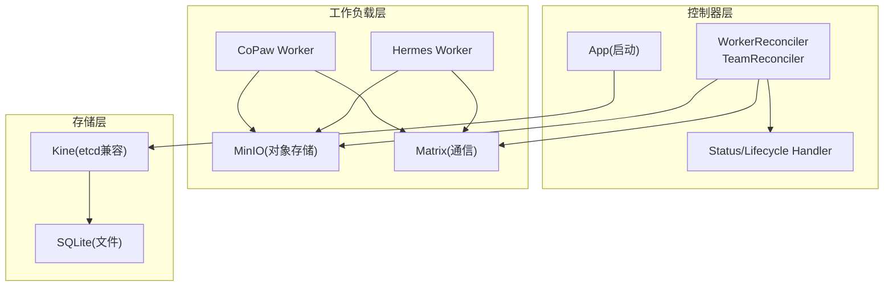
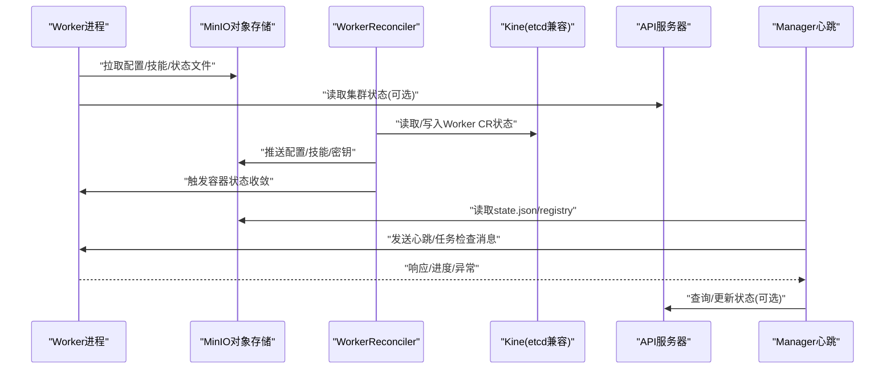
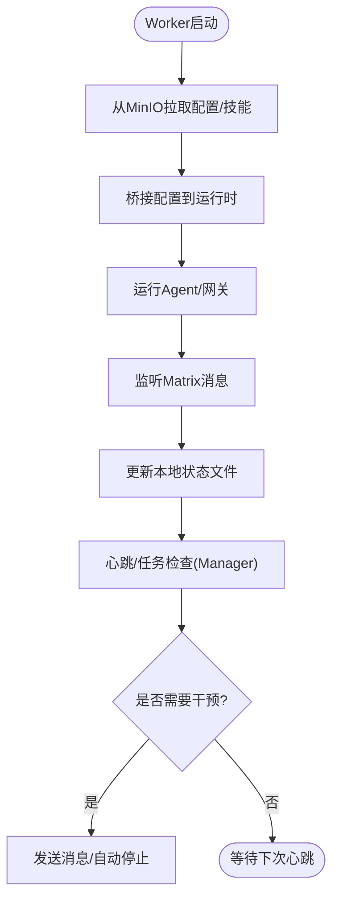
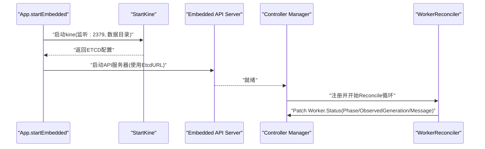
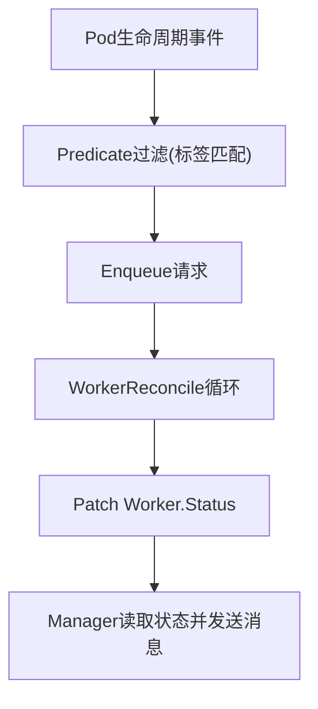
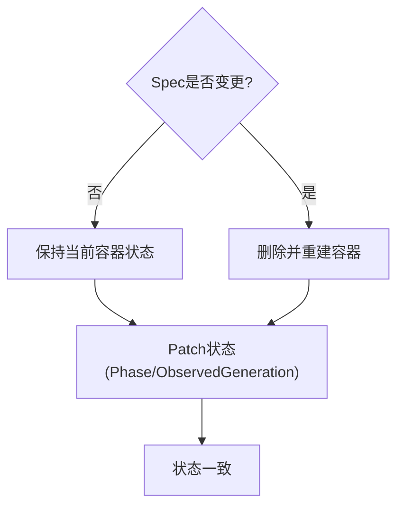
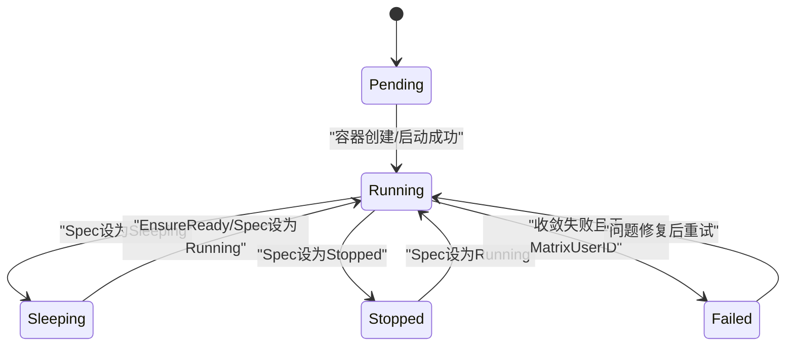
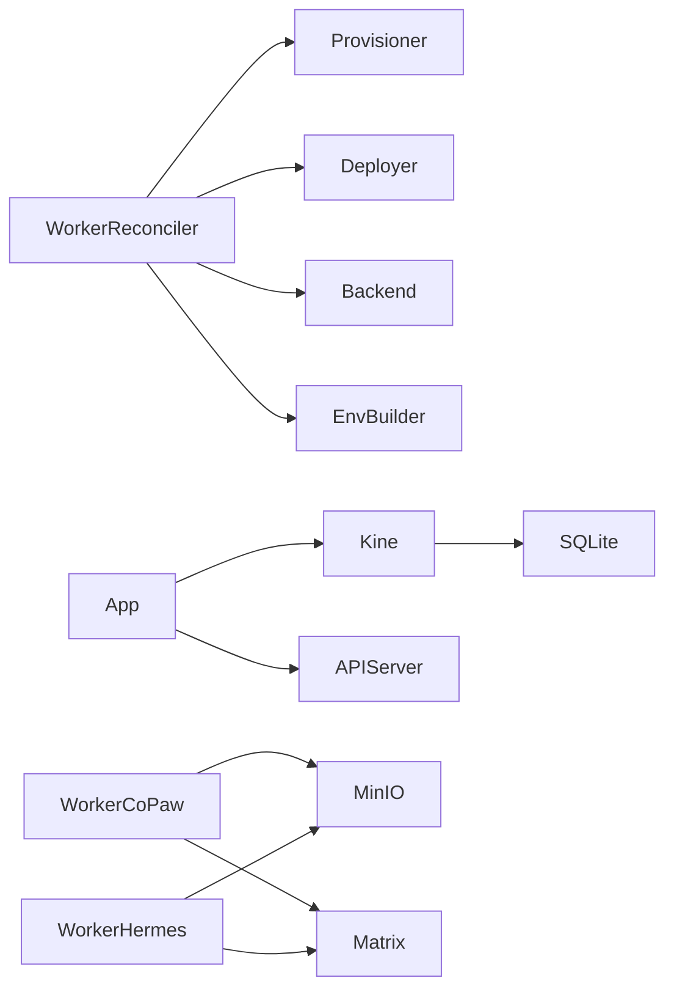

# 状态数据流

<cite>
**本文引用的文件**
- [types.go](file://hiclaw-controller/api/v1beta1/types.go)
- [worker_controller.go](file://hiclaw-controller/internal/controller/worker_controller.go)
- [member_reconcile.go](file://hiclaw-controller/internal/controller/member_reconcile.go)
- [kine.go](file://hiclaw-controller/internal/store/kine.go)
- [app.go](file://hiclaw-controller/internal/app/app.go)
- [status_handler.go](file://hiclaw-controller/internal/server/status_handler.go)
- [lifecycle_handler.go](file://hiclaw-controller/internal/server/lifecycle_handler.go)
- [worker.py（CoPaw）](file://copaw/src/copaw_worker/worker.py)
- [worker.py（Hermes）](file://hermes/src/hermes_worker/worker.py)
- [HEARTBEAT.md](file://manager/agent/HEARTBEAT.md)
- [state.json](file://manager/agent/state.json)
- [workers-registry.json](file://manager/agent/workers-registry.json)
- [agent-metrics.sh](file://tests/lib/agent-metrics.sh)
- [worker_test.go](file://hiclaw-controller/test/integration/controller/worker_test.go)
</cite>

## 目录
1. [引言](#引言)
2. [项目结构](#项目结构)
3. [核心组件](#核心组件)
4. [架构总览](#架构总览)
5. [详细组件分析](#详细组件分析)
6. [依赖分析](#依赖分析)
7. [性能考虑](#性能考虑)
8. [故障排查指南](#故障排查指南)
9. [结论](#结论)
10. [附录](#附录)

## 引言
本文件围绕 HiClaw 的状态数据流进行系统化架构文档化，重点覆盖以下方面：
- Worker 状态上报机制：心跳数据、性能指标与运行时状态的采集与传输
- 控制器中的存储与同步：基于嵌入式 etcd 的状态持久化、缓存与一致性策略
- 状态变更事件传播：Informer 事件处理、状态监听与通知分发
- 分布式状态同步冲突解决：版本控制、并发更新与一致性维护
- 生命周期管理：状态历史记录、快照保存与状态恢复
- 时序图与状态机转换图：以代码为依据的可视化流程

## 项目结构
HiClaw 的状态数据流由“控制器 + 工作负载 + 中央存储”三部分协同实现：
- 控制器层：基于 controller-runtime 的 Worker/Team/Manager 资源控制器，负责资源生命周期收敛与状态写回
- 工作负载层：Worker 进程通过 MinIO 同步配置与技能，通过 Matrix 通道进行消息交互，并在本地维护状态文件
- 存储层：嵌入式 etcd（kine+SQLite）作为控制器状态后端，提供 API 服务与缓存

图表来源
- [app.go:515-553](file://hiclaw-controller/internal/app/app.go#L515-L553)
- [kine.go:1-55](file://hiclaw-controller/internal/store/kine.go#L1-L55)
- [worker_controller.go:311-342](file://hiclaw-controller/internal/controller/worker_controller.go#L311-L342)
- [status_handler.go:12-74](file://hiclaw-controller/internal/server/status_handler.go#L12-L74)
- [worker.py（CoPaw）:65-177](file://copaw/src/copaw_worker/worker.py#L65-L177)
- [worker.py（Hermes）:86-165](file://hermes/src/hermes_worker/worker.py#L86-L165)

章节来源
- [app.go:515-553](file://hiclaw-controller/internal/app/app.go#L515-L553)
- [kine.go:1-55](file://hiclaw-controller/internal/store/kine.go#L1-L55)

## 核心组件
- Worker API 类型与状态字段：定义 Worker 的期望生命周期状态、矩阵用户/房间、容器状态与最后心跳等
- WorkerReconciler：统一的状态收敛入口，负责基础设施、配置、容器与暴露端口的协调，并将运行时状态写回 Worker.Status
- Member 共享协调器：抽象 Worker/Team 成员的通用收敛流程，贯穿基础设施、配置与容器生命周期
- 嵌入式 etcd：通过 kine 暴露 etcd 兼容接口，使用 SQLite 文件作为后端，供控制器管理器与 API 服务器使用
- Worker 进程：从 MinIO 拉取配置与技能，桥接至具体运行时（CoPaw/Hermes），并维护本地状态文件
- 管理者心跳脚本：读取本地 state.json，按周期检查任务与 Worker 容器状态，必要时发送消息并生成报告

章节来源
- [types.go:63-146](file://hiclaw-controller/api/v1beta1/types.go#L63-L146)
- [worker_controller.go:110-151](file://hiclaw-controller/internal/controller/worker_controller.go#L110-L151)
- [member_reconcile.go:142-192](file://hiclaw-controller/internal/controller/member_reconcile.go#L142-L192)
- [kine.go:13-55](file://hiclaw-controller/internal/store/kine.go#L13-L55)
- [worker.py（CoPaw）:65-177](file://copaw/src/copaw_worker/worker.py#L65-L177)
- [worker.py（Hermes）:86-165](file://hermes/src/hermes_worker/worker.py#L86-L165)
- [HEARTBEAT.md:1-192](file://manager/agent/HEARTBEAT.md#L1-L192)

## 架构总览
下图展示了状态数据流在控制器与 Worker 之间的双向流转路径，以及存储与事件传播机制。

图表来源
- [worker_controller.go:110-151](file://hiclaw-controller/internal/controller/worker_controller.go#L110-L151)
- [kine.go:28-55](file://hiclaw-controller/internal/store/kine.go#L28-L55)
- [status_handler.go:35-62](file://hiclaw-controller/internal/server/status_handler.go#L35-L62)
- [HEARTBEAT.md:1-192](file://manager/agent/HEARTBEAT.md#L1-L192)

## 详细组件分析

### Worker 状态上报与心跳机制
- Worker 启动阶段从 MinIO 恢复 openclaw.json、SOUL.md、AGENTS.md、技能目录与 mcporter 配置；随后桥接到具体运行时（CoPaw/Hermes）
- Worker 通过 Matrix 通道接收任务与指令，按需执行并在本地维护状态文件（如 state.json、workers-registry.json）
- 管理者根据 state.json 执行心跳检查：确认 Worker 容器状态、检查有限/无限任务、项目进度与容量评估，并在需要时发送消息或自动停止空闲 Worker
- 性能指标采集：测试工具通过扫描会话日志文件偏移量进行增量度量，支持多运行时（CoPaw/Hermes）

图表来源
- [worker.py（CoPaw）:65-177](file://copaw/src/copaw_worker/worker.py#L65-L177)
- [worker.py（Hermes）:86-165](file://hermes/src/hermes_worker/worker.py#L86-L165)
- [HEARTBEAT.md:1-192](file://manager/agent/HEARTBEAT.md#L1-L192)
- [state.json:1-5](file://manager/agent/state.json#L1-L5)
- [workers-registry.json:1-6](file://manager/agent/workers-registry.json#L1-L6)
- [agent-metrics.sh:567-630](file://tests/lib/agent-metrics.sh#L567-L630)

章节来源
- [worker.py（CoPaw）:65-177](file://copaw/src/copaw_worker/worker.py#L65-L177)
- [worker.py（Hermes）:86-165](file://hermes/src/hermes_worker/worker.py#L86-L165)
- [HEARTBEAT.md:1-192](file://manager/agent/HEARTBEAT.md#L1-L192)
- [state.json:1-5](file://manager/agent/state.json#L1-L5)
- [workers-registry.json:1-6](file://manager/agent/workers-registry.json#L1-L6)
- [agent-metrics.sh:567-630](file://tests/lib/agent-metrics.sh#L567-L630)

### 控制器中的存储与同步机制
- 嵌入式 etcd：通过 kine 监听本地地址，使用 SQLite 文件作为后端，提供 etcd 兼容接口
- API 服务器：在嵌入模式下启动内置 kube-apiserver，绑定到本地地址，使用上述 etcd 作为存储
- 控制器管理器：创建 controller-runtime Manager，注册 Worker/Team/Manager 控制器，启用 Informer 缓存
- 状态写回：WorkerReconciler 在每次成功收敛后，统一设置 Phase、ObservedGeneration 与 Message，并将运行时状态写入 Worker.Status

图表来源
- [app.go:515-553](file://hiclaw-controller/internal/app/app.go#L515-L553)
- [kine.go:28-55](file://hiclaw-controller/internal/store/kine.go#L28-L55)
- [worker_controller.go:57-104](file://hiclaw-controller/internal/controller/worker_controller.go#L57-L104)

章节来源
- [app.go:515-553](file://hiclaw-controller/internal/app/app.go#L515-L553)
- [kine.go:13-55](file://hiclaw-controller/internal/store/kine.go#L13-L55)
- [worker_controller.go:57-104](file://hiclaw-controller/internal/controller/worker_controller.go#L57-L104)

### 状态变更事件传播与通知分发
- Informer 事件：WorkerReconciler 为 Worker 资源建立 Informer，并在 Pod 级别增加过滤条件（标签匹配与生命周期事件）
- 事件处理：当 Pod Phase 发生变化或被删除/创建时，触发对应 Worker 的 Reconcile 循环
- 状态监听：Manager 心跳脚本直接读取本地 state.json 与 workers-registry.json，结合 Matrix 通道进行通知分发
- 通知渠道解析：通过脚本解析管理员通知渠道，确保报告统一投递到正确目标

图表来源
- [worker_controller.go:311-386](file://hiclaw-controller/internal/controller/worker_controller.go#L311-L386)
- [HEARTBEAT.md:177-192](file://manager/agent/HEARTBEAT.md#L177-L192)

章节来源
- [worker_controller.go:311-386](file://hiclaw-controller/internal/controller/worker_controller.go#L311-L386)
- [HEARTBEAT.md:177-192](file://manager/agent/HEARTBEAT.md#L177-L192)

### 分布式状态同步的冲突解决策略
- 版本控制与幂等：Worker.Status.ObservedGeneration 记录上次成功收敛对应的 Generation，失败时保留旧 Phase，避免因瞬时错误导致健康 Worker 被标记为 Failed
- 并发更新：Member 共享协调器在容器存在性判断与重建逻辑中，区分“规格未变更”与“规格已变更”，仅在变更时重建容器，减少不必要的中断
- 一致性维护：通过统一的 Status Patch 流程，确保 Phase 与 ObservedGeneration 的原子更新；同时在部署配置阶段写入 MinIO，使 Worker 侧能够热更新

图表来源
- [member_reconcile.go:270-320](file://hiclaw-controller/internal/controller/member_reconcile.go#L270-L320)
- [worker_controller.go:67-86](file://hiclaw-controller/internal/controller/worker_controller.go#L67-L86)

章节来源
- [member_reconcile.go:270-320](file://hiclaw-controller/internal/controller/member_reconcile.go#L270-L320)
- [worker_controller.go:67-86](file://hiclaw-controller/internal/controller/worker_controller.go#L67-L86)

### 状态数据的生命周期管理
- 状态历史记录：Worker.Status 记录 Phase、Message、MatrixUserID、RoomID、ContainerState、ExposedPorts 等字段，便于审计与排障
- 快照保存：测试工具对会话日志文件进行快照，记录每个运行时的偏移量，用于后续增量指标计算
- 状态恢复：Worker 启动时先从 MinIO 全量镜像恢复，再根据 openclaw.json 重新桥接配置，确保与控制器下发的一致

图表来源
- [types.go:130-139](file://hiclaw-controller/api/v1beta1/types.go#L130-L139)
- [worker_controller.go:294-309](file://hiclaw-controller/internal/controller/worker_controller.go#L294-L309)
- [worker_test.go:238-293](file://hiclaw-controller/test/integration/controller/worker_test.go#L238-L293)

章节来源
- [types.go:130-139](file://hiclaw-controller/api/v1beta1/types.go#L130-L139)
- [worker_controller.go:294-309](file://hiclaw-controller/internal/controller/worker_controller.go#L294-L309)
- [worker_test.go:238-293](file://hiclaw-controller/test/integration/controller/worker_test.go#L238-L293)

## 依赖分析
- 控制器依赖：WorkerReconciler 依赖 Provisioner（基础设施）、Deployer（配置推送）、Backend（容器后端）、EnvBuilder（环境变量构建）
- 存储依赖：App 在嵌入模式下启动 Kine，Kine 使用 SQLite 文件作为后端；API 服务器使用该 etcd 地址
- Worker 依赖：Worker 进程依赖 MinIO（配置/技能/密钥）、Matrix（消息通道）、运行时桥接（CoPaw/Hermes）

图表来源
- [worker_controller.go:33-55](file://hiclaw-controller/internal/controller/worker_controller.go#L33-L55)
- [app.go:515-553](file://hiclaw-controller/internal/app/app.go#L515-L553)
- [kine.go:28-55](file://hiclaw-controller/internal/store/kine.go#L28-L55)
- [worker.py（CoPaw）:65-177](file://copaw/src/copaw_worker/worker.py#L65-L177)
- [worker.py（Hermes）:86-165](file://hermes/src/hermes_worker/worker.py#L86-L165)

章节来源
- [worker_controller.go:33-55](file://hiclaw-controller/internal/controller/worker_controller.go#L33-L55)
- [app.go:515-553](file://hiclaw-controller/internal/app/app.go#L515-L553)
- [kine.go:28-55](file://hiclaw-controller/internal/store/kine.go#L28-L55)
- [worker.py（CoPaw）:65-177](file://copaw/src/copaw_worker/worker.py#L65-L177)
- [worker.py（Hermes）:86-165](file://hermes/src/hermes_worker/worker.py#L86-L165)

## 性能考虑
- 状态写回批处理：控制器在 defer 中统一 Patch Worker.Status，避免频繁写入带来的抖动
- 事件过滤：通过 Predicate 仅在 Pod Phase 变更时触发 Reconcile，降低无关事件开销
- MinIO 同步：Worker 启动阶段全量镜像，运行时采用增量同步与推送，平衡一致性与网络开销
- 指标采集：测试工具按运行时扫描会话日志文件大小，避免全量解析带来的 CPU 占用

## 故障排查指南
- 状态不一致：检查 Worker.Status.Phase 与 ObservedGeneration 是否匹配；若不一致，确认是否存在失败的 Status.Patch
- 容器状态异常：查看 Member 共享协调器的容器状态查询与重建逻辑，确认是否因规格变更导致重建
- 通知渠道不可达：使用 Manager 心跳脚本解析通知渠道，确认管理员 DM 房间是否已发现并可解析
- 存储连接问题：确认 App 启动时 Kine 与 API 服务器的端口与数据目录配置正确

章节来源
- [worker_controller.go:67-86](file://hiclaw-controller/internal/controller/worker_controller.go#L67-L86)
- [member_reconcile.go:270-320](file://hiclaw-controller/internal/controller/member_reconcile.go#L270-L320)
- [HEARTBEAT.md:177-192](file://manager/agent/HEARTBEAT.md#L177-L192)
- [app.go:515-553](file://hiclaw-controller/internal/app/app.go#L515-L553)

## 结论
HiClaw 的状态数据流通过“控制器 + Worker + 存储”的解耦设计实现了高可用与可观测性：
- Worker 侧负责状态采集与本地治理，通过 MinIO 与 Matrix 实现配置与消息的可靠同步
- 控制器侧通过嵌入式 etcd 提供一致的状态存储与事件传播，配合 Informer 缓存与幂等 Patch 保障稳定性
- 管理者心跳脚本以本地状态文件为核心，驱动任务与 Worker 容器生命周期的自动化管理
- 冲突解决与一致性策略在控制器与 Worker 两端共同作用，确保分布式状态的最终一致

## 附录
- API 与状态字段参考：Worker.Status 字段涵盖 Phase、Message、MatrixUserID、RoomID、ContainerState、ExposedPorts 等
- 状态变更测试参考：集成测试覆盖 Stopped/Sleeping/Running 状态切换与后端调用验证

章节来源
- [types.go:130-139](file://hiclaw-controller/api/v1beta1/types.go#L130-L139)
- [worker_test.go:238-293](file://hiclaw-controller/test/integration/controller/worker_test.go#L238-L293)