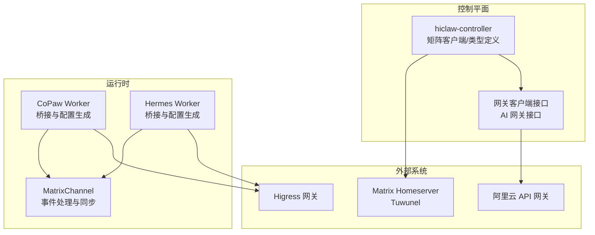
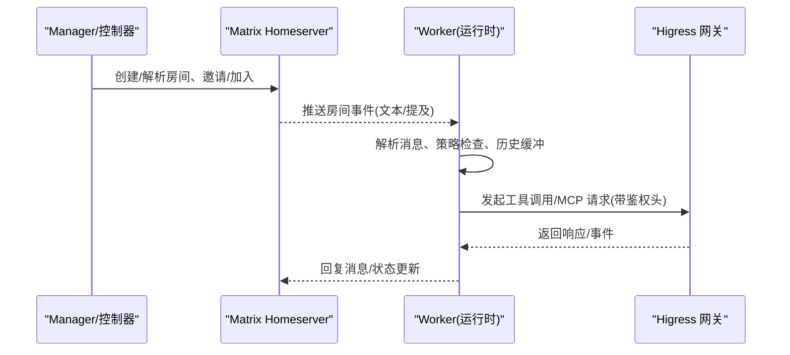
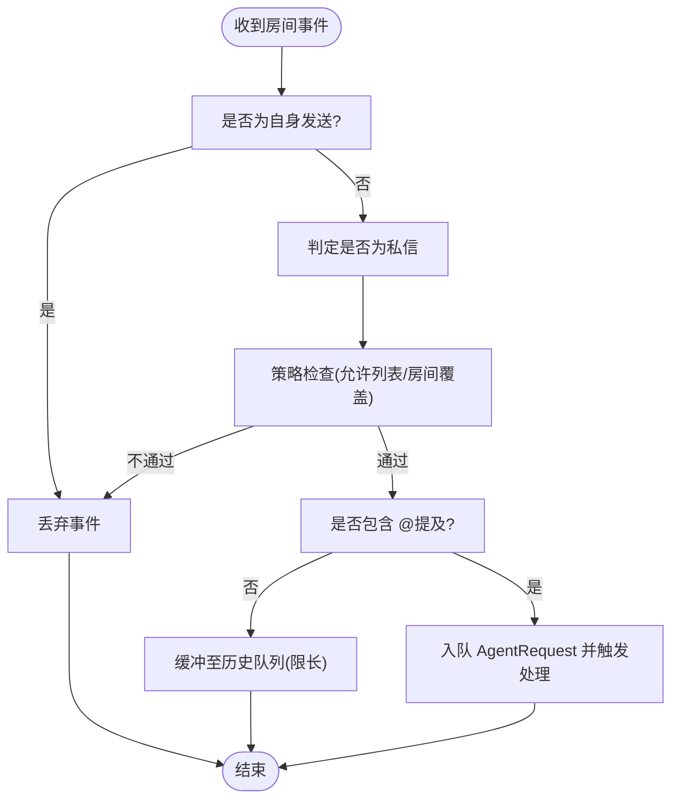
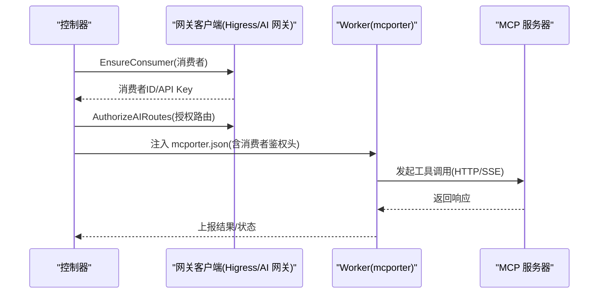
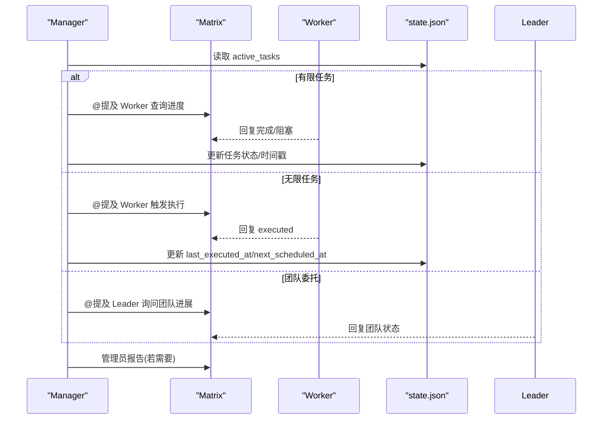
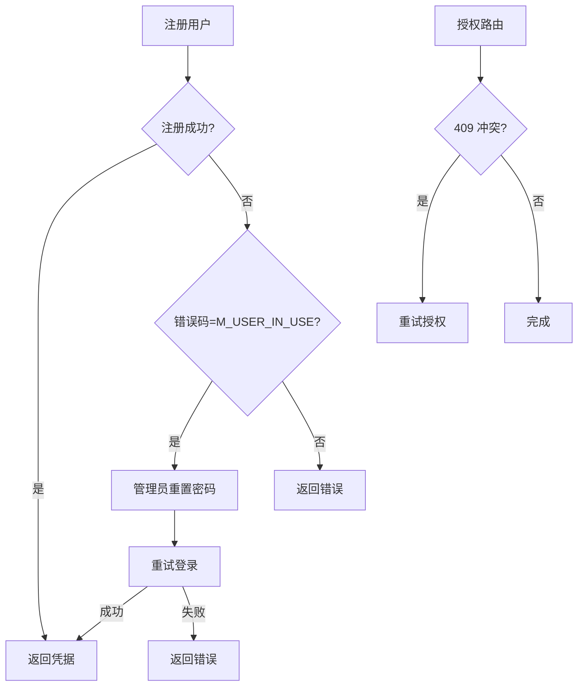
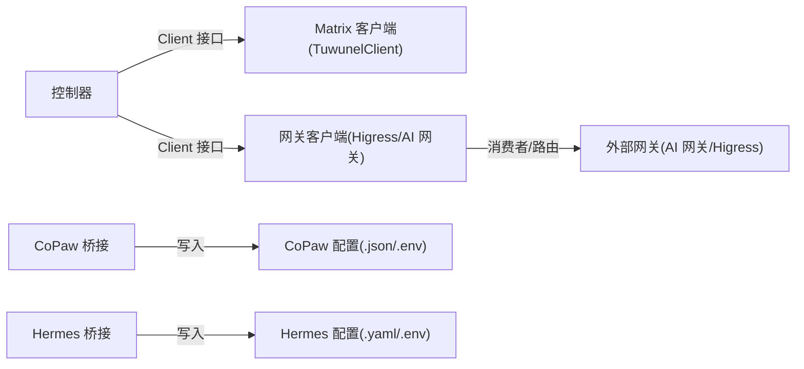
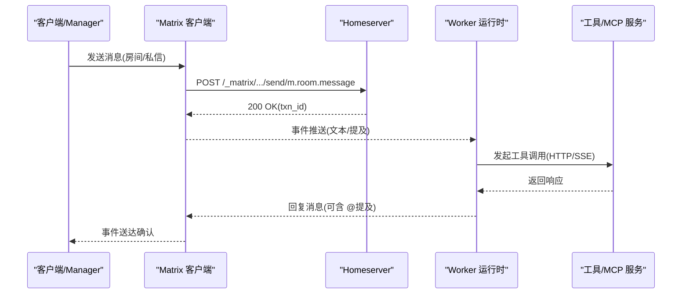

# 通信数据流

<cite>
**本文引用的文件**
- [hiclaw-controller/internal/matrix/client.go](file://hiclaw-controller/internal/matrix/client.go)
- [hiclaw-controller/internal/matrix/types.go](file://hiclaw-controller/internal/matrix/types.go)
- [hiclaw-controller/internal/gateway/client.go](file://hiclaw-controller/internal/gateway/client.go)
- [hiclaw-controller/internal/gateway/aigateway.go](file://hiclaw-controller/internal/gateway/aigateway.go)
- [hiclaw-controller/api/v1beta1/types.go](file://hiclaw-controller/api/v1beta1/types.go)
- [copaw/src/matrix/channel.py](file://copaw/src/matrix/channel.py)
- [copaw/src/copaw_worker/bridge.py](file://copaw/src/copaw_worker/bridge.py)
- [hermes/src/hermes_worker/bridge.py](file://hermes/src/hermes_worker/bridge.py)
- [manager/agent/HEARTBEAT.md](file://manager/agent/HEARTBEAT.md)
- [manager/agent/copaw-manager-agent/HEARTBEAT.md](file://manager/agent/copaw-manager-agent/HEARTBEAT.md)
- [manager/scripts/lib/gateway-api.sh](file://manager/scripts/lib/gateway-api.sh)
- [manager/agent/skills/mcp-server-management/scripts/setup-mcp-proxy.sh](file://manager/agent/skills/mcp-server-management/scripts/setup-mcp-proxy.sh)
- [manager/agent/skills/mcp-server-management/scripts/setup-mcp-server.sh](file://manager/agent/skills/mcp-server-management/scripts/setup-mcp-server.sh)
</cite>

## 目录
1. [引言](#引言)
2. [项目结构](#项目结构)
3. [核心组件](#核心组件)
4. [架构总览](#架构总览)
5. [详细组件分析](#详细组件分析)
6. [依赖分析](#依赖分析)
7. [性能考虑](#性能考虑)
8. [故障排查指南](#故障排查指南)
9. [结论](#结论)
10. [附录：协议与消息序列](#附录协议与消息序列)

## 引言
本文件面向 HiClaw 的通信数据流，系统性梳理以下关键链路：
- Matrix 协议消息的传输机制：房间消息、私信与事件通知的数据格式与处理流程
- AI 网关的数据转发机制：MCP 请求/响应的序列化、路由与消费者授权
- Worker 与 Manager 之间的通信协议：心跳检测、状态同步与任务分发的数据包格式
- 跨组件的异步消息传递机制：事件订阅、回调处理与错误重试策略
- 提供通信数据的协议规范与消息序列图，展示从请求发起到响应返回的完整链路

## 项目结构
HiClaw 的通信相关能力由控制器（hiclaw-controller）、Matrix 客户端（TuwunelClient）、Worker 运行时桥接（CoPaw/Hermes 桥接）与管理器（Manager）脚本共同组成。下图给出高层结构与交互关系。

**图表来源**
- [hiclaw-controller/internal/matrix/client.go:1-724](file://hiclaw-controller/internal/matrix/client.go#L1-L724)
- [hiclaw-controller/internal/gateway/client.go:1-52](file://hiclaw-controller/internal/gateway/client.go#L1-L52)
- [hiclaw-controller/internal/gateway/aigateway.go:1-367](file://hiclaw-controller/internal/gateway/aigateway.go#L1-L367)
- [copaw/src/matrix/channel.py:1-200](file://copaw/src/matrix/channel.py#L1-L200)
- [copaw/src/copaw_worker/bridge.py:1-703](file://copaw/src/copaw_worker/bridge.py#L1-L703)
- [hermes/src/hermes_worker/bridge.py:1-538](file://hermes/src/hermes_worker/bridge.py#L1-L538)

**章节来源**
- [hiclaw-controller/internal/matrix/client.go:1-724](file://hiclaw-controller/internal/matrix/client.go#L1-L724)
- [hiclaw-controller/internal/matrix/types.go:1-80](file://hiclaw-controller/internal/matrix/types.go#L1-L80)
- [hiclaw-controller/internal/gateway/client.go:1-52](file://hiclaw-controller/internal/gateway/client.go#L1-L52)
- [hiclaw-controller/internal/gateway/aigateway.go:1-367](file://hiclaw-controller/internal/gateway/aigateway.go#L1-L367)
- [copaw/src/matrix/channel.py:1-200](file://copaw/src/matrix/channel.py#L1-L200)
- [copaw/src/copaw_worker/bridge.py:1-703](file://copaw/src/copaw_worker/bridge.py#L1-L703)
- [hermes/src/hermes_worker/bridge.py:1-538](file://hermes/src/hermes_worker/bridge.py#L1-L538)

## 核心组件
- 控制器矩阵客户端（TuwunelClient）
  - 提供用户注册/登录、房间创建/加入/邀请/踢出、消息发送、管理员命令等操作
  - 支持事务 ID 去重与缓存管理员令牌，确保幂等与稳定性
- 矩阵通道（MatrixChannel）
  - 基于 matrix-nio 的事件循环，支持 E2EE 维护、历史缓冲、提及过滤与 Markdown 渲染
  - 处理房间文本消息、DM 判定与策略检查
- Worker 桥接（CoPaw/Hermes）
  - 将控制器下发的 openclaw.json 映射到各 Worker 运行时的配置文件（config.json/agent.json、.env、config.yaml 等）
  - 自动注入 Matrix 与模型服务端点、鉴权头、视觉能力开关等
- 网关客户端（Higress/AI 网关）
  - 抽象 AI 网关消费者管理与路由授权，支持消费者创建/删除、授权/撤销、端口暴露等
  - 阿里云 API 网关实现负责消费者与 API 访问规则的生命周期管理

**章节来源**
- [hiclaw-controller/internal/matrix/client.go:1-724](file://hiclaw-controller/internal/matrix/client.go#L1-L724)
- [hiclaw-controller/internal/matrix/types.go:1-80](file://hiclaw-controller/internal/matrix/types.go#L1-L80)
- [copaw/src/matrix/channel.py:1-200](file://copaw/src/matrix/channel.py#L1-L200)
- [copaw/src/matrix/channel.py:309-590](file://copaw/src/matrix/channel.py#L309-L590)
- [copaw/src/matrix/channel.py:1454-1488](file://copaw/src/matrix/channel.py#L1454-L1488)
- [copaw/src/copaw_worker/bridge.py:1-703](file://copaw/src/copaw_worker/bridge.py#L1-L703)
- [hermes/src/hermes_worker/bridge.py:1-538](file://hermes/src/hermes_worker/bridge.py#L1-L538)
- [hiclaw-controller/internal/gateway/client.go:1-52](file://hiclaw-controller/internal/gateway/client.go#L1-L52)
- [hiclaw-controller/internal/gateway/aigateway.go:1-367](file://hiclaw-controller/internal/gateway/aigateway.go#L1-L367)

## 架构总览
下图展示从 Manager/控制器到 Worker 的消息链路与数据流：

**图表来源**
- [hiclaw-controller/internal/matrix/client.go:254-332](file://hiclaw-controller/internal/matrix/client.go#L254-L332)
- [hiclaw-controller/internal/matrix/client.go:430-448](file://hiclaw-controller/internal/matrix/client.go#L430-L448)
- [copaw/src/matrix/channel.py:1454-1488](file://copaw/src/matrix/channel.py#L1454-L1488)
- [copaw/src/matrix/channel.py:560-590](file://copaw/src/matrix/channel.py#L560-L590)
- [copaw/src/copaw_worker/bridge.py:587-648](file://copaw/src/copaw_worker/bridge.py#L587-L648)
- [hermes/src/hermes_worker/bridge.py:213-283](file://hermes/src/hermes_worker/bridge.py#L213-L283)

## 详细组件分析

### Matrix 协议消息传输机制
- 房间消息与私信
  - 使用 TuwunelClient 的消息发送接口，构造 m.text 事件并携带唯一事务 ID，确保去重
  - 私信房间通过 IsDirect 标记与别名保证幂等创建
- 事件通知与策略
  - MatrixChannel 在事件循环中进行 E2EE 维护（密钥上传/查询/声明、to-device 消息）
  - 历史缓冲：在未被提及的情况下，按房间缓冲最近 N 条消息，待后续提及触发统一回复
  - 策略检查：基于允许列表与房间覆盖规则，决定是否处理消息
- 数据格式
  - 文本消息体为纯文本；富文本通过 formatted_body（Markdown 渲染）
  - 附件/媒体以 RoomMessageImage/File/Audio/Video 等类型承载

**图表来源**
- [copaw/src/matrix/channel.py:1454-1488](file://copaw/src/matrix/channel.py#L1454-L1488)
- [copaw/src/matrix/channel.py:531-558](file://copaw/src/matrix/channel.py#L531-L558)
- [hiclaw-controller/internal/matrix/client.go:430-448](file://hiclaw-controller/internal/matrix/client.go#L430-L448)

**章节来源**
- [hiclaw-controller/internal/matrix/client.go:1-724](file://hiclaw-controller/internal/matrix/client.go#L1-L724)
- [hiclaw-controller/internal/matrix/types.go:1-80](file://hiclaw-controller/internal/matrix/types.go#L1-L80)
- [copaw/src/matrix/channel.py:1-200](file://copaw/src/matrix/channel.py#L1-L200)
- [copaw/src/matrix/channel.py:309-590](file://copaw/src/matrix/channel.py#L309-L590)
- [copaw/src/matrix/channel.py:1454-1488](file://copaw/src/matrix/channel.py#L1454-L1488)

### AI 网关数据转发与 MCP 请求/响应
- 消费者与授权
  - 控制器通过网关客户端接口管理消费者（EnsureConsumer/DeleteConsumer），并授权 AI 路由（AuthorizeAIRoutes/DeauthorizeAIRoutes）
  - 阿里云 API 网关实现负责消费者创建、查询、API Key 获取与访问规则授权
- MCP 服务器配置
  - Worker CRD 中的 mcpServers 字段映射为 mcporter-servers.json，注入 Authorization: Bearer <消费者密钥> 头
  - 管理器脚本自动更新各 Worker 的 mcporter 配置，确保与网关消费者一致
- 序列化与路由
  - 工具调用通过 mcporter 选择对应 MCP 服务器，使用 HTTP/SSE 传输
  - 管理器脚本支持本地 Higress 部署下的 MCP 代理配置与消费者授权

**图表来源**
- [hiclaw-controller/internal/gateway/client.go:1-52](file://hiclaw-controller/internal/gateway/client.go#L1-L52)
- [hiclaw-controller/internal/gateway/aigateway.go:104-151](file://hiclaw-controller/internal/gateway/aigateway.go#L104-L151)
- [hiclaw-controller/internal/gateway/aigateway.go:170-212](file://hiclaw-controller/internal/gateway/aigateway.go#L170-L212)
- [hiclaw-controller/api/v1beta1/types.go:42-57](file://hiclaw-controller/api/v1beta1/types.go#L42-L57)
- [copaw/src/copaw_worker/bridge.py:587-648](file://copaw/src/copaw_worker/bridge.py#L587-L648)
- [hermes/src/hermes_worker/bridge.py:213-283](file://hermes/src/hermes_worker/bridge.py#L213-L283)
- [manager/scripts/lib/gateway-api.sh:223-256](file://manager/scripts/lib/gateway-api.sh#L223-L256)
- [manager/agent/skills/mcp-server-management/scripts/setup-mcp-proxy.sh:259-278](file://manager/agent/skills/mcp-server-management/scripts/setup-mcp-proxy.sh#L259-L278)
- [manager/agent/skills/mcp-server-management/scripts/setup-mcp-proxy.sh:341-366](file://manager/agent/skills/mcp-server-management/scripts/setup-mcp-proxy.sh#L341-L366)
- [manager/agent/skills/mcp-server-management/scripts/setup-mcp-server.sh:338-363](file://manager/agent/skills/mcp-server-management/scripts/setup-mcp-server.sh#L338-L363)

**章节来源**
- [hiclaw-controller/internal/gateway/client.go:1-52](file://hiclaw-controller/internal/gateway/client.go#L1-L52)
- [hiclaw-controller/internal/gateway/aigateway.go:1-367](file://hiclaw-controller/internal/gateway/aigateway.go#L1-L367)
- [hiclaw-controller/api/v1beta1/types.go:42-57](file://hiclaw-controller/api/v1beta1/types.go#L42-L57)
- [copaw/src/copaw_worker/bridge.py:587-648](file://copaw/src/copaw_worker/bridge.py#L587-L648)
- [hermes/src/hermes_worker/bridge.py:213-283](file://hermes/src/hermes_worker/bridge.py#L213-L283)
- [manager/scripts/lib/gateway-api.sh:223-256](file://manager/scripts/lib/gateway-api.sh#L223-L256)
- [manager/agent/skills/mcp-server-management/scripts/setup-mcp-proxy.sh:259-278](file://manager/agent/skills/mcp-server-management/scripts/setup-mcp-proxy.sh#L259-L278)
- [manager/agent/skills/mcp-server-management/scripts/setup-mcp-proxy.sh:341-366](file://manager/agent/skills/mcp-server-management/scripts/setup-mcp-proxy.sh#L341-L366)
- [manager/agent/skills/mcp-server-management/scripts/setup-mcp-server.sh:338-363](file://manager/agent/skills/mcp-server-management/scripts/setup-mcp-server.sh#L338-L363)

### Worker 与 Manager 通信协议（心跳、状态同步、任务分发）
- 心跳与状态
  - Manager 定期读取本地 state.json，扫描 active_tasks 并对 Worker/Leader/项目房间发送跟进消息
  - 对无限期任务，依据调度时间窗口触发执行并等待“executed”回执后更新时间戳
  - 对容器生命周期进行管理：空闲超时自动暂停、异常时上报管理员渠道
- 任务分发与通知
  - 通过 Matrix 群组房间发送 @提及消息，必要时先确保 Worker 容器处于运行态
  - 对团队委托任务，直接向 Leader 房间发送进度询问，避免越级打扰
- 数据包格式
  - 心跳检查清单中的消息体遵循固定模板，包含任务标识、标题与引导词
  - 管理员通知通道通过解析脚本确定目标渠道与 via 参数

**图表来源**
- [manager/agent/HEARTBEAT.md:35-118](file://manager/agent/HEARTBEAT.md#L35-L118)
- [manager/agent/copaw-manager-agent/HEARTBEAT.md:72-95](file://manager/agent/copaw-manager-agent/HEARTBEAT.md#L72-L95)

**章节来源**
- [manager/agent/HEARTBEAT.md:1-192](file://manager/agent/HEARTBEAT.md#L1-L192)
- [manager/agent/copaw-manager-agent/HEARTBEAT.md:69-109](file://manager/agent/copaw-manager-agent/HEARTBEAT.md#L69-L109)

### 跨组件异步消息传递与错误重试
- 异步事件
  - MatrixChannel 的事件循环采用长轮询同步（SyncResponse），结合事务 ID 去重
  - E2EE 维护在每次同步后执行，确保密钥状态与会话建立
- 错误重试
  - 用户注册失败时回退到登录；当账户存在但密码不匹配时，通过管理员命令重置并重试登录
  - 网关授权冲突（409）时具备重试逻辑，避免并发创建导致的重复
- 回调与订阅
  - Worker 侧通过桥接生成的配置文件加载平台与工具链，回调与工具调用由运行时框架处理

**图表来源**
- [hiclaw-controller/internal/matrix/client.go:131-225](file://hiclaw-controller/internal/matrix/client.go#L131-L225)
- [hiclaw-controller/internal/gateway/aigateway.go:170-212](file://hiclaw-controller/internal/gateway/aigateway.go#L170-L212)

**章节来源**
- [hiclaw-controller/internal/matrix/client.go:1-724](file://hiclaw-controller/internal/matrix/client.go#L1-L724)
- [hiclaw-controller/internal/gateway/aigateway.go:1-367](file://hiclaw-controller/internal/gateway/aigateway.go#L1-L367)

## 依赖分析
- 组件耦合
  - 控制器与 Matrix/Tuwunel 的耦合通过 Client 接口抽象，便于替换实现
  - Worker 桥接与运行时配置强相关，但通过“受控字段”策略降低对用户自定义配置的侵入
- 外部依赖
  - 网关客户端同时支持自托管 Higress 与阿里云 API 网关，通过接口隔离具体实现差异
- 循环依赖
  - 当前设计未见循环依赖迹象；接口抽象清晰，职责边界明确

**图表来源**
- [hiclaw-controller/internal/matrix/client.go:1-724](file://hiclaw-controller/internal/matrix/client.go#L1-L724)
- [hiclaw-controller/internal/gateway/client.go:1-52](file://hiclaw-controller/internal/gateway/client.go#L1-L52)
- [hiclaw-controller/internal/gateway/aigateway.go:1-367](file://hiclaw-controller/internal/gateway/aigateway.go#L1-L367)
- [copaw/src/copaw_worker/bridge.py:1-703](file://copaw/src/copaw_worker/bridge.py#L1-L703)
- [hermes/src/hermes_worker/bridge.py:1-538](file://hermes/src/hermes_worker/bridge.py#L1-L538)

**章节来源**
- [hiclaw-controller/internal/matrix/client.go:1-724](file://hiclaw-controller/internal/matrix/client.go#L1-L724)
- [hiclaw-controller/internal/gateway/client.go:1-52](file://hiclaw-controller/internal/gateway/client.go#L1-L52)
- [hiclaw-controller/internal/gateway/aigateway.go:1-367](file://hiclaw-controller/internal/gateway/aigateway.go#L1-L367)
- [copaw/src/copaw_worker/bridge.py:1-703](file://copaw/src/copaw_worker/bridge.py#L1-L703)
- [hermes/src/hermes_worker/bridge.py:1-538](file://hermes/src/hermes_worker/bridge.py#L1-L538)

## 性能考虑
- 同步超时与请求超时
  - MatrixChannel 的请求超时需大于同步超时，避免 HTTP 层提前断开导致的连接抖动
- E2EE 维护频率
  - 同步后执行密钥维护，建议保持较低频率以减少握手开销
- 历史缓冲与内存占用
  - 合理设置历史缓冲上限，避免长时间无提及消息导致内存膨胀
- 网关授权幂等与重试
  - 消费者创建与授权具备幂等与冲突重试，减少并发场景下的失败率

[本节为通用指导，无需特定文件来源]

## 故障排查指南
- Matrix 登录/注册失败
  - 检查注册令牌与用户名密码；当出现 M_USER_IN_USE 时，通过管理员命令重置密码并重试
- 网关消费者创建冲突
  - 观察 409 冲突并启用重试；确认消费者名称唯一性与网关实例 ID 前缀
- MCP 服务器不可达
  - 校验 mcporter 配置中的 URL 与 Authorization 头；确认网关已授权该消费者
- 心跳未触发或回复缺失
  - 确认 Worker 容器状态；检查 state.json 中任务状态与房间 ID；必要时手动触发并等待回执

**章节来源**
- [hiclaw-controller/internal/matrix/client.go:131-225](file://hiclaw-controller/internal/matrix/client.go#L131-L225)
- [hiclaw-controller/internal/gateway/aigateway.go:170-212](file://hiclaw-controller/internal/gateway/aigateway.go#L170-L212)
- [copaw/src/copaw_worker/bridge.py:587-648](file://copaw/src/copaw_worker/bridge.py#L587-L648)
- [manager/agent/HEARTBEAT.md:35-118](file://manager/agent/HEARTBEAT.md#L35-L118)

## 结论
HiClaw 的通信数据流围绕 Matrix 事件与网关转发构建，控制器通过抽象接口管理用户、房间与路由，Worker 通过桥接将控制器意图转化为运行时配置。心跳与状态同步保障任务闭环，错误重试与幂等设计提升系统韧性。整体架构清晰、职责分离良好，适合在多租户与多运行时环境下扩展。

[本节为总结性内容，无需特定文件来源]

## 附录：协议与消息序列

### 协议规范与数据格式
- Matrix 文本消息
  - 类型：m.text
  - 字段：msgtype、body、txn_id（唯一）
  - 参考：[hiclaw-controller/internal/matrix/client.go:430-448](file://hiclaw-controller/internal/matrix/client.go#L430-L448)
- 房间创建
  - 字段：name、topic、invite、preset、is_direct、room_alias_name、initial_state(E2EE)
  - 参考：[hiclaw-controller/internal/matrix/client.go:254-332](file://hiclaw-controller/internal/matrix/client.go#L254-L332)
- MCP 服务器配置
  - 字段：name、url、transport
  - 参考：[hiclaw-controller/api/v1beta1/types.go:42-57](file://hiclaw-controller/api/v1beta1/types.go#L42-L57)
- 消费者与授权
  - 方法：EnsureConsumer、AuthorizeAIRoutes、DeauthorizeAIRoutes
  - 参考：[hiclaw-controller/internal/gateway/client.go:1-52](file://hiclaw-controller/internal/gateway/client.go#L1-L52)，[hiclaw-controller/internal/gateway/aigateway.go:104-212](file://hiclaw-controller/internal/gateway/aigateway.go#L104-L212)

**章节来源**
- [hiclaw-controller/internal/matrix/client.go:254-332](file://hiclaw-controller/internal/matrix/client.go#L254-L332)
- [hiclaw-controller/internal/matrix/client.go:430-448](file://hiclaw-controller/internal/matrix/client.go#L430-L448)
- [hiclaw-controller/api/v1beta1/types.go:42-57](file://hiclaw-controller/api/v1beta1/types.go#L42-L57)
- [hiclaw-controller/internal/gateway/client.go:1-52](file://hiclaw-controller/internal/gateway/client.go#L1-L52)
- [hiclaw-controller/internal/gateway/aigateway.go:104-212](file://hiclaw-controller/internal/gateway/aigateway.go#L104-L212)

### 消息序列图（从请求发起到响应返回）

**图表来源**
- [hiclaw-controller/internal/matrix/client.go:430-448](file://hiclaw-controller/internal/matrix/client.go#L430-L448)
- [copaw/src/matrix/channel.py:1454-1488](file://copaw/src/matrix/channel.py#L1454-L1488)
- [copaw/src/matrix/channel.py:560-590](file://copaw/src/matrix/channel.py#L560-L590)
- [copaw/src/copaw_worker/bridge.py:587-648](file://copaw/src/copaw_worker/bridge.py#L587-L648)
- [hermes/src/hermes_worker/bridge.py:213-283](file://hermes/src/hermes_worker/bridge.py#L213-L283)