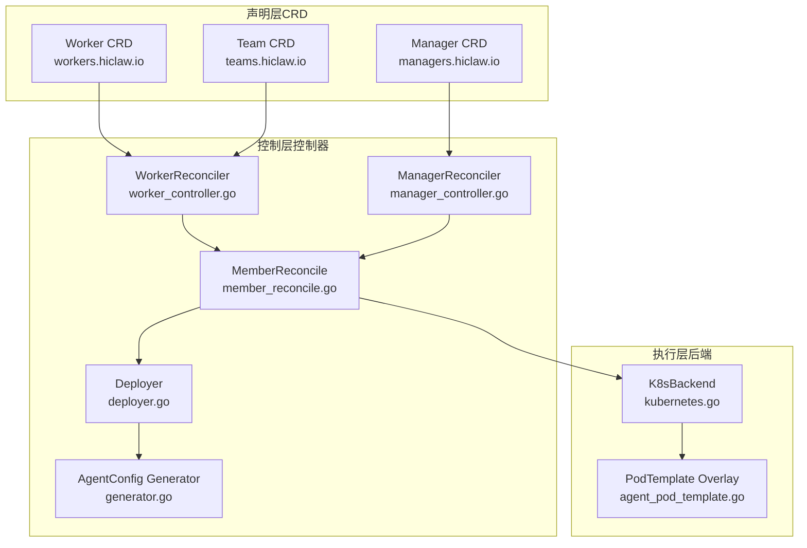
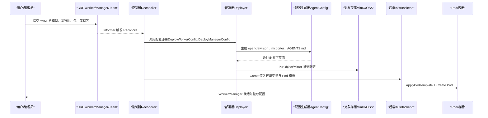
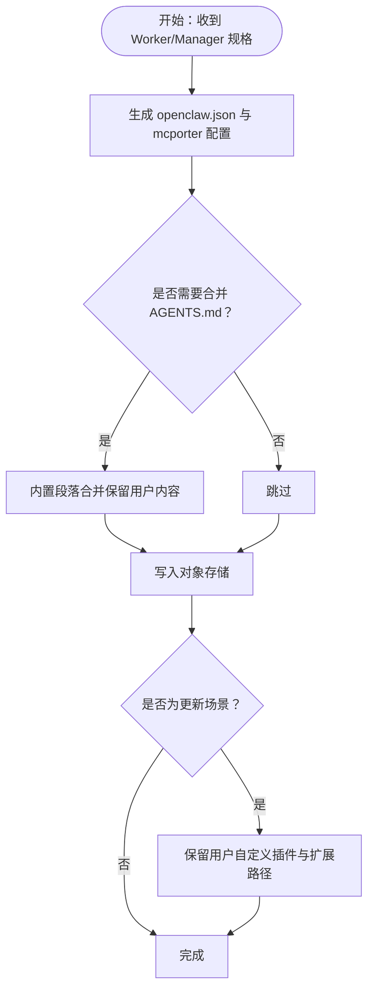
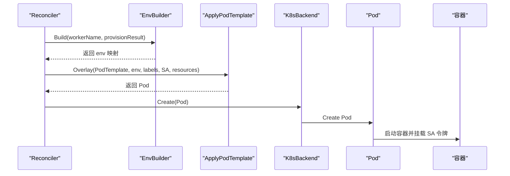
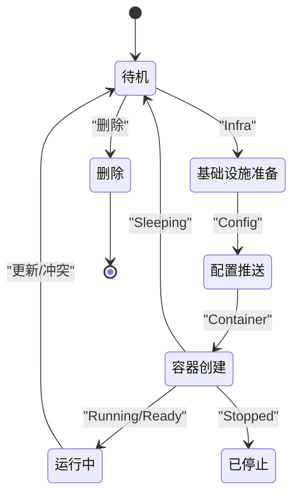
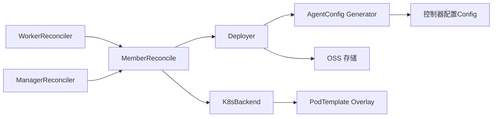

# 配置数据流

<cite>
**本文档引用的文件**
- [types.go](file://hiclaw-controller/api/v1beta1/types.go)
- [workers.hiclaw.io.yaml](file://hiclaw-controller/config/crd/workers.hiclaw.io.yaml)
- [managers.hiclaw.io.yaml](file://hiclaw-controller/config/crd/managers.hiclaw.io.yaml)
- [teams.hiclaw.io.yaml](file://hiclaw-controller/config/crd/teams.hiclaw.io.yaml)
- [generator.go](file://hiclaw-controller/internal/agentconfig/generator.go)
- [types.go](file://hiclaw-controller/internal/agentconfig/types.go)
- [agents_merge.go](file://hiclaw-controller/internal/agentconfig/agents_merge.go)
- [deployer.go](file://hiclaw-controller/internal/service/deployer.go)
- [worker_env.go](file://hiclaw-controller/internal/service/worker_env.go)
- [kubernetes.go](file://hiclaw-controller/internal/backend/kubernetes.go)
- [agent_pod_template.go](file://hiclaw-controller/internal/backend/agent_pod_template.go)
- [member_reconcile.go](file://hiclaw-controller/internal/controller/member_reconcile.go)
- [worker_controller.go](file://hiclaw-controller/internal/controller/worker_controller.go)
- [manager_controller.go](file://hiclaw-controller/internal/controller/manager_controller.go)
- [config.go](file://hiclaw-controller/internal/config/config.go)
- [main.go](file://hiclaw-controller/cmd/controller/main.go)
</cite>

## 目录
1. [简介](#简介)
2. [项目结构](#项目结构)
3. [核心组件](#核心组件)
4. [架构总览](#架构总览)
5. [详细组件分析](#详细组件分析)
6. [依赖关系分析](#依赖关系分析)
7. [性能考虑](#性能考虑)
8. [故障排查指南](#故障排查指南)
9. [结论](#结论)

## 简介
本文件系统性阐述 HiClaw 的配置数据流：从 YAML 配置文件（CRD）到 Worker/Manager 运行时配置的完整链路。内容覆盖配置验证与模式约束、默认值与类型转换、配置生成与合并策略、以及配置注入到 Worker 容器的环境变量、文件挂载与运行时参数传递。同时提供关键流程的时序图与状态转换图，帮助读者理解从静态声明到动态运行时的演进。

## 项目结构
HiClaw 的配置数据流由三层构成：
- 声明层（Declarative Layer）：通过 CRD（Worker/Manager/Team）定义资源规格，包含模型、运行时、包分发、暴露端口、通信策略等字段。
- 控制层（Control Layer）：控制器读取 CRD，执行基础设施、配置与容器三阶段收敛；生成 Agent 运行时配置并写入对象存储。
- 执行层（Execution Layer）：后端根据 Pod 模板与环境变量启动容器，Worker 从对象存储拉取配置文件并运行。

图表来源
- [worker_controller.go:1-407](file://hiclaw-controller/internal/controller/worker_controller.go#L1-L407)
- [manager_controller.go:1-189](file://hiclaw-controller/internal/controller/manager_controller.go#L1-L189)
- [member_reconcile.go:1-485](file://hiclaw-controller/internal/controller/member_reconcile.go#L1-L485)
- [deployer.go:1-678](file://hiclaw-controller/internal/service/deployer.go#L1-L678)
- [generator.go:1-493](file://hiclaw-controller/internal/agentconfig/generator.go#L1-L493)
- [kubernetes.go:1-569](file://hiclaw-controller/internal/backend/kubernetes.go#L1-L569)
- [agent_pod_template.go:1-234](file://hiclaw-controller/internal/backend/agent_pod_template.go#L1-L234)

章节来源
- [workers.hiclaw.io.yaml:1-204](file://hiclaw-controller/config/crd/workers.hiclaw.io.yaml#L1-L204)
- [managers.hiclaw.io.yaml:1-171](file://hiclaw-controller/config/crd/managers.hiclaw.io.yaml#L1-L171)
- [teams.hiclaw.io.yaml:1-351](file://hiclaw-controller/config/crd/teams.hiclaw.io.yaml#L1-L351)

## 核心组件
- CRD 类型与字段约束：Worker/Manager/Team 的字段定义、枚举值、必填项与注释，决定配置的合法性与默认行为。
- 配置生成器：根据控制器配置与 CRD 字段生成 Agent 运行时配置（openclaw.json、mcporter 配置、AGENTS.md 合并等）。
- 部署器：负责将配置推送到对象存储，并处理内置技能、顶层文件与协调上下文注入。
- 环境变量构建器：将集群范围默认值与凭据合并为容器环境变量。
- 后端与 Pod 模板：将控制器计算出的环境变量与模板叠加，生成最终 Pod 并创建容器。

章节来源
- [types.go:1-448](file://hiclaw-controller/api/v1beta1/types.go#L1-L448)
- [generator.go:1-493](file://hiclaw-controller/internal/agentconfig/generator.go#L1-L493)
- [deployer.go:1-678](file://hiclaw-controller/internal/service/deployer.go#L1-L678)
- [worker_env.go:1-136](file://hiclaw-controller/internal/service/worker_env.go#L1-L136)
- [kubernetes.go:1-569](file://hiclaw-controller/internal/backend/kubernetes.go#L1-L569)
- [agent_pod_template.go:1-234](file://hiclaw-controller/internal/backend/agent_pod_template.go#L1-L234)

## 架构总览
下图展示从 CRD 到容器运行时的关键步骤：控制器解析 CRD → 生成 Agent 配置 → 写入对象存储 → 构建 Pod 模板与环境变量 → 创建容器。

图表来源
- [worker_controller.go:106-151](file://hiclaw-controller/internal/controller/worker_controller.go#L106-L151)
- [member_reconcile.go:204-240](file://hiclaw-controller/internal/controller/member_reconcile.go#L204-L240)
- [deployer.go:135-258](file://hiclaw-controller/internal/service/deployer.go#L135-L258)
- [generator.go:25-203](file://hiclaw-controller/internal/agentconfig/generator.go#L25-L203)
- [kubernetes.go:151-313](file://hiclaw-controller/internal/backend/kubernetes.go#L151-L313)

## 详细组件分析

### 1) CRD 验证与类型转换
- 字段约束：CRD 使用 OpenAPI v3 Schema 对字段进行强类型约束（如枚举、必填、格式），确保输入合法。
- 默认值与回退：当 spec.runtime 未设置时，控制器在创建请求中应用回退值（HICLAW_DEFAULT_WORKER_RUNTIME 或 HICLAW_MANAGER_RUNTIME）。
- 类型转换：字符串枚举（如 state、runtime）在控制器侧统一转换为内部状态机或运行时标识。

章节来源
- [workers.hiclaw.io.yaml:14-184](file://hiclaw-controller/config/crd/workers.hiclaw.io.yaml#L14-L184)
- [managers.hiclaw.io.yaml:12-151](file://hiclaw-controller/config/crd/managers.hiclaw.io.yaml#L12-L151)
- [teams.hiclaw.io.yaml:12-329](file://hiclaw-controller/config/crd/teams.hiclaw.io.yaml#L12-L329)
- [kubernetes.go:152-158](file://hiclaw-controller/internal/backend/kubernetes.go#L152-L158)

### 2) 配置生成与合并策略
- 生成器职责：根据控制器配置与 Worker/Manager 规格生成 openclaw.json、mcporter-servers.json、SOUL.md、AGENTS.md 等。
- 合并策略：
  - AGENTS.md：内置段落使用标记包裹，支持保留用户自定义内容；更新时仅替换内置段落，不破坏用户手写部分。
  - openclaw.json：更新时保留用户自定义插件条目与扩展路径，避免因控制器升级覆盖用户配置。
  - ChannelPolicy：对允许/拒绝列表进行加法/减法合并，支持用户名与 Matrix ID 自动解析。
- 模型参数：内置模型参数表与可选覆盖（上下文窗口、最大 token、视觉/推理能力）。

图表来源
- [deployer.go:135-258](file://hiclaw-controller/internal/service/deployer.go#L135-L258)
- [agents_merge.go:7-83](file://hiclaw-controller/internal/agentconfig/agents_merge.go#L7-L83)
- [generator.go:25-203](file://hiclaw-controller/internal/agentconfig/generator.go#L25-L203)

章节来源
- [deployer.go:448-621](file://hiclaw-controller/internal/service/deployer.go#L448-L621)
- [agents_merge.go:14-82](file://hiclaw-controller/internal/agentconfig/agents_merge.go#L14-L82)
- [generator.go:347-492](file://hiclaw-controller/internal/agentconfig/generator.go#L347-L492)

### 3) 配置注入到 Worker 容器
- 环境变量构建：将集群默认值（矩阵域、FS 端点、存储前缀、控制器 URL、AI 网关 URL、管理员用户等）与凭据合并，形成容器环境变量集。
- Pod 模板叠加：控制器将计算出的环境变量与服务账号、资源限制、主机别名等叠加到 Pod 模板，生成最终 Pod。
- 容器创建：后端调用 K8s API 创建 Pod，自动挂载 SA 令牌文件供 Worker 认证使用。

图表来源
- [worker_env.go:19-80](file://hiclaw-controller/internal/service/worker_env.go#L19-L80)
- [agent_pod_template.go:100-158](file://hiclaw-controller/internal/backend/agent_pod_template.go#L100-L158)
- [kubernetes.go:151-313](file://hiclaw-controller/internal/backend/kubernetes.go#L151-L313)

章节来源
- [worker_env.go:1-136](file://hiclaw-controller/internal/service/worker_env.go#L1-L136)
- [agent_pod_template.go:18-158](file://hiclaw-controller/internal/backend/agent_pod_template.go#L18-L158)
- [kubernetes.go:226-313](file://hiclaw-controller/internal/backend/kubernetes.go#L226-L313)

### 4) 多层级配置优先级与冲突解决
- 标签优先级（WorkerSpec.Labels 注释中明确）：pod-template < CR metadata.labels < CR spec.labels < controller 强制标签。键冲突时强制标签覆盖。
- 运行时回退：当 spec.runtime 为空时，按 HICLAW_DEFAULT_WORKER_RUNTIME/HICLAW_MANAGER_RUNTIME 回退，最终回退到 openclaw。
- 插件与扩展路径：更新时保留用户自定义插件条目与扩展目录，避免被控制器升级覆盖。
- 通信策略：ChannelPolicy 的允许/拒绝列表采用集合运算，先合并再过滤，确保最终策略确定且可预测。

章节来源
- [types.go:95-103](file://hiclaw-controller/api/v1beta1/types.go#L95-L103)
- [kubernetes.go:152-158](file://hiclaw-controller/internal/backend/kubernetes.go#L152-L158)
- [deployer.go:556-621](file://hiclaw-controller/internal/service/deployer.go#L556-L621)
- [generator.go:267-345](file://hiclaw-controller/internal/agentconfig/generator.go#L267-L345)

### 5) 从 CRD 到运行时的时序与状态转换
- 时序：控制器读取 CRD → 基础设施与凭据准备 → 配置部署 → 容器创建 → 暴露端口（可选）→ 更新状态。
- 状态转换：Worker/Manager/Team 的状态机在控制器中统一管理，失败时保持健康 Worker 不被标记为 Failed，仅在持久错误时变更。

图表来源
- [member_reconcile.go:242-320](file://hiclaw-controller/internal/controller/member_reconcile.go#L242-L320)
- [worker_controller.go:106-151](file://hiclaw-controller/internal/controller/worker_controller.go#L106-L151)
- [manager_controller.go:126-160](file://hiclaw-controller/internal/controller/manager_controller.go#L126-L160)

## 依赖关系分析
- 控制器依赖：WorkerReconciler/ManagerReconciler 依赖成员协调器（MemberReconcile）、部署器（Deployer）、后端（K8sBackend）、环境变量构建器（WorkerEnvBuilder）。
- 生成器依赖：AgentConfig 依赖控制器配置（Config），并在生成 openclaw.json 时注入矩阵域、AI 网关 URL、管理员用户等。
- 部署器依赖：Deployer 依赖 OSS 存储客户端、包解析器、脚本执行器，负责将配置写入对象存储并同步内置技能。

图表来源
- [worker_controller.go:106-151](file://hiclaw-controller/internal/controller/worker_controller.go#L106-L151)
- [manager_controller.go:126-160](file://hiclaw-controller/internal/controller/manager_controller.go#L126-L160)
- [member_reconcile.go:204-240](file://hiclaw-controller/internal/controller/member_reconcile.go#L204-L240)
- [deployer.go:135-258](file://hiclaw-controller/internal/service/deployer.go#L135-L258)
- [generator.go:25-53](file://hiclaw-controller/internal/agentconfig/generator.go#L25-L53)
- [kubernetes.go:151-313](file://hiclaw-controller/internal/backend/kubernetes.go#L151-L313)

章节来源
- [config.go:647-679](file://hiclaw-controller/internal/config/config.go#L647-L679)
- [main.go:16-36](file://hiclaw-controller/cmd/controller/main.go#L16-L36)

## 性能考虑
- 配置稳定性：openclaw.json 在更新时保留用户自定义插件与扩展路径，减少不必要的重启与重配。
- 资源覆盖：Pod 模板中的资源限制与请求可通过 Overlay 覆盖，避免重复创建容器。
- 并发与幂等：控制器在每个阶段返回结果时进行幂等检查，避免无效重试与状态抖动。

## 故障排查指南
- 配置未生效：检查对象存储中 openclaw.json、AGENTS.md 是否存在；确认 DeployWorkerConfig/DeployManagerConfig 是否成功。
- 容器无法启动：检查 K8sBackend.Create 返回状态与 Pod 日志；确认 Pod 模板叠加后的环境变量与资源设置。
- 权限问题：核对 accessEntries 与凭据提供器配置；确认 MCP 服务器授权头已注入。
- 状态不一致：观察控制器状态更新逻辑，确认失败时不会将健康 Worker 标记为 Failed。

章节来源
- [deployer.go:135-258](file://hiclaw-controller/internal/service/deployer.go#L135-L258)
- [kubernetes.go:151-313](file://hiclaw-controller/internal/backend/kubernetes.go#L151-L313)
- [worker_controller.go:294-309](file://hiclaw-controller/internal/controller/worker_controller.go#L294-L309)

## 结论
HiClaw 的配置数据流以 CRD 为入口，通过严格的模式约束与默认回退保障输入合法性；控制器在基础设施、配置与容器三个阶段实现声明式收敛；配置生成器与部署器采用“生成 + 合并 + 保留用户自定义”的策略，确保升级与更新的平滑过渡；最终通过 Pod 模板与环境变量注入，将配置安全可靠地交付到 Worker/Manager 容器中。该设计在保证灵活性的同时，兼顾了可观测性与可维护性。